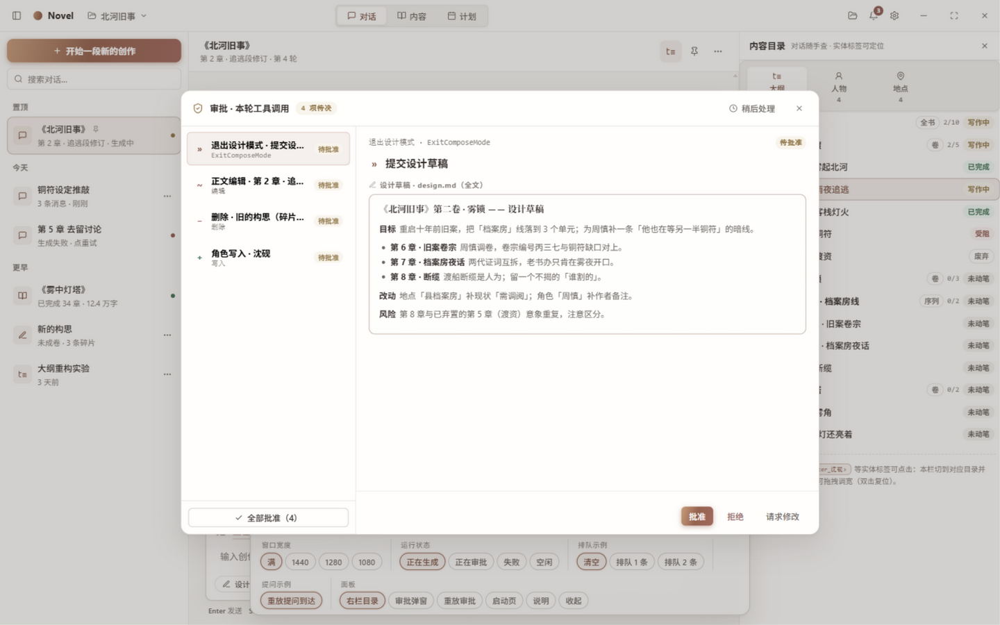
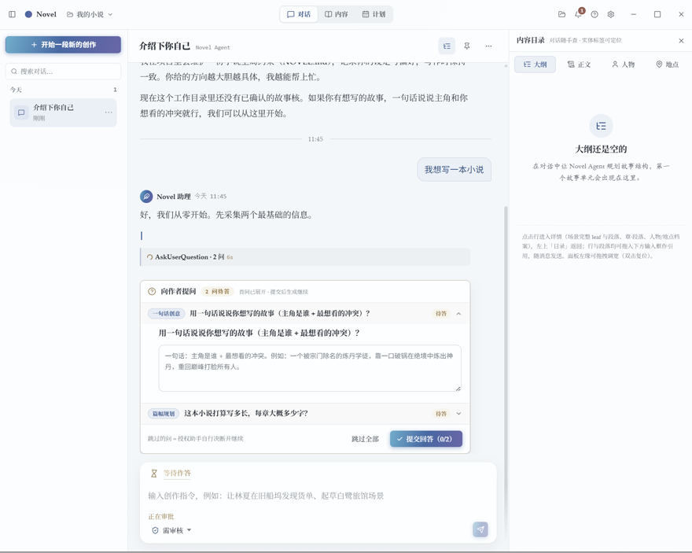
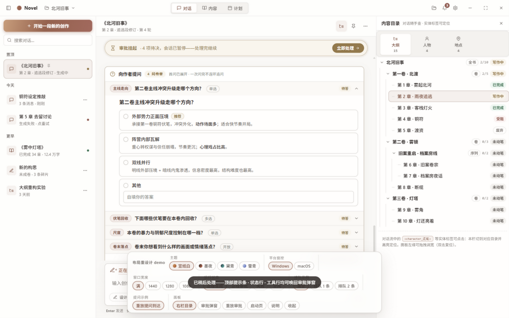
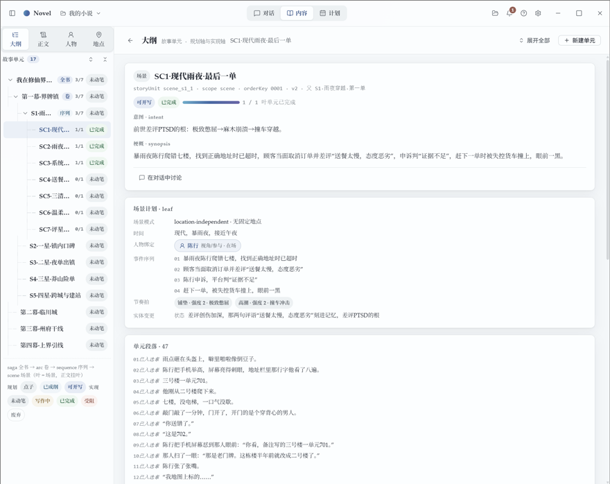
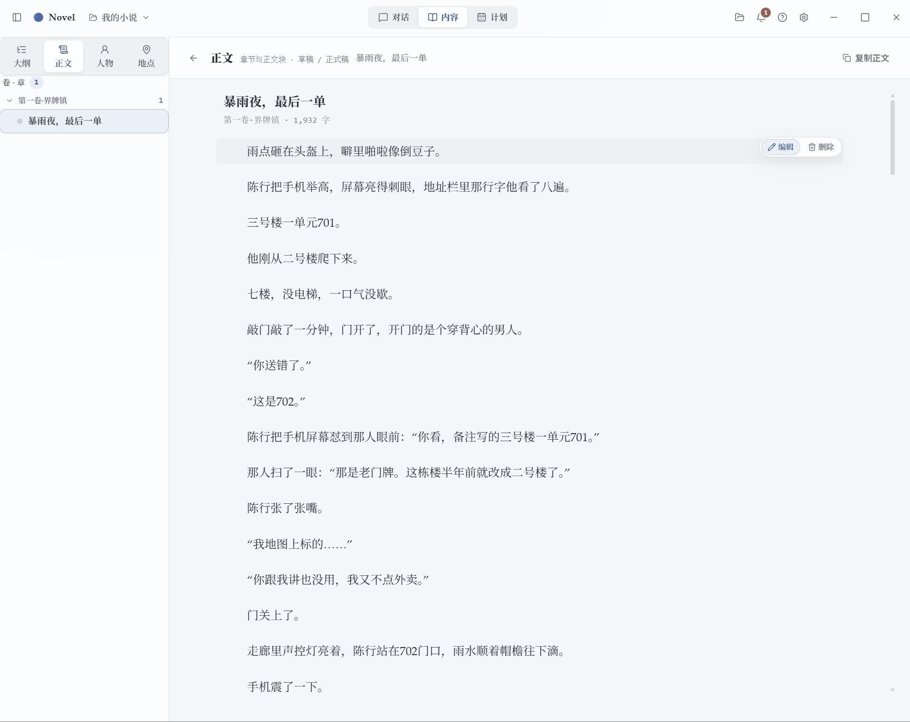
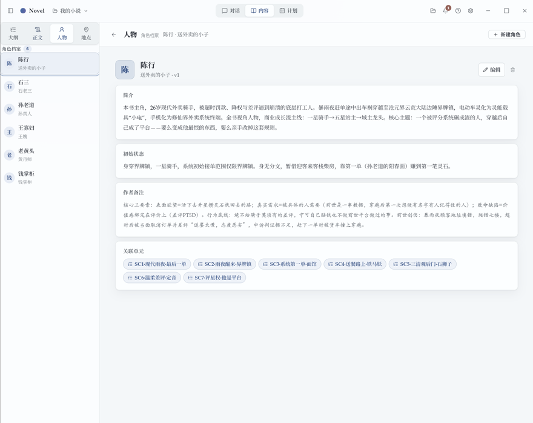
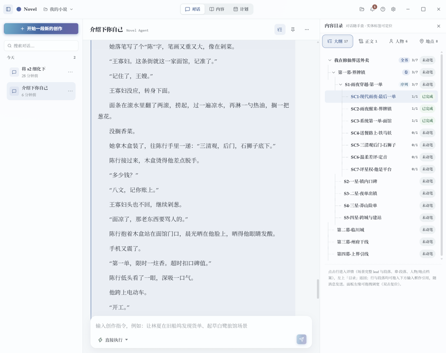
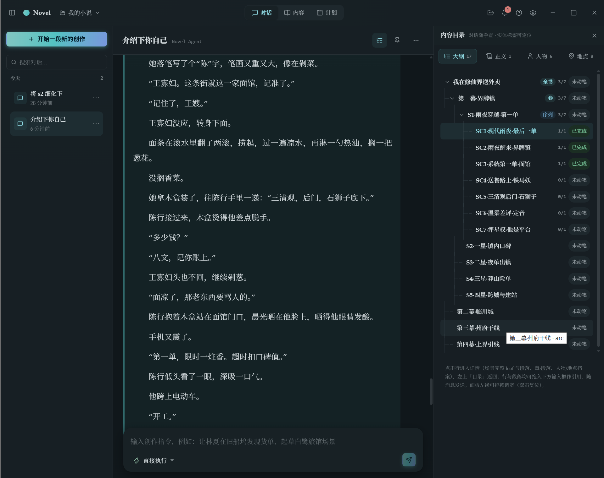
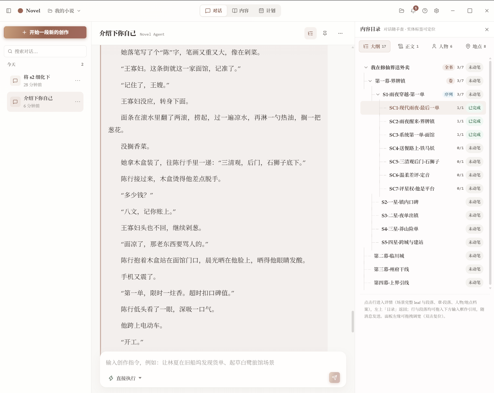
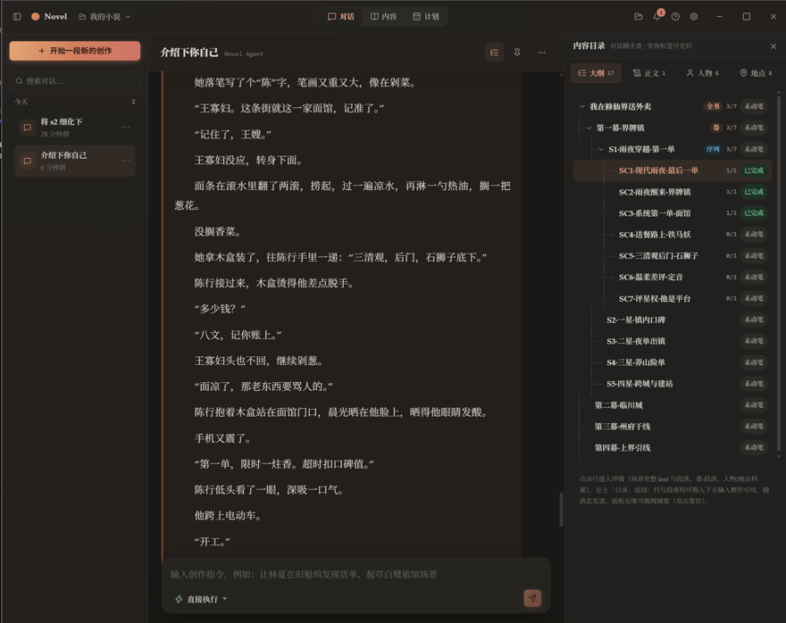

# Nova Writing：A Novel Writing agent harness

> Novel writing agent harness


## 什么是 Nova Writing

它不是又一款自动生成小说的 agent 工具，而是与 AI 共同协作创作中文网络小说的开源桌面应用（目前支持 macOS 与 Windows）。

> ⚠️ **当前是开发版**，正在快速迭代：界面、命令、配置随时会变，可能会出现兼容性问题。

### 1. 数据库就是唯一事实源

全书的人物、地点、大纲、正文统一存于本地 SQLite（每项目一个独立的 `novel.db`），AI 不凭记忆臆造：

- **写前必查**：AI 动笔前先以只读工具查询设定；
- **写时上锁**：写入走双层乐观锁，过期版本直接拒绝；
- **压完仍可查**：上下文压缩后，正文在库中仍有权威版本可随时回查。

### 2. AI 永不未经审批污染正式稿

每个会话有三档模式：

| 模式 | 行为 |
| --- | --- |
| **review · 需审核**（默认） | AI 的所有写库操作按轮汇总成审批清单，你逐条批准 |
| **compose · 设计** | AI 只能写设计草稿（markdown），正式稿只读——大胆想，落笔必须过审 |
| **bypass · 直通** | 免审直接执行，适合信得过的琐碎操作（退出设计模式仍强制审批） |

拿不准的时候，AI 还会反过来用提问卡问你：「主线走复仇还是救赎？」——答案只在你手里。

## 大纲与章节

大纲与章节是两套独立的结构：**大纲是叙事单位，章节是组织 / 发布单位**，正文与大纲不必一一对应。

- **创作基于故事核**：大纲由基本的故事核组成，故事核包括时间、地点、人物、事件、状态变更等，查询大纲即可获取相关的事实源；
- **章节容纳故事核**：一个章节可能包含一个、多个甚至半个故事核，断章由作者决定——按发布节奏断章，不受大纲结构约束。

## 产品速览

| 审批清单 | AskUserQuestions 提问补充信息 |
| --- | --- |
|  |  |
| <sub>写库操作按轮汇总成审批清单，可逐条或全部批准。</sub> | <sub>AI 主动提问采集创意，提问卡阻塞等待你的答案。</sub> |

| 对话 · 拖拽引用 | 内容 · 大纲 |
| --- | --- |
|  |  |
| <sub>右侧目录的实体可拖入输入框，作为引用交给 Agent。</sub> | <sub>大纲是叙事单位，故事核树状组织，查询即取事实源。</sub> |

| 内容 · 正文 | 内容 · 人物档案 |
| --- | --- |
|  |  |
| <sub>章节正文——组织 / 发布单位，按断章节奏组织。</sub> | <sub>人物、地点档案，实体详情与状态变更在此维护。</sub> |

目前支持四种主题色：宣纸白 / 墨夜 / 黛青 / 雪青，可在设置的外观页切换。

| 宣纸白 | 墨夜 | 黛青 | 雪青 |
| --- | --- | --- | --- |
|  |  |  |  |

## 快速开始

前置：Node ≥ 22，pnpm（`corepack enable` 即可）。

```bash
git clone https://github.com/fanghuarunbalala/nova-writing.git
cd nova-writing
pnpm install            # 安装依赖
pnpm build              # 全新构建（先清空 dist，再 core → ui → gui）
pnpm build:incremental  # 增量构建（不清空，快）
pnpm gui:release        # 启动桌面应用
pnpm gui:debug          # 同上，verbose 日志 + 调试模式
```

模型配置二选一：

- **首启引导向导**（推荐）：首次启动自动弹出，预设 DeepSeek / 通义千问 Qwen / Kimi / OpenAI / Anthropic 等快捷卡，支持一键测试连接；之后可在 应用内 **设置 → 模型** 管理多 profile，凭据加密存储；
- 环境变量：`NOVEL_PROVIDER_TYPE`（`openai` / `anthropic`）、`NOVEL_PROVIDER_BASE_URL`、`NOVEL_PROVIDER_API_KEY`、`NOVEL_PROVIDER_MODEL`。

目前没有安装包，需要从源码构建。

## 架构

```
core/  @novel/core   harness 内核：agent loop、上下文压缩、小说域工具、SQLite 存储、多进程运行时
ui/    @novel/ui     React 19 共享展示层（桌面 / Web 通用组件与领域逻辑）
gui/   @novel/gui    Electron 桌面壳（Main / Preload / Renderer）
docs/                PRD、架构文档、开发规范
```

想深入：[docs/architecture.md](docs/architecture.md)（进程拓扑与通信协议）、[docs/PRD/产品总览.md](docs/PRD/产品总览.md)（产品定位与核心流程）。


## 路线图

**当前**：开发版，快速迭代中。核心链路（会话、审批、压缩、存储、桌面应用）已跑通，core + ui 测试全绿；但一切界面与命令随时可能变化。

**正在做 / 接下来做**：

- 🔬 **评测系统**——给「AI 写得好不好」一套可量化的答案，而不是全凭感觉
- 👥 **teammate**——不止一个 AI：多个 agent 并行开工，像真正的创作组一样分工协作
- ⏰ **定时自动化**——每天定时把草稿备好，你早上打开就是一份「待审清单」，review 完再去上班
- ……以及一切让 AI 更像靠谱合作者、而不是随机文本发生器的功能

## 社区与贡献

- 问题与建议：欢迎到 [GitHub Issues](https://github.com/fanghuarunbalala/nova-writing/issues) 提
- 想参与开发：`docs/development/` 下有编码规范与协议文档，欢迎 fork、提 PR

## 开源协议

本项目以 [MIT](LICENSE) 协议开源：任何人可自由使用、修改、分发（含商用），唯一义务是保留版权声明。

---

*数据库不会忘事。AI 记性差一点，没关系——查就是了。*
