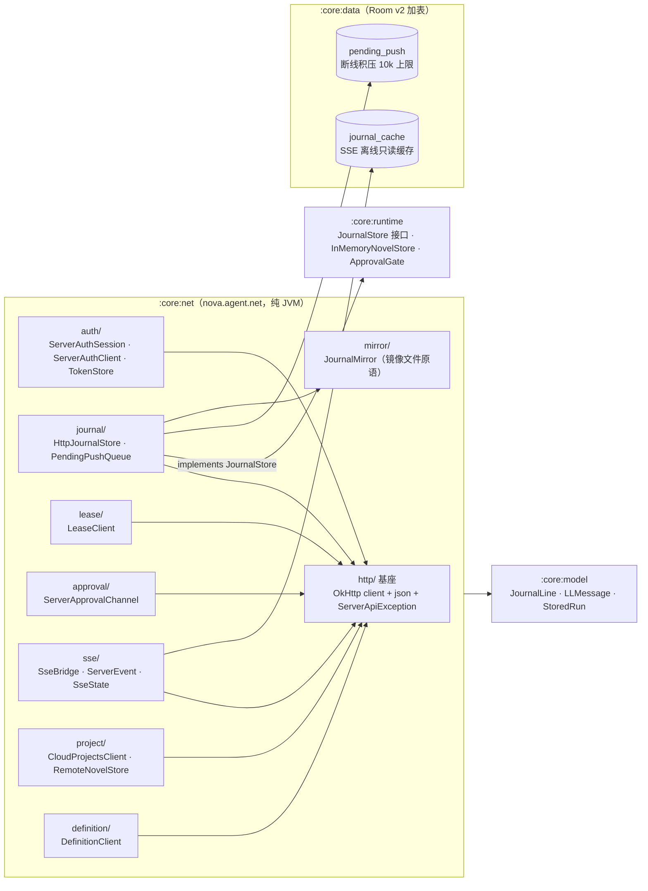
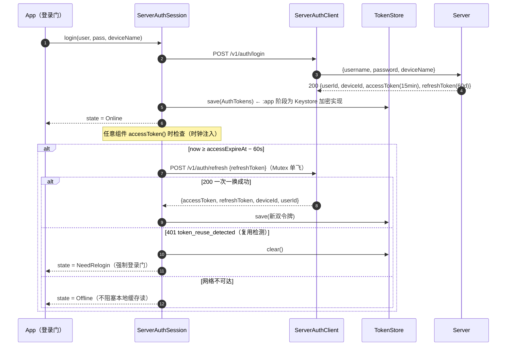
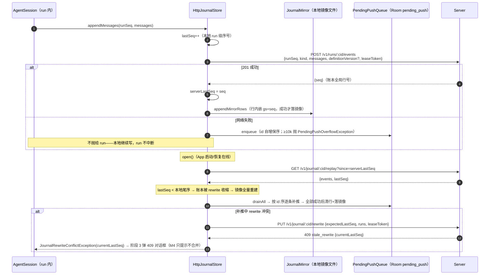
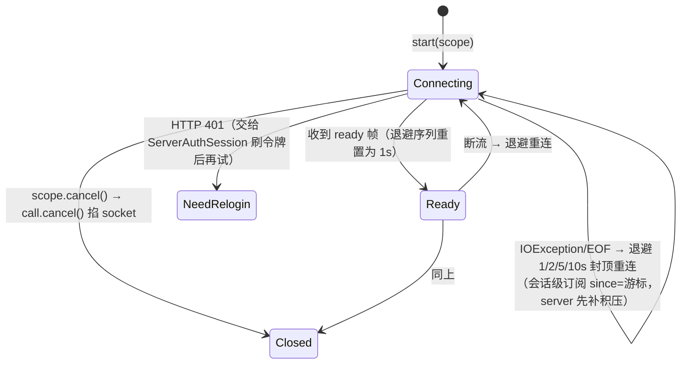
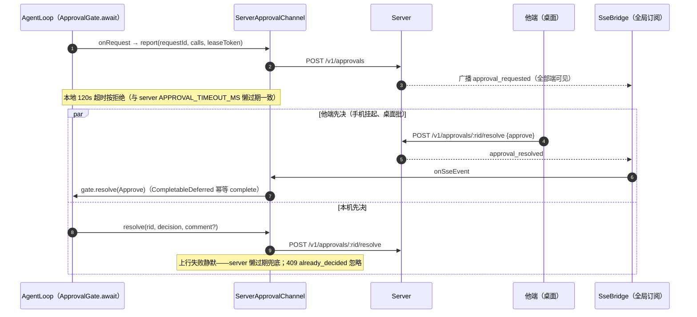
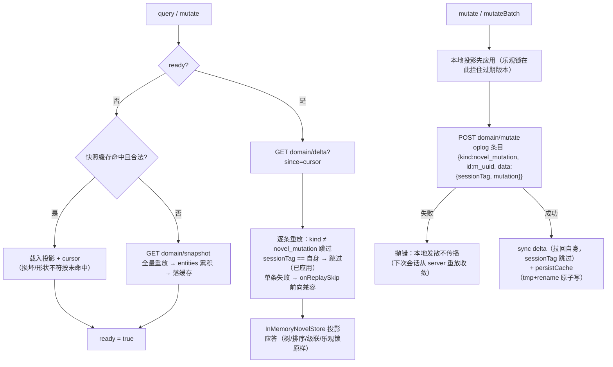

# Android 实施阶段 1 —— :core:net 数据通道 PRD —— v1.0

> 状态：✅ 已定稿并实施（2026-09-11；113 用例全绿 = 既有 47 零改动 + net 新增 66，含三实现契约套件）
> 实现备注见 §6 末尾。
> 关联：总纲 [`Android接入-数据通道server化.md`](./Android接入-数据通道server化.md) v0.2（本阶段是其 FR1-FR8 的实施细化）；
> 契约 [`protocol/cloud-project-api.md`](../../protocol/cloud-project-api.md) v1.1（冻结，端点形状的唯一权威）；
> [`认证-登录与多端会话.md`](./认证-登录与多端会话.md)；[`android-移动端MVP.md`](./android-移动端MVP.md) v0.2
> 阶段系列：阶段 1 本文件 → 阶段 2 `:app` 壳 → 阶段 3 ChatScreen/会话基建 → 阶段 4 内容 sheet/审批中心/设置 → 阶段 5 回归收尾。每阶段先 PRD 后代码。

---

## 1. 背景与目标

- 要解决的问题（痛点 / 现状）：
  1. `clients/android` 四模块（model/provider/runtime/data，47 测试绿）完全本地——`JsonlJournalStore`/`RoomJournalStore` 双实现同契约，但**没有任何网络通道**；「任意端续跑」「手机批桌面审批」「离线只读缓存」停留在 PRD。
  2. server 契约 v1.1 已冻结并经桌面 M3 生产验证（认证双令牌/账本乐观校验/SSE 游标/租约仲裁/审批两段式/云项目域）。Android 侧是**纯客户端工作，无 server 改动**。
  3. 后续 `:app` 壳（阶段 2-4）需要一个可 JVM 全量单测的数据层——不能等到有 UI 才发现协议理解偏差。
- 目标（一句话，可验收）：交付 `:core:net` **纯 Kotlin/JVM 模块（零 Android 依赖）**——认证/账本/租约/审批/SSE/云项目域/定义包全套 REST+SSE 客户端；MockWebServer 单测 + 「Http vs Jsonl vs Room」三实现同契约套件全绿；既有 47 测试零改动通过。
- 关键决策：
  - **零 Android 依赖**：`gradlew test` 桌面秒级验证（延续 `:core:*` 四模块的工程验证路线）；Android 特有物（Keystore）以接口留洞，`:app` 阶段注入实现。
  - **OkHttp 单一网络栈**：复用 `:core:provider` 验证过的手写 SSE 解析 + `call.cancel()` 取消桥模式；**SseBridge 自写不引库**（2026-09-11 已论证：okhttp-sse 无重连/游标、launchdarkly 语义不匹配、Ktor 换栈成本高，而本项目 SSE 用法极简——单行 data 帧 + 注释心跳）。
  - **conversationId 全局唯一**：`conv-<uuid>`（不复刻桌面 `conv_<n>` 每设备自增，防跨端/跨项目撞 server 账本）；**sessionTag 进程唯一**：`<conversationId>-<uuid>`（契约 §5：固定值会让重启后的空投影跳过自身旧操作→丢数据）。
  - 端点形状以 server 源码实测为准（本文 §4 已逐字段核对），契约文档冲突时**先改契约再改码**。

## 2. 用户故事

- 作为阶段 2-4 的 App 开发者，我希望 `ServerAuthSession.state` 直接 collect 出四态（Unconfigured/Online/Offline/NeedRelogin）驱动登录门与连接指示，不需要自己管令牌轮换。
- 作为 App 开发者，我希望 `HttpJournalStore` 实现 `:core:runtime` 的 `JournalStore` 接口——`AgentSession` **零改动**从 Room 切到 server 通道；断网时 run 不中断，恢复后积压自动按序补推。
- 作为 App 开发者，我希望 SseBridge 一条全局订阅同时喂审批中心（他端会话的 approval_requested）、journal 离线缓存与会话只读进度，取消即断流、断线自动退避重连。
- 作为 App 开发者，我希望 `RemoteNovelStore` 对齐桌面投影+oplog 语义（sessionTag 自跳过、快照缓存原子写），内容 sheet（阶段 4）只管读投影。
- 作为维护者，我希望三个 JournalStore 实现跑同一套契约用例，协议回归一眼可见。

## 3. 流程图（必填）

### 3.1 模块与包结构（依赖 DAG，无环）



- `:core:net` 不依赖 `:core:provider`（OkHttp 经验平移，非代码依赖）；settings.gradle.kts 注册后 DAG：`model ← provider ← runtime ← data ← net`。

### 3.2 类图（核心类与关系）

```mermaid
classDiagram
    direction LR

    class ServerApiException {
        +int status
        +String code
        +String message
        +JsonObject extras
    }

    class TokenStore {
        <<interface>>
        +save(AuthTokens) void
        +load() AuthTokens?
        +clear() void
    }
    class FileTokenStore {
        JVM 文件实现（测试用）
        :app 阶段换 Keystore 加密实现
    }
    class AuthTokens {
        +String accessToken
        +String refreshToken
        +String userId
        +String deviceId
        +Long accessExpireAt
    }
    class ServerAuthClient {
        +register(u, p, deviceName) AuthTokens
        +login(u, p, deviceName) AuthTokens
        +refresh(refreshToken) AuthTokens
        +logout(refreshToken) void
        +devices() List~DeviceInfo~
        +kick(deviceId) void
    }
    class ServerAuthSession {
        -Mutex refreshMutex
        +StateFlow~AuthState~ state
        +suspend accessToken() String
        +login(username, password, deviceName) void
        +register(username, password, deviceName) void
        +logout() void
        +devices() List~DeviceInfo~
        +kick(deviceId) void
        -maybeRotate(now) 单飞轮换
    }

    class PendingPushQueue {
        <<interface>>
        +enqueue(cid, kind, runSeq, messagesJson) void
        +drainAll(cid) List~PendingRow~
        +removeBelow(id) void
        +count(cid) Int
    }
    class JournalMirror {
        +appendMirrorRows(path, rows) 尾序 gs 去重
        +rewriteMirrorRows(path, runs) 全量重建
        +seedFromServer(path, fetchReplay) 尾扫+增量
        +tailGs(path) Long
    }
    class HttpJournalStore {
        <<implements JournalStore>>
        -Mutex writeMutex
        -Long lastSeq 本地 run 级
        -Long serverLastSeq 账本全局
        +open() 对账+补推积压
        +appendSnapshot(runSeq, messages, definitionVersion)
        +appendMessages(runSeq, messages)
        +readAll() List~StoredRun~
        +rewriteAll(runs)
    }

    class LeaseClient {
        +acquire(cid) LeaseGrant
        +heartbeatLoop(scope, cid, token) Job
        +release(cid, token) void
    }
    class LeaseGrant {
        +String leaseToken
        +Long expiresAt
    }
    class LeaseHeldException {
        +String holderDeviceId
        +Long expiresAt
    }
    class LeaseLostException

    class ServerApprovalChannel {
        +report(requestId, cid, runSeq, calls, leaseToken) void
        +resolve(requestId, decision, comment?) 静默失败
        +pending(cid) List~ApprovalRecord~
        +onSseEvent(ServerEvent) 幂等合流
    }

    class SseBridge {
        +SharedFlow~ServerEvent~ events
        +StateFlow~SseState~ state
        +start(scope) Job
        -AtomicLong cursor
        -connectOnce() 取消桥
    }
    class ServerEvent {
        <<sealed>>
        Ready / Journal / JournalRewritten
        ApprovalRequested / ApprovalResolved
        LeaseRevoked / LeaseReleased
        FileChanged / DomainChanged / Unknown
    }

    class CloudProjectsClient {
        +list() / create(name) / rename / archive / remove
        +readFile(pid, path) / listFiles(pid, prefix)
        +writeFile(pid, path, content, expectedUpdatedAt?)
        +deleteFile(pid, path)
        +domainSnapshot(pid) / domainDelta(pid, since)
        +domainMutate(pid, cid, leaseToken, mutations)
    }
    class RemoteNovelStore {
        -InMemoryNovelStore projection
        -Long cursor
        -List entities
        +init() 缓存或全量
        +query(q) / mutate(m) / mutateBatch(ms)
        -sync() delta 增量重放
        -upload(ms) oplog 上推
        -persistCache() tmp+rename
    }
    class DefinitionClient {
        +resolve(agentType, caps) DefinitionBundle
        -cacheDir 落盘 + 旧版回退
    }

    ServerAuthSession --> ServerAuthClient : REST 委派
    ServerAuthSession --> TokenStore : 双令牌持久化
    TokenStore <|.. FileTokenStore
    HttpJournalStore --> ServerAuthSession : 取 access
    HttpJournalStore --> PendingPushQueue : 断线积压
    HttpJournalStore --> JournalMirror : 成功上行后写通
    LeaseClient --> ServerAuthSession : 取 access
    ServerApprovalChannel --> ServerAuthSession : 取 access
    SseBridge --> ServerAuthSession : 每连接取 token
    SseBridge --> ServerApprovalChannel : approval_resolved 合流
    RemoteNovelStore --> CloudProjectsClient : domain REST
    RemoteNovelStore --> InMemoryNovelStore : :core:runtime 投影
    DefinitionClient --> ServerAuthSession : 取 access
    ServerApiException <|-- LeaseHeldException
    ServerApiException <|-- LeaseLostException
```

### 3.3 认证会话：双令牌轮换与复用检测（时序）



### 3.4 journal 写路径：上推、断线积压、恢复补推（时序）



### 3.5 SseBridge 连接状态机



- 全局订阅（conversationId=null）：server 不回积压，纯实时流——审批中心靠它收他端会话事件；历史由 3.4 的 REST replay 补。
- 会话级订阅（非空）：`Journal.seq` 推进游标，断线重连幂等补拉；`JournalRewritten` 时**游标归零**（账本收缩，seq 可能变小）。

### 3.6 审批两段式：跨端 resolve 幂等合流（时序）



### 3.7 RemoteNovelStore：投影 + oplog 收敛（流程）



## 4. 功能明细

> 端点形状已逐字段核对 server 源码（auth.ts / ledger.ts / lease.ts / approvals.ts / index.ts / files.ts / domain.ts / definitions.ts）。

- **FR1 认证会话（auth/）**
  - 触发：登录门提交；任意组件取 `accessToken()`。
  - 输入：username / password / deviceName；已存令牌（TokenStore）。
  - 处理：`ServerAuthClient` 纯 REST（register 201 / login / refresh 一次一换 / logout 204 / devices / kick）；`ServerAuthSession` 状态机四态 `Unconfigured/Online/Offline/NeedRelogin`；access 过期前 60s 主动轮换（Mutex **单飞**，并发取 token 不产生重复 refresh——refresh 一次一换，并发用旧 token 会触发复用检测误杀会话族）；401 `token_reuse_detected` → 清令牌 + NeedRelogin；时钟注入 `now: () -> Long`。
  - 输出：`StateFlow<AuthState>`；`accessToken()` 挂起返回有效 JWT。
  - 异常：网络不可达 → Offline（不抛）；register 400 `invalid_username`(3-32 字)/`weak_password`(<8)/409 `username_taken` 原样上抛给 UI。
- **FR2 HttpJournalStore（journal/，implements :core:runtime JournalStore）**
  - 触发：`AgentSession` 写路径（appendSnapshot/appendMessages/rewriteAll/readAll/open）。
  - 输入：`JournalLine` 语义参数 + definitionVersion。
  - 处理：`POST /v1/runs/:cid/events {runSeq, kind, messages, definitionVersion?, leaseToken}` → 201 `{seq}`；`rewriteAll` → `PUT /v1/journal/:cid/rewrite {expectedLastSeq, leaseToken, runs[]}`；`readAll` → `GET replay` 折叠（**坑：events[].payload 是 JSON 字符串，需二次 parse**；snake_case 字段映射）；`open` = replay 对账恢复 serverLastSeq + 积压补推 + 镜像尾扫；写路径 Mutex 串行（对齐 JsonlJournalStore）；本地 `lastSeq` 为 run 级序号（与 Jsonl/Room 语义一致），server 全局行号单独跟踪。
  - 输出：与 Jsonl/Room 同契约的 JournalLine / StoredRun。
  - 异常：断线 → 积压（FR3）；rewrite 409 `stale_rewrite` → `JournalRewriteConflictException(currentLastSeq)`；lease 400/423/410 分类透传（423 lease_taken 提示重取）。
- **FR3 断线积压 PendingPushQueue（:core:data Room `pending_push` 表）**
  - 触发：上行失败；`open()` 恢复。
  - 输入：kind/runSeq/messages(JSON)。
  - 处理：id 自增保序入队；恢复后按 id 序逐条补推、全部成功才清行；补推成功后按 gs 落镜像。
  - 输出：count 状态（UI 断线横幅「待补推 N 条」）。
  - 异常：**≥10k 行抛 `PendingPushOverflowException`**（run 收 FAILED 事件，提示用户裁决）。
- **FR4 JournalMirror（mirror/，对齐桌面 journalMirror.ts 行协议）**
  - 行 = `{seq(本地), gs(server 全局行号), kind, runSeq, messages, ts, definitionVersion?}`。
  - `appendMirrorRows`：追加前重扫尾序，**gs ≤ 尾的行丢弃**（多写者竞态安全）；`rewriteMirrorRows`：全量重建；`seedFromServer`：尾扫 → `replay?since=tailGs` → `lastSeq < 尾` 判收缩 → 全量重建或去重追加。镜像仅供读侧（UI 回显/会话列表 mtime），不参与恢复决策。
- **FR5 LeaseClient（lease/）**
  - `POST /v1/leases {conversationId}` → `{leaseToken, expiresAt, renewed}`；409 `lease_held` → `LeaseHeldException(holderDeviceId, expiresAt)`（UI 只读横幅数据源）；同设备重复 acquire = 续租（server 语义，直接吃 renewed=true）。
  - 心跳循环 20s（< 60s TTL）协程可取消；410 `device_revoked/lease_taken/lease_expired` → `LeaseLostException` → 中止 run 走既有 `settlePendingRun` 恢复语义；`DELETE /v1/leases/:cid {leaseToken}` 幂等 204。
- **FR6 ServerApprovalChannel（approval/）**
  - `POST /v1/approvals {conversationId, runSeq, requestId, calls, leaseToken}`（201；server `ON CONFLICT DO NOTHING` 幂等）；`GET /v1/approvals?conversationId=`（server 惰性过期 pending）；`POST /:requestId/resolve {decision, comment?}`——**失败静默**（server 懒过期兜底）、409 `already_decided` 忽略；SSE `approval_resolved` 与本地 resolve **先到者生效**（ApprovalGate CompletableDeferred 幂等 complete）。本地 120s 超时 = server `APPROVAL_TIMEOUT_MS` 对齐。
- **FR7 SseBridge（sse/，2026-09-11 架构评审结论）**
  - 两层协程：外层重连监督循环（退避 1/2/5/10s 封顶，ready 帧重置）+ 内层阻塞读循环（Dispatchers.IO + ATOMIC + `call.cancel()` 取消桥——平移 OpenAICompatProvider 模式）；专用 OkHttpClient（readTimeout=0，server 15s 心跳兼当活性探针）。
  - 帧：`:` 注释行忽略；`data:` 单行 JSON → `ServerEvent` sealed（9 type + `Unknown` 前向兼容透传）。
  - 订阅模式：会话级（since 游标随 Journal.seq 推进，Rewritten 归零）/ 全局（无积压纯实时，审批中心用）。App 接线 = 一条全局 bridge + 打开会话时 REST replay 补历史。
  - 事件消费：journal → Room `journal_cache` upsert（离线只读）；approval_* → FR6；lease_revoked → FR5；其余透传给 App 层。
- **FR8 CloudProjectsClient + RemoteNovelStore（project/）**
  - projects：`POST /v1/projects {name}`(201)/`GET`(按活跃度倒序，软删不可见)/`PATCH {name?, archived?}`/`DELETE`(软删 204)。
  - files：`GET files/*` `{path, content, updatedAt}` / `GET files?prefix=` / `PUT {content, expectedUpdatedAt?}`（413 too_large / 409 stale_file+currentUpdatedAt）/ `DELETE`；**NOVEL.md 写 403 `novel_md_requires_approval` 原样上抛**（审批提案唯一写径）。
  - domain：snapshot `{cursor, entities:[{id, kind, entityVersion, data, seq, updatedAt, deletedAt?}]}` / delta?since / mutate（≤64 条；409 `stale_revision`+currentVersion）。
  - RemoteNovelStore：本地 InMemoryNovelStore 投影 + oplog 复制（3.7 流程）；sessionTag 进程唯一；快照缓存 `{version:1, cursor, entities}` tmp+rename 原子写。
- **FR9 DefinitionClient（definition/）**
  - 启动时 `POST /v1/definitions/resolve {agentType, capabilities}`（capabilities 从 Kotlin 注册表推导：rendererId 三段 + compact policyId + nudge triggerId + 工具组）→ 缓存 `definitions/<version>.json` → 交给 `DefinitionAssembler` 装配；能力缺口整包拒绝（404 `no_compatible_definition`）→ **回退本地缓存旧版**；definitionVersion 透传 appendSnapshot。
- **FR10 Room v2 加表（:core:data）**
  - `pending_push(id PK 自增, conversation_id, kind, run_seq, messages, created_at)` + `journal_cache(conversation_id+seq 复合主键, run_seq, kind, payload, definition_version)`；AppDatabase version 1→2，既有两表不动，`JournalContractTest` 零改动。
- **FR11 测试基建**
  - MockWebServer 覆盖：auth 全流程（轮换/复用检测/单飞）、HttpJournalStore 全方法（含断线/补推/409/超限）、SseBridge（帧/游标/退避虚拟时钟/取消）、lease 409/410、审批两段式合流、files/domain 全端点。
  - 契约层：`HttpJournalStore vs JsonlJournalStore vs RoomJournalStore` 三实现同用例（append 折叠 / rewriteAll / open 幂等 / lastSeq 语义）。
  - 回归：既有 47 测试零改动通过。

## 5. 边界与非目标

- 明确不做（本阶段）：
  - 任何 UI / `:app` 模块 / AGP（阶段 2 起）；Keystore 加密 TokenStore 实现（本阶段交付接口 + JVM 文件实现）
  - 真 server 集成任务 `connectedServerContractTest`（单独立项）
  - 跨端会话列表（契约 v1.2）；镜像目录扫描的会话仓库（阶段 3，属 App 层）
  - env 双前缀注入表（桌面多进程专属；Android 单进程不适用，等价物为进程内依赖注入）
  - SSE 后台常驻/前台服务保活（阶段 3 FGS）
  - server 任何改动

## 6. 验收标准

- [x] `:core:net` 注册进 settings.gradle.kts，纯 JVM 无 Android SDK 依赖；`gradlew test` 全模块全绿（113 用例），既有用例**零改动**
- [x] FR1：登录/注册落令牌、临过期单飞轮换（并发取 token 仅一次 refresh）、复用检测清令牌转 NeedRelogin、设备列表/踢出（踢本机即吊销）；时钟注入下行为确定
- [x] FR2：snapshot/append 请求体字段与 server 校验逐项对齐；replay payload 二次 parse 正确；open 幂等；readAll 折叠与 Jsonl 一致
- [x] FR3：断线 enqueue 保序、恢复按序补推、全部成功清表、10k 超限抛 PendingPushOverflowException（默认 10_000 可注入小值验证）
- [x] FR2/4：rewrite expectedLastSeq 乐观校验；409 异常携带 currentLastSeq；镜像 gs 尾序去重与收缩重建
- [x] FR5：acquire 409 异常携带 holderDeviceId+expiresAt；心跳 410 分类（onLost 回调后循环退出）；release 幂等静默
- [x] FR6：上报幂等（server ON CONFLICT DO NOTHING）；resolve 失败静默（500/409 already_decided）；SSE 与本地 resolve 先到者生效、后到者不覆盖
- [x] FR7：data 帧/心跳注释/未知 type 三分支；游标推进与 Rewritten 归零；退避序列 1/2/5/10 封顶且成功归零；stop 后无悬挂协程与新请求
- [x] FR8：projects/files/domain 全端点错误码映射（403 novel_md / 413 too_large / 409 stale_file·stale_revision 附当前值）；RemoteNovelStore 缓存命中免全量、sessionTag 自跳过、上推失败抛错、缓存损坏按未命中回退
- [x] FR9：resolve 成功缓存与装配；无兼容包时回退旧缓存（坏缓存文件跳过）
- [x] FR10：Room v2 两表可用（pending_push/journal_cache + MIGRATION_1_2），`JournalContractTest` 不动仍绿
- [x] 三实现契约套件：Http vs Jsonl vs Room 同用例全绿（NetJournalContractTest，含 Recovery 兼容）

### 实现备注（与桌面端的四处有意差异，2026-09-11）

1. **append 网络失败不抛**：桌面 pushChain 异步、错误延迟到 flush；Kotlin 同步上推，按 §3.4「run 不中断」语义入队后直接返回本地行（4xx 仍抛——重试无意义；溢出才抛）。轮换成功补上了 `tokenStore.save`（桌面语义）。
2. **AuthState 四态 sealed**：桌面「3 状态 + needRelogin 布尔」的 Kotlin 呈现；无令牌的已配置态并入 Unconfigured（纯云端登录门以令牌有无为界）。
3. **SSE 用 Authorization header**：OkHttp 可带 header，弃用桌面的 `?access_token=` 查询串（EventSource 历史包袱）；server 两者都支持。
4. **journal_rewritten 游标归零**：桌面靠读侧 REST 重读达成同等效果；Kotlin 在桥内直接归零，重连即全量补拉。
5. 测试基建：MockWebServer 自定义 Dispatcher 的 `request.body.readUtf8()` 会抽干 Buffer（后续 `takeRequest().body` 变空），须用 `snapshot().utf8()`；无参 `takeRequest()` 永久阻塞，轮询场景一律用带超时版本；Dispatcher 路径的 `DISCONNECT_AT_START` 在 4.12 实测不生效（退回默认 200），断线模拟改用 OkHttp 应用拦截器抛 IOException。

## 7. 开放问题

- FileTokenStore 的 JVM 文件实现是否需要简单混淆（仅测试用途，倾向明文 + 文档注明 `:app` 必换 Keystore）
- `journal_cache` 与 `pending_push` 共库（nova.db）还是独立 db 文件（隔离 journal 主表写入压力）——倾向共库 + WAL，Room v2 迁移一并定
- ServerAuthSession 轮换窗口 60s 与 server 15min JWT 的余量取值（桌面同款 1min，沿用）
- SseBridge 全局订阅下 `journal` 事件量随会话数线性增长，App 层是否需要按 conversationId 二次过滤的背压策略（阶段 3 实测后定）
