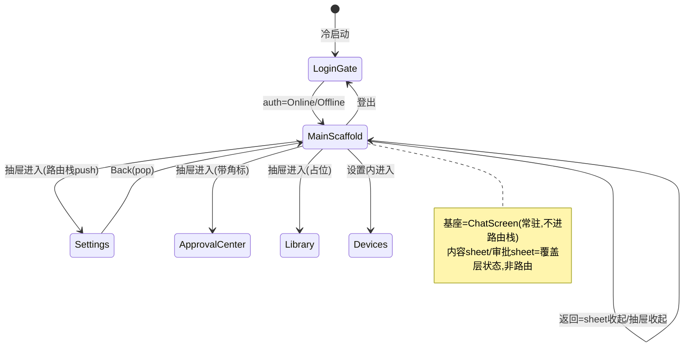
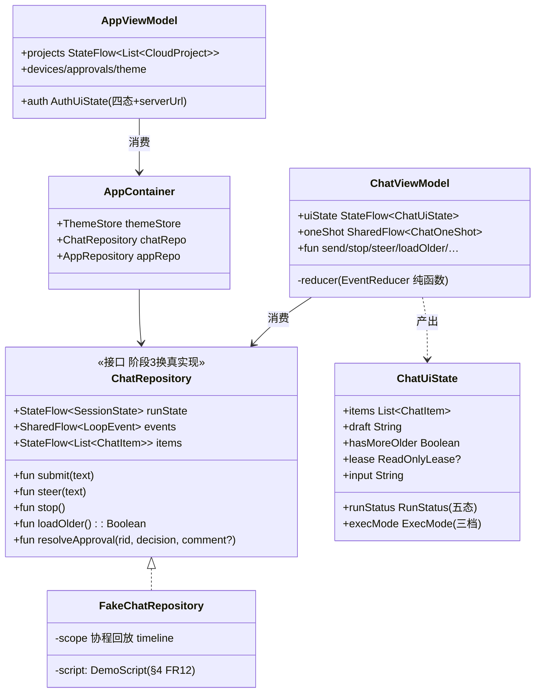

# Android 实施阶段 2 —— :app 壳与六屏 UI(演示数据驱动)PRD —— v0.1

> 状态:✅ 已实施(2026-09-12 交付;两处按 demo 实测修正与截图基线推迟见 §7 实施记录)
> 关联:视觉/交互唯一基准 [`android-app-demo.html`](../../docs/design/android-app-demo.html)(六屏+覆盖层,含状态重放控制条);导航决议 [`android-frame-demo.html`](../../docs/design/android-frame-demo.html) v5;总纲 [`android-移动端MVP.md`](./android-移动端MVP.md) v0.2、[`Android接入-数据通道server化.md`](./Android接入-数据通道server化.md) v0.2;数据层 [`Android实施-阶段1-core-net数据通道.md`](./Android实施-阶段1-core-net数据通道.md) v1.0;结构参照 [android/compose-samples JetChat](https://github.com/android/compose-samples/tree/main/Jetchat)(Apache 2.0)。
>
> **范围调整说明(2026-09-12)**:原计划"阶段2=壳骨架、阶段3=ChatScreen 全量";现将 ChatScreen 的全部 **UI 交互**(打字机 delta、思考动画、工具行、幽灵队列、loadOlder 等)并入本阶段,以**演示数据驱动**(对齐 demo 的"状态重放"思路);阶段 3 改为**真实数据接线**(AgentSession/HttpJournalStore/SSE/FGS/通知/恢复向导)。理由:① UI 与数据的合同(UiState)本来就是分层边界,先冻结合同再接线是标准做法;② demo 是脚本化数据的 HTML,用同样的脚本化数据在真机复刻,视觉对比才能逐步验收;③ 阶段 1 已交付 net 层,UI 阶段不碰协议,风险解耦。

---

## 1. 背景与目标

- 要解决的问题(痛点/现状):
  1. `clients/android` 五模块(model/provider/runtime/data/net,113 测试绿)全部纯 JVM——**没有一行 Android 代码**,demo 的六屏视觉基准还停留在 HTML。
  2. ChatScreen 的核心交互(打字机流、思考动画、工具行三态、幽灵队列)从未在真机验证过可行性;若与数据接线(net/SSE/租约)同时做,出问题时无法区分是 UI 层还是数据层。
  3. 主题 token(demo 的 oklch 值、字体、圆角)需要一次系统性的"CSS→Compose"转译并固化。
- 目标(一句话,可验收):交付 `:app` Compose 工程——**单 Activity + v5 导航 + 四主题 + 登录门 + 六屏全量 UI**,其中 ChatScreen 全部交互由**演示数据脚本驱动**(复刻 demo 场景),数据合同(UiState/Repository 接口)按阶段 3 真实接线设计;`assembleDebug` 出 APK 真机可跑,UI 归并逻辑 JVM 单测全绿。
- 关键决策:
  - **单 Activity + 零 Fragment**(MainActivity 直载 ChatScreen 基座;内容 sheet 用 M3 `BottomSheetScaffold`,demo 中"底部宿主 Fragment"是 View 体系词汇,Compose 等价物即 persistent sheet);
  - **手写极简路由**(sealed Screen + BackHandler,约 50 行),不引 Navigation Compose(屏少、抽屉/sheet 语义为主、与桌面 ApplicationShell 状态驱动同构);
  - **UI-first 演示数据**:`ChatRepository` 接口按 AgentSession 公共面设计,`FakeChatRepository` 按脚本时间线回放 demo 场景;阶段 3 只换实现不动 UI;
  - **手工 DI**(Application 持 `AppContainer`,与仓库 LoopHarness/AppDatabase 风格一致,不引 Hilt/Koin);
  - **主题构建期换算**:oklch→sRGB 用 node 脚本(culori)从 demo CSS 变量生成 `ThemeColors.kt`,不做运行时色彩空间转换;
  - **打字机 = 真 delta 驱动**:复用 runtime 既有 `DeltaCoalescer`(32ms 尾窗合并、累计文本)语义,**不做**逐词假动画(Stream SDK 是 30ms 假放字,我们是 LLM delta 真节奏)。

## 2. 用户故事

- 作为作者,我在真机打开 App:登录门 → 登录表单(可注册)→ 进入会话基座,点"重放演示"看到 AI 流式续写(打字机逐帧出字、深度思考呼吸动画、工具行转秒、审批征询弹出),全程视觉与 demo 一致。
- 作为作者,我点 ☰ 打开抽屉:云端项目列表(演示数据)、新建命名、删除二次确认;审批中心角标;进入设置看到连接四态、设备管理、四主题网格切换即时生效。
- 作为开发者,我在桌面改一个 UiState 字段就能预览对应视觉;阶段 3 接线时 UI 代码零改动(只替换 Repository 实现)。
- 作为维护者,ChatScreen 的事件归并(EventReducer)是纯函数,JVM 单测覆盖,不需要模拟器。

## 3. 流程图(必填)

### 3.1 :app 包结构(依赖 DAG)

```mermaid
flowchart LR
    subgraph APP[":app(nova.agent.app)"]
        di["di/AppContainer<br/>(手工单例:ThemeStore/Repos)"]
        theme["ui/theme/<br/>四 ColorScheme·Typography·字体"]
        nav["ui/nav/AppNavState<br/>(手写路由栈+BackHandler)"]
        login["ui/login/LoginScreen"]
        chat["ui/chat/<br/>ChatScreen 及全部子件(§4 FR7)"]
        drawer["ui/drawer/AppDrawer"]
        settings["ui/settings/SettingsScreen(+Devices)"]
        approval["ui/approval/ApprovalCenter+Sheet"]
        library["ui/library/LibraryScreen(占位)"]
        content["ui/content/ContentSheet(骨架)"]
        vm["ui/vm/<br/>ChatViewModel/AppViewModel(EventReducer)"]
        data["data/ChatRepository 接口<br/>+ FakeChatRepository(脚本回放)"]
    end
    CORENET[":core:net(auth/projects/…)"]:::stage3
    CORERT[":core:runtime(LoopEvent/DeltaCoalescer 契约)"]
    APP --> CORERT
    APP -.阶段3接线.-> CORENET
    classDef stage3 stroke-dasharray: 5 5;
```



### 3.2 v5 导航状态机(返回键优先级:sheet > 抽屉 > 路由栈 > 退出)



### 3.3 delta 数据流(打字机的完整时序,UI 层)

```mermaid
sequenceDiagram
    autonumber
    participant F as FakeRepo(阶段3=AgentSession)
    participant VM as ChatViewModel(EventReducer)
    participant S as MutableStateFlow&lt;ChatUiState&gt;
    participant C as TypewriterDraft(组合)
    participant R as Recomposer(帧时钟)

    F->>VM: LoopEvent.AssistantDelta(textSoFar 累计文本)
    Note over F: 源头已 32ms 尾窗合并(runtime DeltaCoalescer)<br/>≈31 次/秒,UI 层不做二次节流
    VM->>S: state = state.copy(draft = textSoFar)(纯函数 reduce)
    S-->>C: collectAsStateWithLifecycle 触发
    C->>R: draft 组失效,下一帧重组
    R-->>C: 重组:Text(text=draft) 重测/重排/重绘
    Note over C: 重组作用域仅草稿面板一个小组;<br/>caret 闪烁是独立 rememberInfiniteTransition,不触发重组
```

### 3.4 类图(状态持有与数据合同)



### 3.5 登录门(与桌面 NovelApp.loginGate 同构)

```mermaid
stateDiagram-v2
    [*] --> Unconfigured
    Unconfigured --> LoginScreen
    LoginScreen --> LoggingIn: 提交(用户名/密码/deviceName)
    LoggingIn --> MainScaffold: 成功(阶段3接真 auth;演示期直接过)
    LoggingIn --> LoginScreen: 401 invalid_credentials 等错误码回显
    LoginScreen --> RegisterMode: 切注册(同一表单)
```



## 4. 功能明细

### FR1 工程与构建

- `app/build.gradle.kts`:插件 `com.android.application` + `org.jetbrains.kotlin.android` + `org.jetbrains.kotlin.plugin.compose`(2.1.20,与全仓一致);`compileSdk 36 / minSdk 26 / targetSdk 36`;`buildFeatures { compose = true }`;依赖 Compose BOM(以解析时最新稳定为准)+ material3 + activity-compose + lifecycle-runtime-compose(viewmodel-compose)+ `implementation(project(":core:runtime"))`(仅类型契约);测试 junit5 + coroutines-test(EventReducer 纯 JVM)。
- `AndroidManifest.xml`:MainActivity(launcher,`windowSoftInputMode="adjustResize"`,edge-to-edge);**无其他组件**(FGS 是阶段 3)。
- `NovaApplication` 持 `AppContainer`(lazy);Debug 构建注入 `DemoReplayController`(见 FR12)。

### FR2 主题系统(四主题,与 demo token 逐字节对齐)

- **换算管线**:node 脚本(`clients/android/scripts/gen-theme.mjs`,culori)读 demo 的 oklch CSS 变量 → sRGB hex → 生成 `ui/theme/ThemeColors.kt`。示例(示意,以脚本输出为准):paper 主题 `--color-bg oklch(97.9% 0.003 85)` ≈ `0xFFF8F5EF`;`--color-accent oklch(55% 0.072 42)` ≈ `0xFFB4552D`;品牌渐变 `105deg orange→accent→red` → `Brush.linearGradient(orange, accent, red)`。
- 四套 `ColorScheme`(paper/ink/celadon/frost)含语义色(success/warn/danger/info 及 -bg 底色);`NovaTheme(theme, content)` 包根,`MaterialTheme.colorScheme` 全局取色。
- Typography:字号 token 10.5–16.5px→sp 映射;字体栈:Roboto/Noto Sans SC 用系统默认,**楷体(霞鹜文楷)子集化打包**进 res/font(子集化方案见开放问题;演示期允许系统 serif 兜底)。
- `ThemeStore`:DataStore(Preferences)持久化选择,`rememberSaveable` + AppContainer 注入;四主题网格(设置页)即改即生效(根重组换 ColorScheme)。
- 触控目标 ≥48dp、圆角/动效时长 token(sm 6/md 9/lg 14/sheet 20)以 `dimens.kt` 固化。

### FR3 手工 DI(AppContainer)

`Application` 持有;字段:themeStore、appRepo(演示期:内存项目/设备/审批数据)、chatRepo(FakeChatRepository,单会话)、(阶段3 预留位:auth/clients/room)。经 `CompositionLocalProvider(LocalAppContainer provides …)` 提供树级访问;**业务数据仍走参数传递**,Local 仅容器/主题。

### FR4 登录门 + LoginScreen

- 根组件 `NovaApp()` collect `AppViewModel.auth`;Unconfigured/NeedRelogin → LoginScreen;**无"先本地用"出口**(纯云端化)。
- LoginScreen:单一表单(用户名/密码/deviceName 缺省 `Build.MODEL` 汉化)、注册切换(同表单+确认密码)、提交 loading、错误码回显映射(400 invalid_username/weak_password、401 invalid_credentials、409 username_taken——文案与 server 一致);成功态显示 `用户名@server`(演示期 serverUrl 固定演示值);视觉:品牌渐变 logo + Material3 OutlinedTextField + FilledButton(demo 登录屏基准)。

### FR5 v5 导航(AppNavState)

```kotlin
sealed interface Screen { data object Chat; data object Settings;
    data object ApprovalCenter; data object Library; data object Devices }
class AppNavState { var stack by mutableStateOf(listOf<Screen>(Screen.Chat)); push/pop }
```

- 返回优先级:`BackHandler(enabled = sheetExpanded){收}` → `BackHandler(drawerOpen){收}` → `BackHandler(stack.size>1){pop}`;基座 ChatScreen **不进栈**。
- 全屏路由间转场:淡入淡出(demo 的 ease-out 220ms token)。

### FR6 侧边抽屉(AppDrawer,M3 ModalDrawer/DismissibleDrawer)

- 内容自上而下:当前项目卡(书名+进度,点击=展开内容 sheet)→ 云端项目列表(演示数据 3 项;打开=切换角标;新建=命名对话框;删除=软删二次确认)→ 分隔 → 审批中心(角标数=演示 pending 3)→ 书库(占位)→ 设置 → 底部:设备管理入口在设置内、登出(确认对话框)。
- 抽屉宽 306dp(demo `--drawer-w`),四主题下均验证对比度。

### FR7 ChatScreen 基座(本 PRD 核心,视图分解 + Compose 实现)

#### 7.1 视图树

```
ChatScreen(uiState, actions)
├── ReadOnlyBanner(lease)                    他端持租约:dev 名+剩余秒+SSE 进度+「接续」按钮
├── RunStatusBanner(runStatus)               运行五态条(含思考动画,见 7.3)
├── LazyColumn(state=listState, weight 1f)   消息流(loadOlder 头部 + items(key))
│   ├── item { if(hasMoreOlder) LoadOlderRow(onClick/自动触顶) }
│   └── items(items, key={it.id}) {
│         when(it) {
│           UserMsg      → UserBubble(正文衬线字体)
│           AssistantMsg → AssistantBlock(正文+可展开 reasoning 折叠条)
│           ToolLine     → ToolRow(三态,见 7.4)
│           GhostItem    → GhostQueueRow(排队计时,见 7.5)
│           AskCard      → AskCard(占位,阶段4 做真)
│         } }
│   item { TypewriterDraftPanel(draft) }      打字机草稿面板(见 7.2)
├── InputBar(input, execMode, running)        输入区+三档执行模式菜单+发送/停止
└── ContentPeekCard(project)                  底部内容 peek 卡(点开=sheet 展开)
```

#### 7.2 打字机草稿面板(delta 的 UI 终点)

- 数据:`uiState.draft` 即累计文本(见 3.3 时序:AssistantDelta 已 32ms 合并,UI 直接替换、幂等,**无二次节流**——避免引入额外延迟与滞涩感)。
- 视觉:品牌渐变描边容器 `Modifier.border(1.5.dp, Brush.linearGradient(brandColors), shape)` + 内部 `Text(draft, style=bodyLarge serif, maxLines≈8, overflow=Ellipsis)` + 右上角"已生成 N 字"计数 + 内容限定高度(超长草稿仅尾部窗口,见开放问题③)。
- **caret 闪烁**:独立于文本重组——

```kotlin
@Composable
fun Caret(modifier: Modifier = Modifier) {
    val transition = rememberInfiniteTransition(label = "caret")
    val alpha by transition.animateFloat(
        1f, 0f, infiniteRepeatable(tween(520), RepeatMode.Restart), label = "blink")
    Box(Modifier.width(2.dp).height(18.dp).graphicsLayer { this.alpha = alpha }
        .background(MaterialTheme.colorScheme.accent))
}
```

 caret 不消费 `draft`——文本每 32ms 重组时 caret 组不失效(依赖隔离),反之 caret 动画走 draw 层(`graphicsLayer` 读动画值,不触发重组/布局)。
- 性能预算:重组范围=草稿面板一个 restartable 组;32ms 事件 ≈ 30fps 更新 < 60fps 帧率,每帧至多一次;文本重测量 O(面板内文本) 而非全列表。

#### 7.3 运行五态条 + 思考动画

- `RunStatus` 枚举:`Idle / Generating(生成中) / Thinking(深度思考中) / WaitingApproval(正在审批) / WaitingAnswer(等待作答) / FailedRetry(失败重试)`。
- **Thinking 的触发(M4 判定规则,阶段 2 按此实现)**:RunStart 之后、首个 `AssistantDelta`(textSoFar 非空)到达之前 = Thinking;首个 delta 到达即切 Generating。依据:runtime 的 reasoning 瞬时 delta 不上事件流(收口才落 journal),M4 无法感知真实思考流——此为**已知启发式**,阶段 3 若要真实思考流需扩 `LoopEvent`(标注:改动 :core:runtime 契约+测试,非本阶段)。
- 视觉(demo 基准):Thinking = 状态条内 `ThinkingDots`(三点呼吸)+ 文案"深度思考中";Generating = 小 spinner + "生成中 · N 字";WaitingApproval = 指向审批 Sheet 的引导;FailedRetry = danger 色重试按钮。

```kotlin
@Composable
fun ThinkingDots(color: Color) {
    val t = rememberInfiniteTransition(label = "think")
    fun anim(offset: Int) = t.animateFloat(
        0.25f, 1f,
        infiniteRepeatable(tween(480), RepeatMode.Reverse, initialStartOffset = StartOffset(offset)),
        label = "dot$offset")
    val a0 by anim(0); val a1 by anim(180); val a2 by anim(360)
    Row(horizontalArrangement = Arrangement.spacedBy(3.dp)) {
        Dot(color, a0); Dot(color, a1); Dot(color, a2)   // Dot = graphicsLayer{alpha}
    }
}
```

 三点用相位错开(180ms)的同一无限动画——每点是独立 draw 层动画,零重组成本。

#### 7.4 工具行三态(ToolRow)

- 数据:`ToolLine.phase: RUN(ts) / OK / FAIL(error)`;RUN 态显示秒数计时:

```kotlin
@Composable
fun ToolRow(line: ToolLine) {
    Row(verticalAlignment = CenterVertically, modifier = Modifier.padding(vertical = 2.dp)) {
        Text(line.displayName, style = MaterialTheme.typography.labelMedium)
        when (line.phase) {
            is RUN -> { CircularProgressIndicator(Modifier.size(13.dp), strokeWidth = 1.5.dp)
                        ElapsedSince(line.phase.ts) }   // LaunchedEffect 每秒 tick 的 Text
            OK   -> Icon(Icons.Rounded.Check, tint = success, modifier = Modifier.size(14.dp))
            is FAIL -> Icon(Icons.Rounded.Close, tint = danger, modifier = Modifier.size(14.dp))
        }
    }
}
// ElapsedSince:LaunchedEffect(ts){ while(isActive){ 秒=…; delay(1_000) } } —— 离开组合自动取消
```

#### 7.5 幽灵队列(GhostQueueRow)

- 触发:running 期间 `submit(text)` → 生成 `GhostItem(enqueuedAt)`,显示"排队中 · Ns"(同 ElapsedSince 计时,半透明 ghost 样式);run 收口后下一 run 启动时**晋升**:GhostItem 从列表移除、等价 UserMsg 插入(类型变更是纯数据变化,无视图搬移代码)。
- 输入区在 running 时:发送按钮变"排队"(附 +1 角标语义)+ 三档执行模式菜单(需审核/快速执行/仅讨论,demo 三档)。

#### 7.6 loadOlder(顶部前插 + 滚动锚定)

- 正常顺序列表(自上而下,demo 语义),**不用 reverseLayout**(reverse 会翻转滚动/锚定/IME 语义,收益仅免贴底检测);
- 前插锚定:插入前记录 `listState.layoutInfo.visibleItemsInfo.firstOrNull()?.let { it.index to it.offset }`,插入后 `scrollToItem(旧首项新 index, 旧 offset)`——旧首项视觉不动,新内容在其上方展开;
- 贴底跟随:新消息到达时若"最后一项可见 && 用户未上滚"(记录最近滚动方向)→ `animateScrollToItem(lastIndex)`;上滚态不打扰;触顶且 hasMoreOlder → 自动 loadOlder(演示数据 50 run/段)。

#### 7.7 ReadOnlyBanner(只读会话)

`lease(devName, expiresAt, seqProgress)` 非空时显示:持有设备 chip + 剩余秒倒计时(每秒 tick)+ SSE 进度(seq 增长,演示数据模拟)+ 「接续(申请租约)」按钮(demo:点击→409 对话框占位)。

### FR8 设置屏(SettingsScreen,单屏含四区)

- 连接四态 hero:大图标+文案(Unconfigured/Online 显示 `用户名@server`/Offline 重试/NeedRelogin 重新登录按钮);
- 设备管理区:设备列表(演示 3 台,来源端 chip+活跃会话数),踢出=吊销确认(踢本机→回登录门,逻辑与阶段1 SessionTest 语义一致);
- BYOK 区:Base URL/API Key 表单(**阶段 2 仅内存态**,Keystore 加密存储与连接测试属阶段 3/4,标注)、Agent 策略只读"桌面端配置";
- 四主题网格:2×2 预览卡(各主题主色块+名称),点击即切;关于:版本 `0.2.0-stage2`·定义包 1.6.0。

### FR9 审批中心 + 审批 BottomSheet

- ApprovalCenterScreen:pending 列表(来源端 chip+120s 倒计时+摘要),空态文案;点条目→ApprovalSheet。
- ApprovalSheet(M3 ModalBottomSheet+拖拽把手):三类卡(编辑·将被覆盖/新建·无既有数据/删除·将被删除,demo 三色语义),逐项批准/驳回(附意见输入)/整批决策;倒计时归零自动驳回(UI 态);resolve 后卡片收口、原地留痕回填消息流(阶段 2 留痕为演示数据变更)。

### FR10 书库(LibraryScreen)

抽屉入口+空态占位("云端共享书库·契约未定(v1.2)"),列表骨架样式与 demo 书单一致,数据为演示书目 2 条(只读)。

### FR11 内容 sheet(ContentSheet 骨架)

`BottomSheetScaffold(sheetPeekHeight = peek 卡高度)`;sheetContent = segTabs 四栏占位(大纲/正文/人物/地点,tab 可切换、内容为"阶段 4"占位);peek 卡常驻显示书名+进度(demo 基准);返回键收起。

### FR12 演示数据层(FakeChatRepository + DemoScript)

- `ChatRepository` 接口签名**按 AgentSession 公共面设计**(3.4 类图)——阶段 3 的真实现=包一层 AgentSession+HttpJournalStore,UI 零改动。
- `DemoScript` 时间线(复刻 demo《长夜余烬》场景,coroutine `delay` 驱动):

| t(ms) | 事件 | UI 表现 |
|---|---|---|
| 0 | submit("续写第12章追逃段…") | UserMsg + RunStart(Thinking) |
| 0–2200 | (无 delta) | 思考动画呼吸 |
| 2200–8000 | AssistantDelta ×~180(32ms 步进,累计≈420 字) | 打字机逐帧出字 |
| 8000 | ToolCallRequest ×2 | 工具行 RUN 计秒 |
| 8400 | ApprovalRequested | 五态条→正在审批 + 审批 Sheet 弹出(120s) |
| 用户批准后 | ToolCallResponse OK×2 | 工具行 ✓ |
| +600 | AssistantMessage(收口 812 字) | 草稿面板落为正文块 |
| +100 | RunEnd COMPLETED | 五态条 Idle;排队幽灵晋升演示:期间再 submit 触发 |

- `DemoReplayController`(仅 debug):底部悬浮条「重放演示/重置/主题」,对齐 demo 的控制条;release 构建经 BuildConfig 剔除。
- 旁路脚本:断线降级对话框、409 冲突对话框、只读接续,各一个触发按钮(覆盖层视觉验收用)。

### FR13 测试

- **EventReducer 单测(JVM,重点)**:`ChatUiState.reduce(ChatUiEvent)` 纯函数全覆盖——delta 替换幂等/Thinking→Generating 切换点/工具行三态迁移/幽灵晋升/五态映射/loadOlder 前插 items 序;用 `runTest`+虚拟时钟驱动 FakeScript 的确定性断言(如 2200ms 处 runStatus==Thinking)。
- AppNavState 返回优先级单测(纯状态)。
- 主题生成脚本幂等(重跑 diff 为零)。
- (可选,开放问题②)Roborazzi 截图对比 demo 关键屏。
- 回归:既有 113 测试零改动。

## 5. 边界与非目标

- **不接真实数据**:auth/projects/journal/SSE 全部演示实现(`:core:net` 仅类型引用,阶段 3 接线);**不做 FGS/通知/恢复向导/断线真实逻辑**(覆盖层仅为视觉验收的静态触发);
- BYOK 无持久化(内存态);审批 resolve 不上行(本地态);loadOlder 无真分页(演示 2 段);
- 不扩 `:core:runtime` 事件契约(Thinking 启发式);不做提问卡 AskCard 真交互(占位);
- 无深链/多窗口/平板适配/predictive back;不引 Navigation Compose/Hilt/任何聊天库(JetChat 仅结构参照,Apache 2.0,不复制代码)。

## 6. 验收标准

- [x] `./gradlew :app:assembleDebug` 出 APK(✅);Debug 悬浮条「重放演示」完整跑通 FR12 时间线(✅ 代码交付)。**真机/模拟器目检顺延**:本机无设备、无 AVD/系统镜像,六屏对齐目检由持机者执行(或阶段5截图基线补位)
- [x] 打字机:delta 驱动逐帧出字(32ms 累计替换,无二次节流),caret 方波闪烁独立于文本更新(graphicsLayer 隔离);Layout Inspector 重组范围验证随真机目检顺延
- [x] 思考动画:RunStart→首 delta 间为 Thinking;首 delta 后切"生成中·N 字"(⚠ 视觉按 demo 实测修正为「星标浮动+渐变文字+等宽计秒」,非三点呼吸——见 §7 实施记录①)
- [x] 工具行三态迁移与秒计时;幽灵排队计时与晋升(RunStarted 驱动,id 保持锚定);loadOlder 前插滚动锚定(旧首项不动,snapshotFlow 持续记录锚点)
- [x] 四主题网格即点即切,DataStore 持久化;旋转屏幕 ChatScreen 状态不丢(ViewModel+rememberSaveable;真机旋转验证顺延)
- [x] 返回键优先级:sheet>抽屉>路由栈(单 BackHandler+纯函数判定,5 用例);登录门无本地模式出口;登出回登录门
- [x] EventReducer JVM 单测全绿(23 用例:delta 幂等/五态/三态/晋升/前插/映射/时间轴虚拟时间)+ AppNavState 5 用例;既有 113 测试零改动
- [x] 主题 token 由脚本生成(幂等重跑零 diff);四套 ColorScheme 与 demo oklch 的色差为 sRGB 换算差(culuri 权威,源值注释可溯),目检随真机顺延

## 7. 开放问题

1. **楷体子集化**:霞鹜文楷全量 ttf ~9MB;方案 a) fontmin 按常用 3500 字+项目字符集子集(~2MB);b) 演示期系统 serif 兜底、阶段 4 再打包——倾向 a,脚本随主题生成脚本同管线。
2. **截图测试基建**:Roborazzi(纯 JVM 截图,免模拟器)值不值得引入以固化"与 demo 对齐"——若引入,六屏各 1-2 张基准;倾向引入(对齐是本阶段核心验收)。
3. **超长草稿渲染**:draft 面板 maxLines 截断 vs 尾部 500 字窗口 vs 全文内滚;倾向尾部窗口+计数(全量在收口后的正文块)。
4. BottomSheetScaffold 的 peek 卡与 IME 同时出现时的避让(adjustResize 下 sheet 收到 peek 高度)——真机验证后定,必要时 peek 卡在键盘弹出时隐藏。
5. 抽屉用 ModalDrawer 还是 DismissibleDrawer(demo 是可划出的 modal 形态)——实现期按交互手感定。

## 7. 实施记录（2026-09-12 交付）

**测试版图**：`:app` 新增 28 用例全绿（EventReducer 13 + LoopEventMapping 4 + FakeChatRepository 时间轴 6 + AppNavState 返回优先级 5）；既有 113 用例零改动（`./gradlew test` 全工程回归绿）。`assembleDebug` 出 APK。

**开放问题落定**：①楷体子集化=打包（GB2312 一级 3755 字+标点，pyftsubset 1.73MB，OFL 附授权于 `app/LICENSES/`）；②Roborazzi=引入未成，本机 Robolectric RNG 渲染损坏（见下⑦）推迟阶段5；③长草稿=尾部 500 字窗口+计数；④peek 卡避 IME=代码就位待真机；⑤抽屉=ModalNavigationDrawer（demo 即 modal 遮罩形态）。

**对本文档的两处实现修正**：
1. **思考动画视觉以 demo 实测为准**：FR7.3 草图的「ThinkingDots 三点呼吸」在 demo（android-app-demo.html `.genRow.thinking`）中实为**星标图标上下浮动（bob 1.5s）+ 品牌渐变文字（`--grad-accent` clip）+ 等宽计秒**；按 demo 实现（`RunStatusBanner.kt`），渐变文字用 `TextStyle(brush=…)`。打字节奏保持 32ms 累计 delta（≈2.3 字/跳，与 runtime 契约一致）；demo 的 60ms/2 字仅是其自身节奏，未复制。
2. **ChatRepository 接口收缩**：类图 3.4 中的 `items: StateFlow<List<ChatItem>>` 未实现——FakeRepo 在 init 时把历史以 LoopEvent 零延时回放（SharedFlow replay=256），经 `mapLoopEvent` 同一通道上屏，历史与交互同构、reducer 以 id 幂等去重；阶段3真实回放复用同路径。

**其他实现备注**：
3. 审批卡富数据走 `ToolCall.arguments` JSON 载荷（`{op,title,current,change,origin}`），`mapLoopEvent` 解析、失败回落保守占位——阶段3真实工具的变更载荷共用此通道。
4. 主题脚本（`scripts/gen-theme.mjs`，culori）：oklch 亮度百分比需归一化（culori 不认 `97.9%` 形态）；rgb 输出为 0–1 浮点域需 ×255；`color-mix(in oklab)` 派生 token 在脚本内按同语义计算。生成的 sRGB 与浏览器 gamut-mapping 有细微差（如 paper accent `0xFF966350` vs 浏览器观感），以脚本输出为权威、源 oklch 留注释。
5. 构建坑：AGP 8.13.0（Gradle 8.14.3 ✓/max API 36.1 ✓/JDK17 ✓）与根工程 `kotlin.jvm apply false` 的类路径冲突，需根 `build.gradle.kts` 同时 `apply false` 声明 `kotlin.android`/`android.application`/`kotlin.compose`；Compose BOM 用 2025.06.00（与 Kotlin 2.1.20 同代；2026.08.00 带更高版本元数据有读取风险）；`:app` 需 `kotlin.serialization` 插件（审批载荷解析）；pluginManagement 需补 google 仓库（AGP 解析）。
6. 楷体源字体经 ghfast 镜像拉 GitHub release（npm webfont 包只有 woff2 切片、GitHub 直连超时）；子集 3906 字符 1.73MB。
7. **Roborazzi 截图基线推迟阶段5**：基建全部跑通（JUnit4 测试经 vintage 引擎在 JUnit5 平台执行、`recordRoborazziDebug` 16 张基线成功落盘），但**本机 Robolectric RNG 渲染损坏**——纯色 Box 探针也输出乱码像素（4.14.1 与 4.16 同症），基线不可信故删除。版本目录保留条目（roborazzi 1.40.0 需注意 1.7x 系为 Kotlin 2.3 编译）。阶段5 用模拟器/真机或 CI 重试；也因此「六屏对齐目检」整体顺延持机者。
8. 测试基建发现：`runTest` 的 `backgroundScope` 协程不保证被 `advanceUntilIdle` 推进（收集器静默饿死），假仓库测试改为 TestScope 子协程 + finally 显式取消（无限 collect 会让 runTest 等待超时）。
9. 幽灵晋升=纯数据变更（GhostItem→UserMsg 同 id 替换，LazyColumn 键稳定）；自动接续由 FakeRepo 收口 finally 驱动下一个 run 的 RunStart。
10. 时间轴相对 PRD 表的一处放宽：工具调用 ×3（PRD 写 ×2）以覆盖三型审批卡视觉；节奏不变。
