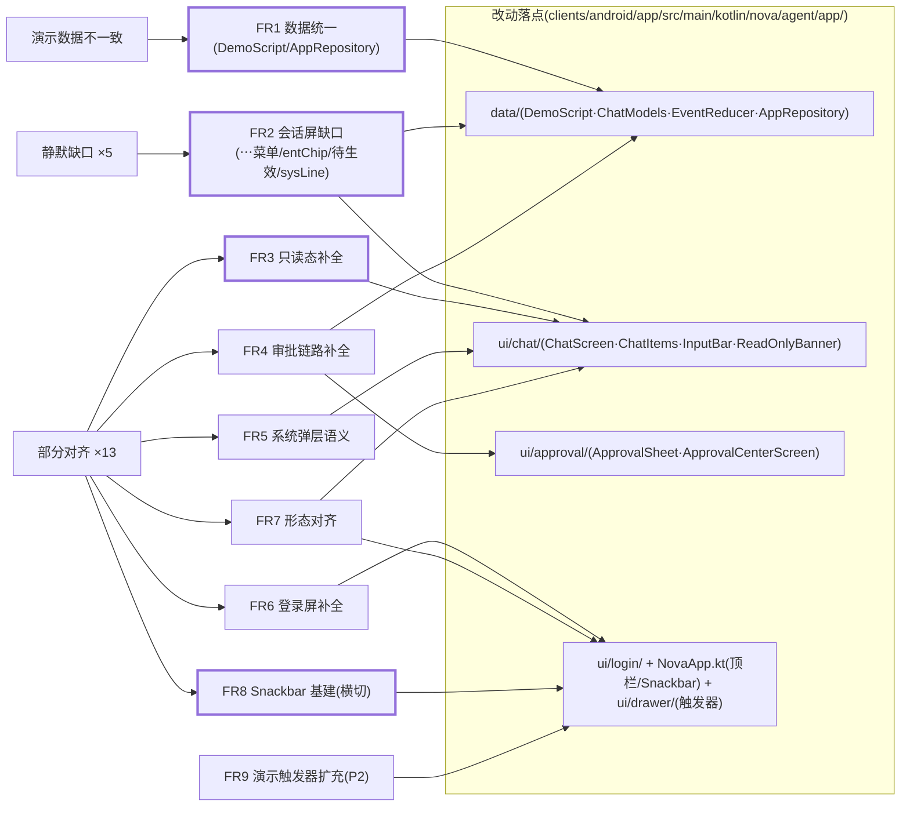
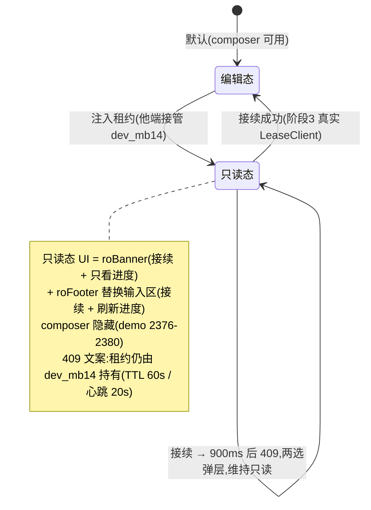
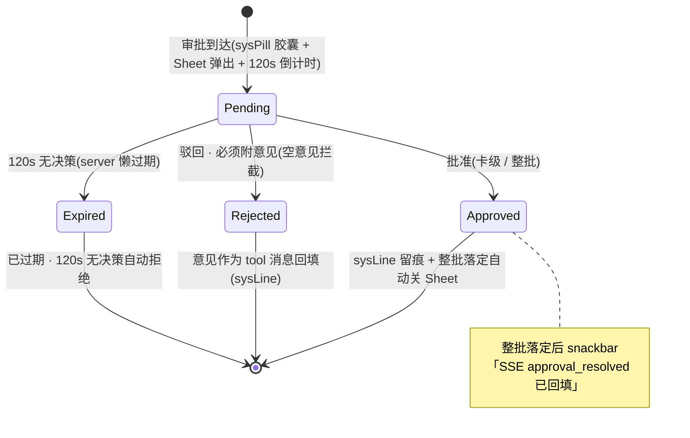

# Android 实施阶段 2 补 —— demo 对齐修复(静默缺口 + 行为偏差 + 演示数据统一)PRD —— v0.1

> 状态:✅ 已实施(2026-09-13 交付,分支 `feat/android-stage2p-demo-align` 六个提交;测试/构建验证见 §8 实施记录,真机并排目检顺延持机者)
> 关联:视觉/交互唯一基准 [`android-app-demo.html`](../design/android-app-demo.html)(本 PRD 所有"demo 行为/行号"均指该文件);上游 [`Android实施-阶段2-App壳与六屏UI.md`](./Android实施-阶段2-App壳与六屏UI.md) v0.1;数据层 [`Android实施-阶段1-core-net数据通道.md`](./Android实施-阶段1-core-net数据通道.md);总纲 [`android-移动端MVP.md`](./android-移动端MVP.md) v0.2;真机反馈修复提交 `7cf5ef39`。
>
> **背景一句话**:阶段 2 交付后对 demo 基准逐项审计(2026-09-13),发现 **5 处静默缺口**(demo 有、App 无、且无"阶段 N"占位注释)、**约 13 处部分对齐**(实现了但行为/形态不同)、**演示假数据整套不一致**——直接违背阶段 2 PRD 范围调整说明的立项理由②"用同样的脚本化数据在真机复刻,视觉对比才能逐步验收"。本 PRD 在**不动阶段 3/4/5 边界**的前提下收敛这些差异。

---

## 1. 背景与目标

- 审计结论(三类问题,详细逐项见 §4 各 FR 内的"demo 基准 / App 现状"对照):
  1. **静默缺口 ×5**:顶栏「⋯」菜单、实体胶囊 entChip、三档模式「待生效」语义、审批卡版本过期条 verBanner、驳回必须附意见(App 现语义相反:明确"可选")。五者均无占位注释,属实现遗漏而非计划顺延。
  2. **部分对齐 ×13**:只读态缺次动作且输入区未禁用、sysLine 留痕缺失、loadOlder 无「已至开头」终态(且耗尽后按钮残留失效)、审批无「已过期」第三态、全 App 无 Snackbar/Toast(demo 大量操作反馈走 2.6s snackbar)、409 缺两选裁决、断线缺降级语义、登录屏缺五项增强、审批中心行缺倒计时/meta、顶栏标题与连接胶囊形态、pauseBtn 显隐规则等。
  3. **演示数据不一致**:会话故事线(App=灰烬·第 12 章 vs demo=沈砚·第 2 章·第 3 轮)、云端项目、设备清单、书库书目、服务器/账号、租约参数——逐字段对照见 FR1 表。**偏差源头是阶段 2 PRD 的 FR12 时间线表自写"续写第 12 章"**(demo 基准实为第 2 章),App 忠实实现了 PRD 却偏离了 demo;本 PRD 一并勘误。
- 目标(一句话,可验收):**把 :app 与 `android-app-demo.html` 的差异收敛到"仅剩显式占位项"**——六屏逐屏并排对照(demo 浏览器 vs 真机/模拟器),台词、数据、交互、反馈全部一致;差异仅存于已有"阶段 3/4"注释声明的占位。
- 关键决策:
  - **修复方向一律以 demo 为准**;demo html 本身不改(基准冻结,除非发现 demo 自身 bug 单独议);
  - **两处有意偏离记档不修**:①App 关于块版本号保留自述 `0.2.0-stage2`(demo 的"0.1.0 (M4 demo)"是 demo 稿水印);②触顶自动翻页 loadOlder 保留(阶段 2 PRD FR7.6 已定的真机体验增强,与 demo 显式按钮并存,不冲突);
  - **全部仍是演示数据驱动**:不接真实网络/FGS/通知(阶段 3)、不做内容四栏/阅读视图/AskCard 真交互(阶段 4)、不补截图基线(阶段 5);
  - Snackbar 作为横切基建先落(FR8),各 FR 的操作反馈统一走它——否则逐项修复后的交互仍"没有回声"。

## 2. 用户故事

- 作为持机验收者,我把 demo(浏览器)与真机并排,从登录门到会话、审批、只读、断线逐屏走查:同一屏的台词、书名、章号、设备名、seq、倒计时完全一致,交互反馈(待生效提示、驳回拦截、SSE 回填)逐条可见。
- 作为作者,生成中我想换执行模式:选"直接执行"后看到"待生效"黄 chip,知道它随下一条消息生效,而不是立刻改变当前运行中的轮次语义。
- 作为作者,他端接管会话时:我的输入区被"接续/刷新进度"底部栏替换(不能再打字),横幅上有"只看进度"让我安静跟随;点"接续"看到与 demo 同款的 409 两选弹层。
- 作为审批人,我驳回一项写入时**必须**附意见(空意见被拦下并提示"它会回填给运行中的会话");120 秒不决策看到的是"已过期 · 120s 无决策自动拒绝(server 懒过期)",而非"已驳回"。
- 作为维护者,EventReducer 新增语义(待生效/留痕行/过期三态/断线排队)全部是纯函数单测,不需要模拟器。

## 3. 流程图(必填)

### 3.1 修复项分层(三类问题 → FR → 落点)

### 3.2 只读态状态机(FR3,demo `setReadonly` 2376-2399)

### 3.3 审批决策三态机(FR4,demo 2211-2350)

## 4. 功能明细

> 每个 FR 内含:demo 基准(行号)/ App 现状(文件:行)/ 修复方案 / 验收点。优先级:P0 = 必修(数据与行为正确性),P1 = 应修(语义完整性),P2 = 可选(验收效率)。

### FR1(P0)演示数据统一 —— 台词与数据整套对齐 demo

**App 现状**:`data/DemoScript.kt:10,29-33`(灰烬·第 12 章)、`data/AppRepository.kt:105-117`、`ui/library/LibraryScreen.kt:29-32`、`di/AppContainer.kt:53-59`。

逐字段对照(以 demo 数据段为准抄录,台词原文以 `chatBody` 1155-1222 与 `defaultCards` 2247-2269 为准):

| 数据项 | demo 值(行号) | App 现值 | 动作 |
|---|---|---|---|
| 会话主线 | 沈砚 · 第 2 章「追逃段」修订 · 第 3 轮 · conv_2 · run #47 · seq 213 · 模式"需审核"(1113-1116) | 灰烬 · 第 12 章(DemoScript) | DemoScript 全线改写 |
| 用户消息/工具行文案 | 「NovelWrite · 第 2 章 · 追逃段 · 提请审批」等(1164,1205-1207) | 自拟 | 从 demo 抄录 |
| 审批批次 | `approval:conv_2:47:b2` 三卡:NovelEdit 沈砚档案 v2→v3(edit,**含 stale 版本过期**)/ NovelWrite 正文第 2 章追逃段草稿 812 字(add)/ NovelDelete 废弃渡口碑(del)(2247-2269) | 3 卡但内容自拟、无 stale | 卡数据改写(含 `baseVersion/staleVersion` 字段,配合 FR4) |
| 打字机草稿 | **DRAFT_TEXT 实为约 114 字**(L2153);「草稿 812 字」只是审批卡标题/阅读视图的叙事元数据 | 自拟 | 抄录 114 字原文;收口正文=阅读视图草稿三段(P1/P2/P3) |
| 轮次分隔线 | 「第 1/2/3 轮 · …」(1161,1202)(**实施期增补的审计漏项**) | 无对应类型 | 新增 `ChatItem.RoundLabel`;历史回放与 run 开始时插入 |
| 云端项目 | 长夜余烬 + 雾都异闻录(1611-1619) | 长夜余烬/雾河纪年/巴别塔维修手册 | 改为 2 项;**保留** App 已实现的新建/软删内存操作(demo 对第二项目仅 snackbar 占位,属 demo 稿自身无数据,App 为超集增强) |
| peek 卡进度文案 | 「卷一 12/26 章 · 今天 21:02 更新」(1282-1294) | 「12 / 30 章」 | 改文案与口径 |
| 设备清单 | Pixel 9(本机)/ MacBook Pro · dev_mb14(**持有 conv_2 租约**)/ iPad · dev_ip02(1504-1522) | Pixel 9 Pro/MacBook Pro 14/旧手机·备机 | 改 3 台 |
| 租约参数 | dev_mb14 · 剩余 46s 起倒计时 · TTL 60s / 心跳 20s(1148,2396) | MacBook Pro 14 · 55s · seq 1284,无 TTL/心跳 | 对齐;`ReadOnlyLease` 增 `ttlSec/heartbeatSec` 供 409 文案(FR3) |
| 书库书目 | 长夜行(142 章/310 万字/幕 24/人物 31)/ 雾都十夜(68 章/94 万字)(1453-1464) | 雾都灯影录/南疆异闻补遗 | 改 2 条 |
| 服务器/账号 | `fang@192.168.1.8:8787` · 设备名 Pixel 9(1479-1486 等) | `https://nova.example.net` | `DEMO_SERVER` 改为 `http://192.168.1.8:8787`,成功态/connHero 文案随之 |
| 审批中心待办来源 | 来源 chip「桌面端 · dev_mb14」(2361-2371) | 「桌面端 · 14:02」 | 改 |
| loadOlder 历史段文案 | 前插「第 1 轮 · 开卷核对」· 终态「已至开头 · 8 月 28 日开卷」(1157-1160,2496-2505) | 模板化生成 | 首段与终态文案对齐 |
| 版本号 | 0.1.0 (M4 demo)(1561) | 0.2.0-stage2 | **不修**(有意偏离,demo 稿水印) |
| 设置页服务器组/BYOK 只读行 | 「服务器」组(地址行+需重登态行,1489-1499)+ 模型/连接测试/Agent 策略三个只读展示行(1525-1549)(**实施期增补,原 PRD 漏列**) | 缺 | 增补:静态展示行+两条点击 snackbar;可编辑字段仍仅 Base URL/API Key(内存) |

**验收点**:demo 浏览器与真机同屏并排,FR1 表内每一行肉眼一致。

### FR2(P0)会话屏静默缺口

| # | 缺口 | demo 基准 | App 现状 | 修复方案 |
|---|---|---|---|---|
| 2.1 | 顶栏「⋯」菜单 | moreBtn+popMenu(1120-1140):①静态信息行「会话信息 conv_2 · 需审核 · seq 213」②「导出本轮 Markdown」③「清空上下文 · 新一轮」 | 顶栏只有汉堡/标题/铃铛,无菜单(NovaApp.kt:215-253) | 顶栏加 MoreVert 图标 + DropdownMenu 三项;导出=本地拼接当前轮 Markdown 走系统分享面板(形态见开放问题①);清空=重置演示脚本 + sysLine 留痕 |
| 2.2 | 实体胶囊 entChip | 正文内「沈砚」「北桥渡口」为可点 chip → `goEntity` 跳内容 sheet 对应档案(1007-1013,1165,2691-2697) | 助手消息纯 `Text`(ChatItems.kt:117),无实体标注 | DemoScript 消息增静态实体标注(实体名+目标 tab);AssistantBlock 按标注切段,实体段渲染为内联 pill(背景色+圆角),点击→展开内容 sheet 并切到人物/地点 tab(**档案详情落点仍属阶段 4**,本 PRD 只做到 tab 定位) |
| 2.3 | 三档模式「待生效」 | 选新模式仅显示 warn 色 pendModeChip「待生效」+ snackbar「执行模式将随下一条消息生效」,发送时 `applyModeIfPending` 才切(1258-1260,2070-2080,2105-2111) | DropdownMenu 选中即生效(InputBar.kt:86-101,EventReducer.kt:127) | `ChatUiState` 增 `pendingExecMode`;选中≠生效,再选=替换待生效值;InputBar 显示 warn chip;`send()` 归并待生效;EventReducer 纯函数化 |
| 2.4 | sysLine 留痕 | 单行 mono 文本写入会话流:驳回/整批决策/超时/提问作答/清空上下文(CSS 679,2292,2314,2340,2749) | `ChatItem` 无对应型;裁决留痕=第二枚 SysPill 胶囊(EventReducer.kt:81-87),无文本 | `ChatItem` 新增 `SysLine(text)` 型(mono 单行);裁决/超时/整批/清空/接续失败改插 SysLine;SysPill 保留用于"审批到达"引导胶囊(与 demo 分工一致) |

**验收点**:⋯菜单三项可见可用;「沈砚」chip 可点且 sheet 定位人物 tab;切模式见「待生效」chip、当前轮语义不变、发送后生效;驳回后消息流出现 mono 留痕行。

### FR3(P0)只读态补全

- **App 现状**:ReadOnlyBanner 只有单个「接续」chip(ReadOnlyBanner.kt:33-65);只读时 **InputBar 照常可输入**(ChatScreen.kt:224-232);无只读底部栏;409 文案无 TTL/心跳。
- **修复方案**(demo 1142-1153,1274-1280,2376-2399):
  1. roBanner 双动作:「接续(申请租约)」+「只看进度」(进入跟随,seq 每 1.2s 自增的演示模拟);
  2. roFooter 只读底部栏**替换**输入区:「接续(申请租约)」+「刷新进度」(seq+7);
  3. 只读态隐藏 composer(禁输入,不只禁按钮);
  4. 「接续」→ 900ms 后 409 弹层(衔接 FR5 两选),文案「租约仍由 dev_mb14 持有(TTL 60s / 心跳 20s)」,维持只读。
- **验收点**:注入租约后输入区被底部栏替换、无法输入;两个新动作与 demo 逐字一致。

### FR4(P0-P1)审批链路补全

- **4.1(P0)驳回必须附意见**:demo 空意见拦截 + snackbar「驳回请附意见——它会回填给运行中的会话」(2288-2289);App 现为 placeholder「驳回意见(可选)」空值直过(ApprovalSheet.kt:255-271)。修复:意见框改必填语义(占位文案+空值拦截+snackbar),意见文本经 sysLine 回填(FR2.4)。
- **4.2(P0)verBanner 版本过期条**:demo edit 卡有 stale v2→v3 黄条(837,2229,2254);App `ApprovalCardUi` 无版本字段(ChatModels.kt:83-94)。修复:卡模型增 `baseVersion/staleVersion`,edit 卡渲染黄条(demo 文案「版本过期:审批基于 v2,当前已是 v3」口径)。
- **4.3(P0)「已过期」第三态**:demo apDone 三态 已批准/已拒绝/已过期(「120s 无决策自动拒绝 · server 懒过期」,847-850,2230-2232);App `ApprovalDecision` 无 EXPIRED,超时直接落「已驳回」(ChatViewModel.kt:102-105),`ApprovalExpired` one-shot 定义了但 no-op(ChatScreen.kt:76)。修复:增 `EXPIRED` 决策态;超时路径改标 EXPIRED;DecisionChip 文案对齐 demo(含"已拒绝"措辞);one-shot 接通演示触发器(FR9)。
- **4.4(P1)整批收口反馈**:demo 整批落定自动关 Sheet + snackbar「SSE approval_resolved 已回填运行中的会话」(2296-2306);App 自动关 Sheet 已有(EventReducer.kt:87-92),snackbar 随 FR8 补。
- **4.5(P1)审批中心行**:demo 行内含 来源 chip(桌面端 · dev_mb14)+ 工具 chip + 待批准 chip + mono 倒计时 + meta「approval:conv_2:47:b2 · N 项变更」+ 空态楷体(2353-2372);App 缺倒计时与 meta,来源为纯文本(ApprovalCenterScreen.kt:59-88)。修复:行结构对齐 demo;数据随 FR1。
- **验收点**:空意见驳回被拦;edit 卡见黄条;不操作等 120s(或 FR9 速演)见「已过期」;整批处理完 Sheet 自关 + snackbar;审批中心行与 demo 并排一致。

### FR5(P1)系统弹层语义

- **5.1 409 冲突两选**:demo conflictDlg = 「保留服务器版本(丢弃本地积压)」/「保留本地版本(expectedLastSeq 校验,桌面端转只读)」+ 脚注「M4 只提示不合并——完整合并 UI 属 M6」(1824-1838,2406-2407);App 现为单按钮「知道了」(ChatScreen.kt:81-91)。修复:改两选 AlertDialog + 脚注;演示期两选动作=关框 + sysLine 留痕(真实积压/校验逻辑属阶段 3)。
- **5.2 断线降级**:demo offlineDlg = 重连 4 次退避 1/2/5/10s → 降级离线;本地缓存(journal 镜像+域快照)只读可看;新指令进**待发队列(上限 10,000 行)**;「纯云端架构:没有本地项目可切」;动作=「排队发送」/「等待恢复」(1808-1822,2404-2405);App 现「SSE 断线」触发器只弹「重连/稍后」且两键都仅关框(AppContainer.kt:49-51,ChatScreen.kt:92-105)。修复(演示语义,不接真网络):触发后连接态切 Offline(hero/胶囊联动,FR7.2);弹层双动作——「排队发送」= 输入区可用、消息以幽灵队列形态入队并显示「本地积压 N 条 · 上限 10,000 行」;「等待恢复」= 退避计时模拟(1/2/5/10s),4 次后提示「已降级离线 · 缓存只读」,恢复后 snackbar;数据统一后仅存于 demo 的纯云端口径文案照抄。
- **验收点**:两弹层与 demo 并排逐字对照;断线后连接态可见变化、排队消息以幽灵样式呈现。

### FR6(P1)登录屏补全

demo 1571-1602 对照 App `ui/login/LoginScreen.kt`:

| # | 项 | demo | App 现状 | 修复 |
|---|---|---|---|---|
| 6.1 | 服务器输入框 | 表单首字段(1582) | 无,页脚静态 DEMO_SERVER(188-193) | 增可编辑字段,缺省值随 FR1 |
| 6.2 | 排障提示 | 「连不上?查看排障提示」展开(1588,2435) | 无 | 增可展开提示区,文案照抄 demo |
| 6.3 | 成功态页 | okBadge + `用户名@server` + 「双令牌已安全存储 · JWT 15min · refresh 60 天 · 过期前 1 分钟自动轮换」+「开始使用」(1595-1600) | 登录成功直达主界面 | 增成功态中间页(演示凭据语义不变) |
| 6.4 | reloginBanner | refresh token 复用 → 会话族吊销横幅(1580,2842-2848) | NeedRelogin 回登录屏但无横幅 | 增横幅,文案照抄 |
| 6.5 | 防枚举统一错误 | 统一文案防账号枚举(1592) | 客户端分条校验文案(69-80) | **不做**(server 语义,阶段 3;客户端字段校验保留)——记档 |

**验收点**:6.1-6.4 与 demo 并排一致。

### FR7(P1-P2)形态对齐

- **7.1(P1)顶栏标题**:demo 左对齐双行,第二行=会话上下文「第 2 章 · 追逃段修订 · 第 3 轮」(1113-1116,CSS 292-294);App 居中且第二行为项目进度「12 / 30 章」(NovaApp.kt:228-234)。修复:改左对齐双行;第二行数据源改 DemoScript 会话上下文(FR1);项目进度信息已在 peek 卡,不重复。
- **7.2(P1)顶栏连接胶囊**:demo 顶栏 connChip 状态点+文字,点击循环四态(1117-1119,2026-2051)。修复:顶栏标题右侧增连接胶囊(展示当前四态);**点击=进设置页**;四态循环作为演示触发器归抽屉演示控制区(FR9)——demo 的"点击循环"本身是 demo 稿的演示机制,非产品交互。
- **7.3(P1)loadOlder 终态 + 修 bug**:demo 按钮带剩余轮数「加载更早的对话 · 剩 8 轮」,耗尽变「已至开头 · 8 月 28 日开卷」(1157-1160,2496-2505);App 无终态、无剩余数,且**耗尽后 `hasMoreOlder` 不更新导致按钮残留失效**(ChatViewModel.kt:83-87)。修复:`loadOlder()` 返回 null 时置 `hasMoreOlder=false`;行内显示剩余段数与终态文案(随 FR1)。触顶自动翻页**保留**(有意增强,见 §1 决策)。
- **7.4(P2)pauseBtn 形态**:demo 运行中恒显暂停钮、点击=当前轮作废 journal 记 ABORTED(732-734,2144-2150);App 停止钮仅"运行中且输入空"可见(InputBar.kt:124-142),ABORTED 落账语义已有。修复:运行中恒显暂停钮(独立于发送钮;busy+有输入时=暂停+排队两钮并存)。
- **验收点**:顶栏/胶囊/loadOlder 终态与 demo 并排一致;pauseBtn 运行中可见。

### FR8(P0,横切)Snackbar 基建

- **现状**:全 App 无 Snackbar/Toast;demo 的操作反馈大量走 2.6s 自动消失 snackbar(1841,1914-1920)。
- **方案**:MainScaffold 挂 `SnackbarHost`;新增全局 one-shot 通道(挂 `ChatOneShot` 或独立 `FeedbackBus`),`showSnackbar(message)` 统一 2.6s;本 PRD 涉及的调用点(随各 FR 落地):
  - 模式待生效提示(FR2.3)/ 驳回空意见拦截(FR4.1)/ 整批 SSE 回填(FR4.4)/ 清空上下文确认(FR2.1)/ 接续 409 前的「acquire conv_2 …」过程提示(FR3)/ 断线恢复成功(FR5.2)/ 项目新建/软删等抽屉操作反馈。
- **验收点**:上列场景均有 2.6s 反馈,样式与 demo snackbar(pill 底色)一致。

### FR9(P2,可选)演示触发器扩充

- **现状**:debug 浮条 5 触发器 + 抽屉演示控制区 4 项(DemoReplayBar.kt:42-66,AppDrawer.kt:171-198);demo 控制条有 17 个重放场景(1872-1888)。
- **方案**:抽屉演示控制区(debug)补:**连接四态循环**(验 FR7.2)、**审批超时速演**(6s 倒计时,验 FR4.3)、**生成失败注入**(工具行 FAIL + 五态条 FailedRetry,验重试链)。notif/lock/recovery 三类场景**不做**(阶段 3 FGS/通知/恢复向导范围)。
- **验收点**:release 构建 DemoReplayBar/演示控制区剥离不变。

## 5. 边界与非目标

- **不接真实数据**:auth/journal/SSE/租约/审批上行仍为演示实现(`:core:net` 接线、真实 409 积压/expectedLastSeq、FGS/通知/锁屏/崩溃恢复向导=阶段 3);
- **不做内容 sheet 四栏真实内容、阅读视图、AskCard 真交互、书库真实契约**(阶段 4;entChip 本 PRD 只到 tab 定位);
- **不做截图基线**(阶段 5);无深链/平板适配等(沿用阶段 2 非目标);
- **不改 demo html、不改阶段 1/2 既有 PRD**(阶段 2 FR12 表的"第 12 章"偏差由本 PRD §1 勘误记档,不回改历史文档);
- 版本号自述保留(有意偏离记档);触顶自动翻页保留(有意增强记档)。

## 6. 验收标准

> 代码级验证已由 JVM 单测 + `assembleDebug`/`assembleRelease` 覆盖(2026-09-13);**demo 浏览器 ↔ 真机并排逐屏目检仍顺延持机者**(沿用阶段 2 同款约束)。

- [x] FR1 对照表逐字段一致:DemoScript/AppRepository/LibraryScreen 数据与 demo 抄录逐字对齐(含轮次分隔线增补)
- [x] ⋯菜单三项可用;entChip 点击展开内容 sheet 并定位对应 tab(受控 tab 改造)
- [x] 切执行模式出现「待生效」chip + snackbar;当前运行轮语义不变;下一条消息生效(EventReducer 单测)
- [x] 只读态:输入区被 roFooter(接续/刷新进度)替换且不可输入;roBanner 有「只看进度」;接续 900ms 后 409 snackbar,文案含 TTL 60s/心跳 20s
- [x] 驳回空意见被拦截并提示;意见回填为 sysLine mono 留痕行(单测)
- [x] edit 审批卡显示版本过期黄条;120s(或速演触发器)无决策显示「已过期 · 120s 无决策自动拒绝(server 懒过期)」并留痕;整批落定 Sheet 自关 + 回填 snackbar
- [x] 审批中心行含来源 chip/工具 chip/倒计时/`approval:conv_2:47:b2` meta;空态楷体文案与 demo 一致
- [x] 断线触发后连接态切 Offline;「排队发送」消息以幽灵样式入队并显示积压计数(单测);「等待恢复」按 1/2/5/10s 退避演示后恢复并按序补推
- [x] 登录屏:服务器输入框/排障提示/成功态 okBadge 页/reloginBanner 与 demo 一致
- [x] 顶栏:左对齐双行标题(第 2 章 · 追逃段修订 · 第 3 轮)+ 连接状态胶囊(点击进设置);loadOlder 显示剩余轮数、耗尽显「已至开头」且不再残留失效按钮(单测)
- [x] FR8 所列反馈场景均有 2.6s snackbar(withTimeoutOrNull 实现,不用 M3 Short 4s)
- [x] 新增 JVM 单测全绿:pendingExecMode 应用/替换、SysLine 各场景、EXPIRED 超时路径与幂等、ContextCleared、offline 幽灵入队、RoundLabel 前插、payload 键值行/stale 解析;全工程 149 用例绿(`:app` 28→36,core 113 零改动)
- [x] release 构建:`assembleRelease` 出包成功,演示浮条/演示控制区 BuildConfig.DEBUG 门控不变

## 7. 开放问题

1. **导出本轮 Markdown 的演示期形态**:系统分享面板(本地字符串,零权限)vs 仅 snackbar 占位——倾向分享面板(真机可真导出,不涉网络)。
2. **entChip 实体识别**:演示期 DemoScript 静态标注 vs 运行时词典扫描——倾向静态标注(阶段 3 真实工具载荷自带实体引用后再谈)。
3. **待发队列 10k 上限**:仅计数文案 vs 真计数器+封顶提示——倾向真计数器(EventReducer 纯函数,成本低)。
4. **「待生效」是否允许取消**(再点同档位=取消待生效,回到当前档):demo 未定义——倾向不支持(与 demo 一致:再选仅替换)。
5. **顶栏连接胶囊与铃铛的布局冲突**(现铃铛带审批角标留演示位):胶囊置左(标题旁,demo 位序)还是替换铃铛位——实现期按 demo 1113-1119 位序定(胶囊紧随标题区,铃铛仍在右)。

## 8. 实施记录(2026-09-13 交付)

**交付形态**:分支 `feat/android-stage2p-demo-align`,六个提交(PRD → 基建 → 数据统一 → 会话屏 → 审批与弹层 → 登录屏与收尾)。全工程 `./gradlew test` 绿:**149 用例**(`:app` 28→36,新增 8 个:轮次标签插入/卡级驳回留痕/清空上下文/超时过期路径与幂等/超时速演/离线排队幽灵/模式待生效语义/payload 键值行与 stale 解析;core 113 零改动,AppNavState 5 例零改动)。`assembleDebug` 与 `assembleRelease` 均出包成功(Release 未签名,debug 门控经 `BuildConfig.DEBUG` 剥离入口)。

**对本文档的四处实施期增补/勘误**(均已回写 FR1 表):
1. DRAFT_TEXT 实为约 114 字,「草稿 812 字」是审批卡/阅读视图的叙事元数据;
2. 轮次分隔线(demo roundDivider)为审计漏项,新增 `ChatItem.RoundLabel` 型;
3. 设置页「服务器」组与 BYOK 三个只读展示行纳入(原 PRD 漏列);
4. FR6 表单的「验证中…」提交态文案落地。

**实现决策记档**:
- **顶栏铃铛移除**:demo 顶栏无此件(只有 ☰/双行标题/连接胶囊/⋯);审批角标由抽屉承担(与 demo 一致);
- **连接四态循环触发器**的顺序为 在线→离线→需重登→在线:「需重登」会落登录门(reloginBanner 演示),「未配置」态在循环中跳过(冷启动专属,落登录门后无法再触达触发器);
- **登录门加 `enteredMain` 门**:Online 后先停留成功态页,「开始使用」进主界面(顺带修了 LoggingIn 短暂闪主界面的既有问题);登出/需重登自动复位;
- **2.6s snackbar** 用 `withTimeoutOrNull(showSnackbar)` 实现(M3 Short=4s 与 demo 不符),挂 `LocalSnackbarHostState` CompositionLocal,登录门/主界面/抽屉/设置全可达;
- **超时(EXPIRED)**:`ApprovalTimedOut` 事件全批关 Sheet + sysLine 留痕;repo 侧随到的 `ApprovalResolved` 被既有幂等吞掉(单测锁定);速演触发器经 `ApprovalDeadlineShortened(askedAt=now, deadlineMs=6s)`;
- **断线排队**复用幽灵队列:`offlineQueued` 态下 Submitted 一律入幽灵;「等待恢复」退避 1/2/5/10s 后恢复 Online 并 `repo.submit` 逐条补推(RunStarted 晋升);409 两选弹层两个动作均为本地 snackbar 语义(真实积压/expectedLastSeq 属阶段 3);
- **导出 Markdown** = 本地拼接 items + ACTION_SEND 分享面板 + demo snackbar 文案(不涉网络)。

**顺延**:demo↔真机并排逐屏目检(持机者执行);若目检发现视觉细节差异,按"以 demo 实测为准"原则修正(沿用阶段 2 实施记录①的先例)。
