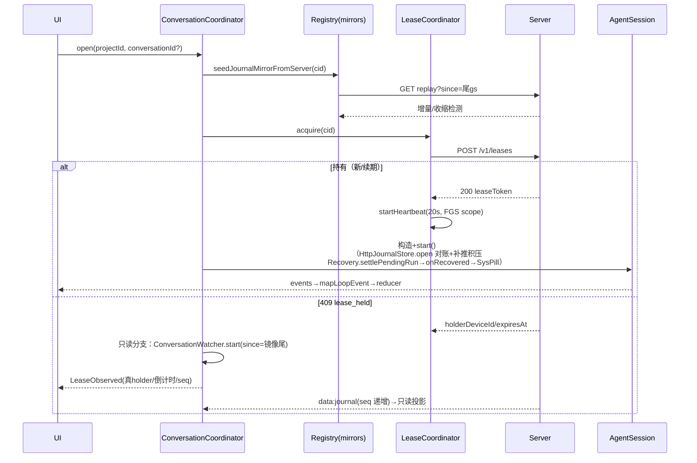
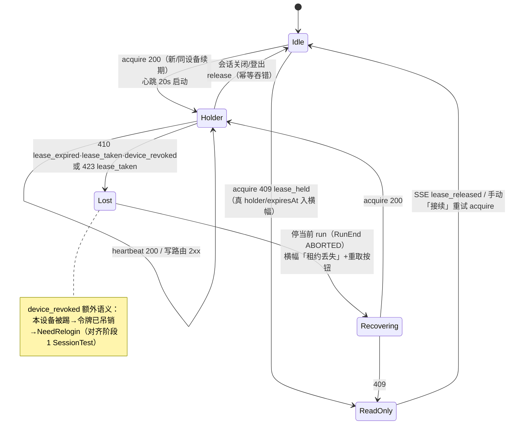

# Android 实施阶段 3 —— 真实数据接线（认证/租约/账本/SSE/FGS/恢复）PRD —— v1.0

> 状态：✅ 已实施（2026-09-12；实施记录与修正见 §7；开放问题落定见 §5）
> 关联：总纲 [`android-移动端MVP.md`](./android-移动端MVP.md) v0.2；契约 [`Android接入-数据通道server化.md`](./Android接入-数据通道server化.md) v0.2 + [`../../protocol/cloud-project-api.md`](../../protocol/cloud-project-api.md) v1.1（冻结）；前序 [`Android实施-阶段1-core-net数据通道.md`](./Android实施-阶段1-core-net数据通道.md) v1.0、[`Android实施-阶段2-App壳与六屏UI.md`](./Android实施-阶段2-App壳与六屏UI.md) v1.0（含 §7 实施记录）。
>
> **范围**：阶段 2 交付了演示数据驱动的全量 UI 与冻结的数据契约（ChatRepository/ChatUiState/EventReducer/mapLoopEvent）。本阶段**只换实现不动 UI**：把 FakeChatRepository/AppRepository 换成 `:core:net` + `:core:runtime` 的真实管线——真登录（Keystore 令牌）、真项目、真会话（租约→AgentSession→HttpJournalStore）、真 SSE（双通道）、FGS+通知、崩溃/断线恢复，并为「teammate 触发」（非用户发起的 run）预留触达路径。
>
> **验收一句话**：两台真机（或真机+桌面）登同一账号——A 机开项目新建会话发起续写，B 机看到只读横幅与进度；任意一端裁决审批两端同步；A 机杀进程重开，悬挂工具调用被补完且 UI 有提示；断网期间输入入积压、恢复后按序上推；演示开关可随时切回无服务器演示模式。

---

## 0. 基线事实（来自契约 v1.1 与 server 实现，接线以此为准）

| 事实 | 值/语义 |
|---|---|
| access/refresh TTL | 15 分钟 / 60 天；轮换一次性（复用检测撤销全家族）；用户名 3–32 字符、密码 ≥8 |
| 租约 | TTL 60s；心跳 20s（客户端约定）；acquire：同设备=续期、他设备=**409 `lease_held`(+holderDeviceId,expiresAt)**、他用户=403；心跳/写失败：400 `lease_required` / 423 `lease_taken` / 410 `lease_expired`·`lease_taken`·`device_revoked` |
| 租约把关的写路由 | `POST /v1/runs/:cid/events`、`PUT /v1/journal/:cid/rewrite`、`POST /v1/projects/:pid/domain/mutate`、`POST /v1/approvals`（**GET 一律不把关**；files PUT/DELETE 不把关） |
| SSE | `GET /v1/events?conversationId=&since=`；帧 = 单行 `data: {JSON}`（判别字段 `type`，无命名事件/无 id 行）；`: heartbeat` 注释 15s；先补积压再 `ready`；事件全集 `journal/journal_rewritten/domain_changed/file_changed/approval_requested/approval_resolved/lease_revoked/lease_released/ready`；无 Last-Event-ID，重连带 `since` |
| journal replay | `GET /v1/journal/:cid/replay?since=N` → 蛇形行（`seq/conversation_id/run_seq/kind/payload/definition_version/created_at`），**payload 是 JSON 字符串需二次解析**；`lastSeq` 用于收缩检测；历史分页是**客户端读侧契约**（run 粒度 `fromSeq/latest/before/limit`，`limit+1` 探测 hasMore），server 无对应端点 |
| 会话归属/发现 | **server 无会话注册表、无列表端点**：replay 归属 = 曾持有过租约的用户集合；会话↔项目关联是纯客户端概念（oplog 的 `novel_mutation` 携带 conversationId 经域路由落库） |
| 审批 | pending TTL 120s（惰性过期）；`resolve` 幂等冲突 409 `already_decided`；带 `proposal`（NOVEL.md）时**批准即由 server 代写文件**（`novel_md_requires_approval` 的唯一写路径）；`decided_by`=裁决端 deviceId |
| 定义包 | `POST /v1/definitions/resolve` 能力协商；server 实现 quirk：`POST /v1/definitions` 201 的 `sha256` 字段实为 requirements 对象（接线勿依赖） |
| 命名陷阱 | replay 行/`GET /v1/auth/devices`/`GET /v1/approvals` 为蛇形（`run_seq/calls_json/last_seen_at`），其余驼峰；`ui-<projectId>` 是桌面 main 的 UI 域租约约定，与 session 租约互不排斥 |

---

## 1. 整体架构

### 1.1 组件图（:app 真实数据面）

```mermaid
flowchart LR
    subgraph UI["Compose UI（阶段2 冻结，零改动）"]
        ChatVM[ChatViewModel<br/>reducer 不变]
        AppVM[AppViewModel]
    end
    subgraph Coord[":app.data（本阶段新增/替换）"]
        RealRepo[RealChatRepository<br/>implements ChatRepository]
        Coord2[ConversationCoordinator<br/>会话发现/打开/只读分支]
        Registry[(ConversationRegistry<br/>mirrors 扫描 + meta)]
        LeaseBox[LeaseCoordinator<br/>acquire/心跳/丢失处置]
        AppRepo2[ServerAppRepository<br/>implements AppRepository 面]
    end
    subgraph RT[":core:runtime（两个小扩展）"]
        Session[AgentSession<br/>LoopInbox/Recovery/ApprovalGate]
        Tools[novelTools(NovelStore 接口化)]
        Loop[AgentLoop + DeltaCoalescer]
    end
    subgraph NET[":core:net（阶段1 已交付，纯装配）"]
        Auth[ServerAuthSession<br/>+KeystoreTokenStore]
        JStore[HttpJournalStore<br/>+RoomPendingPushQueue+JournalMirror]
        Gate2[ServerApprovalChannel.gate]
        SseG[SseBridge ×2<br/>GlobalChannel / ConversationWatcher]
        LeaseC[LeaseClient]
        Proj[CloudProjectsClient + RemoteNovelStore]
        Def[DefinitionClient]
    end
    subgraph SRV["cloud/server :8787"]
        API[(REST)]
        SSEH[(SSE Hub)]
    end
    Prov[OpenAICompatProvider<br/>BYOK baseUrl/apiKey]

    ChatVM --> RealRepo --> Session --> Loop
    Session --> JStore & Gate2
    Tools --> Session
    Proj -->|oplog 投影| Tools
    RealRepo --> Coord2
    Coord2 --> Registry & LeaseBox
    LeaseBox --> LeaseC
    SseG -->|approval_resolved→gate| Gate2
    SseG -->|journal 增量→只读投影| RealRepo
    Auth -.供 token.- NET
    AppVM --> AppRepo2 --> Proj & Auth
    NET <--> API
    SseG <--> SSEH
    Loop <--> Prov
```

### 1.2 关键架构决策

1. **UI/契约零改动**：阶段 2 的 `ChatRepository`/`ChatViewModel`/`EventReducer`/`mapLoopEvent` 原样保留；`AppContainer` 是唯一替换缝隙（debug 可切 Fake/Real）。
2. **会话打开即尝试持租**（对齐桌面「spawn 前取租约」）：acquire 成功→构造 AgentSession（写路径全通）；409→只读分支（零写、per-conv SSE 跟随）。**不**在首次 submit 才取——只读态必须先于任何输入呈现。
3. **SSE 双通道**：`GlobalChannel`（conversationId=null，审批到达/租约吊销/域变更通知，常驻）+ `ConversationWatcher`（仅只读态启动的 per-conv 桥，journal 增量折叠成 LoopEvent 喂同一 mapLoopEvent——**只读端与持有端共用一套 UI 投影管线**）。持有端不需要 per-conv 桥：写入本来就是自己发的（对齐桌面「进度走读不走推」）。
4. **run 触发源抽象（teammate 前瞻）**：`ChatUiEvent.Submitted` 只表达「本地用户输入」；非用户发起的 run（任务载荷/teammate 消息/未来 server 推送）经 `UserEchoed`/`RunStarted` 重放路径上屏，**天然不误挂用户气泡**。`ConversationCoordinator` 的 run 启动入口收敛为单一 `startRun(source: RunSource)`，`RunSource = USER | TASK | REMOTE`（后两者本阶段仅占位枚举+文档，不实现）。
5. **演示层不删**：debug 构建保留 FakeChatRepository + 演示浮条；设置页加「数据源：真实/演示」开关（默认真实，release 编译期剥演示路径）。
6. **runtime/net 仅两处小扩展**（均带测试，避免大改）：①`novelTools` 的 store 参数接口化（`NovelStore`），`RemoteNovelStore` 实现之——工具写经 oplog 乐观锁上推（对齐桌面 rebindWorkspace 语义）；②`AgentSession` 加 `onRecovered: (List<ToolCall>) -> Unit` 默认空钩子（恢复补完可见化）。
7. **模块与进程边界**：FGS 是独立组件但不是独立模块——`NovaForegroundService` 放 `:app` 的 `service/` 包（纯生命周期壳：START/STOP 条件+通知+挂协调层的 scope），协调层放 `:app` 的 `sync/` 包，UI 经 ViewModel 只发意图；**不建 `:core:service` Android library**（FGS 无可测逻辑，有逻辑的协调层在 `:app` 单测照跑）。**同进程，不设 `android:process`**：桌面「1 会话=1 进程」的沙箱动机在 Android 不成立（M1 已定「会话=协程作用域」），32ms delta 流过 Binder 是纯损耗，FGS 同进程让协调层 StateFlow 直通 UI 与通知。**拆分触发条件**（届时机械搬移）：出现第二宿主（wear/auto/widget 复用保活）或协调层需要脱离 android stubs 的纯 JVM 环境 → 协调层升格 `:core:sync`（kotlin-jvm）；本地 teammate spawn / 多会话并行落地（M5+）→ 重评 `:session` 进程。
   **会话执行不挂 Service 作用域**：AgentSession 挂应用级单例作用域（`AppContainer.applicationScope`；session 自带 SupervisorJob，协调层决定 `shutdown()` 时机），FGS 不拥有任何业务协程——不变式为 `FGS 存活 ⇔ 持租约 ∨ 活跃 run ∨ SSE 活跃`，service 是该谓词的执行器与状态投影（通知=StateFlow 渲染），方向永远是「状态驱动 service」。理由：service 实例可被重建（不可陪葬会话）、会话生命周期=打开→关闭与 service 存活无因果、UI 无需 bind。代价三条显式管理：① service 终结/`onTaskRemoved` → `onKeepAliveLost()` 优雅退场（停 run 落 ABORTED→release→停 SSE，不等 OS 杀进程）；② FGS 启动只发生在前台 UI 事件（Android 12+ 后台启动限制天然满足）；③ Android 14+ `dataSync` 每日约 6h 配额——空闲即停的 STOP 条件下 MVP 足够，超长挂机场景进开放问题。
8. **工具扩展 = 编译期组合，不引插件系统**（与桌面 tools 数组注入同构）：域工具留 `:core:runtime/tool/novel`（依赖 NovelStore 接口）；需 server 的工具 client 放 `:core:net`、壳在 runtime 组合；MCP 工具（M5）由新 `:core:mcp` 模块产 `List<ToolDef>`；teammate 类工具经 server 触发（契约 v1.2+），不做本地 spawn。新工具免费获得：`requiresApproval` 声明即入两段式门（跨端裁决复用）、结构化取消树的 stop 语义、definition 包 `toolGroups` 能力开关。
9. **前后台切换无恢复协议**：状态在单例协调层+ViewModel（进程级），UI 是 StateFlow 投影——后台期间 run/心跳/SSE/令牌轮换/reducer 全部继续（FGS 保活），回前台 = `collectAsStateWithLifecycle` 恢复收集 + StateFlow 只显最新 + 粘底滚动，**不存在“同步”步骤**。审批超时三层兜底（UI 计时仅展示层；`ApprovalGate` 120s 进程内必发；server 惰性过期）保证后台超时也正确收敛。显式处理仅三件：①回前台 cancel 审批通知（UI Sheet 接管）；②MainActivity `launchMode="singleTask"` + 通知 PendingIntent `FLAG_ACTIVITY_SINGLE_TOP`（防深链双 Activity/双 ViewModel——阶段2 manifest 缺口，本阶段补）；③ON_START 刷新一次审批中心 `pending()` 聚合。Activity 被回收但进程活 = composition 重建全量投影（ViewModel/列表位置保留）；进程被杀 = 与崩溃恢复同一条冷启动路径（FR3+FR10），不单独维护。

### 1.3 打开会话时序（含租约分支与恢复）



### 1.4 用户消息发送链路（与阶段 2 交互语义对齐验证）

```mermaid
sequenceDiagram
    participant U as 输入条
    participant VM as ChatViewModel
    participant RP as RealChatRepository
    participant IN as LoopInbox(FIFO)
    participant LOOP as AgentLoop
    participant JS as HttpJournalStore
    participant SRV as Server
    participant B as 他端(桌面/B机)
    U->>VM: send()
    VM->>VM: dispatch(Submitted)→UserMsg 上屏
    VM->>RP: submit(text)
    RP->>IN: submit（空闲→立即 run；运行中→排队=FIFO）
    Note over VM,IN: 阶段2 的「幽灵排队+RunStart 晋升」正是 inbox FIFO 语义<br/>——UI 行为与真实管线天然对齐，零改动
    IN->>LOOP: 开 run（steer 则走注入通道）
    LOOP->>JS: appendSnapshot/appendMessages（携带 leaseToken）
    JS->>SRV: POST /v1/runs/:cid/events
    alt 网络/5xx
        JS->>JS: 入 RoomPendingPushQueue（run 不中断）
        JS->>SRV: open()/下次成功后按序 drain
    else 4xx（租约/令牌）
        JS-->>LOOP: 抛错→RunEnd(FAILED)→五态条 FailedRetry
    end
    SRV-->>B: SSE journal(seq) → 他端只读投影/走读
    LOOP->>SRV: 工具批→ApprovalGate.await→POST /v1/approvals
    SRV-->>B: SSE approval_requested（B 机通知栏/审批中心）
    B->>SRV: POST /v1/approvals/:rid/resolve
    SRV-->>RP: SSE approval_resolved→onSseResolved→gate.resolve<br/>（本地先裁决则先到者生效，后到不覆盖——阶段1已测）
```

### 1.5 租约状态机（LeaseCoordinator）



---

## 2. 功能需求（FR）

### FR1 认证真接线（KeystoreTokenStore + 真登录）

- **KeystoreTokenStore**（`:app`，实现 `:core:net` 的 `TokenStore`）：`AndroidKeyStore` 内生成 AES-256-GCM 密钥（别名 `nova.auth.tokens`），密文+IV 存 DataStore（Preferences，key `auth_blob`）；KeyStore 异常（极端机型）回落 `FileTokenStore` 明文路径并打点（release 不静默）。**`FileTokenStore` 不得进 release**（阶段1 KDoc 红线）。加解密器注入接口（`TokenCipher`），JVM 测试用假实现覆盖编解码/损坏回退。
- **serverUrl 输入与持久化**：登录页新增「服务器地址」栏（默认空占位 `https://`，校验 http(s) 前缀），存 DataStore key `server_url`；`NovaApp` 启动 `authSession.restore(url)`。设置页连接 Hero 显示 `username@serverUrl`（真值）；「离线重试」= `reportRequestSuccess` 探活。
- **AuthState（四态）→ AuthUiState 映射**：VM 包装 `LoggingIn`（调用期间）+ 透传 `Unconfigured/Online/Offline/NeedRelogin`；登录/注册错误码映射文案（契约精确）：400 `invalid_username`（3–32 字符）/400 `weak_password`（≥8 位）/409 `username_taken`/401 `invalid_credentials`；网络错→`Offline` 不踢门。
- **设备管理接真**：`devices()/kickDevice()` 直连；踢本机→`NeedRelogin`（server 已吊销会话+租约，联动 FR5 device_revoked）。

### FR2 项目真接线

`CloudProjectsClient.list/create/remove/rename` 接抽屉与设置：列表真数据（`lastActivityAt` 相对时间）、新建（同名规则/64 字符校验文案）、软删二次确认（对齐 demo 文案）；`switchProject` = 打开项目（FR3 入口）。**ui- 域通道（内容页手动编辑的租约/oplog）本阶段不接**——内容页仍是四 tab 占位，归阶段 4。

### FR3 会话域：ConversationCoordinator + ConversationRegistry

- **Registry（本地发现，对齐桌面 mirrors 扫描约定）**：`filesDir/conversations/<cid>/journal.jsonl`（HttpJournalStore 的 mirrorPath 约定）扫描出会话集；每会话 `meta.json`（`{projectId, title, createdAt, lastSeq}`）由创建端写入（**新会话 `conv-<uuid>`，会话内首条用户消息前 24 字作默认标题**）。跨端发现：GlobalChannel 收到 `journal` 事件且 cid 未知→登记「其他设备会话」（无 meta，标题=cid 短码，打开时按需 replay+尝试 acquire；归属由租约历史保证同账号可读）。会话↔项目关联缺失是契约已知限制（v1.2 会话列表端点），跨端发现的会话挂「本项目（未关联）」桶——PRD 明示这是体验妥协非实现缺陷。
- **打开流程**：见 §1.3——seed 镜像→acquire→双分支。持有分支构造：`DefinitionClient.resolve("novel", caps)`（404 回退缓存）→ bundle 传 AgentSession；`RemoteNovelStore(sessionTag=newSessionTag(cid))` 实现 `NovelStore`（FR9）→ `novelTools`；`HttpJournalStore(mirrorPath=该会话路径, pending=RoomPendingPushQueue)`；`ApprovalGate=ServerApprovalChannel.gate(leaseToken={coordinator.当前token})`。
- **关闭/切换**：release 租约（幂等）→ `session.shutdown()` → Watcher 停止 → FGS 降级（FR8）。**活跃 run 期间切换**：保持后台（FGS 存续），抽屉会话项标运行中。

### FR4 RealChatRepository（implements ChatRepository，UI 零改动）

- `events` = `AgentSession.events`；`running` = `state !is Idle`（WaitingApproval 也算 busy——输入条排队语义正确）。
- `submit/steer/stop` 直通 session；**运行中 submit 走 inbox FIFO=排队**（幽灵晋升语义已对齐），`steer` 保留给追问卡（阶段4）。
- `resolveApproval` = 本地 `gate.resolve` + `channel.resolve`（先到者生效，阶段1 契约）。
- `loadOlder()`：`session.history()`（=journal.readAll 离线镜像兜底）→ **run 粒度分页 fold**（`latest+limit` 首屏 N=8 runs、`before=已载最早 runSeq` 上翻、`limit+1` 探测）→ ChatItem 投影（`u-r*/a-*/t-*` id 幂等，UserEchoed 路径）。首屏打开 = history(latest) + 镜像对账结果。
- 会话标题/`hasMoreOlder` 真值化。

### FR5 租约生命周期（LeaseCoordinator）

按 §1.5 状态机实现，要点：acquire 时机=打开会话（FR3）；心跳 20s 挂 FGS scope、`onLost`→停 run+`ChatOneShot.LeaseTakeover`+横幅；`device_revoked`→叠加登出门（FR1）；`ReadOnlyBanner` 真数据：holder 设备名（`devices()` 映射 deviceId→name，查不到显示短码）、`expiresAt` 倒计时（真值）、seq=`ConversationWatcher.cursor` 增长；「接续」= `resumeLease()` 真实 acquire（真 409 弹冲突框，替换阶段2 假触发）。

### FR6 SSE 双通道接线

- **GlobalChannel**：`SseBridge(baseUrl, conversationId=null, auth)` 常驻（登录后 start，登出 stop）。消费：`approval_requested`（FR7 通知+中心刷新）、`approval_resolved`（→对应会话 gate：`onSseResolved`）、`lease_revoked/released`（→ LeaseCoordinator ReadOnly→Idle）、`journal`（跨端会话发现索引）、`NeedRelogin` 态（→重登录提示）。**待验证项**：全局订阅的积压语义与跨用户可见性（server sse.ts 按 conversationId 过滤转发；全局订阅是否含他人事件需实测——若含则 Android 端按 conversationId 归属过滤，并回提 server 修复）。
- **ConversationWatcher**（只读分支专用）：per-conv `SseBridge(since=镜像尾gs)`；`journal` 事件 payload（二次解析）折叠为 `LoopEvent.UserMessage/AssistantMessage/ToolCallRequest/ToolCallResponse/ApprovalRequested/ApprovalResolved` **喂同一 mapLoopEvent**——只读端完整复刻持有端 UI（含审批只读视图：卡片可看不可裁，提示「由持有端/任意端裁决」）；`journal_rewritten`→游标归零全量补拉（SseBridge 内建）；持有端不启动 Watcher。

### FR7 审批中心真数据

中心列表 = 本地会话集的 `channel.pending(cid)` 聚合（并行拉取，失败静默标不可用）；跨端 resolve 直连；`approval_requested` 到达且应用后台→通知（FR8）；`proposal`（NOVEL.md 提案）卡片渲染 file 路径+内容 diff 摘要（只读展示，「批准后由服务端写入」文案对齐契约唯一写路径）。卡级/批级裁决语义同阶段 2（真实 gate 语义=整批，卡级盖章仅为 UI 即时反馈，全卡落定才触发批级——**保留阶段2 行为，PRD 记录与 server 幂等（409 already_decided）的相容性**）。

### FR8 FGS + 通知

- `NovaForegroundService`（**`:app` 的 `service/` 包，同进程，不拥有会话作用域**——归属链见 §1.2-⑦：协程归协调层、通知归 service、UI 归 VM，三者读同一份 StateFlow；`foregroundServiceType=dataSync`，manifest 声明 `FOREGROUND_SERVICE_DATA_SYNC`+`INTERNET`+`POST_NOTIFICATIONS`）：START 于「任一会话持有租约或活跃 run」（仅由前台 UI 事件触发），STOP 于「无租约且无活跃 run」；`onDestroy`/`onTaskRemoved` → 协调层 `onKeepAliveLost()` 优雅退场（停 run 落 ABORTED→release→停 SSE）。通知常驻项：当前 run 状态（思考/生成/审批等待，点击回聊天页）；`approvals` channel：审批到达（深链到审批 Sheet）。
- 生命周期矩阵：屏幕熄灭→FGS 保持（心跳/SSE 续）；任务滑走→活跃 run 保持、否则 5 分钟宽限后 release+stop；登出→全停；**回前台→cancel 审批通知 + ON_START 刷审批中心聚合（§1.2-⑨）**。电池：SSE 退避已内建（1/2/5/10s 封顶），FGS 期间不做额外轮询。`MainActivity` 补 `launchMode="singleTask"`（深链防双实例）。
- **进程冻结（cached apps freezer）语义**：冻结只打 cached 档进程，FGS 使进程处 service 档不在被冻集合——`FGS 存活 ⇔ 有工作` 不变式同时是防冻条件；主动 stop FGS 的时刻即自愿可冻时刻（无工作在跑，无害）。若因配额耗尽/OEM 激进省电仍被冻：冻结对代码透明（无回调、定时器迟到、socket 静默死），解冻后由 SSE 游标重连 + Room 积压 drain + 租约 410→重取状态机 + 账本事件溯源四层收敛（等价"对自己的网络分区"）；真机清单含冻结/解冻实测（`dumpsys activity processes` 查 frozen 标记）。
- 通知权限被拒→横幅提示（不阻断，通知缺失不影响功能）。

### FR9 BYOK Provider（真模型）

- 设置页真表单：`provider_base_url`/`provider_api_key`/`model`（DataStore；api_key 经 `TokenCipher` 加密，与 FR1 同 Keystore 别名体系独立别名 `nova.byok.key`）；「测试连通」= 最小 chat 请求（provider 自身路径，超时 8s）。
- 未配置时发送→顶部引导横幅「未配置模型（BYOK）」跳设置（不弹错误堆栈）。
- `OpenAICompatProvider(baseUrl, apiKey, model)` 注入 AgentSession（DeepSeek 兼容，阶段1 provider 语义）；`model` 默认对齐桌面当前默认。
- **runtime 扩展①（带测试）**：`tool.novel` 引入 `interface NovelStore`（`suspend query/paragraph/write(乐观锁)/delete`），`InMemoryNovelStore` 实现之、`novelTools(store: NovelStore)`；`RemoteNovelStore` 实现 `NovelStore`（`write/delete→mutateBatch` 经 `novel_mutation` oplog，`baseVersion` 乐观锁冲突→工具失败回填文本让模型自纠，对齐桌面语义）。契约测试：InMemory 与 Remote 双实现同契约。

### FR10 恢复可见化

**runtime 扩展②（带测试）**：`AgentSession(onRecovered: (List<ToolCall>) -> Unit = {})`——`start()` 内 `Recovery.settlePendingRun` 补完非空时回调。Android 侧：打开会话即 SysPill「已补完重启前 N 个悬挂工具调用（结果已落账本）」。断线积压补推的对账结果（open() drain 条数>0）同样以 SysPill 呈现「已补推 N 条离线事件」。

### FR11 演示层退役策略

debug 构建：设置页「数据源」开关（真实/演示，重启生效——容器按开关构造）；演示浮条与 DemoTriggers 仅在演示源激活。release：编译期仅真实路径（`BuildConfig.DEBUG` 门已有）。**真实源下 DemoTriggers 的 lease/oneShot 通道被 LeaseCoordinator/SSE 真事件复用**（同一 `ChatUiEvent.LeaseObserved`/`ChatOneShot` 入口）。

### FR12 测试（JVM 优先，真机清单另列）

- **RealChatRepository 全链路（JVM）**：MockWebServer 起 server 语义（auth/lease/journal/approvals/SSE 复用阶段1 FakeLedgerServer 模式扩展）+ `FakeProvider`（脚本 delta）+ Room inMemory → 断言：submit→journal 行落库→审批上报→第二端（第二个 SseBridge 模拟）resolve→gate 放行→RunEnd；积压：OfflineSwitch 断网→append 入队→恢复 drain 按序；409 只读分支→Watcher 投影折叠正确。
- **LeaseCoordinator 状态机（JVM）**：§1.5 全迁移矩阵（含 device_revoked 联动登出）。
- **分页 fold（JVM）**：latest/before/limit+1 边界。
- **NovelStore 契约（JVM）**：InMemory vs Remote(oplog) 双实现。
- **KeystoreTokenStore（JVM）**：注入 TokenCipher 的编解码/损坏回退/清空。
- 回归：既有 141 用例零改动；:core:runtime 新增 2 扩展各带测试。

---

## 3. teammate 触发的前瞻设计（本阶段只留缝，不实现）

**概念基线**（docs/architecture.md）：teammate = 派生的子会话进程（独立 id=`<parentId>:<seq>`/journal/生命周期，经 CMS 管理；inter-conversation 消息经 manager 调度；审批 decisioner=parent 冒泡）。路线图已承诺「定时执行 teammate agents 产出草稿交人审批」与 server 端「夜间执行者」。

本阶段的兼容性设计：

1. **run 触发源**：`ConversationCoordinator.startRun(source)` 与 reducer 的 `Submitted`（用户）/`UserEchoed`（重放）二分——teammate/task 发起的 run 无本地用户消息，走重放形态上屏，UI 自动正确（无假用户气泡）。
2. **teammate 的到达路径（未来）**：GlobalChannel `journal` 事件已按 conversationId 索引（FR3 跨端发现同机制）——teammate 子会话的活动将来以「其他会话」形态出现在索引中，审批冒泡（approval_requested of `<parent>:<seq>`）经同一 SSE 到达通知栏/审批中心。**本阶段实现的通知与中心聚合已按 conversationId 参数化，无需改动即可承载**。
3. **明确不做**（边界重申）：Android 端 spawn teammate（无多进程 runtime，M5+ 评估）、server 夜间执行者（M4 排除）、定时触发 UI。

---

## 4. 边界与非目标

- 不动 server/desktop/protocol（Android接入 PRD §非目标继承：server 夜间执行者、信封加密）；契约疑点（全局 SSE 可见性、definitions quirk）只记录并实测，不改协议。
- ui- 域通道（内容页手动编辑）、内容 sheet 四栏投影、AskCard 真交互、审批卡富化（outline diff 等按工具解析）→ 阶段 4。
- 多会话并行（同设备同时持多租约）不做：一次一个活跃会话（FGS 单通知项），列表显示其余会话状态。
- 桌面端无 FGS/电池语义（探索确认），本阶段的生命周期矩阵是 Android 独有决策，偏离桌面「无条件常驻」。

## 5. 开放问题（2026-09-12 实施落定）

1. **全局 SSE 的积压与可见性**：✅ 已实测——全局订阅**无积压回放**（ready 帧 backlog 恒 0，纯实时流）；
   **存在跨用户泄漏**（A 账号全局流收到 B 账号的 journal/approval 帧，server hub 未按 userId 过滤——已记录
   待回提 server 修复）。客户端兜底：GlobalChannel 按「已知 cid + replay 归属探测（403 判非归属）」过滤，
   未知 cid 仅在归属探测通过后登记「其他设备会话」；已判定非归属的 cid 缓存跳过。
2. **跨端会话体验妥协**：维持「本项目（未关联）」桶，打开时不反推 oplog 关联（v1.2 会话列表端点解决）。
3. **FGS 电池策略**：✅ 落定「空闲即停不宽限」；且 **GlobalChannel 单独不保活**（谓词 = 持租约 ∨ 活跃 run
   ∨ 只读 Watcher 活跃）——全局流被冻结/杀掉后由回前台游标重连收敛，SSE 退避内建。
4. **Provider 连通测试**：✅ 采用 **GET /models**（对齐桌面 connectionTest 的轻量探测语义，免计费），8s 超时。
5. **meta.json 与镜像一致性**：✅ open() 对账后 + SSE journal 增量后统一回写 lastSeq（registry.updateAfterOpen）。

## 6. 验收标准

- [ ] 两端真实互通：A 机新建会话发起续写（真模型 BYOK）；B 机同账号看到只读横幅（真 holder/倒计时/seq 增长）与只读投影；A 机释放后 B 机「接续」成功转持有
- [ ] 跨端审批：A 机等待审批时 B 机裁决（通知栏进入），A 机 gate 放行继续执行；超时 120s 自动驳回两端一致
- [ ] 发送链路语义保持：运行中输入=排队晋升（FIFO）；stop=RunEnd(ABORTED)；FailedRetry 重试不重复上屏用户消息
- [ ] 断网：输入与账本入 Room 积压（上限 10k 溢出报错）；恢复后 open()/下次成功按序补推；SSE 退避重连游标不丢不重
- [ ] 恢复：A 机 run 中杀进程→重开同会话：悬挂工具调用补完+SysPill 提示；账本与镜像一致
- [ ] 登录门真实化：错误码四类文案；登出/踢本机→NeedRelogin；令牌 Keystore 加密（release 无明文路径）
- [ ] 项目/设备真数据；设置 BYOK 表单+连通测试+密钥加密
- [ ] FGS：运行期间通知常驻+状态更新；审批后台到达通知；任务滑走按矩阵处置
- [ ] debug 演示开关可切回 Fake 演示模式（无服务器可完整演示）
- [ ] 测试：FR12 全绿；既有 141 用例零改动；真机回归清单（旋转/深色/断网/杀进程）执行
---

## 7. 实施记录（2026-09-12，v1.0）

**交付物**：`:core:runtime` 两扩展（NovelStore 接口化 + AgentSession.onRecovered）；
`:app` 新增 security/settings/sync/service/data.conversation 六包 + ServerAppRepository/ApprovalCenter/
RealChatRepository/ChatSideChannels；manifest 四权限 + singleTask + dataSync service + debug 明文通道。
测试：android 工程 177 用例全绿（阶段3 新增 36：runtime 2 + net 2 + app 32）。

**架构落点与修正**（编号对应实施时发现的偏差，均为小步修正未改契约）：

1. **resolve 端点不在租约把关清单**（把关的是 report 的 `POST /v1/approvals`）——只读端
   **审批中心可跨端裁决**（decided_by=裁决端），**会话内只读 AskCard 卡不可裁**；与验收「B 机裁决」自洽。
2. **`AgentSession.onRecovered` 的时序**：`Recovery.settlePendingRun` 内部消费 pending 列表，
   回调所需的 `List<ToolCall>` 须在 settle **之前**用 `findPendingToolCalls` 捕获。
3. **`NovelStore` 接口形状**：`query/paragraph/write/delete`（suspend）；原 `InMemoryNovelStore.Paragraph`
   升为顶层 `NovelParagraph`；`RemoteNovelStore` 内部链路（applyLocal/replay/loadCache）随接口 suspend 化。
4. **只读首屏投影**：本地镜像有内容但 UI 状态为空——首屏走 **replay 全量（since=0）**，SSE 流仍从镜像尾
   gs 起订阅；事件级重复由 reducer 的 `u-r/a-<runSeq>` 幂等吸收。
5. **只读路径的 RunEnd 合成**：`rowEvents` 是行级增量无整 run 视图——协调器维护 `announcedRuns`，
   行到达后按缓存折叠做终判（末条 STOP 且无悬挂工具 → 合成 RunEnd(COMPLETED)，每 run 一次）。
6. **补推 SysPill 竞态**：HttpJournalStore.open() 的 drain 可能早于观察器首拍——watchPendingDrain
   在 `session.start()` **之前**取积压基数作为 seed。
7. **AppRepository 接口化的小增量**（阶段2 承诺「零 UI 改动」的诚实修正）：login/register 加 `serverUrl`
   参数；新增 `loginErrors`（错误码文案）/`errors`（操作 snackbar）/`refreshApprovals()`；LoginScreen
   增服务器地址栏与错误收集（PRD FR1 本就要求）。
8. **LazyProvider（BYOK 懒取）**：会话可在未配置模型时打开（历史/只读照常），首次推理才解析配置，
   未配置 → AUTH 类 ProviderException（FailedRetry 横幅文案引导）+ 输入条上方常驻引导横幅跳设置。
9. **FGS start 的前台窗口限制**：Android 12+ 后台禁启 FGS——谓词变真仅在 app 前台时 startService；
   后台期间工作照常（进程未冻结），回前台 ON_START 补启。stopService 任何时候允许。
10. **通知权限拒绝**：仅请求不阻断（未做拒绝横幅——通知缺失不影响功能，PRD FR8 简化落地）。
11. **ServerHttpSession 尾 lambda 陷阱**（记录备忘）：`ServerAuthSession(store) { url -> ... }` 的尾 lambda
    绑到 `now` 参数——必须用具名参数 `clientFactory = {...}`。
12. **会话切换的 park/reattach**：切换会话旧会话 park（心跳/journal/SSE 存续，活跃 run 后台继续，
    UI 中继断开）；重附着 = 全量首屏重放（后台完成的 run 从 journal 补齐）；FGS 谓词覆盖后台会话
    （held 非空 ⇒ 持租约）。

**移交阶段 4 的债**：审批卡富化（proposal/NOVEL.md 卡片渲染未做——中心仅基础卡）；ui- 域通道；
字数/进度真值投影（CloudProject.words=0 占位）；AppDrawer 会话项运行中标记（数据源已备，
`ConversationCoordinator.held` 状态未投影到列表）；真机回归清单（旋转/深色/冻结解冻 dumpsys）待执行。

**server 回提清单**：全局 SSE hub 按 userId 过滤（跨用户泄漏，§5-① 实测）。
