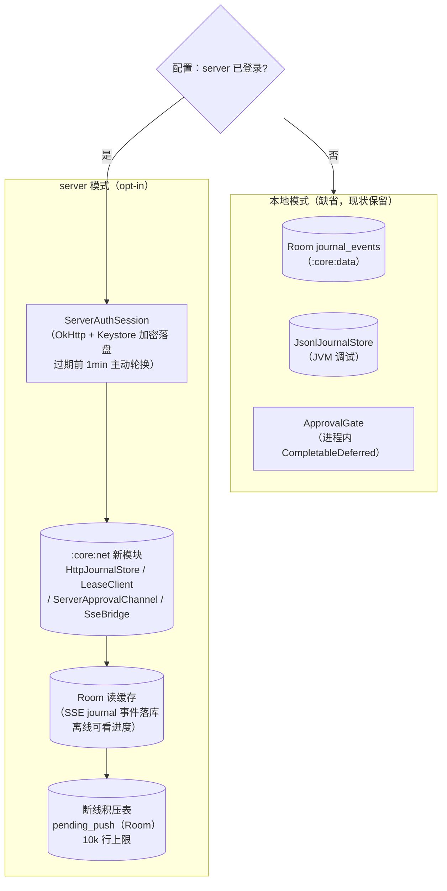
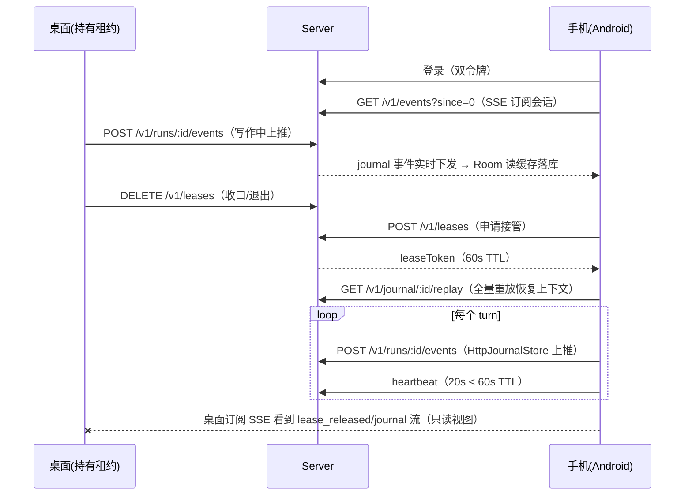
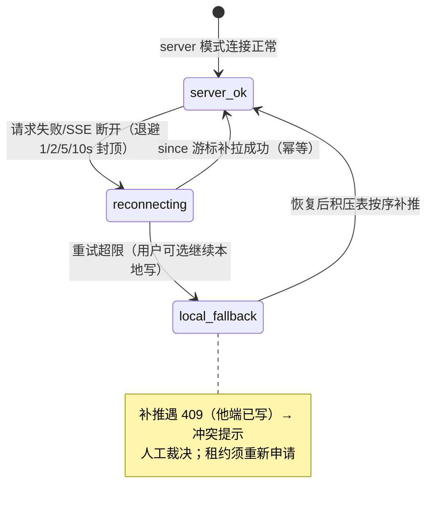
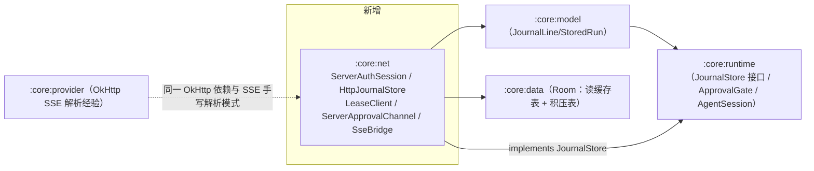

# Android 接入-数据通道 server 化 PRD —— v0.1

> 状态：⏳ 待敲定（定稿后改 ✅ 已定稿）
> 关联：[`端云架构-数据层server化.md`](./端云架构-数据层server化.md)；[`桌面接入-数据通道server化.md`](./桌面接入-数据通道server化.md)（M3 已实施，REST/SSE 契约经桌面端 + 契约测试验证）；[`定义包-agent策略统一.md`](./定义包-agent策略统一.md)（Kotlin `DefinitionAssembler` 已就绪）
> 里程碑：M4（Android 端接入）。后续：M5 MCP 迁 server、M6 跨端续跑向导。

---

## 1. 背景与目标

- 要解决的问题（痛点 / 现状）：
  1. Android 端（`clients/android`，:core:model/provider/runtime/data 四模块，47 测试绿）**完全本地**：`JsonlJournalStore`/`RoomJournalStore` 双实现同契约，但没有任何网络通道——「任意端续跑」这一硬需求至今只在桌面侧兑现了一半（桌面能上推，手机看不到、接不上）。
  2. server 契约已在 M3 定型并经桌面端生产验证：认证（双令牌轮换/复用检测）、账本（`POST /v1/runs/:id/events` + `PUT /v1/journal/:id/rewrite` 的 expectedLastSeq 乐观校验）、SSE（`/v1/events?since=` 游标 + 重连退避）、审批两段式、会话租约（acquire/heartbeat/release）、定义包 resolve。**Android 侧是纯客户端工作，无 server 改动**（仅可能补小端点，见开放问题）。
  3. M3 遗留两件小事顺路清偿：桌面「只读模式」最小 UI（数据通道已通，只差呈现）；`AgentSession` 恢复路径在 server 模式下的上下文来源切换。
- 目标（一句话，可验收）：手机配置 server 并登录后，能**看到桌面会话的实时进度（SSE → Room 缓存）并申请租约接续写作**；断网时本地照常写作、恢复后 sidecar 按序补推；未配置 server 时行为与现状完全一致。
- 关键决策（与桌面 M3 对齐处 / 差异处）：
  - 对齐：本地模式缺省、server 模式 opt-in；租约**会话粒度**（与桌面一致，避免两端语义分叉）；断线积压 sidecar 顺序补推 + 冲突 409 人工裁决；审批本地超时 120s 与 server 懒过期一致。
  - 差异：令牌加密用 **Android Keystore**（桌面 safeStorage 的对应物）；网络栈复用 **OkHttp**（:core:provider 已验证的手写 SSE 解析经验直接平移）；测试用 **MockWebServer** 单测 + Gradle 集成任务起真 server 跑契约（桌面是同进程真起，Android 编译单元不同）。

## 2. 用户故事

- 作为作者，我在通勤路上用手机打开桌面正在写的会话：实时看到 AI 输出进度（SSE 推流 + Room 离线缓存），点「接续」拿到租约继续写——桌面侧会话自动转只读。
- 作为作者，地铁里断网：手机本地继续写（journal 进 sidecar 积压表），出站恢复后自动按序补推；若桌面趁机写过（409），提示我选择保留哪边。
- 作为作者，我在手机上批掉桌面挂起的工具审批征询（SSE `approval_requested` → 通知栏/应用内卡片 → resolve）。
- 作为开发者，HttpJournalStore 与 Jsonl/Room 实现跑同一套契约用例（对齐桌面 `desktop-contract.test.ts` 的双实现模式），且同一份用例在真 server（node 起服）下复跑一遍。

## 3. 流程图（必填）

### 3.1 Android 端双模式数据通道

### 3.2 跨端续跑完整时序（手机视角，桌面持有 → 接管）

### 3.3 断线降级状态机（对齐桌面 M3 3.4，语义一致）

### 3.4 模块依赖（新增 :core:net）

## 4. 功能明细

- **FR1 认证与会话（:core:net）**
  - 触发：设置界面填 server 地址 + 登录。
  - 处理：`ServerAuthSession`（Kotlin 对应物）：login/refresh（一次一换）/logout/devices/kick；access 过期前 1min 主动轮换；401 复用检测 → 清令牌 + `needRelogin` 状态；时钟可注入（`now: () -> Long`，对齐桌面可测性设计）。令牌落盘加密：**EncryptedSharedPreferences（Keystore master key）**，独立文件不混入普通配置。
  - 输出：`StateFlow<ServerAuthState>`（unconfigured/online/offline/needRelogin），UI 连接指示。
  - 异常：server 不可达 → offline，不阻塞任何本地功能。
- **FR2 HttpJournalStore（:core:net，implements :core:runtime JournalStore）**
  - 方法映射（对齐桌面 HttpConversationJournalService，server 契约不变）：
    - `appendSnapshot(runSeq, messages, definitionVersion)` → `POST /v1/runs/:id/events` kind=snapshot（JWT + leaseToken + definitionVersion）；
    - `appendMessages` → 同端点 kind=append；
    - `rewriteAll(runs)` → `PUT /v1/journal/:id/rewrite`（expectedLastSeq 乐观校验，409 抛 `JournalRewriteConflictException(currentLastSeq)`）；
    - `readAll()` → `GET /v1/journal/:id/replay` 折叠（**注意 M3 已修的坑：replay payload 是 JSON 字符串需二次 parse**）；
    - `open()` → replay 对账（恢复 lastSeq）+ 补推积压。
  - 断线积压：**Room `pending_push` 表**（id 自增保序、runSeq/kind/messages 列），10k 行上限抛 `PendingPushOverflowException`；恢复后按 id 序补推、全部成功清表。写路径经 Mutex 串行（对齐 JsonlJournalStore）。
  - 单写者语义：`lastSeq` 为 run 级（与 Jsonl/Room 一致），server 全局行号单独跟踪供 rewrite 校验。
- **FR3 SSE 订阅桥（:core:net SseBridge）**
  - OkHttp 手写 SSE 解析（复用 OpenAICompatProvider 的 reader 协程 + `call.cancel()` 取消桥模式）；since 游标随 journal 事件 seq 推进；重连退避 1/2/5/10s 封顶；心跳注释行忽略；**取消即断流**（对齐桌面 AbortController 修复——协程 cancel → call.cancel()）。
  - 事件分发：journal → Room 读缓存 upsert + `journal_rewritten` → 清缓存重放；approval_requested/resolved → FR4；lease_* → FR5。
- **FR4 审批两段式（:core:runtime ApprovalGate 扩展）**
  - gate 产生征询时（server 模式）`POST /v1/approvals`；本地 resolve 或 SSE `approval_resolved` 先到者生效（CompletableDeferred 幂等 complete）；本地批掉同步 `POST /v1/approvals/:rid/resolve`（失败静默，server 懒过期兜底）。
  - 手机可批任意端征询：`GET /v1/approvals?status=pending` 列表 + resolve（审批中心入口，UI 最小列表即可）。
- **FR5 租约（:core:net LeaseClient）**
  - 会话粒度（对齐桌面）：`AgentSession` 启动/恢复时 acquire（失败 409 → 会话只读 + 提示 holderDeviceId）；20s 心跳协程（< 60s TTL）；session 关闭/取消时 release；410（device_revoked/被回收）→ 中止 run 走既有 `settlePendingRun` 恢复语义。
- **FR6 定义包拉取（M2 能力校验已就绪，只补通道）**
  - server 模式启动时 `POST /v1/definitions/resolve`（capabilities 从 Kotlin 侧注册表推导：rendererId 三段 + compact policyId 三个 + nudge triggerId + 工具组）→ 缓存 `definitions/<version>.json`（DataStore/文件）→ `DefinitionAssembler` 装配（能力缺口整包拒绝 → 回退本地缓存旧版，对齐 M2 设计）；`definitionVersion` 透传 `appendSnapshot`。
- **FR7 Room 读缓存（:core:data 加表）**
  - `journal_cache` 表（conversationId, seq 全局行号, runSeq, kind, payload, definitionVersion）由 SseBridge upsert——**离线也能翻看其他端的会话进度**（M3 桌面只读模式的数据面在 Android 的完整兑现）。
  - `AgentSession` 恢复：server 模式优先 replay（权威），Room 缓存仅展示层，不参与恢复决策。
- **FR8 契约测试与集成冒烟**
  - 单元层：MockWebServer 覆盖 HttpJournalStore 全方法 + 断线/补推/409/超限、SseBridge 帧解析/游标/退避、认证轮换/复用检测、租约 409/410、审批两段式。
  - 契约层：`HttpJournalStore vs JsonlJournalStore vs RoomJournalStore` 三实现同用例（Kotlin 版 describe.each）；**Gradle 集成任务** `connectedServerContractTest`：起 node server（复用 `cloud/server`，`pnpm start` + 测试账号 seed）→ JVM 测试跑完整时序（登录→租约→上推→SSE→跨端 resolve→rewrite 409）——对齐桌面 `desktop-contract.test.ts` 的验收深度。
  - 回归：未配置 server 时全部既有 47 测试零改动通过。
- **FR9（顺路）桌面只读模式最小 UI**（M3 遗留）
  - 桌面 renderer 消费已有 `server-events` 通道：会话列表项角标（他端持有）+ 会话内进度条（journal 流 seq 增长）+ 「请求接管」按钮（触发本端 acquire）。不改会话主交互。

## 5. 边界与非目标

- 明确不做（M4）：
  - 完整 Android App 壳（Activity/Compose UI、通知栏常驻、应用商店分发）——`:core:*` 继续 JVM 可测，App 壳另立里程碑
  - MCP 迁移与 remote MCP（M5）
  - 跨端续跑向导/冲突合并 UI（M6；M4 的 409 只提示不合并）
  - server 夜间执行者、信封加密存 key
  - SSE 后台常驻（前台服务/WorkManager 保活策略——见开放问题，M4 只做前台订阅）
  - 双端 definitionVersion 不一致时租约授予校验（定义包 PRD 遗留开放问题，维持现状提示）

## 6. 验收标准

- [ ] 手机登录 → 双令牌入 Keystore 加密存储；断网状态指示降级、本地写作不受阻
- [ ] 跨端续跑 e2e（集成任务，真 server）：桌面（或脚本模拟端）上推 → 手机 SSE 实时收 + Room 缓存落库 → 桌面释放 → 手机 acquire 接管 → replay 恢复上下文 → 上推/心跳/释放全时序通过
- [ ] 契约套件：HttpJournalStore 与 Jsonl/Room 同用例绿（append 折叠/rewriteAll/open 幂等/lastSeq 语义）
- [ ] 断线状态机：积压表按序补推、10k 超限抛错、409 冲突异常携带当前值（3.3 全覆盖）
- [ ] 审批：手机征询上 server、桌面（脚本端）resolve 回填放行；手机批他端征询
- [ ] 租约：互斥（双端 acquire 一胜一 409）、心跳维持、释放后他端可接管、被回收 410 中止进恢复
- [ ] 定义包：resolve 拉包 + 缓存 + 装配（能力缺口回退旧缓存）；definitionVersion 透传账本行
- [ ] 桌面只读模式：他端持有时会话角标 + 进度可见 + 接管入口（FR9）
- [ ] 全量回归：Kotlin 既有 47 测试零改动通过；core/server/ui 桌面侧套件不回归

## 7. 开放问题

- 令牌存储选型落地细节：EncryptedSharedPreferences（deprecated 走向）vs DataStore + Tink 手工加密——倾向后者（Jetpack 方向），M4 内定
- SSE 前台保活：Activity 生命周期内订阅即可满足「打开看进度」，后台推送需前台服务——放 M6（续跑向导）一并评估
- 弱网下 sidecar 容量与清理策略（桌面 10k 行上限是否够手机场景；是否按时间衰减）
- 集成测试的 node server 启动方式进 CI：GitHub Actions 起 pnpm server + gradle 测试的 job 编排（ubuntu 双运行时）；若太重则降级为本地脚本 + nightly
- Android 端 deviceId 语义：一次登录一设备行（server 现状）在手机重装后产生孤儿设备行——是否提供「合并本机设备」入口
