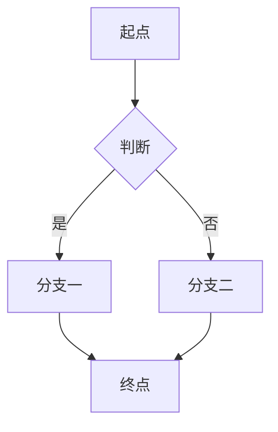
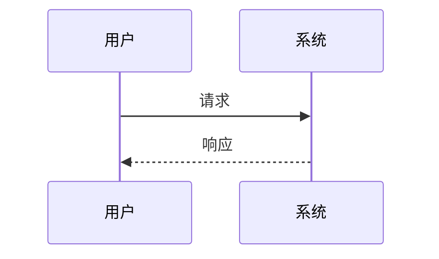
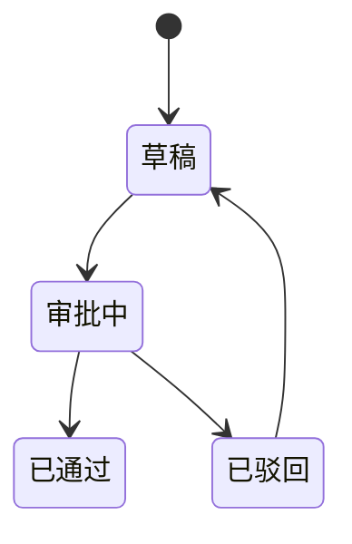

# <模块>-<功能> PRD —— v0.1

> 状态：⏳ 待敲定（定稿后改 ✅ 已定稿）
> 关联：整体产品 PRD [`产品总览.md`](./产品总览.md)；技术设计 `docs/architecture.md`
> 使用说明：新 PRD 从本模板复制起步，固定章节不得删减；流程图必填。

---

## 1. 背景与目标

- 要解决的问题（痛点 / 现状）：
- 目标（一句话，可验收）：

## 2. 用户故事

- 作为 <角色>，我希望 <能力>，以便 <价值>。

## 3. 流程图（必填）

### 3.1 主流程

### 3.2 多主体交互（按需）

### 3.3 状态流转（按需）

## 4. 功能明细

每个功能点写清：触发条件 / 输入 / 处理逻辑 / 输出 / 异常与回退。

- 功能点一：
  - 触发：
  - 输入：
  - 处理：
  - 输出：
  - 异常：

## 5. 边界与非目标

- 明确不做：

## 6. 验收标准

- [ ] 可测试的验收条件

## 7. 开放问题

- 待确认项（定稿前必须清零）
