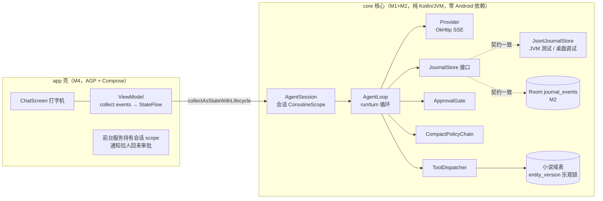
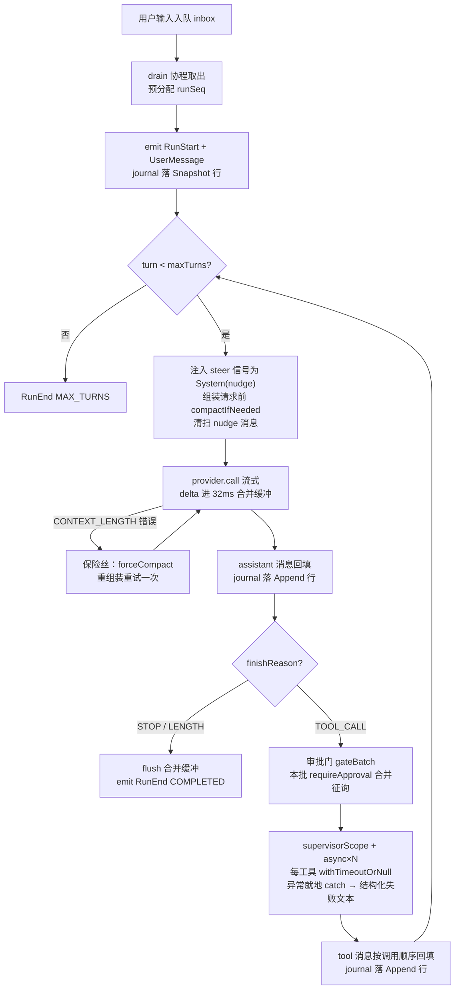
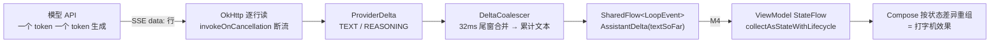
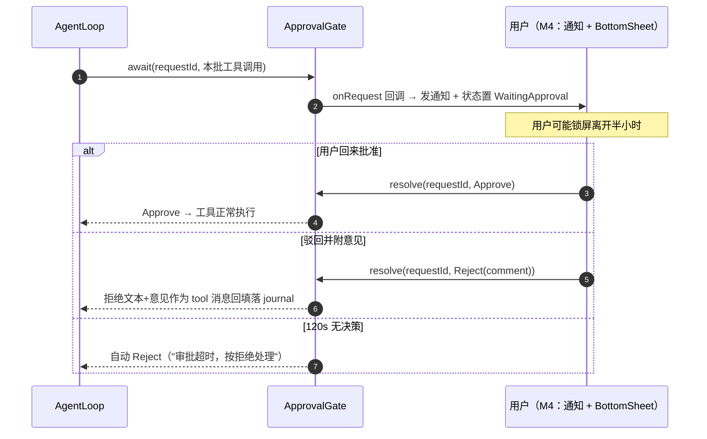
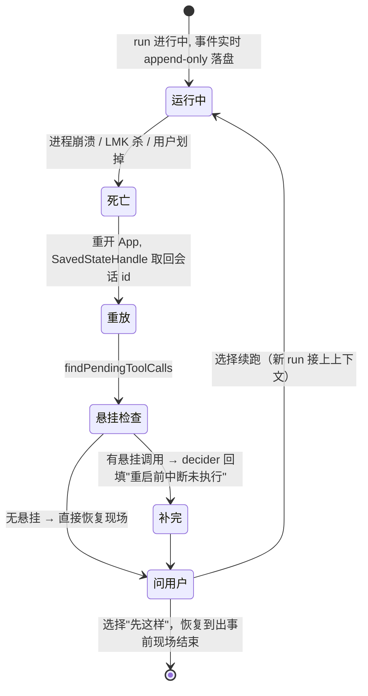
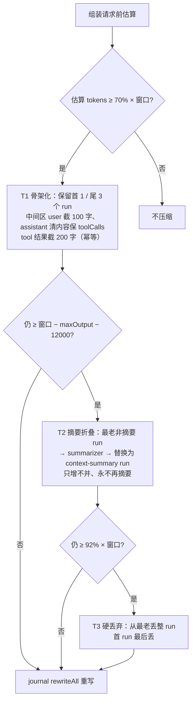
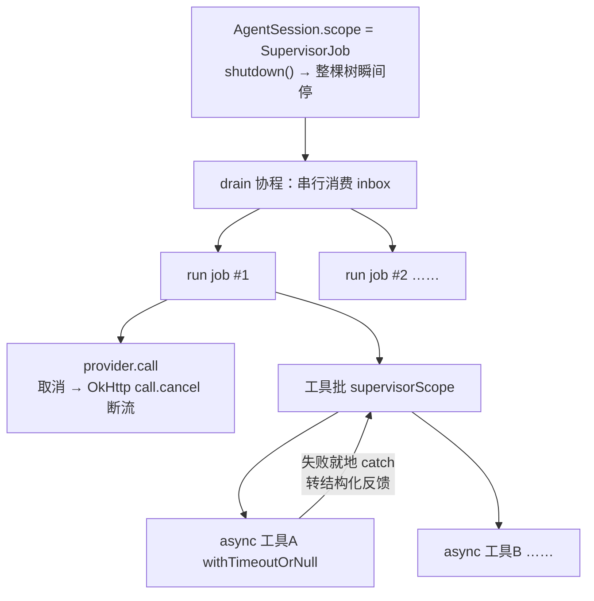

# android-移动端MVP PRD —— v0.1

> 状态：⏳ 待敲定（定稿后改 ✅ 已定稿）
> 关联：整体产品 PRD [`产品总览.md`](./产品总览.md)；技术设计 `android/README.md`；面试设计底稿见本文档 §3 各图与 `docs/architecture.md`
> 使用说明：新 PRD 从本模板复制起步，固定章节不得删减；流程图必填。

---

## 1. 背景与目标

- 要解决的问题（痛点 / 现状）：
  1. 桌面端（Electron + TS）只覆盖**整块创作时间**；通勤、睡前等碎片时间无法审批 AI 提案、翻设定、续写一段——而「审批 AI 写入」恰恰是低注意力、高频次的动作，天然属于手机。
  2. 桌面端交互隐含**「人始终坐在屏幕前」**的假设（审批 120s 超时即拒绝）；移动端用户会锁屏离开、系统随时杀进程（LMK / Doze / 前台服务时长配额），审批流必须**异步化、可恢复**。
  3. 核心资产（Agent 运行时 / SQLite 数据模型 / 审批机制）目前只有 TS 实现，「平台无关可平移」这一架构论断没有被第二个端验证过。
- 目标（一句话，可验收）：交付 Android 补充端 MVP——**单模型流式对话 + 工具写入审批 + 崩溃恢复**，核心运行时为平台无关的 Kotlin 模块（纯 JVM 可测），全部单测在桌面 Gradle 跑绿。
- 定位澄清（对应面试文档第 0 步，只澄清一次）：**碎片时间的补充端起步、预留同步**；不是完整创作端。本地优先、离线可用、BYOK（用户自带 key）原则与桌面端一致，不做瘦客户端。

## 2. 用户故事

- 作为连载作者，我希望在手机上打开会话让 AI 续写一段并看到打字机式输出，以便通勤时推进章节。
- 作为连载作者，我希望锁屏离开后收到通知、回来时在底部面板逐条查看原文和改动理由并批准/驳回，以便放心让 AI 动我的设定库。
- 作为连载作者，我希望 App 被系统杀掉后重新打开能回到出事前的现场，并自己选择「从断点继续」还是「就停在这」，以便中断无感。
- 作为用户，我希望自带 API key（DeepSeek 等 OpenAI 兼容端点），以便不依赖平台方、隐私自持。

## 3. 流程图（必填）

### 3.1 模块与数据流总图（桌面端资产如何平移到 Android）

一句话：核心资产（运行时/数据/审批）原样平移，只有外壳（界面）和插头（系统对接）换掉。

### 3.2 主流程：run/turn 循环（一次用户消息 = 1 run；每迭代 = 1 turn = 1 次模型请求）

### 3.3 多主体交互：流式输出链路（token 怎么变成打字机）

### 3.4 多主体交互：审批异步化（含锁屏与超时分支，移动端最大差异点）

### 3.5 状态流转：崩溃 / 被杀之后的恢复

一句话：杀不死的是事件表——只要事件都在，状态随时能重放出来；前台服务只是尽量保，重放才是兜底。

### 3.6 压缩链决策（T1/T2/T3 阈值与顺序）

协议约束：任何 assistant.toolCalls 必须与对应 tool 消息按 id 配对，同留同删（否则下轮 provider 400）。

### 3.7 协程取消树（结构化并发对 Agent 循环的映射）

## 4. 功能明细

- **FR1 会话与流式输出**
  - 触发：用户在会话中发送一条消息（M4 为输入框发送；M1 为 `AgentSession.submit(text)`）。
  - 输入：用户文本；会话既有上下文（历史 run 重放结果）。
  - 处理：预分配 runSeq → journal 落 Snapshot 行（run 开号）→ 进入 turn 循环：组装请求（先压缩检查）→ provider 流式调用 → delta 进 32ms 合并缓冲 → 无 tool_call 即收口。
  - 输出：`SharedFlow<LoopEvent>` 单流事件（RunStart / UserMessage / AssistantDelta(累计文本) / AssistantMessage / ToolCallRequest / ToolCallResponse / RunEnd…）；journal Append 行。
  - 异常：provider 网络错误 → RunEnd(FAILED) 事件，已完成的 turn 全在 journal；用户取消 → RunEnd(ABORTED)，正在流式的请求随协程取消一起断流；超窗（CONTEXT_LENGTH）→ 保险丝强制压缩后重试一次。
- **FR2 工具系统与错误回填**
  - 触发：assistant 消息 finishReason == TOOL_CALL。
  - 输入：工具调用批（id/name/arguments JSON 串）。
  - 处理：注册表查表；`requireApproval` 的调用先进审批门（FR3）；并行执行（supervisorScope + async×N），每工具 withTimeoutOrNull 限时；异常（参数非法 / 预检失败 / handler 抛错 / 超时 / 未知工具）统一转 `工具执行失败(code): msg` 文本。
  - 输出：tool 消息按调用顺序回填 + ToolCallResponse 事件 + journal Append 行。
  - 异常：工具失败**不中断 run**——错误文本照常作为 tool 消息回填（否则下轮 provider 缺 tool result 报 400），模型下轮自纠；乐观锁预检过期时报出当前版本号供模型重读自纠。
- **FR3 审批门**
  - 触发：本 turn 工具批中存在 `requireApproval: true` 的调用。
  - 输入：本批调用清单；requestId = `approval:{conversationId}:{runSeq}:b{batchSeq}`。
  - 处理：整批合并一次征询（onRequest 回调 → M4 发通知 + 状态 WaitingApproval）；await 挂起等待人工决策；120s 无决策自动按拒绝。
  - 输出：Approve → 工具正常执行；Reject(comment) → 不执行，拒绝文本+意见回填落 journal。
  - 异常：超时按拒绝；进程在等待期间被杀 → 重启后经 FR4 恢复补完；批量决策作用于整批（对齐桌面端）。
- **FR4 journal 事件溯源与崩溃恢复**
  - 触发：run 内每条消息追加时；以及会话启动时。
  - 输入：JournalLine（snapshot 开号 / append 追加）。
  - 处理：append-only 追加（写路径 Mutex 串行化）；重放 = snapshot 开 run + append 逐条归并；`findPendingToolCalls` 找缺 tool 结果的调用 → decider 补完；压缩后 rewriteAll 全量重写（临时文件 + 原子替换）。
  - 输出：`readAll(): List<StoredRun>` 重建全部历史；悬挂调用补完后可续跑。
  - 异常：末尾断行（写到一半崩溃）容忍并丢弃；Room 与 JSONL 双实现跑同一契约测试保证行为一致。
- **FR5 上下文压缩链**
  - 触发：每次组装 provider 请求前（compactIfNeeded）；CONTEXT_LENGTH 错误时强制（保险丝）。
  - 输入：会话全部 run；估算 token 信号（字符数/2 粗估）；窗口大小（来自模型配置）。
  - 处理：T1 骨架化（≥70% 窗）→ T2 逐段摘要折叠（注入式摘要器，M1 假实现、M4 接主模型）→ T3 硬丢弃（≥92% 窗）；toolCall/tool 配对约束。
  - 输出：压缩后的 run 列表 + journal rewriteAll + Compacted 事件。
  - 异常：T2 摘要器失败降级为确定性占位文本（对齐桌面端）；压缩幂等（重复压缩不产生变化）。
- **FR6 BYOK 模型配置**
  - 触发：M1/M2 为配置对象注入；M4 为设置页填写。
  - 输入：baseUrl / apiKey / model / timeoutMs。
  - 处理：M1/M2 仅作 Provider 构造参数（单测用 FakeProvider / MockWebServer，不触网）；M4 落 Keystore 加密键值存储。
  - 输出：OpenAI 兼容流式调用。
  - 异常：key 无效（401/403）→ AUTH 错误归类；限流 429 → RATE_LIMIT；均不上抛崩溃、转 RunEnd(FAILED) 事件。

## 5. 边界与非目标

- 明确不做（MVP）：
  - MCP 远程接入（Streamable HTTP 传输层抽象保留，M5 再接）
  - 端间同步 / 云端事件账本 / 会话租约（PRD 只预留：同步对象是事件流不是 .db 文件）
  - compose 改稿模式（5 相位状态机）、subagent、多会话并行多开
  - 多进程 runtime（:agent 进程 + AIDL）、iOS、模型中转/瘦客户端
  - 桌面端 TS 代码的自动转译或共享（纯手工平移，KMP 是后续演进选项）

## 6. 验收标准

- [ ] `android/` 四模块（:core:model / :core:provider / :core:runtime / :core:data）`gradle test` 全绿，纯 JVM 无 Android SDK 依赖
- [ ] AgentLoopTest：happy path 事件序（RunStart→UserMessage→AssistantDelta…→AssistantMessage→ToolCallRequest→ToolCallResponse→…→RunEnd COMPLETED）与 journal 行序一致
- [ ] CancellationTest：run 进行中取消 → RunEnd(ABORTED)、无悬挂协程/请求、inbox run 队列清空、会话可继续接受新输入
- [ ] ToolFailureTest：handler 抛错 → `工具执行失败(HANDLER_FAILED): …` 回填为 tool 消息，run 不中断，下轮正常
- [ ] ApprovalTest：批准放行 / 驳回附意见回填 / 120s 超时自动拒绝 三分支
- [ ] JournalRecoveryTest：追加→重放重建；末尾断行容忍；悬挂工具调用补完
- [ ] CompactTest：T1/T2/T3 逐级触发；toolCall 配对不破坏；rewriteAll 后 journal 与内存一致
- [ ] OpenAICompatProviderTest（MockWebServer）：文本 + reasoning + tool_calls 分片按 index 拼装正确；429/超窗错误归类正确
- [ ] M2：Room 与 JSONL 跑同一契约测试套件，行为一致；entity_version 乐观锁 UPDATE 条件更新生效
- [ ] demo CLI 端到端：假模型脚本化「续写第 12 章」→ 工具审批 → 崩溃恢复演示

## 7. 开放问题

- T2 摘要走主模型还是独立小模型（费用/质量权衡，M4 定）
- Room 与 JSONL 是否需要互导工具（桌面端 journal 迁移到手机的路径）
- M4 前台服务 dataSync 类型的时长配额规避策略（Android 15 约 6 小时/天，超时降级后的行为）
- 事件流是否需要持久化投影（conversation 读模型表）以加速 UI 重建（当前方案：全量重放，量大后再评估）
