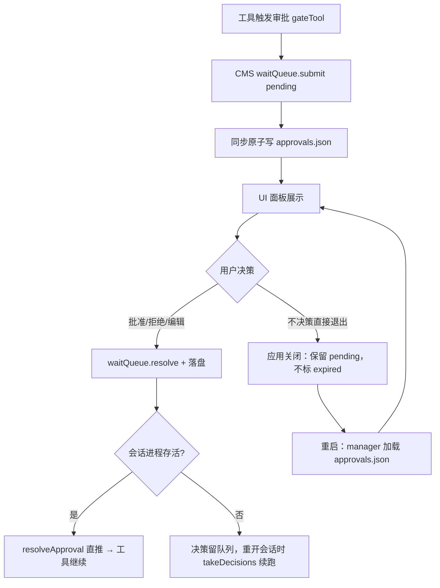
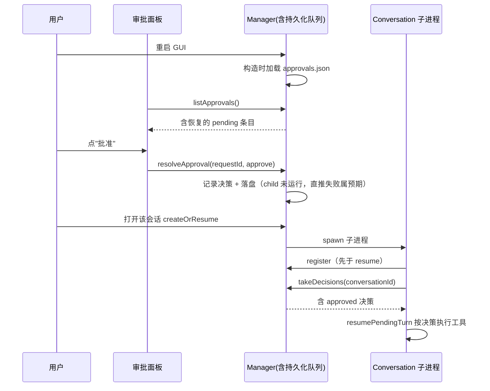
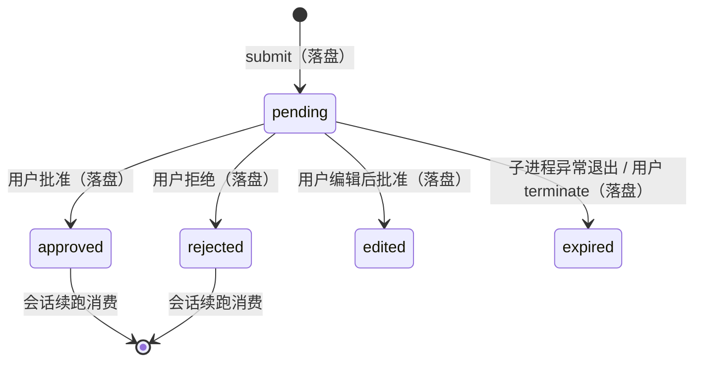

# 审批队列持久化 PRD —— v0.1

> 状态：⏳ 待敲定（定稿后改 ✅ 已定稿）
> 关联：整体产品 PRD [`产品总览.md`](./产品总览.md)；技术设计 `docs/architecture.md`
> 前置：`fix/security-and-robustness` 分支已落地（requestId 冒号格式、resume 门控收紧、审批无限等待）。

---

## 1. 背景与目标

- 要解决的问题（痛点 / 现状）：
  - 审批等待队列（`WaitRequestQueue`，`core/src/conversation/server/WaitRequestQueue.ts`）是 **manager 进程的纯内存态**，从不落盘。GUI 退出（含崩溃、断电）后面板上的待审批条目全部丢失。
  - 重启后 conversation 子进程恢复时调 `takeDecisions` 拿回空列表，pending 的工具调用在 `resumePendingDecider` 查不到决策 → 按拒绝收口（"已拒绝（审批通道未装配）"）。用户永远失去了补批的机会，已跑的 turn 作废。
  - 现状里退出路径还会主动加重丢失：子进程 exit → `attachExit` → `expireConversation` 把 pending 条目标为 `expired`；`terminate` 同样。即"进程退出 = 审批作废"。
- 目标（一句话，可验收）：**GUI 重启后，审批面板能恢复上次退出前处于 pending 状态的审批条目；用户补批/补拒后重开对应会话，暂停的工具调用按该决策继续执行。**

## 2. 用户故事

- 作为写作者，我希望 应用重启（或崩溃后重开）后审批面板仍显示上次未处理的审批请求，以便 不因一次重启丢失整个 agent turn 的工作成果。
- 作为写作者，我希望 对恢复出的条目点"批准/拒绝"后重新打开该会话时 agent 能继续跑，以便 审批决策真正生效而不是只被记录。
- 作为写作者，我希望 我主动终止（terminate）某个会话时，它的待审批条目消失，以便 面板不留死条目。

## 3. 流程图（必填）

### 3.1 主流程（持久化与恢复）

### 3.2 多主体交互（重启恢复补批）

### 3.3 状态流转

## 4. 功能明细

- 功能点一：队列持久化（approvals.json）
  - 触发：`WaitRequestQueue` 任一变更操作（`submit` / `resolve` / `expire` / `expireConversation` / `clearConversation`）。
  - 输入：内存队列全量条目（`ApprovalQueueItem[]`）。
  - 处理：`WaitRequestQueue` 增加可选 `persist` 依赖（由 `ConversationManagerServer` 构造时注入，路径 `{conversationsRoot}/approvals.json`）；每次变更后全量原子写（temp + rename，Windows rename 冲突重试，复用 files 工具同款策略）。写入失败仅 warn 日志，不阻断队列内存操作（持久化尽力而为，内存是 source of truth 的运行时态）。
  - 输出：磁盘文件与内存一致（尽力）。
  - 异常：文件损坏/非法 JSON → 重命名为 `approvals.json.corrupt-{ts}` 后从空队列启动，warn 日志；磁盘不可写 → 退化为现状纯内存行为。
- 功能点二：启动加载恢复
  - 触发：manager（`ConversationManagerServer`）构造时。
  - 输入：approvals.json 内容。
  - 处理：解析为条目数组灌入队列（逐条 `submit` 等价路径，跳过非法条目并 warn）；条目数设上限（200，最新的优先），超出丢弃最旧 pending 与全部已决溢出。
  - 输出：`listApprovals()` 立即返回恢复的 pending/已决条目，UI 面板无代码改动即恢复展示（`onApprovalsChanged` 通知在加载完成后补发一次）。
  - 异常：文件不存在 → 正常空启动。
- 功能点三：应用退出不再作废 pending（行为变更，核心）
  - 触发：GUI 退出（`will-quit` 有序关闭阶段，子进程被 SIGTERM）。
  - 输入：manager 新增 `beginShutdown()` 标记。
  - 处理：`minimal.ts` 在 will-quit 关闭流程中调用；`attachExit` 的 exit 回调在 shutdown 标记置位时**跳过 `expireConversation`**（其余清理照旧）→ pending 条目以 pending 状态留在磁盘。
  - 输出：重启后 pending 条目可恢复。
  - 异常：崩溃/断电场景没有 exit 回调，磁盘上本就是 pending → 天然恢复。
  - 明确保留的现状：① 子进程**运行中异常退出**（crash，非应用关闭）→ 仍 `expireConversation`（会话已坏，过期合理）；② 用户显式 `terminate` 会话 → 仍过期（用户主动放弃）；③ `delete` 会话 → `clearConversation` 照旧。
- 功能点四：补批后的续跑（复用现有链路，验收而非新开发）
  - 触发：用户对恢复条目点批准/拒绝后打开对应会话。
  - 处理：`createOrResume` spawn 子进程 → register（已先于 resume）→ `takeDecisions` 拿到决策 → `resumePendingTurn` 仅对缺 tool 结果的 toolCall 续跑（`findPendingToolIds` 门控已在前置分支落地）。
  - 输出：工具按用户决策执行或拒绝收口。
  - 异常：决策为空（用户没点过）→ 维持安全默认：按拒绝收口（不变）。

- 功能点五：bypass 短路 + 模式持久化（已随本期一并实施）
  - 触发：会话模式为 `bypass` 时工具触发审批；`mode.set` 生效时。
  - 处理：`Conversation.sendApprovalRequest` 入口判定 `activeMode === "bypass"` → 直接返回 approve，不提交队列不驻留（bypass 断链修复）；模式经 `onModeChanged` 回调合并写入 storedir/meta.json（保留 name 字段），child 启动时 `initialMode` 从 meta.json 恢复（损坏/非法值回退 review）。
  - 输出：bypass 会话写工具不再弹审批；重启后 bypass 设置保留。
  - 异常：meta.json 落盘失败仅影响重启恢复，内存态照常生效。

## 5. 边界与非目标

- 明确不做：
  - teammate → parent 决策冒泡路由（接口预留，本期仍是 ui 单决策者）。
  - UI 面板改版 / 新交互（恢复条目与在线条目同渲染，无视觉区分需求则不做；如需"离线恢复"角标另立小需求）。
  - 多 GUI 实例并发写同一 approvals.json 的并发控制（单实例应用假设）。
  - 审批条目加密（args 可能含正文片段，与 journal 同级明文，随工作区本地存储）。
  - `edited` 决策的参数编辑 UI（决策类型透传保留，续跑链路已支持）。

## 6. 验收标准

- [ ] 单测：submit/resolve/expire/clear 后 approvals.json 内容正确（原子写、条目全量）。
- [ ] 单测：构造时加载合法文件恢复条目；损坏文件 → 空队列启动 + .corrupt 备份；超 200 条截断。
- [ ] 单测：shutdown 标记置位时子进程 exit 不把 pending 标 expired；未置位（crash 路径）仍标。
- [ ] 手动冒烟：发起审批 → 退出 GUI → 重启 → 面板显示该 pending 条目 → 批准 → 打开会话 → agent 续跑执行该工具。
- [ ] 手动冒烟：重启后拒绝 → 打开会话 → 按拒绝收口；重启后不决策 → 打开会话仍 pending（不自动放行）。
- [ ] 手动冒烟：terminate 会话后面板无该会话条目；delete 会话同。
- [ ] 单测：bypass 模式 sendApprovalRequest 直接 approve 且不提交队列；initialMode 恢复 + onModeChanged 同值去重；meta.json 合并写保留 name、损坏/非法值回退默认。
- [ ] 全仓 build + 既有测试绿。

## 7. 开放问题

- 条目保留上限 200 是否合适？（已决条目目前内存也是全留，是否需要按时间清理如 7 天？）
- 应用崩溃（非优雅退出）时磁盘上 pending 恢复后，对应会话 journal 可能处于中间态——续跑链路已有 `findPendingToolIds` 门控兜底，是否需要额外标记"该条目来自异常退出"？v1 倾向不加。
- approvals.json 放 conversationsRoot（manager 全局）而非各会话 storedir：队列跨会话全局、以 requestId 寻址，放 storedir 需扫描聚合，收益仅"删目录即删条目"——维持全局 + `clearConversation` 显式清理。
