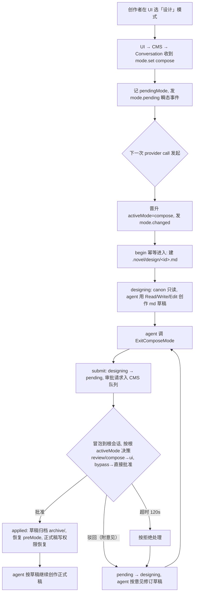
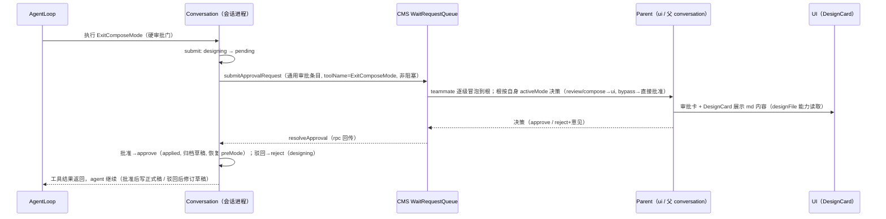
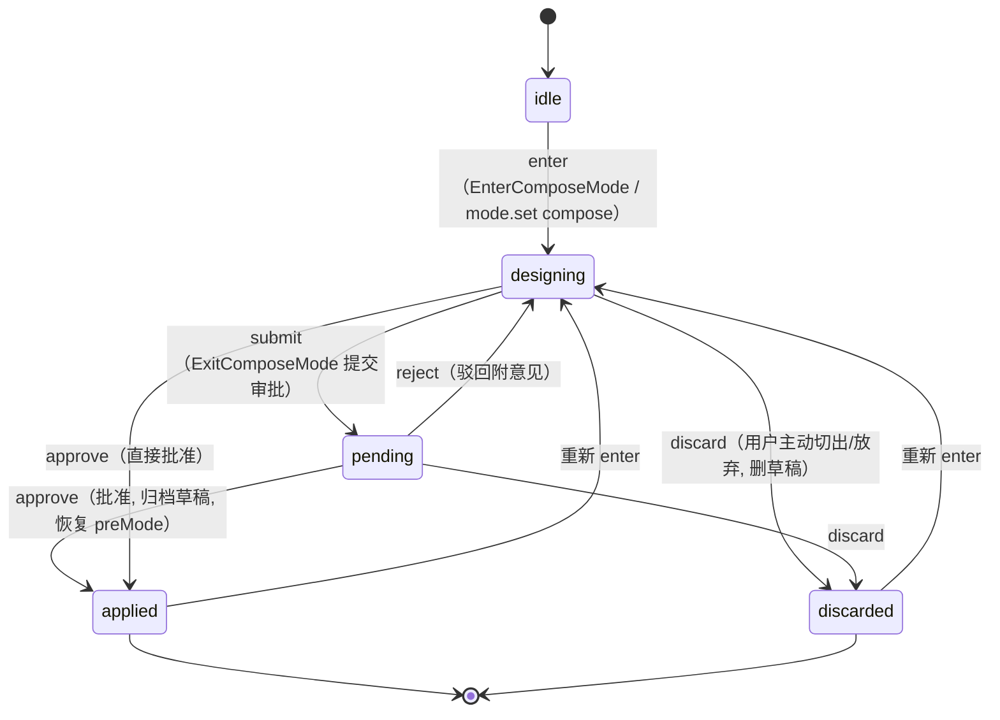
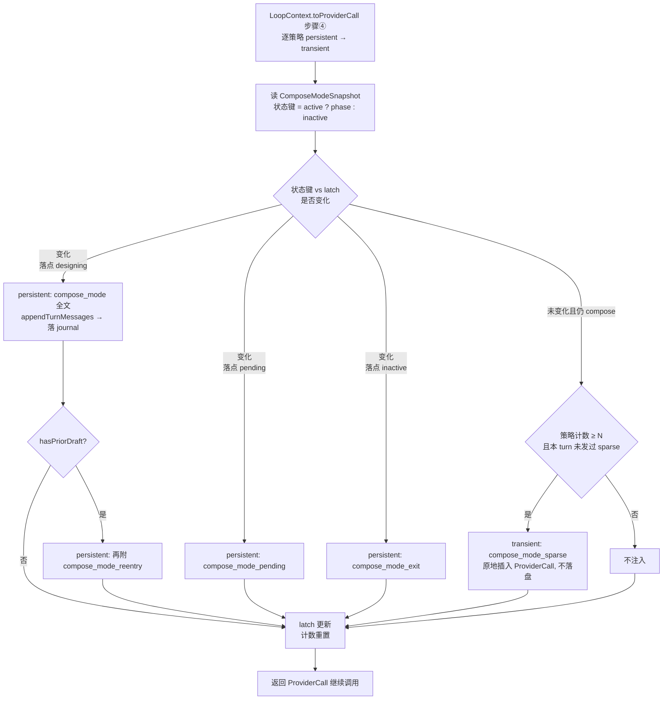

# compose-审批流 PRD —— v0.1

> 状态：✅ 已定稿（2026-08-14，feat/compose-mode 落地，§7.1 后续再定）
> 关联：整体产品 PRD [`产品总览.md`](./产品总览.md)；技术设计 `docs/architecture.md`
> 参考：legacy-main 既有 compose 实现（`core/src/runtime/compose/`、`core/src/tools/novel/compose/`、`core/src/runtime/nudge/definitions/compose.ts`、`ui/src/domains/conversation/components/{ComposerModeBar,DesignCard}.tsx`）

---

## 1. 背景与目标

- 要解决的问题（痛点 / 现状）：
  - 产品总览核心理念「**先想清楚要写什么（compose），经创作者审批后再落笔**」：正式稿是连载资产，AI 直接写正式稿风险高；需要一种「只允许写草稿、提交后经人审批才恢复正式稿写权限」的会话模式。
  - legacy-main 已有完整实现（状态机 / 权限策略 / 审批生命周期 / 5 件套 nudge / UI 展示），但重构分支只迁移了骨架：`ComposeModeState`（5 相位机）、`Conversation` 的 wait 通道（`sendExitComposeRequest`/`resolveExitCompose`）、简化版 transition nudge（仅 compose_mode/compose_mode_exit）。**缺**：Enter/ExitComposeMode 工具、compose 权限策略、design 文件生命周期服务、compose 事件、完整 nudge 集、UI 接线。
  - 工具可用集与既有「plan」语义对齐：canonical 写（novel 域 write/edit/delete）不可用，Read + 文件工具（Read/Glob/Write/Edit）可用，草稿只落在 `.novel/design/<conversationId>.md`。

- 目标（一句话，可验收）：conversation 级 compose 模式完整落地——进入后 canon 只读、md 草稿创作、ExitComposeMode 走审批（审批期间 UI 展示 md 内容）、批准/驳回驱动状态机与 nudge、mode 变更经 parent（conversation 或 UI）决策。

## 2. 用户故事

- 作为创作者，我希望进入设计模式后 AI 只能读正式稿、写 md 草稿，以便放心让 AI 大胆出方案而不污染正式稿。
- 作为创作者，我希望 AI 提交 ExitComposeMode 时看到草稿的完整 md 内容再批准/驳回（附修改意见），以便每一步落笔都可控。
- 作为主创作 agent，我希望在 compose 激活期间 canonical 写工具被硬拒绝、ExitComposeMode 是唯一退出闸门，以便流程约束不被绕过。
- 作为父会话（teammate 场景），我希望子会话的模式变更/退出 compose 审批请求冒泡到我这里决策，以便层级审批链生效。

## 3. 流程图（必填）

### 3.1 主流程



### 3.2 退出审批交互（多主体）



### 3.3 状态流转



### 3.4 nudge 求值（每次 provider call，ComposeModeNudgePolicy）



## 4. 功能明细

### F1 会话模式契约：pending_mode / active_mode 双态

- 触发：UI 模式下拉（ComposerModeBar）或父会话控制 → `ConversationSystemControl { type: "mode.set", mode }`；**控制指令一律经 CMS 路由**（`ConversationManagerServer.sendMessageTo` 按类型分派，现状已实现），UI 不直连 conversation 进程。
- 输入：目标 mode ∈ `review | bypass | compose`（会话级，conversation 为单位；已有契约 `contract/types/message.ts`）。
- 处理：
  - **双态模型**：`pendingMode`（已记录、未生效）与 `activeMode`（当前实际生效）。mode.set 只记录 pendingMode；**每次 provider call 发起时**（prompt 渲染 / nudge / 权限门控之前）将 pending 晋升为 active——active mode 才是该 call 实际使用的模式。mode 在单个 provider call 内保持稳定。
  - **两个回调/事件严格区分**：①mode set pending（mode.set 到达即发 `mode.pending`，供 UI 回显「已切换待生效」）；②active 实际切换（call 发起晋升时发 `mode.changed`，权威事件，persist 落盘）。禁止只发一个混用。
  - target=compose 走 begin（建 design 文件 + 状态到 designing），其余走 setMode；语义同 legacy `ComposeToolService.setMode`。
  - **挂起审批延迟**：compose 处于 pending 或存在未决审批时，mode 切换延迟记录（pendingModeTarget），审批决议后晋升生效（legacy `#shouldDefer` / `applyPendingModeTarget`）。
  - compose 激活中用户主动切出 = discard 路径（不走审批门）。
- 输出：`mode.pending`（瞬态）+ `mode.changed`（persist）事件。
- 异常：compose 激活中 setMode 抛 `ComposeStateError`（由服务先 discard/approve）。

### F2 EnterComposeMode 工具与 design 文件

- 触发：**两条进入路径收敛同一 begin**——①agent 主动调 `EnterComposeMode`（工具组 `novel.compose`，主路径）；②UI/父会话 `mode.set compose`（F1，经 CMS）。两者都落到同一个 begin（幂等）。
- 输入：`{ purpose?: string(≤512) }`（可选，仅记录在结果里）。
- 处理：
  - **design 文件一个 conversation 一个**：`.novel/design/<conversationId>.md`（id 非法字符替换为 `-`）；teammate 会话按自身 conversationId 各持一份，与父会话无关。
  - **幂等**：已激活时返回当前状态 + `alreadyActive: true`，不重复进入、不删草稿、不发重复事件。
  - **hasPriorDraft 探测**：文件已存在 = 上次会话残留草稿（discard 才删、exit 归档）→ 触发 reentry nudge；不存在则建空文件。
  - 写序（write-ahead）：①内存状态 enter（designing，preComposeMode=当前 activeMode）→ ②持久化（若有端口）→ ③发 `compose.begin` + `mode.changed(compose)`。
- 输出：工具结果含 **workspace 相对路径**（绝对路径会被文件工具拒绝）+ 5 阶段工作流全文（与 nudge 共用渲染函数）。
- 异常：状态非法 → `ComposeStateError` 归一 `ToolError(NOVEL_COMPOSE_ENTER_FAILED)`；其余可重试错误同上 code。

### F3 设计期权限（与 plan 一致）

- 触发：任意工具执行前（gate 层），compose 快照 `active === true`。
- 输入：工具名。
- 处理：
  - **canonical 写硬拒绝**（deny，无审批通道）：`OutlineWrite/Edit、CharacterWrite/Edit、LocationWrite/Edit、ParagraphWrite/Edit、PublicationWrite/Edit、NovelDelete`（11 个，现行 novel 工具组全量写+删）。
  - **文件工具全模式可用**：`Read/Glob/Write/Edit`（`runtime.files`），作用域由 workspace 沙盒强制（越界 pathForbidden）——md 草稿是唯一可写目标（agent 层面由 prompt/nudge 约束）。
  - **novel 域 Read 工具可用**：`OutlineRead` 等 6 个读工具。
  - bypass 模式：canonical 写跳过审批直接放行（`mode.bypass_canonical_write_allow`）；review 模式维持现状审批门（`requireApproval`）。
  - ExitComposeMode **不在** canonical 写集合：恒走硬审批门（不允许 bypass 绕过）。
- 输出：allow / deny（deny 时工具报错，错误信息指明「正式稿只读，草稿写入 design 文件」）。
- 异常：无状态源（未注入 composeState）时按未激活处理（fail-open 到基础策略）。

### F4 design 文件生命周期

- 触发：enter（建）/ agent Write/Edit（写）/ exit 批准（归档）/ discard（删）。
- 输入：文件内容（md）。
- 处理：
  - 批准后归档：读内容 → sha256 digest → rename 到 `.novel/design/archive/`（保留作者资产）；归档失败不阻断 exit（debug 日志）。
  - discard：`fs.rm(force)` 删草稿。
  - commit 记录（可选 recorder）：designId / conversationId / approvedAt / contentDigest / archivePath（审计）。
- 输出：`compose.applied` 事件携带 designFilePath（脱敏，不含内容）。
- 异常：读写失败降级不抛（不阻断审批流）。

### F5 ExitComposeMode 审批

- 触发：agent 调 `ExitComposeMode`（无参数）。
- 输入：—（草稿内容即 design 文件现状）。
- 处理：
  - 硬审批门（`requireApproval: true`，不随 mode/bypass 豁免——Exit 不在 canonical 写名单）。
  - 审批走**通用审批通道**（`requireApproval + requestApproval + WaitRequestQueue` 全链路：
    toolName="ExitComposeMode" 的通用审批条目，经 `submitApprovalRequest` 入 CMS 队列，
    request/resolve 分离；专用 `submitExitComposeRequest`/`resolveExitCompose` 桩本期不启用——
    其决议类型无法携带驳回意见），**提交前 submit：designing → pending**。
  - 批准 → approve：**applied**，active=false，mode 恢复 preComposeMode，归档草稿，发 `compose.applied` + `mode.changed(preMode)`；agent 收到结果后按草稿继续创作正式稿（不自动执行落库——落库由 agent 用恢复的 canon 写工具完成）。
  - 驳回（附意见）→ reject：**pending → designing**，active 保持 true，发 `compose.rejected`；**意见文本作为额外参数随决策回传**（如「用户驳回了：<意见>」），经工具结果/系统提醒注入 agent，agent 按意见修订草稿后重新提交。
  - 超时（120s，waitTimeoutMs）按拒绝处理（机制 Conversation 已实现；合并 main 驻留等待方案后，生产子进程不启用超时——UI 决策随时直推解除，提前超时会丢 subagent/todo 内存态）。
  - **安全网**：审批决议到达时 compose 已被放弃/结束（如 pending 期间显式 discard）→ no-op 幂等返回，不抛错。
- 输出：工具结果文本（`renderComposeModeExitText`）。
- 异常：状态非法归一 `ToolError(NOVEL_COMPOSE_EXIT_FAILED)`；审批通道提交失败立即按拒绝解除（现状已实现），避免悬挂。

### F6 审批路由：teammate 冒泡 + 根会话按自身 mode 决策

- 触发：审批请求提交（canonical 写审批 / exit compose 审批）。
- 输入：conversationId + parentId + 决策链上各会话的 activeMode。
- 处理：
  - **teammate 会话一律冒泡**：自身不决策，审批请求经 CMS 队列转发至父会话（父是 teammate 则继续上溯，直到根）。
  - **根会话依据自身 activeMode（权限要求）决策**：
    - `review`（默认）→ 入 UI 审批队列（decisioner=ui），renderer 审批面板展示——相关审批仍需作者审；
    - `bypass` → **跳过 UI 直接批准**（根完全自主决策，决策回传 approve，不入队）；
    - `compose` → 本期占位同 review 走 UI，细节见 §7.5（后续再定）。
  - 现状 `WaitRequestQueue.ApprovalDecisioner = "ui" | "parent"` 保留；bypass 的「直接批准」在根会话侧裁决（决策链路完成即回传，不产生 UI 条目）。
- 输出：决策回传发起会话（驻留直推 `resolveApproval` rpc；进程退出后重启查询 `takeDecisions` 补完，未决条目按「审批超时按拒绝」）。
- 异常：父会话不存在/已退出 → 按拒绝处理并日志告警。

### F7 UI 展示

- 触发：审批待决 / 会话进入 compose / 模式切换。
- 输入：conversationId + phase + design 文件路径。
- 处理：
  - **ComposerModeBar**（现状已有）：三模式下拉（需审核/直接执行/设计，按 tone 染色）。
  - **mode.set 经 CMS 入 core**（本期补接线）：现状 `ComposerDraftStore` 仅本地 state（注释明确「不写 core」）；切换时须经 api 层调 CMS `sendMessageTo(conversationId, { type: "mode.set", mode })` 下发，UI 侧 mode 回显以 `mode.changed` 事件为准（pending 期间回显「待生效」）。
  - **DesignCard**（现状已有）：经 platform `designFile` 能力读 design 文件，Markdown 预览 + 编辑/保存写回；phase 徽标（设计中/待审批/已批准/已放弃）。**编辑入口在卡片 header**（2026-08-18 调整：原入口埋在预览底部，长文档不可见——审批中改稿"改完再批"随入口可见而可达：编辑保存直接写文件，批准时按文件现状归档）。
  - **审批期间展示 md 内容**：pending 态审批卡（「提交设计草稿」）+ DesignCard 展示草稿全文；**无渲染上限（全文渲染，不截断）**；**内容不经审批 payload 传输**（事件脱敏只带 designFilePath），UI 经 designFile 能力读文件。
  - **审批弹窗单栏化**（2026-08-18 调整）：移除左侧审批组清单——详情占满弹窗（宽收窄 min(760px)）；多组时头部「上一项/下一项」循环导航 + 位置指示；「全部批准（N）」迁至头部（>1 待决时显示）；清单 diffPulse 动画随清单移除。
  - 驳回时审批卡附带意见输入，意见随决策回传 agent（作为 reject 反馈）。
- 输出：可见的审批决策。
- 异常：无 designFile 能力（web 等非桌面）→ DesignCard 降级只读提示；读文件失败显示错误态。

### F8 事件

- 触发：各状态迁移（见 F2/F5/状态机）。
- 输入：—。
- 处理：新增 `compose.begin / compose.submitted / compose.approved / compose.rejected / compose.applied / compose.discarded` + **`mode.pending`（瞬态，mode.set 记录时发）/ `mode.changed`（persist，active 实际切换时发）**——两事件语义严格区分（F1），`mode.changed` 是唯一权威模式事件；payload 脱敏（designFilePath / phase / approvalRequestId / preComposeMode / mode），**永不携带 design 内容**；TypeBox schema 注册（对齐 legacy `NovelComposeOutputEventSchemas` / `NovelModeOutputEventSchemas`）。
- 输出：事件流（output hub）+ 落盘子集（persist 标记；`mode.pending` 不落盘）。
- 异常：非法迁移不阻断审批流（lifecycle sink 观察失败仅转发原始事件）。

### F9 nudge 五件套（基于 ContextNudgePolicy 构建）

- 触发：**每次 provider call**——`LoopContext.toProviderCall` 步骤④对 `agentCapability.nudgePolicies` 逐策略先 `persistentNudgeIfNeeded(loop, run)` 后 `transientNudgeIfNeeded(loop, run, call)`（现行机制，不动调用面）。
- 输入：策略为**有状态对象**，构造时注入 `ComposeModeStateProvider` + conversationId（现行 compose.ts 已如此）；运行时读快照 + `LoopContext`/`RunContext`/`ProviderCall`。
- 处理：
  - **装配**：单 catalog 条目 `compose_mode` → 一个 `ComposeModeNudgePolicy`（类内部分发 5 种提醒），经 `definition.nudgeEnablement.enabled ∩ nudgeCatalog` 由 AgentAssembler 按声明序实例化——enabled 列表不膨胀（仍 `["compose_mode", "todo_idle"]`）。
  - **latch seed**：策略构造时以当前快照 active/phase 作 latch 初值——hydrate 后重启不把「已在 compose」误判上升沿重发 compose_mode（修正现行 `lastActive=false` 初值缺陷）。
  - **persistent 路径**（追加 `loop.appendTurnMessages([system])` → 经 `onTurnMessageAppend` 落 journal）：状态键 = `active ? phase : "inactive"`，仅状态键变化时按**落点状态**发一条：
    1. 落点 designing → **compose_mode** 全文（5 阶段工作流：理解需求 → 探索 → 创作草案 → 综合写入草稿 → 提交审批）；`hasPriorDraft===true` 再追加 **compose_mode_reentry**；
    2. 落点 pending → **compose_mode_pending**；
    3. 落点 inactive → **compose_mode_exit**。
  - **transient 路径**（原地改 ProviderCall 插入 system reminder，**不持久化**）：稳态仍 compose 时，策略内部计数每 N 次 provider call 发一次 **compose_mode_sparse**；N **可配置**（装配/运行配置项，缺省 5）；**同 turn 至多一次**（curTurn latch 守卫——现行 `RunContext` 无 runId，不引入 runId 扩展，用 curTurn）。
- 输出：persistent 提醒追加进当前 turn（随 turn 落盘）；transient 仅本次 call 生效。
- 异常：composeState 未注入 → 策略不进 catalog（enabled∩catalog 自然为空，零注入）；快照缺失按 inactive 处理。
- 守卫：装配守卫即现行机制（enabled ∩ 实现目录），不引入 legacy 的 requiredToolGroup 概念；compose 工具组缺失时策略退化为仅 enter/exit 文本提醒（不抛错）。
- **文案对齐 legacy-main 逐字**（`renderComposeModeFullText/PendingText/ReentryText/ExitText/SparseText`，Enter/ExitComposeMode 工具结果与 nudge 共用同一渲染函数）：

  - **compose_mode**（落点 designing）：

    ```text
    # 设计模式（Compose Mode）
    当前处于**设计模式**，以下约束优先于其他任何指令：
    - 正式稿只读：canonical 写入工具会被拒绝；文件工具（Read/Glob/Write/Edit）全模式可用，路径一律用 **workspace 相对路径**（越出 workspace 沙盒会报错）。
    - 草稿维护在 `.novel/design/` 设计目录。
    - 当前会话设计文件：`<designFilePath>`

    ## 创作工作流
    按以下阶段推进创作：

    ### Phase 1: 理解需求
    聚焦给定的创作需求，阅读相关既有设定（大纲/人物/地点），理解当前故事结构与约束。

    ### Phase 2: 探索
    建议派 **Explore** 子代理并行查设定、时间线、伏笔、矛盾点；复杂任务必派，琐碎任务可直接用只读工具自行探索。

    ### Phase 3: 创作草案
    建议派 **Compose** 子代理设计大纲或正文草案；复杂草稿必派，琐碎草稿可自行创作。

    ### Phase 4: 综合写入草稿
    评审子代理产出，用 Write/Edit 增量完善 design 文件（唯一可写文件）。

    ### Phase 5: 提交审批
    草稿完成后调用 **ExitComposeMode** 提交审批；不得用文本询问审批；若被拒：按反馈修订后重新提交，不要原样重试。
    ```

  - **compose_mode_reentry**（落点 designing 且 hasPriorDraft）：

    ```text
    # 设计模式：已有旧草稿
    检测到本会话存在上次的设计草稿。开始创作前：
    1. 先读取旧草稿，了解之前规划的内容。
    2. 对照当前需求评估：
       - **不同需求**：覆盖旧草稿，从头开始。
       - **延续需求**：在旧草稿基础上增量修改，清理过时部分。
    3. 然后按设计模式创作流程继续。
    ```

  - **compose_mode_pending**（落点 pending）：

    ```text
    # 设计模式：等待审批
    草稿已提交审批，等待作者确认。在作者批准或拒绝前，不要继续修改草稿。
    ```

  - **compose_mode_exit**（落点 inactive）：

    ```text
    # 设计模式已结束
    正式稿写入已恢复。请按审批结果继续创作：
    - 若已批准：按草稿内容将正文写入正式稿（canonical 写入工具已恢复）。
    - 若已放弃：草稿文件保留在会话设计目录中，可随时重新进入设计模式。
    ```

  - **compose_mode_sparse**（稳态 transient）：

    ```text
    # 设计模式（刷新）
    设计模式仍激活：正式稿只读、草稿维护在 `.novel/design/`、完成后用 **ExitComposeMode** 提交审批。完整流程见前文。
    ```

### F10 状态归属、恢复与幂等

- 触发：会话进程重启 / 审批决议晚到 / 重复调用 / 外部查询。
- 处理：
  - **状态归属**：mode + compose 子状态由**每个 conversation 进程自持**（进程内内存），不设全局 sqlite 列；**经 Service 查询面暴露**——conversation 提供 Service（`getConversationMode` / compose snapshot，rpc 可调），CMS / UI / 父会话等经 Service 查询，不直读内部状态。
  - **重启恢复**：journal 旁挂 sidecar `state.jsonl`（`FileConversationStateJournalService`，一行 `{ts, event}`，只落 `mode.changed` / compose.* persist 子集）重放还原（`hydrateFromEvents`）；重放不可用或**孤儿 compose**（mode=compose 无 begin 事件/design 文件）防御性回退 review，避免卡死。
  - 重复 EnterComposeMode 幂等（F2）；重复 ExitComposeMode 决议 no-op 安全网（F5）。
  - 进程退出时 pending 审批条目标记过期（重启补完按拒绝）。
- 输出：状态一致、查询面单一（Service 是唯一入口）。
- 异常：重放失败 → 回退默认 review 并日志告警。

## 5. 边界与非目标

- 明确不做：
  - **subagent 运行时装配**：`Explore` / `Compose` 只读子代理本期仍为声明保留（nudge 文案中「建议派子代理」保留，运行时无效果）；依赖 `feat/subagent-in-process` 分支合入。
  - **批准后自动落库**：ExitComposeMode 批准只恢复权限，草稿内容由 agent 用 canon 写工具自行写入正式稿（沿用 legacy 语义）。
  - **web 端 designFile 读写**：本期仅 desktop 有 designFile 能力；web 降级只读提示。
  - **审批 payload 携带 md 内容**：内容一律经 designFile 能力按路径读取，事件/队列脱敏。
  - **bypass 模式的独立审批语义扩展**：仅实现「canonical 写直接放行」分支（权限策略内），不新增 UI/事件。

## 6. 验收标准

- [ ] `mode.set compose` 后：canonical 写工具（11 个）被硬拒绝，Read 6 工具 + 文件 4 工具可用，`.novel/design/<conversationId>.md` 已创建。
- [ ] EnterComposeMode 重复调用幂等（alreadyActive，不重建文件、不发重复事件）。
- [ ] ExitComposeMode 触发审批：状态 designing→pending；UI 审批卡可见且 DesignCard 展示 md 全文。
- [ ] 批准：pending→applied，草稿归档 archive/，mode 恢复 preMode，canonical 写恢复；驳回（附意见）：→designing，agent 收到意见。
- [ ] 超时（120s）按拒绝处理；审批期间 UI 切模式被延迟至决议后生效。
- [ ] 拒绝后 agent 重新提交审批成功（不原样重试由 prompt 约束）。
- [ ] teammate 场景：子会话 exit compose 审批请求冒泡到父会话（decisioner=parent）。
- [ ] nudge（基于 ContextNudgePolicy）：策略经 enabled∩catalog 装配，构造时 latch seed（重启不误发上升沿）；进入 designing 发 compose_mode（有旧草稿另附 reentry）；落点 pending 发 compose_mode_pending；退出发 compose_mode_exit；稳态按配置频率（缺省 5 call）经 transient 发 sparse（同 turn ≤1 次，不落盘）。
- [ ] 事件：compose.begin/submitted/approved/rejected/applied/discarded + mode.changed 按序发出，payload 无设计内容。
- [ ] 状态归属与恢复：mode/compose 状态由 conversation 自持、经 Service 查询面暴露（CMS/UI/父会话可查）；重启经 journal 重放还原 designing/pending 且不重发 compose_mode；孤儿 compose 回退 review。
- [ ] 纪律与测试：`pnpm --dir core test` 全绿（新增状态机/工具/权限/nudge 测试）；`pnpm --dir ui test tests/theme` + `lint:css` 全绿。

## 7. 开放问题

1. **根会话 compose 期间 teammate 冒泡审批**：已定原则——**根始终按自身权限要求裁决**（parent conversation 即审核方）：bypass = 根完全自主决定（直接批准），review = 相关审批仍需作者审。根在 compose 中收到 teammate canon 写审批的细节（是否允许批准、批准范围）**后续再定**，本期 F6 按「同 review 走 UI」占位。

> 已确认记录（2026-08-14）：①状态由每个 conversation 自持 + Service 查询面（F10，不接 sqlite 列，重启走 journal 重放）；②审批卡 md 展示无上限（F7）；③sparse 频率可配置（F9，缺省 5）；④驳回意见以额外参数随决策回传 agent（F5，如「用户驳回了：<意见>」）。
