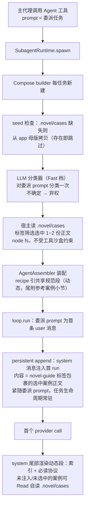
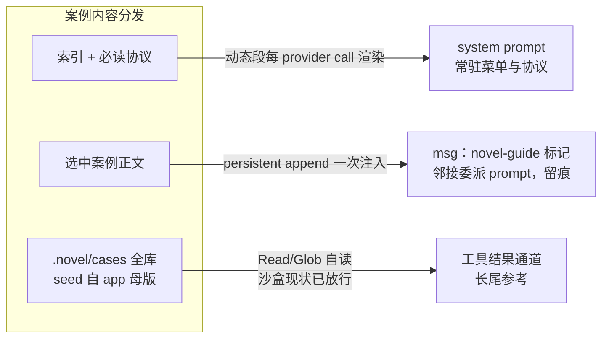

# compose 案例引导（novel-guide）PRD —— v0.6

> 状态：⏳ 待敲定（机制已实现：core 710 用例全绿 + typecheck + build 产物链通过；**作者已交付 15 份真实案例并替换初稿**；分类默认关闭，待验证后开启——见 §7）
> 关联：整体产品 PRD [`产品总览.md`](./产品总览.md)；[`agent-definition-config.md`](./agent-definition-config.md)（声明式装配规范）；[`project-stage-nudge.md`](./project-stage-nudge.md)（"分类 → 注入"先例、persistent append 通道与"邻接输入"原则）；[`eval-harness.md`](./eval-harness.md)；NOVEL.md 动态段先例（`core/src/runtime/prompt/sections/novel.ts` 的 `novel.global_constraints`）
> 演进：v0.1 选中案例正文与索引同走 system 动态段 → v0.2 通道分离（索引+协议进 system、正文以 `<novel-guide>` 标记 persistent append 进 msg）→ v0.3 **分类器直接上 LLM（Fast 采样档，弃权语义）**；**案例落位 workspace `.novel/cases/`（宿主 seed-if-absent）**——经核实文件沙盒只挡逃逸不挡 `.novel/`，自读通道 v1 即生效 → v0.4 **实现定稿**：标签/摘要由每份案例 front-matter 自描述（手写扁平解析，不引 YAML 依赖），**索引动态扫描派生、无 INDEX.md**（加/删案例 = 单文件操作，索引与目录永不漂移）；母版扁平布局 `core/resources/agent-cases/*.md`，构建期 `scripts/copy-resources.mjs` 拷入 dist 随包；evals 无 subagent 接线先例，全链路以 core 集成测试覆盖 → v0.5 **意图分类默认关闭**（`NOVEL_COMPOSE_GUIDE_CLASSIFY` env 显式开启）——索引+自读为主通道，prompt 升级为"**编写前先查案例、仅供参考、不抄袭**"；作者交付 15 份真实案例（大纲系 act/scene/overview + 设定系 world/character + 正文系 draft 与 8 类摘录），新增真实母版生效检查测试 → v0.6 **索引并入共享质量规范段**（novel.compose.guide 独立段删除：四份规范段转 dynamic，段尾按 task_type 前缀过滤附「参考案例」小节——main 与 Compose 同源常驻；快照改型为 entries 条目数组、通道更名 caseGuide；「先查案例/不抄袭」协议并入小节头部；`<novel-guide>` msg 注入与意图分类机制保留，见 PRD project-stage-nudge v2.7 第十四批）

---

## 1. 背景与目标

- 现状痛点：
  - Compose 子代理（声明式只读草案创作者，`NovelComposeAgentDefinition`）的全部任务上下文 = 主代理 Agent 工具的委派 prompt（作为首条 user 消息进入 loop），**启动时没有任何基于任务的额外注入**。
  - 质量规范（`novel.story_appeal` / `novel.outline_standard` / `novel.prose_standard`，好/坏对照例句）以静态段常驻 system prompt，但缺**任务级 few-shot 案例**（"这类任务的需求 → 合格产出长什么样"），草案质量依赖模型对规范条文的自行演绎，返工率偏高。
  - 主代理委派 prompt 携带的任务信息不稳定（有时明确、有时笼统）。
- 已评估并否决的备选：
  - **选中案例正文常驻 system 动态段**（v0.1 方案）：正文体量随案例库增长抬升每次 provider call 的 system 渲染；内容每次重渲染、消息流中不留痕，不可审计。→ v0.2 起正文走 msg 通道（注入一次、常驻留痕）。
  - **纯自读（路径写进 system 约束必读）作为唯一通道**：案例若只在 app 侧资源目录，Read/Glob 被 workspace 沙盒挡住不可达；且软约束缺乏合规可观察性。→ v0.3 以"案例落位 workspace `.novel/cases/`"补全自读通道，但保留 msg 注入为主通道。
  - **规则关键词分类器**（v0.2 默认方案）：验证是循环的（用自己的关键词测自己的规则），且依赖主代理委派措辞习惯；错配比漏配更有害（注入误导性 few-shot），规则难以做到精确率优先。→ v0.3 直接上 LLM 分类器（Fast 档），以弃权语义保精确率。
- 目标（一句话，可验收）：Compose 子代理在 spawn 时以 **Fast 档 LLM 分类器**对委派 prompt 做**一次分类（允许弃权）**——**案例库索引与必读协议进 system prompt**（动态段，常驻菜单），**选中的案例正文以 `<novel-guide>` 标记 persistent append 注入 msg**（紧随委派 prompt、任务生命周期常驻、事件流留痕），**未选中的案例可从 `<workspace>/.novel/cases/` 自读**（沙盒现状已放行）；草案概要必须自报参考案例。

## 2. 用户故事

- 作为创作者，我希望 compose 起草前对照与任务匹配的完整案例（而非只有抽象规范条文），以便草案一次成型率更高、返工更少。
- 作为创作者，我希望草案交付时明确自报参考了哪份案例，以便判断合规性并追溯质量问题。
- 作为创作者/维护者，我希望注入的案例内容在任务消息流中留痕（何时注入、注入了什么），以便事后审计模型当时看到了什么。
- 作为产品维护者，我希望案例库是文件驱动的（加案例不改代码、不发版），以便低成本迭代案例内容。

## 3. 流程图（必填）

### 3.1 spawn 主流程

### 3.2 内容分发三通道（msg 注入为主，自读为辅，索引可行动）

## 4. 功能明细

### F1 三通道架构

- 触发：每次 Compose 子代理 spawn。
- 输入：委派 prompt、app 母版资源、`<workspace>/.novel/cases/` 运行时副本。
- 处理（通道分工）：
  - **通道一 system（索引+协议）**：案例库索引与必读协议经动态段进 system prompt——常驻、每次 provider call 渲染、真 system 权威，承担"菜单 + 指令背书"。
  - **通道二 msg（选中正文，主通道）**：分类选中的案例正文以 `<novel-guide>` 标记 persistent append 注入首 run——邻接委派 prompt（注意力最高位，对齐 project_stage F1），注入一次、任务生命周期常驻、事件流留痕。
  - **通道三 Read 自读（辅通道）**：`.novel/cases/` 全库经 Read/Glob 自读——**沙盒现状已放行**（`files.ts` 沙盒只做逃逸拒绝与 symlink 防护，不过滤 workspace 内任何子目录），索引列出的每份案例均可行动；**无沙盒代码改动**。
- 输出：system prompt 中索引段 + 首 run 中 novel-guide 消息 + 静态协议文案。
- 异常：资源缺失/读取失败 → 动态段渲染占位提示、不注入正文消息（对齐 NOVEL.md 读取失败降级语义），不阻断 spawn。

### F2 案例库（app 母版 + workspace 副本，front-matter 自描述）

- **app 母版**：`core/resources/agent-cases/*.md`（扁平布局，随包分发；构建期 `scripts/copy-resources.mjs` 拷入 `dist/resources`）。**无 INDEX.md**——每份案例自带 front-matter（`---` 围栏内扁平 `key: value`，手写解析不引 YAML 依赖）：`task_type`（必填，缺失整份跳过）/ `character_type` / `situation`（可选，`-` = 不参与筛选）/ `summary` / `order`（缺省文件名序）。
- **运行时副本**：`<workspace>/.novel/cases/`——首次 Compose spawn 时若目录缺失则从母版整体拷贝（**seed-if-absent：存在即跳过，永不覆盖用户改动**）；注入、索引、自读三者同源指向该目录。母版定位：`NOVEL_AGENT_CASES_DIR` env → 模块目录向上查找（兼容 src/dist 布局）。
- **索引动态派生**：扫描 `.novel/cases/*.md` 解析 front-matter → 条目 + 渲染索引文本；以目录 mtimeMs 记忆化（增删/改名触发重扫）。加/删案例 = 单文件操作，索引与目录永不漂移。
- 案例正文结构："任务需求 → 参考产出 + 要点清单"的 few-shot 形态；**要点清单引用标准段标题而非复述条文**（如"对照「大纲规范」节奏拍条目"），缩小与 `novelStandards` 静态标准的漂移面。
- **标签筛选而非笛卡尔积**：分类结果做标签匹配选 1~2 份；未命中的维度不筛选（细筛空则退化任务级），task_type 不中 → 不注入。
- 首批（**作者已定稿交付，15 份**）：大纲系（act-design 幕设计 / scene-design 场景设计 / outline-overview 总纲）＋ 设定系（world-design 世界观 / character-design 人物）＋ 正文系（prose-draft 撰写 + 8 类摘录：suspense/plot/atmosphere/dialogue/character/combat/emotion/psyche/setting）；situation 维度已启用（如世界观案例标"穿越流"）。
- 索引规模约束：每案一行，总量 ≤ 20 案（索引每 provider call 渲染，控制常驻 token）。

### F3 system 侧索引承载（v0.6 起并入共享质量规范段；原 `novel.compose.guide` 独立段已删除）

- 四份质量规范段（`novel.story_appeal` / `novel.outline_standard` / `novel.prose_standard` / `novel.publication_standard`，main 与 Compose recipe 共享引用）v2.0.0 转 `kind: dynamic`，`renderDynamic` 读取 `input.caseGuide`（entries 条目数组）。
- 每段尾部按 task_type 前缀过滤附「参考案例」小节（标题含"按需 Read 对照、委派或审阅时可点名；仅供参考——不抄袭、不照搬原文"协议一句 + 过滤后索引行）；分配：story_appeal←world-/character-、outline_standard←outline-/act-/scene-、prose_standard←prose-、publication_standard 暂无（前缀占位）。
- **不渲染选中案例正文**（通道分离，正文仍走 `<novel-guide>` msg）；快照缺失/空库/无匹配 → 仅省略小节，规范正文恒渲染（不做整段占位）。
- 动态段不进 base 缓存；每 provider call 重渲染（案例库增删即时生效——修正 v0.5 前经 full footer 注入的时点快照缺陷）。

### F4 novel-guide 消息注入（msg 侧；**v0.5 起随分类默认关闭，暂不生效**——机制保留，env 开启后恢复）

- 触发：spawn 完成、`loop.run` 发起首 run 后、首个 provider call 前，执行一次（分类关闭时钩子直接返回 undefined，不注入）。
- 输入：分类标签筛选选中的 1~2 份案例正文。
- 处理：
  - 以 **persistent append** 注入一条 system 消息到首 run，位置**紧随委派 prompt**（compose 无压缩策略，无需清扫/重注入）。
  - 内容以 `<novel-guide>` 开闭标签包裹（**内层内容标记**）；wire 层按既有规则外层包 `<system-reminder>` 并降级 user 角色（`systemReminder.ts`；与 project_stage full nudge 同一 wire 形态，有生产先例）。
  - 权威性背书由 system 侧承担（F3 一句背书 + F7 静态协议明确"消息中的 novel-guide 块为本任务配套案例，必须对照"）。
  - 持久化语义（如实定义）：subagent loop 为 live-only（不落 conversation journal）——持久化 = 首 run 消息列表常驻整个任务 + 事件流经 hub 盖 agentId 留痕 + provider-call debug 开启时全 prompt 落盘。journal 级持久化属 subagent 通用能力扩展，见 §7。
- 输出：首 run 消息序 `user(委派) → system(novel-guide)`；后续 provider call 均可见，不重算。
- 异常：分类弃权或无匹配 → 不注入该消息（system 侧仅剩索引 + 兜底提示）；资源读取失败 → 同 F1 降级，不阻断。

### F5 LLM 分类器（spawn 一次，弃权语义；**v0.5 起默认关闭**——`NOVEL_COMPOSE_GUIDE_CLASSIFY=1|true` 显式开启，待作者验证后转常开）

- 接口 `IntentClassifier`：输入委派 prompt，输出标签集（task_type 必出或弃权；character_type / situation 有信号则出，无信号不出）。
- **v1 唯一实现 `LlmIntentClassifier`**（规则分类器不做，见 §1 否决理由）：
  - **专用 provider 实例**：Compose 连接 + `timeoutMs: 15_000`；采样 = **Explore 档（项目 Fast 档语义）回落主采样**（缺省模型即 deepseek-v4-flash），`maxTokens` 收紧 ≤1024 + `thinking: "off"`（分类是抽取型任务）。配置入口不新增设置项。
  - 输入 = 委派 prompt 原文 + 分类指令（**标签枚举从案例库扫描派生**，与库内容一致、不硬编码词表）；输出 = 结构化 JSON。
  - **弃权语义（精确率优先）**：指令明确"不确定时输出 unknown，不要猜"，枚举外/坏 JSON 一律弃权——错配（注入误导性 few-shot）比漏配（优雅降级到索引）更有害。
  - 失败降级：调用失败/超时/JSON 解析失败 → 视同弃权 → 不注入正文；**不做规则兜底**（避免维护两套词表回到循环验证问题）。
  - 延迟代价（如实）：spawn 关键路径 +1 次串行 Fast 调用；compose spawn 本身是 Agent 工具异步任务，相对整个草案生成周期占比小。
- 执行时机：Compose builder 闭包内 spawn 时执行一次，后续 provider call 不重算。

### F6 loop 层接线（对齐 novelConstraintsProvider 既有模式）

- 索引通道（v0.6 更名改型）：`DynamicPromptSectionInput.caseGuide` 字段（`CaseGuideSnapshot`，entries 条目数组）；loop config `caseGuideProvider` 选项；`LoopContext` 缺省 `async () => undefined`；`toProviderCall` 组装 dynamicInput 时调用。
- 消息通道：`AgentLoop.run` 扩展 seed 消息参数（或 SubagentRuntime 在 run 前以 persistent append 注入——实现取其一，语义必须是 persistent append 而非瞬态改写）。
- `NovelSubagentOptions` 的 `caseGuideProvider`（v0.5 名 composeGuideProvider，v0.6 更名）与正文注入装配项，`buildNovelSubagent` 透传。
- prompt 层保持 provider-neutral（不接触 node:fs），文件读取与 seed 全部在 node 层。

### F7 静态段协议文案（先查后写 + 仅参考不抄袭 + 自报）

- `novel.compose.process`（1.0.0 → 1.3.0）：「彻底探索」步骤加入——**编写前先查案例**：按规范段尾「参考案例」小节（v0.6 前为「任务案例引导」索引）选取匹配案例用 Read 通读后再动笔（或对照已注入的 `<novel-guide>` 块）；案例**仅供参考——不抄袭、不照搬原文**，产出基于当前故事的实际状态与设定。
- `novel.compose.reporting`（1.0.0 → 1.2.0）：草案概要新增必填项「参考案例：<名称/路径>」——把软约束变成可观察、可审计的交付契约。
- 协议文案只住静态段（F3 动态段仅指引 + 数据），避免多份文案漂移。

### F8 Compose recipe 与定义版本（v0.6 改写）

- v0.2~v0.5：recipe 曾在 `novel.prose_standard` 之后插入独立段 `novel.compose.guide`（definitionVersion 1.2.0）；v0.6 该段删除，索引由 recipe 既有的三份共享质量规范段（story_appeal / outline_standard / prose_standard）承载；definitionVersion 1.2.0 → 1.3.0（13 段）。
- 段注册表 `novelSections.ts` 移除 `novelComposeGuideSection`（25 → 24 段）。

## 5. 边界与非目标

- 明确不做（v1）：
  - **规则关键词分类器**（否决理由见 §1；接口保留，未来如需可加实现）。
  - **意图分类默认关闭**（v0.5 决策）：LLM 分类与 `<novel-guide>` msg 注入经 `NOVEL_COMPOSE_GUIDE_CLASSIFY` env 显式开启；关闭期间索引自读为主通道——分类器代码与测试保留，开启零改动。
  - **沙盒代码改动**（`.novel/` 现状已放行，无需任何变更；写入类工具沙盒策略同样不动——compose 本就无写入工具）。
  - 不修改 `novelStandards` 三段静态标准本体（案例引用标准段标题，不复述条文）。
  - 不做 mid-loop 追加 / steer 化注入（仅 spawn 一次；compose 无压缩、单任务生命周期，无需 full/sparse、纪元、压缩清扫）。
  - 不做 subagent journal 级持久化（live-only 维持，见 §7）。
  - seed 只做"缺失即拷贝"，**永不覆盖** `.novel/cases/` 内既有文件（用户本地改动优先；母版升级传播策略见 §7）。
  - 注入不构成"硬保证"：案例是概率性提升；硬约束仍靠标准段条文 + 主代理审批闸门。
  - 不给 explorer 接入本机制（仅 main / Compose 两侧）。案例**路径可见性**由四份共享质量规范段尾「参考案例」小节提供（v0.6 起与 Compose 同源常驻；v2.4 的 project_stage full footer 机制已于 v2.7 移除）——`<novel-guide>` msg 注入仍仅 Compose，不改变正文注入"仅 Compose"的边界。

## 6. 验收标准

- [x] 规范段小节渲染单测（v0.6 改写）：四段前缀过滤各归其位、快照缺失/空库仅省略小节正文恒渲染（正文不经过本通道）。
- [x] novel-guide 消息注入单测：首 run 消息序 `user(委派) → system(novel-guide)`；弃权/无匹配/钩子异常不注入不阻断；仅首 run 一次。
- [x] LLM 分类器单测（scripted provider）：命中输出标签；unknown/枚举外/垃圾文本/抛错 → 弃权；断言单次调用、空库不调用。
- [x] 选例单测：task_type 精确过滤、可选维度细筛空则退化任务级、超 2 截断、不中 → 空。
- [x] seed/扫描单测：缺失拷贝、存在跳过不覆盖、母版不可用降级；front-matter 解析边界（缺字段/无围栏/坏行）；mtime 缓存重扫；order 排序。
- [x] 沙盒回归：Read/Glob 可达 `.novel/cases/`、逃逸仍拒（现状断言，防未来沙盒收紧回退）。
- [x] loop 透传单测：caseGuideProvider 每 call 注入、未注入省略。
- [x] recipe 生效断言（v0.6 改写）：段序 13 段、无 `novel.compose.guide`、三规范段为 dynamic、definitionVersion 1.3.0。
- [x] 集成用例（替代 evals——runner 无 subagent 接线先例）：真装配 + stub 闭包跑一次 `loop.run`，断言 system 含规范段「参考案例」小节渲染、消息序 `user → system(novel-guide)`、seed 异常降级。
- [x] 既有 core 用例全绿（85 文件 710 用例）+ typecheck + build 产物链（copy-resources 落 dist/resources/agent-cases）。
- [x] **真实母版生效检查**（v0.5）：`agent-cases-real.test.ts` 以 `core/resources/agent-cases` 实文件跑通 seed→扫描→解析→索引全链（锚定标签体系与 order 序，防手写 front-matter 笔误）。

## 7. 开放问题（定稿前必须清零）

- **作者手工验证案例有效性（进行中）**——索引自读模式下的真实委派任务验证（compose 是否先查案例、是否只参考不抄袭）；结果回填后本条清零。
- **意图分类开启时点**：索引自读模式验证满意后再开 `NOVEL_COMPOSE_GUIDE_CLASSIFY` 常开（分类注入是否带来增量收益，与自读模式对比）。
- 无匹配兜底形态：仅索引 + 通用提示（当前实现）vs 增设一份"通用起草案例"必注入。
- seed 升级传播策略：母版更新后如何到达旧 workspace（版本戳 + 用户未改动则更新 vs 手动刷新命令 vs 不传播；当前实现 = 不传播——**注意：15 份案例入库后，早期已 seed 过三份初稿的旧 workspace 需删除 `.novel/cases/` 重新 seed**）。
- novel-guide 消息的 journal 级持久化是否启用（需 subagent listeners 扩展；当前 live-only，留痕仅事件流 + debug 落盘）。
- novel-guide 消息在 UI 任务详情中的展示策略（project_stage F10 有"UI 不展示"先例，subagent 事件面如何呈现待定）。

（已清零：母版位置 = `core/resources/agent-cases/` + 构建拷贝，运行时向上查找 + env 覆盖；分类器采样入口 = 复用 Explore Fast 档回落主采样，不新增设置项；evals 替代 = core 集成测试覆盖全链路；**首批案例内容定稿 = 作者已交付 15 份真实案例并替换初稿**。）
