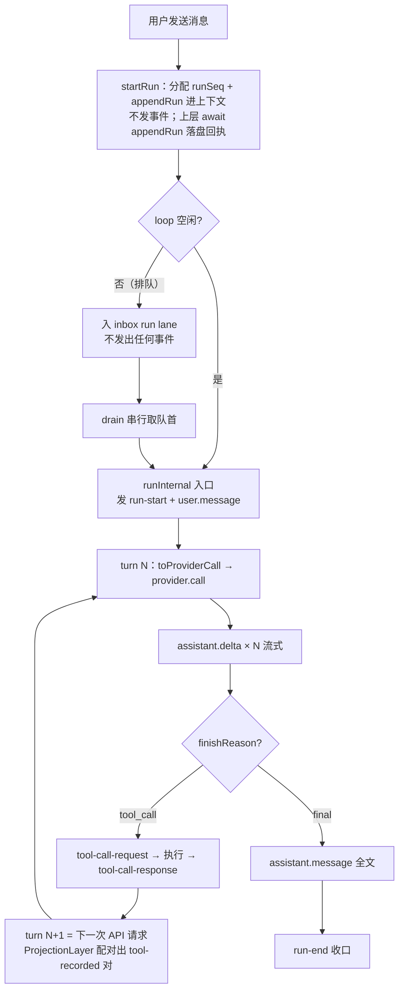
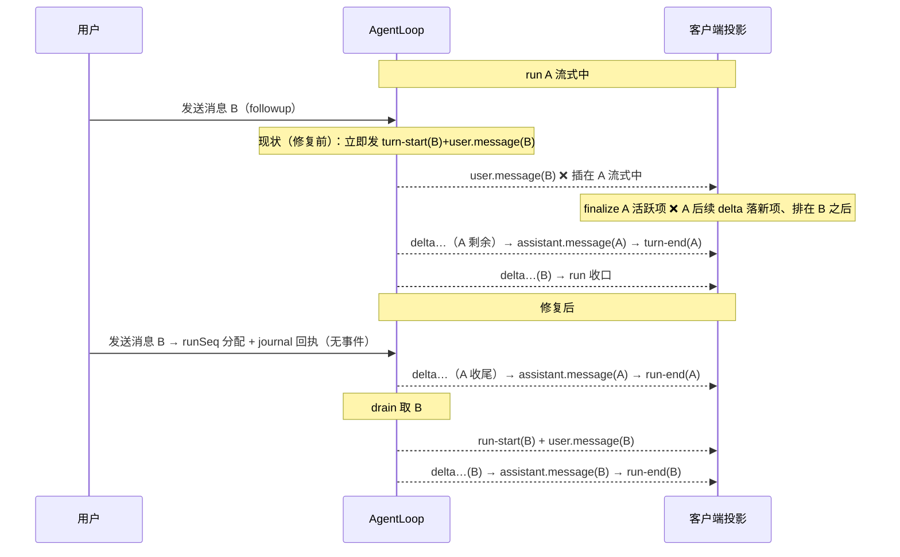
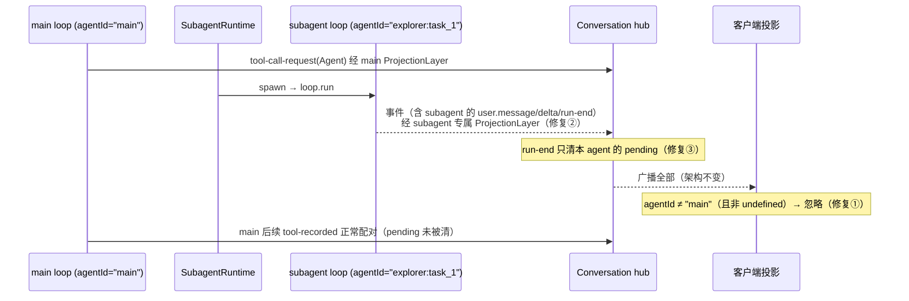
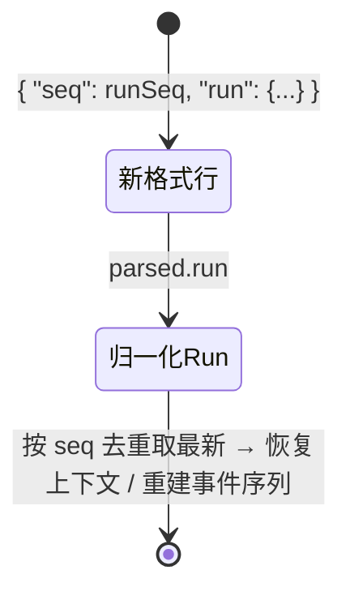

# conversation-run/turn-术语统一 PRD —— v1.0

> 状态：✅ 已定稿（2026-08-14；开放问题已清零，决策记录见 §7）
> 关联：整体产品 PRD [`产品总览.md`](./产品总览.md)；事件域设计 [`output-投影层.md`](./output-投影层.md)；技术设计 `docs/architecture.md`
> 使用说明：新 PRD 从本模板复制起步，固定章节不得删减；流程图必填。

---

## 1. 背景与目标

- 要解决的问题（痛点 / 现状）：
  1. **术语二义**：代码中 "turn" 同时表示两个概念——用户轮（`TurnContext` / `turn-start`·`turn-end` 事件 / journal 落盘单位 / `turnSeq`）与请求轮（`curTurn`·`maxTurns` / UI「每 turn 一段」的 `AssistantSegment`）。已引发真实事故：live 流式「读\n完了」断行排查中，把「工具行收口切段（请求轮边界）」误读为「turn-end 之后还有 delta（疑似乱序）」，逐环验证事件有序后才发现是撞名（见 `ConversationProjection.ts:275` 注释「新请求的内容 → 开新段」vs `AgentLoop.ts:376` 的 turn-end）。
  2. **排队用户轮事件交错**：`run()`/`followup()` 在**入队时**即发 `turn-start`/`user.message`（`AgentLoop.ts:88、409-424`）。run A 流式中用户发送 B，B 的 `user.message` 插进 A 的事件流 → 客户端提前 finalize A 的活跃项（`ConversationProjection.ts:241-248`），A 的后续 delta 落到新开的 assistant 项、且排在 B 的用户消息**之后**——时间线乱序 + A 的回答被切成两个消息项。
  3. **subagent 事件污染主流**：`Conversation.ts:140-143` 把 subagent loop 事件经**同一 hub、同一 ProjectionLayer 实例**插入主流，且客户端 `apply()` 不按 `agentId` 过滤——subagent 的 `user.message`/`assistant.delta`/`assistant.message` 直接混入主对话时间线；更深的 bug：subagent 的 `turn-end` 触发共享 `ProjectionLayer.pending.clear()`（`ProjectionLayer.ts:69-72`），把 **main** 的未配对 tool-call 清掉，后续 `tool-recorded.recorded` 退化为 `unknown`、preview 丢失。
- 目标（一句话，可验收）：全代码库统一术语——**turn = 一次 API 请求、run = 一次用户消息驱动的完整回复周期**——并同批修复排队交错与 subagent 隔离两个事件流缺陷。开发阶段，**不保留任何旧格式兼容**（事件名直接替换、journal 旧 key 不回退读取）。

## 2. 用户故事

- 作为开发者，我希望 "turn/run" 在代码、事件、注释、文档中各只有一个含义，以便排查事件流问题时不再因撞名误判（如把请求轮边界当成 turn-end）。
- 作为用户，我在回答生成中追发消息时，希望时间线按真实执行顺序展示（A 完整回答 → B 消息 → B 回答），以便阅读不中断、不串位。
- 作为用户，我希望 subagent 执行期间主对话不被其文本/工具行污染，主流工具行 preview 不因隔离缺失而丢失。

## 3. 流程图（必填）

### 3.1 主流程：统一后的 run / turn 事件时序

要点：`run-start`/`user.message` 从「入队时」改为「drain 实际执行时」发射（§4.5）；turn 边界无显式事件，仍由投影层从 tool-recorded 对推断（§5 非目标）。

### 3.2 多主体交互一：排队场景（修复前后对照）

### 3.3 多主体交互二：subagent 事件隔离

### 3.4 状态流转：journal JSONL 行格式（不兼容旧格式）

开发阶段不保留兼容：旧格式行（`turn` key）缺 `run` 字段，落入既有「损坏行容忍」分支被忽略——存量 journal 文件不再可读，属预期（可接受丢弃重建）。

## 4. 功能明细

### 4.1 术语规范（canonical，定稿后回填 architecture.md）

| 术语 | 定义 | 持久化/事件边界 |
| --- | --- | --- |
| **run（用户轮）** | 一次用户消息驱动的完整回复周期：user → N × turn → final assistant 消息 | journal 落盘单位（一行一个 run 快照，`seq` = runSeq）；事件 `run-start` / `run-end` |
| **turn（请求轮）** | run 内一次 provider API 请求及其工具执行收口 | 无显式事件；由投影层从 tool-recorded 对推断（UI `AssistantSegment` 一段 = 一 turn） |
| turn 计数 | `curTurn` / `maxTurns`（每 run 最大请求数，防死循环） | 现名语义已正确，不改 |

判定规则（写代码/文档/注释时自查）：说「一次 API 请求」用 turn；说「一次用户消息/一次完整回复/落盘单位/分隔条」用 run。

### 4.2 命名映射与代码触点

| 层 | 现名（用户轮义） | 新名 |
| --- | --- | --- |
| 类型 | `TurnContext` | `RunContext`（现 `RunContext` → `RunProgress`，见下） |
| 类型 | `RunContext`（curTurn/maxTurn/toolsLastTurn，运行进度） | `RunProgress` |
| 事件 | `turn-start` / `turn-end` | `run-start` / `run-end` |
| 事件字段 | `turnSeq` | `runSeq`（`seq` 字段名不变，含义 = runSeq） |
| LoopContext | `turns` / `appendTurnContext` / `appendTurnMessages` / `onTurnAppended` / `onTurnMessageAppend` / `MAX_TURNS` / `turnMessages` / `createTurn` | `runs` / `appendRun` / `appendRunMessages` / `onRunAppended` / `onRunMessageAppend` / `MAX_RUNS` / `runMessages` / `createRun` |
| AgentLoop | `startTurn` / `resumePendingTurn` / `LoopInput.lane:"turn"` / `runTurnLoop` | `startRun` / `resumePendingRun` / `lane:"run"` / **保留**（请求轮义，正确） |
| journal 契约 | `appendTurn` / `writeTurns` / `PersistedTurn` / JSONL 行 key `turn` | `appendRun` / `writeRuns` / `PersistedRun` / key `run`（不兼容旧 key，§4.4） |
| 投影 | `ConversationTimelineItem.turnEndSequence` | `runEndSequence` |
| ProjectionLayer | `turn-end` 清 pending | `run-end` 清 pending（§4.6 按实例隔离） |
| 审批 requestId | `approval_<conv>_<turnSeq>_<toolCallId>` | `approval_<conv>_<runSeq>_<toolCallId>` |
| UI | `kind:"turn"` 分隔条 / `styles.turnSep` /「turn 分隔」注释 | `kind:"run"` / `styles.runSep` /「run 分隔」 |
| UI 注释 | 「每 turn 一段」「按 turn（一次 API 请求）分段」 | **保留**（请求轮义，已正确）；「一轮只显示最后一 turn」改「一 run 只显示最后一 turn」 |

代码触点清单（实施时以此为准，验收 §6 有 grep 检查）：

- **core/src**：`runtime/loop/types.ts`、`runtime/loop/LoopContext.ts`、`runtime/loop/AgentLoop.ts`、`conversation/contract/events/{shared,output,projected}.ts`、`conversation/contract/journal/{service,readonly}.ts`、`conversation/persistence/FileConversationJournal{,ReadOnly}Service.ts`、`conversation/projection/ProjectionLayer.ts`、`conversation/JournalBridge.ts`、`conversation/server/{Conversation,WaitRequestQueue}.ts`（注释）、`client/ConversationProjection.ts`（事件名 + `turnEndSequence` + start() 的 liveTurn 门控 `turn-start`→`run-start`）、`client/NovelApiClient.ts`、`node/runtime/runDesktopRuntimeChildEntrypoint.ts`。实施时另行删除遗留最小投影器 `conversation/ConversationProjector.ts`（消费完整域 LoopEvent、无生产引用；前端已统一依赖 ProjectedEvent）及其两个旧测试。
- **gui/src**：`main/minimal.ts`（echo loop 手写事件 + `TurnContext` + JSONL 写入同步改）。
- **ui/src**：`domains/conversation/projection/ConversationTimelineItem.ts`（re-export core 类型，注释）、`components/ConversationTimeline.tsx`、`shell/main/chatSurfaceMapper.ts`、`components/AssistantMessage.tsx`（注释）、`binding/ConversationProjectionBinding.ts` / `shell/main/ChatSurface.tsx`（注释）。
- **测试**：core `agent-loop / projection-layer / journal-service / conversation / conversation-projector / subagent-runtime / client` 测试 + ui `runtimeFlow / binding / hooks / main` 测试中的事件名字面量。
- **文档**：`docs/architecture.md`（概念模型）、`docs/PRD/产品总览.md`、`docs/PRD/output-投影层.md`（§3 图、§4.1/4.4/4.5/4.7 事件名）、`docs/PRD/gui-performance.md`（涉及处）、`CLAUDE.md`、`docs/design/tool-call-embed-demo.html`。

### 4.3 事件契约改造

- `shared.ts`：`TurnStartEvent`→`RunStartEvent`（`type:"run-start"`）、`TurnEndEvent`→`RunEndEvent`（`type:"run-end"`）；`turnSeq` 字段 → `runSeq`；`OutputEvent`/`ProjectedEvent` 联合同步。
- `AgentLoop.ts`：三处发射点改名（final `:376`、abort `:183`、异常收口 `:193`）。
- `FileConversationJournalReadOnlyService.toOutputEvents`：重建序列产出 `run-start`/`run-end`（journal 内不存事件名，无磁盘迁移）。
- **兼容策略**：kkrpc 双端（conversation 子进程 ↔ UI）随同一版本发布，开发期产品无外部消费者，事件名直接替换、不做双写；`resume`/重放场景由新代码统一重建，不出现新旧名混读。

### 4.4 journal 落盘格式（不兼容旧格式）

- 写侧（`FileConversationJournalService` / gui `minimal.ts`）：行格式 `{ "seq": runSeq, "run": RunContext 快照 }`。
- 读侧（`FileConversationJournalReadOnlyService.readLatestTurns`→`readLatestRuns`）：只读 `parsed.run`；其余（按 seq 去重取最新、损坏行容忍）不变。
- 不做一次性迁移工具、不回退读旧 key：旧格式行按损坏行忽略，存量 journal 会话不再可读（开发期可接受，丢弃重建）。
- 异常与回退：行缺 `run` key 或解析失败 → 忽略该行（现状行为）。

### 4.5 修复一：排队 run 的边界事件延迟发射

- 触发：run A 执行中（`running=true`），用户发送消息 B。
- 输入：`followup(text)` / `run(text)`。
- 处理逻辑：
  1. `startRun` 拆为两步：**`createRun`**（组装 `RunContext`、`appendRun` 分配 runSeq、journal 回执路径可 await）与 **`emitRunOpen`**（发 `run-start` + `user.message`）。
  2. `emitRunOpen` 移至 `runInternal` 入口（drain 实际执行该 run 时）；入队路径只 `createRun` + 入 inbox，不发事件。
  3. `sendUserMessage` 回执不受影响：`await journal.appendRun(run)` 直调（`Conversation.ts:160-164`），不经事件流。
  4. JournalBridge 落盘不受影响：走 `LoopContextListener` 状态回调（`onRunMessageAppend` → `appendRun`），与事件发射时机解耦。
  5. 客户端不加防御逻辑：发射点唯一且顺序有保证（`run-start(B)` 必在 `run-end(A)` 之后），旧端兼容场景不存在（开发期双端同版本）。
- 输出：事件流顺序 = 执行顺序；B 的 `run-start`/`user.message` 必在 A 的 `run-end` 之后。
- 异常与回退：
  - stop 清空排队：被丢弃的 run 从未发过 `run-start`/`user.message`，但 `sendUserMessage` 可能已落盘快照（仅 user 消息）——重启重放时 journal 重建出该 run 的完整边界事件，行为与现状一致（非本次引入），记录不改。
  - `resumePendingRun`：沿用既有 run（journal 恢复），不发 `run-start`（重放已提供），现状保持。

### 4.6 修复二：subagent 事件隔离

- 触发：main 工具 `Agent` spawn subagent 期间。
- 输入：`SubagentRuntime.onEvent` 转发的 subagent LoopEvent（`agentId = "<agentType>:<taskId>"`）。
- 处理逻辑：
  1. **ProjectionLayer 按 agent 分实例**：Conversation hub 维护 `main` 专属投影层 + 每 subagent 任务一个实例（`Map<agentId, ProjectionLayer>`）；subagent 的 `run-end` 只清自己的 pending，main 的 tool-call 配对不再被误清（修 `Conversation.ts:140-143` 单实例共用）。
  2. **客户端过滤**：`ConversationProjection.apply` 首行守卫——`event.agentId !== undefined && event.agentId !== "main"` 直接 return。规则语义：**盖章即 subagent**（subagent 事件恒带 `agentId = "<agentType>:<taskId>"`），未盖章（undefined，gui `minimal.ts` / 测试夹具）与 `"main"` 视为主流。沿用字面量比较，**不引入 `MAIN_AGENT_ID` 常量**（与 `JournalBridge` / `ProcessSpawner` 现状风格一致）。
  3. hub 桥接保留且全量广播（architecture 概念：subagent live-only 进 hub 不落 journal）；带宽收敛与 per-agent 订阅通道随 Part 2（subagent 可视化）另立 PRD 评估。
- 输出：subagent 运行期间主流时间线零混入；main 工具行 preview 配对完整。
- 异常与回退：未知 agentId 格式按「非 main 即忽略」处理；未来新增常驻 agent 类型时须显式扩展判定规则。

### 4.7 顺带修复：连续工具批次误并段

- 触发：同一 run 内两次连续 API 请求都以 tool_call 结束、中间无正文 delta（模型直接连环调工具）。
- 现状：`ConversationProjection.pushToolRow` 无视 `segmentIsClosed()` 直接 append 到最后一段 → 两请求的工具行并进一段，破坏「每请求一行」语义。
- 处理：`pushToolRow` 前若 `segmentIsClosed()` → `openSegment()`（开新空段承接本批工具行）。
- 输出：每个请求轮一段工具行；纯文本轮不产生空段（`pushSegment` 空缓冲跳过逻辑不变）。

### 4.8 文档同步

按 §4.2 清单更新全部文档与注释；architecture.md 概念模型补术语表（§4.1 原文回填）；`CLAUDE.md` 若含术语约定同步。UI 文案不涉及（turn/run 均为开发者术语，不外显）。

## 5. 边界与非目标

- 明确不做：
  - 不引入显式 turn（请求轮）边界事件——UI 分段继续由 tool-recorded 推断 + §4.7 修正；若未来需要精确边界（纯思考轮、空文本轮展示）另立项。
  - 不迁移/重写存量 journal 文件，不回退读旧 key（旧文件按损坏行忽略，可接受丢弃）。
  - 不做事件名新旧双写/协商（开发期双端同版本发布）。
  - 不引入 `MAIN_AGENT_ID` 常量（沿用字面量 `"main"` 比较）。
  - subagent 可视化 UI（Part 2）与 per-agent 订阅通道不在本 PRD 范围。
  - 不改 `seq` 分配策略与 journal「同 seq 多写取最新」语义。
  - 不解决「读\n完了」分段渲染形态本身（turn 间换行分隔是 8a05049 既定设计；本次仅消除术语二义，展示形态另议）。

## 6. 验收标准

- [ ] 术语 grep 检查通过：core/ui/gui 源码与测试中 `turn-start|turn-end|turnSeq|TurnContext|appendTurn|writeTurns|PersistedTurn|turnEndSequence|startTurn` 零命中；白名单（请求轮义，允许保留）：`maxTurns|curTurn|maxTurn|runTurnLoop|toolsLastTurn|AssistantSegment 相关注释`。
- [ ] 旧格式 journal 文件（`turn` key 行）打开会话时被安静忽略、不报错（损坏行容忍路径）；新写入均为 `run` key。
- [ ] 排队场景（新增测试）：A 流式中发送 B → 时间线顺序为 user(A) → A 完整回答（单 assistant 项）→ user(B) → B 回答；A 项不被切分、B 的 user.message 不早于 A 的 `run-end` 到达客户端。
- [ ] subagent 隔离（新增测试）：subagent 运行期间主流 timeline 无 subagent 文本/用户消息；subagent `run-end` 后 main 的 pending tool-call 配对完好（`tool-recorded.recorded` 不退化为 `unknown`）。
- [ ] 连续工具批次（新增测试）：两次连续工具请求渲染为两段工具行。
- [ ] core / ui / gui 测试全绿（基线：ui 291 用例）。
- [ ] 文档同步完成（architecture.md 术语表、output-投影层 §3/§4 事件名、CLAUDE.md）。

## 7. 开放问题

已全部裁决（2026-08-14 定稿，无遗留）：

1. `RunContext`（原 `TurnContext`）运行进度态命名 → **`RunProgress`**（否决 `RunState`/`LoopProgress`；nudge/compact 策略接口引用随实施全量替换）。
2. subagent 事件广播 → **保留全量桥接广播**（架构一致性优先）；WS 带宽收敛（50–100Hz delta × 多任务在客户端过滤后为纯浪费）随 Part 2 per-agent 订阅通道落地时一并评估。
3. journal 兼容 → **不做兼容**：开发阶段，读侧只读 `run` key，旧 `turn` key 行按损坏行忽略、存量会话可丢弃；无「保留期限」问题。
4. `"main"` 判定 → **不引入 `MAIN_AGENT_ID` 常量**，沿用字面量比较（与 `JournalBridge` / `ProcessSpawner` 现状风格一致）。
