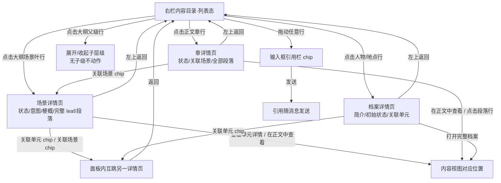
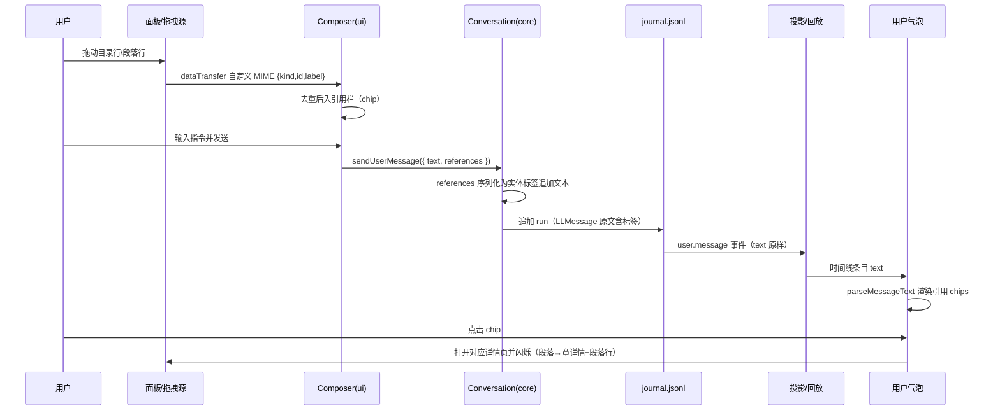
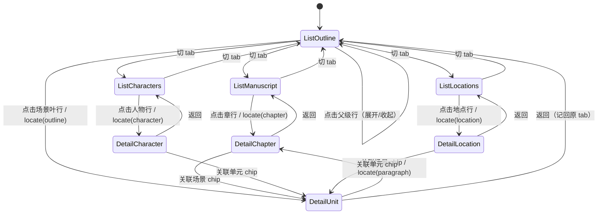

# conversation-目录下钻与实体引用 PRD —— v1.0

> 状态：✅ 已定稿（2026-08-19 实施落地：ui/core 按 §4 模块映射完成，验收 §6 全过——core 720 项、ui 370 项 Vitest、构建与 demo smoke 无回归）
> 关联：整体产品 PRD [`产品总览.md`](./产品总览.md)；技术设计 `docs/architecture.md`（§7 已回填引用序列化约定）；视觉/交互基准 [`../design/app-redesign-demo.html`](../design/app-redesign-demo.html)（v0.10.0，回归脚本 `.demo-smoke.cjs`）；总设计 PRD [`../design/app-redesign-prd.md`](../design/app-redesign-prd.md)
> 使用说明：新 PRD 从本模板复制起步，固定章节不得删减；流程图必填。

---

## 1. 背景与目标

- 要解决的问题（痛点 / 现状）：
  - 对话视图右栏「内容目录」目前是「列表 + 手风琴摘要卡」两层：大纲叶行就地展开意图/梗概简卡，人物/地点行展开摘要卡，正文章行与大纲父级行点击直接跳内容视图——查任何稍深的资料都要离开对话语境；面板内没有段落级内容。
  - 输入框无法把具体实体（人物/地点/大纲单元/章/段落）作为明确上下文交给 AI，用户只能复制粘贴正文或口述「第二章第三段」。
  - ui 内已有休眠脚手架（`ComposerInput.references` 恒发空数组、`ComposerDraftStore.addReference` 无人消费），core 契约 `ConversationUserMessage` 只有 `text`。
  - 交互方案已在 demo v0.10.0 完整验证（下钻详情页 + 五类实体拖入引用，smoke 92 断言全过 + 专项 27 断言全过）。
- 目标（一句话，可验收）：chat 视图右栏内容目录支持下钻详情页（四类实体整栏详情 + 返回 + 面板内互跳），五类实体可拖入输入框作引用并随消息发送、气泡回显 chips、点击反向定位到详情页——全部交互对齐 demo v0.10.0，ui Vitest 全过、demo smoke 不回归。

## 2. 用户故事

- 作为作者，我希望在对话里让 AI 修改某一段正文时，把那一**段**直接拖进输入框作引用，以便 AI 精确定位上下文，我不用复制粘贴再描述位置。
- 作为作者，我希望点击右栏目录里的章/场景/人物就能在面板里看完整详情（含段落、场景设计 leaf），以便随手查资料不打断对话流。
- 作为作者，我希望点击对话消息里的实体标签或引用 chip 时右栏直接打开对应详情页，以便顺着 AI 提到的东西深挖设定。
- 作为作者，我希望引用以 chip 形式留在输入框（可删除、可纯引用发送），以便多轮指令复用同一批引用。

## 3. 流程图（必填）

### 3.1 主流程：目录列表 ⇄ 下钻详情页

### 3.2 多主体交互：拖入引用 → 发送 → 气泡回显 → 点击定位

### 3.3 状态流转：右栏面板状态机

## 4. 功能明细

实施模块映射总表（demo v0.10.0 → 正式代码）：

| 能力 | 实施位置 | 类型 |
| --- | --- | --- |
| 面板下钻状态机 | `ui/src/shell/inspector/ContentDirectoryStore.ts` | 扩展 |
| 列表⇄详情路由 + 详情页组件 | `ui/src/shell/inspector/panels/ContentDirectoryPanel.tsx`（新增 UnitDetailPage / ChapterDetailPage / EntityDetailPage / ParagraphRow） | 扩展+新增 |
| 场景 leaf 渲染 | 复用 `ui/src/domains/novel/outline/components/LeafPlanCard.tsx` | 复用 |
| 引用拖拽源/落点 | 新增 `ui/src/shared/`（useDragReference / useReferenceDropTarget） | 新增 |
| 引用栏 + 发送 | `ui/src/domains/conversation/components/ConversationComposer.tsx`、`store/ComposerDraftStore.ts`（激活脚手架） | 扩展 |
| 发送链签名加宽 | `ui/src/shell/main/ChatSurface.tsx`、`domains/conversation/hooks/useActiveConversationSession.ts`、`binding/ConversationProjectionBinding.ts` | 扩展 |
| 排队幽灵项 chips | `ui/src/domains/conversation/components/QueuedUserMessage.tsx` | 扩展 |
| 契约 + 标签序列化 | `core/src/conversation/contract/types/message.ts`、`core/src/conversation/server/Conversation.ts` | 扩展 |
| 点击定位路由 | `ui/src/shell/ApplicationShell.tsx`（handleReferenceClick） | 修改 |
| 段落→章反查 | `ui/src/domains/novel/manuscript/store/ManuscriptStructureStore.ts` | 扩展 |

- **F1 面板下钻状态机**：
  - 触发：点击列表态最细粒度行；面板内互跳 chip；点击定位（引用 chip / 实体标签）。
  - 输入：`detail = { kind: "unit" | "chapter" | "character" | "location"; id: string }`。
  - 处理：`ContentDirectoryStore` 增加 `detail` 状态、`openDetail(kind, id)`、`back()`；`locate(kind, id)` 扩展为五类统一直达详情页（character/location 由现列表行闪烁改为开详情页；outline→unit、chapter→chapter、paragraph→所在章详情页并携带段落闪烁目标），沿用 nonce 重触发闪烁；tab 状态保留为返回上下文。
  - 输出：面板在列表态与详情态间切换；重复 locate 重放闪烁。
  - 异常：id 对应实体不存在（store 已失效）→ 返回列表态并触发对应 store 刷新。
- **F2 场景详情页（unit）**：
  - 触发：大纲 tab 点击场景叶行 / 互跳 / locate(outline|paragraph 所关联单元)。
  - 输入：unitId。
  - 处理：`outlineTree.getUnit(unitId)` 取完整单元（含 `leaf: LeafPlan`、双状态、blockState、abandonment）；场景渲染 `LeafPlanCard`（复用，含人物/地点绑定、事件序列、节奏拍、实体变更）；段落取 `chapter.storyUnitId === unitId` 的章 blocks（ManuscriptStructureStore，全文已在内存）；非场景单元只渲染状态/意图/梗概，不渲染 leaf 与段落。两个跳转按钮：「查看单元详情」（onSelectOutlineUnit）、「在正文中查看」（onOpenChapter）。
  - 输出：整栏详情页，含状态 chips、受阻/废弃横幅、意图/梗概、leaf、段落行（见 F5）、跳转按钮。
  - 异常：无关联章 → 段落区显示空态；leaf 缺失 → 显示「leaf 未编写」提示（LeafPlanCard 既有空态）。
- **F3 章详情页（chapter）**：
  - 触发：正文 tab 点击章行 / 互跳 / locate(chapter|paragraph)。
  - 输入：chapterId（+可选 paragraphId 闪烁目标）。
  - 处理：`manuscript.chapters.find(chapterId)` 取 blocks；关联场景 chip 由 `chapter.storyUnitId` 反查大纲树标题，可点互跳 unit 详情；段落数量大时行级 `content-visibility`（ConversationTimeline 既有模式）；「在正文中查看」按钮。
  - 输出：状态 chip、卷名/字数 meta、受阻/废弃横幅、关联场景 chip、段落行列表、跳转按钮。
  - 异常：受阻/弃置章显示横幅（无段落）；未落笔章显示空态。
- **F4 人物/地点档案页（entity）**：
  - 触发：人物/地点 tab 点击行 / locate(character|location) / leaf 绑定 chip 互跳。
  - 输入：characterId / locationId。
  - 处理：复用 `useCharacterDetail` / `useLocationDetail`（detailCache 懒加载）；关联单元来自 `outline.bindings`（chips 由静态 span 改为可点按钮 → openDetail("unit")）；「打开完整档案」→ onOpenCharacter / onOpenLocation 跳内容视图。
  - 输出：头像/名称/角色行、简介、初始状态（人物）、关联单元 chips、跳转按钮。
  - 异常：详情加载中显示骨架/占位；实体被删 → 返回列表。
- **F5 拖拽引用（五类）**：
  - 触发：从目录行（大纲树任意层级 / 章 / 人物 / 地点）或详情页段落行拖入输入框。
  - 输入：`{ kind: "character"|"location"|"outline"|"chapter"|"paragraph"; id; label }`——段落用真实全局 ParagraphId（优于 demo 的「章:序号」编码）；拖拽经 `dataTransfer` 自定义 MIME 传递（仓库首例 HTML5 DnD，demo 已验证 Electron/Chromium 可行）。
  - 处理：新增共享 hook（拖拽源设 `draggable` + MIME 写入 + 迷你 chip 拖影；落点 composerBox 拖悬高亮、drop 解析）；引用集合接 `ComposerDraftStore`（激活休眠脚手架，`captureReference` kind 校验扩为五类；进程内按会话持久化，切会话/重开不丢）；去重（kind+id）、×移除、空输入退格移除末枚、纯引用可发送（text 允许为空，text 与 references 均空才禁发）。
  - 输出：输入框内文本区上方引用栏 chips；发送后清空。
  - 异常：拖入非法载荷忽略；重复拖入 toast 提示；IME 输入中不误触退格删除（沿用 isComposing 守卫）。
- **F6 引用随消息发送（方案：契约结构化 + 标签序列化）**：
  - 触发：发送（Enter / 按钮）。
  - 输入：`ComposerInput { text, references }`。
  - 处理：ui 四处签名机械加宽（ConversationComposer.submit → ChatSurface.onSend → useActiveConversationSession.sendUserMessage → ConversationProjectionBinding.sendUserMessage）；core 契约 `ConversationUserMessage` 增加可选 `references?: readonly { kind; id; label }[]`（五类联合，对齐 ui `MessageReference`，向后兼容）；`Conversation.sendUserMessage` 在 references 非空时将其序列化为既有实体标签语法追加文本：`text + "\n" + <kind id="...">label</kind>…`（label 做 XML 转义）后交给 `loop.followup`。持久化（journal 存 LLMessage 原文）、回放（toOutputEvents）、投影、气泡渲染（`parseMessageText` 已支持用户消息内标签→chips）零额外改动；排队幽灵项 `QueuedUserMessage` 补同解析。
  - 输出：用户气泡文本尾部内联引用 chips；模型在文本中看到标签。
  - 异常：references 为空时行为与现状完全一致（纯文本）；序列化失败（label 含非法字符）转义兜底。
- **F7 模型消费（方案：不注入，模型自取）**：
  - 触发：模型处理含标签的用户消息。
  - 输入：文本内 `<character id="…">` 等标签。
  - 处理：零 core 上下文改动——`novel.system` 系统提示已声明标签语法与工具约定，模型经 `NovelRead`（kind/characterId/locationId/storyUnitId/paragraphId）自取档案。后续增强（非本期）：发送时注入引用实体档案摘要 system 消息（spawnSeedMessages 先例）或 nudge 通道压缩安全注入。
  - 输出：模型围绕引用实体作答。
  - 异常：模型未读取档案 → 靠标签语法与工具说明兜底，行为不劣于现状。
- **F8 点击定位路由**：
  - 触发：点击消息气泡/引用栏中的 chip，或助手消息里的实体标签（cc://）。
  - 输入：`{ kind, id }` 五类。
  - 处理：`ApplicationShell.handleReferenceClick` chat 视图分支统一改为 `contentDirectory.locate` → 面板详情页直达 + 闪烁（paragraph → 章详情页 + 段落行闪烁；outline → unit 详情页，不再展开祖先跳列表）；未知实体保留现有 warn toast；content 视图分支行为不变（跳对应资料位 + locateReference）。`ManuscriptStructureStore` 新增 `findChapterByParagraphId(paragraphId)` 反查。
  - 输出：chat 视图内右栏直达详情页；content 视图照旧跳转。
  - 异常：面板关闭时先自动展开再定位（沿用现有行为）。

## 5. 边界与非目标

- 明确不做：
  - 引用的批量管理/多选编辑 UI；引用重排序。
  - Tab / @ 自动补全选择器（与拖拽共用引用栏，独立 PRD 另行立项）。
  - core 发送时注入引用档案摘要（本期仅文本标签，注入列为增强）。
  - 面板详情页内的编辑能力（改档案/改正文仍在内容视图）。
  - 消息引用的结构化持久化改造（LLMessage metadata 扩展 / 事件契约加字段 / 独立 chips 行渲染）——本期气泡呈现为文本尾部内联 chips，非 demo 的顶部独立 chips 行（已确认取舍，见开放问题①）。
  - 列表虚拟化库引入（长列表用 CSS content-visibility 缓解）。
  - 书库视图（LB）任何改动。

## 6. 验收标准

- [ ] 四类实体（大纲场景/章/人物/地点）点击进入整栏详情页，左上返回回目录列表且保留原 tab；面板内关联 chip（关联单元/关联场景/leaf 绑定）可互跳。
- [ ] 大纲父级行点击为展开/收起子层级，无子级不动作；父级行同样可拖作引用。
- [ ] 场景详情页含状态 chips、受阻/废弃横幅、意图/梗概、完整 leaf（LeafPlanCard）与关联章段落列表；非场景单元不渲染 leaf/段落。
- [ ] 章详情页含状态/meta/关联场景 chip/全部段落；受阻、弃置、未落笔章有对应空态。
- [ ] 五类实体（含段落）可从面板拖入输入框：拖悬高亮、chip 呈现、重复去重提示、× 移除、空输入退格移除末枚、纯引用可发送；IME 输入不受影响。
- [ ] 发送后：core 收到 `{ text, references }`；文本内含正确标签序列化；journal/回放后气泡渲染引用 chips；排队幽灵项同样显示 chips。
- [ ] 点击气泡 chip / 助手实体标签：chat 视图右栏直达对应详情页并闪烁（段落 → 章详情页 + 段落行闪烁）；content 视图路由行为与现状一致。
- [ ] 引用集合随会话草稿持久化（切换会话/重开不丢，工作区切换清空）。
- [ ] `pnpm -F @novel/ui test`（Vitest）全过；`node docs/design/.demo-smoke.cjs` 不回归。
- [ ] 视觉与交互对齐 demo v0.10.0（含引用 chip 五类图标、拖影、闪烁动效、下钻页版式）。

## 7. 开放问题

定稿前须清零（当前均已按推荐方案写入正文，评审确认或推翻后更新对应功能点）：

- ① 引用传输采用「契约结构化 + 标签序列化」——气泡呈现为文本尾部内联 chips（非独立顶部 chips 行），复制消息文本会带出标签。若需 demo 完全一致的顶部 chips 行，须升级为「结构化字段全链贯穿」（事件/投影/mapper/UI 8+ 文件 + LLMessage 持久化扩展），代价显著。
- ② 模型消费采用「不注入、模型自取」——依赖 novel.system 标签语法 + NovelRead 工具。若发现模型频繁跳读档案，再立项「发送时注入档案摘要」。
- ③ 引用栏状态接 `ComposerDraftStore`（进程内按会话持久化），文本仍为组件本地 state——若要求文本也持久化，另行评估（涉及现有行为变更）。
