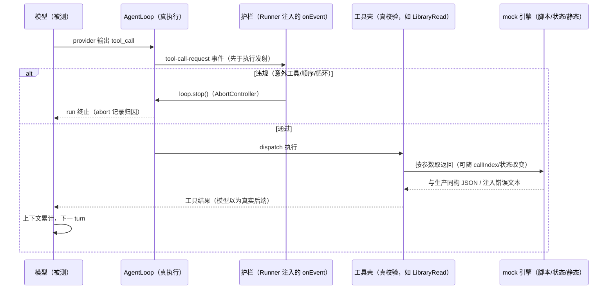

# evals-书库真实评测 PRD —— v0.3

> 状态：✅ 已定稿（一期架构已实施——F1–F8 落地，Tier 1 闭环 51 测试全绿、Tier 0 快照零 diff；§6 中 judge 实调用与 Tier 2 全量待带 key 验证；§7 数据依赖项显式移二期再议）
> 关联：整体产品 PRD [`产品总览.md`](./产品总览.md)；评测框架 [`eval-harness.md`](./eval-harness.md)（本 PRD 是其 case 语料面与执行语义的扩展，不改其主体）；书库全景 [`library-完本解构.md`](./library-完本解构.md)（其附录 C「书库评测平面」F13–F15 的实现口径修订，见 §1）；域概念边界 [`../development/域模型规范.md`](../development/域模型规范.md)
> 一期范围：**只落框架的执行语义与架构**（mock 引擎 / 执行护栏 / 判定面泛化 / 上下文供给 / 夹具包），case 内容后续确认（§4.9 仅立锚点）。
> v0.2 变更：从「静态桩注入」泛化为完整执行语义——① 工具返回可随 run 演化（静态查询 / 脚本序列 / 状态演化三态 mock）；② 过程护栏支持**提前终止**（意外工具、顺序违背、参数违背、预算熔断——违规即停，省成本且归因到具体某次调用）；③ 判定面从最终回复扩展到**工具参数**（toolArgsJudge）与护栏违规记录（expectedAbort）；④ **预置上下文短跑**（注入历史会话只跑 1–5 turn）。四项均复用 core 现成能力（runMessages 透传 / tool-call-request 先于执行发射 / loop.stop AbortController），**生产码零改动结论不变**。
> v0.3 变更：开放问题按建议定稿——护栏缺省集（预算熔断恒开、`allowedTools` 声明即启用意外工具护栏、其余显式开）；abort 聚合口径（`ok=false` + rule 归因 + `expectedAbort` 反转）；mock 作者格式（声明式 JSON 优先 + TS 状态函数逃生舱）；`expectToolCalls` 缺省 subset；真实书自造产物允许作者期一次性 LLM 辅助生成后人工审定冻结。红线阈值与第二本合成书移二期再议。

---

## 1. 背景与目标

- 要解决的问题（痛点 / 现状）：
  - 既有 15 个 eval case 全部是**工具使用向**短任务（选对工具 / 传对参 / 失败自愈 / 终态写入），语料为手写单句任务 + 合成最小种子——没有「以一本完整书为语境」的真实场景评测：查找埋下的坑（伏笔 / 前后矛盾）、理解人物档案、续写正文风格遵循、大纲设计等创作能力维度全部空白。
  - 用真实解析做评测夹具不可行：每次解析是一次长时 LLM 会话（分钟级起），产物缓存随 prompt / 模型变更失效，case 方差被解构质量放大，且无 key 环境不可复现。
  - 长上下文幻觉的测量需要**已知信息边界**：只有确切知道「模型实际看到过什么」，才能判定「它说的超出了看到的范围」。
  - 既有评测只有**事后断言**（run 跑完再判）：模型一路错下去也必须跑满全程——token 浪费、失败归因模糊（只知道最终没对，不知道从哪一步开始错）。
- 方案（mock 引擎 + 完整书静态夹具）：用一本完整书**预构静态「书库夹具包」**（确定性解析层 + 自造分析产物，版本化冻结）。评测时 agent loop **真实执行**（真 LLM、真工具壳、真调度、上下文逐 turn 累计——与生产会话一致），只有工具服务层被 mock。由此框架的执行语义由四要素构成：

  **① 上下文供给（会话从哪开始）**
  | 形态 | 语义 | 现状 |
  | --- | --- | --- |
  | 冷启动 | 空会话，task 驱动 | 既有 |
  | 种子态 | seed 实体 / 文件预置，会话为空 | 既有 seeds |
  | **预置会话史（短跑）** | 注入历史消息（用户 / 助手 / 工具结果），从会话中途开始，只跑 1–5 turn | **新增**（复用 buildNovelAgent 现成 `runMessages` 透传） |
  | 多轮 follow-up | task 数组顺序多条消息 | 既有 |

  **② Mock 语义（工具返回怎么来——返回可随 run 进行而改变）**
  | 形态 | 语义 | 适用 |
  | --- | --- | --- |
  | 静态查询型 | 返回 = f(args)，幂等（夹具包静态数据） | 缺省：书库桩 |
  | 脚本序列型 | 第 n 次调用返回脚本第 n 项（按 tool+参数匹配器消耗队列） | 受控信息释放顺序、异常注入（返回错误文本测自愈） |
  | 状态演化型 | mock 持状态，返回 = f(args, state, callIndex)，写操作更新状态；队列末位为函数时耗尽后常驻复用 | 模拟真实后端跨调用一致性 |
  | 混合 | 缺省静态 + case 级 per-tool 覆盖（脚本队列 / 状态函数） | 复杂 case |

  注：novel 域工具（NovelRead/Write/Edit/Delete）**不 mock**——走真 InMemoryStore，本身就是状态演化型的真实后端；一期 mock 范围 = LibraryRead 服务层 + 任意工具的异常注入文本。

  **③ 过程护栏（何时提前终止——mid-run guard）**
  | 规则 | 触发 | 动作 |
  | --- | --- | --- |
  | 意外工具 | 调用了 allowlist 外的工具 | 硬停 |
  | 顺序违背 | 调用序列偏离预期脚本（strict / loose 两档） | 硬停 |
  | 参数违背 | 参数护栏不满足（越权 bookId、超限参数） | 硬停或放行（soft 档让真实工具自然报错，测自愈） |
  | 预算熔断 | turns / 墙钟超时（既有 maxTurns/timeoutMs 升格为护栏） | 硬停 |
  | 循环检测 | 同名同参连续重复 ≥ N 次 | 硬停 |

  硬停 = `loop.stop()`（AbortController 既有语义）+ run 记 `abort: { rule, detail, turn, toolCall }`。**护栏违规与判定解耦**：护栏只负责终止与记录；负向 case 可声明 `expectedAbort`——期望中的违规被捕获，该 run 反而通过。

  **④ 判定面（run 结束后怎么判）**
  | 判定面 | 形态 | 现状 |
  | --- | --- | --- |
  | 终态断言 | store 快照 / 工作区文件 | 既有 |
  | 工具轨迹断言 | called / **not-called（期望调用未发生即失败）** / count / args / argsRaw / response | 既有 + 泛化 |
  | 引用信息边界 | 引用 pid ∈ 本 run 实际返回集合（超出 = 幻觉，确定性） | 本 PRD 新增 |
  | 最终回复断言 | contains / regex / fn / judge（含 reference 参考原文） | 既有 + reference 扩展 |
  | **工具参数 judge** | 以某次工具调用的参数为判定对象（如 NovelWrite 的 synopsis 是否幕级四要素完备） | **新增**（judge 载荷泛化） |
  | 护栏违规断言 | expectedAbort（负向：违规如期发生 = 通过） | **新增** |

- 对 library-完本解构.md 附录 C 的**实现口径修订**（显式偏差，非静默改写）：
  - F13 `libraryFixture` 的「经 LibraryService 只读取样拼接超长上下文」→ 以「静态夹具包 + mock 注入」实现其「Runner 装配含 library.read 组的 definition 变体（复用 buildNovelAgent 注入点）」部分；tokenBudget 梯度取样拼接不在本期。
  - F14 三层断言中「引用存在性对 manifest」→ **收紧为对「本 run 实际返回集合」**：引用了从未返回过的 pid 即幻觉（manifest 内但未返回同样算）。
  - F15 接缝不变：复用 evalCase DSL / Runner / results 落盘 / compare，case 入 `evals/cases/`，不修改既有 15 case 与 eval-harness.md 主体。
- 目标（一句话，可验收）：落成「完整书静态夹具 + mock 引擎（三态返回）+ 过程护栏（提前终止）+ 泛化判定面 + 预置上下文短跑」的框架与免 key 闭环测试——生产码（core / gui / ui）零改动。

## 2. 用户故事

- 作为评测作者，我希望放入一本完整书并预构全部工具返回内容，以便 case 在**已知的信息边界**上做确定性断言（引用了没返回过的东西 = 幻觉）。
- 作为评测作者，我希望工具返回能按脚本序列或状态演化（随 run 进行而改变），以便模拟真实后端与受控的信息释放节奏。
- 作为评测作者，我希望 run 在出现不可挽回的工具违规（意外工具 / 顺序错 / 死循环）时**立刻终止**，以便省 token 且失败归因精确到具体某次调用。
- 作为评测作者，我希望从一段预置的会话中途开始、只跑 1–5 个 turn，以便把「长程上下文积累后的单步决策」隔离成便宜的小 case。
- 作为评测作者，我希望 judge 的对象可以是**某次工具调用的参数**（如 NovelWrite 写入的 synopsis），以便创作质量判定不必等到最终回复。
- 作为评测作者，我希望给 case 声明预期的工具调用脚本，以便「该调的没调、不该调的调了」都成为可判定的失败。
- 作为评测作者，我希望模型的创作输出与**原书对应内容**对比评分，以便「写得好不好、贴不贴原书」有参照答案而非纯主观 rubric。
- 作为仓库维护者，我希望合成书夹具随仓库提交、解析层免 key 生成，以便任何人任何机器可复现结构测试。

## 3. 流程图（必填）

### 3.1 主流程：夹具构建 → mock 注入评测（含护栏拦截）

```mermaid
flowchart TD
    A[完整书 txt<br/>合成书脚本生成 / 用户提供] --> B[fixture:build<br/>BookTextParser 确定性解析]
    B --> C[夹具包解析层<br/>book.json：卷章骨架 / 分段文本 / manifest pid]
    C --> D[人工按模板补齐<br/>fabricated/ 自造产物 + ground-truth.json 参考答案锚点]
    D --> E[静态夹具包<br/>evals/fixtures/books/别名/]
    E --> F[evalCase 声明<br/>library + mockResponses + guards + preset]
    F --> G[Runner 装配<br/>mock 引擎（静态/脚本/状态）+ 预置会话史]
    G --> H[buildNovelAgent 注入<br/>library deps + runMessages —— 生产同款选项]
    H --> I[agent loop 真实执行<br/>上下文逐 turn 累计，仅工具服务层被 mock]
    I --> J{护栏逐调用检查<br/>tool-call-request 时点}
    J -- 违规 --> K[loop.stop 提前终止<br/>记录 abort rule/turn/toolCall]
    J -- 通过 --> L[工具执行 → mock 返回<br/>静态 f(args) / 脚本第 n 项 / 状态演化]
    L --> I
    L --> M[run 自然收口<br/>采集 toolCalls / libraryCalls / citations / abort]
    K --> M
    M --> N[判定：确定性断言<br/>轨迹 / 信息边界 / 终态 / expectedAbort]
    M --> O[judge：finalReply 或 toolArgs<br/>reference 参考原文对比]
    N --> P[results/ 落盘 + report / compare 呈现]
    O --> P
```

### 3.2 多主体交互：被测模型 ↔ 工具壳 ↔ mock 引擎（含护栏时序）



## 4. 功能明细

### 4.1 功能点一（F1）：书库夹具包格式与构建命令

- 触发：评测作者执行 `pnpm --filter @novel/evals fixture:build -- <book.txt> <别名>`，或直接使用已入库的合成书夹具。
- 输入：完整书 txt（UTF-8，含章标记；无章标记走 8000 字虚拟切章，与生产 `BookTextParser` 一致）+ 别名（kebab-case 目录名）。
- 处理：调用 core `BookTextParser`（确定性、免 key）生成解析层；生成 `fabricated/` 与 `ground-truth.json` 模板（含字段注释）；自造产物可人工撰写，亦可**作者期一次性 LLM 辅助生成后人工审定冻结**（仅作者期辅助，评测运行零 LLM 依赖——已定）；幂等——已存在且 source 哈希一致则跳过。夹具包是 mock 引擎的**静态数据源**（静态查询型返回的全部内容）。
- 输出：`evals/fixtures/books/<别名>/`：`source.txt`（真实书 gitignore，合成书入库）、`book.json`（meta + 卷章骨架 + 分段清单，pid 契约 `<别名>-p<6位>` 对齐生产）、`fabricated/style.md` / `excerpts.md`（自造产物冻结）、`fabricated/entities.json`（人物 / 地点 / 幕级大纲种子 mutation，`<别名>-` 前缀，复用 `evals/cases/seeds.ts` 构建器形状）、`ground-truth.json`（参考答案锚点：续写题原下一章 pid 区间、大纲题真实事件弧线、人物关键事实、探针位置）。
- 异常：txt 缺失 / 为空 → 构建期报错；别名已存在且哈希不一致 → 要求 `--force`；ground-truth 引用的 pid 不在 book.json → 校验失败。

### 4.2 功能点二（F2）：合成书生成与入库

- 触发：首次落仓 / 需要新语料时执行 `evals/scripts/gen-synthetic-book.mjs`（一次性，产物入库）。
- 输入：脚本内嵌参数（题材 / 章数 / 目标字数）。
- 处理：生成短篇（短句武侠或冷硬悬疑——风格刻意鲜明便于 rubric 与防照抄校验；一期实际约 0.6 万字 / 10 章单批——规模充分性验证移二期，见 §7）；预埋探针并同步写 ground-truth：2 处伏笔（埋设 / 回收章标注）、1 组设定矛盾（两侧 pid 标注）、若干仅存在于单一分段的细节（信息边界题源）；再走 F1 产包。
- 输出：随仓库提交的完整夹具包——任何环境免 key 可用于结构测试。
- 异常：探针标注与文本不一致 → 构建期校验失败。

### 4.3 功能点三（F3）：mock 引擎与桩注入

- 触发：case 声明 `library?: { book: string }`（启用书库 mock）和/或 `mockResponses`（脚本 / 状态覆盖）。
- 输入：夹具别名 + 可选的 per-tool mock 定义——**声明式 JSON 优先**（匹配器 + 响应队列，可快照、可 diff——已定），复杂状态演化用 TS 状态函数逃生舱（f(args, state, callIndex)）。
- 处理：新增 `evals/src/mock-engine.ts`——统一 mock 决策器，按「per-tool 覆盖 → 缺省静态」的顺序解析每次工具服务调用的返回：静态查询型由 `createFabricatedLibraryDeps(pack, recorder)` 承载（实现 `LibraryReadDeps` 四方法：`listBooks` / `openBookStore` / `readParagraphs` / `readAnalysis`；实体类 kind 经 `openBookStore` 返回种子化 `InMemoryNovelStore`，由真 NovelRead 执行体查询；书单语义与生产一致——声明外的 bookId 不泄漏存在性；护栏复刻：单次 24 段 / 20000 字符截断）；脚本序列型按匹配器消耗响应队列（**响应形态含错误注入**——返回错误码文本，服务自愈类 case，与既有 `anyToolError` 断言衔接）；状态演化型持可变状态袋，返回 = f(args, state, callIndex)。novel 域工具不 mock（真 InMemoryStore 即状态演化型真实后端）。Runner 装配：`buildNovelAgent({ ..., library: { deps: mock } })`，recorder 挂入本次 run。
- 输出：被测会话拥有与生产视角一致的可用工具；`EvalRunMetrics` 增 `libraryCalls`（kind / bookId / 参数 / 返回 pid 摘要 / callIndex）。
- 异常：别名无夹具包 / 缺 `book.json` → run 前抛明确错误（不静默跳过）；脚本队列耗尽 → 该调用回退静态并记录 `scriptExhausted` 标记（报表可见）；mock 内越权 bookId → 生产同构未授权语义，经工具壳转 `TOOL_ARGUMENTS_INVALID`。

### 4.4 功能点四（F4）：执行护栏与提前终止

- 触发：case 声明 `guards`（护栏规则集）。**缺省策略（已定）**：预算熔断恒开（maxTurns / timeoutMs 既有语义）；`allowedTools` 一经声明意外工具护栏即生效；顺序 / 参数 / 循环检测默认关、case 显式开启。
- 输入：`guards: { allowedTools?, callSequence?({expect, mode:"strict"|"loose"}), argsGuard?(谓词), budget?({maxTurns, timeoutMs, maxRepeats}) }`。
- 处理：护栏挂点 = Runner 的 onEvent 收 `tool-call-request`（core 已保证该事件**先于工具执行**发射），逐调用评估规则；违规即 `loop.stop()`（AbortController）终止 run 并记 `abort: { rule, detail, turn, toolCall }`；turn 级预算护栏挂 `beforeProviderCall`（buildNovelAgent 现成选项）。参数违背支持 `hard`（立即停）/ `soft`（放行，让真实校验自然报错，配自愈断言）两档。**护栏与判定解耦**：`abort` 记录只是事实；case 可用 `expectedAbort(rule)` 断言「期望中的违规如期发生」（负向通过）；无该断言时带 abort 的 run **记 `ok=false`**（error 带 rule 归因，passRate 按失败计——已定口径）。
- 输出：`EvalRunMetrics` 增 `abort?`（规则 / 详情 / turn / 工具调用）；提前终止节省后续 turn 的 token 成本。
- 异常：stop 后 in-flight 工具可能已完成返回——不影响 abort 归因（记录的是触发违规的那次调用）；abort 的 run `ok=false`，error 带 rule 描述。

### 4.5 功能点五（F5）：判定面——断言辅助与 judge 载荷泛化

- 触发：case 断言需要校验工具纪律、引用边界、或对非最终回复内容做 LLM 判定时。
- 输入：
  - `expectToolCalls([{ tool, args? }], { mode: "sequence" | "subset" })`（`expectLibraryCalls` 的泛化，覆盖任意工具；**缺省 subset 宽松匹配、strict 显式开启——已定**，模型合法路径可能不止一条，过严放大方差）；
  - `expectedAbort(rule)`（护栏违规断言）；
  - `returnedParagraphIds(libraryCalls)`（本 run 实际返回集合）；
  - judge 底层 `judgeText(label, payload, rubric, { reference?, model?, scoreAtLeast? })` + 便捷形态 `finalReplyJudge`（既有）与 `toolArgsJudge(toolName, rubric, { reference? })`（以该工具某次调用的参数文本为判定对象；多次调用时逐次判定取最差）。
- 处理：断言辅助实现为 `custom(fn)` 包装（**不扩 DSL 断言词表**）；`expectToolCalls` 偏差逐条列于 actual（多余 / 缺失 / 顺序违背）；judge 泛化改造 `evals/src/judge.ts`——`JudgeInput` 增 `reference`（user 模板追加「# 参考原文」段，评分形态为「参照而非标准答案」：判贴合 / 合理 / 不照抄）与载荷来源泛化；`toolArgsJudge` 从 metrics.toolCalls 取参数原文。
- 输出：标准 `AssertionReport`；judge 结构化 verdict（pass / score / reason）不变。
- 异常：run 无对应数据（未启用 library / 无该工具调用）→ 断言 fail 并说明原因；judge 调用 / 解析失败按不过计（对齐 eval-harness §3.7）；reference 超长截断并标记。

### 4.6 功能点六（F6）：上下文供给与短跑模式

- 触发：case 声明 `preset?: { messages }` 和/或紧预算 `budget.maxTurns = 1–5`。
- 输入：preset 消息序列——简化作者格式 `{ role: "user" | "assistant" | "toolCall" | "toolResult", ... }`（编译器自动生成 toolCallId 配对，转 core `LLMessage[]`）或直接 `LLMessage[]`（高级形态）。
- 处理：Runner 经 buildNovelAgent **现成 `runMessages` 选项**注入历史（core 已透传，零改动）——会话从「已积累 N 轮上下文」的中途开始，随后的 task 消息只执行 1–5 turn；预置内容不产生 provider 调用（成本仅在后续短跑）。preset 可与 mock / 护栏 / 全部断言组合。
- 输出：短跑 case——隔离「长程积累后的单步决策」（如：已读 20 段 + 已建 3 人物的会话里，下一步会不会调对工具）。
- 异常：preset 非法（toolResult 无对应 toolCall / 角色缺失）→ 构造期校验报错；preset + 无 task → 报错（短跑仍需驱动消息）。

### 4.7 功能点七（F7）：指标采集与报告归因

- 触发：run 收口时随 metrics 物化。
- 输入：final 文本、`returnedParagraphIds`、libraryCalls、abort 记录。
- 处理：`citations: { cited, valid }`（valid = ∈ 本 run 实际返回集合，比 F14 的 manifest 口径更严；cited 为空记「无引用」而非 0）；`libraryCalls` / `abort` / `scriptExhausted` 进 `EvalRunMetrics`；suite `manifest.json` 增夹具别名与内容哈希；`report.html` / `compare.md` 呈现引用有效率、abort 规则直方图、mock 覆盖情况。
- 输出：results/ 落盘与报表呈现。
- 异常：compare 不新增红线（攒基线后另定，§7）。

### 4.8 功能点八（F8）：Tier 1 闭环测试与结构自测

- 触发：`pnpm --filter @novel/evals test`（免 key）。
- 输入：合成书夹具包 + stub provider。
- 处理：闭环覆盖——mock 三态语义（静态幂等 / 脚本按序消耗与耗尽回退 / 状态随写演化 / 错误注入文本）；书库桩九种 kind 全通、书单过滤、越权 `TOOL_ARGUMENTS_INVALID`、护栏复刻；护栏路径（意外工具与顺序违背触发 stop、abort 记录完整、soft 档放行后自然错误被采集、`expectedAbort` 负向判定通过、循环检测）；preset 短跑（stub provider 断言首轮 provider call 的消息含预置历史、maxTurns 生效）；recorder 完整；`expectToolCalls` / `returnedParagraphIds` / `toolArgsJudge` 取数正确（含 fail 路径）；既有 15 case 结构自测零改动仍绿。
- 输出：全部测试绿；Tier 0 快照零 diff（无 prompt / 工具面变更）。
- 异常：夹具包缺失 → 仅依赖夹具的新测试显式 skip 并提示生成命令。

### 4.9 二期展望：case 族（本期不实现，仅立规格锚点）

编号续 `evals/cases/16+`，每 case 仍「纯 spec + 一行注册」成对，复用本期全部架构件：

| 维度 | 题目形态 | 主要判定组合 |
| --- | --- | --- |
| 坑查找（伏笔 / 矛盾） | 「全书有没有前后矛盾的设定 / 未回收的伏笔？」 | 探针两侧 pid 均被引用且在标注区间 + judge 判解释正确 |
| 人物档案理解 | 「为人物 X 建档 / X 的动机是什么？」 | `toolArgs(LibraryRead, kind=character)` + 关键事实 contains + judge 忠实度 |
| 续写风格遵循 | 「读完第 N 章，续写 300–500 字」 | 引用 ∈ 返回集合 + 防照抄（n-gram 重合率）+ judge（reference=原书下一章） |
| 大纲设计 | 「参考该书叙事结构，为新书设计三幕大纲」（可用 **toolArgsJudge** 判 NovelWrite 的 synopsis） | store 快照 story_unit 父子链 + toolArgsJudge 幕级四要素（时间 / 地点 / 人物 / 事件） |
| 幻觉信息边界 | 「第 M 章 X 的细节？」（答案只在某次返回的分段里） | 引用 pid ∈ 实际返回集合 + 关键实体原文对齐（确定性） |
| 工具纪律负向 | 问未授权书 / 模糊问「书库里有什么」 | 护栏 `allowedTools` + `expectedAbort` 或 越权报错后不编造内容 |
| 短跑单步决策 | preset 预置「已读若干段」会话 + maxTurns 1–5 | `expectToolCalls`（下一步调对工具）+ 预算护栏 |
| 自愈（mock 增强） | 脚本型 mock 注入错误后再恢复 | `anyToolError` + 后续重试成功（既有 08/09 case 的 mock 化变体） |

## 5. 边界与非目标

- 明确不做：
  - **不跑 BookAnalyst、不做解构质量评测**——夹具分析产物全部静态自造（允许作者期一次性 LLM 辅助生成后人工审定冻结——已定，不引入运行时依赖）。
  - **生产码零改动**——四项执行语义全部复用 core 现成能力：`runMessages` 透传（NovelAgent.ts）、`tool-call-request` 先于执行发射（AgentLoop.ts）、`loop.stop()` AbortController、`beforeProviderCall` 回调；core / gui / ui 均不动。
  - **不扩 evalCase DSL 断言词表**——断言辅助以 `custom(fn)` 包装实现。
  - **novel 域工具不做返回 mock**（真 InMemoryStore 即真实状态后端）；mock 范围 = LibraryRead 服务层 + 脚本型错误注入文本。
  - 真实书文本不入仓库（版权；gitignore，缺书 case 构造期明确报错）。
  - 不做多模型矩阵、CI 自动跑 Tier 2（对齐 eval-harness §11）；compare 不新增红线。
  - F13 的 tokenBudget 梯度取样拼接（8k/32k/128k 任务内嵌）不在本期；preset 历史的「从真实 run 一键导出」工具列二期。

## 6. 验收标准

- [x] `fixture:build` 对任意 txt 免 key 产出完整夹具包（解析层自动 + 逐文件缺件补模板），幂等且 `--force` 语义正确；合成书夹具入库且 ground-truth pid 校验通过。
- [x] mock 引擎三态语义各有 Tier 1 覆盖：静态幂等、脚本按序消耗（耗尽回退 + `scriptExhausted` 标记）、状态随写演化（末位函数常驻）、错误注入文本。
- [x] 护栏：意外工具与顺序违背（strict/loose）触发提前终止且 `abort` 记录完整（rule / turn / toolCall）；soft 档（不设护栏让真实校验报错）由既有错误双通道覆盖；`expectedAbort` 负向 run 判通过；循环检测生效。
- [x] preset 短跑：预置历史进入首轮 provider call 上下文（stub provider 断言）、`maxTurns` 生效、构造期校验报错路径可用。
- [ ] 判定面：`expectToolCalls` / `returnedParagraphIds` / `toolArgsJudge`（含 reference）取数与判定正确（含 fail 路径）——前两者 Tier 1 已覆盖；`toolArgsJudge` 的 judge 实调用待带 key 验证。
- [x] 启用 library 的 run 落盘 `libraryCalls` / `citations` / `abort`（e2e 已证）；report.html 与 compare.md 呈现引用有效率与 abort 归因（合成 results 冒烟已证）；manifest.json 含夹具归因（suite 代码已接，随 Tier 2 首跑复核）。
- [x] Tier 0 快照零 diff；既有 15 case 与其结构自测零改动仍绿；`pnpm --filter @novel/evals typecheck` 通过。
- [x] 文档互引回填：eval-harness.md 与 library-完本解构.md 加本 PRD 指针（不改主体）；evals/README.md 增夹具包格式、fixture:build、mock / 护栏 / preset 用法。

## 7. 开放问题

- **已定决策（v0.3，按建议定稿，一期实施依据）**：
  - 护栏缺省集：预算熔断恒开（maxTurns / timeoutMs）；`allowedTools` 一经声明意外工具护栏即生效；顺序 / 参数 / 循环检测默认关、case 显式开启。
  - abort 聚合口径：带 abort 的 run 记 `ok=false`，error 带 rule 归因，passRate 按失败计；负向 case 用 `expectedAbort` 反转。
  - mock 作者格式：声明式 JSON 优先（可快照、可 diff），复杂状态演化用 TS 状态函数逃生舱。
  - `expectToolCalls` 缺省 subset 宽松匹配，sequence（strict）显式开启。
  - 真实书自造产物：允许作者期一次性 LLM 辅助生成后人工审定冻结（评测运行零 LLM 依赖）。
  - preset 历史：一期手写简化作者格式；「从真实 run 的 results/evalite.json 一键导出 preset」工具二期。
- **二期再议（数据依赖或 case 期验证，不阻塞一期）**：
  - 引用有效率是否进 compare 红线、阈值多少——待 case 攒一个基线周期后定。
  - 合成书规模与题材：2 万字单本是否足够支撑大纲 / 续写题区分度；是否需要第二本异题材——待二期 case 设计验证。
