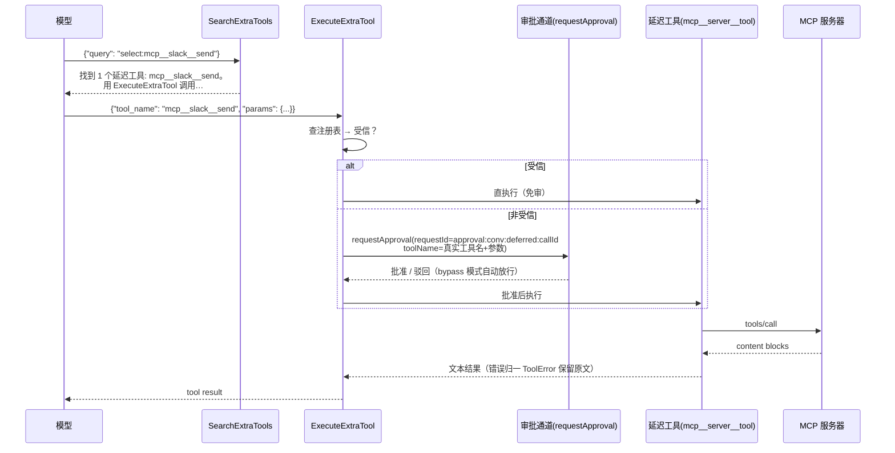
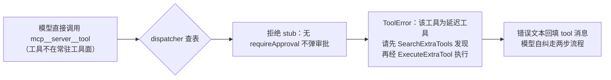
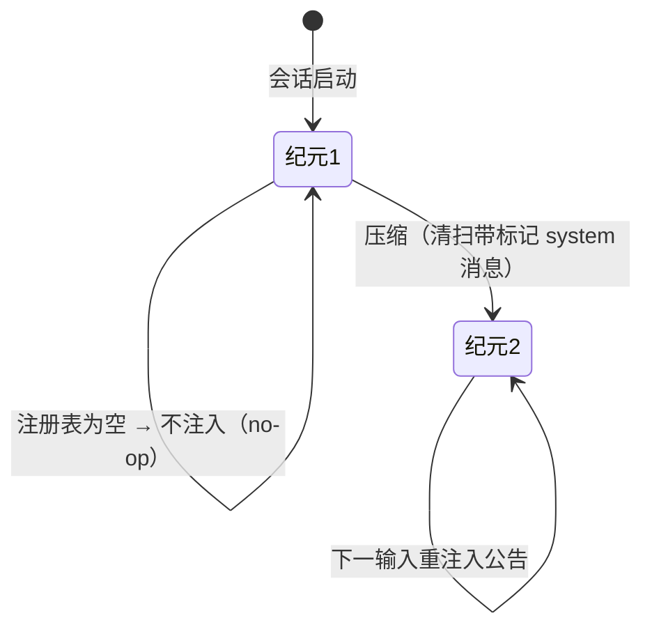

# 外部工具延迟加载（SearchExtraTools / ExecuteExtraTool）PRD —— v0.1

> 状态：✅ 已定稿（E1–E4 已实施落地，见 §10；core 829 用例全绿 + typecheck 通过）
> 关联：[`mcp-skills-接入.md`](./mcp-skills-接入.md)（MCP 装配前身，§F3/F4 被本 PRD 演进）；[`context-compact.md`](./context-compact.md)（上下文治理家族）；对标参考 `docs/reference/claude-code/tools/SearchExtraToolsTool.md`、`ExecuteTool.md`、`system-reminders.md`（deferred 工具机制）
> 术语：**延迟工具（deferred tool）** = 不常驻模型工具面的工具；**延迟池** = 会话内延迟工具注册表
> 命名说明：口头常称 searchExternalTools / runExternalTools，cc 与对标文档中正式名为 **SearchExtraTools（发现）+ ExecuteExtraTool（执行）**，本 PRD 以此为准

---

## 1. 背景与目标

- **痛点（现状）**：
  - MCP 工具经 `extraTools` 组外追加后，其 schema **常驻每个 provider call**（toolSchemes 全量直出）——服务器多、工具多时上下文膨胀，工具名注意力稀释；
  - 模型对大量外部工具只有"全有或全无"两种状态，没有按需发现通道；工具描述只占 prompt 而无检索入口。
- **cc 对标**：deferred 工具两步模式——`SearchExtraTools`（按名/关键词发现，`select:` / `discover:` 查询，discover 返回完整 schema）→ `ExecuteExtraTool`（按名+参数执行）；deferred 工具**不能直接调用**；名单经 `<available-deferred-tools>` 公告注入。
- **目标（一句话，可验收）**：MCP 工具全部改走延迟池——schema 不进常驻工具面；模型经 `SearchExtraTools` 发现（`select:`/`discover:`/关键词）后经 `ExecuteExtraTool` 执行；**非受信目标的审批语义不丢**（ExecuteExtraTool 内嵌审批，审批框显示真实工具名+参数）；新增 `external_tools` nudge 每压缩纪元公告一次延迟工具名单与两步流程。

## 2. 用户故事

- 作为作者，我接入了多台 MCP 服务器（资料库/地图/翻译…），希望它们不挤占每次对话的上下文，只在需要时被检索到；
- 作为作者，我希望 AI 在要用外部工具时能按名或按用途搜到它，并看到参数说明，而不是瞎猜参数；
- 作为作者，我希望受信服务器的工具调用免审批直执行，非受信服务器工具照旧弹审批——且审批框显示**真实工具名和参数**，而不是笼统的"执行外部工具"；
- 作为作者，我希望 AI 收到一次"当前可用哪些外部工具、怎么用"的说明，且上下文压缩后不会残留过时名单。

## 3. 流程图（必填）

### 3.1 装配主流程：会话启动 → 延迟池

```mermaid
flowchart TD
    A[会话 spawn<br/>env NOVEL_MCP_SERVERS] --> B[McpConnectionManager<br/>连接 + listTools（失败跳过）]
    B --> C[wrapMcpTool 包装<br/>mcp__server__tool ToolDef[]]
    C --> D[buildNovelAgent<br/>extraTools → DeferredToolRegistry]
    D --> E{受信?}
    E -- 是 --> F[注册表: 免审执行]
    E -- 否 --> G[注册表: 内嵌审批标记<br/>requireApproval=true 保留]
    D --> H[runtime.external 组装配<br/>SearchExtraTools + ExecuteExtraTool]
    D --> I[dispatcher 注册拒绝 stub<br/>（不进 toolSchemes）]
    D --> J[external_tools nudge 装配<br/>nudgeEnablement]
    F --> K[会话就绪：常驻工具面无 mcp__ 工具<br/>延迟名单经 nudge 公告]
    G --> K
    H --> K
    I --> K
    J --> K
```

### 3.2 两步调用时序（含内嵌审批）



### 3.3 直接调用拦截



### 3.4 external_tools nudge 纪元状态机



## 4. 功能明细

### F1 延迟池（DeferredToolRegistry）

- **输入**：`buildNovelAgent` 的 `opts.extraTools`（现状 = MCP 包装工具 ToolDef[]）。
- **处理**：构造不可变注册表 `Map<toolName, ToolDef>`；**extraTools 不再 push 进 capability.toolDefs**（即不进 toolSchemes / tool.policy 名单 / provider call）。每条目保留原 def 的 `requireApproval`（受信=false、非受信=true）。
- **输出**：`get(name)` / `list()` / `size` / `search(query, maxResults)`（F2）。
- **异常**：空注册表 = 功能退化（搜索返回"无延迟工具"，nudge 不注入），不影响会话。

### F2 SearchExtraTools（发现工具）

- **触发**：模型调用 `SearchExtraTools`（新工具组 `runtime.external`，与 ExecuteExtraTool 同组）。
- **desc**：`按名称或关键词搜索延迟工具（当前为 MCP 服务器工具）。低优先级——仅当核心工具无法完成任务时使用；核心工具（Read/Write/Edit/Glob/skill 等）始终可用，应直接调用。延迟工具不能直接调用，必须先经本工具发现、再经 ExecuteExtraTool 执行（两步流程）。`
- **schema**：
  - `query`（string，必填）：`搜索查询。select:工具名 —— 按名精确选择（逗号分隔多选，最快）；discover:关键词 —— 返回工具名+描述+参数 schema（仅查看不执行）；其余为关键词搜索（最多 max_results 条）。`
  - `max_results`（number，可选，默认 5）：`最大返回条数（默认 5）。`
- **处理**（查询协议，对齐 cc）：
  - `select:A,B` → 逐个查注册表，返回 `找到 N 个延迟工具: A, B。用 ExecuteExtraTool 调用：{"tool_name": "A", "params": {...}}`；未命中的名字逐一点名。
  - `discover:...` → 按关键词匹配后返回每条 `name + description + parameters(JSON Schema 全文)`——模型据此构造参数。
  - 其余关键词 → 打分排序：名称精确命中 > 名称包含 > 描述包含；max_results 截断；返回匹配名清单。
  - 无匹配 → `未找到匹配的延迟工具。不要断言能力不存在——换个关键词再试一次。`；空注册表 → `当前没有延迟工具可用。`
- **性质**：只读、免审批（requireApproval: false）、并发安全。
- **promptDetail**：policy = `延迟工具搜索：低优先级——核心工具能完成的任务不要用；只有核心工具无法完成时才搜索。`；guidance = 两步流程 + select/discover/关键词三示例。

### F3 ExecuteExtraTool（执行延迟工具）

- **触发**：模型调用 `ExecuteExtraTool`（`runtime.external` 组）。
- **desc**：`按名称与参数执行延迟工具（当前为 MCP 服务器工具）。须先用 SearchExtraTools 发现目标工具后再调用（可用 discover: 查询获取其参数 schema）。受信服务器工具直接执行；非受信服务器工具执行前会征询用户审批（审批框显示真实工具名与参数）。`
- **schema**：
  - `tool_name`（string，必填）：`目标工具完整名称（如 mcp__server__tool）。`
  - `params`（object，必填）：`传给目标工具的参数对象（按其 schema）。`
- **处理**：
  1. 解析 args（非法 JSON / params 非 object → ToolError `TOOL_ARGUMENTS_INVALID`）；
  2. 查注册表：未找到 → ToolError `TOOL_NOT_AVAILABLE`：`未找到延迟工具: X。请先用 SearchExtraTools 搜索确认名称（select:X 或关键词）。`；
  3. **受信目标** → 直接 `target.handler.execute(构造 ToolCall{id: call.id, name: 真实工具名, args: JSON.stringify(params)})`，返回文本结果（错误归一复用 MCP 包装既有行为）；
  4. **非受信目标** → **内嵌审批**：handler 内调用捕获的 `requestApproval` 闭包（与 gateBatch 同一通道）——requestId `approval:${conversationId}:deferred:${call.id}`（toolCallId 唯一，不撞 gateBatch 的 `b{n}` 序列），`toolCalls: [{toolCallId, toolName: 真实工具名, args: params}]`；批准 → 执行；驳回/超时/通道未装配 → `已拒绝（…）` 文本；**bypass 模式经通道自动短路放行**（复用 Conversation.sendApprovalRequest 既有语义）。
- **性质**：`requireApproval: false`（审批内嵌，避免 gateBatch 二次弹窗）；不可并发（与 cc ExecuteExtraTool 一致）。
- **promptDetail**：guidance = 两步流程 + 示例 + 失败策略（`执行失败不要反复搜索重试——停下并告诉用户失败原因`，对齐 cc 失败策略）。

### F4 直接调用拦截（拒绝 stub）

- **处理**：每个延迟工具以 stub ToolDef 注册进 `MapToolDispatcher`（**不进 capability.toolDefs**，故不进 toolSchemes、不参与 tool.policy 名单、不触发 provider 侧未知工具校验）；stub 无 `requireApproval`（不弹审批，对齐 cc 客户端拒绝行为）；handler 抛 ToolError：`该工具（X）为延迟工具，未向模型暴露参数 schema。请先调用 SearchExtraTools 发现（select:X 或 discover:X 查看 schema），再经 ExecuteExtraTool 执行。不要直接调用。`
- **输出**：错误文本回填 tool 消息，模型自纠。
- **异常**：预览层（投影 preview）对 stub 走默认渲染，无影响。

### F5 external_tools nudge（公告）

- **通道**：persistent（`loop.appendRunMessages`，落 journal 可审计）；transient 恒 false。
- **触发**：注册表非空时，**每压缩纪元一次**（纪元 = compactionGeneration，对齐 project-stage 先例；压缩清扫后重注）；位置 = 用户消息之后。
- **内容**（marker `nudge: "external_tools"`，压缩清扫 + T2 摘要输入过滤兼容）：
  - 延迟工具全名名单（每行一个）+ 说明"不在工具列表中、不能直接调用"；
  - 两步流程：① `SearchExtraTools` 发现（select:/discover:）→ ② `ExecuteExtraTool` 执行；
  - 纪律：优先核心工具；直接调用会被拒绝；非受信工具执行会弹审批。
- **装配**：nudgeId `external_tools`；`novelAgentDefinition.nudgeEnablement.enabled` 声明 + `NovelAgent.ts` nudgeCatalog 注册（策略构造时捕获 registry）；注册表为空 → no-op。

### F6 工具面与 prompt 变化

- `tool.policy` 的 `- available tools:` 名单**不再包含 mcp__ 工具**；延迟名单由 F5 公告（对齐 cc `<available-deferred-tools>`）。
- `tool.guidance` 输出 F2/F3 的 guidance 块。
- 受信/非受信判定、`requireApproval` 语义、gateBatch 批量审批机制**全部不变**（非受信经内嵌审批，受信经直执行）。

## 5. 边界与非目标

- **不做**配置开关（恒启用，对齐 cc tst 模式；auto:N 阈值留 §7）；
- **不做** per-server `alwaysLoad` 豁免与 `_meta` searchHint 提取（对齐 cc v2.1.121 能力，留后续）；
- **不做** subagent（Explore/Compose/BookAnalyst）接入：其本无 MCP 工具面，`runtime.external` 组仅挂主 agent 定义；
- **不做** 技能体系改动（skill.index / skill 元工具自有渐进披露，不并入延迟池）；
- **不做** MCP 连接/包装/测试连接/设置页改动；不做会话内热更新；
- 已知边界（接受）：重启补完（resumePendingRun）时非受信目标经 resume 决策批准后，handler 内嵌审批**极小概率二次弹窗**（同 callId 重新征询；不破坏正确性，仅多一次确认）。

## 6. 验收标准

- [ ] core 单测：注册表查询（select 多选/未命中、discover 返回完整 schema、关键词打分与 max_results、空注册表）；
- [ ] core 单测：ExecuteExtraTool（受信直执行、非受信 approve/reject/超时/通道未装配、bypass 短路、未找到工具、params 非法、错误归一）；
- [ ] core 单测：stub 拦截文本、stub 不触发审批、stub 不进 toolSchemes；
- [ ] core 单测：nudge 注入/每纪元一次/压缩清扫重注/空注册表 no-op/marker 标记；
- [ ] 装配级断言：toolSchemes 与 tool.policy 名单不含 mcp__ 名；两工具在常驻工具面；
- [ ] typecheck + core 全量回归绿；
- [ ] 手动：配置 MCP → 会话内 provider call tools 无 mcp__ 工具 → nudge 公告出现 → select:/discover: 可用 → 受信直执行、非受信弹审批（显示真实工具名+参数）→ 直接调用被拦截提示。

## 7. 开放问题

- auto:N 阈值模式（cc tst-auto：延迟工具描述总量 > 上下文 10% 才延迟）是否跟进？本期恒延迟；
- per-server `alwaysLoad` 豁免、`_meta` searchHint 提取是否纳入 v1.1？
- 内嵌审批为逐次弹窗，与 gateBatch 的轮内批量审批不合并——多延迟工具并行调用时是否接受逐次确认？
- ExecuteExtraTool 的 tool-call-request 事件（UI 投影）沿用默认渲染（显示 ExecuteExtraTool+args）还是定制为真实工具名摘要？

## 8. 技术设计要点

### 8.1 注册表与查询协议（`core/src/runtime/tool/deferred/DeferredToolRegistry.ts`）

```ts
class DeferredToolRegistry {
  constructor(defs: readonly ToolDef[]);        // Map<name, ToolDef>，保留 requireApproval
  get(name): ToolDef | undefined;
  list(): ToolDef[];                            // 注册序（nudge 名单同序）
  get size(): number;
  search(query: string, maxResults = 5): SearchResult;
  // SearchResult = { kind: "selected"|"discovered"|"matched"|"empty"|"none", items: {name, description?, parameters?}[], text: string }
}
// 打分：name === query(去 select:/discover: 前缀) → 精确；name.includes(q) → 包含；description.includes(q) → 描述；
// select: 无视打分直查；discover: 关键词匹配后附完整 parameters
```

### 8.2 两工具 ToolDef（`core/src/runtime/tool/definitions/externalTools.ts`）

- `createSearchExtraToolsTool(registry): ToolDef`（version "1.0.0"，desc/schema 见 F2，handler 组结果文本，requireApproval: false）；
- `createExecuteExtraTool(registry, { conversationId, requestApproval }): ToolDef`（desc/schema 见 F3，requireApproval: false，handler 按 F3 处理链）；
- `createDeferredRejectionStub(def): ToolDef`（仅 name/version/handler，F4）。

### 8.3 装配链路

- `NovelToolGroups.ts`：`NOVEL_TOOL_GROUP_EXTERNAL`（id `runtime.external`，tools `["SearchExtraTools","ExecuteExtraTool"]`）入 catalog；`NovelToolGroupResolverOptions` 增 `external?: { registry; conversationId; requestApproval }`，factory 缺省报错（对齐 novel.compose 先例）；
- `NovelAgentDefinition.ts`：groupIds 增 `"runtime.external"`；`nudgeEnablement.enabled` 增 `"external_tools"`（definitionVersion bump 1.4.0 → 1.5.0）；
- `NovelAgent.ts`：`opts.extraTools` → `new DeferredToolRegistry(extraTools)`（原 push 进 capability.toolDefs 的逻辑删除）；resolver options 注入 registry + requestApproval；nudgeCatalog 增 `["external_tools", () => new ExternalToolsNudgePolicy({ registry })]`；dispatcher 构造后逐个 `register(createDeferredRejectionStub(def))`；
- `core/src/runtime/nudge/definitions/external-tools.ts`：`ExternalToolsNudgePolicy`（persistent 每纪元一次，marker，空注册表 no-op）。
- 子进程装配（`runDesktopRuntimeChildEntrypoint.ts`）**零改动**（extraTools 传参不变，语义由 buildNovelAgent 解释）。

### 8.4 内嵌审批 requestId 与通道

```ts
requestId = `approval:${conversationId ?? "conv"}:deferred:${call.id}`;  // toolCallId 全局唯一
// 通道 = buildNovelAgent 捕获的 opts.requestApproval（与 gateBatch 同一闭包：
// Conversation.sendApprovalRequest 的 bypass 短路 / 超时 / 决议包装全部复用）
```

## 9. 实施步骤

| 步骤 | 内容 | 主要落点 |
| --- | --- | --- |
| E1 | 延迟池：DeferredToolRegistry + 查询协议 + 单测 | `core/src/runtime/tool/deferred/` |
| E2 | 两工具 + stub：SearchExtraTools / ExecuteExtraTool / createDeferredRejectionStub + 单测 | `core/src/runtime/tool/definitions/externalTools.ts` |
| E3 | 装配：runtime.external 组 + resolver + definition groupIds/nudgeEnablement + NovelAgent 改造 | `NovelToolGroups.ts`、`NovelAgentDefinition.ts`、`NovelAgent.ts` |
| E4 | nudge：ExternalToolsNudgePolicy + catalog + 单测 | `core/src/runtime/nudge/definitions/external-tools.ts` |
| E5 | 收尾：typecheck + core 全量回归 + Windows 手动验证（MCP stdio 服务器实测）+ 本 PRD §10 落地记录 | `docs/` |

每步一个 commit，core 先于文档收尾。

## 10. 实施落地记录（v0.1 定稿后补）

E1–E4 全部落地（core 829 用例全绿 + typecheck 通过 + build 通过），与原稿的四点实施性偏差（功能语义不变）：

1. **关键词打分分词化**：原稿 §8.1 的「名称精确 > 名称包含 > 描述包含」实现为按空白分词、逐词取分求和（`slack send` 多词独立命中累加，无任何命中为 0），多词查询可用；空关键词无匹配。`select:` / `discover:` 语义不变。
2. **审批通道缺省收口**：原稿 F3 的「通道未装配 → 已拒绝」实现为 handler **返回文本**「已拒绝（审批通道未装配）」（对齐 gateBatch 未装配文案），不抛错——模型看到干净的拒绝文本而非「工具执行失败」前缀。
3. **装配注入形态**：`runtime.external` 组 factory 以 `options.external` 缺省抛错（对齐 novel.compose 先例）；BookAnalyst / NovelSubagent 复用同一 resolver 但定义不含该组，不受影响。`extraTools` 的 doc 注释同步更新（语义从「直进 dispatcher/toolSchemes」改为「进延迟池」）。
4. **工具面数量**：main agent 工具面 13 → 15（+SearchExtraTools/ExecuteExtraTool）；nudge 生效集 +external_tools（注册表为空时 no-op）；既有装配测试同步更新（toolDefs 数量 / nudge 清单 / 新增延迟池断言：toolSchemes 不含 mcp__ 名、stub 拦截、ExecuteExtraTool 经 dispatcher 直执行）。

另注：evals 快照（`snapshot.test.ts`）4 用例为**存量漂移**——v0.1 之前（project-stage v2.x 等批次）novel 段落与 section 序调整后金样未再生成，改动前同样失败（已 A/B 验证），不在本期更新范围。
