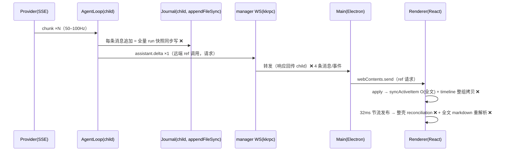
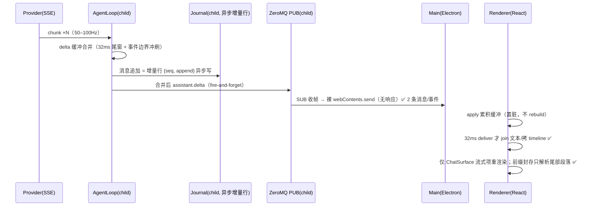

# gui-performance-2 PRD —— 流畅度二期：链路批量 + 渲染收口 + 事件通道 ZMQ 化

> 状态：✅ 已实施（2026-08-14：三批全部落地——批次一 ①~④、批次二 ⑤~⑦、批次三 ⑧；实施偏差：binding 层 32ms 节流因投影侧合并窗口就位而移除（双层窗口只叠加延迟）；journal 压缩触发 = loop 上下文压缩/clear 回调）
> 关联：一期 [`gui-performance.md`](./gui-performance.md)（已实施：think-delta 源头丢弃、32ms 发布节流、历史消息 memo、投影子数组脏重建）；整体产品 PRD [`产品总览.md`](./产品总览.md)；技术设计 `docs/architecture.md`
> 分支：perf/gui-smoothness

---

## 1. 背景与目标

- 要解决的问题（痛点 / 现状）：一期治理后历史消息已零重渲染，但实测链路与渲染仍有五类残余热点，长流式生成期间可感知卡顿、发消息/审批手感延迟、窗口失焦恢复跳变：
  1. **每 token 一条 RPC**：`AgentLoop.ts:321-326` 每个 SSE chunk 发一条 `assistant.delta`，经 kkrpc 远端回调跨 manager WS + Electron IPC，每条事件 = 请求 + 响应共 4 条消息（child→main、main→renderer 各一往返）。50–100Hz 流式下每秒 200–400 条消息穿主进程，且与交互 RPC 挤同一 WS。一期 PRD §6 明确遗留的「传输层批量」观察项。
  2. **journal 同步全量快照写**：`FileConversationJournalService.ts:53` 每次消息追加 `appendFileSync` 序列化**当前 run 至今全部消息**——O(run 大小) 的同步写 × 每条消息；工具输出大时一次写几 MB，阻塞 child 事件循环，直接卡住 delta 发射。compaction 不构成缓解：唯一组装点 `NovelExplorerAgent.ts:114` 注册 `compactPolicies: []`（压缩从不发生），且写放大发生在 run 内部、与 runList 压缩无关。
  3. **投影在节流之前就做 O(全文) 工作**：`ConversationProjection.ts:335-348`（`syncActiveItem`：`findIndex` + segments 全量重建 + 全文 `join("")`）与 `:481`（`timeline: Object.freeze([...])` 整组浅拷贝）每条 delta 执行一次；32ms binding 节流只保护 React，不保护这段。
  4. **流式正文整段重复 markdown 解析**：`AssistantMarkdown.tsx:70-121` 每 32ms 对全量累积文本跑两遍正则 + `ReactMarkdown` 全管道，成本随文本总量线性增长；`components`/`urlTransform` 为每次 render 新建的内联闭包。
  5. **整壳 30Hz 重渲染 + 交互路径杂项**：`ApplicationShell.tsx:114` shell 直接订阅流式快照，TopBar/Sidebar（全会话列表）/Inspector/Overlays 每 32ms reconciliation（全仓仅 4 个 memo 组件，均不在其中）；sidebar 条目对象每 render 重建（`ConversationListSection.tsx:64-71`）且 `ConversationListItem` 无 memo；滚动每事件 setState + 强制布局读取、虚拟化固定 56px 行高严重失真（`ConversationTimeline.tsx:18-20, 89-94`）；`novel.changed` 每事件全量重拉无去抖（`ApplicationShell.tsx:126-141`）；`backgroundThrottling` 未关（`minimal.ts:441-450`）。
- 目标（一句话，可验收）：长流式生成（万字级正文 + 多轮工具）期间 renderer 主线程每帧工作量不随文本总量增长、主进程消息量下降一个数量级，滚动与输入无可感知卡顿；事件通道从 kkrpc 远端回调迁到 ZeroMQ PUB/SUB + 裸 IPC 推送（fire-and-forget，交互 RPC 独占 WS）。

## 2. 用户故事

- 作为写作者，我在 agent 长篇生成期间滚动历史章节/会话列表时希望不掉帧，以便边生成边阅读。
- 作为写作者，我发出新消息或点击审批时希望立即有响应手感，不被正在进行的流式输出挤占通道。
- 作为写作者，我切走窗口再回来时希望流式内容平滑续上，而不是冻结后跳变追帧。
- 作为开发者，我希望事件通道是无响应开销的 fire-and-forget 推送，交互 RPC（发消息/审批/历史重放）与事件火线物理隔离，以便各自独立演进。

## 3. 流程图（必填）

### 3.1 现状（热点标注）

### 3.2 目标态（本 PRD 实施后）

### 3.3 ZMQ 事件通道拓扑（功能点八）

```mermaid
flowchart TD
    C[Conversation child] -- "emit → PUB bind ipc://conversation-&#123;id&#125;-events" --> Z[ZeroMQ]
    Z -- "SUB connect（main，onConversationConnected 时）" --> M[Main]
    M -- "裸 webContents.send conversation-events（无 kkrpc/无响应）" --> R[Renderer]
    R -- "历史重放/控制 RPC 仍走 kkrpc（novel-rpc）" --> M
    M -- "manager WS（仅交互 RPC）" --> C
```

## 4. 功能明细

分三批交付，每批可独立验证、独立提交：**批次一（链路热点）**＝功能点一二三四；**批次二（渲染边界与交互）**＝功能点五六七；**批次三（ZMQ 事件通道）**＝功能点八。

### 批次一：链路热点（P0）

- **功能点一：child 侧 text-delta 合并（一期遗留「传输层批量」）**
  - 触发：provider `onDelta` 回调收到 `text-delta`。
  - 输入：原始 delta 文本 chunk（50–100Hz）。
  - 处理：`AgentLoop` 内缓冲 pending 文本，`DELTA_COALESCE_MS = 32` 定时冲刷为**一条**合并 `assistant.delta` 事件；**任何其他事件发射前强制冲刷**（保序：本 turn 全部文本先于 `assistant.message`/工具事件到达）。think-delta 源头丢弃语义不变。
  - 输出：事件流中相邻 delta 合并为 ≤ ~30Hz；消费端语义零变化（delta 文本为追加式，合并 ≡ 逐条拼接）。
  - 异常：child 异常/中止时冲刷缓冲再抛；单测覆盖「合并保序」「事件边界冲刷」「32ms 窗口合并」。

- **功能点二：journal 增量行写 + 异步落盘**
  - 触发：`LoopContext.onRunAppended` / `onRunMessageAppend`（经 `JournalBridge`）。
  - 输入：run 初始快照 / 本次追加的 messages。
  - 处理：行格式从「每追加全量重写 `{seq, run}`」改为增量协议：`{seq, kind:"snapshot", run}`（run 开号一次）+ `{seq, kind:"append", messages:[…]}（每次追加一行，只含增量）`；读侧按文件序折叠（snapshot 定基 + append 顺序回放），**兼容旧文件**（无 `kind` 的旧行按 snapshot 解释）；`appendFileSync` 改为串行写队列上的异步 `appendFile`（顺序保证、不阻塞事件循环）；`flush()` 获得 真实语义（排空写队列），退出/暂停路径调用。**compaction 触发（定稿）**：`LoopContextListener` 的 `onCompacted`（压缩）与清空回调触发——JournalBridge 收到即 `writeRuns(runs)` 重写为 snapshot 行（现有语义，负责文件体积上限），除此之外不引入其他 compaction 触发条件。
  - 输出：每条消息追加的写盘字节从 O(run 全量) 降为 O(增量)；child 事件循环不再被同步写阻塞；同 seq 续跑补写以 append 行落到原 snapshot 之后（读侧折叠结果一致）。
  - 异常：写失败沿用现有 catch 日志不中断会话；崩溃截断容忍语义不变（末尾半行忽略）；单测覆盖「增量折叠 = 旧全量语义」「旧文件兼容读」「异步队列顺序」「flush 排空」。

- **功能点三：投影 active 项置脏（把 O(全文) 挪到节流之后）**
  - 触发：`ConversationProjection.apply` 收到 `assistant.delta`。
  - 输入：delta 文本（合并后 ≤ ~30Hz）。
  - 处理：delta 分支只追加 `activeSegmentText` 并置 `activeDirty`，**不立即** `syncActiveItem`/`publish`；发布合并进 32ms 尾窗（幂等排程，`transition()` 状态迁移仍立即）；`deliver` 前执行一次 `syncActiveItem`（`findIndex` 换 active 项索引缓存，消除逐次线性扫描）。子数组脏重建机制（一期）不变。
  - 输出：单条 delta 的投影成本 = 一次字符串追加 + 置位；快照 join/segments 重建/timeline 拷贝每 32ms 至多一次。
  - 异常：run-end 收口路径显式冲刷（保证停止时快照为最终态）；binding 侧节流测试与投影侧窗口测试各一套（fake timers）。

- **功能点四：流式 markdown 前缀封存**
  - 触发：`AssistantMarkdown` 渲染流式中的 assistant 文本。
  - 输入：随发布增长的 segment 文本。
  - 处理：按最后一个段落边界（`\n\n`）拆为「稳定前缀 + 活动尾部」：前缀渲染结果以文本为键 memo（turn 结束后整段文本命中既有 memo，自然归一）；尾部（最后一个未完段落）每次照常解析——成本 O(尾部) 而非 O(全文)。`components`/`urlTransform` 从内联闭包提升为模块常量（`AssistantMarkdown.tsx:98-118`）；`extractReferenceTags`/`splitNovelSegments` 仅对尾部执行（跨边界引用标签由封存点选择避开 tag 内部兜底）。
  - 输出：万字符级流式后期的解析成本与开头同量级；历史消息零重解析（既有 memo）不变。
  - 异常：段落边界不存在（无空行长文）时退化为整段解析（行为 = 现状，不至于更差）；单测覆盖前缀稳定性（同前缀不重解析，以 memo 命中断言）与边界拆分正确性。

### 批次二：渲染边界与交互路径（P1）

- **功能点五：shell 订阅下沉 + memo 边界**
  - 触发：`ApplicationShell` 装配（`ApplicationShell.tsx:114` shell 级 `useActiveConversationSession`）。
  - 输入：投影 binding（实例与生命周期归 shell 管理，供 ChatSurface 与审批域共用）。
  - 处理：**binding 实例仍在 shell 创建/持有**（切换会话/释放的编排不变），但**快照订阅下沉**——`useActiveConversationSession` 移入 ChatSurface（或经 context 供审批域按需订阅），shell 不再因流式发布重渲染；`TopBar`/`Sidebar`/`InspectorHost`/`OverlaysHost` 加 `React.memo`（配合一期稳定引用，浅比较生效）；`ConversationListSection.tsx:64-71` 停止每 render `.map` 重建对象（直接透传 catalog 项），`ConversationListItem` 加 memo；`ApplicationShell.tsx:200` 的 `timeline.find(user)` 挪入 memo。
  - 输出：流式期间 reconciliation 范围 = ChatSurface 内流式项（React Profiler 断言：shell/topbar/sidebar/inspector 零提交）；sidebar 会话行身份稳定。
  - 异常：审批域若需投影（如 live 态），经 context 订阅同一 binding 而非回挂 shell；全量 ui 测试回归。

- **功能点六：滚动路径与虚拟化修正**
  - 触发：会话时间线滚动 / 条目数超虚拟化阈值（200）。
  - 输入：scroll 事件、视口尺寸。
  - 处理：`onScroll` 里 `setScrollTop`/`setViewportHeight` 改 rAF 节流 + **仅虚拟化开启时跟踪**（≤200 条时不产生渲染状态更新；`stickToBottom` 判定保留）；视口高度改 ResizeObserver；固定 56px 行高模型替换为 `content-visibility: auto` + `contain-intrinsic-size`（按项类型估高），移除手动 spacer 计算；窗口挂载项不重放入场动画（仅会话切换时播）。
  - 输出：长会话滚动无跳动/无闪烁；≤200 条会话滚动零时间线重渲染。
  - 异常：`content-visibility` 兼容性（Chromium 85+，Electron 现行版本满足）；stick-to-bottom 行为回归测试。

- **功能点七：novel.changed 去抖 + 小项收口**
  - 触发：agent 连续写实体（`ApplicationShell.tsx:126-141` 每事件 `invalidate()` + 无条件 `novelOverview.invalidate()`）。
  - 输入：`onNovelChanged(entity)` 事件流。
  - 处理：渲染侧 150ms 尾随去抖（按 entity 合并，overview 一并并入同一窗口）；杂项：`LiveSeconds` 仅在 `startedAt` 存在时挂 interval；`GenStatus` 定时器 250ms → 1000ms（显示秒级粒度）；`minimal.ts` `webPreferences` 增 `backgroundThrottling: false`（窗口失焦时 32ms 发布节流不被系统再节流，消除恢复跳变）。
  - 输出：突发写实体不再触发 N 次并行全量 refetch；失焦恢复无追帧跳变。
  - 异常：去抖窗口内 UI 数据滞后 ≤150ms（agent 写入本就异步，无感）；`backgroundThrottling: false` 的功耗代价以「仅生成中」为限评估（可后续细化，先全局关闭验证手感）。

### 批次三：ZMQ 事件通道（架构项）

- **功能点八：事件火线迁 ZeroMQ PUB/SUB + 裸 IPC 推送**
  - 触发：`Conversation.emit` 分发投影事件（现行：kkrpc 远端回调每事件一往返）。
  - 输入：ProjectedEvent 流（含合并后 delta）。
  - 处理（沿用 `topics.ts` 已预留的 `CONVERSATION_OUTPUT` topic 与 `conversationEventsAddr(conversationId)`）：
    1. **child 侧**：Conversation 构造注入可选 `EventPublisher`，PUB bind `ipc://conversation-{id}-events`（Windows 命名管道，与 novel-events 同机制）；`emit` 改为 publish 帧 `[CONVERSATION_OUTPUT, {conversationId, event}]`（payload 携带 conversationId，一个 SUB 收全量后按 id 分发）；内存 `eventListeners` Set 保留（in-proc/测试通道，ZMQ 为叠加而非替换）；dispose 时关 PUB。
    2. **main 侧**：`managerWs.onConversationConnected` 时 SUB connect 该会话地址，逐帧 `mainWindow.webContents.send("conversation-events", payload)`（定向主窗口 + sender 校验沿用现有 endpoint 安全模型；**无 kkrpc、无响应**）；会话断开/child 退出时拆除 SUB。
    3. **renderer 侧**：preload 白名单增 `conversation-events` 通道，暴露裸订阅 API（`ipcRenderer.on` 封装，返回取消函数）；`FrontendPlatform` 增事件源注入面；`ConversationProjectionBinding/ConversationProjection.start` 优先用平台事件源，**缺省回退现行 kkrpc `subscribeEvents`**（浏览器/测试/内存模式零改动）。
    4. **可靠性**：ProjectedEvent 增可选 `eseq`（child 内逐会话单调计数，含 delta）；renderer 检测断档（收到 seq > 期望）→ 触发既有 `history(fromSeq+1)` 重放 RPC 自愈；**delta 丢包的残余窗口**：persist 事件 `assistant.message` 携带 `fullText`（`ConversationProjection.ts:404,422` 已依赖此不变量），turn 收口即自愈——即最坏情况为单 turn 内文本短暂缺段、turn 边界修正，不再引入 live-snapshot 新 RPC 面；初始同步握手（订阅先于重放、缓冲去重）沿用现行 `start()` 逻辑不变。
    5. **顺序**：同一 PUB socket 帧序有保证；跨通道（ZMQ 事件 vs WS RPC 响应）无全序保证，由 `start()` 的缓冲 + seq 去重吸收（现行设计已具备）。
  - 输出：每条事件跨进程消息 4 → 2 且全程无响应；事件火线与 manager WS 物理隔离，交互 RPC 时延不受流式影响；`novel-rpc`/`ui-rpc` 通道消息量在流式期间趋近于零。
  - 异常：ZMQ bind 失败（地址占用）→ 记日志并回退 kkrpc `subscribeEvents` 路径（功能不丢，只是退回旧通道）；SUB 慢订阅丢帧由 eseq 断档 + turn 边界 `fullText` 自愈覆盖；`backgroundThrottling: false` 后 renderer 消费能力增强，HWM 丢帧概率下降；单测覆盖 inproc ZMQ（EventPublisher 测试已有先例）、eseq 断档检测、回退路径。

## 5. 边界与非目标

- 明确不做：
  - 批内逐项决策、审批持久化（`approval-persistence.md` 另行实施）。
  - compaction 策略本身（`compactPolicies` 仍为空；本 PRD 只保证 journal 写放大与压缩正交）。
  - manuscript 域全量重拉/深冻结重构（P2，观察到批次一二效果后再立项）。
  - `novel.changed`/`ui-rpc` 通知通道的 ZMQ 化（低频通道，收益不抵改动面）。
  - 虚拟化阈值调低（`content-visibility` 落地后按实测再定）。
  - 行高实时测量方案（被 `content-visibility` 替代，不做双轨）。

## 6. 验收标准

- [ ] 批次一：合并单测（32ms 窗口、事件边界冲刷、保序）通过；journal 折叠等价性 + 旧文件兼容测试通过；投影侧 fake-timer 窗口测试通过；`assistant.message` 等非 delta 事件时延不受合并影响（≤32ms）。
- [ ] 批次二：React Profiler（生产构建）断言流式期间 shell/topbar/sidebar/inspector 零提交；200+ 条会话滚动无跳动；`novel.changed` 突发（10 事件/秒）触发 ≤1 次/150ms 刷新。
- [ ] 批次三：ZMQ 通道单测（inproc PUB/SUB 事件到达、eseq 断档触发重放、bind 失败回退）通过；手测断开 child 重启后会话事件恢复推送。
- [ ] 全链路手测（`pnpm gui:release`）：万字级流式生成期间——滚动历史/会话列表无掉帧；发消息/点审批即时响应；窗口失焦 30s 恢复无跳变；流式文本无缺段（eseq 自愈生效）。
- [ ] 量化：主进程流式期间消息量（message/s）对比基线下降 ≥50%（合并）→ ≥75%（ZMQ 后）；core/ui 全量 vitest 绿；`pnpm build` 全仓通过。

## 7. 开放问题

- （已全部清零，2026-08-14 定稿）
- ~~`backgroundThrottling: false` 是否限定「生成中」~~ → 先全局关闭验证手感，后续按需细化。
- ~~eseq 计数是否需要持久化~~ → 不持久化；child 重启后 renderer 以重放后的 history 最大值为基线重新对齐。
- ~~journal 增量行 compaction 触发条件~~ → `LoopContextListener.onCompacted`（上下文压缩）与清空回调触发 `writeRuns`；无其他触发条件。
