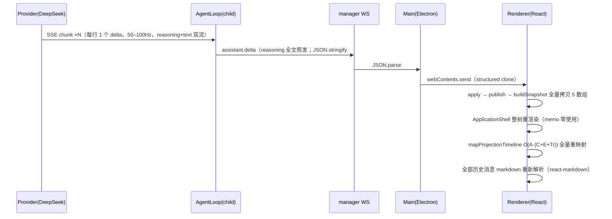
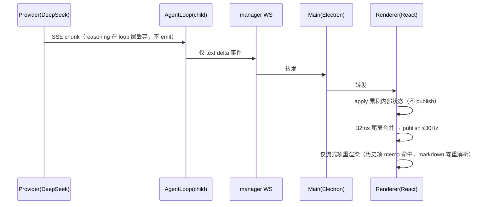

# GUI 流畅度修复 PRD —— 渲染层治本 + think-delta 源头丢弃

> 状态：诊断完成，待用户确认后实施
> 关联：`docs/architecture.md`（传输协议约束）、`docs/PRD.md`（产品需求）
> 分支：feat/subagent-in-process（基于 origin/refactor/rewrite rebase）

## 1. 问题现象

拉取远端 12 commit 并 rebase 后，GUI 流畅度显著下降：流式回复期间滚动卡顿、打字延迟、整体掉帧；**对话历史越长越明显**。

## 2. 当前事件流架构（现状）

## 3. 问题原因（按影响排序，均带证据）

### 3.1 UI 层每 delta 整树重渲染 + 全历史 markdown 重解析（**最大问题**）
- ui/src 全包 **React.memo 零使用** → ApplicationShell 整树每 delta 重渲染
- `mapProjectionTimeline` 无 useMemo：每 assistant 项 filter 全量 cards/eventFlow/toolTraces，O(A·(C+E+Tr))
- **每条 delta 重解析全部历史 assistant 消息的 markdown**（react-markdown unified 全管道）——成本随历史文本总量线性增长，这是「历史越长越卡」的直接解释
- `ConversationTimeline.tsx:47` 每 render 全量 sort O(T log T)

### 3.2 事件源头无节流
- provider 每 SSE 行一个 chunk → 每 chunk 一个 delta 事件（`OpenAIProvider.ts:39-76`、`BaseProvider.ts:48-65`、`AgentLoop.ts:287-289`）
- thinking=high 下 reasoning + text 双流，实测量级 50–100Hz

### 3.3 投影层每事件全量快照
- apply → publish 无合并（`ConversationProjection.ts:187-195`）
- buildSnapshot 每 publish 全量拷贝 timeline/cards/approvals/toolTraces/eventFlow + freeze（`:379-405`）

### 3.4 think-delta 内容无用却全链传输
- 投影层丢弃 reasoning 文本（`ConversationProjection.ts:282-286`），UI 只用它驱动「思考中」状态——**内容本身零消费**，却每字节付完 JSON.stringify + WS + JSON.parse + structured clone 全链成本；thinking=high 下 reasoning 常为正文数倍长
- 结论：think-delta 应在 **loop 层直接丢弃、不发送**；前端「思考中」态一并移除

### 3.5 回归定位
- 旧基线（6d56d04）：mapper 为 O(n) 轻量映射、快照只拷贝 3 数组
- 远端 commit 叠加放大系数：`3542ebc`（cards/eventFlow/toolTraces 数据链）、`c262983`（liveState）、`9067b58`/`c791ada`（订阅挂 shell 级 + 三态接线 + 自动弹面板）
- 结论：旧「per-delta publish」骨架 × 新增映射/渲染重量 = 流畅度断崖

### 3.6 成本链（单条 delta；T=timeline 项数，M=历史 markdown 总字符）
- O(M) markdown 全历史重解析（主成本，20–100KB ≈ 10–50ms/帧）
- O(A·(C+E+Tr)) 映射 + O(T log T) 排序 + 整树元素重建
- 50–100Hz 输入下远超 16ms 帧预算

## 4. 修复方案（2 commit，各可独立验证）

### 4.1 Commit 1 —— `perf(core): think-delta loop 层丢弃 + 移除 thinking 态 + 投影子数组变更才重建`
1. **think-delta 源头丢弃**：`AgentLoop.ts:287-289` 的 onDelta 回调，`reasoning` 类 delta **不 emit assistant.delta 事件**（不出 hub、不过 WS/IPC、不占 UI 快照）。reasoning 文本连事件对象都不进。注释写明语义决策（思考内容不上链）。
2. **移除 thinking 态（core 侧）**：`ConversationProjection.ts:282-286` reasoning 分支删除；`ConversationProjectionSnapshot.liveState` 从 `"thinking" | "generating"` 收窄为 `"generating"`；`client.test.ts` 的 liveState 用例重写（reasoning delta 无事件 → 无状态变化）。
3. **投影子数组缓存**：`ConversationProjection.ts:391-405` 的 `buildSnapshot`，cards/toolTraces/eventFlow/approvals 改为「apply 置脏 → 变更才重建冻结数组」：delta publish 降到 O(T)，且为 Commit 2 的 memo 提供**稳定引用**（memo 生效前提）。

### 4.2 Commit 2 —— `perf(ui): 移除思考中态 + 发布节流（~30Hz）+ 渲染层 memo`
1. **移除思考中态（ui 侧）**：`ChatSurface.tsx:104-117` 三态推导删 `thinking` 分支（failed > waiting > generating）；`GenStatus` phase union 删 `thinking`；`ThinkingIndicator` 与 `RuntimeStatusIndicator` 的呼吸/摇摆动画按引用情况清理（顺带减载一个 infinite CSS 动画）；`minimal.ts` echo loop 删 reasoning 演示段。
2. **发布节流**：`ConversationProjectionBinding.ts:128,183-194` —— 投影事件通知改 32ms trailing 窗口合并（幂等 schedulePublish；`transition()` 仍立即），50–100Hz 压到 ~30Hz
3. **mapper memo**：`ChatSurface.tsx:97-98` 的 `mapProjectionTimeline` 包 `useMemo([projection])`
4. **memo 边界**（配合 Commit 1 稳定引用，浅比较生效）：`AssistantMessage` / `AssistantMarkdown`（text 原值）/ `UserMessage` / `ToolStrip` / `RuntimeEventFlow` / `DesignCard` → **历史消息零重渲染、历史 markdown 零重解析**
5. **杂项**：`AssistantMessage.tsx:78` 默认 cardRenderer registry 提模块级单例；`ToolStrip.tsx:69` groupTraces useMemo；`ApprovalPanel.tsx:293` JSON.parse(args) 移入 group 级 useMemo
6. **去全量 sort**：`ConversationTimeline.tsx:47` 删除（映射输出保持投影追加序；mapper 注释写明不变量）

### 4.3 修复后事件流（目标态）

## 5. 目标指标

| 指标 | 修复前 | 修复后 |
|---|---|---|
| UI 重渲染成本（最大问题） | 每 delta 整树 + 全历史 markdown 重解析 | 历史项 0 重渲染/0 重解析，仅流式项更新 |
| 投影 publish 频率 | 50–100Hz（每 delta） | ≤30Hz（32ms 尾窗合并） |
| think-delta | reasoning 全文全链传输 | loop 层丢弃，0 事件 0 字节 |
| 思考中态 | 单独状态 + 呼吸动画 | 移除（少一状态分支 + 一 infinite 动画） |
| 卡顿随历史增长 | 线性恶化 | 消除（历史项零成本） |

## 6. 不做（观察项）

- **传输层批量**（child 侧 delta 缓冲推送）：治本后大概率不需要，如仍卡再上
- 虚拟化阈值（200 条）调低、其余 infinite CSS 动画降载：后续按需

## 7. 测试与验证

- 每 commit：`pnpm --filter @novel/core typecheck` + `test`；Commit 2 加 `pnpm --filter @novel/ui typecheck` + `test`；最后 `pnpm -r typecheck`
- 新增：ConversationProjectionBinding 节流单测（fake timers：连发 N 个投影事件 → 只 notify 一次）
- `pnpm gui:debug` 手动验证：长对话历史下发消息，滚动/打字流畅度、生成态/工具条/审批面板/流式文本全部正常（思考中态不再出现）
- 回归 smoke：`conversation-teammate-smoke.mjs`（真实 provider 全链路，覆盖 AgentLoop delta 路径）

## 8. 风险

- 32ms 尾窗：审批面板/工具条出现延迟 ≤32ms，无感
- memo 边界遗漏：只损失收益，不破坏功能
- think-delta 丢弃为**语义决策**：思考内容不上链、UI 不展示思考中态（thinking=high 的模型能力不受影响，只是过程不可见）；未来若需展示思考过程，在 AgentLoop 恢复 emit + 前端恢复三态即可
