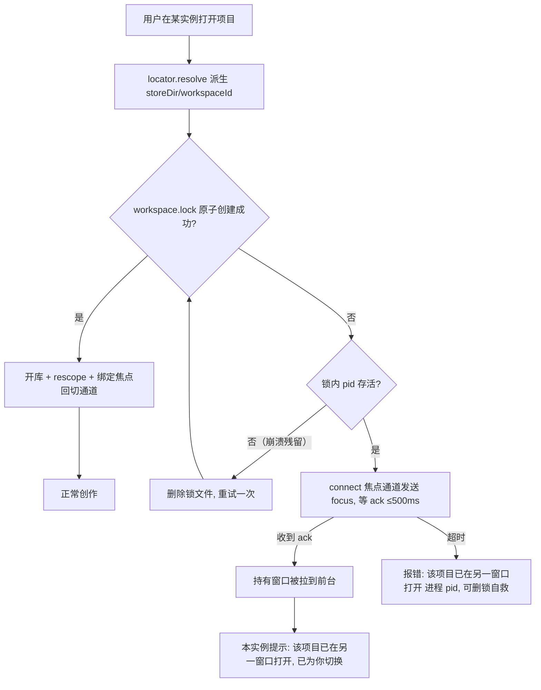
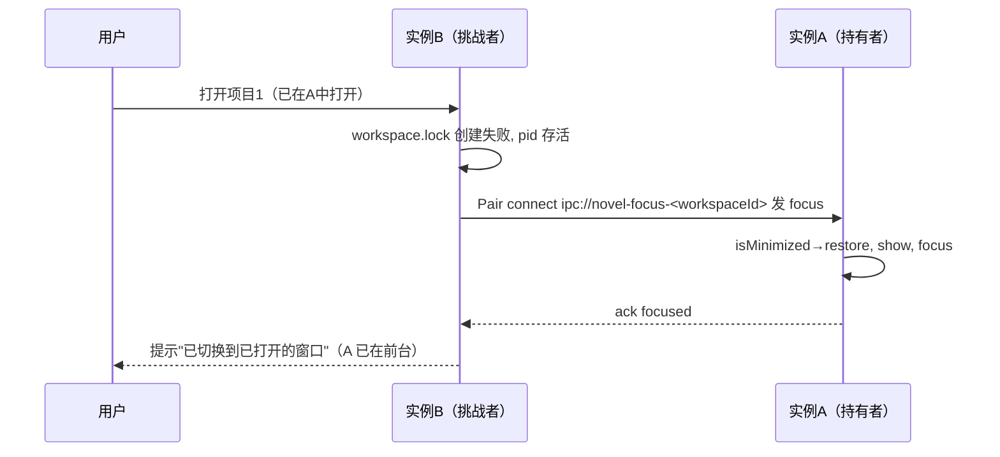
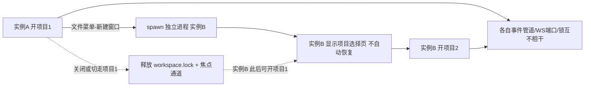

# gui-多实例多开 PRD —— v0.1

> 状态：✅ 已定稿（2026-08-20 实施落地；焦点通道实现为 zeromq REQ/REP 而非 Pair——Pair 严格 1:1，挑战方断开后持有方不再接受新连接）
> 关联：整体产品 PRD [`产品总览.md`](./产品总览.md)；技术设计 `docs/architecture.md`
> 前置调研结论：当前无单实例锁、无文件锁，无死锁风险；第二 GUI 实例启动即崩（`ipc://novel-events` 固定 ZeroMQ 管道二次 bind 失败，`core/src/event/topics.ts:13`、`gui/src/main/minimal.ts:318`）；数据层已按项目隔离（storeDir 哈希目录、WS 随机端口）。

---

## 1. 背景与目标

- 要解决的问题（痛点 / 现状）：
  - 一个 GUI 实例任一时刻只能有一个活跃项目：main 进程 `currentNovelStore/currentJournalDir/currentWorkspaceRoot` 是单变量（`minimal.ts:309,359,403`），打开另一项目 = `rebindWorkspace` 关旧库 + `manager.rescope` **终止旧项目全部运行中对话**（`minimal.ts:656-670`）。同时创作两本书在单实例内不可行。
  - 再启动一个程序实例则**启动即崩**：`novel.changed` 事件 PUB 地址固定 `ipc://novel-events`，第二个实例 `bind()` 失败 → `unhandledRejection` → 退出（`minimal.ts:285-288,318-319`）。
  - 同一项目被两个实例双开无任何防护：工作区 `novel.db` 非 WAL、无 busy_timeout → 并发写抛 SQLITE_BUSY；两边会话目录各自扫描编号 → 新会话目录撞车、journal 交错写入。
  - 两实例并发全量覆盖写 `workspaces.json` → "最近项目"条目互相丢失（last-writer-wins）。
  - 附带发现的缺陷：切换工作区时 `rebindLibraryService` 不关闭旧 `LibraryService`（`minimal.ts:445-450`），Windows 下 book.db 只读句柄累积锁定。
- 目标（一句话，可验收）：**同一台机器可同时运行多个 GUI 实例、各开一个不同项目并行创作；打开已被其他实例持有的项目时被拒绝——优先把持有窗口自动切到前台，失败才报错。**

## 2. 用户故事

- 作为写作者，我希望 同时打开两本书、每本书一个独立窗口并行创作，以便 两本书的运行中对话互不干扰，不需要在切换中丢失进度。
- 作为写作者，我误打开已在另一窗口打开的项目时，希望 应用自动把那个窗口带到前台，以便 我直接继续工作，而不是看到报错甚至造成数据损坏。
- 作为写作者，我希望 在文件菜单一键"新建窗口"，以便 不必手动再次启动程序。
- 作为写作者，我希望 两个窗口的"最近项目"列表都完整，以便 任一窗口都能直达我的书。

## 3. 流程图（必填）

### 3.1 主流程（打开项目，含同项目双开处置）

### 3.2 多主体交互（双开回切）

### 3.3 实例生命周期（多实例并行）

## 4. 功能明细

- 功能点一：事件地址按实例唯一化（修双实例启动崩溃，核心）
  - 触发：GUI main 进程启动装配事件通道时。
  - 输入：进程 pid；env `NOVEL_EVENTS_ADDR` / `NOVEL_EVENT_NAMESPACE`（均可覆盖，调试/测试用）。
  - 处理：`core/src/event/topics.ts` 中 `NOVEL_EVENTS_ADDR` 常量改为 `novelEventsAddr()` 函数，默认 `ipc://novel-events-<pid>`（该 PUB/SUB 均在 main 进程内：bind `minimal.ts:318`、connect `minimal.ts:519`，pid 天然一致）；`conversationEventsAddr(cid)` 拼入实例命名空间 `ipc://conversation-<ns>-<cid>-events`——**ns 必须经 env 传递**（该地址在 main 与会话子进程两侧解析：SUB `minimal.ts:543`、PUB `runDesktopRuntimeChildEntrypoint.ts:151`，子进程 pid 不同，靠 `NodeConversationProcessSupervisor.ts:56` 的 `{...process.env}` 继承对齐）。main 启动早期设 `process.env.NOVEL_EVENT_NAMESPACE ??= String(process.pid)`；ns 未设置时不拼（单进程/测试行为不变）。
  - 输出：任意数量实例的事件管道互不冲突；双实例均正常启动。
  - 异常：用户显式设置 `NOVEL_EVENTS_ADDR` 双开仍会撞地址——该 env 语义收窄为"单实例调试用"，代码注释注明。
- 功能点二：同项目进程锁
  - 触发：`workspaceApi.open`（`minimal.ts:720`）在 `locator.resolve` 之后、`rebindWorkspace` 之前。
  - 输入：storeDir（`userData/novel-storage/<父目录>-<项目名>--<hash8>`）。
  - 处理：新增 `core/src/node/workspace/WorkspaceDirLock.ts`：`openSync(<storeDir>/workspace.lock, "wx")` 原子排他创建，内容 `{pid, workspaceId, workspaceRoot, acquiredAt}`；已存在则读 pid 用 `process.kill(pid, 0)` 探活——活着（含 EPERM）返回占用（带持有者 pid）；已死（ESRCH）删除锁文件重试一次（防崩溃残留）。释放时机与锁获取点对称：`rebindWorkspace(undefined)`（关闭/切换，先释放旧锁再取新锁）与 `will-quit`（`minimal.ts:569`）。锁随 core 落地以复用 node 单测。
  - 输出：同项目同一时刻仅一个实例持有；持有实例退出（含切换走）后锁自动让出。
  - 异常：pid 被系统复用导致误判"活着"（概率极低）→ 错误文案给出锁文件路径，用户可手删自救；锁文件写失败 → open 抛错按现有错误路径展示。
- 功能点三：双开回切已开窗口（失败才报错）
  - 触发：锁被占用且持有进程存活时。
  - 输入：workspaceId（根路径确定性哈希，两实例对同一项目算出同值）。
  - 处理：`topics.ts` 增 `workspaceFocusAddr(workspaceId)` = `ipc://novel-focus-<workspaceId>`。持有侧：open 成功后 bind zeromq `Pair`，收到 `{type:"focus"}` 执行 `mainWindow.isMinimized() && mainWindow.restore(); mainWindow.show(); mainWindow.focus()` 并回 `{type:"focused"}`；生命周期与锁同步释放。挑战侧：connect 发 focus，等 ack ≤500ms 后关闭 socket；收到 ack → open 返回友好提示"该项目已在另一窗口打开，已为你切换到该窗口"；超时 → 抛错"该项目已在另一个窗口打开（进程 <pid>），请切换到该窗口；若确认未打开，可删除 <storeDir>/workspace.lock"。
  - 输出：用户几乎无感地回到已打开该书的前台窗口；持有实例异常（通道不通）时得到明确报错与自救路径。
  - 异常：持有实例僵尸但 pid 活着（窗口无响应）→ 超时报错兜底；Pair 消息丢失 → 同样超时兜底。
- 功能点四：文件菜单"新建窗口"
  - 触发：文件菜单点击"新建窗口"（菜单模板 `minimal.ts:293-305`）。
  - 输入：`process.execPath`、`process.defaultApp`、main 入口路径。
  - 处理：`spawn(process.execPath, args, { detached: true, stdio: "ignore", env })` + `unref()`；args 按 `process.defaultApp` 决定是否携带 main.cjs 路径（兼容 `gui:release` 的 `electron dist/minimal/main.cjs` 与未来打包 exe 形态）。**关键细节：env 中删除 `NOVEL_EVENT_NAMESPACE`**（否则新实例继承父实例命名空间，会话事件管道跨实例撞名）；手动双击 exe 的第二实例天然无继承、不受影响。新实例不自动恢复项目（现状设计），显示项目选择页。
  - 输出：出现第二个独立 GUI 窗口（独立进程），任务栏两个入口。
  - 异常：spawn 失败 → console.warn，不影响当前实例。
- 功能点五：最近项目注册表合并写（防多实例互踩）
  - 触发：`saveRegistry()`（`minimal.ts:623`）。
  - 输入：本实例内存中的 `registryEntries`。
  - 处理：写前重读磁盘 `workspaces.json`，按 workspaceId 合并（lastOpenedAt 新者胜）后写回，将两实例并发登记的条目收敛。
  - 输出：任一实例的"最近项目"列表不因另一实例写入而丢条目。
  - 异常：读失败（损坏/缺失）→ 按现状空表处理写本实例条目。
- 功能点六：附带加固两处（本次触碰区域的相邻缺陷，小改）
  - `rebindLibraryService`（`minimal.ts:445`）重建前 `libraryService.close()`，修 Windows 下 book.db 只读句柄泄漏（多次切换项目累积锁定）。
  - `SqliteNovelStore` 构造后执行 `PRAGMA busy_timeout = 3000`：两实例并发触发完本解析写共享 `library/book.db`（已 WAL）时等待重试而非抛 SQLITE_BUSY。

## 5. 边界与非目标

- 明确不做：
  - 单进程多窗口（main 进程"当前项目"单例全面会话化，改造量约为本方案 3-5 倍；本期的命名空间/数据隔离为其铺路，后续另立 PRD）。
  - 允许同项目双开（含"只读模式双开"）：锁一律拒绝；不做 WAL 化工作区库、跨进程会话编号协调等并发加固。
  - `config.json` 多实例并发写控制（两实例同时改设置窗口极小，维持单写者假设，代码注释注明）。
  - 打开项目时自动恢复上次活跃项目（维持现状：显示项目选择页）。
  - Windows 之外的 `ipc://` 地址回归测试（Linux/macOS 由 CI/后续覆盖）。

## 6. 验收标准

- [x] 单测：WorkspaceDirLock——首次获取成功；占用中二次获取被拒（伪造存活 pid）；持有 pid 已死时锁回收重试成功。
- [x] 单测：`novelEventsAddr()` 默认带 pid、env 覆盖生效；`conversationEventsAddr` 有/无 `NOVEL_EVENT_NAMESPACE` 两种形态。
- [ ] 双实例冒烟：实例 A 开项目1 → 菜单"新建窗口"起实例 B → B 开项目2，两窗口各自发起对话、输出流均正常（命名空间隔离生效），任一窗口关掉另一窗口不受影响。（启动冒烟已过：双实例并存无崩溃、无 bind 冲突，交互流待人工验收）
- [ ] 双开回切冒烟：B 再开项目1 → A 窗口自动置前（含 A 最小化时 restore）→ B 显示"已切换"提示；A 拔掉/卡死场景（模拟通道超时）→ B 得到含 pid 与删锁路径的报错。
- [ ] 锁生命周期冒烟：A 关闭项目1（或退出应用）后 B 可正常打开项目1；A 切换到项目3 后项目1 立即可被 B 打开。
- [ ] 注册表冒烟：A、B 交替打开不同项目后，两边"最近项目"列表条目齐全无丢失。
- [x] core typecheck+test（750/750）、ui check+test（408/408）、全仓构建 + 双实例启动冒烟通过（2026-08-20，Windows）。

## 7. 开放问题

- 焦点回切 ack 超时 500ms 是否够（跨进程 Pair 建连 + 窗口操作）？可先 500ms，实测调整。
- 锁持有 pid 被系统复用误判"活着"的兜底：仅靠报错文案给删锁路径是否足够？v1 不做 pid 起始时间比对。
- "新建窗口"入口是否需要同时在欢迎页/切换对话框露出按钮？v1 只做菜单项。
- 提示与报错文案措辞（"已为你切换到该窗口"等）是否符合产品语气，实施时以现网文案风格微调。
