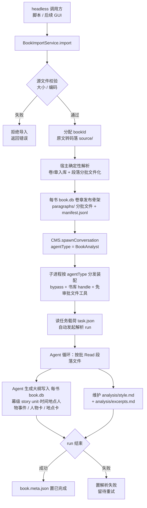
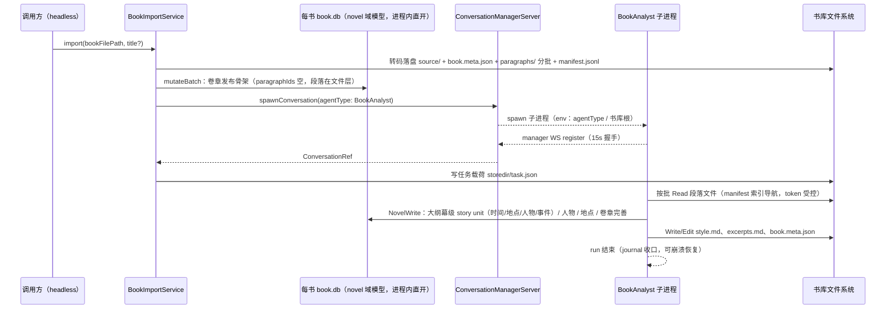
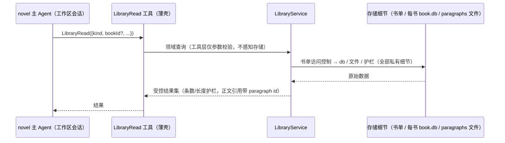
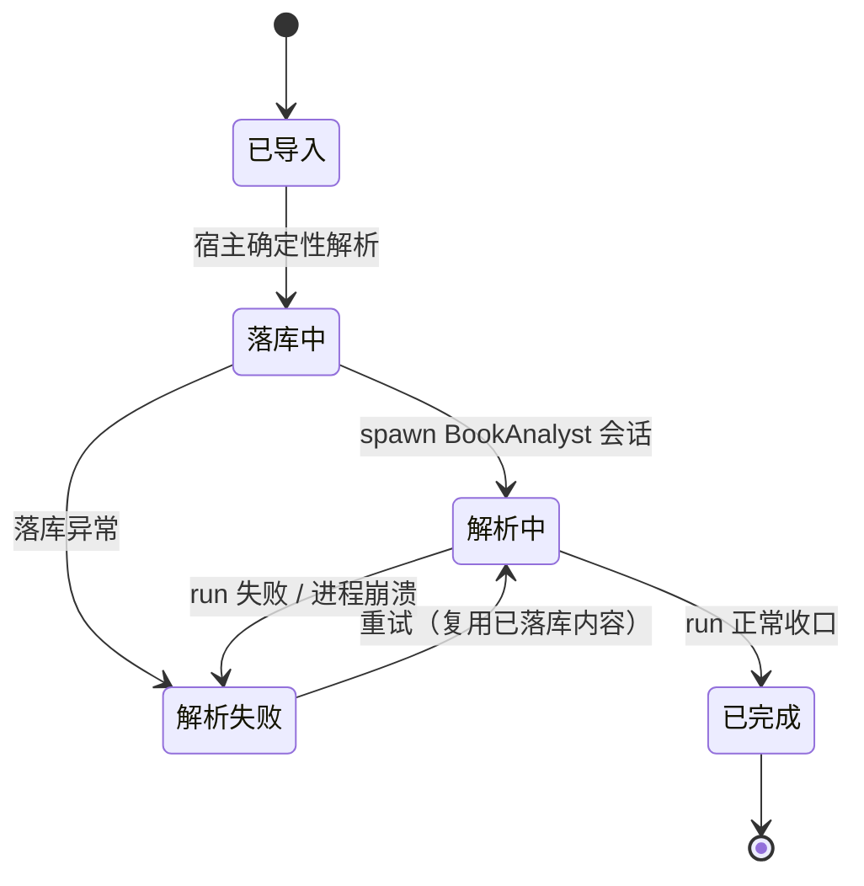
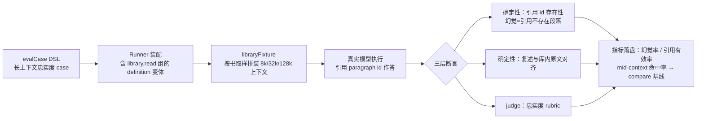

# library-完本解构（书库全景）PRD —— v0.2

> 状态：⏳ 待敲定（定稿后改 ✅ 已定稿）
> 关联：整体产品 PRD [`产品总览.md`](./产品总览.md)；评测框架 [`eval-harness.md`](./eval-harness.md)；工具面收敛 [`novel-tools-通用合并.md`](./novel-tools-通用合并.md)；域概念边界 [`../development/域模型规范.md`](../development/域模型规范.md)；技术设计 `docs/architecture.md`；装配规范 `docs/development/agent-配置规范.md`
> v0.2 变更：合并为书库全景（解构管线 + 工作区接入 + 书库评测）；适配 `abb7da0f` 工具面收敛（novel.entities 组 kind 分发）；明确大纲与卷章解耦——大纲（叙事单位，幕级时间/地点/人物/事件）全部由 Agent 生成，卷/章（发布单位）为确定性骨架，段落每批输入文件化不入库；读取/导出统一封装 LibraryService（组合封装，上层不感知存储细节）；确定 每书 book.db 不经 RPC 直开（WAL 单写多读）；新增长上下文忠实度评测完整规格。实现修订：书库 db 为每书一库 `<bookId>/book.db`（store 单书模型决定）。

---

## 1. 背景与目标

- 要解决的问题（痛点 / 现状）：
  - 创作侧缺少「读透一本完本」的能力：现有 agent 体系（novel 主 Agent + Explore/Compose 只读子代理）全部面向「写」，无法把一本已完本的书解构成结构化的风格/技法资产。
  - 整本书直接塞进上下文不可行：必须结构化落库、按需查询、以 id 引用，控制 token。
  - 参考书与创作数据必须隔离：解构产物若混入用户创作库（各工作区 `novel.db`），会污染正在写的书。
  - 创作过程中无法引用参考书资产；模型长上下文忠实度（幻觉概率）也没有基于真实小说语料的评测手段。
- 统一架构（三平面一底座）：
  - **全局书库平面**：跨工作区唯一的书库数据源（`<libraryRoot>/`：`每书 book.db` + 每书目录）；生产者 = 导入/解析管线（**唯一写者**）；消费者一律**只读直开**（无 RPC，SQLite WAL 单写多读）。
  - **工作区平面**：每工作区一份书单设置（allowlist），决定本工作区的 novel 主 Agent 可访问哪些书；创作库 `novel.db` 不变。
  - **评测平面**：现有 eval harness（evalite 底座 + `evalCase` DSL）扩展书库夹具，构造长上下文忠实度 case 族。
  - **同一套 model**：书库内每本书与项目内正在写的书**完全同构**（同一套 novel 域模型：story_unit/character/location/paragraph/volume/chapter），仅数据库不同（`每书 book.db` vs `novel.db`）；生产用 `NovelWrite/Edit/Delete`（kind 分发）写书库库，消费用 `LibraryRead`（同 kind 语义 + book 维度）读书库库。
  - **概念澄清（大纲 ≠ 卷章，对齐 P3 模型解耦）**：**大纲（story unit）是叙事单位**——以「幕」为粒度，描述时间、地点、人物、事件，属叙事判断，**必须由 Agent 生成**；**卷/章是发布单位**——一章可含多幕、一幕、或一幕半（章尾钩子停在幕中），两者无结构对应关系，映射由解构时建立（章 `storyUnitId` 仅来源提示语义）。因此确定性产物只有卷/章（发布骨架）与段落切分；**段落（每批输入）拆分好后以文件形态供批读、不入库**——每书 book.db 不存 paragraph 实体，正文资产在书库文件层。
  - **LibraryService 服务层（读/导出唯一门面）**：书库的一切读取与导出封装在 `LibraryService`（core）——它是**唯一知道存储细节**（每书 book.db、`paragraphs/` 分批文件、manifest、`.novel/library.json` 书单）的模块，对上层只暴露领域接口（列书 / 按 kind 查实体 / 取分段 / 读风格与摘录 / 导入 / 评测取样），并内聚访问控制与长度护栏；**经组合**持有只读 store 句柄与文件访问（不搞继承链）。上层（LibraryRead 工具、evals Runner、后续 GUI）只依赖接口——不感知「正文在文件、结构在 db」的拆分，也不感知 WAL / 直开等实现细节。
- 目标（一句话，可验收）：
  - 上传一本完本后，**后台自动**完成「宿主确定性落库 → 独立 BookAnalyst 会话解构」，产出书库内同构 novel 域实体 + 全局风格 md + 特色原文摘录；novel 主 Agent 经 `LibraryRead`（受工作区书单约束）引用这些资产；eval harness 用书库真实语料量化长上下文幻觉率——全程零交互、零审批挂起、零创作库写入。

## 2. 用户故事

- 作为作者，我希望上传一本喜欢的完本后系统在后台自动解析，以便不手动整理就获得这本书的结构拆解与风格技法沉淀。
- 作为作者，我希望解析产物一律以 paragraph id 引用原文，以便后续创作按需取用、不把整书拖进上下文。
- 作为作者，我希望解析书库与我的创作库物理隔离（同一套模型、不同数据库），以便参考资料永不混入我自己的正文、大纲与人物。
- 作为作者，我希望在写作会话里直接问「这本书是怎么处理配角退场的」并得到带原文引用的回答，以便模仿优秀技法——前提是我在工作区设置里授权过这本书。
- 作为系统维护者，我希望用书库里的真实长文本评测模型长上下文内的幻觉概率，以便选择模型与裁剪上下文策略时有量化依据。

## 3. 流程图（必填）

### 3.1 解构主流程（生产平面）



### 3.2 多主体交互（导入 → 解析）



### 3.3 工作区消费（接入平面，经 LibraryService）



### 3.4 书本解析状态（落 book.meta.json.status）



### 3.5 书库评测（评测平面，复用 eval harness）



## 4. 功能明细

每个功能点写清：触发条件 / 输入 / 处理逻辑 / 输出 / 异常与回退。

### A. 解构管线（生产平面）

- 功能点一（F1）书籍导入服务 `BookImportService`（headless 入口；LibraryService 写侧门面——调用方只见 `import` 领域操作，存储细节封装于服务内，见 F9）：
  - 触发：调用方（本期为 core 脚本/服务调用；GUI 上传按钮为后续迭代）调用 `import({ path, title? })`。
  - 输入：本地书本文件路径（.txt / .md），可选书名。
  - 处理：校验（存在、非目录、大小上限建议 20 MiB）；编码探测（UTF-8 优先，GB18030/BIG5 常见中文编码自动转码，不可识别按二进制拒绝）；分配 `bookId`（host 风格 `bk_<base36>`）；原文统一 UTF-8 落 `source/`；首次建库确保 WAL；调用确定性解析（F2：卷章入库 + 段落分批文件化）写 `book.meta.json`（status=解析中）；调用 `CMS.spawnConversation({ agentType: "BookAnalyst" })`；向会话 storedir 写任务载荷 `task.json`。
  - 输出：`{ bookId, conversationId, libraryRoot }`。
  - 异常：源文件不可读/超限 → 拒绝导入（不产生半截目录）；spawn 报到超时 → 回滚会话登记、书本置解析失败、目录保留供重试。

- 功能点二（F2）宿主确定性解析（纯代码，不经 LLM，免费且可重放；**大纲零产出**）：
  - 触发：F1 导入流程内。
  - 输入：UTF-8 书本全文 + 每书 book.db store 句柄。
  - 处理：切章——章标题行正则（默认匹配 `第N章/卷/节/回`、`Chapter N`、`序章/楔子/尾声/番外`，参数开放可调）；无章标记 → 按字数虚拟切章。切段——章内按自然段落聚合，目标 3000–4000 字/段、硬上限 6000 字，段落边界对齐。**确定性产物分两层**：
    - **入库层（发布骨架）**：卷（识别到卷标记才建，不硬造）与章（title、orderKey、归卷）经 store `mutateBatch` 写 每书 book.db；章 `paragraphIds` 留空——段落不入库，章↔段落映射由 manifest 维护；
    - **文件层（正文分批，每批输入）**：分段落 `paragraphs/<id>.md`（id 方案 `bk_<bookId>-p<6位序>`，全库唯一、可排序、可作文件名）+ `manifest.jsonl` 索引（每行 `{ id, chapterNo, chapterTitle, chars, file }` 有序）——Agent 与后续消费者按批读取，token 受控；
    - **不产出任何 story unit**：大纲（幕级：时间/地点/人物/事件）是叙事判断，必须由 Agent 生成（F6）；宿主不建占位单元。
  - 输出：每书 book.db 卷章发布骨架 + `paragraphs/` 分批文件与 manifest；`book.meta.json` 统计（章数/段数/字数）。
  - 异常：落库/落盘失败 → 整书回滚（删该书实体与目录）、置解析失败；空书/纯空白 → 拒绝导入。

- 功能点三（F3）全局书库存储布局（同模型、双数据库、无 RPC）：
  - 触发：F1 落盘时。
  - 处理：书库根为**全局目录**（跨工作区共享，建议 `<userData>/novel-library/`，路径定稿见开放问题）；每书一目录；结构解构入**每书一库** `<bookId>/book.db`（复用 SqliteNovelStore 同一套 novel 域模型，独立于各工作区创作库 `novel.db`；store 为单书模型——outline/卷/章全局单书，多书共库会跨书混杂，每书一库使查询天然按书隔离、WAL 各自独立）；**每书 book.db 访问不经 RPC（已定）**——导入/解析管线进程内直开为唯一写者，不新建书库 db WS 服务、无新增 db env；后续一切接入方只读直开同一文件（node:sqlite readOnly；WAL 下读者快照一致、不阻塞写者）。与 `novel.db` 的差异：创作库多会话并发读写需 main 侧 NovelDbWsServer 统一治理，书库仅导入/解析管线写入。
  - 输出：目录布局——
    ```
    <libraryRoot>/
      <bookId>/
        book.db                           # 该书 novel 域库（同模型；WAL；无 paragraph 实体——正文在文件层）
        book.meta.json                    # 书名/源文件/统计/状态/时间戳
        source/<原始文件名>                # UTF-8 归一原文
        paragraphs/<id>.md                # 正文分批（每批输入，不入库）
        paragraphs/manifest.jsonl         # 分批索引（id ↔ 章 ↔ 文件）
        analysis/style.md                 # 全局风格 md
        analysis/excerpts.md              # 特色原文摘录
    ```
  - 异常：无（布局为约定，落盘失败随 F1/F2 异常路径拒绝）。

- 功能点四（F4）BookAnalyst 独立 Agent 定义（适配 `abb7da0f` 新工具面）：
  - 触发：子进程装配时（声明式 `AgentDefinition`，对齐 agent-配置规范）。
  - 输入：`agentType: "BookAnalyst"`，`communication: "standalone"`，`delegation: disabled`。
  - 处理：**不加入** novel 主 Agent 的 `delegation.allowedAgentTypes`（保持 `["Explore", "Compose"]`）→ 主 Agent 的 Agent 工具目录不可派发它。工具组 `groupIds`：
    - `novel.entities`（NovelRead/NovelWrite/NovelEdit/NovelDelete 四件 kind 分发通用工具，**整组装配、无 kind 收窄**——handle 指向 每书 book.db；实际用于写**大纲（story_unit）**/人物/地点/卷章，`kind=paragraph` 写在书库管线不使用：正文不入库、分批由宿主文件化）；
    - `analyst.files`（**新增免审批四件套**：Read/Glob/Write/Edit，`requireApproval=false`，沙盒 = 书库根目录——解析会话的 workspace 注入书库根）；
    - `runtime.todo`（解析进度计划）；
    - 不装配：`novel.compose`、`runtime.ask`、subagent 派发三件套。
  - 输出：新增 prompt 段（`novel.book-analyst.*`：身份/流程/产物契约）+ 上述定义实例。
  - 异常：误配由现有 TOOL_POLICY_INVALID / 白名单派生机制在装配期暴露。

- 功能点五（F5）后台会话装配与自动驱动：
  - 触发：`spawnConversation({ agentType: "BookAnalyst" })` → ProcessSpawner。
  - 输入：agentType（**新增 env 注入子进程**，当前未传递）、书库根路径、任务载荷 `storedir/task.json`。
  - 处理：子进程入口按 agentType 分发——BookAnalyst 分支装配 `buildBookAnalystAgent`：workspace=书库根、NovelHandle=进程内直开 每书 book.db、`initialMode: "bypass"`、不装配 compose/ask；canonical Novel 写在 bypass 下由现有 gateBatch 自动放行，文件工具走免审批变体 → **全程零审批挂起**（后台无人应答审批，硬约束）；register 后读 `task.json`，自动以首条任务消息发起解析 run。
  - 输出：独立后台会话（journal 落盘、事件可订阅，复用现有会话机制）。
  - 异常：崩溃 → 现有 journal 重放 + `resumePendingRun` 暂停点续跑；报到超时 → F1 回滚路径。

- 功能点六（F6）解构产物规范与「写 id」契约：
  - 触发：解析 run 进行中。
  - 输入：`paragraphs/manifest.jsonl` 索引 + 分批文件（宿主已拆分、未入库）+ 每书 book.db 卷章发布骨架。
  - 处理（Agent 行为契约）：
    - **按批读取**（Read 分批文件，manifest 索引导航），整书永不一次性进上下文；
    - **大纲生成（核心智能产物，story unit 全部由此产生）**：以「幕」为粒度建 story unit（对齐 saga/arc/sequence/scene 层级模型）——每幕写明**时间、地点、人物、事件**（title + `intent`/`synopsis`），并引用覆盖的 paragraph id 区间；幕与章**无结构对应**（一章可含多幕 / 一幕 / 一幕半钩子），映射经章 `storyUnitId`（指向主幕，来源提示语义）与幕梗概内的区间引用表达；
    - 人物卡（`kind=character`）、地点卡（`kind=location`）；
    - 卷章完善（卷标记未识别时的卷划分、章归卷调整）；
    - 实体字段内引用正文一律写 **paragraph id**；
    - 维护 `analysis/style.md`：全书**全局风格 md**，结构化模板——叙述视角/时态、句式节奏与长短分布、对话/叙述比例、场景转换手法、悬念与情绪节拍、人物塑造手法、世界观展开手法、可复用创作规律（每条结论附 paragraph id 例证）；
    - 维护 `analysis/excerpts.md`：**特色原文**——每条 = paragraph id + 受控长度摘录 + 代表性说明（为什么这段最能突出该书风格）；
    - **写 id 契约**：一切产物引用正文必须写 paragraph id，禁止复制长段原文进实体；收尾更新 `book.meta.json` 状态与统计。
  - 输出：完整解构资产（库内实体 + 两份 analysis md）。
  - 异常：工具失败 → run 内自行重试/降级；run 失败 → 状态置解析失败，已落产物保留，重试增量续作。

- 功能点七（F7）断点恢复与重试：
  - 触发：解析中子进程崩溃后重启 / 对解析失败书本发起重试。
  - 输入：既有 `bookId` 目录 + 会话 journal + 每书 book.db 已落内容。
  - 处理：子进程重启走现有 journal 重放 + 暂停点续跑；显式重试再次 spawn（复用已落库骨架与部分产物，paragraph id 稳定）；并发解析上限本期固定 1。
  - 输出：续跑完成的产物集。
  - 异常：journal 损坏 → 置解析失败，允许清空该书的智能解构产物（大纲/人物/地点/analysis）后重解析（确定性产物——卷章骨架与分批文件——不重做）。

- 功能点八（F8）冒烟脚本（解构管线验收载体）：
  - 触发：`node core/scripts/book-analyst-smoke.mjs`（模式对齐现有 smoke 脚本）。
  - 输入：内置/指定样例 txt。
  - 处理：headless 走完 F1→F6 全链路（进程内直开 每书 book.db，不依赖 GUI）。
  - 输出：退出码 + 产物路径打印。
  - 异常：任一环节失败即非零退出并打印根因。

### B. 工作区接入（消费平面）

- 功能点九（F9）`LibraryService`（书库服务层——读取/导出唯一门面）：
  - 触发：任何上层对书库的读取/导出（LibraryRead 工具、evals Runner 取样、后续 GUI 只读展示、导入写面）。
  - 输入：领域操作——列书 / 按 kind 查实体 / 按 id 取分段 / 读风格与摘录 / 评测取样 / 导入。
  - 处理：**封装全部存储与访问细节**——每书 book.db 只读直开句柄、`paragraphs/` 分批文件与 manifest、`.novel/library.json` 书单校验、长度护栏（条数/截断）全部在服务内部；**经组合**持有各依赖（store 句柄 + 文件访问 + 书单读取），不使用继承链、不向调用方暴露实现类型；访问控制（未授权 bookId → 明确报错、不泄漏存在性）与护栏内聚于服务；导入写面（F1/F2 的确定性解析落库/落盘）是同一服务的写侧方法——**单写者约束由此收口**（写侧仅导入管线与 BookAnalyst 会话；后者的智能解构写走 novel.entities 工具面——工具即领域接口，不经 service 转译）。
  - 输出：领域接口（TS interface），上层仅依赖此接口编程。
  - 异常：存储不可达/损坏 → 服务层统一错误语义；上层不感知具体存储形态。

- 功能点十（F10）工作区书单（访问控制，已定：工作区侧存 + 默认无）：
  - 触发：LibraryService 初始化与每次带 bookId 的领域查询。
  - 输入：工作区根下 `.novel/library.json`。
  - 处理：文件为 allowlist——`{ "books": ["bk_xxx", ...] }`；**默认（文件缺失/空）= 不可见任何书**，逐书显式授权（opt-in）；**书单读取与校验收口在 LibraryService 内**（工具层不自行读文件、不见路径）。
  - 输出：服务级访问门。
  - 异常：书单文件损坏 → 按空书单处理并告警日志；书单含不存在的 bookId → 静默忽略（overview 不列出）。

- 功能点十一（F11）`LibraryRead` external tool（工具薄壳，同一套 model 的读面）：
  - 触发：主 Agent（及后续其他授权会话）调用。
  - 输入：`{ kind, bookId?, ...过滤参数 }`——kind 与 NovelRead 对齐并扩展两个分析档：`overview / character / location / story_unit / paragraph / volume / chapter / style / excerpt`。
  - 处理：新工具组 `library.read`（挂入主 Agent `groupIds`，只读——**不设 LibraryWrite**，书库写仅导入/解析管线）。工具层只做参数校验 + 转调 LibraryService，**不感知 db/文件拆分、存储路径与直开实现**；各 kind 语义（service 内部实现）：
    - `overview`：列出**当前工作区书单内**的书目 + 每书元数据与统计；
    - `character/location/story_unit/volume/chapter`：**同 NovelRead 语义**的过滤参数（characterId/storyUnitId/volumeId/includeContent 等）+ 顶层 `bookId` 维度；
    - `paragraph`：按 id 精确取 / 按 chapterNo 批量取；
    - `style` / `excerpt`：读该书风格 md / 特色摘录（受长度护栏）；
    - 护栏默认值见开放问题——防单次调用拖垮上下文。
  - 输出：受控结果集（正文引用天然带 paragraph id）。
  - 异常：未授权 / bookId 不存在 / kind 非法 → 服务错误透传（TOOL_ARGUMENTS_INVALID 语义对齐现有工具）。

- 功能点十二（F12）书单设置维护：
  - 触发：用户授权/取消授权某本书。
  - 输入：bookId。
  - 处理：本轮提供 headless 维护（脚本/手编 `.novel/library.json`）；格式即 F10 契约。
  - 输出：书单文件变更即时生效（下次服务读取）。
  - 异常：无（纯文件）。GUI 设置界面为非目标。

### C. 书库评测（评测平面，完整规格）

- 功能点十三（F13）library fixture（evals Runner 扩展）：
  - 触发：评测 case 声明书库夹具时。
  - 输入：`libraryFixture({ bookId, tokenBudget, chapters? })`（tokenBudget 梯度：8k / 32k / 128k）。
  - 处理：**经 LibraryService 只读取样**（Runner 持服务只读实例，不触碰存储细节），按书取样（指定章或均匀取样）拼接真实段落原文为超长上下文文本（含 paragraph id 标注），token 估算截断；Runner 装配含 `library.read` 组的 definition 变体（复用现有 `buildNovelAgent` 注入点，对齐 eval-harness §6/§7）。
  - 输出：fixture 文本（seed 文件或任务上下文内嵌）。
  - 异常：书库无该书/段落不足 → case 构造期报错（不进执行）。

- 功能点十四（F14）长上下文忠实度 case 族（Tier 2 新 case 族）：
  - 触发：`pnpm --filter evals` 套件运行。
  - 输入：fixture 上下文 + 任务模板（如「第 N 段首次出现的角色是谁，引用 paragraph id」「复述 X 段的关键情节，标注 id」「中部（mid-context）细节问答」）。
  - 处理：三层断言——
    1. **确定性·引用存在性**：回答中引用的 paragraph id 必须真实存在于该书的 manifest/分批文件（幻觉 = 引用不存在 id），`custom(fn)` 校验；
    2. **确定性·原文对齐**：复述内容与分批文件原文对齐（关键实体/数字抽取比对，相似度阈值），不依赖 LLM；
    3. **`finalReplyJudge`**：忠实度 rubric（不编造、不跨段混淆、不拼接不存在情节）。
    指标扩展进 `EvalRunMetrics`（`hallucination: { cited, valid }` 等），case 级聚合出**幻觉率 / 引用有效率 / mid-context 命中率**。
  - 输出：逐 case 指标落盘 results/（对齐现有 manifest 归因：git SHA + prompt hash + model）。
  - 异常：judge 失败按不过计（对齐 eval-harness §3.7）；网络/超时非零退出。

- 功能点十五（F15）与现有 harness 的接缝：
  - 触发：实现期。
  - 处理：复用 `evalCase` DSL / Runner / 结果落盘 / `eval:compare`（基线对比新增幻觉率维度与红线）；case 文件入 `evals/cases/`；**不修改既有 15 case 与 eval-harness.md 主体**（互引关系）。
  - 输出：新增 case 族 + fixture helper。
  - 异常：无（纯增量）。

## 5. 边界与非目标

- 明确不做：
  - GUI：上传入口、解析进度、书单设置界面、书库管理（列表/删除/重命名）——均后续迭代。前端交互基准已由 `docs/design/app-redesign-demo.html` v0.9.0「书库」视图先行定义（示例数据，未接后端；见 `docs/design/app-redesign-prd.md` §8A）。
  - 语义/向量检索（LibraryRead 只做精确 id + 过滤查询 + 关键词非目标）。
  - `LibraryWrite` / 会话侧写书库——书库写路径仅导入/解析管线（单写者）。
  - 生产端 Agent 誊写正文（确定性落库由宿主完成，Agent 不批量复制原文，节省 token）。
  - 解析结果回写用户创作库（`novel.db` 零写入，物理隔离）。
  - 交互式提问（不装配 AskUserQuestion；后台失败即置失败态）。
  - 多书联合分析 / 横向风格对比（每书独立解构）。
  - 同书新版本替换（本期重复导入 = 新 bookId 并存；替换策略见开放问题）。
  - 评测侧：多模型矩阵自动编排、对正文 prose 质量的通用评分（对齐 eval-harness §11 边界）。

## 6. 验收标准

- [ ] F8 冒烟脚本端到端通过：样例 txt → 导入 → 确定性解析（卷/章发布骨架入库 + `paragraphs/` 分批文件与 manifest）→ 自动 spawn → 解析 run 收口。
- [ ] 确定性校验：分批文件覆盖全文、无重叠、段长 ≤ 硬上限；paragraph id 全书唯一且符合 `bk_<bookId>-p<6位>` 方案；每书 book.db 仅有宿主写入的卷/章骨架（章 `paragraphIds` 空）且**无任何 story unit / paragraph 实体**。
- [ ] `analysis/style.md` 与 `analysis/excerpts.md` 存在，且其中引用的全部 paragraph id 均能在 manifest 命中（脚本校验）。
- [ ] 大纲校验：每书 book.db 出现 `<bookId>-` 前缀的幕级 story unit（`intent`/`synopsis` 非空、含时间/地点/人物/事件要素与 paragraph id 区间引用）及人物/地点实体；用户创作库 `novel.db` 写入为 0（隔离验证）。
- [ ] 主 Agent 的 Agent 工具目录（NOVEL_SUBAGENT_DEFINITIONS 派生）不含 BookAnalyst；主 Agent 工具面新增 `library.read` 组（LibraryRead）。
- [ ] 接入验证：新工作区（无 `.novel/library.json`）`LibraryRead overview` 返回空；授权后 overview 列出该书且各 kind 查询与 NovelRead 语义一致（paragraph kind 经分批文件/manifest 服务）；未授权 bookId 明确报错且不泄漏存在性；style/excerpt 可读且受长度护栏。
- [ ] 封装验证：LibraryRead 工具与 evals Runner 仅依赖 LibraryService 接口（不 import store 实现与存储路径——结构审查项）；访问控制与护栏行为在服务层测试覆盖。
- [ ] 解析全程零审批请求入队（WaitRequestQueue 无该会话条目），无 AskUserQuestion 挂起。
- [ ] 解析中 kill 子进程后重启：journal 恢复续跑，产物不重复落盘（或安全重跑）。
- [ ] 评测：长上下文 case 族可跑（fixture 构造 8k/32k/128k 梯度）、确定性断言（引用存在性 + 原文对齐）不依赖 judge 也能产出幻觉率指标、指标进 results/ 与 compare 基线。
- [ ] 两本书先后导入目录互不干扰（`<bookId>/` 隔离 + 实体 id 前缀隔离）。

## 7. 开放问题

- 书库根路径最终命名与是否允许用户自定义位置（本稿建议 `<userData>/novel-library/`）。
- 切章正则与段大小默认参数（不同来源 txt 章节标记差异大，需采样校准；参数化配置点）。
- paragraph 定制 id 方案确认：本稿 `bk_<bookId>-p<6位>` 纯序（排序由 orderKey 承担）；备选含章序 `…-c0007-p0003`（肉眼可读性更好）。
- `LibraryRead` 护栏默认值：paragraph 单次条数/字符上限、style/excerpt 截断长度。
- 长上下文评测：token 梯度档位与每档 case 数、套件 token 熔断预算、原文对齐断言的阈值与关键实体抽取方案。
- BookAnalyst 会话在会话列表 UI 的呈现方式（隐藏 / 后台标签，随 GUI 迭代定）。
- BookAnalyst 的 provider / 采样参数是否与主会话区分（独立 env 配置位）。
- 解析失败重试的次数上限与退避策略。
- 同书重传新版本的替换/版本化策略。
