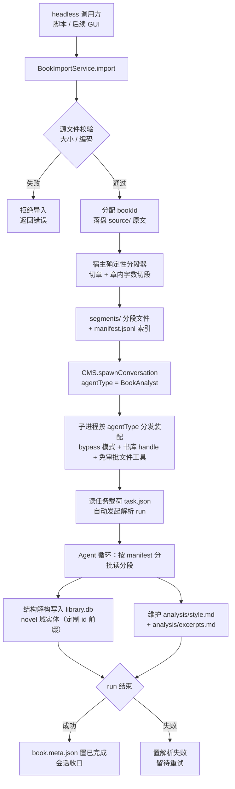
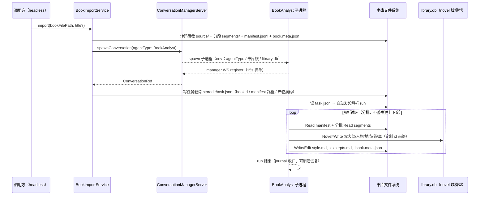
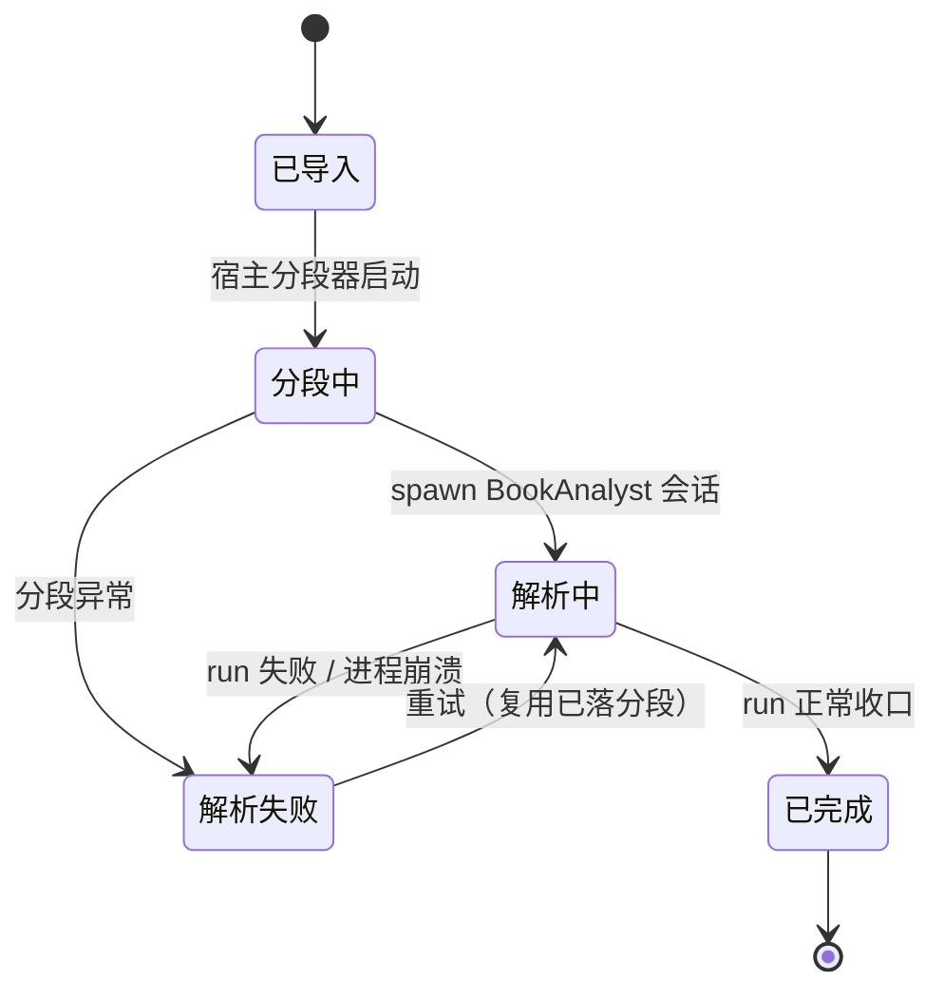

# library-完本解构 PRD —— v0.1

> 状态：⏳ 待敲定（定稿后改 ✅ 已定稿）
> 关联：整体产品 PRD [`产品总览.md`](./产品总览.md)；技术设计 `docs/architecture.md`；装配规范 `docs/development/agent-配置规范.md`
> 使用说明：新 PRD 从本模板复制起步，固定章节不得删减；流程图必填。

---

## 1. 背景与目标

- 要解决的问题（痛点 / 现状）：
  - 创作侧缺少「读透一本完本」的能力：现有 agent 体系（novel 主 Agent + Explore/Compose 只读子代理）全部面向「写」，无法把一本已完本的书解构成结构化的风格/技法资产。
  - 整本书（数百万字）直接塞进上下文不可行：必须分段、按需取用、以 ID 引用，控制 token。
  - 参考书与创作数据必须隔离：解构产物若混入用户创作库（novel.db 的段落/大纲/人物），会污染正在写的书。
- 目标（一句话，可验收）：
  - 上传一本完本后，**后台自动**完成「宿主分段（ID scheme）→ 独立 BookAnalyst 会话解构」，产出**全局书库**（同模型、独立数据库）中的 novel 域实体 + 每本书的全局风格 md + 特色原文摘录，全程零交互、零审批挂起、零创作库写入。

## 2. 用户故事

- 作为作者，我希望上传一本喜欢的完本后系统在后台自动解析，以便不手动整理就获得这本书的结构拆解与风格技法沉淀。
- 作为作者，我希望解析产物一律以 segment id 引用原文，以便后续创作按需取用、不把整书拖进上下文。
- 作为作者，我希望解析书库与我的创作库物理隔离（同一套模型、不同数据库），以便参考资料永不混入我自己的正文、大纲与人物。
- 作为系统，我希望解构由独立后台 Agent 完成（非 novel 主 Agent 的 subagent、非交互式），以便解析不占用创作会话、不依赖用户在线应答。

## 3. 流程图（必填）

### 3.1 主流程



### 3.2 多主体交互



### 3.3 状态流转（书本解析状态，落 book.meta.json.status）



## 4. 功能明细

每个功能点写清：触发条件 / 输入 / 处理逻辑 / 输出 / 异常与回退。

- 功能点一（F1）书籍导入服务 `BookImportService`（headless 入口）：
  - 触发：调用方（本期为 core 脚本/服务调用；GUI 上传按钮为后续迭代）调用 `import({ path, title? })`。
  - 输入：本地书本文件路径（.txt / .md），可选书名。
  - 处理：校验（存在、非目录、大小上限建议 20 MiB）；编码探测（UTF-8 优先，GB18030/BIG5 常见中文编码自动转码）；分配 `bookId`（host 风格 `bk_<base36>`）；原文统一 UTF-8 落 `source/`；调用分段器（F2）；按 F3 布局写 `book.meta.json`（status=解析中）；调用 `CMS.spawnConversation({ agentType: "BookAnalyst" })`；向会话 storedir 写任务载荷 `task.json`。
  - 输出：`{ bookId, conversationId, libraryRoot }`。
  - 异常：源文件不可读/超限 → 拒绝导入（不产生半截目录）；spawn 报到超时 → 回滚会话登记、书本置解析失败、目录保留供重试；转码失败 → 按二进制拒绝。

- 功能点二（F2）宿主确定性分段器（减少 token 的核心）：
  - 触发：F1 导入流程内（纯代码，不经 LLM，确定可重放）。
  - 输入：UTF-8 书本全文。
  - 处理：切章——章标题行正则（默认匹配 `第N章/卷/节/回`、`Chapter N`、`序章/楔子/尾声/番外`，参数开放可调）；无任何章标记 → 全书按字数虚拟切章。切段——章内按自然段落聚合，目标 3000–4000 字/段、硬上限 6000 字，段落边界对齐（绝不切断自然段）。ID scheme：`ch<4位章序>-s<4位段序>`（如 `ch0007-s0003`），全库唯一、可排序、可作文件名。
  - 输出：`segments/<id>.md`（分段原文）+ `segments/manifest.jsonl`（每行 `{ id, chapterNo, chapterTitle, chars, file }` 有序索引）。
  - 异常：分段过程不可失败（纯确定性）；空书/纯空白 → 拒绝导入。

- 功能点三（F3）全局书库存储布局（同模型、双数据库）：
  - 触发：F1 落盘时。
  - 输入：bookId、源文件、分段结果。
  - 处理：书库根为**全局目录**（跨工作区共享，建议 `<userData>/novel-library/`，路径定稿见开放问题）；每书一目录；正文分段与解析产物为文件形态，结构解构入 `library.db`（复用 SqliteNovelStore 同一套 novel 域模型，独立于各工作区的用户创作库 `novel.db`）。
  - 输出：目录布局——
    ```
    <libraryRoot>/
      library.db                          # 书库库（novel 域模型，多书共存）
      <bookId>/
        book.meta.json                    # 书名/源文件/scheme/统计/状态/时间戳
        source/<原始文件名>                # UTF-8 归一原文
        segments/ch0001-s0001.md ...      # 分段原文
        segments/manifest.jsonl           # 分段索引
        analysis/style.md                 # 全局风格 md
        analysis/excerpts.md              # 特色原文摘录
    ```
  - 异常：无（布局为约定，落盘失败随 F1 异常路径拒绝）。

- 功能点四（F4）BookAnalyst 独立 Agent 定义：
  - 触发：子进程装配时（声明式 `AgentDefinition`，对齐 agent-配置规范）。
  - 输入：`agentType: "BookAnalyst"`，`communication: "standalone"`，`delegation: disabled`。
  - 处理：**不加入** novel 主 Agent 的 `delegation.allowedAgentTypes`（保持 `["Explore", "Compose"]`）→ 主 Agent 的 Agent 工具目录不可派发它，满足「不是 main 的 subagent」。工具组 `groupIds`：
    - `analyst.files`（**新增免审批四件套**：Read/Glob/Write/Edit，`requireApproval=false`，沙盒 = 书库根目录——即解析会话的 workspace 注入书库根，而非用户工作区）；
    - `novel.characters / novel.locations / novel.outline / novel.volumes / novel.chapters / novel.delete`（Novel* 工具经 NovelHandle 指向 `library.db`；**排除 `novel.paragraph`**——正文分段走 F2 定制方案，不写任何段落实体）；
    - `runtime.todo`（解析进度计划）；
    - 不装配：`novel.compose`（设计模式无意义）、`runtime.ask`（后台无交互）、subagent 派发三件套（不再委托）。
  - 输出：新增 prompt 段（`novel.book-analyst.*`：身份/流程/产物契约）+ 上述定义实例。
  - 异常：误配（如把 BookAnalyst 加入主 Agent 白名单）由现有 TOOL_POLICY_INVALID / 白名单派生机制在装配期暴露。

- 功能点五（F5）后台会话装配与自动驱动：
  - 触发：`spawnConversation({ agentType: "BookAnalyst" })` → ProcessSpawner。
  - 输入：agentType（**新增 env 注入子进程**，当前未传递）、书库根路径、library db 连接（生产：书库 db WS 的 URL/token 新 env；headless/冒烟：进程内直开 `library.db`）、任务载荷 `storedir/task.json`。
  - 处理：子进程入口按 agentType 分发——BookAnalyst 分支装配 `buildBookAnalystAgent`：workspace=书库根、`initialMode: "bypass"`、不装配 compose/ask；canonical Novel 写在 bypass 下由现有 gateBatch 自动放行，文件工具走免审批变体 → **全程零审批挂起**（后台无人应答审批，此项为硬约束）；register 后读 `task.json`，自动以首条任务消息发起解析 run。
  - 输出：独立后台会话（journal 落盘、事件可订阅，复用现有会话机制）。
  - 异常：崩溃 → 现有 journal 重放 + `resumePendingRun` 暂停点续跑；报到超时 → F1 回滚路径。

- 功能点六（F6）解构产物规范与「写 id」契约：
  - 触发：解析 run 进行中。
  - 输入：manifest 索引 + 分批分段原文。
  - 处理（Agent 行为契约）：
    - **按 manifest 分批读取**（Read 分段文件），整书永不一次性进上下文；
    - 结构解构写入 `library.db` novel 域实体，**定制 id 前缀** `<bookId>-<域>-<序号>`（如 `bk_ab12-su-0001` / `-char-0001` / `-vol-0001` / `-ch-0001`，符合现有 ID_PATTERN）：story unit 树（书的卷/幕/场景结构，`synopsis`/`intent` 内引用 segment id 区间）、人物卡、地点卡、发布卷/章（章实体 `paragraphIds` 允许为空——书库正文以分段文件为准，章↔分段对应由 manifest 的 chapterNo 维系）；
    - 维护 `analysis/style.md`：全书**全局风格 md**，结构化模板——叙述视角/时态、句式节奏与长短分布、对话/叙述比例、场景转换手法、悬念与情绪节拍、人物塑造手法、世界观展开手法、可复用创作规律（每条结论附 segment id 例证）；
    - 维护 `analysis/excerpts.md`：**特色原文**——每条 = segment id + 受控长度摘录 + 代表性说明（为什么这段最能突出该书风格）；
    - **写 id 契约**：一切产物（实体字段、style.md、excerpts.md）引用正文必须写 segment id，禁止复制长段原文进实体；收尾更新 `book.meta.json` 状态与统计。
  - 输出：F3 布局下的完整产物集。
  - 异常：工具失败 → Agent 在 run 内自行重试/降级（少写实体不中断整体）；run 失败 → 状态置解析失败，已落产物保留，重试增量续作。

- 功能点七（F7）断点恢复与重试：
  - 触发：解析中子进程崩溃后重启 / 调用方对解析失败书本发起重试。
  - 输入：既有 `bookId` 目录 + 会话 journal。
  - 处理：子进程重启走现有 journal 重放 + 暂停点续跑；显式重试则再次 spawn（复用已落分段与部分产物，manifest 不变即 id 稳定）；并发解析上限本期固定 1。
  - 输出：续跑完成的产物集。
  - 异常：journal 损坏 → 书本置解析失败，允许清空 analysis/ 后整书重解析（segments 不重切）。

- 功能点八（F8）冒烟脚本（本期验收载体）：
  - 触发：`node core/scripts/book-analyst-smoke.mjs`（模式对齐现有 smoke 脚本）。
  - 输入：内置/指定样例 txt。
  - 处理：headless 走完 F1→F6 全链路（进程内直开 library.db，不依赖 GUI）。
  - 输出：退出码 + 产物路径打印。
  - 异常：任一环节失败即非零退出并打印根因。

## 5. 边界与非目标

- 明确不做：
  - GUI 上传入口与解析进度 UI（后续 PRD；本期 headless 全链路）。
  - 主 Agent / 创作侧消费书库的检索工具链（「写作时引用书库风格/原文」为后续 PRD）。
  - 分段正文写入任何段落实体（`novel.paragraph` 排除；正文只存在于分段文件）。
  - 解析结果回写用户创作库（`novel.db` 零写入，物理隔离）。
  - 交互式提问（不装配 AskUserQuestion；后台失败即置失败态，不挂起等人）。
  - 多书联合分析 / 横向风格对比（每书独立解构）。
  - 书库管理操作（列表/删除/重命名 UI 及对应 RPC）。
  - 同书新版本替换（本期重复导入 = 新 bookId 并存；替换策略见开放问题）。

## 6. 验收标准

- [ ] F8 冒烟脚本端到端通过：样例 txt → 导入 → 分段（manifest id 连续、覆盖全文、无重叠、段长 ≤ 硬上限）→ 自动 spawn → 解析 run 收口。
- [ ] `analysis/style.md` 与 `analysis/excerpts.md` 存在，且其中引用的全部 segment id 均能在 manifest.jsonl 命中（脚本校验）。
- [ ] `library.db` 出现 `<bookId>-` 前缀的 story unit / character / location / volume / chapter 实体；用户创作库 `novel.db` 写入为 0（隔离验证）。
- [ ] 主 Agent 的 Agent 工具目录（NOVEL_SUBAGENT_DEFINITIONS 派生）不含 BookAnalyst；BookAnalyst 定义 delegation disabled、无 subagent 派发工具。
- [ ] 解析全程零审批请求入队（WaitRequestQueue 无该会话条目），无 AskUserQuestion 挂起。
- [ ] 解析中 kill 子进程后重启：journal 恢复续跑，产物不重复落盘（或安全重跑）。
- [ ] 两本书先后导入目录互不干扰（`<bookId>/` 隔离 + 实体 id 前缀隔离）。

## 7. 开放问题

- 书库根路径最终命名与是否允许用户自定义位置（本稿建议 `<userData>/novel-library/`）。
- 切章正则与段大小默认参数（不同来源 txt 章节标记差异大，需采样校准；参数化配置点）。
- `library.db` 并发访问策略：本期单写者 = 解析子进程；main 侧只读接入与书库 db WS 常驻服务的启用时机。
- BookAnalyst 会话在会话列表 UI 的呈现方式（隐藏 / 后台标签，随 GUI 迭代定）。
- BookAnalyst 的 provider / 采样参数是否与主会话区分（独立 env 配置位）。
- 解析失败重试的次数上限与退避策略。
- 编码探测范围（UTF-8 / GB18030 / BIG5 / UTF-16）与不可识别时的报错文案。
- 同书重传新版本的替换/版本化策略。
