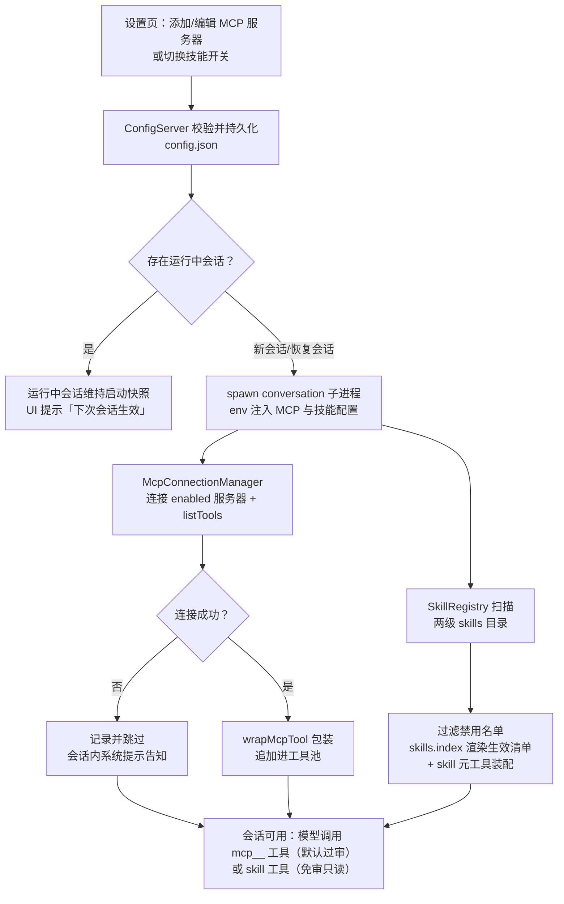
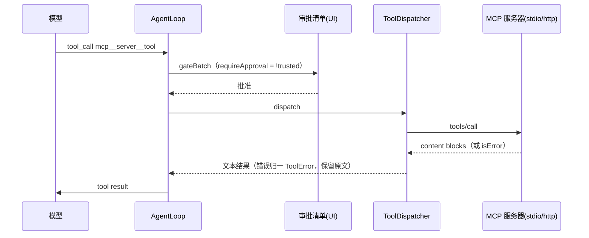
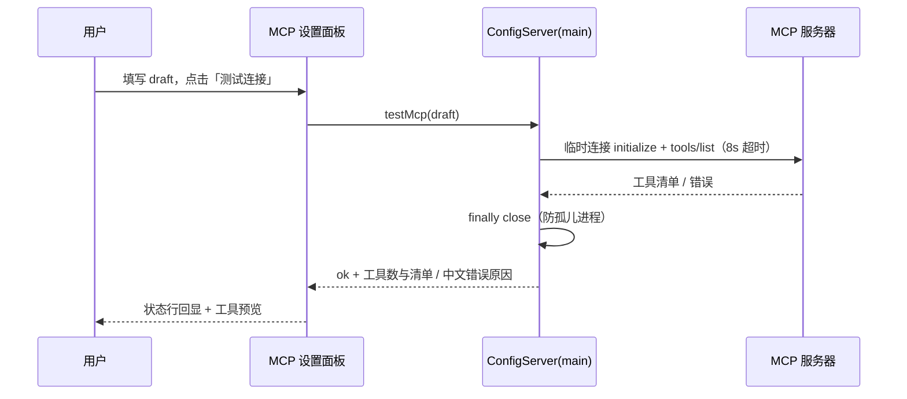
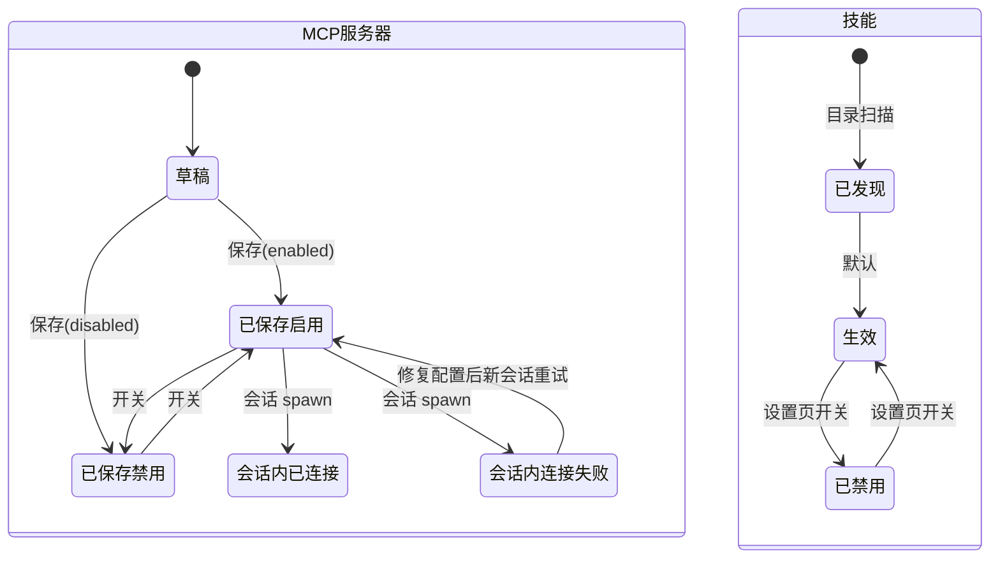

# MCP 与 Skills 接入 PRD —— v0.1

> 状态：✅ 已定稿（M1–M5 已实施落地，见 §10；v0.1 评审时审批策略确认：MCP 默认过审、trusted 免审）
> 关联：整体产品 PRD [`产品总览.md`](./产品总览.md)；技术设计 `docs/architecture.md` §2.1；对标参考 `docs/reference/claude-code/tools/MCPTool.md`、`DiscoverSkillsTool.md`
> 对应 README 路线图「当前完成」中的 **Skills 技能系统 / MCP 工具接入** 两条

---

## 1. 背景与目标

- **要解决的问题（痛点 / 现状）**：
  - 工具面封闭：core 的 7 组内置工具（`NOVEL_TOOL_GROUP_CATALOG`）装配期写死，AI 无法接入外部能力（资料查证、网络检索、自定义素材服务），扩展只能改代码发版；
  - 知识无法按需装载：写作技法、流派规范、题材指南这类提示词知识，目前只能内嵌在 system prompt 段里，用户不能自己增删；
  - 生态红利吃不到：MCP 已是工具接入的事实标准（大量现成服务器），Agent Skills 已成为开放标准（agentskills.io，2025-12 发布）且有 skills.sh 分发生态，两者都在重复造轮子之外。
- **目标（一句话，可验收）**：用户在设置页添加 MCP 服务器后，**下次会话**起 AI 即可调用其工具（外部工具默认进审批清单）；用户将符合开放标准的技能目录放入指定位置后，AI 可通过 `skill` 元工具按需读取技能正文，且设置页可见**当前生效技能清单**并可启停。

## 2. 用户故事

- 作为作者，我希望在设置页添加一个 MCP 服务器（如资料查询、地图生成），以便 AI 创作时调用外部工具查证、生成素材；
- 作为作者，我希望外部工具的调用默认进入审批清单，以便逐轮批量确认后才真正执行；
- 作为作者，我希望标记某台服务器为「信任」，以便琐碎的调用不必逐轮审批；
- 作为作者，我希望测试 MCP 连接时能看到该服务器提供了哪些工具，以便确认配置是否正确、值不值得启用；
- 作为作者，我希望安装一个「悬疑伏笔写作技法」技能包（`npx skills add` 或手动放目录），以便 AI 写对应题材时遵循其中的方法论；
- 作为作者，我希望在设置页看到当前生效的技能清单（含来源、路径、启停开关），以便管理 AI 实际装载了哪些知识。

## 3. 流程图（必填）

### 3.1 主流程：配置 → 生效



### 3.2 多主体交互：MCP 调用与审批



### 3.3 多主体交互：测试连接（配置期，main 进程）



### 3.4 状态流转



## 4. 功能明细

### F1 设置页 · MCP 服务器管理

- **触发**：设置 → MCP 服务器（SettingsDialog 新分节，与「模型」分节同构）。
- **输入**：服务器配置——名称；类型 `stdio`（command / args / env）或 `http`（url / headers）；enabled；trusted。
- **处理**：draft 表单 → 校验 → `mcp.upsert` 持久化；列表卡片支持编辑、删除（`mcp.remove`）、enabled / trusted 开关。面板结构与 `PersistentModelConnectionSettingsPanel`（profile 卡片 + draft 表单）对齐。
- **输出**：写入 `<userData>/config.json`；保存后提示「配置将于下次会话生效」。
- **异常**：表单校验失败就地提示；RPC 失败按现有配置服务错误态展示。

### F2 MCP 测试连接

- **触发**：draft 表单「测试连接」按钮（无需先保存）。
- **输入**：draft 配置全文。
- **处理**：`ConfigApi.testMcp` 在 **Electron main** 建临时连接：initialize + `tools/list`，8 秒超时（AbortController，对齐 `connectionTest.ts` 模式），finally close。
- **输出**：成功 → `{ok, toolCount, tools: [{name, description}]}`，面板回显工具数并预览工具清单；失败 → 中文原因（超时 / 命令不存在 / 握手失败分 mapping）。
- **异常**：超时返回超时文案；stdio 命令不存在提示检查 PATH。

### F3 会话启动时 MCP 装配

- **触发**：conversation 子进程 spawn（含恢复会话）。
- **输入**：env 中的 `NOVEL_MCP_SERVERS`（JSON，仅 enabled 项）。
- **处理**：`McpConnectionManager` 逐台 `connect` + `listTools` → `wrapMcpTool`（见 §8.2）→ 追加进 `MapToolDispatcher` 与 toolSchemes（对齐 subagent 三工具组的装配期追加模式）；会话退出时统一 `close()` 防 stdio 孤儿。
- **输出**：该会话可用的 MCP 工具集，命名 `mcp__<server>__<tool>`。
- **异常**：**单台连接失败只记录并跳过，不阻断会话**；以会话内系统提示告知哪台失败。

### F4 MCP 工具调用与审批（已确认决策）

- **触发**：模型发起 `mcp__*` 工具调用。
- **输入**：工具参数（JSON）。
- **处理**：`requireApproval = !trusted`——**默认全量过审**（复用 `gateBatch` 按轮批量的三档审批 UI，一轮多次调用一次批准）；trusted 服务器免审。执行走 `tools/call`，content blocks 序列化：text 块拼接、非文本块 JSON 化；`isError: true` 与协议层 throw 都归一为保留原文的 `ToolError`（模型可据此重试）。
- **输出**：文本工具结果进对话。
- **异常**：调用失败原文返回；连接中断后该服务器工具持续报错直至会话结束（新会话重连）。

### F5 技能装载

- **触发**：会话启动（与 F3 同期）。
- **输入**：两级 skills 目录——应用级 `<userData>/skills/`、项目级 `<工作台>/skills/`（目录结构遵循开放标准：`skills/<name>/SKILL.md`，含 YAML frontmatter）；config 中的禁用名单。
- **处理**：`SkillRegistry` 扫描 + 解析 frontmatter（`yaml`）+ 校验（name ≤64 字符、`/^[a-z0-9-]+$/`、description 必填）；**生效 = 已发现且未禁用**；`skills.index` 动态提示段每次 provider call 渲染「name — description」单行清单 + 使用指引（正文不进 prompt，渐进式披露）。
- **输出**：system prompt 中的技能索引段 + `skill` 元工具就位。
- **异常**：单个技能解析失败跳过并记录日志；目录不存在视为空集。

### F6 skill 元工具

- **触发**：模型调用 `skill` 工具（新工具组 `runtime.skills`）。
- **输入**：`{ name: string }`。
- **处理**：读取对应 `SKILL.md` 正文（剥离 frontmatter）作为工具结果返回；`requireApproval: false`（纯本地只读，与 runtime.files 同档）。
- **输出**：技能全文以普通 tool result 进入对话（无需特殊注入通道）。
- **异常**：名字不存在返回明确错误；文件读取失败返回错误原文。

### F7 设置页 · 技能面板（当前生效展示）

- **触发**：设置 → 技能（SettingsDialog 新分节）。
- **输入**：`ConfigApi.skills.list`（main 进程实时扫描两级目录，合并禁用名单）。
- **处理**：按来源分组（应用级 / 项目级）展示 name、description、磁盘路径；每行启用开关（`skills.setDisabled`）；**生效技能置前并标注，禁用置灰**。
- **输出**：当前生效技能的可视化清单。
- **异常**：RPC 失败显示错误态与重试；空态提示两个目录位置及 `npx skills add owner/repo` 安装方式（skills.sh 生态兼容）。

## 5. 边界与非目标

- **明确不做**（本期）：
  - 会话内热更新：配置变更下次会话 / 恢复会话生效，不做 ToolPool 运行时动态刷新；
  - MCP 的 resources / prompts / sampling 能力面：只接 tools；
  - MCP OAuth 交互流程：v1 仅静态 headers / env；
  - 技能捆绑脚本的执行：现有工具组无 exec 通道，v1 为纯文本技能（天然安全边界）；
  - 每技能一个 ToolDef、技能级独立审批：统一走 `skill` 元工具 + 免审只读；
  - MCP 凭据加密：headers / env 随 config.json 存储（现有 credential cipher 本为明文直通，接 CredentialStore 留后续）；
  - subagent（Explorer / Compose / Analyst）的 MCP / 技能面覆盖：v1 仅主 agent；
  - 内置技能包 / 技能市场 / 技能检索（TF-IDF 类）：技能量不大，清单直出。

## 6. 验收标准

- [ ] 设置页可增删改 MCP 服务器并持久化，应用重启后配置保留；
- [ ] 「测试连接」成功返回工具数与工具清单预览；失败给出中文原因；8 秒超时生效；
- [ ] 新会话中模型可调用已启用服务器的工具，工具名形如 `mcp__<server>__<tool>`，参数 schema 正确传递；
- [ ] 非信任服务器的工具调用进入审批清单，逐轮批量批准后才执行；trusted 服务器免审直通；
- [ ] 单台 MCP 服务器连接失败不影响会话启动，会话内有失败告知；
- [ ] 会话退出后无 MCP stdio 孤儿进程残留；
- [ ] 标准技能包放入任一 skills 目录后，设置页技能面板可见且默认生效；
- [ ] 会话中模型可通过 `skill` 工具读取技能正文；system prompt 中技能索引仅含 name + description；
- [ ] 禁用开关保存后，下次会话的技能索引不再包含该技能；
- [ ] `npx skills add` 安装的第三方技能可被识别（目录结构兼容开放标准）；
- [ ] core 单测覆盖：SKILL.md 解析与校验、生效过滤、包装命名与截断、content 序列化、错误归一、免审 / 过审判定、连接失败跳过（InMemory transport 对造 fixture）；
- [ ] Windows 本地实测 stdio 服务器（`npx` 类命令）可正常 spawn；CI（含 ubuntu）全绿。

## 7. 开放问题

- MCP 工具在审批清单中的 preview 投影（显示调用参数摘要）v1 是否定制，还是沿用默认渲染？
- 项目级 skills 目录落在工作台根目录还是 storeDir 旁？—— 倾向工作台根目录 `<工作台>/skills/`（用户可见、CLI 可直接操作）；
- env 注入体积：Windows 进程 env 块约 32KB 上限，MCP 配置多时是否改为 per-conversation RPC 拉取？
- 技能是否需要 per-agent 差异化（如 Explorer 只读技能集）？留 v2。

## 8. 技术设计要点

### 8.1 配置模型（`core/src/config/contract.ts`）

```ts
interface McpServerConfig {
  id: string;
  name: string;                    // 展示名；sanitize 后作工具前缀
  transport:
    | { type: "stdio"; command: string; args: string[]; env?: Record<string, string> }
    | { type: "http"; url: string; headers?: Record<string, string> };
  enabled: boolean;
  trusted: boolean;                // 信任 → 工具调用免审批
}
// ConfigSnapshot 增加 mcpServers?: McpServerConfig[]、skillsDisabled?: string[]
// ConfigMutation 增加 op：mcp.upsert / mcp.remove / skills.setDisabled
// ConfigApi 增加方法：testMcp(input)、skills.list()
```

按现有五层走：contract → `InMemoryConfigStore` / `NodeApplicationConfigStore`（PersistedConfig 加字段 + mutate case）→ 校验（对齐 `validateRuntimeSettings` 范本）→ ConfigServer expose → UI `ApplicationConfigurationClient` 接口扩展 + `minimal-renderer.tsx` 装配。

### 8.2 运行时模块

- `core/src/runtime/mcp/McpConnectionManager.ts`：connect / listTools / close 全生命周期；包装函数 `wrapMcpTool(server, tool, client): ToolDef`：
  - name：`mcp__<sanitized>__<tool.name>`，sanitize 到 `[a-z0-9-]`，总长超 64 字符截断 + 短 hash 后缀（OpenAI 函数名上限）；
  - parameters：`tool.inputSchema` 直接映射 `ToolScheme.parameters`（同为 JSON Schema，零转换）；
  - description：截断至 1024 字符（对齐 `docs/reference/claude-code/tools/MCPTool.md` 记录的行为）；
  - `requireApproval: !trusted`。
- `core/src/runtime/skill/SkillRegistry.ts`：扫描、解析、校验、生效过滤；`createSkillTool(registry): ToolDef`（`runtime.skills` 组）；`skills.index` DynamicPromptSection 注册进 PromptSectionRegistry，recipe 挂 `tool.guidance` 之后。
- 依赖新增：`@modelcontextprotocol/client`（v2 scoped 包，stdio / streamableHttp 传输）、`yaml`（frontmatter 解析）；devDep `@modelcontextprotocol/server`（测试用 InMemory transport 对）。

### 8.3 进程与生效链路

- 配置下发沿用 spawn 时 env 注入模式（对齐 `NOVEL_RUNTIME_SETTINGS`）：新增 `NOVEL_MCP_SERVERS`（JSON，仅 enabled 项）与 `NOVEL_SKILLS_DISABLED`；conversation 子进程（`runDesktopRuntimeChildEntrypoint.ts`）装配 `buildNovelAgent` 后解析并追加工具。
- 测试连接与 skills 目录扫描在 **Electron main**（完整 Node 环境）；MCP 长连接与工具执行在 **conversation 子进程**（ToolDispatcher 所在，stdio 子进程由此 spawn）。
- UI 面板：`ui/src/settings/McpSettingsPanel.tsx`、`SkillsSettingsPanel.tsx`，SettingsDialog 硬编码 switch 加两节（桌面端未消费 settingsSections 扩展点，走路线 A）。

## 9. 实施步骤

| 步骤 | 内容 | 主要落点 |
| --- | --- | --- |
| M1 | core-skills：SkillRegistry + skill 元工具 + skills.index 段 + skills.setDisabled | `core/src/runtime/skill/`、config 五层 |
| M2 | ui-skills：设置 → 技能面板（生效展示 + 开关） | `ui/src/settings/` |
| M3 | core-mcp：配置域 + testMcp + ConnectionManager + wrapMcpTool + 装配注入 | `core/src/runtime/mcp/`、config 五层、main 装配 |
| M4 | ui-mcp：设置 → MCP 面板（CRUD + 测试连接 + 启停 / trusted） | `ui/src/settings/` |
| M5 | 收尾：architecture.md 补 MCP 子进程拓扑；README 路线图状态更新；Windows stdio 实测 | `docs/` |

每步一个 commit，core 侧先于 UI 侧（skills 先行验证「提示段 + 元工具」链路，MCP 复用同一装配缝）。

## 10. 实施落地记录（v0.1 定稿后补）

M1–M5 全部落地，与原稿的三处实施性偏差（功能语义不变）：

1. **技能索引注入通道**：原稿 §8.2 的「`skills.index` 独立动态段」实现为 `skill` 工具的 `promptDetail.guidance`——由既有 `tool.guidance` 动态段每 provider call 渲染，效果等价（索引仅含 name + description、空清单省略），省去 DynamicPromptSectionInput 的新增注入缝。
2. **MCP 连接时序约束**：子进程须在向 manager register 报到前完成 MCP 连接（spawner 报到超时 15s 自 spawn 起算），故连接为**并行**执行且单台超时压至 8s；超时服务器记失败缺席，不阻断会话。
3. **stdio 孤儿清理**：dev/独立脚本路径 stdin end 时显式 `close()` 后退出；托管路径（CMS kill 子进程）依赖 MCP stdio 规范的服务器自杀契约（stdin EOF 退出）。Windows `npx.cmd` 解析由 SDK 内置 cross-spawn 原生覆盖（本机实测 spawn+握手+调用 558ms）。

其余按原稿落地：审批默认（非 trusted 全量过审走 gateBatch）、`extraTools` 组外追加、`NOVEL_SKILLS_SETTINGS` / `NOVEL_MCP_SERVERS` env 下发、设置页「技能」「MCP 服务器」两分节。§7 开放问题保持开放（preview 投影 / env 体积 / per-agent 技能集留 v2；项目级 skills 目录已定为工作台根 `<工作台>/skills/`）。
