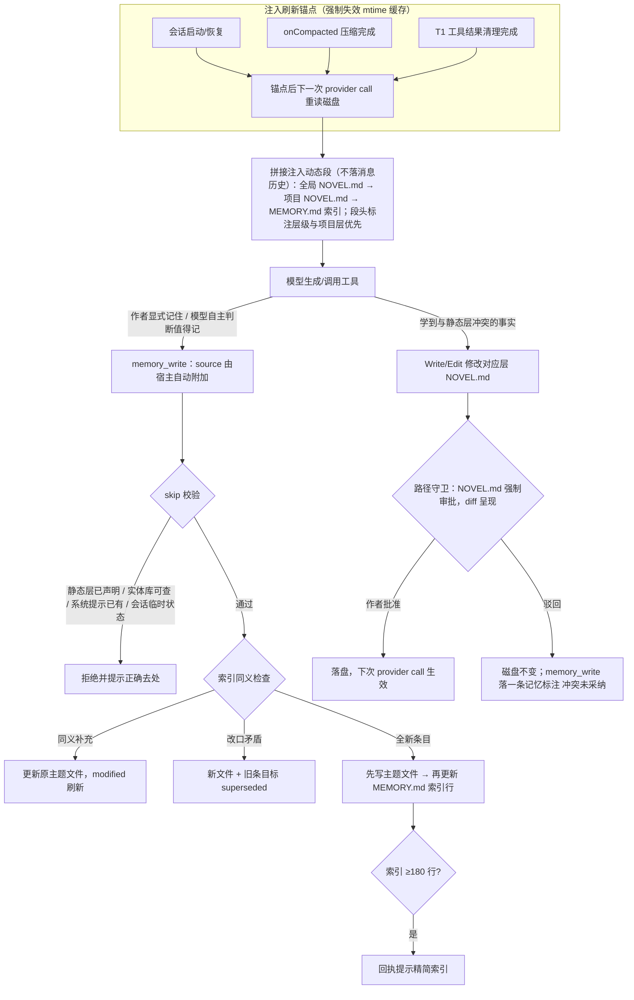
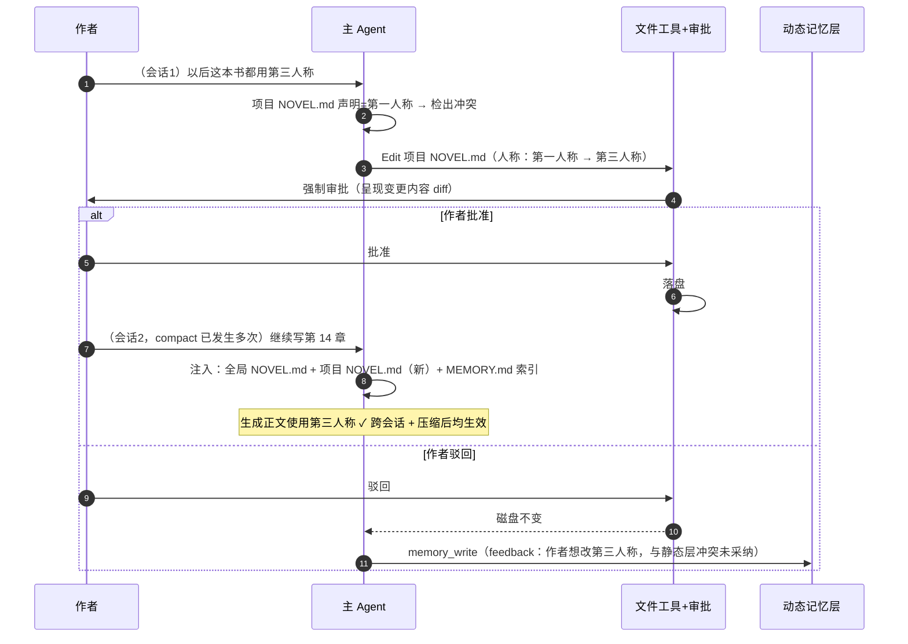
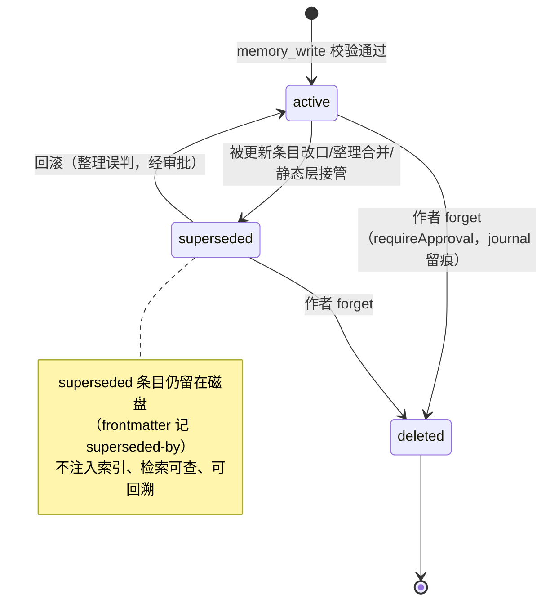

# memory-两层记忆 PRD —— 静态声明层（分层 NOVEL.md）+ 动态学习层（memory/）

> 状态：✅ 已定稿（v1.0，2026-08-29）
> 关联：整体产品 PRD [`产品总览.md`](./产品总览.md)；[`context-compact.md`](./context-compact.md)（compact 事件源）；[`eval-harness.md`](./eval-harness.md) / [`evals-书库真实评测.md`](./evals-书库真实评测.md)（评测接入）；[`approval-persistence.md`](./approval-persistence.md)（审批队列现状）；[`project-stage-nudge.md`](./project-stage-nudge.md)（nudge 先例）
> 参考系：Claude Code（已核实，源=官方 memory 文档 + 仓库 vendor 笔记 `docs/reference/claude-code/memory-prompt.md`、`tools/LocalMemoryRecallTool.md`）：CLAUDE.md 分层拼接（enterprise→user→project→local→子目录按需）、**软优先级**（冲突时 "Claude may pick one arbitrarily"，无硬消解器）、单文件建议 ≤200 行 / 引擎 4 MiB 超限**整体跳过**；auto-memory 为 MEMORY.md 索引（前 200 行 / 25KB 注入）+ 主题文件按需 standard file tools 读取、四类 type（user/feedback/project/reference）、skip 规则**「作者显式要求保存也适用」**、保鲜提醒（point-in-time）；**无 embedding / 向量 / RAG**；另有 KAIROS 实验模式（append-only 日志 + 夜间蒸馏）与 LocalMemoryRecall 只读笔记工具（2KB 预览 / 50KB 全文授权）。本 PRD 与 CC 同构处均已对齐，偏差处见 §8 决策记录。

---

## 1. 背景与目标

- **要解决的问题**：
  1. 会话即失忆：作者在会话 A 里纠正过的偏好（"不要 BE""人称改第三人称""克制形容词密度"），会话 B 全部忘掉，重复纠错体验极差；
  2. 静态层边界模糊且单层：现状 NOVEL.md 的内容清单（`core/src/runtime/prompt/sections/novel.ts:277`）把「世界观、字数」这类**不可协商硬约束**和「作者偏好」这类**学出来的演化内容**混在一层——前者必须每次生成都常驻在场，后者应由模型跨会话积累，混放导致静态层膨胀且模型无权维护其中的偏好部分；同时单层文件让**作者跨书通用偏好无处安放**（每本书重复声明一遍）；
  3. 有损事件的不确定性：compact（T2 摘要 / T3 丢弃）与工具结果清理（T1 骨架化）发生后——journal 也会被压缩全量重写——作者无法确信全局约束和关键记忆仍然在场。
- **现状锚点**（实施落点，均为现有代码，行号已核实）：
  - `core/src/runtime/prompt/PromptSection.ts:5,76-80`——NOVEL.md 动态段机制：`NovelConstraintsProvider` 每 provider call 前由 node 层 fs 读取注入，正本在磁盘、不落消息历史；`core/src/runtime/loop/LoopContext.ts:228`（toProviderCall 组装时调用）。注意：读取上限 256 KiB 的现状是**超限整体拒绝**（`core/src/node/workspace/readNovelGlobalConstraints.ts:16,34-37` 返回 undefined 渲染占位），不是截断——与 CC 4 MiB 超限跳过同语义（fail-loud），本 PRD 维持；
  - `core/src/runtime/prompt/sections/novel.ts:249-286`——`novelGlobalConstraintsSection` 渲染段与内容边界文案（:277，本 PRD 修订该边界）；
  - `core/src/runtime/compact/definitions/auto-compact.ts:144-159`——T1 骨架化（`auto-compact-t1.ts`，阈值 0.7·window）→ T2 逐段摘要（`auto-compact-t2.ts`）→ T3 硬丢弃（`auto-compact-t3.ts`）编排壳；`onCompacted` 事件是 LoopContext 监听器（`core/src/runtime/loop/types.ts:203`，触发于 `LoopContext.ts:192/:220`，载荷 `RunContext[]`）；
  - `core/src/runtime/nudge/ContextNudgePolicy.ts:6-29`——nudge 双通道：persistent（appendRunMessages 落 journal，先例 external-tools）与 transient（每 provider call 原地注入不落历史，先例 compose sparse 提醒）；压缩纪元 = `LoopContext.compactionGeneration`（`LoopContext.ts:276-278`）；
  - `core/src/runtime/tool/`——ToolDef schema/handler 分离（`ToolDef.ts:14-35`）、ToolGroupManifest 目录 + 工厂 resolver（`ToolGroupManifest.ts:36-87`、`groups/NovelToolGroups.ts`）、AgentToolPolicy 白名单（`AgentDefinition.ts:36-59`）；DeferredToolRegistry 词法打分先例（`deferred/DeferredToolRegistry.ts:46-57`：名称精确 3 > 名称包含 2 > 描述包含 1、同分按名字典序、maxResults 截断）；
  - `core/src/conversation/persistence/FileConversationJournalService.ts`——journal 事件溯源（run 级快照 + append 行协议，`<storeDir>/conversations/<conversationId>/journal.jsonl`）；run 序号 = `LoopContext.ts:147-148`（会话内单调递增）；审批 requestId 已用 `<会话id>:<run序号>` 同粒度（`AgentLoop.ts:605`）；注意子代理 run 不落 journal（`NovelSubagent.ts:2-4` live-only）；
  - `core/src/conversation/server/WaitRequestQueue.ts:31-48,79`——审批队列：**纯内存**（跨重启不持久化，approval-persistence PRD 未实施）、条目形状绑定 `toolCalls`——这是 §8 D3 采纳「文件工具审批」路线而非专用提案通道的直接依据；
  - `core/src/runtime/agent/definitions/`——main（NovelAgentDefinition）、Explore（只读探索）、Compose（起草）三型；子代理装配 `NovelSubagent.ts:55-80`；
  - `evals/src/snapshot.test.ts:90`——工具面数量锁（现 13）与 prompt 金样：新增 memory 工具组是**预期金样更新动作**。
- **两层模型定义**（实体库**不是**记忆层——它是领域事实存储，本 PRD 不动它）：
  - **静态声明层 = 分层 NOVEL.md（CC 式）**：全局层 `<GUI 用户数据目录>/NOVEL.md`（作者跨书约束）+ 项目层 `<workspaceRoot>/NOVEL.md`（本书约束，即现状文件）；人拥有写入权（模型可经文件工具提案、强制审批后落盘）；全局约束与不可协商事实的唯一声明处；常驻注入；compact/clear 后**必须**刷新注入；
  - **动态学习层 = memory/**：模型拥有写入权（受校验约束）；跨会话学到的、别处查不到的内容；索引常驻、详情按需。
- **优先级模型（软优先级，对齐 CC）**：注入时两层**拼接、从广到窄**（全局层在前、项目层在后），段头标注层级与「项目层覆盖全局层」；冲突时靠注入顺序与标注引导模型采信更特定层，**不做硬冲突消解器**（CC 原话："Claude may pick one arbitrarily"，要硬 enforcement 得上 hooks——本 PRD 非目标）。总排序：项目层 > 全局层 > 动态记忆 > 模型自由裁量；记忆与当前现实冲突时**信当下**（信任边界见 4.5）。
- **"静态层在 compact 和 clear 后更新"的准确语义**（两层含义，缺一不可）：
  1. **注入刷新**：compact 完成、T1 清理完成、会话启动/恢复三个锚点后，静态层与动态索引必须强制重读磁盘重注入（实现可做 mtime 缓存，但锚点必须失效缓存）；
  2. **内容更新**：静态层内容只经「作者手改」或「模型文件编辑 + 强制审批」变更，任何路径不得静默改写 NOVEL.md。
- **目标（一句话，可验收）**：任意会话中作者声明过的偏好跨会话生效；字数/人称/禁忌/世界观铁律在任何有损事件（compact/T1 清理/崩溃重启）之后仍在每次 provider call 的注入里；记忆机制的全部质量指标接入现有 eval harness 与基线红线门禁。

## 2. 用户故事

- 作为作者，我希望说过的偏好和纠正（含"对，就是这个感觉"式的肯定）在下次打开项目后仍被遵守，以便不用重复教 AI。
- 作为作者，我希望我在所有书里通用的口味（不要 BE、克制形容词）写在全局层一次声明全部生效，以便不必每本书抄一遍。
- 作为作者，我希望改口之后系统用新规则（旧的自动作废但可追溯），以便设定演化不产生混乱。
- 作为作者，我希望字数、人称、禁忌这类全局约束永远不会因为"对话太长被压缩"而丢失，以便每次生成都合规范。
- 作为作者，我希望 AI 学到的关于我的记忆可查看、可删除，它对 NOVEL.md 的修改必须经我批准（看到改了什么），以便隐私和最终解释权在我。
- 作为开发者，我希望注入保证与记忆质量有可回归的工程测试和评测门禁，以便改动不悄悄劣化。

## 3. 流程图（必填）

### 3.1 主流程：分层注入刷新 + 写入治理



### 3.2 多主体交互：改口场景的完整时序（静态层冲突走文件审批）



### 3.3 compact 触发的确定性提取整理 pass

```mermaid
sequenceDiagram
    autonumber
    participant Loop as AgentLoop/LoopContext
    participant Sub as 提取整理子代理（ephemeral）
    participant Mem as memory/
    participant Cpt as 压缩管线 T1/T2/T3
    Loop->>Loop: compact 判定通过（阈值触发）
    Loop->>Sub: 派生提取整理 pass：输入=待压缩完整 runs+当前索引<br/>工具面=memory_write/memory_search/Read/实体只读
    Sub->>Sub: 提取值得跨会话保留的内容（原文销毁前最后窗口）
    Sub->>Mem: memory_write（过同一四道校验）+ 同义合并 + supersede 过时条目
    Sub-->>Loop: 完成（0~n 次写入 + 待处理冲突清单）
    Loop->>Cpt: 执行 T1 骨架化 → T2 摘要 → T3 丢弃
    Note over Loop,Cpt: 超时（预设上限）→ 直接放行压缩，绝不阻塞
    Note over Sub: NOVEL.md 相关发现不落盘不阻塞——记为待处理冲突，下轮交互提示作者走文件审批
```

### 3.4 状态流转：记忆条目生命周期



## 4. 功能明细

每个功能点写清：触发条件 / 输入 / 处理逻辑 / 输出 / 异常与回退。

### 4.1 静态层分层（两层 NOVEL.md + 内容边界修订）

- 触发：本 PRD 实施（一次性落地 + 存量即项目层）。
- 输入：现有项目 NOVEL.md（`core/src/node/workspace/readNovelGlobalConstraints.ts` 读取的那份）与 `novel.ts:277` 内容边界文案。
- 处理：
  - **两层文件**：全局层 `<GUI 用户数据目录>/NOVEL.md` + 项目层 `<workspaceRoot>/NOVEL.md`，同名文件、互不嵌套；单一读取入口扩展为按序读两份；
  - **内容边界按层修订**（:277 文案同步改写）——全局层只收：作者跨书约束与偏好（文风基准、普适禁忌如"不要 BE"、跨书一致的人称/时态偏好、平台/频道约束、作者与 AI 协作方式约定）；项目层只收：全局硬约束（单章字数区间、更新节奏）、本书人称/时态、世界观铁律（不变式，建议 ≤10 条）、本书基调与文风、禁忌清单；**两层共同排除**——对话与任务过程、实体展开细节（实体库管）、学出来的偏好与反馈（动态层管，文案中指向 memory/）；
  - **存量迁移**：现有 NOVEL.md 即项目层，原样保留不动；全局层缺省不存在 → 注入空占位引导创建；**不自动迁移**任何内容。
- 输出：分层读取与拼接注入（见 4.2）；修订后的渲染段文案；两层 NOVEL.md 建议模板（全局层：跨书约束 / 协作约定；项目层：全局硬约束 / 世界观铁律 / 基调文风 / 禁忌）。
- 异常：任一层缺失 → 只注入另一层 + 缺失层占位提示；NOVEL.md 缺失维持现状占位（引导创建）；**每层建议 ≤100 行**（两层合计对齐 CC 单文件 200 行 guideline），超 256 KiB **整体拒绝渲染占位**（维持现状 fail-loud，对齐 CC 4 MiB skip 语义；不引入截断、不引入 @import）。

### 4.2 注入刷新锚点（静态两层 + 动态索引共用）

- 触发：① 会话启动/崩溃恢复；② `onCompacted`（T2/T3 执行后）；③ T1 工具结果清理执行后。
- 输入：磁盘上全局 NOVEL.md、项目 NOVEL.md、memory/MEMORY.md。
- 处理：锚点事件强制失效 mtime 缓存 → 下一次 provider call 组装时重读磁盘渲染动态段；非锚点的每次 provider call 允许 mtime 缓存（磁盘未变则复用快照，降低 IO）。动态段不落消息历史，compact 不物理破坏它——锚点保证的是"磁盘变更后窗口内副本必然新鲜"。注入拼接顺序：**全局层在前、项目层在后、索引殿后**，段头标注「项目层覆盖全局层；两静态层优先于动态记忆」。
- 输出：provider call 组装结果中含完整全局层段、项目层段与索引段（含优先级标注）。
- 异常：任一文件读失败 → 该层渲染占位段（"记忆层暂不可用"）+ 不阻断生成；memory/ 目录不存在 → 索引段渲染空占位；单层超限拒绝不影响另一层注入。

### 4.3 动态层存储与索引（怎么分片）

- 触发：随 4.2 注入；随 4.5 写入更新。
- **分片单位**：一条**可独立引用、独立作废、独立描述**的规则/事实 = 一个主题文件 `memory/<name>.md`；name 为 kebab-case 主题名（如 `pov-preference`、`cliches-taboo`；**禁止**场景化命名如 `chapter14-talk`、大杂烩如 `misc`）；单文件正文建议 ≤50 行，超限写入仍成功但回执提示拆分。
- **主题文件结构**：frontmatter 必填字段 + 正文三段式（对齐 CC feedback 结构）：
  ```yaml
  name: cliches-taboo        # 唯一标识，kebab-case
  type: author | feedback | project | reference
  description: 一句话        # 同时是检索锚点
  created: 2026-08-29T10:00:00+08:00
  modified: 2026-08-29T10:00:00+08:00
  source: conv_42#5          # 宿主自动附加（见 4.5），指回 journal 的会话与轮次
  status: active | superseded
  superseded-by: <name>      # status=superseded 时必填
  ```
  正文：`## 规则/事实` → `## Why`（为什么成立，判断适用边界用）→ `## How to apply`。
- **四类 type 语义与入层标准**（写入指引随工具 promptDetail 注入）：**author** 作者画像（水平/口味/阅读背景，"作者熟网文快节奏"）；**feedback** 改稿反馈——**纠正与肯定都要记**（只记纠正会使模型过度保守；"打斗要短句"/"12 章节奏很好，保持"）；**project** 本项目决策与坑——限定"实体库与 journal 查不到的"，相对日期必须转绝对日期（"主角 14 章起定名'林晚'非'林婉'"）；**reference** 外部资源指针（只存"去哪找"，不存内容）。
- **演化规则**：补充/细化（与旧内容兼容）→ 更新原主题文件、modified 刷新、索引行不动；改口/矛盾（人称第一→第三）→ 新开文件 + 旧文件 `status: superseded` + `superseded-by` 指向新文件——旧文件留盘可追溯、**不进索引、不注入**，仅 memory_search 可查。
- **MEMORY.md 索引**：无 frontmatter、无正文，一行一条 `- name — description（type）`（一行 ≤150 字符，对齐 CC）；**排序确定化**：按 type 固定分组（author→feedback→project→reference）、组内 name 字典序——保证「以主题文件重建索引」结果稳定。注入预算：**前 200 行或 25 KiB**（对齐 CC）；≥180 行触发精简提示；超预算注入截断（磁盘文件完整保留）；写入使索引超 200 行 → 写入成功但回执报错要求精简（对齐 CC 行为）。
- 处理：索引与主题文件均随项目目录存储（本地优先，可 git、可拷贝导出）；启动时一致性校验，索引与主题文件不一致（写入中断）→ 以主题文件为准重建索引。
- 异常：见 4.2 占位逻辑；重建失败的条目（frontmatter 损坏）跳过并在校验报告中列出。

### 4.4 静态 vs 动态路由（哪些写静态、哪些写动态）

- 触发：模型每次准备写入记忆/修改静态层前的判定；写入校验（4.5）与 promptDetail 指引共用本表。
- 处理（按序判定，先命中先路由）：

| 序 | 内容特征 | 去处 | 进入方式 |
|---|---|---|---|
| ① | 作者明说的**跨书**规矩/口味（"所有书都不要 BE"） | 全局 NOVEL.md | 模型文件编辑（强制审批）或作者手改 |
| ② | **本书**硬约束/世界观铁律/禁忌/字数/人称/文风 | 项目 NOVEL.md | 同上 |
| ③ | 从交互**学出来的**偏好/反馈/画像/项目经验，且两层 NOVEL.md、实体库、系统提示均无 | memory/ 主题文件 | memory_write 工具 |
| ④ | 角色/剧情/大纲/设定等**实体事实** | 实体库（NovelEntity 工具） | 不进任何记忆层 |
| ⑤ | 会话内临时状态（当前写哪章、刚讨论的草稿） | 不落层 | journal 已有 |

- **skip 规则** = ①②④⑤ 的逆否（memory_write 拒写条件）：两层 NOVEL.md 任一层已声明 / 实体库可查 / 系统提示已有 / 会话内临时状态 → 拒绝并提示正确去处；**含 CC 条款「作者显式要求保存也适用」**——作者说"记住这个角色表"也拒绝，引导走实体库。语义级判定（实体库可查、是否已声明）主要靠 promptDetail 指引与 evals skip 生效率兜底，工具侧做机械可判部分（两层 NOVEL.md 文本词法重叠检测）。
- 输出：路由结论（进入哪层 / 拒绝理由）。
- 异常：跨类内容（既是偏好又像设定）→ 拆分路由；模型拿不准 → 回复中问作者。

### 4.5 memory 工具集（新 ToolGroup：`runtime.memory`，schema/handler 分离，按 AgentToolPolicy 装配）

- **memory_write**：触发=作者显式"记住…" / 提取整理 pass（4.6）/ 模型自主判断。输入=name/type/description/content（**不含 source**——由工具宿主自动附加当前 `<会话id>#<run序号>`，模型不可伪造不可手填；子代理调用时附加其父会话与当前 run，见已知边界 §8 D7）。处理=四道校验：① source 宿主注入（默认成立）；② skip 校验（4.4：机械词法重叠 + promptDetail 语义指引）；③ 索引同义检查——name 相同或 description 高度重叠 → 更新原条目（modified 刷新），矛盾改口 → 旧条目标 superseded；④ 先写主题文件、成功后再更新索引行（顺序保证中断可恢复）。输出=写入结果 + 索引预算状态（行数/阈值）。requireApproval=false（memory/ 低风险、可 forget）。
- **memory_search**：输入=query, max_results（默认 5）。处理=V1 词法打分——**协议对齐 DeferredToolRegistry**（查询分词、名称精确 3 > 名称包含 2 > 描述包含 1 累加，同分按 name 字典序，maxResults 截断）；provider 接口预留 V2 向量混合检索位（本 PRD 不实现）。输出=排序条目列表（name + description + 文件路径）。
- **memory_forget**：输入=name, reason。requireApproval=true，走现审批流；物理删除主题文件与索引行，journal 留痕（审批决策与工具调用本身已入 run）。
- **详情读取不设专用工具**：主题文件是工作区 markdown，模型用现有 **Read** 工具按需直读 `memory/<name>.md`（CC 同款 "standard file tools"；Read 调用入 journal，可观测性不丢）。**读取指引（信任边界 + 保鲜）**：记忆只证明"写入时如此"，冲突信当下——记忆中引用的实体事实（如"主角第 3 章已死"）用于生成前必须回实体库核实；详情旁注条目 modified 时间，超过阈值（建议 14 天）附「point-in-time 记录，使用前核实现状」提醒（对齐 CC memoryAge 机制）。
- **注入面**：静态两层注入所有 agent（Explore/Compose 同样守字数与禁忌）；动态索引注入 main agent 与 Compose（author/feedback 类，§8 D8）；memory 工具只装配 main agent 与提取整理子代理（4.6），子代理一律不拥有 memory 写工具的唯一受控例外。
- 异常与回退（工具集通用）：校验失败结构化回传"错在哪、期望什么、正确去处"；磁盘异常不阻断主对话，降级为不可用提示。

### 4.6 compact 触发的确定性提取整理 pass

- 触发：compact 判定通过、T1 执行**之前**（每压缩纪元一次；原文销毁前最后窗口——T2/T3 之后 journal 亦被全量重写，错过不可恢复）。
- 输入：即将被压缩的完整 runs + 当前 MEMORY.md 索引。
- 处理：派生 housekeeping 子代理（Compose 式 ephemeral 先例）：工具面只给 memory_write/memory_search/Read/实体只读；职责=①提取值得跨会话保留的内容并写入（过 4.5 同一四道校验）；②同义条目合并；③长期未召回且过时的条目标 superseded。NOVEL.md 相关发现（与静态层冲突）**不落盘不阻塞**——输出「待处理冲突」清单，下一轮交互时提示作者（届时走 4.1/4.7 的文件审批）。
- 输出：0~n 次 memory 写入 + 待处理冲突清单（注入下轮上下文或 UI 提示）。
- 异常：超时（预设上限）→ 直接放行压缩，**压缩主线绝不被阻塞**；子代理失败 → 同超时处理，提取内容允许丢失（跨轮重复出现的内容仍可在正常会话中被记）。本机制**取代**草案的 auto-flush nudge（nudge 依赖模型自觉、可能零写入；且草案引用的 external-tools nudge 实为 persistent 通道先例，语义本就不符）。参考系佐证：CC KAIROS 实验模式（append-only 日志 + 夜间蒸馏）同方向。

### 4.7 治理：supersede / 冲突处理 / 整理

- **superseded 版本化**：改口或合并不删除旧条目——旧条目 `status: superseded` + `superseded-by` 指向新条目；不注入索引（active 才进索引）、检索可查、可回溯；回滚（整理误判）经审批恢复 active。
- **与静态层冲突**：写入校验或提取 pass 发现"记忆内容与 NOVEL.md 声明冲突" → **不静默改 NOVEL.md**：模型可直接发起对应层 NOVEL.md 的文件编辑（Write/Edit）——文件工具对两条确切路径（全局用户数据目录/NOVEL.md、workspaceRoot/NOVEL.md）**强制 requireApproval=true**，不受文件工具组免审批配置影响；现审批流呈现变更内容（复用 preview/按会话现读文件渲染详情的先例，如 ExitComposeApprovalView）；批准落盘（下次 provider call 生效）、驳回则磁盘不变 + 模型落一条记忆标注"冲突未采纳"。
- **整理（V1 手动触发，dreaming 简化版）**：作者手动触发；合并重复、将长期未召回且过时的条目标 superseded；整理产物以文件编辑形式呈现（memory/ 与 NOVEL.md 涉及的变更均过审批落盘）；失败降级为只读报告（不修改任何文件）。
- **子代理隔离**：见 4.5 注入面——静态两层全局生效；动态索引 main+Compose；写工具 main+提取 pass。

## 5. 边界与非目标

- **明确不做**：
  - 实体库改造——它不是记忆层，本 PRD 不动其模型与查询；
  - 向量检索 / RAG（V2 再议，V1 词法先行，接口已留 provider 位；CC 亦无 embedding）；
  - 硬冲突消解器（优先级是软的：拼接顺序 + 标注引导；CC 同款）；
  - NOVEL.md 截断注入（维持超限 fail-loud 拒绝）与 @import 机制；
  - 自动后台 dreaming 定时任务（V1 整理为手动触发；compact 提取 pass 是事件驱动非定时）；
  - 多用户与云端同步（本地优先，memory/ 随项目目录走）；
  - **动态层跨项目共享**（项目级隔离，防跨书污染；跨书通用约束经**全局静态层**承载——人写或经审批的文件编辑）；
  - 专用提案工具 / 审批队列扩形状（NOVEL.md 变更走文件工具审批，见 §8 D3）;
  - 记忆承担策略执行——记忆只负责"记得"，硬约束归静态层 + 审批 + 工具 requireApproval；
  - 模型静默改写 NOVEL.md 的任何路径。

## 6. 评测方案（接入 eval-harness 与基线红线门禁）

评测分四层 + 轨迹成本 + 长程，**每层用适合它的方法**；确定性指标优先，LLM 裁判只用于无法规则判定的项。现有红线口径不变：passRate 降幅 >10pp 或新增系统性 `TOOL_ARGUMENTS_INVALID` 判红（`evals/src/compare.ts:142,180-183`）。

### 6.1 静态层（约束遵守，确定性为主）
- **字数合规率**：生成章节字数落在项目层 NOVEL.md 声明区间的比例——纯字数统计，零裁判，**每章生成即自动测**（生成侧钩子）；
- **人称/时态合规**：代词与时间词规则统计 + 抽样 LLM 裁判混合；
- **禁忌违反率 / 世界观铁律冲突**：每条禁忌/铁律一个 checklist 探针（对生成文本做违例扫描 + 定向问题探测）；
- **注入回归（工程单测，分层版 golden）**：compact 后 / T1 清理后 / 崩溃恢复后，断言 provider call 组装结果仍含**全局层段、项目层段、索引段**且拼接顺序与优先级标注正确；单层缺失只注另一层 + 占位；
- **预算行为**：索引 >200 行 → 截断 + 精简提示（单测）；NOVEL.md 单层 >256 KiB → 整体拒绝 + 占位（单测）。

### 6.2 动态层写入质量
- **grounded 率**：source 指向的会话轮次在 journal 中存在（自动校验，100% 覆盖；source 宿主自动附加保证可回溯）；语义支撑抽检（LLM 裁判：原文是否真的支持该条记忆）；
- **skip 生效率**：两层 NOVEL.md 已声明内容被误写入动态层的比例（应≈0，golden 会话剧本埋点；**含「作者显式要求保存也拒绝」剧本**）；
- **应记 recall**：golden 剧本人工标注"应记清单"，统计写入覆盖率；
- **重复率与更新率**：同义新建（应更新而新建）比例；索引行数增长曲线。

### 6.3 动态层读取与治理
- **跨会话召回 recall@5**：剧本会话 1 埋偏好事实（"不要 BE"），会话 N 相关任务中召回并遵守的比例（复用 preset.messages 短跑机制）；
- **改口测试**：先 A 后 B 两轮声明，后续会话使用 B 的比例（supersede 生效度）；改口涉及静态层时断言走文件审批且批准前磁盘不变；
- **跨项目污染**：新书会话中旧书记忆被注入/被引用的比例（应≈0）；
- **提取整理 pass（密闭测试）**：stub provider 下埋点剧本触发压缩，断言提取写入集（过四道校验）与 supersede 行为；超时路径断言压缩照常执行。

### 6.4 端到端双任务集 A/B（memory on/off）
- **相关任务集**：必须依赖跨会话偏好的写作任务——开启记忆后的通过率/质量分提升量；
- **无关任务集**：全新书任务——开启记忆后质量分**不得下降超过噪声阈值**（红线，超线即门禁红；阈值标定方法见 6.6/§8 保留项）；
- 汇报口径固定：**记忆价值 = 相关任务提升 − 无关任务损耗**，两个数必须分开报，不允许只报收益。

### 6.5 轨迹与成本（对齐 Anthropic cookbook 方法论）
- 每轮 token 曲线（索引注入的固定开销单独列项）、上下文峰值；
- 实体库重复查询次数（记忆替代了多少次重查）、每会话 memory 工具调用次数；
- compact 前后上下文峰值对比（提取 pass 的额外成本：子代理 token 与时延单独列项）。

### 6.6 长程模拟
- ≥30 个连续模拟会话的剧本集：记忆条目数增长曲线 vs 端到端质量曲线——验收"不随规模退化"；整理任务前后重复率对比；噪声阈值标定 = 基线多轮跑出噪声带后回填 6.4 具体数字。

### 6.7 金样与数量锁说明
- `evals/src/snapshot.test.ts:90` 工具面数量锁（现 13）与 system prompt 金样：新增 runtime.memory 组与注入段属**预期金样更新**，随 M3/M6 以 `-u` 更新并随 PR review；suite `manifest.json` 指纹（toolCount/prompt sha256）自动反映。

## 7. 验收标准

- [ ] compact（T2/T3）与 T1 清理后、崩溃恢复后，provider call 组装结果仍包含全局层段 + 项目层段 + MEMORY.md 索引段，拼接顺序与优先级标注正确（golden 单测通过）；
- [ ] 单层缺失只注入另一层 + 占位；单层超 256 KiB 整体拒绝 + 占位、不影响另一层（单测）；
- [ ] memory_write 的 source 由宿主自动附加、模型参数无法伪造（单测）；命中 skip 规则被拒并回传正确去处（单测，含「作者显式要求保存也拒绝」场景）；
- [ ] 索引 ≥180 行回执提示精简；>200 行注入截断且磁盘文件完整（单测）；
- [ ] NOVEL.md 的模型文件编辑强制进审批、批准前磁盘不变（集成测试）；驳回后记忆条目落「冲突未采纳」标注；
- [ ] 改口场景端到端：旧条目 superseded、新条目生效、索引不注入旧条目（集成测试）；
- [ ] 提取整理 pass：压缩前每纪元必跑一次、其写入过同一四道校验、超时放行压缩（密闭测试）；
- [ ] 动态索引不注入 Explore；Compose 注入 author/feedback 类索引（单测断言各 agent 注入段）；
- [ ] 一致性：写入中断后以主题文件为准重建索引、排序确定化（单测）；
- [ ] 双任务集 A/B 跑通并出基线：相关任务提升、无关任务下降 ≤ 噪声阈值（数字按 6.6 标定后回填 6.4）；
- [ ] 字数合规率接入每章自动评测并进红线门禁。

## 8. 开放问题

### 8.1 已定决策（2026-08-29 定稿拍板）

- **D1 静态层 CC 式两层**：全局（用户数据目录）+ 项目（workspaceRoot）同名 NOVEL.md；注入拼接、广→窄、段头标注；**软优先级**（项目层 > 全局层 > 动态记忆），不做硬冲突消解器——对齐 CC「拼接加载 + arbitrarily」。
- **D2 静态层上限**：每层建议 ≤100 行（合计对齐 CC 200 行 guideline）；引擎维持 256 KiB **超限整体拒绝 + 占位**（fail-loud，对齐 CC 4 MiB skip）——**撤销草案的「截断 + 标记」**；不引入 @import。
- **D3 NOVEL.md 修改治理 = 文件工具 + 强制审批**：模型仅经 Write/Edit 修改（两条确切路径强制 requireApproval，现审批流呈现 diff）；**不建提案工具、不扩审批队列**。依据：审批队列纯内存（重启丢 pending，approval-persistence 未实施）且条目形状绑定 toolCalls；驳回后落「冲突未采纳」记忆。
- **D4 详情读取复用现有 Read**：砍掉草案的 memory_read 工具（CC 同款 standard file tools；journal 有痕可观测）；索引常驻注入（纯 pull 会塌召回——模型不知道自己不知道什么）。
- **D5 工具集 = memory_write / memory_search / memory_forget 三件套**；memory_search V1 词法打分对齐 DeferredToolRegistry（3/2/1 + 同分字典序 + maxResults 5），provider 接口预留向量位；**V1 不上 RAG/embedding**（CC 亦无：检索 = 索引常驻 + 按需 Read + grep，同构验证；量级为几十条，非几千条）。
- **D6 compact 触发确定性提取整理 pass**（取代草案 auto-flush nudge）：T1 前、每压缩纪元一次、housekeeping 子代理、超时放行；草案引用的 external-tools nudge 实为 persistent 通道（事实修正），本机制不依赖 nudge。
- **D7 source 由工具宿主自动附加** `<会话id>#<run序号>`（审批 requestId 同粒度先例；journal 无独立事件 id，run 序号是唯一稳定粒度）；已知边界：子代理 run 不落 journal，提取 pass 子代理的 source 指向其提取内容的**来源会话与轮次**。
- **D8 Compose 注入面 = 索引 + author/feedback 类**（起草者正是偏好的执行者；只注入常驻索引不给工具）；Explore 不注入。
- **D9 其余按草案倾向落定**：索引预算 V1 固定 200 行/25 KiB 不按项目分档；整理 V1 手动触发 + 提示；memory_write 默认免审批、memory_forget 强制审批。

### 8.2 保留开放项（后续版本再议）

- 8.2.1 memory_search 的 V2 向量 provider 选型（本地零依赖优先，对齐 SQLite 内建思路；启用条件="索引预算常年吃紧"成为真问题）；
- 8.2.2 长程噪声阈值的具体数字（按 6.6 基线多轮标定后回填 6.4）；
- 8.2.3 整理触发自动化（每 N 会话提示一次）与自动 dreaming 定时任务是否进 V2；
- 8.2.4 全局层是否需要 GUI 设置界面入口（V1 为磁盘文件直编）。

---

## 附：实施里程碑建议（给实施模型的任务拆分）

1. **M1 静态层分层**：读取入口扩展两层 + 拼接注入（全局前/项目后/优先级标注）+ 内容边界文案修订（`novel.ts:277`）+ 两层 NOVEL.md 模板 + NOVEL.md 路径强制审批守卫 + 分层注入回归单测（金样更新）；
2. **M2 动态层存储与注入**：memory/ 目录约定、主题文件/frontmatter、MEMORY.md 索引动态段（挂入 4.2 锚点刷新）、预算截断与超限回执、启动一致性校验（以主题文件重建索引）；
3. **M3 工具集**：runtime.memory 组三工具 + 四道写入校验（source 宿主注入、skip、同义/supersede、先文件后索引）+ 词法 search（对齐 DeferredToolRegistry 打分）+ 读取指引（信任边界/保鲜提醒）注入 promptDetail + snapshot 金样与工具数量锁更新；
4. **M4 compact 提取整理 pass**：compact 判定与 T1 之间挂 pass（housekeeping 子代理装配、受限工具面、超时放行、待处理冲突清单）+ onCompacted/T1 后缓存失效重读；
5. **M5 治理**：superseded 版本化与回滚、NOVEL.md 冲突的文件审批路径（diff 呈现）、手动整理（产物经文件审批、失败只读降级）；
6. **M6 评测接入**：6.1 静态指标自动化（生成即测）→ 6.2/6.3 golden 剧本（含提取 pass 密闭测）→ 6.4 双任务集 A/B → 6.5/6.6 轨迹与长程 → 红线门禁。

> 定稿后实施时，技术实现按规范回填 `../architecture.md`。
