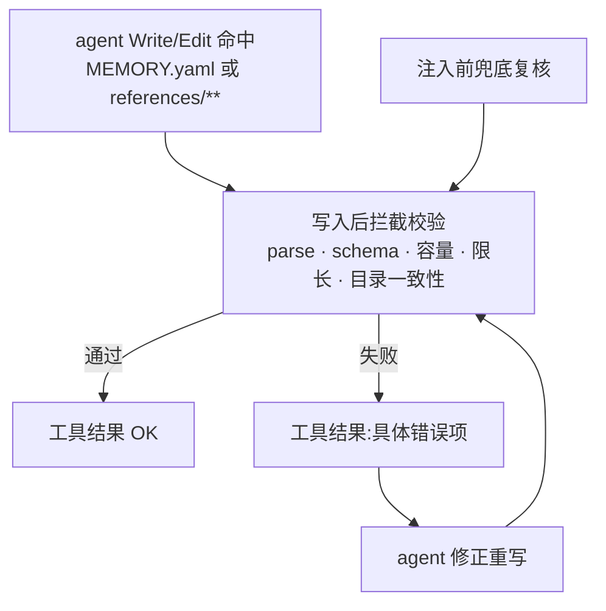

# memory 案例参考(作者偏好案例索引)PRD —— v0.1

> 状态:✅ 已定稿并实现(2026-08-18,v0.7 落地:两域 + preset;core/evals/typecheck 全绿)
> 关联:[`产品总览.md`](./产品总览.md);[`project-stage-nudge.md`](./project-stage-nudge.md)(nudge 双通道先例);[`context-compact.md`](./context-compact.md)(compact/clear 边界);[`novel-tools-通用合并.md`](./novel-tools-通用合并.md)(工具装配)
> 一句话:MEMORY.yaml 做纯目录(name/desc/path 条目 + version),YAML 规范化的「作者偏好库」两域——prose(喜欢的段落,仿质感,管「怎么写」)/ story(想用的故事池,可直接采用、用即标记,管「写什么」),外加 **preset 预设域**(作者手动/代码维护,agent 只读);目录**每纪元 persistent 注入一次**(启动/compact/clear),纪元内变更经 **version/摘要自愈**发轻量通知;读写走**通用 Read/Edit/Write + 动态编译校验**,入库闸门在对话层(askUser)。
> 演进:v0.1 两域(文风/大纲)→ v0.2 增 story 故事池(仅作者主动入库、采用标记、每文件 10 条)→ v0.3 目录条目改 name/desc/path、条数上限内置不暴露、memory 专用工具替代裸文件读写 → v0.4 注入改纪元制 persistent、增 version/摘要自愈通知、砍专用工具回归通用文件工具 → v0.5 outline 域去同构:案例从自由文本改为**结构化叶子单元计划**(镜像书库 leaf_story_unit_plans,含事件序列/节奏拍/实体变更/层级上下文)→ v0.6 增 **preset 预设域**(作者手动/代码维护,agent 只读,工具层禁写,系统扫描注入,采用追踪走 MEMORY.yaml)→ v0.7 **砍 outline 域**(复杂度收益比最差:入库需实质解析、校验最重,且「参考本项目单元设计」被 novel-db 自身覆盖——NovelRead 可查全部历史单元;体系收敛为 prose「怎么写」× story「写什么」两正交域)。

---

## 1. 背景与目标

- 要解决的问题:写正文的引导体系(`prose_standard` + 工作流 nudge)全部是**全局静态**判据——定义了「泛化的好」,定义不了「这位作者要的好」。作者品味目前无处沉淀:NOVEL.md 管世界观约束,书库(library)体量太大且明确不走该路线。
- 目标(一句话,可验收):作者喜欢的**段落案例**与**待用故事点子**沉淀为 YAML 规范化两域案例库,目录每纪元注入在用户消息旁,agent 创作前按需取同类案例对照——**案例即偏好**(只放正例,无注解、无反例、无偏好声明)。

## 2. 用户故事

- 作为作者,我希望把我喜欢的段落交给 AI 保管,以便它写出来的东西贴我的品味,而不是每次重口头描述。
- 作为作者,我希望说「这段感觉对了」时 AI 先问我要不要存,以便案例库不被它自作主张塞满。
- 作为作者,我希望把想用还没用的故事点子存进故事池,以便设计故事单元时 AI 拿来排——用过即标记,不重复消耗。
- 作为作者,我希望上下文压缩或清空会话后,我的品味不丢——memory 文件是唯一延续。

## 3. 流程图(必填)

### 3.1 案例入库(三重闸门,主流程)

```mermaid
flowchart TD
    A[作者表达喜欢] --> B{表达形态}
    B -- 粘贴外部片段 --> C[agent 归一:判域/判类/限长]
    B -- 认可本项目产出<br/>「这段对了 / 照这个写」 --> D[截取该段落]
    B -- 主动要求记故事<br/>「把这个点子存下」<br/>story 域唯一触发 --> D2[原文记录 + 判题材]
    C --> E[askUser 二次确认<br/>域 · 类型 · 内容预览]
    D --> E
    D2 --> E
    E -- 作者确认 --> F{目标文件条数 ≥ 内置上限?}
    F -- 否 --> G[Write/Edit 案例文件追加条目<br/>新类目须同步目录条目]
    F -- 是 --> H[askUser 选替换对象<br/>Edit 替换目标条目并说明]
    G --> I[动态编译校验(写后拦截)]
    H --> I
    I -- 通过 --> J[入库完成]
    I -- 失败 --> K[工具结果返回错误] --> L[agent 修正重写] --> I
    E -- 作者拒绝 --> M[丢弃,不入库]
```

### 3.2 注入与消费(纪元制 + 变更通知)

```mermaid
sequenceDiagram
    participant U as 用户输入
    participant N as MemoryNudge(persistent/纪元)
    participant F as MEMORY.yaml + references/
    participant M as 主模型 / Compose 子代理
    Note over N: 纪元首 run(启动 / compact / clear 后)
    N->>F: 读 MEMORY.yaml,动态编译校验 + 记 version/摘要基线
    N->>M: 目录全文注入用户消息后(落 journal,UI 不展示)
    Note over N: 纪元内后续 run 求值
    N->>F: 算摘要比对(见 F9)
    N-->>M: version 不一致 → 追加一条变更通知<br/>(±类目名,不重发全文)
    M->>F: 按需 Read:prose 同类案例对照
    M->>F: 设计单元查 story 池(未用优先);采用 → Edit 标 used
    M->>M: 仿案例质感创作(防抄袭 footer 约束)
```

### 3.3 写入-校验环



## 4. 功能明细

### F1 文件体系与 YAML schema

- 触发:无(静态约定)。
- 结构:

```
MEMORY.yaml                       # 项目根,与 NOVEL.md 并列;动态库目录,agent 经闸门维护,硬上限 6000 字
.novel/references/prose/*.yaml    # 文风案例:按场景类型一文件(战斗/对话/心理/环境…)
.novel/references/story/*.yaml    # 故事池:按故事题材一文件;仅作者主动入库,采用即标记
.novel/preset/{prose,story}/*.yaml   # 预设:与动态案例同构;作者手动/代码维护,agent 只读(见 F10)
```

- MEMORY.yaml schema 与示例:

```yaml
version: 3           # 内容版本:目录每次变更 +1(agent 编辑时自觉加;漏加由 F9 摘要自愈兜底)
usedPresets:         # 已采用的预设条目(引用键 <相对 preset 路径>#<id>);采用预设故事时追加并 version+1
  - story/复仇.yaml#002
prose:
  - name: 战斗
    desc: 短兵相接的近身打斗与攻防节奏段落
    path: .novel/references/prose/combat.yaml
story:
  - name: 复仇
    desc: 待用的复仇题材故事点子
    path: .novel/references/story/revenge.yaml
```

  目录条目 = `name`(类目名)+ `desc`(一句话类目内容描述,供检索路由与人工浏览;**不是**偏好注解)+ `path`。条数不在目录暴露。
- 案例文件 schema 与示例(prose 域):

```yaml
kind: prose          # prose | story,与所在子目录一致
name: 战斗            # 与 MEMORY.yaml 目录条目一致
desc: 短兵相接的近身打斗与攻防节奏段落
updated: 2026-08-18
entries:
  - id: "001"        # 文件内唯一三位序号,新条目取最大+1,不复用已删 id
    source: paste    # paste(作者粘贴) | approved-output(认可产出) | author-request(仅 story)
    added: 2026-08-18
    text: |
      (段落原文,≤300 字)
```

- story 域 schema(两处差异:唯一来源约束 + 采用标记):

```yaml
kind: story
name: 复仇            # 故事题材
desc: 待用的复仇题材故事点子
updated: 2026-08-18
entries:
  - id: "001"
    source: author-request   # story 域唯一合法值:作者主动要求
    added: 2026-08-18
    used: false        # 采用后更新为日期(YYYY-MM-DD);已用故事不再主动推荐
    text: |
      (故事内容/点子,≤500 字)
```

- 条数上限为**系统内置默认,不在文件中暴露**:prose 每文件 5 条、story 每文件 10 条,由动态编译校验器强制(F5)。
- 处理:文件名建议 ASCII kebab-case(仅路径用,展示一律用 `name`)。
- 异常:文件不存在/解析失败 → 注入时走 F5 兜底。

### F2 目录注入(MemoryNudge,persistent 纪元制)

- 触发:**纪元首 run 注入一次**——会话启动首输入 / compact 后首输入 / clear 后首输入。复用 project_stage 纪元基建:压缩清扫全部 nudge 标记消息 + 纪元归零,下一 run 重注入当前目录;clear 同理。
- 处理:读 MEMORY.yaml → 动态编译校验(F5)→ 扫描 `.novel/preset/**`(F10)→ 渲染 `<memory version="N">…</memory>` 合成目录(MEMORY.yaml 全文含 usedPresets + `<preset>` 段:name/desc/path,标注 agent 只读)+ 固定 footer(防抄袭护栏见 F6 + 一句指引「案例与故事经 Read 按需取用;入库/替换/采用标记经 Write/Edit,须先经作者确认(F4);预设只读」)→ persistent append 到当前 run 用户消息之后(**落 journal、UI 不展示**);同时记录 version/摘要基线(F9,含 presetDigest)。
- 纪元内:不重发全文;目录变更经 F9 version 检测追加一条轻量变更通知(±类目名),不重发、不替换。
- 不做 sparse 心跳:目录是静态资产而非过程状态,由工作流文案「动笔前查 memory 目录」唤起;注意力衰减问题实测出现再演进(加心跳的路径保留)。
- 选型理由(已决):逐 call 镜像为极低频变更(条目增删不动目录,仅新建/合并类目才动)付出逐 call 成本;persistent 纪元制零新机制(project_stage 同款)、可审计(journal 留存模型当时看到的目录)、纪元内不堆积。
- 输出:目录全文(>6000 字截断,尾部附一行「目录超限,请整理合并类目」)。
- 异常:读取/解析失败 → 注入一行「MEMORY.yaml 解析失败:<错误>,请修复」;绝不阻断 provider call。

### F3 案例消费

- 触发:正文撰写(PROSE 工作流)动笔前取 prose 案例;大纲设计(OUTLINE 工作流 / Compose 子代理)时查 story 池。
- 处理:agent 依目录按需 `Read` 对应类目文件——写段落取同场景类目 prose 案例对照,仿的是**质感与节奏**。文件很小(单文件 ≤10 条),整文件 Read 即检索,无需专用查询。大纲设计需要参考单元编排时直接用 NovelRead 查本项目历史单元(novel-db 即权威,不经 memory)。
- story 池消费(仅大纲设计时):Read 同题材文件,**未用**(`used: false`)故事优先;故事是可直接采用的**素材**——作者点名用某故事,或 agent 提议采用(拟用故事须在大纲产物中可见,走既有大纲审批对齐);**采用动态库故事 → Edit 该条目 `used` 为当日日期**;**采用预设故事 → Edit MEMORY.yaml `usedPresets` 追加引用键并 version+1**(预设文件本身只读,追踪落在 agent 有权写的目录);此后不再主动推荐已用故事。
- 接入点:PROSE 工作流全文(project-stage.ts)加「动笔前查 memory 目录,取同类案例对照」;OUTLINE 工作流加 story 池查阅与采用标记一句;Compose 子代理 recipe 加目录指引(其工具已有 Read)。
- 异常:目录为空/无同类案例 → 正常直写,不阻塞;story 池同类全已用 → 不复用,正常原创。

### F4 入库闸门(三重)

- 触发:作者粘贴片段,或显式认可产出段落(「这段感觉对了」「照这个写」),或**主动要求记故事**(「把这个点子存下」——story 域唯一触发)。
- 处理:①agent 归一——判域(prose/story)、判类目、内容归一(prose 截取限长段落;story 按原文记录判题材);②`askUser` 二次确认(域·类目·内容预览,作者拒绝即丢弃);③容量检查——满内置上限再问替换对象,替换并说明。写操作走通用 Write/Edit;**新建类目须同时补 MEMORY.yaml 目录条目并 version+1**(校验器双向抓不一致,见 F5)。
- 输出:Write/Edit 落盘(条目变更刷 `updated`;目录变更 +1 `version`)。
- 异常:**agent 不得自判「写得好」主动入库**——无作者显式认可 + 二次确认,绝不写案例文件;**story 域更严:仅作者主动指令可入库**,agent 不得把会话中出现的点子/自己的灵感自行带入故事池,也不得主动提议「要不要把这个存进故事池」。

### F5 动态编译校验

- 触发:①写后拦截——通用 Write/Edit 目标命中 MEMORY.yaml 或 `.novel/references/**`,执行后立即校验,结果附在工具结果里(失败必须当场修复);**目标命中 `.novel/preset/**` 直接拒绝执行**(硬闸见 F10,不进入校验);②注入兜底——F2 求值时复核(含预设文件)。
- 校验清单:
  - 通用:YAML parse 通过;必填字段齐全;`kind ∈ {prose, story}` 且与所在子目录一致;`name`/`desc` 非空。
  - MEMORY.yaml:所有 `path` 存在;指向文件的 kind/name/desc 与条目一致;name 不重复;总字数 ≤6000;`usedPresets` 引用键指向的预设条目存在。
  - 案例文件(动态库与预设同规则):条数 ≤ 内置上限(prose 5、story 10;**预设不受条数上限**——作者自管,防塞满闸门不适用);单条 `text` 限长 prose 300 / story 500;`id` 文件内唯一;story 的 `source` 仅 `author-request`,`used` 为 `false` 或合法日期。
- 输出:逐项错误信息(哪条规则、哪个条目);**预设文件的校验错误文案指向作者**(「预设格式有误,请作者手动修复」——agent 无权改,不构成 agent 修复环)。
- 异常:校验失败不回滚文件,错误以工具结果返回,构成「修复环」(3.3;预设除外)。

### F6 护栏与容量

- 防抄袭 footer(注入时固定附带):prose——「仿案例的质感与节奏,不得复用其词句」;story 无防抄袭约束(作者素材,本就供采用),但采用须经作者对齐(见 F3)。
- 容量:MEMORY.yaml 6000 字(注入截断+提示);条数内置上限 prose 5、story 10,替换制;单条限长 prose 300 / story 500。
- 不变式:案例文件与目录只含**作者喜欢的正例**——无反例、无雷区、无偏好声明(desc 是类目内容描述,不是偏好注解)。

### F7 边界固化(compact / clear)

- 主干不变式:偏好案例在作者表达 + 确认的**当下即入库**(F4),compact/clear 不承担主要固化职责。
- compact 边界:压缩发生后,下一 run 的 memory 注入尾部附一行「上下文已压缩,请核对近期作者偏好是否均已入库」——agent 可翻阅 T2 摘要核对补漏(补漏同样走 F4 闸门)。
- clear 边界:会话清空后首 run 同样附「会话已清空,memory 是唯一延续,请核对」。
- 异常:核对提示只提示,不强制;未发现的漏记随摘要沉淀,接受损失。

### F8 NOVEL.md 职责移交

- 触发:本功能落地时同步改文案。
- 处理:`novel.global_constraints` 段说明中「作者偏好」字样移除,NOVEL.md 收窄为世界观/禁忌/全局约束;写作偏好案例的载体指引指向 MEMORY.yaml(避免 agent 不知往哪写)。

### F9 version 与摘要自愈(纪元内变更通知)

- 目标:目录全文每纪元只注入一次(F2);纪元内目录被改(新建/合并类目等)时,不重发全文、不做消息替换,只追加一条轻量变更通知。
- 文件侧:MEMORY.yaml 顶层 `version`(内容版本,初始 1,只增不减)。**摘要不落文件**——由系统对文件内容计算 digest,与「已注入 version」配对记录在 nudge 状态,避免 hash 字段自指。**预设侧**:对 `.novel/preset/**` 全部文件合成算 `presetDigest`,同为 nudge 状态基线(预设不 bump version——预设不属于 agent 维护的目录)。
- 求值规则(每 run 首 call,与 F2 同一策略):
  - 算当前 digest 与 presetDigest,与状态记录比对:
    - **两者一致** → 无变更,不动作;
    - **digest 变了且 version 未加**(改了内容忘了 bump,含作者手改)→ 系统自动写回 `version+1` 自愈,随后按 version 不一致处理;
    - **version 与上次注入不一致**(agent 自觉加了,或经上一条自愈)→ 追加一条 persistent system 变更通知(落 journal、带 nudge 标记、UI 不展示):「MEMORY.yaml 已更新至 vN:<±类目名列表>;此前注入的目录如有出入,以最新文件为准,需要时 Read」;状态基线更新。
    - **presetDigest 不一致**(作者手动/代码变更预设)→ 追加一条变更通知:「预设已变更:<±文件名列表>」,不 bump version;基线更新。
- 状态恢复:对齐 project_stage seed-scan 先例——重启后从 journal 已注入的 memory 消息恢复「已注入 version」;digest 与 presetDigest 基线重启重置(重启不视为内容变更,不触发通知)。
- 范围:MEMORY.yaml 参与 version/digest,`.novel/preset/**` 参与 presetDigest;references 文件不参与(条目增删不动目录,变更信息由对话中的文件编辑记录天然携带)。
- 异常:digest 比对与自愈写回失败 → 静默跳过并下次重试,不阻断 provider call。

### F10 预设域(preset,只读)

- 定位:作者离线准备的案例/故事资产——**只能通过作者手动编辑文件或代码/工具链写入**;agent 运行时只读。预设不经 F4 入库闸门、不受条数上限(作者自管),与动态案例同构消费。
- 结构:`.novel/preset/{prose,story}/*.yaml`,文件与条目 schema 同 F1(条目 `source` 固定为 `preset`;story 条目无 `used` 字段——采用追踪在 MEMORY.yaml)。
- 目录:预设**不进 MEMORY.yaml**——F2 注入时系统扫描 preset 目录自动渲染 `<preset>` 段(name/desc/path + 只读标注);agent 无权也无须维护预设条目,天然隔离篡改面。
- 写权限硬闸(工具层强制,不靠 prompt):Write/Edit 目标命中 `.novel/preset/**` → 拒绝执行,错误信息「预设只读:仅作者手动或代码变更;如需调整请告知作者」。
- 采用追踪:采用预设 story → Edit MEMORY.yaml `usedPresets` 追加引用键(`<相对路径>#<id>`)并 version+1(F3);防重复消费靠注入目录中的 usedPresets 渲染。
- 校验:同 F5 结构校验(枚举/限长/单条渲染上限);错误文案指向作者手动修复;agent 不修复预设。
- 异常:preset 目录不存在/为空 → 注入不含 `<preset>` 段,不报错。

## 5. 边界与非目标

- 明确不做:反例/雷区/正反对照/偏好声明/偏好注解(案例即偏好;desc 仅类目内容描述);UI 编辑入口(动态库对话入库、文件由 agent 维护;**预设连 agent 都不可写,仅作者手动/代码**);专用 memory 工具(通用文件工具 + 写后校验 + 对话闸门覆盖;规模需要过滤分页时再议);向量/语义检索(文件极小,整文件 Read 即检索);compact 前置 LLM 抽取固化(重方案,即时入库已覆盖主干);接入书库 library/LibraryRead(明确不走该路线);MEMORY 不承担项目进度/世界观(novel-db 与 NOVEL.md 职责)。

## 6. 验收标准

- [ ] 校验器落地且单测覆盖:合法通过 / 越限 / 缺字段 / 路径悬空 / kind 不一致 / name 重复 / id 重复 / 超字数 / story 非法 source,各错误信息可定位到条目。
- [ ] 纪元注入:启动 / compact / clear 后首 run 注入目录全文(name/desc/path/version 渲染),落 journal、UI 不展示;纪元内不重发。
- [ ] version 自愈:改内容未 bump → 自动 version+1;version 与上次注入不一致 → 追加变更通知(含 ±类目名);digest 一致不动作;presetDigest 变更 → 独立通知(不 bump version);重启 seed-scan 恢复已注入 version 且不误发通知。
- [ ] 预设域:Write/Edit 命中 `.novel/preset/**` 被工具层拒绝(硬闸单测);注入含 `<preset>` 扫描段且 agent 不可写其条目;采用预设 story 正确追加 usedPresets 并 version+1;预设校验错误文案指向作者。
- [ ] 超 6000 字注入截断并附整理提示;解析失败注入修复指引且不阻断 call。
- [ ] 入库闸门端到端:显式认可 → askUser 确认 → Write/Edit;写后校验拦截越限与目录不一致;agent 自判路径被 prompt 约束,story 域仅作者主动指令可入库。
- [ ] PROSE 工作流(prose 案例)、OUTLINE 工作流(story 池)与 Compose recipe 接入目录指引;防抄袭 footer 注入。
- [ ] compact / clear 后核对提示生效。
- [ ] NOVEL.md 文案改口;evals Tier 0 快照按段注册表变化再生。

## 7. 开放问题

- story 限长 500 初值是否够用,实测后可调。
- 6000 字硬上限的 token 成本感知(目录常态应远小于此,若实际膨胀可收紧)。
- story 采用标记是否顺带记录去向(条目加可选字段关联 story_unit,便于回溯「这个故事用在哪」),当前仅日期;预设采用的 usedPresets 同理。
- 预设的供给链:当前仅作者手动放文件;是否需要工具链入口(如从书库 highlights 导出预设、或 UI 导入),待用后评估。
- 纪元内变更通知的 delta 粒度当前为类目名列表;若类目重命名频繁,是否需要含条目级增删计数。
- clear 边界目前为「事后核对」轻量形态,是否需要更重的预固化(如 clear 前拦截提示作者),待用后评估。
- outline 域已砍(v0.7);若未来作者对「外部书的大纲编排参考」需求真实出现,重新评估独立形态(而非恢复 v0.5 结构化方案)。
