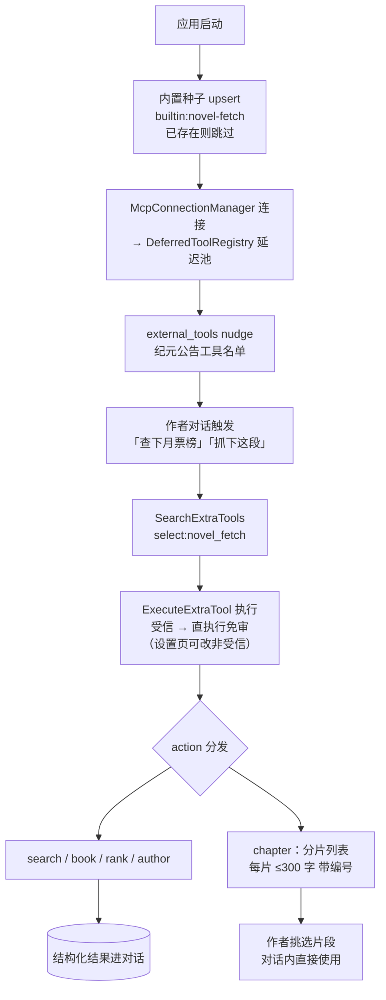

# 网文平台信息工具箱（novel-fetch MCP server）PRD —— v0.6

> 状态：✅ **已实施**（2026-08-24：`mcp-servers/novel-fetch/` server + gui 内置种子接入 + smoke test 7/7；core 全量 863 用例无回归、gui tsc 零新增）
> 关联：[`external-tools-接入.md`](./external-tools-接入.md)（延迟加载框架，已合入 main——SearchExtraTools/ExecuteExtraTool 两步调用与 external_tools 纪元公告均由该框架承载）
> 一句话：**网文平台信息工具箱** MCP server（`mcp-servers/novel-fetch/`，单工具 `novel_fetch` 5 action：search/book/rank/author/chapter，**当前支持起点中文网**），应用**默认注册**（内置种子，开箱即用）——经移动端 SSR pageContext 通路免浏览器现场取数，供作者查书/扫榜/查作者作品/抓章节分片；即取即用不缓存全文，规避版权风险。
> 技术参考：`oh-story-claudecode/skills/story-long-scan/scripts/qidian-rank-scraper.js`（起点移动端 SSR 通路先例）

---

## 命名决策（平台中立）

命名 `novel-fetch` / `novel_fetch` 为**多平台预留容器**：后续支持番茄/晋江等平台时，同一 server 扩可选 `platform` 参数（新增可选参数为 MCP 兼容变更），**不改工具名**（工具名进模型上下文与用户配置，改名是破坏性变更）。本期 schema 不含 `platform`（YAGNI——只有起点一个实现时该参数无意义）。

## 进程模型（stdio 每会话实例）

**决策：stdio transport，每个活跃会话子进程各自 spawn 一个 server 进程实例**（`McpConnectionManager` 既有行为），随会话退出自动回收。理由：

- MCP 生态标准模型（Claude Desktop / Cursor 同款）——stdio 是 1:1 管道，"全局单例"需换 StreamableHTTP transport；
- novel-fetch 无状态（无共享数据需求）、极轻（fetch + 正则）、低频按需（空闲时进程等待 stdio 消息）——per-session 进程的成本不成立；
- 崩溃隔离（一个会话的 server 挂了不影响其他会话）、生命周期零管理；
- 60s 防重表每会话独立——目的是"别高频打目标站"，会话级窗口已满足；
- 多 GUI 多开 = 多个无状态轻进程，无正确性问题。

**演进触发条件**（满足其一再改 StreamableHTTP 单例，届时需端口管理/生命周期/健康检查/防火墙弹窗处理）：server 变重（带缓存库）、需要跨会话共享状态（登录态）、会话数大到内存敏感。

## 0. 接口实测验证（2026-08-24，设计依据）

主路径锁定**移动端 SSR pageContext**：`https://m.qidian.com/...` 页面内嵌 `<script id="vite-plugin-ssr_pageContext">` JSON（`pageContext.pageProps.pageData`），fetch HTML + 正则提取即得结构化数据，免浏览器、规避 PC 站风控。五个 action 通路**全部实测通过**：

| action | 通路 | 实测结果 |
|---|---|---|
| rank | `/rank/{type}/` → `records[]` | ✅ 9 种榜单类型全部返回 17-20 条/页；`?page=N` 翻页可用 |
| book | `/book/{bid}/` → `bookInfo` | ✅ 书名/作者/分类/标签/简介/字数/状态/月票/推荐票/收藏/VIP/签约/最新更新齐全 |
| search | `/search?kw=` → `bookInfo.records[]` | ✅ 书名/作者名关键词均可搜（注意：`bookInfo` 是 `{total, records}` 包装，非裸数组） |
| author | `/author/{id}`（**无尾斜杠**，带斜杠 404）→ `allBook` + `info` | ✅ 作者名（先搜索拿 id）/作者页 URL/纯 id 三种入参均可 |
| chapter | `/book/{bid}/{cid}` → `chapterInfo.content` | ✅ 正文在 `content` 字段（HTML）；VIP 书未订阅返回**限免试读片段**（非空） |

实测发现的关键事实（实现已处理）：
- **`read.qidian.com` 被风控**（HTTP 202 + 空 body）——主路径只用 `m.qidian.com`；
- **章节正文为不闭合 `
` 结构**（`
文本
文本`，无 `
`）——不能用配对正则，按 `
` split；
- **PC 章节页 URL 形态**（`www.qidian.com/chapter/{bid}/{cid}/`）解析出 bid/cid 后转移动端路径**可用**；
- 章节名自带中文序号（"第七百二十四章"），`chapterOrder` 是内部序号（如 28000），无展示价值；
- 字段多态普遍（`bName/bookName`、`bid/bookId`、`cnt/wordsCnt`…），需要多字段名兜底；
- 数值占位（`clickTotal: -1`）与拼音类目（`chanAlias: "dushi"`）需过滤。

## 1. 背景与目标

- **痛点**：作者写作时希望参考起点上的书——查某本书的简介与数据、看当前什么书火、查某作者的作品、抓某段喜欢的文字作参照；目前没有任何外部信息通道，AI 无法获取这些数据。
- **版权边界（设计前提）**：不批量爬库、不缓存全文、不存储整章——**现场**抓取作者指定的单个页面，即取即用。
- **目标（一句话，可验收）**：`mcp-servers/novel-fetch/` MCP server 落地（5 action 全部可用）+ 应用默认注册（启动种子，设置页可见可禁用可删除）——作者对话中说"查下月票榜前十""帮我抓下这段"，AI 经 SearchExtraTools 发现 → ExecuteExtraTool 执行（审批）→ 拿到结构化结果。

## 2. 用户故事

- 作为作者，我想知道现在月票榜/畅销榜上什么书火（题材、字数、简介），AI 直接查给我；
- 作为作者，我想了解某本书的详情（简介/数据/更新状态）或某个作者写过什么作品；
- 作为作者，我在起点看到一段喜欢的文字，贴个链接让 AI 抓回来给我看（按自然段分片，我来挑喜欢的）；
- 作为作者，我希望这个工具开箱即用（默认注册，不用手动配置），调用顺畅不打断（内置受信免审）；如我不放心可在设置页改回非受信（调用前审批）。

## 3. 流程图（必填）

## 4. 功能明细（本期仅两项）

### F1 MCP server（`mcp-servers/novel-fetch/`）

- **形态**：Node 独立进程（stdio），MCP SDK v2（`serveStdio` 工厂模式 + `fromJsonSchema`，免 zod）；挂 pnpm workspace。
- **数据通路**：移动端 SSR pageContext（§0 已验证）；iPhone UA + `Accept-Encoding: identity` + 15s 超时。
- **工具**：`novel_fetch`（单工具多 action）：
  - **输入 schema**：`action`（必填，枚举 search/book/rank/author/chapter）+ 各 action 对应参数（`kw` / `url` / `book_id` / `author` / `rank_type` / `page`），宽松 schema（required 仅 action）；
  - **action 清单**：
    - `search`：`kw` → 书/作者搜索结果（书 10 条带简介，作者 5 条带 id）；
    - `book`：`book_id` 或书页 URL → 书详情（含月票/推荐票/收藏/VIP/签约/最新更新）；
    - `rank`：`rank_type`（9 种：yuepiao/recom/hotsales/readindex/newbook/sign/newauthor/newfans/sanjiang）+ 可选 `page` → TOP 列表（每条带 book_id，可接 action=book）；
    - `author`：作者名（内部先搜索拿 id）/作者页 URL/纯 id → 作品列表；
    - `chapter`：章节页 URL（移动端 `/book/{bid}/{cid}` 与 PC `/chapter/{bid}/{cid}/` 双形态）→ 正文按自然段分片（每片 ≤300 字、带编号与 30 字预览），作者挑选后对话内直接使用。
  - **边界**：域名白名单 `*.qidian.com`（非起点拒绝）；VIP 未订阅返回限免试读 + 明示提示；**60s 同目标 URL 防重**；不缓存；失败降级中文错误与建议。
- **配置**：`package.json`；无鉴权（本地 stdio）。

### F2 应用默认注册（内置种子）

- **形态**：gui 启动时 `seedBuiltinMcpServers`——config 中不存在 `builtin:novel-fetch` id 时 upsert（`enabled: true`、`trusted: true`、command=当前 Electron 二进制（以 `ELECTRON_RUN_AS_NODE=1` 的 Node 模式运行 .mjs——主进程 `process.execPath` 是 electron.exe，直接跑会 stdio 无响应超时）、args=server 入口绝对路径）；**已存在一律跳过**（用户编辑/禁用/删除优先，不覆盖不复活，对齐 seedBuiltinSkills 语义）。
- **默认受信（免审批）依据**：审批语义的设计本意是防用户自添加第三方服务器的"外部副作用不可知"（wrapMcpTool 注释）；novel-fetch 应用内置随分发 + 纯只读（fetch 公开页面返回文本），与内置工具 NovelRead/Read/skill 免审一致；设置页可改回非受信。注意 trusted 修改为**会话快照语义**（onMutated 重写 env 只对下一个 spawn 的对话生效，运行中会话维持旧快照——与 provider 设置同款）。
- **处理**：经既有 MCP 装配链路——`McpConnectionManager` 连接 → `wrapMcpTool` → `extraTools` → **DeferredToolRegistry**（延迟池，不进常驻工具面）→ `runtime.external` 组两步调用（SearchExtraTools 发现 / ExecuteExtraTool 执行，受信直执行）+ external_tools nudge 纪元公告（均为 external-tools 框架既有能力，零新机制）。
- **异常**：server 连接失败/工具不可用 → 延迟池为空或缺失该工具，会话不受影响（框架既有语义）。

## 5. 边界与非目标（本期不做）

- **不做**：任何落盘/收录机制（分片结果在对话内使用；收录流程待 memory 案例库合入后对接其入库闸门）；nudge 触发文案（external_tools 纪元公告已覆盖名单，模型可发现）；GUI 面板；多平台（番茄/晋江等）；批量/定时/整书爬取；付费章节完整内容（VIP 未订阅只返回限免试读并明示）；缓存与代理池；反爬对抗升级（遇风控即降级提示，不重试对抗）。
- **版权边界不变式**：单次单页、现场抓取、不缓存全文、即取即用。

## 6. 验收标准

- [x] `mcp-servers/novel-fetch/` 独立可运行（smoke test，`core/scripts/novel-fetch-smoke.mjs`）：5 action 真实调用各返回结构化结果；VIP/非法 URL/缺参/未知榜单各有明确中文错误或 schema 校验报错。
- [x] 域名白名单：非起点 URL 拒绝；畸形 URL 拒绝；60s 同目标 URL 防重；单请求 15s 超时。
- [x] 默认注册：内置种子 upsert（已存在跳过、删除不复活；`trusted: true` 默认受信免审）+ 延迟池注册（不进常驻工具面）+ 两步调用（SearchExtraTools → ExecuteExtraTool 受信直执行）链路成立。
- [x] core 全量测试无回归（863 用例）；gui tsc 零新增错误（对照既有 1 个 renderer 错误）。

## 7. 开放问题

- 起点页面结构若改版，解析需随之维护（接受；降级文案已覆盖）。
- MCP server 随应用分发的路径假设（dev 源码树相对路径 `baseDir` 上溯三级）——打包形态（asar/额外资源）待 gui 打包方案确定后适配。
- 60s 防重窗口的体感（author 的 id/URL 双形态归一到同一目标地址）——实测观察是否需要缩短。
- 分片限长 300 字——对齐未来 memory prose 限长的预留值，本期无消费方约束。

## 8. 演进路径（后续，本期均不做）

- v0.2：memory 案例库合入后对接——片段收录走 F4 入库闸门（`references/prose/*.yaml`）、prose 工作流 nudge 触发（案例库无相关正文/作者表达喜欢片段时唤起爬取）。
- v0.3：GUI 面板（收藏按钮 + 标记状态）、初次创建引导。
- 多平台：同 server 扩可选 `platform` 参数（兼容变更，不动工具名）；番茄/晋江/七猫等，oh-story-claudecode 有参考爬虫脚本；如 server 变重或需共享状态，再评估 StreamableHTTP 单例（见「进程模型」演进触发条件）。
