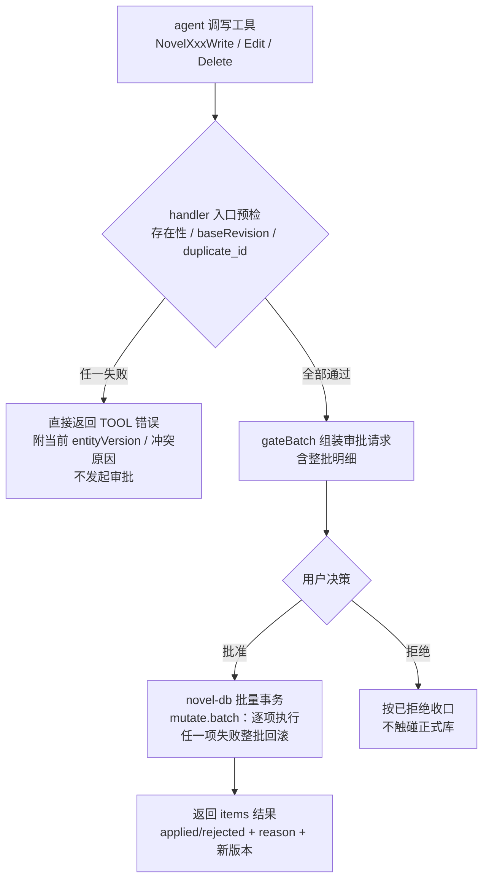
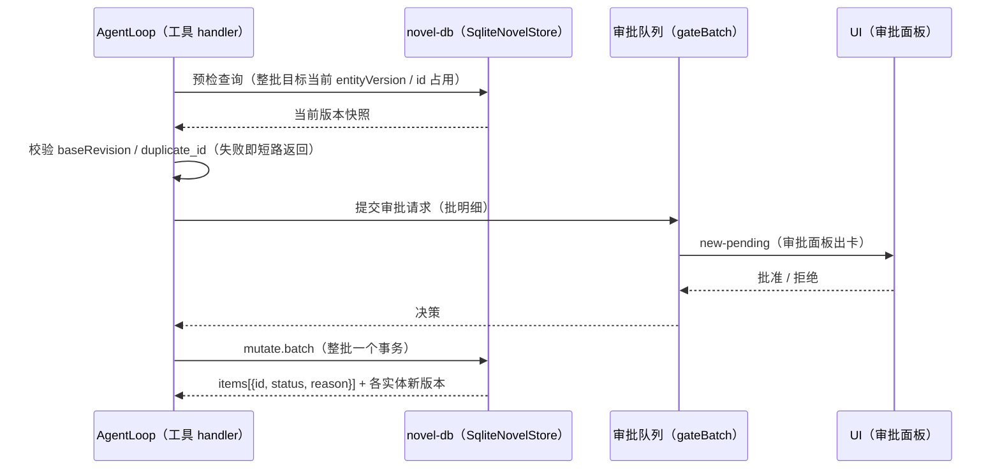
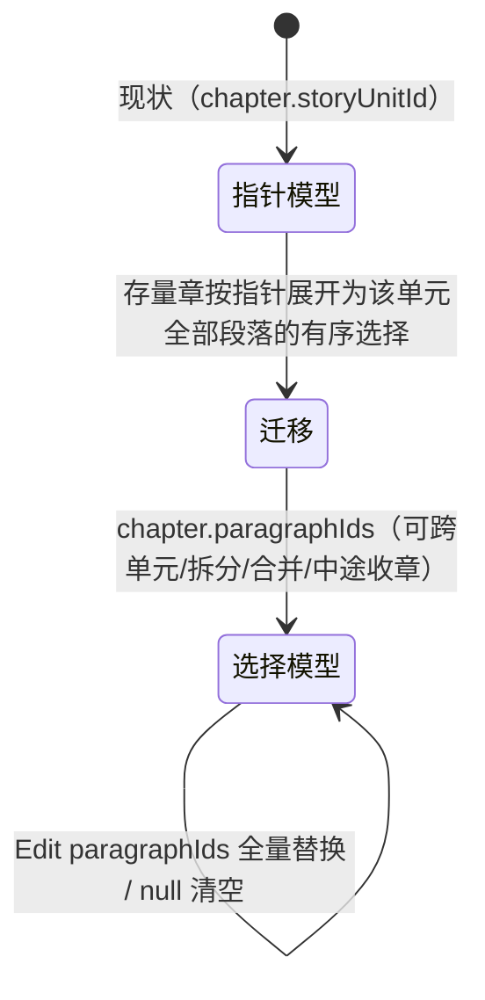

# novel-tools-legacy-对齐 PRD —— v0.1

> 状态：✅ 已定稿（2026-08-14；**P1、P2、P3 全部实施完毕**。实施偏差见 §7 决议与 §8-§10）
> 关联：整体产品 PRD [`产品总览.md`](./产品总览.md)；技术设计 `docs/architecture.md`
> 参考：legacy-main 既有实现（`core/src/tools/novel/{character,location,outline,paragraph,publication,delete}/`、`core/src/novel/{draft,commit,approval,conflict}/`）；本轮对照结论见本文 §1。

---

## 1. 背景与目标

- 要解决的问题（痛点 / 现状）：
  - 重构迁移时 novel 域工具被**简化 + 改名**：与 legacy-main（模型历史接受的契约）对照，15/16 工具改名（丢 `Novel` 前缀、Volume/Chapter 六件合并为 Publication 三件）；参数形状全部偏离（legacy 统一 `{ baseRevision, values }` 批量包装、Edit 项 `{ id, value }`、id 可客户端自选、orderKey 有格式约束、字段有长度/数量上限）；**数据模型缺失**：leaf 计划（场景级故事设计文档）、blockState/abandonment 暴露、章-段落选择模型（paragraphIds 有序选择）、批内原子性、删除依赖检查与级联。
  - 用户已确认四个口径（本 PRD 的决策基线）：
    1. **写入管线**：保留现有「审批在前（gateBatch）+ 直接落正式库」，只补**批内原子**（整批一个事务，任一项失败整批不落地）；不迁 legacy 的 Draft/commit/conflict 子系统。
    2. **修订模型**：保留每实体 `entityVersion` 乐观锁；参数形状对齐 legacy；**审批前预检**（事务开始前/审批请求提交前校验整批 baseRevision 与目标存在性，版本过期/目标不存在/duplicate_id 直接返回错误，不发起审批——避免无效审批）。
    3. **描述语言**：schema 形状与语义对齐 legacy，工具描述保留中文详述版（基于当前 `definitions/novel.ts` 已有内容随改名更新引用）；不补齐 legacy 的 promptDetails 三段结构（保持 policy/guidance 两段）。
    4. **实施分期**：三期——P1 工具层（改名+形状+约束+Read 增强+批内原子+预检）→ P2 模型层（leaf 计划 + blockState/abandonment 暴露）→ P3 发布层（章 paragraphIds 选择模型 + 级联删除 + 稿件视图）。
- 目标（一句话，可验收）：novel 域 19 个工具的命名、参数形状、约束与数据模型对齐 legacy-main 契约（在上述四个口径内），模型调用方式回归历史已接受形态，写入具备预检 + 批内原子。

## 2. 用户故事

- 作为主创作 agent，我希望工具命名/参数与历史已接受契约一致（`NovelCharacterRead` 等 19 件、`{ values }` 批量、`{ id, value }` 编辑项），以便调用零歧义、不产生迁移性退化。
- 作为主创作 agent，我希望在叶子（scene 级）单元上挂 leaf 计划（人物/地点绑定、事件序列、节奏拍、实体状态变更），以便具体故事承载单元有结构化设计且连贯性可追踪。
- 作为创作者，我希望审批面板里出现的写请求都是**预检通过**的（版本有效、目标存在、无重复 id），批准即生效，以便不批准注定失败的批次。
- 作为创作者，我希望一次批准的批量写入要么整批落地、要么整批不落地，以便正式稿不会出现半截状态。
- 作为创作者，我希望删单元/卷时默认被依赖检查拦住（有子/有叶/有段落、有章），显式 `cascade:true` 才级联，且返回被删实体完整记录，以便误删可查、级联可预期。

## 3. 流程图（必填）

### 3.1 写入主流程（预检 → 审批 → 事务；P1 起全量生效）

### 3.2 批量写入多主体时序

### 3.3 章内容模型状态流转（P3：storyUnitId 指针 → paragraphIds 选择）

## 4. 功能明细

### P1 —— 工具层对齐（改名 / 形状 / 约束 / Read / 预检 / 批内原子）

- **功能点 1：工具改名与拆分（16 → 19 件）**
  - 触发：P1 一次性切换。
  - 输入：现 `definitions/novel.ts`。
  - 处理：`Character/Location/Outline/Paragraph` 的 Read/Write/Edit 补 `Novel` 前缀（12 件）；`PublicationRead/Write/Edit` 拆为 `NovelVolumeRead/Write/Edit` + `NovelChapterRead/Write/Edit`（6 件，参数语义见 legacy `publication/schemas.ts`）；`NovelDelete` 名字不变。同步消费点：`previews.ts` 注册表、`NovelToolGroups`（manifest.tools 与工厂）、`canonicalTools.ts`（compose 可用集）、UI `paramLabels` / `approvalEntityResolver` / `ApprovalPanel`、全部相关测试。
  - 输出：19 件工具注册，审批面板预览与参数标签正常。
  - 异常：改名期间旧会话 journal 中的历史工具名按原文展示（投影不做名称翻译）。

- **功能点 2：参数形状对齐**
  - 触发：随功能点 1。
  - 输入：legacy 各域 `schemas.ts`。
  - 处理：
    - Write：`{ values: [...] }`（批量 1-64 项；id 可选客户端自选，缺省宿主生成并回传；id 重复 → `duplicate_id` 拒绝）。create 不携带版本字段。
    - Edit：`{ values: [{ id, baseRevision, value }] }`——项形状 `{ id, value }` 对齐 legacy；因保留 entityVersion，`baseRevision` 作为项内字段与 id 并列（legacy 项内无锁字段是集合级 revision 的产物）。
    - Delete：`{ cascade?: boolean, values: [{ kind, id, baseRevision }] }`（对齐 legacy 的 `cascade` 与批量包装；版本按项携带）。
    - 约束全集：`ID_PATTERN = ^[A-Za-z0-9][A-Za-z0-9._:-]{0,159}$`；`ORDER_KEY_PATTERN = ^(?:[0-9A-F]{4})+$`；title ≤500、name ≤200、aliases ≤32 项、summary ≤20k、authorNotes ≤50k、text 上限沿现状、批量 1-64。
  - 输出：schema 与 legacy 同构（除版本字段位置差异，见 §7 开放问题 1 是否完全消灭）。
  - 异常：参数校验失败 → `TOOL_ARGUMENTS_INVALID`，不进审批。

- **功能点 3：orderKey 语义补齐**
  - 触发：Write 缺省 orderKey 时。
  - 处理：缺省改为「**追加到末位兄弟之后**」（store 取同父/同单元最大 orderKey 生成后继键，满足 hex 4 位组格式），替换现行 `String(Date.now())` 兜底；描述同步。
  - 异常：存量数据 orderKey 不满足 pattern——**只约束新写入，读不校验**（见 §5 边界）。

- **功能点 4：Read 增强**
  - `NovelParagraphRead`：省略 storyUnitId → 返回全部段落（按单元分组、单元内按 orderKey）；契约新增全量 list。
  - `NovelVolumeRead`：无参数，只返回 `id/title/orderKey` 列表（按 orderKey）。
  - `NovelChapterRead`：`{ chapterId?, volumeId?, includeContent? }`；返回章基本信息 + **有序段落来源**；P1 阶段 includeContent 按现行 `storyUnitId` 指针返回该单元段落拼接（P3 切换为 paragraphIds 选择）。
  - 异常：过滤参数命中的集合为空 → 空列表（非错误）。

- **功能点 5：审批前预检（决策口径 2）**
  - 触发：Write/Edit/Delete 的 handler 入口（gateBatch 提交审批请求**之前**）。
  - 处理：对整批做只读预检——目标存在性、`baseRevision === 当前 entityVersion`、id 占用（duplicate_id）。任一失败整批短路，返回结构化错误（含当前版本/冲突项），**不发起审批**。
  - 输出：审批队列中不再出现注定失败的批次。
  - 异常：预检与执行之间的并发变更（单会话串行下极小）由执行期乐观锁兜底，失败整批回滚。

- **功能点 6：批内原子（决策口径 1）**
  - 触发：审批批准后执行。
  - 处理：新增批量变更通道（`mutate.batch`：novel-db 单事务顺序执行整批，任一项失败回滚）；工具 handler 组装一次批量调用；返回 `items[{ id, status: applied|rejected, reason }]` + 各实体新 entityVersion（对齐 legacy 结果形态）。
  - 异常：事务失败 → 整批回滚 + 返回失败项原因；审批拒绝 → 不执行。

### P2 —— 模型层：leaf 计划 + blockState/abandonment

- **功能点 7：leaf 计划（LeafPlan）**
  - 触发：大纲单元需要场景级设计时。
  - 输入：legacy `outline/schemas.ts` 的 `LeafPlanWriteSchema` / `PartialLeafPlanWriteSchema`（settingMode：located | location-independent；time{description, timelineOrderKey}；characters[{characterId, involvement{presence, roles}, note}]；locations[{locationId, involvement{role, affected}, note}]；events[{id, orderKey, description}]；rhythmBeats[{id, orderKey, rhythm(八档), intensity 1-5, readerEmotion, pointOfViewEmotion, description, relatedEventIds}]；entityChanges[{id, entityType, entityId, relatedEntityId, category(九类), summary, sourceEventIds}]）。
  - 处理：模型加 `LeafPlan`（含部分更新/null 清空语义）；存储新增表 `leaf_story_unit_plans(story_unit_id PK, plan_json)`；契约 `outline.storyUnit.create` 增 `leaf?`、`update` 的 patch 增 `leaf`（null 清整个计划）；`NovelOutlineWrite` 的 values[].leaf / `NovelOutlineEdit` 的 value.leaf 暴露；`NovelOutlineRead` 增 `includePlans?`。
  - 输出：leaf 随单元读写；工具描述注明「leaf 挂叶子（scene 级）单元——树末端承载具体故事」。
  - 异常：绑定的人物/地点 id 不存在 → 预检拒绝（进 §功能点 5 预检范围）。

- **功能点 8：叶完成度 rollup**
  - 处理：`NovelOutlineRead`（含 includePlans）返回单元 `progress{ effectiveStatus, isBlocked, completedLeafCount, totalLeafCount }`——以子树内带 leaf 单元的 realizationStatus 汇总。

- **功能点 9：blockState / abandonment 暴露**
  - 处理：表列已存在（`story_units.block_state` / `abandonment`，JSON）；模型类型已存在（含六种 blockReason / 六种 abandonReason + dependencyIds + replacementStoryUnitId）；补契约透传 + `NovelOutlineWrite/Edit` schema 暴露 + isBlocked/effectiveStatus 派生（进功能点 8）+ UI inspector 面板展示与编辑。
  - 异常：dependencyIds 指向不存在单元 → 预检拒绝。

### P3 —— 发布层：章-段落选择 + 级联删除

- **功能点 10：章 paragraphIds 选择模型**
  - 处理：存储新增关联表 `chapter_paragraphs(chapter_id, paragraph_id, position)`（对齐 legacy `novel_chapter_paragraphs`）；`NovelChapterWrite` 增 `paragraphIds?`（缺省空选择）；`NovelChapterEdit` 增 `paragraphIds`（全量替换 / null 清空——拆分、合并、重排、跨单元、单元中途收章都靠它）；`NovelChapterRead.includeContent` 切换为按选择返回段落；存量 `chapter.storyUnitId` 数据一次性迁移（按指针展开为该单元全部段落的选择），此后指针字段废弃。
  - 输出：章内容 = 有序段落选择；`chapter.storyUnitId` 不再是内容来源。
  - 异常：paragraphIds 含不存在段落 → 预检拒绝。

- **功能点 11：删除依赖检查 + 级联**
  - 处理：`NovelDelete` 默认（`cascade:false`）拒绝有依赖的删除——单元有子单元/leaf 计划/段落、卷有章、章有段落选择；`cascade:true` 级联——单元删整个子树（单元+leaf+段落）、卷删其章、章解绑段落选择（段落保留在单元下）；删除段落同时从所有章选择移除；返回每个实际被删实体的完整记录（`deleted[]`，级联展开、跨批去重）。
  - 异常：级联删除同样整批一个事务。

- **功能点 12：UI 稿件视图重做**
  - 处理：`ManuscriptChapterContent` 等从「按 chapter.storyUnitId 拉单元段落」改为「按章选择拉段落」；新增段落默认进当前编辑章的选择末位；跨单元/拆分场景的展示与交互对齐选择模型。

## 5. 边界与非目标

- 明确不做：
  - **不迁** legacy 的 Draft 会话 / ChangeSet / commit / outbox / 冲突 rebase 子系统（写入仍是「审批在前 + 直接落正式库」）。
  - **不改**修订粒度：保留每实体 entityVersion，不引入集合级字符串 revision（baseRevision 位置与 legacy 的差异见 §7-1）。
  - **不补** promptDetails 三段结构（usage/parameterGuidance/safetyGuidance），维持 policy/guidance 两段；描述保留中文详述版。
  - **不迁** legacy 的 `novel_` 表前缀体系与 digest 列（content_digest/parent_digest 等）：在现 `novel.db` 简化表上 ALTER/CREATE 增量演进。
  - 存量 orderKey 不做重写迁移（只约束新写入）。
  - compose 工具（EnterComposeMode/ExitComposeMode）已对齐，不在本期范围。

## 6. 验收标准

- [ ] 工具注册表为 19 件、命名与 legacy 一致；`pnpm build` + core/ui 全量测试通过。
- [ ] 批量参数形状符合 §4-2（values 1-64、{id, value} 编辑项、约束全集）；越界参数在 `TOOL_ARGUMENTS_INVALID` 拒绝。
- [ ] 预检：版本过期/目标不存在/duplicate_id 的批次**不产生审批请求**，错误信息含当前 entityVersion（单测断言审批通道未被调用）。
- [ ] 批内原子：构造批内第二项失败的场景，整批不落地（读回验证首项也未写入）。
- [ ] id 缺省由宿主生成并回传；客户端自选 id 重复 → duplicate_id。
- [ ] orderKey 缺省追加到末位兄弟之后且满足 hex 格式（新写入）。
- [ ] `NovelParagraphRead` 全量 / `NovelVolumeRead` 精简 / `NovelChapterRead` 过滤+includeContent 行为符合 §4-4。
- [ ] P2：leaf 计划随单元写入/读出（includePlans）；progress rollup 数值正确；blockState/abandonment 可写可读，isBlocked 派生正确；inspector 展示。
- [ ] P3：章选择可跨单元/拆分/重排/null 清空；存量指针数据迁移后章内容不丢；级联删除按 §4-11 规则返回完整 deleted 记录；默认删除被依赖拦截。
- [ ] 审批面板对 19 件工具的预览/参数标签/实体解析正常（Novel 前缀改名后）。

## 7. 开放问题

- 决议（2026-08-14 定稿，随「实施吧」确认按建议口径执行）：
  1. ✅ 接受 Edit 项 `{ id, baseRevision, value }` 与 legacy `{ id, value }` 的差异（保留 entityVersion 的必然结果），工具描述已如实标注 baseRevision 为项内字段。
  2. ✅ `novel.publication` 拆分为 `novel.volumes` + `novel.chapters` 两组（NovelAgentDefinition.groupIds 与子代理定义同步更新）。
  3. ✅ leaf 不强制只挂叶单元——描述引导（scene 级承载正文）+ UI 提示，保留 custom 灵活性；store 不做硬校验（P2 落地时同样不强制）。
  4. ✅ P3 存量章指针迁移采用一次性迁移脚本（迁移点集中可控）。
  5. ✅ 稿件视图手动调序交互后置（P3 仅展示 + agent 侧编排）。

## 8. 实施记录（P1）

- 已落地（core 475/475 + ui 292/292 + 全仓 build 通过）：
  - 19 件 Novel* 工具 + `novel.volumes`/`novel.chapters` 组拆分；previews / canonicalTools / prompt sections / UI 审批（paramLabels + resolver + 面板）全部同步。
  - 参数形状：Write `{ values:[{id?,...}] }`（1-64、ID_PATTERN、ORDER_KEY_PATTERN、长度/数量上限）；Edit `{ values:[{id, baseRevision, value}] }`；结果 `items[{id,status,version}]`。
  - 预检：`ToolDef.precheck` + `AgentLoop.gateBatch` 审批前短路（失败项不进审批批不执行，错误文本含当前 entityVersion）。
  - 批内原子：`NovelApi/NovelStore/NovelHandle.mutateBatch`（sqlite 单事务 / 内存快照回滚），gui 发布侧整批成功才广播。
  - store：自选 id + duplicate_id；orderKey 缺省末位兄弟后继（hex 组）；`paragraphs.list` 全量；`paragraph.update` PATCH（text/storyUnitId/orderKey）；`storyUnit.update` patch 增 parentId（null 移根）/orderKey（移动即编辑）；sqlite NULL→undefined 行映射修正。
- 实施偏差（与 §4 原文的差异）：
  - `NovelChapterWrite.title` 保持必填（legacy 可选）；空标题对 UI/稿件视图不友好，后续如需再放开。
  - `NovelDelete` 的 `cascade` 参数未在 P1 加（无行为的参数是谎言），随 P3 级联行为一起落地。
  - outline Edit 的 intent/synopsis/scope 暂不提供 null 清空（两 store 清空语义未对齐），随 P2 一并处理。
  - 子代理（explorer/compose）只读名单随之从 8 件变 9 件（Volume/Chapter 读拆分）。

## 9. 实施记录（P2，core 487/487 + ui 292/292 + build 通过）

- 已落地：
  - **leaf 计划**：模型层 `LeafPlan`/`LeafPlanPatch` 全量类型族（settingMode/time/characters 绑定 presence+roles/locations 绑定 role+affected/events/rhythmBeats 八档+intensity/entityChanges 九类）；存储新增 `leaf_story_unit_plans` 表（sqlite）与 Map（内存，纳入批内原子快照）；`NovelOutlineWrite` 创建随挂 leaf、`NovelOutlineEdit` leaf 补丁（null 清整计划、集合字段 null 清空、未提供保留）；`NovelOutlineRead` 增 `includePlans`（契约 query + NovelApiClient 透传）。
  - **叶完成度 rollup**：includePlans 读路径附带 `progress{effectiveStatus, isBlocked, completedLeafCount, totalLeafCount}`（子树内带 leaf 单元按 realizationStatus 聚合；blocked 优先于 abandoned 优先于完成度）。
  - **blockState/abandonment 暴露**：契约 create/patch 透传（null 清除）；两工具 schema 暴露（六类原因枚举 + dependencyIds/replacementStoryUnitId）；预检校验 leaf 绑定的角色/地点 id 与 blockState 依赖单元存在。
  - **UI**：树投影（blockedReason/abandonedReason/progress）此前已预留派生，blockState/abandonment 有数据后展示自动激活。
- 实施偏差：
  - UI 侧 blockState/abandonment 的**手工编辑**控件未做（展示自动激活；编辑经 agent 工具路径）——如需面板直改后续单独排期。
  - outline Edit 的 intent/synopsis/scope 仍未开 null 清空（维持 P1 偏差；两 store 清空语义待统一后处理）。

## 10. 实施记录（P3，core 493/493 + ui 292/292 + build 通过）

- 已落地：
  - **章 paragraphIds 选择模型**：`chapter_paragraphs(chapter_id, paragraph_id, position)` 关联表（sqlite）与选择 Map（内存，纳入批内原子快照）；`PublicationChapter.paragraphIds` 读回（list/get 均带）；`NovelChapterWrite` 创建带选择（缺省空）、`NovelChapterEdit` paragraphIds 全量替换 / null 清空（拆分/合并/重排/跨单元/中途收章）；引用段落存在性校验（store + 预检双层）。
  - **存量指针一次性迁移**：sqlite 启动时把 `chapters.story_unit_id` 展开为该单元全部段落的选择（按 order_key），随后清空指针防二次展开；测试用旧 schema 库文件验证。
  - **删除依赖检查 + 级联**：`NovelDelete` 顶层 `cascade`（缺省 false）——预检阶段默认拒绝（单元有子/leaf/段落、卷有章、章有选择，错误列出依赖明细）；`cascade:true` 时 story unit 删整个子树（含 leaf 计划与段落及其章选择）、卷删其章（含各自选择）、章解绑选择（段落保留）；删段落无条件从所有章选择移除；返回 `items + deleted[]`（每个实际被删实体完整记录，工具层跨批去重）。store 侧三个 delete op 增 cascade 参数，`NovelMutateResult` 增可选 `deleted`。
  - **稿件视图切换**：`ManuscriptStructureStore` 按 publication.get（章含 paragraphIds）+ paragraphs.list 全量组装（blocks 按选择顺序，缺失段落跳过）；新增段落 = 挂靠章选择末段所在单元 + 追加进章选择（`mutateBatch` 原子两步）；`ManuscriptReader` 新增按钮按章选择可用性启用；客户端门面补 `mutateBatch` 与 `paragraphs.list()` 全量。
- 实施偏差：
  - UI 新增段落在章选择为空时报错提示走 Agent 配置（未做 UI 直选段落交互，PRD §7-5 已后置）。
  - `chapter.storyUnitId` 保留为来源提示字段（不再作正文来源），迁移后清空。
