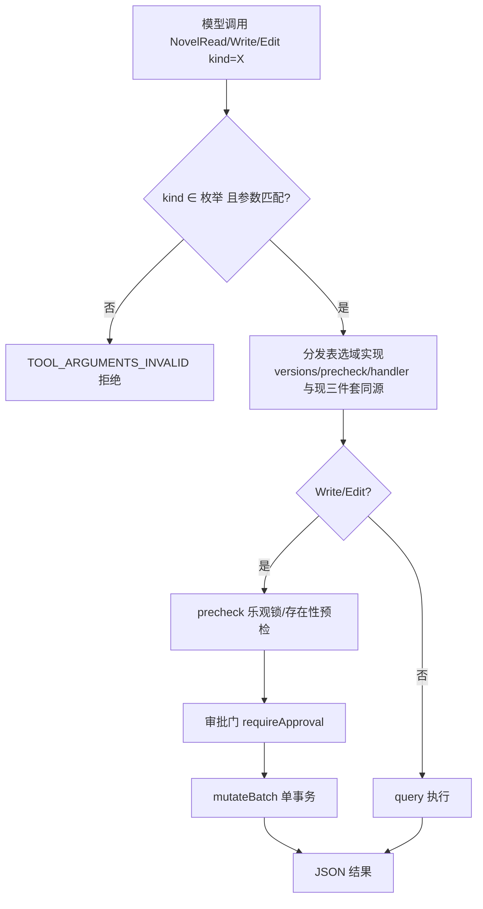

# novel-tools-通用合并 PRD —— v0.1

> 状态：✅ 已定稿（2026-08-17 实施完毕）
> 关联：整体产品 PRD [`产品总览.md`](./产品总览.md)；前序契约 [`novel-tools-legacy-对齐.md`](./novel-tools-legacy-对齐.md)（19 件工具原始契约，本 PRD 收敛其工具面）；技术设计 `docs/architecture.md`

---

## 1. 背景与目标

- 要解决的问题（痛点 / 现状）：
  - novel 域六个实体域 × Read/Write/Edit 三件套 = 18 个工具 + NovelDelete，占主 agent 30 个工具的 63%；
  - 全部 schema 随每次 LLM 请求发送，system prompt 的 tool.policy / tool.guidance 段随工具数线性膨胀，模型选择负担重；
  - 所有按工具名分发的代码（previews / agent 白名单 / 压缩分析 / compose 硬拒绝名单）都要 ×19 维护，新增实体域需复制三份样板。
- 目标（一句话，可验收）：六域三件套收敛为 `NovelRead` / `NovelWrite` / `NovelEdit` 三个通用工具（kind 参数分发），`NovelDelete` 保留；主 agent 工具面 30 → 15；读写路径、审批、预检、乐观锁、批量原子行为零变化（两处受控新增：`kind=overview` 读取、NovelDelete 对 character/location 的 leaf 引用预检，均【已定】）。

### 1.1 核心决策

- **参数字段名与形状零变化**：Read 沿用各域既有 id 字段名（characterId / storyUnitId / …），Write/Edit 沿用 `values:[{...}]` 结构，仅工具名收敛 + 顶层新增 `kind`。
- kind 枚举：`overview | character | location | story_unit | paragraph | volume | chapter`（后六种与 NovelDelete 完全一致；`overview` 为新增——novel-db 已有 `overview.get` 查询，原工具面未暴露，是本次唯一能力新增）。
- **desc 用 Markdown 组织**；「小说数据模型」只在 NovelRead 详述（含实体关联总览），Write/Edit 不重复——开头一行引用（模型每次请求可见全部工具描述）；三工具统一骨架：开头 →（数据模型，仅 Read）→ `## 用法` → `## 返回` → `## 实例`；实例沿用现有 `<example>/<reasoning>` 约定。
- 行为零变化（两处受控新增：`kind=overview` 读取、NovelDelete 对 character/location 的 leaf 引用预检，均【已定】）：读写路径、审批门、precheck 乐观锁、批量原子、compose 硬拒绝语义不变。

## 2. 用户故事

- 作为作者，我希望 agent 工具面更小更稳，以便模型更准地选对工具、减少误调用。
- 作为维护者，我希望新增实体域只需在分发表加一行，不再复制三件套样板。

## 3. 流程图（必填）

### 3.1 主流程



## 4. 功能明细

### 4.1 工具面总览

| 组 | 工具 | 变化 |
|---|---|---|
| runtime.todo / files / ask / novel.compose | TodoWrite, Read, Glob, Write, Edit, AskUserQuestion, Enter/ExitComposeMode | 不变 |
| **novel.entities**（新，合并 6 域组 + novel.delete 组） | **NovelRead / NovelWrite / NovelEdit / NovelDelete** | 19 → 4 |
| 组外 subagent | Agent / TaskOutput / TaskStop | 不变 |

### 4.2 NovelRead（desc 定稿）

```
读取小说正式稿数据，只读。kind 必填选择实体类型；各 kind 用各自的 id 字段，传不适用参数直接报错。

## 小说数据模型

### 大纲（story_unit）
整本书的结构真相源：saga（全书）→ arc（卷级弧）→ sequence → scene 层级树，可按体量省略中间层，但树末端必须是能承载正文的 scene 级单元。正文挂在它上面、发布从它取材、进度沿它滚动。每本书恰好一个大纲、自动存在；你读取与修改的是其中的故事单元（units 平铺返回，层级看 parentId，兄弟序看 orderKey）。
双状态推进：planningStatus（idea→outlined→ready）管规划；realizationStatus（pending→in-progress→completed/abandoned）管写作；父单元进度由叶自动汇总，不手填。
leaf 计划（场景级设计文档，挂 scene 叶单元）：人物/地点绑定、事件序列、节奏拍、实体状态变更——写场景前先读 leaf 保证一致性。

### 段落（paragraph）
正文的唯一载体，挂在 scene 级单元上；不可变追加，修改走 NovelEdit。

### 章（chapter）
发布结构单元：按 paragraphIds 有序选择段落组装正文（可跨单元、可拆分/合并/重排）；volumeId 缺省=未归卷；storyUnitId 仅为来源提示（创建时可带，之后不可改）。

### 卷（volume）
发布结构容器，含章；发布结构根自动存在、无需创建。

### 人物（character）/ 地点（location）
档案实体（name/aliases/summary/initialState/authorNotes），本体没有任何关系字段——人物↔人物、人物↔地点的互相关联全部记录在 scene 的 leaf 计划里（绑定 + 实体状态变更），查关联要去读大纲。

### 实体关联总览
- story_unit → story_unit：parentId（树）、blockState.dependencyIds（依赖）、abandonment.replacementStoryUnitId（替换单元）
- scene.leaf → 人物/地点：characters[].characterId（在场/参与）、locations[].locationId（主/次/提及）、entityChanges（entityId + relatedEntityId——人物↔人物、人物↔地点的关系演变只记在这里）
- paragraph → story_unit：storyUnitId（挂靠）
- chapter → volume（归卷）、→ paragraph（paragraphIds 有序选择）、→ story_unit（来源提示）
- 无反向查询：查「某角色/地点出现在哪些场景」→ 读大纲（includePlans=true）后按 leaf 引用自行过滤。

写作主线：大纲规划（story_unit）→ 场景设计（leaf）→ 写正文（paragraph 挂 scene）→ 发布组装（chapter 选段 + volume 归卷）。

## 用法
- overview：返回 { title, counts: { storyUnits, characters, locations, volumes, chapters, paragraphs } }——开卷、汇报进度先看总览。
- character / location：省略 id 列出全部（含 id/name/entityVersion）；传 characterId / locationId 返回单个完整档案（aliases/summary/initialState/authorNotes）。
- story_unit：省略 storyUnitId 返回全树平铺；传 storyUnitId 返回单个单元；includePlans=true 各单元附 leaf 计划与叶完成度 progress。
- paragraph：传 paragraphId 返回单段；传 storyUnitId 返回该单元全部段落（orderKey 升序）；都省略返回全部段落（按单元分组）。
- volume：无参数，恒返回全部卷（id/title/orderKey，不含章）。
- chapter：省略参数返回全部章；volumeId 过滤某卷；chapterId 只读该章；includeContent=true 附带每章按 paragraphIds 选择取回的正文段落。

## 返回
- 全部结果为 JSON。
- 列表形态返回概要（id/name 或 id/title + entityVersion）；单实体形态返回完整档案。
- entityVersion 是 NovelEdit / NovelDelete 所需 baseRevision 的唯一来源——修改/删除前先读。

## 实例
<example>
作者：继续写
→ NovelRead(kind=story_unit, includePlans=true)
→ 从 progress 定位第一个未完成 scene → 读其 leaf → 按场景设计写正文
<reasoning>先读树确认进度与结构现状，避免凭记忆臆造走向或重写已完成场景。</reasoning>
</example>
<example>
作者：第二卷开头主角在哪？
→ NovelRead(kind=story_unit) 全树 → 沿 arc 下 scene 的 synopsis 与 leaf（地点绑定、实体变更）查证后回答
<reasoning>时间线与人物位置必须查大纲而非凭记忆。</reasoning>
</example>
拿不准就读一次再动手。
```

### 4.3 NovelRead（scheme 定稿）

```json
{
  "type": "object",
  "properties": {
    "kind": { "type": "string", "enum": ["overview", "character", "location", "story_unit", "paragraph", "volume", "chapter"], "description": "实体类型（overview=全书总览；story_unit=大纲单元）" },
    "characterId": { "type": "string", "description": "仅 character：角色 id（省略列全部）" },
    "locationId": { "type": "string", "description": "仅 location：地点 id（省略列全部）" },
    "storyUnitId": { "type": "string", "description": "story_unit：单元 id（省略返回全树）；paragraph：按单元过滤段落" },
    "paragraphId": { "type": "string", "description": "仅 paragraph：段落 id" },
    "chapterId": { "type": "string", "description": "仅 chapter：章 id" },
    "volumeId": { "type": "string", "description": "仅 chapter：按卷过滤" },
    "includeContent": { "type": "boolean", "description": "仅 chapter：附带章的正文来源段落" },
    "includePlans": { "type": "boolean", "description": "仅 story_unit：附带 leaf 计划与叶完成度 rollup" }
  },
  "required": ["kind"],
  "additionalProperties": false
}
```

### 4.4 NovelWrite（desc 定稿）

```
批量创建实体、直接写入正式稿。kind 必填（无 overview——只读）；values 每项新建一个实体，整批原子（任一项失败整批回滚）；需作者审批；传不适用字段直接报错。
数据模型见 NovelRead 的「小说数据模型」（写作主线：大纲规划 → 写正文 → 发布组装）。

## 用法
- character / location：name 必填；aliases 别名列表（≤32 项）；summary 摘要；initialState 初始状态；authorNotes 作者备注（不进正文）。不做重名校验——查重先 NovelRead。
- paragraph：storyUnitId（推荐 scene 级单元，正文落在大纲树末端）+ text（该段完整正文，一个自然段一项，不合并多段）必填；orderKey 可选（4 位大写十六进制组，缺省排到该单元末尾）。
- volume：title 必填（1-500 字）；orderKey 可选（缺省排到末卷之后）。
- chapter：title 必填；volumeId 可选（缺省=未归卷）；paragraphIds 可选（章内段落有序选择，可跨单元、可拆分合并重排，引用段落须已存在，缺省空选择）；storyUnitId 仅来源提示（只在创建时可带）；orderKey 可选（同卷排序）。
- story_unit：title 必填（1-500 字）；parentId 缺省=顶层（必须引用已存在单元——不能引用同批先建项，多层结构分批建）；intent 单元意图；synopsis 情节梗概（数百字量级，勿塞正文）；scope 层级（saga/arc/sequence/scene/custom）；planningStatus / realizationStatus 缺省 idea / pending；blockState / abandonment / leaf 可随创建携带（leaf 引用的角色/地点 id 须已存在）。
- 通用：id 可选自选（^[A-Za-z0-9][A-Za-z0-9._:-]{0,159}$，重复报 duplicate_id）；本工具只新建，修改已有实体用 NovelEdit。建树自上而下分批：arc 先落地拿 id，scene 再挂靠。

## 返回
items 形态：每项 { id: 变更id, status: "applied", version: 新 entityVersion }；自选 id 缺省由宿主生成并在结果回传；整批原子，任一项失败整批不落地。

## 实例
<example>
作者：新书，都市异能，先搭第一卷
→ NovelWrite(kind=story_unit, values=[{ title:"觉醒之卷", scope:"arc", intent:"主角发现能力并卷入第一场冲突", synopsis:"……" }])
→ NovelWrite(kind=story_unit, values=[{ title:"雨夜觉醒", scope:"scene", parentId:<上批返回的 arc id>, synopsis:"雨夜遇袭，能力觉醒", leaf:{…} }])
<reasoning>自上而下分批建树：arc 先落地拿到 id，scene 再挂靠；leaf 随场景创建即挂上，后续写作有一致性约束可依。</reasoning>
</example>
```

### 4.5 NovelWrite（scheme 定稿）

顶层：`{ kind(必填，枚举同 NovelRead 但不含 overview), values(必填, 1-64 项), additionalProperties:false }`。
items 属性（字段名/类型/长度/枚举全部沿用现状，仅并集）：

| 字段 | 适用 kind | 约束（沿用现状） |
|---|---|---|
| id | 全部 | string，ID_PATTERN，可选自选 |
| name / aliases / summary / initialState / authorNotes | character, location | 同现 character/location Write |
| storyUnitId | paragraph（归属，必填）, chapter（来源提示，仅创建可带） | string，ID_PATTERN |
| text | paragraph（必填） | string |
| title | volume, chapter, story_unit（必填） | 1-500 字 |
| orderKey | paragraph, volume, chapter, story_unit | ORDER_KEY_PATTERN |
| volumeId | chapter | ID_PATTERN，缺省未归卷 |
| paragraphIds | chapter | string[] ≤4096，引用须存在 |
| parentId / intent / synopsis / scope / planningStatus / realizationStatus | story_unit | 同现 outline Write |
| blockState / abandonment / leaf | story_unit | 子 schema 原样复用 blockStateSchema(false) / abandonmentSchema(false) / LEAF_PLAN_PROPERTIES |

各 kind 的 items 必填字段（name / storyUnitId+text / title）无法在扁平 schema 表达，由 handler 校验并报 TOOL_ARGUMENTS_INVALID。

### 4.6 NovelEdit（desc 定稿）

```
批量局部更新（PATCH）已有实体。kind 必填（无 overview）；每项 = { id, baseRevision, value }，整批原子；需作者审批。
数据模型见 NovelRead 的「小说数据模型」。

## 用法
- value 只传要改的字段，未提供的保留原值。各 kind 可改字段：
  - character / location：name；aliases（全量替换，[] 即清空）；summary / initialState / authorNotes（null 清空）。
  - paragraph：text（替换后的完整段落文本，非增量片段）；storyUnitId（移动到另一单元）；orderKey（重排）。
  - volume：title；orderKey。
  - chapter：title；orderKey；volumeId（调整归卷）；paragraphIds（全量替换有序选择——拆分/合并/重排/跨单元/中途收章都靠它，null 清空，引用段落须已存在）。来源提示 storyUnitId 创建后不可改。
  - story_unit：title；intent；synopsis；scope；planningStatus；realizationStatus；parentId（换父，null=移到顶层）；orderKey（兄弟重排）；blockState（null 清除）；abandonment（null 清除）；leaf（null 删整个计划；字段级替换，集合字段传 null 清空）。

## 返回
items 形态（同 NovelWrite：变更 id + applied + 新 entityVersion）；baseRevision 预检过期时整批拒绝并附当前版本——重读后再提交，勿原样重试。

## 实例
<example>
一个场景写完，开写下一个：
→ NovelEdit(kind=story_unit, values=[
  { id:<scene-A>, baseRevision:<v>, value:{ realizationStatus:"completed" } },
  { id:<scene-B>, baseRevision:<v>, value:{ realizationStatus:"in-progress", planningStatus:"ready" } } ])
<reasoning>写完立即标 completed、下一个标 in-progress；父 arc 与全书进度由叶单元自动汇总，不手动改父单元。</reasoning>
</example>
写/改正文用 kind=paragraph，不入大纲字段。先读后改。
```

### 4.7 NovelEdit（scheme 定稿）

顶层：`{ kind(必填，枚举同 NovelRead 但不含 overview), values(必填, 1-64 项), additionalProperties:false }`；items 必填 `["id", "baseRevision", "value"]`（六域统一）。value = 各域 patch 字段并集，与 store patch 契约逐字段一致（chapter patch 无 storyUnitId——来源提示不可改；nullable 语义同现状：summary/initialState/authorNotes、volumeId、paragraphIds、parentId、blockState、abandonment、leaf 等 null 清除/清空；leaf 用 nullableProps(LEAF_PLAN_PROPERTIES) 补丁形态）。子 schema 全部原样复用现有定义。

### 4.8 NovelDelete

基本不变（已是 kind 分发形态）；desc 内「对应 Read 工具」措辞改为「NovelRead」。

**本期新增：character / location 的 leaf 引用预检**（补现状缺口——原实现删除被 leaf 绑定的角色/地点会留悬空引用）：

- 触发：NovelDelete precheck（审批提交前），values 含 kind=character / location 的项。
- 处理：拉取大纲全树（outline.get, includePlans=true），正向扫描各 scene 的 leaf——`characters[].characterId`、`locations[].locationId`、`entityChanges[].entityId / relatedEntityId`。
- 输出：命中即整批拒绝（TOOL_PRECHECK_FAILED），错误信息列出引用该实体的全部场景单元 id 与引用方式（绑定/实体变更）。
- 异常与回退：cascade **不豁免**本检查（cascade 只作用于 story_unit/volume/chapter 的结构级联；leaf 引用须先经 NovelEdit 显式清理后再删）。段落正文文本中提及角色/地点名称不算引用——仅结构化 id 引用受检。
- desc 同步补充该规则一行。

### 4.9 实现要点与改造波及清单

1. `runtime/tool/definitions/novel.ts`：三件套重写为 3 工具 + kind 分发表（每域 versions/precheck/buildMutations 同源搬移；NovelDelete 的 kindToOp 模式推广）；kind 与参数不匹配报 TOOL_ARGUMENTS_INVALID；NovelRead 新增 kind=overview 分支（对接 overview.get）；NovelDelete precheck 新增 character/location 的 leaf 引用检查（outline.get includePlans 正向扫描，命中整批拒绝，见 §4.8）
2. `runtime/tool/groups/NovelToolGroups.ts`：七组（6 域 + delete）→ 新组 `novel.entities`（catalog + factories）
3. `runtime/agent/definitions/NovelAgentDefinition.ts`：groupIds 七项 → `"novel.entities"`
4. `NovelExplorerAgentDefinition.ts` / `NovelComposeAgentDefinition.ts`：groupIds → runtime.files + novel.entities + runtime.todo；allow → `[Read, Glob, NovelRead, TodoWrite]`
5. `core/src/conversation/compose/canonicalTools.ts`：CANONICAL_NOVEL_WRITES 13 名 → `{NovelWrite, NovelEdit, NovelDelete}`
6. `runtime/tool/previews.ts`：新增 4 个按 call.args.kind 分派的 preview（NovelRead/Write/Edit；overview 用「读取/总览」缺省渲染）；**19 个旧域 preview 函数与注册保留**（live 投影走新名，历史 journal 重投影仍按旧工具名取 preview，逐字节一致前提不破坏）
7. `runtime/compact/definitions/auto-compact-analyze.ts`：工具名集合换新名；**保留旧名识别**（历史会话消息仍是旧工具名，压缩扫描需兼容）；读分支 *Id 扫描因字段名未变天然兼容
8. 文案更新：`runtime/prompt/sections/novel.ts`、`runtime/tool/definitions/askUser.ts` 等所有旧工具名引用 → 新名（带 kind）
9. 测试同步：`runtime/tool/definitions/__tests__/novel.test.ts`、`runtime/tool/__tests__/tool-previews.test.ts`、`runtime/agent/__tests__/novel-agent.test.ts`、`novel-compose.test.ts`、`agent-render-e2e.test.ts`、`runtime/compact/__tests__/auto-compact.test.ts`
10. `docs/architecture.md` 工具清单更新；`novel-tools-legacy-对齐.md` 标注被本 PRD 收敛

## 5. 边界与非目标

- 明确不做：
  - 不动 runtime.files / todo / ask / compose 组与 subagent 三件套（Glob、TaskOutput/TaskStop 合并留待下期评估）
  - 不改 NovelHandle 契约、query/mutate 语义与乐观锁行为；预检唯一变化为 §4.8 的 character/location leaf 引用检查；store 现有 `outline.storyUnit.move` op 继续不暴露（Edit 的 parentId/orderKey patch 等价表达）
  - 不做旧会话工具调用迁移：历史消息旧工具名仅作展示与压缩分析兼容，不重放执行

## 6. 验收标准

- [ ] 主 agent 装配工具数 = 15；Explore/Compose allow = {Read, Glob, NovelRead, TodoWrite}
- [ ] 六域读/写/改/删经新工具的行为与现三件套逐域等价（现有测试改写通过 + 新增 kind 校验/不匹配参数拒绝用例）
- [ ] NovelRead kind=overview 返回标题与六实体计数
- [ ] 删除被 leaf 引用（绑定/实体变更）的 character/location 被预检拒绝，错误信息列出引用场景单元 id；清理引用后可正常删除
- [ ] compose 激活时 NovelWrite/NovelEdit/NovelDelete 被硬拒绝
- [ ] auto-compact 对新旧工具名的 read/write 元数据解析均正常（含旧会话回放）
- [ ] previews 对四个 novel 工具按 kind 正确渲染
- [ ] desc 结构：NovelRead 含完整「小说数据模型 + 实体关联总览」；Write/Edit 不重复模型，仅一行引用；三工具均为 用法/返回/实例 md 骨架

## 7. 开放问题

- 已决策（2026-08-17）：NovelDelete 本期补 character/location 的 leaf 引用预检（见 §4.8）；overview 保留。
- 升级瞬间已入队的旧工具名审批请求：倾向直接拒绝（工具不存在）并提示重开会话（审批队列瞬态、影响面小）
- 主 agent 15 个工具是否仍偏多（subagent 三件套、Glob）：留待下期
