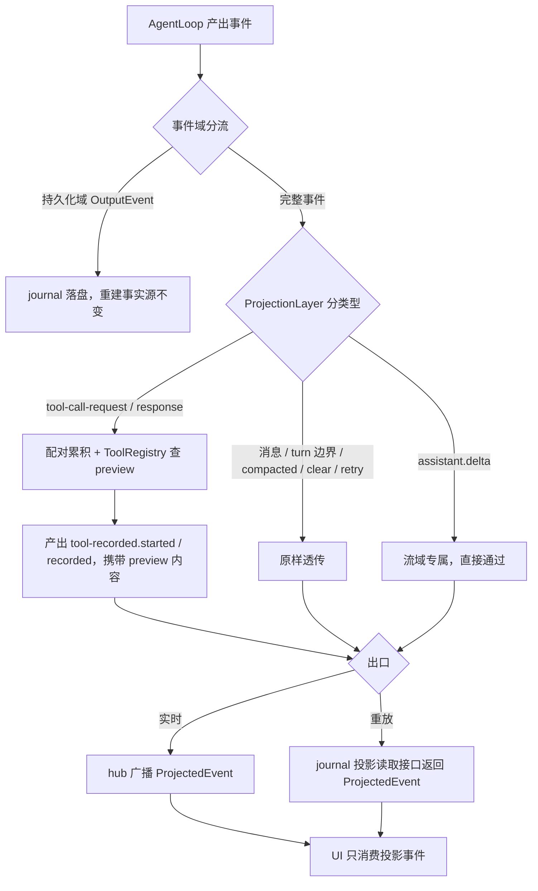
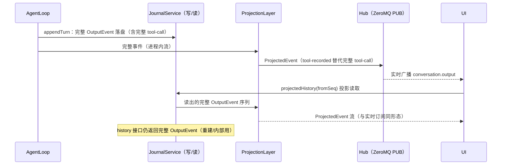
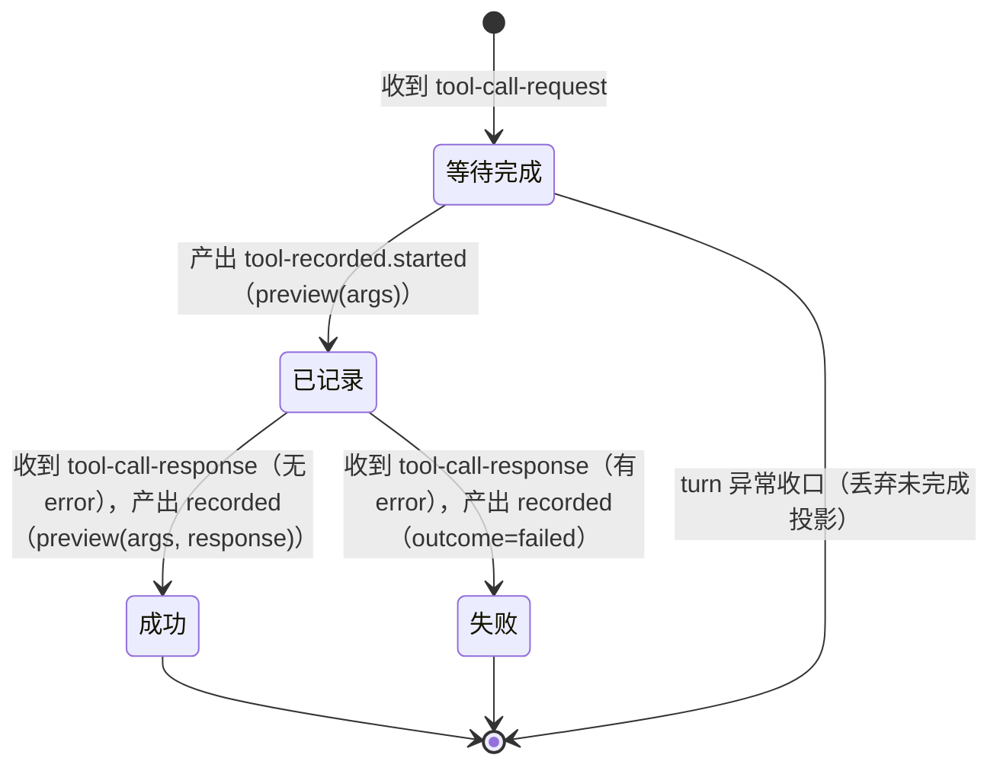

# output-投影层 PRD —— v0.1

> 状态：✅ 已定稿
> 关联：整体产品 PRD [`产品总览.md`](./产品总览.md)；协议 [`../development/ipc-协议.md`](../development/ipc-协议.md)；技术设计 `docs/architecture.md`
>
> **事件域区分（已定稿，记录于 ipc-协议.md）**：`OutputEvent` = 持久化事件（journal 重建事实源）；`ProjectedEvent` = 事件流投影（hub 广播 + 投影读取）。`OutputEvent` 可映射到 `ProjectedEvent`（投影层实现），反向**不可逆**（投影丢失完整 args/result）。

---

## 1. 背景与目标

- 要解决的问题（痛点 / 现状）：
  - **重建与展示两种形态未分离**：`OutputEvent` 同时承担「重建消息历史」（journal 事实源）与「UI 展示」两种职责。hub 把完整 `tool-call-request`（args 可能是整段正文等大 JSON）和完整 `tool-call-response`（完整 result/error）原样广播给 UI，前端实际只需要展示摘要。
  - **投影逻辑长在客户端**：`ConversationProjection`（core/src/client）消费完整事件，在 UI 侧派生 timeline / toolTraces / eventFlow / cards。UI 被迫依赖完整工具数据才能跑通投影，且换一个客户端（如将来 CLI）投影逻辑要重写。
  - **journal 读取路径无投影形态**：history 重放走 journal 读取服务返回完整事件，与实时订阅形态不一致，UI 需要两套处理逻辑。
  - **工具展示无定制能力**：卡片/工具条摘要来自客户端通用截断（`CardProjection.summaryOf`），工具作者无法定制自己记录的展示内容。
- 目标（一句话，可验收）：拆分事件域——`OutputEvent`（持久化/重建）与 `ProjectedEvent`（流/展示）两个独立类型集；conversation 域增加**投影层**把完整事件映射为投影事件，工具调用以 `tool-recorded.started/recorded` 双事件替代完整 request/response；hub 实时流与 journal 投影读取两条路径共用同一投影实现、产出同一形态；每个 tool 可经 `preview` 方法定制自己的投影内容。

---

## 2. 用户故事

- 作为前端开发者，我希望订阅会话输出流只收到展示所需的最小数据（消息 + turn 边界 + 工具投影），以便渲染逻辑简单、不处理无关大字段。
- 作为创作者，我希望工具执行过程可见（进行中 → 完成/失败 + 耗时 + 定制摘要），以便了解 AI 正在做什么、每步花了多久。
- 作为会话恢复场景的使用者，我希望重新打开会话看到的历史与当时实时看到的形态一致，以便体验无割裂。
- 作为工具作者，我希望为自己的工具声明 `preview` 方法定制 `tool-recorded` 的展示内容，以便创作者看到领域语义（如「写正文：第 3 章」）而非原始 JSON 截断。

---

## 3. 流程图（必填）

### 3.1 主流程

### 3.2 多主体交互

### 3.3 状态流转（工具调用投影）

---

## 4. 功能明细

### 4.1 事件域拆分：`OutputEvent` / `ProjectedEvent`（独立类型集）

- 触发：定义两个独立事件类型集（core/src/conversation/contract/events/ 下新增 `projected.ts`；`output.ts` 收敛为持久化域）。
- 输入：无。
- 处理：
  - **`OutputEvent`（持久化域，默认持久化事件）**：`user.message` / `assistant.message` / `tool-call-request`（完整 args）/ `tool-call-response`（完整 result/error）/ `turn-start` / `turn-end` / `compacted` / `clear` / `retry-request`。
    - **删除** `approval.request` / `approval.resolved`（wait 状态唯一权威是 CMS 队列；现无产出点，仅剩类型定义、`ApprovalProjection` 与测试，一并清理）。
    - **移出** `assistant.delta`（流式增量是流域专属，不参与重建；AgentLoop 产出侧分流）。
  - **`ProjectedEvent`（流域，hub 广播与投影读取形态）**：
    - 原样复用：`turn-start` / `turn-end` / `user.message` / `assistant.message` / `assistant.delta` / `compacted` / `clear` / `retry-request`。
    - 投影替代（取代 `tool-call-request/response`）：
      - `tool-recorded.started`：`{ type, seq, toolCallId, name, preview?, conversationId, agentId?, ts }`——工具开始执行时发出；`preview` 为 preview(args) 输出的开始预览；`seq` 为源 turn seq（UI 归属/去重/分页必需）。
      - `tool-recorded.recorded`：`{ type, seq, toolCallId, name, outcome: "ok" | "failed", preview?, error?, durationMs?, conversationId, agentId?, ts }`——工具完成时发出；`preview` 为 preview(args, response) 输出的完成预览；`error` 为失败短信息（截断，非完整 error）；`durationMs` 为 request→response 耗时；`seq` 同 started。
    - **不含** `tool-call-request` / `tool-call-response` / approval 事件。
  - **映射关系**：`OutputEvent` → `ProjectedEvent` 由投影层实现，确定、可重放；反向不可逆（投影是摘要，丢失完整 args/result）。
- 输出：两个独立类型集 + 导出；`OutputEvent` 只被 journal/重建/内部消费，`ProjectedEvent` 只被 hub/UI 消费。
- 异常：无（纯类型契约）。

### 4.2 ProjectionLayer 投影层（conversation 域，单一实现）

- 触发：每条完整 `OutputEvent` 进入投影层（live 流：接在 `Conversation` 事件分发处；投影读取：journal 读出的事件序列喂入同一投影器）。
- 输入：完整 `OutputEvent` 流。
- 处理：
  - `tool-call-request` → 记 pending（toolCallId → name/ts），查 `ToolRegistry` 对应 `ToolDef.preview` 产出开始预览，发出 `tool-recorded.started`。
  - `tool-call-response` → 配对 pending，调 preview(args, response) 产出完成预览，发出 `tool-recorded.recorded`（outcome / durationMs / preview / 截断 error）。
  - 其余事件 → 原样透传；`assistant.delta` 直接从流域通过。
  - **确定性**：同一段完整事件序列重投影，产出序列一致（投影读取路径依赖此性质）。
- 输出：`ProjectedEvent` 流。
- 异常：turn 异常收口时未配对的 pending 丢弃（不产出 recorded）；response 找不到 request 时仍产出 recorded（name 取 "unknown"、无 preview、默认摘要）；preview 抛错按默认回退（4.3），不得影响 loop。

### 4.3 tool preview 定制（ToolDef 扩展）

- 触发：工具作者需要定制 `tool-recorded` 展示内容。
- 输入：`ToolDef` 增加可选 `preview` 方法：`preview(call: { args: string }, response?: { result?: string; error?: string }) => { title?: string; summary?: string }`。
- 处理：
  - ProjectionLayer 按工具名查 `ToolRegistry` 取 `preview`，产出 `tool-recorded.started.preview`（preview(args)）与 `tool-recorded.recorded.preview`（preview(args, response)）。
  - 建立于 tool-call OutputEvent → ProjectedEvent 的映射：preview 只影响投影流，**不影响 journal 完整数据与重建**。
  - 默认回退：未声明 preview 的工具用通用截断（args ≤ 120 字符；响应按 outcome 给「执行完成/执行失败」）。
- 输出：`tool-recorded` 事件携带工具定制的 `preview` 字段。
- 异常：preview 抛错/返回非法值 → 丢弃定制内容、按默认回退，投影流不断裂。

### 4.4 出口一：hub 实时广播

- 触发：订阅者在线（UI 聚焦会话）。
- 输入：ProjectionLayer 产出的 `ProjectedEvent`。
- 处理：广播投影事件流。transport 现状维持 kkrpc `subscribeEvents` 回调，ZeroMQ `conversation.output` 接线沿用既有待办（本 PRD 不改 transport，只改广播内容形态）。
- 输出：订阅者收到 `ProjectedEvent`；其中**不含** `tool-call-request/response` 与 approval 事件。
- 异常：slow joiner 错过照旧靠投影读取重查兜底（4.5 路径保证形态一致）。

### 4.5 出口二：journal 投影读取（两个读取接口区分）

- 触发：UI 打开/恢复会话，发起 history 查询；或任何读取方需要投影形态的历史。
- 输入：`fromSeq` / `limit` 查询参数。
- 处理：
  - journal 读取侧（contract + `FileConversationJournalReadOnlyService`）提供**两个接口**：
    - `history` → 返回完整 `OutputEvent`（重建/内部用，现状不变）；
    - `projectedHistory` → 读 journal 完整事件 → 过同一 ProjectionLayer → 返回 `ProjectedEvent` 流。
  - `ProjectedEvent` 始终可由 `OutputEvent` 重建，无独立投影持久层；conversation 进程与 Main 代读用同一 service 类、同一投影实现 → 实时订阅与投影读取形态一致。
  - 范围起点不在 turn 边界时按确定性规则处理（配对缺失 → "unknown"），不产生跨范围状态依赖。
- 输出：UI 收到的 history 与实时订阅形态一致（`ProjectedEvent`，无 tool-call 完整事件）。
- 异常：投影失败按 RPCError 归一返回；读取范围跨 journal 半行等既有容忍不变。

### 4.6 journal 落盘策略（不变性）

- 触发：`OutputEvent`（持久化域）产生。
- 输入：完整 `OutputEvent`。
- 处理：**本 PRD 不改 journal**。`tool-call-request/response` 完整字段（args/result/error）仍落盘，作为重建消息历史的事实源；`ProjectedEvent` 一律瞬态、不写 journal。
- 输出：journal 内容与既有测试断言一致。
- 异常：无。

### 4.7 UI 侧消费改造

- 触发：UI 订阅会话输出 / 渲染 timeline。
- 输入：`ProjectedEvent` 流（实时 + 投影读取）。
- 处理：
  - `ConversationProjection` 简化为消费投影事件：删除 `tool-call-request/response` 分支与 `pendingTraces` 派生，`toolTraces` / `eventFlow` 直接由 `tool-recorded.started/recorded` 驱动（started → 进行中行；recorded → outcome/耗时/预览行）。
  - `CardProjection` 摘要改用 `tool-recorded.recorded.preview`，删除客户端 args 截断逻辑。
  - `ApprovalProjection` 删除（事件类型已删；审批面板由 CMS 队列驱动，`ui/src/domains/approval` 已有独立 store）。
- 输出：UI 渲染形态与现状一致（工具条进行中 → 完成/失败、卡片、timeline），信息量不减、摘要更语义化。
- 异常：投影事件缺字段（如 recorded 缺 preview）按可选字段降级渲染。

---

## 5. 边界与非目标

- 明确不做：
  - **不改 journal 落盘子集与完整事件形态**：重建能力（恢复/重放/agent 上下文重建）依赖完整 tool-call 事件，保持现状。
  - **不做投影物化落盘**：sqlite 读模型（projection 表）另立需求；本期投影纯瞬态、由 `OutputEvent` 重投影。
  - **不做 delta chunk 聚合**（既有暂缓项，与投影层无关）。
  - **不改 transport 接线**：ZeroMQ hub 迁移沿用既有待办，本 PRD 只改广播内容形态。
  - **不动 wait 通道**：approval 事件删除仅限事件集、投影器与测试；CMS 队列 / `sendApprovalRequest` / `resolveApproval` 通道不动。
  - **subagent 输出投影**不在本期范围（进程内，无独立持久化，现状维持）。

---

## 6. 验收标准

- [ ] `OutputEvent` 与 `ProjectedEvent` 为两个独立类型集；`OutputEvent` 不含 `assistant.delta` 与 approval 事件。
- [ ] hub 实时订阅流中**不出现** `tool-call-request` / `tool-call-response`；工具调用仅以 `tool-recorded.started` + `tool-recorded.recorded` 成对出现。
- [ ] journal 读取侧两个接口区分：`history` 返回完整 `OutputEvent`；`projectedHistory` 返回 `ProjectedEvent`，且与实时订阅形态一致。
- [ ] journal 中 `tool-call-request/response` 完整字段（args/result/error）不变，既有 journal 测试全绿。
- [ ] 同一段 journal 完整事件重投影两次，产出投影序列一致（确定性）。
- [ ] `turn-start` / `turn-end` / `user.message` / `assistant.message` / `assistant.delta` 在投影流中照旧出现。
- [ ] 声明了 `preview` 的工具：started/recorded 携带其定制预览内容；未声明的工具按默认截断回退；preview 抛错不影响 loop。
- [ ] UI 工具条：started 显示「进行中」，recorded 显示 outcome / 耗时 / 预览；卡片渲染信息量不减。
- [ ] approval 事件类型、`ApprovalProjection` 与相关测试清理完毕，wait 通道（CMS 队列）回归通过。
- [ ] core 259 用例（47 文件）+ ui 全量回归通过（涉及事件形态断言的用例同步更新）。

---

## 7. 开放问题

- 无（v0.1 已全部确认）。
