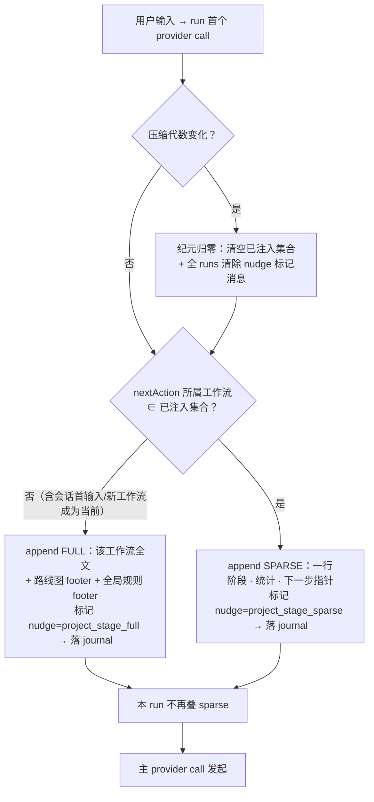
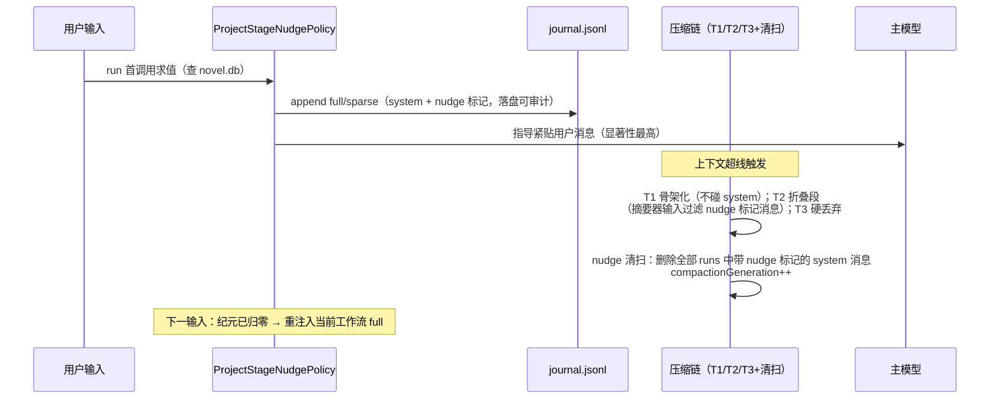
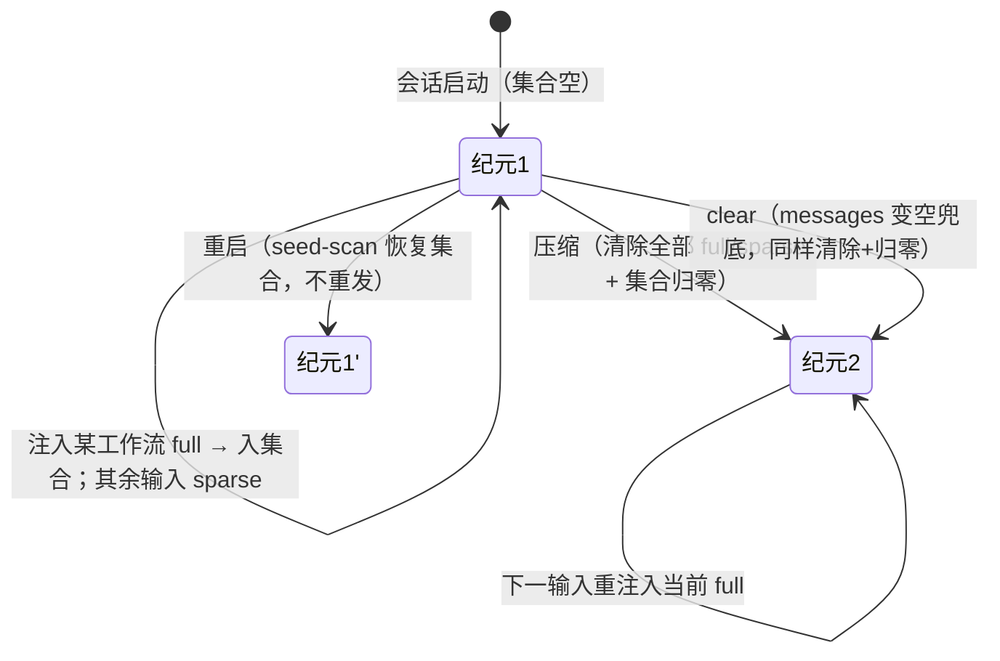

# project_stage nudge（项目状态工作流引导）PRD —— v2.4

> 状态：✅ 已定稿并实现（2026-08-17，v2.0 落地：core 604 用例全绿 + evals 19 全绿 + typecheck 通过；F10 经核实由既有事件词表天然满足——时间线事件仅 user/assistant，system 本就不进 UI，nudge 标记保留为未来守卫；v2.1 2026-08-18：工作流生成环节默认倾向设计模式 + Compose 子代理生成，core 全量回归绿；v2.2 2026-08-18：工作流全文精简（去与工具描述/规范层重复的解释性文字，保留全部可执行指令）+ 开书默认经设计模式派 Compose 构思故事构建方案（与大纲/正文对齐），core 711 用例全绿；v2.3 2026-08-18：开书分节推进（五节逐节委派/逐节确认，绝不一次成套输出）+ 全局规则新增「分节确认」条目全工作流通用，core 711 用例全绿；v2.4 2026-08-18：full 尾部注入「本工作流参考案例」footer——main agent 可见案例路径（按需 Read 对照/委派 Compose 时点名），core 回归绿）
> 关联：[`产品总览.md`](./产品总览.md) §4.3；[`compose-审批流.md`](./compose-审批流.md) F9（full/sparse 先例）；[`context-compact.md`](./context-compact.md)（T1/T2/T3）；[`compose-案例引导.md`](./compose-案例引导.md)（Compose 子代理案例注入，联动）
> 演进：v1.0 瞬态头注（重启/压缩/clear 全量注入）→ v2.0 **persistent append 通道 + full/sparse 双密度 + 逐步注入 + 压缩强制清除 + UI 不展示** → v2.1 **生成环节倾向化**（开书候选可委派 Compose；大纲/正文默认经 EnterComposeMode + Compose 子代理生成，零星小调整保留直改出口；设计模式 Phase 3 收紧为"默认派"）→ v2.2 **开书对齐 + 全文精简**（开书默认经设计模式派 Compose 出故事构建方案；四份工作流全文删除与工具描述/规范层重复的解释性文字，保留全部可执行指令）→ v2.3 **开书分节推进**（故事构建拆五节逐节委派/逐节确认，绝不一次成套输出；全局规则新增「分节确认」全工作流通用）→ v2.4 **full 案例路径注入**（工作流→案例 task_type 前缀映射：开书=world-/character-/outline-、大纲=outline-/act-/scene-、正文=prose-；footer 附于全局规则之后；索引经 node 层 provider 注入，缺失/异常不附不阻断）

## 1. 背景与目标

- v1 三弱点：①全量注入（开书一次灌三块，与"谢谢"不匹配）；②头注随对话变长注意力衰减；③两次触发间状态陈旧。
- v2 目标（一句话，可验收）：project_stage 的全部注入走 **persistent append**（用户消息后、落 journal、可审计），按 **full/sparse 双密度**供给——**full 只注入当前所属的那一份工作流、每种在一个纪元内只出现一次**，其余每个输入一行 sparse 心跳；**压缩把 full/sparse 全部清除并将计数归零**，之后按需重注入；**UI 会话流不展示这些消息**。

## 2. 用户故事

- 作为创作者，我希望每条消息旁都有一行最新项目状态与下一步（sparse），AI 永远不迷路——但我不需要看见这些内部指导。
- 作为创作者，我希望 AI 只在真正开始某类工作时收到一次该工作流的完整作业指导（full），不重复轰炸。
- 作为创作者，上下文被压缩后，我希望旧的指导残留被彻底清掉、按当前进度重新给一份，而不是摘要里混着过时指令。

## 3. 流程图（必填）

### 3.1 run 首调用求值（persistentNudgeIfNeeded，curTurn===0 门控）

### 3.2 消息生命周期（含压缩清除）

### 3.3 纪元（epoch）状态机

## 4. 功能明细

### F1 通道与位置

- 注入走 `loop.appendRunMessages`（persistent，落 journal）；**移除 v1 的瞬态头注 unshift 通道**（`transientNudgeIfNeeded` 恒 false；接口 async 能力保留给 compose）。
- 位置：当前 run 内、用户消息之后——邻接输入，注意力最高；持久化附带审计红利（journal 里每轮留着"模型当时看到的状态"）。

### F2 full：每纪元每工作流一次、只注当前那份

- **full ≠ 工作流集合**，只注入 `nextActionOf(state)` 所属的那一份（collect / outline / prose / wrapup 四选一）。
- **每种在一个纪元内只出现一次**（策略内集合去重）：会话首输入注入当前工作流；此后仅当"新工作流首次成为当前"时注入该工作流；已注入过的再次成为当前不重注（由 sparse 指针覆盖）。
- 重臂来源 = 纪元重置（F4）。
- 内容 = 工作流全文（F7）+ 路线图 footer（四工作流入口条件一行化）+ 全局规则 footer（F8）。
- 查询失败：静默跳过并 arm 下次重试，绝不阻断 provider call。

### F3 sparse：每输入一行心跳

- 其余每个用户输入 append 一行：`【项目状态】大纲细化 · 故事 12/30 不可再分 · 下一步：细化 S17（补 5 要素）`。
- full 所在 run 不叠 sparse。每轮必发（recency 即价值，一行 ~50 token 不构成噪音/习惯化）。

### F4 纪元与重置

- **纪元 = 自上次压缩**。`compactionGeneration` 变化 → 清空已注入集合 + 下一输入重注入当前 full。
- **重启**：journal 重放带回历史 full/sparse；策略构造时 seed-scan 已恢复的 full 种类入集合（幂等，不重发；纪元延续）。
- **clear 兜底**：messages 非空→空 → 等同纪元重置（未来接线即生效）。

### F5 压缩强制清除（硬要求）

- `SystemMessage` 增可选标记 `nudge?: string`，本策略写 `project_stage_full` / `project_stage_sparse`（wire 无关：适配器转译时忽略该字段；journal JSONL 原样保留）。
- 压缩链三档全兼容：T1 不触碰 system（不变）；**T2 摘要器输入过滤掉带 nudge 标记的消息**（防指导文本污染摘要/浪费摘要预算）；T3 硬丢弃自然移除。
- **清扫步**：任一压缩发生后（compactIfNeeded/compactAll 返回 true 的路径上），遍历全部 runs **删除所有带 nudge 标记的 system 消息**（system 无 toolCall 配对约束，可安全删）。
- 只有 project_stage 使用该标记；compose_mode / todo_idle / steer 的 system 消息不受清扫影响。

### F6 nextActionOf 派生（纯函数）

- 输入 units+counts：无故事单元 → collect；存在未细化故事 → outline（带目标：第一个未细化故事）；全部已细化有未写 → prose（第一个未写）；全完 → wrapup。
- 种子已固化但尚无故事单元的窗口期：仍 collect，指针为"建首个故事（进入大纲细化）"（策略不读文件）。

### F7 三份工作流全文（作者定稿 spec；v2.1 生成环节默认倾向设计模式 + Compose 子代理）

**开书**（作者定稿文案）：入口=尚无已确认的故事核（项目可能已有零散设定或旧稿）；用一次 AskUserQuestion（≤2 问）采集一句话创意（开放填空，绝不配选项）＋目标篇幅与每章推荐字数（冷启动不带「推荐」）；规划可逐步展开：先固化故事核与创作范围（如先定第一卷），其余后续再说，不要求一次定完全书；**默认经设计模式（EnterComposeMode）分节推进故事构建**：拆成固定五小节——① 主角（性格/身份/金手指）② 灵魂设定（创意核心意象）③ 世界观与力量体系 ④ 基调与书名 ⑤ 故事核汇总（NOVEL.md 固化清单）——每节派 Compose 子代理出候选（一次只委派当前小节，prompt 只要求该节内容，节内可并列 2-3 个候选），主代理审阅修订后写入设计草稿并**只向作者呈现当前一节**，作者确认或修正后才进入下一节，绝不一次输出成套方案；五节确认完毕后 ExitComposeMode 审批应用，故事核固化清单按要求写入 NOVEL.md 或者正式稿（与作者的问答互动必须主代理本人完成）。

**大纲·逐步细化**：故事与场景同构——能拆成 ≥2 个各自独立情绪转折的块就继续拆，不能拆=不可再分（=planningStatus ready + leaf 5 要素完整）；每次操作一个故事（最靠前或作者指定）；**拆分方案默认经设计模式（EnterComposeMode）派 Compose 子代理生成**（委派 prompt 写明目标故事、细化范围与串联要求），主代理审阅修订后写入设计草稿、ExitComposeMode 审批应用；方案形态=每个子故事一句话核心事件+情绪走向 → 检查四种串联（因果/情绪对比/悬念牵引/目标递进）→ 不可拆则补 5 要素；方向性分歧或跨卷大结构先 AskUserQuestion 确认再进设计模式；零星小调整（如补单个要素）保留直改出口；每轮检查情绪曲线（无连续 3 个同强度）与坏特征；向作者展示请求确认；可重复执行不要求一次完成（作者可指定细化范围，如先细化第一卷，其余后续再说；不要求一次规划完全书）；单故事/整体两档完成标准；种子生长直接补 NOVEL.md 告知不视为回退；批量细化与跨卷结构调整同走设计模式。

**正文**：入口=≥1 个不可再分+5 要素（不要求全部细化完）；按书序（或作者指定范围，如第一卷内）定位第一个未完成故事，读其 5 要素与前后故事情绪标签；**默认经设计模式派 Compose 子代理成文**（委派 prompt 写明 5 要素、情绪走向与前后衔接），主代理对照「正文规范」审阅修订后写入设计草稿、ExitComposeMode 审批后写入正式稿定稿（小改重写可不经设计模式直改）；三态审阅（对应审批决议）——通过→completed／小改→当场改再提交／大改→改要素重新成文；最多两轮，仍不满→标 blocked 跳下一个；写完检查下一个故事已细化→继续/未细化→先细化一轮。发布组装延后：写作中不切章，每 10-15 个故事统一组装（按情绪节点切章、大弧线归卷），组装结果可调整。降级三档：要素小问题就地补／要素大问题改后重写／故事核根本问题=唯一重跑开书且必须告知原因。

### F8 全局规则 footer（随每份 full 注入）

不重复问／不阻塞（拒绝=记录+标注风险+继续）／不静默回退（重跑上阶段必须告知原因）／种子生长不是回退／逐步展开（规划不要求一次定完，作者指定先做范围时以此为准，其余后续再说）／分节确认（成套设计按小节推进，每节只呈现该节候选（可并列 2-3 个供选），作者确认或修正后再进入下一节，绝不一次输出全套方案——成套输出的纠正成本远高于逐节确认的往返成本）／不硬写（足够=5 要素完整而非完美）／情绪优先（一切决策以情绪效果为第一判据）。

### F9 规范层（已实现，不动）

`novel.story_appeal` / `novel.outline_standard` / `novel.prose_standard` 三个 PromptSection 常驻（novel+Compose 共享），工作流按名引用。

### F10 UI 不展示（本批定稿）

- 带 `nudge` 标记的消息**不进会话流渲染**——UI 投影层（CardProjection/ProjectionLayer）过滤该标记，用户看不到 full/sparse。
- 可见性仅保留在两处调试面：journal.jsonl 与 provider-calls 调试器（jsonl/html）。

### F11 配套

- `askUser.ts` desc 豁免句："同一轮该问的一次问完；跨轮派生式提问由工作流驱动（逐步补充/逐步细化），不视为连环追问"（Tier 0 快照同批更新）。
- `LoopContext.compactionGeneration` 保留（纪元信号）；`persistentNudgeIfNeeded` 接口放宽为 async（查询 novel.db）。

## 5. 边界与非目标

- 不做 fast 模型意图分类（按需性由"每输入 sparse + 主模型自路由"获得，确定性零延迟）。
- 移除瞬态头注通道（v1 机制废弃，PRD 记录演进）。
- 设计模式与 Compose 子代理为开书/大纲/正文三工作流的生成默认路径，零星小调整保留直改出口；收尾工作流不经设计模式。
- 不新增 DB 字段；不动规范层三 section；UI 只做过滤不做展示样式。

## 6. 验收标准

- [x] 会话首输入：append 当前工作流 full（带双 footer、nudge 标记落 journal）；同工作流期内后续输入全部 sparse；无重复 full。
- [x] 阶段推进到新工作流：该输入 append 新工作流 full，一次。
- [x] 已注入工作流再次成为当前：不重注 full，sparse 指针指向它。
- [x] 压缩后：全部 full/sparse 消失（LoopContext 清扫两路径 + T2 摘要输入过滤，均有单测）；下一输入重注入当前 full；计数从零。
- [x] 重启：seed-scan 恢复集合，不重发 full；sparse 照常。
- [x] UI 会话流不出现 nudge 消息（核实：时间线事件词表仅 user/assistant，天然满足；nudge 标记保留为未来守卫）。
- [x] 查询失败静默重试；transient 恒 false（不动 call.messages）。
- [x] `pnpm --filter @novel/core test`（604 全绿）+ `pnpm --filter @novel/core build` + evals（19 全绿，快照更新）+ typecheck 全绿。（2026-08-17 验证）

## 7. 开放问题

1. ~~T2 摘要过滤与清扫的回归用例~~（已补：`stripNudgeMessages` 单测 + LoopContext 清扫两路径测试）。
2. sparse 是否需要"内容不变则跳过"去重（当前结论：不去重，recency 优先）。

> 已确认记录（2026-08-18 第九批，full 尾部注入「本工作流参考案例」footer）：①工作流→案例映射按 task_type 前缀（作者定稿分组）：开书=world-（世界观设计）/character-（人物设计）/outline-（总纲）；大纲=outline-（总纲）/act-（大纲细化·幕）/scene-（大纲·场景）；正文=prose-（撰写 + 各类摘录）；收尾不附——前缀匹配对后续新增案例自动生效；②footer 附于全局规则之后：「## 本工作流参考案例（.novel/cases/，按需 Read 对照；委派 Compose 时可在 prompt 中点名）」+ 过滤后索引行（路径｜标签｜摘要）；③接线：renderAgentCasesIndex 迁至 runtime 层（composeGuide/caseIndex.ts，node 层 re-export），entrypoint 组装 agentCaseIndexProvider（与 Compose builder 共用进程级 seed + mtime 缓存扫描）经 buildNovelAgent → nudge catalog → ProjectStageNudgeDeps.caseIndexProvider 注入；④降级：provider 缺失/扫描异常/过滤为空 → 不附 footer 不阻断（full 其余部分照常）；sparse 不附；seed-scan 反查按工作流 header 前缀不受影响；⑤动机：案例库此前仅 Compose 子代理可见（novel-guide 索引在其 system prompt），主代理既不能在委派 prompt 点名案例、也不能读案例审阅子代理产出——footer 补齐主代理侧路径可见性。
>
> 已确认记录（2026-08-18 第八批，开书分节推进 + 分节确认全局规则）：①开书第 2 步重写：故事构建拆成固定五小节（① 主角（性格/身份/金手指）② 灵魂设定（创意核心意象）③ 世界观与力量体系 ④ 基调与书名 ⑤ 故事核汇总（NOVEL.md 固化清单））逐节推进——每节派 Compose 子代理出候选（**一次只委派当前小节，prompt 只要求该节内容**，节内可并列 2-3 个候选），主代理审阅修订后写入设计草稿并**只呈现当前一节**，作者确认或修正后才进入下一节，**绝不一次输出成套方案**；②第 3 步调整：五节逐节确认完毕后 ExitComposeMode 提交审批，批准后故事核固化清单按要求写入 NOVEL.md 或正式稿；③GLOBAL_RULES_FOOTER 新增「分节确认」条目（随每份 full 注入、全工作流通用，插于「逐步展开」之后）：成套设计按小节推进，每节只呈现该节候选（可并列 2-3 个供选），作者确认或修正后才进入下一节，绝不一次输出全套方案——成套输出的纠正成本远高于逐节确认的往返成本（相对初稿补充：每节只呈现该节内容、节内并列候选、「绝不一次成套」的明确禁止——与开书第 2 步约束对齐，使大纲/正文的成套产出同样受约束）；④测试断言随文案更新（默认经设计模式分节构思 / ① 主角… / 绝不一次输出成套方案 / 分节确认），core 711 用例全绿。
>
> 已确认记录（2026-08-18 第七批，全文精简 + 开书对齐）：①四份工作流全文精简：删除与 AskUserQuestion 工具描述/规范层重复的解释性文字（「只存在于作者脑中」「推荐必须有前文依据」「不要逐项提问采集」等），保留全部可执行指令，collect 由 4 行压至 3 段；②**开书默认经设计模式构思**：EnterComposeMode 后派 Compose 子代理出故事构建方案（建议先行：主角/冲突/基调/书名等 2-3 个候选方向），主代理审阅修订写入设计草稿、ExitComposeMode 审批应用——v2.1 的「候选方向可派 Compose 并行起草」可选语义升级为默认，与大纲/正文生成环节对齐；③路线图开书条目同步「经设计模式构思」；④§5 边界更新：设计模式+Compose 为三工作流生成默认路径，收尾不经设计模式；⑤测试断言随文案更新（每章推荐字数 / 默认经设计模式构思），core 711 用例全绿。

> 已确认记录（2026-08-17 第六批，逐步展开文案更正）：①collect 入口「小说项目当前尚无任何内容」→「尚无已确认的故事核（项目可能已有零散设定或旧稿）」——provider-calls 日志实证：NOVEL.md 已有旧稿设定仍被称「无任何内容」；②collect 步骤 1 追加「规划可逐步展开：先固化故事核与创作范围（如先定第一卷），其余后续再说，不要求一次定完全书」；③sparse collect 心跳「项目尚无任何内容 · 下一步：从一句话创意开始，采集设定并构建故事核」→「尚无已确认故事核 · 下一步：采集一句话创意并固化故事核」（下一步保持中性——策略无创意是否已采集的信号源，不做已过时断言）；④路线图开书条目同步「尚无已确认故事核」；⑤路线图大纲/正文条目分别增加「按作者指定范围逐步拆分」「按书序（或作者指定范围）」「不要求一次规划完全书」；⑥大纲全文补充「作者可指定细化范围（如先细化第一卷），其余后续再说」；⑦正文全文步骤 1 按书序（或作者指定范围，如第一卷内）定位；⑧全局规则新增「逐步展开」条目——对话两次纠正全量规划（「总共 5-8 卷」、『不行，可以只先确定第一卷；其他的后续再说』）的措辞化回应。
>
> 已确认记录（2026-08-17 第五批，文案定稿）：①四段统一「XX推荐工作流」标题（开书/大纲/正文/收尾）；②开书恢复「每章推荐字数」采集（覆盖第四批⑧），确认后写入 NOVEL.md **或正式稿**；③开书简化三步（创意+字数 → 帮助构建吸引人的故事 → 写入），删除 ≤3 题/追加 2 轮/确认门细则；④大纲入口修正为「NOVEL.md 已固化故事核，或大纲中已存在至少一个故事」（原稿“所有子单元完成写作”与细化语义矛盾）；⑤工作流间交叉引用统一新名（「大纲推荐工作流」「开书推荐工作流」）。
>
> 已确认记录（2026-08-17 第四批）：①full 注入 persistent append（用户消息后、落 journal）；②**full 只含当前所属工作流，每种每纪元只注入一次**；③**压缩必须清除全部 full/sparse 并将计数归零**（T1 不碰/T2 过滤摘要输入/T3 自然移除 + 统一清扫）；④重启 seed-scan 不重发；⑤sparse 每输入一行、不去重；⑥三份工作流按作者 spec 定稿，compose 降可选；⑦全局规则随 full footer；⑧删除"每章推荐字数"采集项（第五批②覆盖）；⑨**UI 不展示 nudge 消息**（投影层过滤，仅 journal/调试器可见）。
>
> 历史记录（2026-08-17 第一至三批，v1.0/v1.5 已被本版取代）：瞬态头注机制、两层体系（规范层 section + 工作流层 nudge 阶段拼接）、混合态归扩展阶段、clear 不接线兜底、开书=1+2+3 全量拼接等决策见 git 历史。规范层三段（F9）与 askUser 互斥校验、NOVEL.md ENOENT 修复仍有效。
