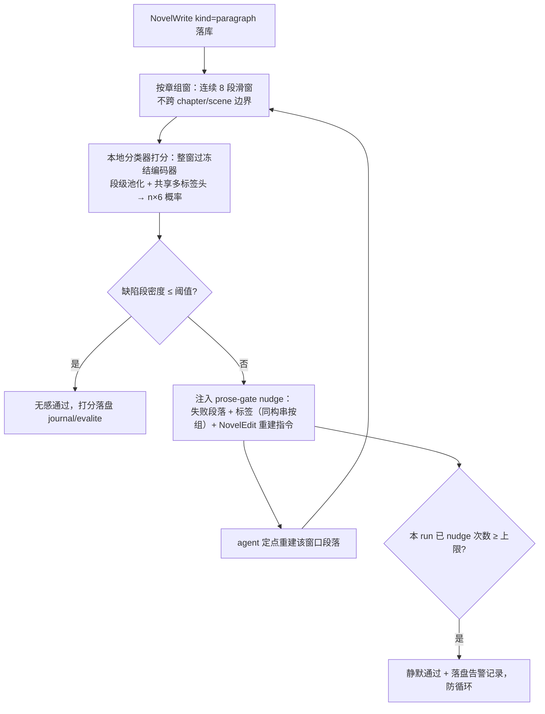

# prose-gate 段级缺陷分类判官 PRD —— v0.5 草案

> 状态：待评审。前置调研：`docs/reference/papers/translations/`（FineWeb-Edu 蒸馏配方、LitBench 去偏、StoryAlign 降质增广、CheemsBench 人工校准教训）。
> 一句话：训一个**只判不写**的段级多标签缺陷分类器（"AI 味"专项），挂进 max-turn nudge 建好的装配目录，NovelWrite 落库后即时打分，缺陷密度超标 → nudge agent 定点重建。不走 Reward / 标量打分（升级路径见 §8 开放问题）。

## 1. 背景与目标

- 现状：生产 runtime 无正文质量门控。文风质量仅存在于 evals 事后参考分（`evals/src/prose-quality.ts` 六维，judgeText 逐维调用，人工定稿），生成回路内无反馈。
- 问题：harness 生成正文存在"AI 味"——套话、四字格堆砌、形容词堆叠、句式同构、直白解说、万能比喻。这些是**段级、可枚举、可命名**的局部缺陷，适合分类器而不是整体偏好 RM。
- 目标：
  1. 缺陷分类器：输入连续段落窗口，输出各标签 0/1 + 置信度；本地推理，毫秒级，不增加 LLM 调用。
  2. 生成回路门控：NovelWrite 落库后自动打分；不达标时 nudge（不阻断、不静默删除），复用模型在环自愈哲学（同 selfheal case 08/09）。
  3. 全链路可观测：每次打分落盘，evals 可对照开关前后六维参考分。

## 2. 用户故事

- 作为作者：agent 写完一章，"AI 味"重的段落被自动点名重建，我不需要逐段手挑套话。
-作为开发者：判官指标（每标签 P/R/误杀率）有快照测试；换生成模型/改 prompt 后一键重验。

## 3. 流程图（必填）



## 4. 功能明细

### F1 上下文单元与输出粒度：窗口为上下文，段级为输出（v0.2 用户定稿）

一段一句范式下单段太短（句式多样性等信号不存在），**上下文单元 = 同一 chapter 内连续 8 段窗口**（滑窗步长 4，不跨 `publication.chapter` 与 scene 边界；章不足 8 段整章一窗）。**输出粒度 = 窗口内每段**：一次前向产出 n×6 概率（n=窗口段数，变长，padding 段 mask）。关系型标签（uniformSyntax）按"该段处于同构串中"定义——整串全标、nudge 按串分组点名。段级是窗口级的严格信息超集（窗口分可由段分聚合反推，反之不能）。依据：`novel/model/paragraph.ts` Paragraph + `publication.chapter` 的 paragraphIds 有序引用。

### F2 缺陷标签清单（v1 冻结 8 个；seed 自 prose-quality.ts rubric，经 CHI2025 七类缺陷分类交叉验证 + 网文领域补充）

> 交叉验证来源：Chakrabarty et al., *Can AI writing be salvaged?*（CHI 2025, arXiv:2409.14509）——18 位 MFA 职业作家编辑 1,057 段 LLM 生成文本、8,035 处细粒度编辑归纳出的七类 AI 写作缺陷（Cliché / Unnecessary Exposition / Purple Prose / Poor Sentence Structure / Lack of Specificity / Awkward Word Choice / Tense Inconsistency），"其他"仅 10/8035，近完备。归档：`docs/reference/papers/can-ai-writing-be-salvaged-chi2025-2409.14509.pdf`。

| key | 标签 | 判定标准（标注 rubric 骨架） | CHI2025 对应 |
|---|---|---|---|
| clicheExpression | 万能套话 | 「嘴角勾起一抹冷笑」「眼中闪过一丝精光」类模板表情句；情感贴标签（"他的心中涌起一股……"） | Cliché ✅ |
| idiomStack | 四字格堆砌 | 连续段落密集四字成语/对仗短语，叙述腔脱离白描基准 | Purple Prose 的中文表症拆分 |
| adjPile | 形容词堆叠 | 修饰语层层叠加，动词驱动的白描被淹没（对照 style.md 基准） | Purple Prose ✅ |
| uniformSyntax | 句式同构 | 窗口内连续段落同长同构、重复句式开头，节奏无变化（rhythm 八档形同虚设） | 领域补充（该文"Other"中罕见出现 Repetitive Sentence Structure；一段一句范式下升为核心缺陷） |
| explainTelling | 直白解说 | 把情绪/因果写成旁白总结，未通过动作与选择透出；说明式内心独白 | Unnecessary/Redundant Exposition（show-don't-tell 违反）✅ |
| genericMetaphor | 万能比喻 | 排比抒情、空泛意象、放到任何场景都成立的比喻 | Purple Prose（overwrought metaphor）✅ |
| vagueSpecificity | 空泛不具体 | 段落停留概括层，无可感细节（具体动作/物象/数字/感官），读者无法成像 | Lack of Specificity and Detail ✅（7/8 作家贡献的高频类；与本书 elements rubric"空泛提及即扣分"同源） |
| flatAffect | 情绪无波动 | 该段处于情绪强度无起伏的连续串中：窗口整体情绪一条直线（紧张度/温度无升降、无蓄势与释放），且非有意留白蓄势 | 领域补充（Tian et al. 2024"LLM 故事同质化、缺张力"；网文爽点经济下为核心缺陷；本库 Paragraph.intensity(1-5) + LeafRhythm 八档证明起伏是设计维度，正文写成直线即执行缺陷） |

**暂不采纳的三类**（v2 由"其他"字段数据再议）：Poor Sentence Structure（短句一段范式下 run-on 低频，部分被 adjPile/explainTelling 覆盖）、Awkward Word Choice（中文 LLM 通顺度高、低频）、Tense Inconsistency（中文无时态屈折，时间线问题属章级全局维度）。

每个标签附：定义 + 2 个正例 + 与"风格特征"的边界说明（短句、留白、反着说是该库风格常态，不是缺陷——标注 prompt 带 style 基准锚定）。

### F3 数据与标注管线

- 好文风池（负缺陷样本）：fixtures 书库真实正文（`evals/fixtures/books/`，ywjs 已有）+ 用户已发布章节（需授权，见 §7 O1）。
- 待标池：evals suite 各 case ` ```novel ` 产出（`evals/results/` 已按 git SHA/prompt hash 落盘）+ 生产 journal 提取。
- 标注器：复用 `evals/src/judge.ts` judgeText 模式新增**批量窗口标注脚本**（每窗口一次调用，输出 n×8 段级标签 0/1 + 逐段逐标签证据摘抄 + 八类之外的"其他"自由描述字段，temperature 0，解析失败重试 1 次后弃权落盘）。judge 模型走 `NOVEL_EVAL_JUDGE_MODEL`（强模型）。**清单完备性指标**：试标期"其他"填写率 < 2% 视为清单完备（学 CHI2025：8,035 处编辑中 Other 仅 10 例），高频出现则升级标签清单 v2。
- 规模：v0 目标 8–15k 窗口（真实正文 2–4k、生成产物 4–8k、增广 2–3k）。
- 增广（可选 v0.5）：StoryRMB 降质重写——好文风段让 LLM 按标签定向"改呆"构造高密度正样本。
- 人工校准集（硬门槛）：300–500 窗口人工标注（复用 prose-quality human-review 流程），双标；任一标签 LLM-人工一致率 < 0.7 → 修 rubric 重标该标签。教训依据：CheemsBench（纯 LLM 合成标注不可靠）。
- 落盘：`evals/fixtures/datasets/prose-gate/*.jsonl`（窗口 id、paragraphIds、拼接文本、labels、source、annotator、prompt-hash）。

### F4 模型与训练（FineWeb-Edu 配方，全 TS，无 Python 依赖）

- 架构：**冻结编码器 bge-small-zh-v1.5（24M，512 维，MIT）+ 共享 8 标签 logistic 头（逐段施加）**。编码器过整窗（上下文完整看 n 段），按段边界（拼接分隔符定位）对每段 token span 池化 → h_i ∈ R^512；拼接 8 维**段级上下文统计特征** x_i（段长偏离窗口均值/与前段句式开头相似度/套话词表命中数/四字格计数/修饰词密度/段内子句长方差/情绪强度 proxy/窗口情绪方差——即 prose-quality 规则检查的连续化；情绪 proxy 由情感词表+程度副词+感叹标点加权实现）→ z_i=[h_i‖x_i] ∈ R^520 → 共享头出 8 logits。窗口 8 段 × 一句一段 ≈ 150–300 字，512 token 上限够用。
- 训练栈（v0.5 用户定稿：**全 Python**）：`training/`（不入 pnpm workspace）——数据侧（labels/lexicons/windowing/features/annotate/dataset）与模型侧（embed/train/weights/infer，torch+transformers）全 Python，torch 训练共享头（BCEWithLogits+pos_weight+L2，按书分组 8:1:1，阈值 precision≥0.9 校准）。接口只有两个：读 `evals/fixtures/books/*/book.json`；标注 LLM 复用 evals 环境变量约定。**weights JSON 契约**（`training/prose_gate/weights.py`：z=[h‖x_normed]、logit_j=W[j]·z+b_j、sigmoid、独立阈值；schema=1）为语言无关接口，M3 时 TS runtime 按同契约加载。
- 模型资产：HF 格式文件 vendor 至 `training/models/bge-small-zh-v1.5/`（gitignored，仓库无 LFS 不入库），`training/scripts/fetch_model.py` 三源阶梯（huggingface.co → hf-mirror.com → ModelScope）可复现下载；本沙箱实测前两者超时、ModelScope 可用。ONNX/transformers.js 版延后至 M3（runtime 需要 JS 推理时）。
- 训练：onnxruntime-node 一次性提取全部窗口嵌入缓存 → 头部 logistic 回归（LBFGS，自写 ~百行或引入轻量依赖）→ 权重导出 JSON 随 `@novel/core` 包内置（KB 级）。8:1:1 按书/按 case 分层切分，防泄漏。
- 降级路径：bge-small 嵌入区分度不足 → 升 bge-base-zh-v1.5（102M，仍 CPU 友好）；再不足才考虑 API embedding + 本地头（牺牲离线性）。
- 验收指标（对人工校准集，段落级）：每标签 AUC ≥ 0.85；段落级任一标签 F1 ≥ 0.75；**误杀率（真实好文风段落被判任一缺陷）≤ 5%**——阈值向高 precision 偏（误杀伤害大于漏杀：漏杀只是没提醒，误杀会污染好文）。

### F5 runtime 门控接入（复用 nudge 装配目录）

- 新 policy：`clients/desktop/core/src/runtime/nudge/definitions/prose-gate.ts`，注册进 `NovelAgent.ts` nudge 目录（同 max-turn 装配模式，主 agent only——子代理不落库）。
- 触发点：NovelWrite(kind=paragraph) mutateBatch 成功后，对新插入段落组窗打分（本地推理，不产生 LLM 调用）。
- 行为：不通过 → 注入 nudge 消息（文案：失败段落及命中标签，同构串按组呈现 + "用 NovelEdit 定点重建这些段落"），**每 run 至多 1 次门控 nudge、每段至多被点名 2 次**（防重建循环），超限静默通过 + 落盘告警。不阻断落库、不改已有段落（不可变段落 + 引用模型不动）。
- 压缩语义：同 max-turn，nudge 消息可被压缩清除，重注幂等由 per-run 计数保证。
- 开关：定义包配置项 `proseGate: "off" | "eval-only" | "on"`，v0 默认 `eval-only`（只打分不 nudge），灰度后切 `on`。

### F6 evals 集成

1. 判官自测 case：校准集指标快照（AUC/F1/误杀率阈值断言，防权重回退）。
2. 闭环 e2e case：mock provider 固定高呆板文案 → 断言 prose-gate nudge 注入、agent 重建后窗口复检通过、次数上限生效。
3. 外部对照：现有 case 16 六维参考分，开/关判官各跑 N 次，比较 aiCliche/prose 两维分布（人工定稿，学现有 human-review 模式）。

## 5. 边界与非目标

- 不做整体质量排序、Best-of-N、Reward 标量（触发条件满足时另立 PRD，见 §8 O3）。
- 不做跨章全局维度（人物一致性、跨场景衔接）——那是章级上下文问题，本判官只管段级局部缺陷。
- 判官不改写文本，只标注；改写永远由 agent（模型在环）执行。
- 不进 compose 通道（v0；compose 草稿检查见 §8 O2）。
- 不做中英双语；只对该库风格（网文中文）负责。
- 不采用现成中文 AIGC 检测器（chinese-ai-detector-bert 等）：它们是"人写/AI 写"二分类判出处、训练域为 HC3 问答体，与本任务（自有生成物的缺陷多标签）目标错配；仅 M2 可作外部对照基线，不作依赖。

## 6. 验收标准

1. 校准集指标达 §F4 阈值且有人工双标证据落盘。
2. e2e case：nudge 注入 → 重建 → 复检通过 → 上限熔断，全链路绿。
3. 开/关对照：aiCliche 维参考分显著改善（人工定稿确认），且误杀抽检 0 例好文风被重建。
4. 生产路径零新增 LLM 调用；打分延迟 < 100ms/章（本地 ONNX 基准）。
5. 全部打分与 nudge 记录可在 journal/evalite 追溯。

## 7. 开放问题

- O1（最高优先级）：用户项目正文用于标注的授权与脱敏口径。
- O2：compose 通道（`ComposeModeService` 草稿）是否同样过判官——建议 v1 再议。
- O3：升级触发器——六维参考分通过率仍低 / 需要 Best-of-N / 需要 DPO 训练信号时，转 Reward PRD（pairwise + BT；届时段级分类器保留并联）。
- O4：bge-small 还是 bge-base 起步（建议直接 small 跑通 M2 指标再决定）。

## 8. 技术设计要点

- **扩写防泄漏（用户确认的设计约束）**：AI 扩写输入仅五要素大纲（要素截断 ≤100 字护栏）+ 风格锚 + 目标行数，**原文不进入扩写 prompt**——配对差异反映"执行差距"而非"记忆原文"；护栏在 `outline.py` 解析层实现并有回归测试。

- 输入输出口径（v0.2 用户定稿）：输入 = 窗口上下文（n≤8 段）+ 每段 6 维上下文统计特征；输出 = **n×6 段级独立概率**（多标签 sigmoid，变长窗口 padding 段 mask）。先例为 MT 词级 QE（token 级 OK/BAD）。
- 关系型标签段级语义：uniformSyntax 等按"该段处于同构串中"定义，标注时整串全标；nudge/重建按连续命中串分组点名，避免只重建串中一半导致新段仍与残留段同构。
- 段级→窗口级可聚合反推（max/mean），反之不可——段级为信息超集，窗口级/章级指标由段级聚合计算。
- 单段降质增广的段级红利：对好文风窗口仅降质其中 1 段，得到该段精确正例 + 其余段天然干净负例（StoryRMB 降质配方在段级语义下标签免费精确）。
- 窗口重叠滑窗 → 同一段落多窗口打分：段落级取"任一窗口命中即计入 nudge 名单"，密度按章聚合。
- 统计特征与嵌入拼接后过 logistic 头：保证 uniformSyntax 这类纯统计信号不被嵌入淹没（StoryAlign 警告过判官对句长峰度的偏好可被 hack——统计特征显式化便于审计）。
- 权重文件与编码器 ONNX 作为 `@novel/core` 资产随包，版本号与标签清单版本绑定（labels v1 冻结后不增删，只调阈值；改清单 = v2 新目录）。

## 9. 实施步骤

- M0（0.5 天）：F2 标签清单 + 标注 prompt 冻结 v1；judge 批量窗口标注脚本。
- M1（1–2 天）：标注 ~5k 窗口 + 300 窗口人工校准；一致率报告，修 rubric。
- M2（1–2 天）：嵌入提取 + TS 训练管线 + 校准集指标达标（含 bge-small/base 决策 O4）。
- M3（1–2 天）：`prose-gate.ts` nudge policy + 装配 + 单测（幂等/上限/窗口边界/压缩重注）。
- M4（1 天）：F6 三类 evals case + 灰度开关 + 本 PRD §11 回填。

## 10. 变更记录

### v0.1（初稿）
- 立项：段级多标签缺陷分类判官 + nudge 门控；明确不走 Reward。

### v0.1 → v0.2（用户评审：输出粒度定稿）
- 输出从窗口级 6 概率改为**段级 n×6 概率**（用户定稿）：段级是窗口级信息超集，可聚合反推；统计特征由窗口聚合量改为段级上下文特征；关系型标签按"处于同构串"段级语义；取消窗口级归因启发层（段级输出原生精确）；新增单段降质增广红利（1 段正例 + n-1 段干净负例）。

### v0.2 → v0.3（CHI2025 缺陷分类交叉验证）
- 标签 6 → **7**：新增 vagueSpecificity 空泛不具体（CHI2025 Lack of Specificity，7/8 作家高频类，与本书 elements rubric 同源）；clicheExpression/explainTelling/adjPile/genericMetaphor 获论文直接验证；idiomStack 为 Purple Prose 中文表症拆分；uniformSyntax 为一段一句范式领域补充。暂不采纳 Poor Sentence Structure/Awkward Word Choice/Tense Inconsistency（低频或被覆盖，v2 由数据再议）。
- 标注协议新增"其他"自由字段与完备性指标（填写率 < 2%，学 CHI2025 formative→consolidation 方法）。

### v0.3 → v0.4（用户评审：新增情绪维度）
- 标签 7 → **8**：新增 flatAffect 情绪无波动（关系型标签，"该段处于情绪无起伏串中"）。依据：Tian et al. 2024 LLM 故事同质化缺张力；网文爽点经济；本库 intensity/LeafRhythm 数据模型证明起伏是设计维度。
- 统计特征 6 维 → **8 维**：新增情绪强度 proxy（情感词表+程度副词+感叹标点加权）与窗口情绪方差（flatAffect 的直接统计线索）；z ∈ R^520，头 8×520。

### v0.4 → v0.5（用户定稿：训练栈全 Python）
- 训练框架落 `training/`（torch+transformers，全 Python 单轨；数据侧+模型侧），不再走 TS/transformers.js 路线；weights JSON 契约（schema=1，`training/prose_gate/weights.py`）作为语言无关接口供 M3 TS runtime 加载。
- 模型资产 HF 格式 vendor `training/models/`（gitignored）+ `scripts/fetch_model.py` 三源阶梯（HF → hf-mirror → ModelScope；沙箱实测仅 ModelScope 可达）；ONNX 版延后 M3。

## 11. 实施落地记录

### 训练框架落地（v0.5，2026-09-11）
- `training/` 全 Python 框架落地（torch 2.14 CPU + transformers 5.17 + numpy/pytest）：
  - 数据侧 `prose_gate/labels.py`（8 标签 v1 冻结，标注 prompt 单一来源）、`lexicons.py`（种子词表：套话/程度副词/四字格/情感词）、`windowing.py`（re_split + 8 段滑窗步长 4/尾窗回退）、`features.py`（8 维段级上下文特征）、`annotate.py`（prompt v1 + 证据子串硬校验 + 可注入 call）、`dataset.py`（book.json → windows.jsonl）；
  - 模型侧 `embed.py`（[CLS] p1 [SEP]… span 池化 + 段级 L2）、`train.py`（BCE+pos_weight+L2=1e-2+lr=5e-2+val 宏 AUC 早停；分组切分；precision≥0.9 最小阈值校准）、`weights.py`（schema=1 契约）、`infer.py`。
  - pytest **33/33 绿**（含合成数据端到端收敛 valMacroAuc 0.94；小样本过拟合教训已定入默认超参）。
- 预训练模型 vendor：bge-small-zh-v1.5 五文件（model.safetensors 91MB）落 `training/models/`（gitignored）。网络实测：PyPI 默认源可达（依赖安装成功），**HF 与 hf-mirror 超时，ModelScope 可用**——fetch_model.py 三源阶梯生效，断点续跑可用（special_tokens_map.json 125B 曾被最小尺寸阈值误杀，已修）。
- 冒烟全通：ywjs → **112 窗 / 896 段** windows.jsonl；嵌入冒烟 (8,512)×2 窗、L2 全 1.0；`train --synthetic` → weights json（valMacroAuc 0.940）；`infer` 真编码器 + 合成权重出 n×8 概率。
- 已知待办：章标题行（如"落雨"）混入窗口首段，M1 加过滤；真实批量标注待 judge 模型定稿（M0b）；CI Python 腿未建。

### M0b 准备：单人配对标注（2026-09-11）
- 标注路线（用户定）：**人工标注为主**——单人、小批量、"同一大纲的原文 vs AI 扩写"配对标注（复刻 CHI2025 LAMP 配对构造；大纲源 = `leaf-units.json` 五要素）。
- 新增 `prose_gate/expand.py`（leaf unit → AI 扩写，prompt 只给大纲/风格/形式约束、**刻意不给质量指令**以保留真实缺陷分布；空返回自动重试，max_tokens 8192 防推理段吃预算）与 `prose_gate/sheet.py`（自包含 HTML 配对标注表：8 标签定义卡 + 原文/AI 双栏 8×8 勾选 + 证据摘抄 + 全零快捷 + 浏览器本地导出 `labels-human.jsonl`，与 annotate.py 记录同构 annotator:"human"）。pytest 41/41。
- 首批：第 1–3 章 → 原文 34 窗 / AI 扩写 41 窗（目标行数按有效段数对齐）→ **34 配对窗**（`artifacts/annotation-sheet.html`）。预估单人 3–5 小时。
- 观察：deepseek-v4-flash 扩写贴风格程度高（数词精确、白描在调），本批缺陷可能偏隐性——正例密度预计偏低，密集正样本待降质增广（StoryRMB 配方）补足。

### 第二本书接入：《武道宗师》（2026-09-11，用户供书）
- 多书化改造：`scripts/import_book.py`（真实书 txt → book.json，GB18030 编码回退；输出落 `evals/fixtures/books/wudao/`，被既有 `evals/fixtures/books/*` gitignore 覆盖——**真实书不入仓库**）；`dataset.py` 加 `--size/--step`（缺省按段长自适应 ≤420 字/窗，长段书自动缩小窗口）；`expand.py` 加 `--style-file/--form(sentence|paragraph)/--book-id`（风格锚与段落形式按书适配，防跨书风格污染标注）；`sheet.py` 修 bookId 硬编码；新增 `outline.py`（章节正文 → LLM 提取五要素大纲，产物与 leaf-units 同构）。pytest 47/47。
- 数据：全书 754 章 / 250 万字 / 65,538 段导入（段均 38 字）；前 3 章大纲提取（搭讪勇气/初战告捷/武道迎新）→ 按本书风格（长段/对话吐槽/设定穿插）AI 扩写 64/64/63 行 → **45 配对窗** `artifacts/wudao-annotation-sheet.html`。
- 扩写健壮性：新增"过短重试"（行数 <目标 60% 视为模型提前收尾，重试并保留最长结果）——第 3 章曾 12/92 行，修复后 63/92。
- 观察：AI 扩写形态正确但**叙述化倾向明显**（原文第 1 章以对话吐槽开场，扩写以场景描写铺陈）——对话占比骤降可能是这本书的典型 AI 味维度，由标注揭示。

### 训练数据工作台落地（2026-09-11，用户需求：导入书 + 标注 + 仿写/题目注入 server 化）
- **`prose_gate/workbench_server.py`**（stdlib http.server 零新依赖，默认 127.0.0.1，`--host 0.0.0.0` 开放局域网跨设备共享磁盘进度）：
  - 导入向导：上传 txt（utf-8/gbk 回退）→ LLM 提五要素草稿 → **网页编辑定稿**（要素白名单+≤100 字截断防泄漏护栏与 outline 层同构）→ 自适应建窗；
  - 生成：某章定稿大纲**仿写**（可配对照章，产物并入配对 AI 窗）或**自定义题目注入**（独立批次 `artifacts/gen/<id>-windows.jsonl`，贴近生产门控的裸生成物场景）；文风基准/段落形式/批次名网页可调；扩写仍只见大纲不见原文；
  - 标注：`/sheet/<书>` 双栏配对 + `/label/gen/<批次>` 单栏独立（`single_sheet.py` 新增），逐窗保存原子写 `labels-<scope>.jsonl`（windowId 合法性校验），**⚑ 存疑标记 / 跳过 / 标签命中实时统计** 三增强；标注页存储层重构为 local(localStorage)/server(API) 双模式注入（离线单文件模式保留）。
- 测试：pytest **50/50**（新增 `test_workbench.py` 集成：mock LLM 全链路 + 重启进度保留 + 非法 windowId/别名拒绝）。真实冒烟：wudao 题目注入（雨夜渡口，32 行/7 窗，首句即典型空喻）、保存、重启进度保留、flag 落盘、首页批次列表全部通过；修复 `pairTotal` 误算全书窗（只算有 AI 窗的章）与 `/api/labels` 路径切片 off-by-one。
- 数据迁移：ywjs 首批产物补拷为 `<alias>-` 前缀命名（`ywjs-windows/ai-windows/expansions`），与工作台约定一致。
