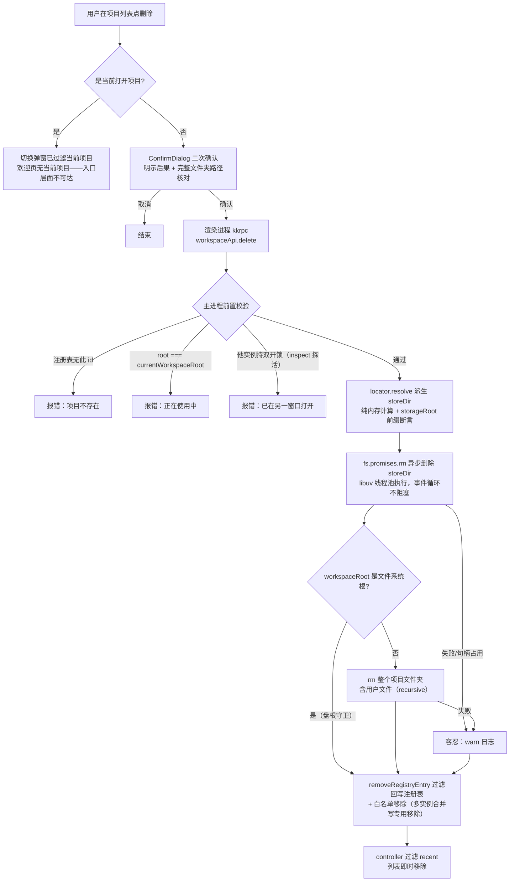
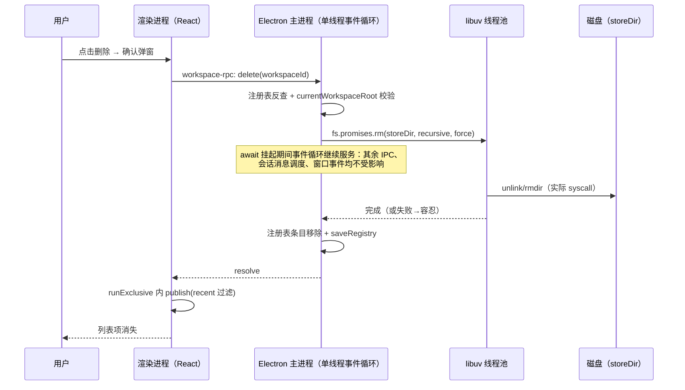

# workspace-删除项目 PRD —— v0.1

> 状态：⏳ 待敲定（定稿后改 ✅ 已定稿）
> 关联：整体产品 PRD [`产品总览.md`](./产品总览.md)；技术设计 `docs/architecture.md`
> 使用说明：新 PRD 从本模板复制起步，固定章节不得删减；流程图必填。

---

## 1. 背景与目标

- **要解决的问题**：项目（workspace）目前只有新建/打开/关闭，注册表 `workspaces.json` 只增不减——被弃用的项目永远留在「最近」列表，应用侧存储目录（`userData/novel-storage/<派生名>/`：novel.db + 全部 AI 会话记录）永久残留磁盘，无任何清理手段。
- **目标（一句话，可验收）**：用户可从欢迎页或应用内切换弹窗删除项目（彻底删除：应用侧数据 + **整个项目文件夹** + 移出最近列表）；**正在使用的项目不可删除；删除全程不阻塞、不干扰程序正常运行**。

## 2. 用户故事

- 作为作者，我希望删除不再需要的项目，以便最近列表只保留有效项目、释放磁盘空间。
- 作为作者，我希望正在打开（含会话生成中）的项目受到删除保护，以免误删正在写的书。
- 作为作者，我希望删除前有二次确认并明示不可恢复的后果，以免误操作丢失全部书稿数据。

## 3. 流程图（必填）

### 3.1 主流程

### 3.2 多主体交互（删除一次调用的完整生命周期）

## 4. 功能明细

- **功能点一：删除入口与确认**
  - 触发：欢迎页「最近的项目」卡片右上角删除按钮；应用内「打开项目」弹窗最近列表项删除按钮。
  - 输入：目标 `workspaceId`。
  - 处理：切换弹窗的最近列表已过滤当前项目（多实例 PRD 的切换目标排除自身）——当前项目从入口层面不可达，运行中保护天然成立；欢迎页无当前项目，全部可删。点击后弹 `ConfirmDialog`（danger 语义，busy 锁 ESC）；确认后调 `WorkspaceController.deleteRecent(id)`（`runExclusive` 串行）。
  - 输出：确认弹窗关闭、请求发出；成功后列表即时移除。
  - 异常：删除失败走现有 `snapshot.error` 通道展示在页面错误区，列表不变。

- **功能点二：主进程删除执行（`workspaceApi.delete`）**
  - 触发：渲染端 kkrpc `workspace-rpc` 调用。
  - 输入：`workspaceId`（哈希 id，**不含路径**）。
  - 处理：① 注册表反查条目（路径只能来自注册表，渲染端无法注入任意路径）；② `entry.workspaceRoot === currentWorkspaceRoot` → 拒绝（本实例当前项目）；③ **跨实例占用检查**：`WorkspaceDirLock.inspect(storeDir)` 探活——任一其他实例持有该项目双开锁即拒绝（「已在另一窗口打开」，多实例并行的运行中保护）；④ `locator.resolve` 派生 storeDir（纯内存计算）+ 断言位于 `storageRoot` 内；⑤ `fs.promises.rm` 异步删除 storeDir（容错）；⑥ `fs.promises.rm` 异步删除**整个项目文件夹（含其中的用户文件）**——**文件系统根守卫**：workspaceRoot 为盘根（如 `C:\`）时跳过此步，绝不做盘根 recursive rm；⑦ `removeRegistryEntry(workspaceId)`——注册表为多实例合并写（`saveRegistry` 并集只增不删），移除须重读磁盘按 id 过滤后回写并同步内存；同时移出 `allowedWorkspaceReferences` 白名单。**顺序：先删数据后改注册表**——中途崩溃时条目仍在列表、可重试（重试幂等：force rm 对不存在路径静默通过）。
  - 输出：`Promise<void>`；磁盘 storeDir 与整个项目文件夹消失、注册表减一条。
  - 异常：目录被杀毒/索引/资源管理器占用 → rm 失败容忍（warn 日志记录残留路径），注册表条目照常移除（用户意图“不再看到”总是达成；残留目录无副作用，重新打开同文件夹反而能找回数据）。

- **功能点二补充：确认弹窗路径核对**
  - 因删除范围包含用户自己的文件，ConfirmDialog 文案明示「整个项目文件夹（含其中的全部文件）不可恢复」，并**显示完整项目文件夹路径**（`rootPath`，旧注册表数据缺省时不显示）供删除前核对——防止用「打开其他项目」把含个人文件的既有目录选作工作区后误删。

- **功能点三：删除后状态同步**
  - 触发：delete RPC resolve。
  - 处理：controller 在 `runExclusive` 内 publish 过滤后的 `recent`（phase 回 idle/ready、清 error）。
  - 输出：两处列表（欢迎页/切换弹窗）即时更新，无需重新 `listRecent`。

## 5. 技术设计：线程 / 进程 / 同步 / 异步 / 性能

### 5.1 删除在各进程/线程中的位置

| 参与方 | 角色 | 删除时做什么 |
|---|---|---|
| 渲染进程（React） | UI 与发起方 | 仅本地状态（确认弹窗 target/busy）；删除期间界面完全可交互 |
| **Electron 主进程**（单线程事件循环） | `workspaceApi.delete` 执行点；同时托管全部 kkrpc IPC、当前项目 `SqliteNovelStore`（`node:sqlite` **DatabaseSync 同步驱动**，`core/src/novel/SqliteNovelStore.ts:6`）、ConversationManagerServer（会话子进程管理/消息调度）、窗口事件 | 校验（纯内存）→ 发起异步 rm → await（挂起不阻塞）→ 改注册表 |
| libuv 线程池（主进程内，默认 4 线程） | 异步 IO 执行 | `fs.promises.rm` 的实际 unlink/rmdir syscall 在此执行 |
| 会话子进程（1 会话 = 1 进程） | AgentLoop 运行 | **不参与**——子进程只属于当前项目，而当前项目不可删 |

### 5.2 为什么不影响程序性能（逐条论证）

1. **删除目标恒为“非当前项目”，它没有任何资源被任何进程持有**：
   - sqlite 句柄：仅当前项目在 `rebindWorkspace` 时打开（`gui/src/main/minimal.ts:656-670`）；主进程强制校验 `currentWorkspaceRoot ≠ 目标 root`，删除因此是纯文件系统操作——无句柄冲突、无需 close、无 WAL checkpoint。
   - 会话子进程：切换项目时 `rescope` 已终止旧项目全部会话（`core/src/conversation/server/ConversationManagerServer.ts:349-361`），非当前项目不可能有进程在写 journal。
2. **用异步 `fs.promises.rm`，不用 `rmSync`**：`rmSync` 会同步遍历整棵目录树，期间**冻结主进程事件循环**——所有 IPC、窗口事件、会话心跳全部停顿；项目 storeDir 是整棵数据树（novel.db + WAL/SHM + conversations/ 全部 JSONL），文件数比单个会话目录大一个量级，Windows 下遇杀毒实时扫描可达数百 ms～秒级，UI 会有可感知卡顿。`fs.promises.rm` 的 syscall 在 libuv 线程池执行，事件循环仅在发起与完成时参与。对比：现有会话删除用 `rmSync`（`ConversationManagerServer.ts:534`）删的是几个小文件，同步可接受；项目级删除规模不同，必须异步。
3. **同步操作的使用边界**（哪些保持同步、为何无害）：注册表 `workspaces.json` 写入保持 `writeFileSync`——几十字节 JSON、微秒级，与现有 open/close 同模式，改异步反而引入写交错风险；`locator.resolve` 是纯内存计算（sha1 + 字符串拼接）无 IO。
4. **IO 竞争评估**：删除大量小文件时与当前项目会话的 journal 写入共享磁盘 IO。现代 SSD + NTFS 下 MB 级项目数据删除耗时几十 ms、一次性用户操作，不可感知；正在生成的会话最坏情况 journal 追加延迟毫秒级，且 journal 有单写者队列串行化（architecture.md §持久化），无正确性影响。
5. **内存**：无新增驻留内存，删除是短任务，完成即释放。
6. **竞态防护**：渲染端 `WorkspaceController` 所有操作经 `runExclusive` 串行（`WorkspaceController.ts:238-245`），删除不会与打开/关闭并发发出；主进程侧 kkrpc 请求按到达顺序处理，delete 内校验以执行时点为准。
7. **Windows 句柄容错**：`force: true` + try/catch，残留无副作用（见功能点二异常分支）。

## 6. 边界与非目标

- 明确不做：不追溯清理历史已删项目的残留（可手动删除）；不支持删除当前打开项目（不提供“先关再删”一键流程）；不做回收站/软删除/数据导出；不做批量删除；不改会话级删除（已有能力）。
- 已知风险接受项：删除范围包含项目文件夹内用户自己的文件（产品决策，确认弹窗以完整路径核对作为补偿措施）；文件系统根绝不做 recursive rm（守卫兜底）。

## 7. 验收标准

- [x] 欢迎页与切换弹窗均可删除非当前项目：确认 → 列表移除 → 磁盘 storeDir 消失（实测验证：测试4 的 `downloads-测试4--*` 目录与注册表条目均已消失）
- [x] 当前打开项目在切换弹窗被过滤（多实例 PRD 的 switchableRecent）；控制器 `deleteRecent` 对 current 拒绝（`WORKSPACE_DELETE_CURRENT_FORBIDDEN`）；绕过 UI 直调 RPC 亦被主进程拒绝
- [ ] **跨实例**：项目 B 在另一窗口打开时，本窗口删除 B 被主进程拒绝（「已在另一窗口打开」）
- [ ] 删除大目录期间（可手工造数据）UI 操作、当前项目会话生成、审批通知均无卡顿
- [ ] rm 失败场景（占用模拟）不崩溃、条目仍移除（合并写下 removeRegistryEntry 过滤回写）、日志留痕
- [ ] 删除后整个项目文件夹消失（含用户文件）；workspaceRoot 为盘根时仅删应用侧数据、不动盘根
- [ ] 确认弹窗显示完整项目文件夹路径（rootPath 缺省的旧数据除外）
- [ ] ui 包单测覆盖 controller 四态（成功/当前项目禁删/端口缺失/RPC 失败）与组件确认流；`pnpm -F ui check && pnpm -F ui test` 通过

## 8. 开放问题

- rm 失败残留是否需要在 UI 提示手动清理路径？（当前方案：仅日志，不打扰）
- 是否需要后续补充「仅移出列表」轻量选项？（当前不做，避免两套删除语义混淆）
