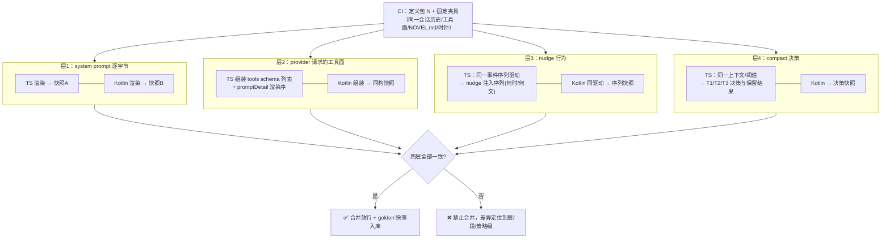
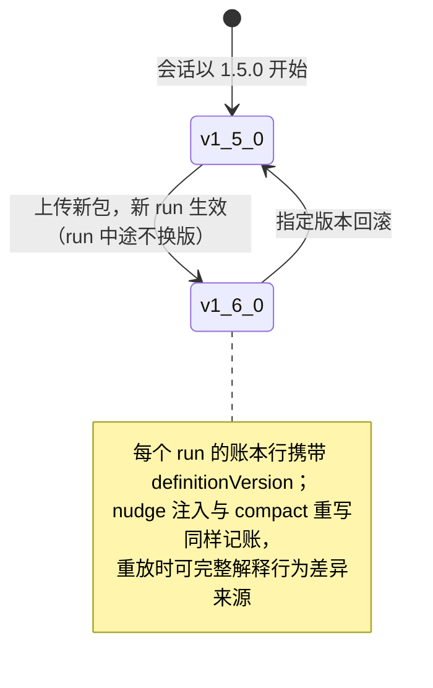

# 定义包-agent策略统一 PRD —— v0.2

> 状态：⏳ 待敲定（定稿后改 ✅ 已定稿）
> 关联：端云架构 [`端云架构-数据层server化.md`](./端云架构-数据层server化.md)（FR7 预留位）；现状技术设计 `docs/agent-definition-config-prd.md`；移动端 `android-移动端MVP.md`
> v0.2 变更：对拍范围从「仅 system prompt」扩展为**完整策略面**（prompt / 工具策略 / nudge / compact），见 §4 FR1 策略面清单。

---

## 1. 背景与目标

- 要解决的问题（痛点 / 现状）：
  1. Agent 的策略面远不止 system prompt。现状（`core/src/runtime/agent/`）里，一个 agent 的**全部行为策略**包括：
     - **prompt recipe**：15 段（6 static + 9 dynamic），含 NOVEL.md 动态注入；
     - **工具策略**：groupIds 装配清单、allow/deny、每工具的 `promptDetail`（policy/guidance，渲染进 prompt 尾部）、`requireApproval`、延迟池（external tools）规则；
     - **nudge 目录**：4 个 nudge（compose_mode / todo_idle / project_stage / external_tools）的触发时机、注入文案、频控（每压缩纪元一次等）；
     - **compact 策略链**：AutoCompactPolicy 内 T1/T2/T3 顺序、各级阈值（70%/window−maxOutput−12000/92%）、keepFirst/keepLast、T2 摘要器参数、超窗保险丝行为；
     - **delegation/communication**（子代理白名单、通信策略）与 `runtimePolicyId` 占位。
     这些全部是**编译期 TypeScript 代码**，改任何一项 = 发版。
  2. 端云架构 v2 后 runtime 分散三处（桌面 TS / Android Kotlin / server 夜间执行者）：Android 是手工平移副本，prompt 之外的策略面（尤其 nudge 触发与 compact 阈值）**连平移都还不完整**，更没有一致性保障。
  3. 重放语义受损：跨端续跑时两端策略版本不同 → 重放上下文不一致、压缩不可复现、nudge 注入时机漂移。
- 目标（一句话，可验收）：Agent 的**完整策略面**从代码常量变为**版本化 JSON 定义包**——server 权威分发、端拉取缓存装配、run 事件携带 definitionVersion、**四层对拍**（prompt / 工具面 / nudge 行为 / compact 决策）在 CI 有逐字节/逐决策门禁。
- 定性（一句话）：**权威的是定义包版本，不是代码副本。** 端 runtime 只保留「渲染器与策略执行器」，策略「内容与参数」全部下发。

## 2. 用户故事

- 作为开发者，我希望改 nudge 文案、调 compact 阈值、收紧工具审批面都不用发版（上传新定义包即生效），以便快速迭代策略。
- 作为开发者，我希望 TS 与 Kotlin 两个 runtime 在同一定义包下：渲染的 system prompt、注入的 tools schema 列表、nudge 的触发与文案、compact 的分区与保留结果**全部一致**，并有 CI 门禁兜底。
- 作为用户，我希望会话历史记录了当时的定义版本，策略升级后旧会话行为可解释、可回滚。
- 作为运维者（自托管），我希望定义包可指定版本拉取与回滚，以便灰度。

## 3. 流程图（必填）

### 3.1 定义包内容与生命周期：覆盖完整策略面

```mermaid
flowchart LR
    subgraph BUNDLE["定义包（JSON，semver，不可变）——完整策略面"]
        P["① prompt recipe<br/>static 段文案全量数据化<br/>dynamic 段 = rendererId + params"]
        T["② 工具策略<br/>groupIds + allow/deny + 每工具<br/>promptDetail(policy/guidance)<br/>+ requireApproval 覆盖"]
        N["③ nudge 目录<br/>触发时机参数 + 注入文案 + 频控<br/>（triggerId 引用端上的触发器代码）"]
        C["④ compact 策略链<br/>策略顺序[T1,T2,T3] + 各级阈值<br/>keepFirst/keepLast + 保险丝参数"]
        D["⑤ delegation/communication<br/>子代理白名单 + 通信策略"]
    end
    BUNDLE -->|POST /v1/definitions| STORE[("server<br/>definitions 表（不可变）")]
    STORE -->|GET latest / :version / ETag| CLIENT["端：拉取 + 缓存"]
    CLIENT --> ASSEMBLE["端装配：渲染器 + 策略执行器<br/>按包内容装配 AgentCapability"]
    ASSEMBLE -->|run 事件带 definitionVersion| LEDGER[("账本 definition_version 列")]
```



**数据化分层原则**（什么能进包、什么留在端代码）：

| 策略面 | 纯数据（全量进包） | 代码引用（包里只留 id+版本） |
|---|---|---|
| prompt | static 段文案、段序 | dynamic 段渲染逻辑（rendererId，如 story_appeal 的结构渲染） |
| 工具 | 装配清单、allow/deny、promptDetail 文案、审批开关覆盖 | 工具 schema 本体与 handler（`schema@version` 引用——schema 描述与实现绑定，防包与代码脱节） |
| nudge | 注入文案、频控参数、触发参数（如 idle 阈值） | 触发器实现（triggerId，如 onCompacted 钩子） |
| compact | 策略链顺序、全部阈值、保留区参数 | 策略算法实现（policyId: t1/t2/t3，算法在端） |

### 3.2 四层对拍门禁（CI 红线）



### 3.3 版本切换与重放解释



## 4. 功能明细

- **FR1 定义包 schema（核心交付物，覆盖完整策略面）**
  - 触发：本 PRD 实施。
  - 输入：现有 `AgentDefinition`（1.5.0）+ `NovelAgent.ts` 装配点（compact 硬编码行）+ nudgeCatalog。
  - 处理：设计 JSON Schema，五个顶层域：
    ```
    {
      definitionVersion: "semver",
      prompt: { recipe: [{sectionId, sectionVersion, kind: static|dynamic, content?, rendererId?, params?}] },
      tools: {
        groups: [{groupId, tools?: [{name, schemaVersion, allow?, requireApproval?, promptDetail?: {policy?, guidance?}}]}],
        deferredRules?: {...}                       // external tools 延迟池规则
      },
      nudges: [{nudgeId, triggerId, triggerParams, content, rateLimit: {perCompactionEpoch?, maxPerRun?}}],
      compact: {
        chain: [{policyId: t1|t2|t3, params: {...}}],
        fuse: {retryOnce: true}                     // 超窗保险丝
      },
      delegation: { allowedAgentTypes: [...], communication: {...} }
    }
    ```
    关键约束：**工具 schema 本体不进包**（与 handler 绑定），包内以 `name + schemaVersion` 引用，端装配时校验本地实现版本——不匹配即装配失败并报「端能力落后」，防止「包描述的工具端上没有」。
  - 输出：schema 文档 + TS 侧 `bundleFromDefinition()` 导出器（把 1.5.0 现状导出为首份 golden 包，含 compact/nudge 的现值——**这一步本身就是对现状策略面的一次盘点**）。
  - 异常：schema 校验失败拒上传；schemaVersion 与端实现不符拒装配。
- **FR2 server 存储与分发 + 能力协商**：
  - 存储：`POST /v1/definitions`（不可变，同 version 409，内容 sha256 寻址）；`GET /v1/definitions/:version` + ETag/304；包内容自动推导需求清单（用到的 rendererId/triggerId/policyId/schemaVersion + minRuntimeVersion）存入包元数据。
  - **resolve（兼容性核心）**：`GET /v1/definitions/resolve`，端携带能力声明（runtimeVersion + 支持的 id 清单），server 返回该端**能装配的最新包**。
    原理：不是「每个 app 版本配一个专属 def」（N×M 维护爆炸），而是**一条 def 版本线 + 每端能力取其能跑的最新版**——老 app 自动停在能力内最新版，升级后自动前进；def 不可变且全量保留，老客户端永远拿得到自己的版本。
  - 测试：上传/拉取/不可变/ETag/resolve 选版（新旧端能力各取所适）。
- **FR3 端侧装配（prompt 之外的策略执行器接线）**
  - 触发：会话启动 / run 开始前。
  - 处理：
    - prompt：static 直接拼、dynamic 按 rendererId 渲染（同 v0.1）；
    - **工具**：按包组装 `ToolRegistry` 视图——组展开 + allow/deny + requireApproval 覆盖 + promptDetail 进 prompt 尾部渲染；schemaVersion 校验；
    - **nudge**：端上的触发器注册表按 triggerId 挂钩（onCompacted / idle / stage 变更等），触发参数与文案来自包；注入同样落 journal（现状行为保留）；
    - **compact**：`CompactPolicyChain` 按 `chain` 数组实例化（policyId → 端上的策略类，参数注入）——Android 侧 `CompactPolicyChain` 已是"策略列表+参数"形态，TS 侧 AutoCompactPolicy 需从"硬编码编排"改为"链式装配"；
    - 版本切换规则：新 run 才换版；能力缺口（包引用了端不识别的 rendererId/policyId/triggerId 或 schemaVersion 不符）→ **整包拒绝**，回退缓存旧版 + 告警事件（逐段降级留二期）。
  - 输出：装配后的 AgentCapability + `definitionVersion` 透传账本行。
  - 异常：无缓存且离线 → run 拒绝启动；schemaVersion 不符 → 拒装配（见 FR1）。
  - **重放兼容性说明**：落账本的是消息（渲染产物）而非 prompt——重放只重建消息流；prompt 仅在新 turn 组装 provider 请求时用当前包现渲染。历史会话不会被旧 def 卡住，续跑的新 turn 直接用最新兼容包，行为变化经账本 definitionVersion 可解释（见 3.3）。
- **FR4 四层对拍门禁（evals 扩展，核心质量保障）**
  - 层1 prompt：双 runtime 渲染完整 system prompt 逐字节 diff（含 promptDetail 渲染——工具策略与 prompt 在此交汇）。
  - 层2 工具面：同一夹具下组装的 `tools` schema 列表（名称序 + schema JSON + description）逐字节 diff。
  - 层3 nudge 行为：同一**事件序列**（user 输入/压缩完成/idle 超时等夹具）驱动两端，产出「nudge 注入序列」（时机+文案）快照 diff——保障触发逻辑与频控一致。
  - 层4 compact 决策：同一上下文（runs 夹具 + 阈值包）驱动两端，产出「策略命中 + 分区 + 保留/折叠/丢弃结果」快照 diff；Android `CompactTest` 基座扩为对拍夹具，TS 侧补同夹具实现。
  - 门禁：任一层不一致 → CI 红灯禁止合并；快照入库供 review（策略变更可视化 diff）。
- **FR5 Kotlin 侧落地**：`:core:runtime` 增 `definition` 包——bundle 反序列化、static 渲染、dynamic 渲染器注册表（首批 3~4 段高价值，其余 static 化兼容）、**工具策略装配（ToolRegistry 视图 + requireApproval 覆盖）、nudge 触发器注册表、compact 链参数化**（后者 M1 已就绪，只差从包读取参数）。

## 5. 边界与非目标

- 明确不做（M2）：
  - 定义包编辑器 UI / 用户自定义 per-agent 策略
  - 灰度通道（stable/canary）——只做 latest + 指定版本回滚
  - 定义包签名（见开放问题）
  - 工具 schema 本体数据化（刻意：schema 与 handler 同版本演进，包只引用——「包描述的工具端上必须有」由 schemaVersion 校验保证）
  - subagent 的独立定义包（delegation 白名单进包，子代理自身定义仍代码，二期）
  - MCP 工具面进包（M5 MCP 托管时随托管配置走）

## 6. 验收标准

- [ ] `bundleFromDefinition()` 导出 1.5.0 全策略面（prompt/工具/nudge/compact 五域）为定义包，schema 校验通过
- [ ] server：上传/拉取/不可变/ETag 测试绿
- [ ] TS 端由包装配的行为与现状**逐项一致**：prompt 字节级、工具面、nudge 序列、compact 决策（迁移零漂移的回归基线）
- [ ] Kotlin 端：五域反序列化 + 装配 + run 事件携带 definitionVersion 测试绿；compact 阈值/nudge 文案改包即变（不改代码的演示）
- [ ] 四层对拍门禁：双端一致放行；人为差异（改任一端渲染器/阈值）→ CI 红灯且定位到层/段/策略
- [ ] 离线降级与 run 中途不换版行为有测试
- [ ] schemaVersion 不匹配 → 装配失败并给出「端能力落后」明确错误

## 7. 开放问题

- 定义包签名（HS256 同源 vs EdDSA 公钥）——与端云 PRD 档位 3 JWT 算法迁移一并定
- 能力声明的粒度：M2 用「端自报 id 清单」（实现简单），后续可演进为「端能力指纹哈希 + server 维护能力矩阵」（少传数据）；逐段降级（缺哪段降哪段）何时值得做（M2 只做整包拒绝）
- 用户覆盖（设置页 compact 阈值、MCP 禁用名单）与包默认的优先级：建议 用户覆盖 > 包默认 > 代码默认
- server 夜间执行者与端分头拉包的版本一致性：租约授予时是否校验双方 definitionVersion 相同（不同则提示先同步）
- TS 侧 AutoCompactPolicy 从硬编码编排改链式装配的行为回归范围（现有 1200+ 用例中 compact 相关子集的基线确认）
