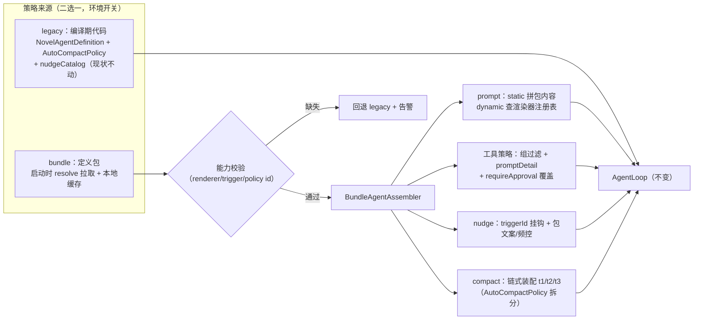
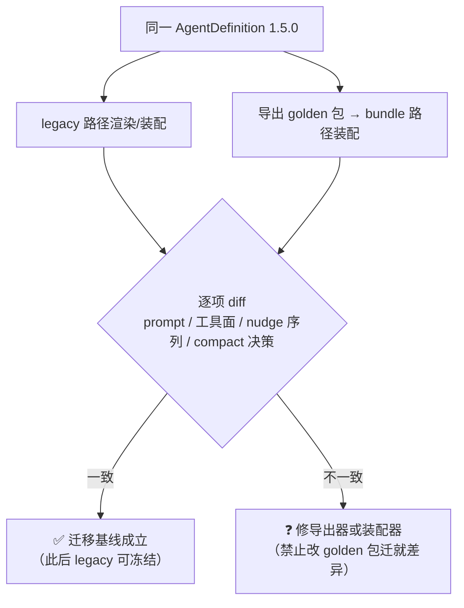
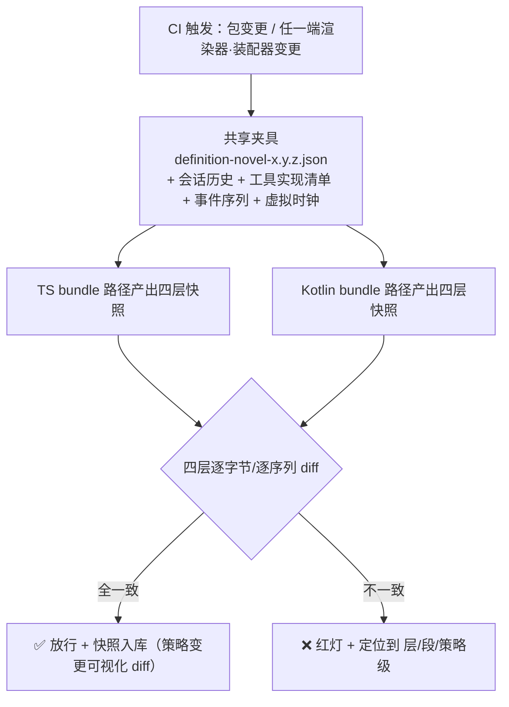

# 定义包-端侧迁移与对拍闭环 PRD —— v0.1

> 状态：⏳ 待敲定（定稿后改 ✅ 已定稿）
> 关联：[`定义包-agent策略统一.md`](./定义包-agent策略统一.md)（M2 已交付 schema/导出器/server 分发/Kotlin 装配）；技术设计 `core/src/runtime/definition/bundle.ts`、`android :core:runtime definition 包`
> 使用说明：新 PRD 从本模板复制起步，固定章节不得删减；流程图必填。

---

## 1. 背景与目标

- 要解决的问题（痛点 / 现状）：
  1. M2 交付了定义包的「生产与消费的一半」：core 能把 1.5.0 策略面**导出**为 golden 包，server 能存储分发 + 能力协商，Kotlin 能装配消费。**但 TS runtime 自身仍走编译期代码路径**——导出现状 ≠ 消费包，桌面端改策略依然要发版，"改包即生效"没有兑现。
  2. 四层对拍（prompt/工具面/nudge 行为/compact 决策）目前只有层1 的 static 种子（双端读同一份 golden JSON）；层 2/3/4 需要 TS 端存在「包驱动装配路径」才有对拍对象。
  3. TS 侧 `AutoCompactPolicy` 是硬编码编排（T1→T2→T3 内嵌在一个类里），nudge 文案散在 definitions 模块常量里——要消费包必须先把这些「结构化」为可参数化的链/目录。
- 目标（一句话，可验收）：TS runtime 具备**包驱动装配路径**（与 legacy 代码路径并存、可切换），同一 AgentDefinition 下两条路径产出逐项一致（零漂移迁移基线），四层对拍在 CI 全量闭环，桌面端策略变更从「发版」变为「上传定义包」。
- 里程碑定位：M2.5（M2 的收尾）——先于 M3（桌面数据通道切 server），因为多端协同的地基是策略统一。

## 2. 用户故事

- 作为开发者，我希望桌面端在 bundle 模式下改一段 nudge 文案只需上传新定义包，以便策略迭代不绑发版。
- 作为开发者，我希望 legacy（代码）路径与 bundle（包）路径可随时切换对比，以便迁移期出问题一键回退。
- 作为开发者，我希望 CI 里 TS 与 Kotlin 在同一夹具下的 prompt/工具面/nudge 序列/compact 决策四层快照全量对拍，以便敢同时动两端。
- 作为自托管用户，我希望设置页能切到指定定义包版本，以便灰度验证后回滚。

## 3. 流程图（必填）

### 3.1 TS 端包驱动装配路径（与 legacy 并存）

### 3.2 零漂移迁移验收（本 PRD 的核心基线）

原则：**golden 包是事实标准**（它由 legacy 现状导出）；bundle 路径与 legacy 的任何差异都是 bundle 路径的 bug，不允许反向修改 golden 来"通过"。

### 3.3 四层对拍 CI 流水线（完整版）

## 4. 功能明细

- **FR1 compact 链式化（TS 前置重构）**
  - 触发：本 PRD 实施（bundle 消费的前置条件）。
  - 处理：把 `AutoCompactPolicy` 内嵌的 T1/T2/T3 拆为三个独立策略类（与 Kotlin 侧 `CompactPolicyChain` 同构：链序 + 各自参数 + force 全链），`AutoCompactPolicy` 退化为兼容壳（内部组装等价链）。行为回归：现有 compact 相关测试全量跑绿（阈值语义逐参数对齐）。
  - 输出：`compact/chain/` 三策略 + 兼容壳 + 回归测试。
- **FR2 TS 包驱动装配器（BundleAgentAssembler）**
  - 处理：消费 `DefinitionBundle`——prompt（static 用包内容、dynamic 按 rendererId 查端上渲染器注册表）、工具策略（组展开/allow-deny/promptDetail/审批覆盖，schemaVersion 校验端实现）、nudge（triggerId 挂钩 + 包内文案与频控参数替换模块常量）、compact（链式实例化 + 包参数注入）。
  - 输出：装配出的 AgentCapability，喂给现有 AgentLoop（loop 不动）。
  - 异常：能力校验失败 → 整包拒绝回退 legacy + 告警日志（对齐 Kotlin 语义）。
- **FR3 双路径切换与零漂移基线**
  - 处理：环境开关（`NOVA_AGENT_MODE=bundle|legacy`，缺省 legacy）切换装配来源；零漂移测试：同一 1.5.0 定义，两条路径的四层产出（prompt 逐字节 / 工具面 / nudge 序列 / compact 决策）逐项一致。
  - 验收后动作：golden 包升为唯一事实源，legacy 路径冻结（只读保留一个版本周期作回退）。
- **FR4 四层对拍 CI 门禁（evals 扩展）**
  - 夹具：golden 包 + 固定会话历史 + 工具实现清单（stub）+ nudge 事件序列（user 输入/压缩完成/idle）+ 虚拟时钟。
  - 处理：TS 与 Kotlin 各自产出四层快照（JSON golden 入库）→ CI 逐层 diff；差异输出定位（层号 + 段 id / 策略 id / nudge id）。
  - 门禁：任一层不一致禁止合并。
- **FR5 定义包发布流水线**
  - 处理：CI 检测 golden 包变更（bundle.test 红灯）→ 提示 bump 版本 → `pnpm -C core run bundle:publish`（版本号 + 上传 server，需管理员 JWT）；本地开发 `bundle:generate` 再生成。
  - 输出：发布脚本 + server 上的版本线（1.5.0 起）。
- **FR6 Kotlin 侧补齐**：dynamic 渲染器注册表首批（tool.policy / tool.guidance / core.environment 三段——与工具面/环境强相关，最值得先通）；nudge triggerId 接线（persistent 钩子挂 AgentLoop 既有事件点）。

## 5. 边界与非目标

- 明确不做：
  - 定义包编辑器 UI / 用户自定义策略编辑
  - 灰度通道（stable/canary 分流）与包签名（留 M5+ 与 JWT 算法迁移一并）
  - nudge 全目录数据化（compose_mode 文案在 runtime 目录外，仅挂钩 triggerId，文案仍代码）
  - 桌面数据通道切 server（M3 范围）
  - 删除 legacy 路径（冻结不删除，保留一个版本周期的回退能力）

## 6. 验收标准

- [ ] compact 链式化：现有 compact 全量测试（core）零回归；AutoCompactPolicy 兼容壳行为与拆分前逐项一致
- [ ] bundle 模式：`NOVA_AGENT_MODE=bundle` 下桌面 runtime 用 golden 包装配，四层产出与 legacy 逐项一致（零漂移测试绿）
- [ ] 能力缺口：构造引用未知 rendererId 的包 → TS 回退 legacy + 告警（与 Kotlin 拒绝语义对齐）
- [ ] 四层对拍：TS/Kotlin 同夹具四层快照一致；人为改任一端阈值/文案 → CI 红灯且定位信息含层/段/策略 id
- [ ] 发布流水线：bump 版本上传 → server 出现新版本；resolve 能力协商对新版本选版正确（老端仍停旧版）
- [ ] Kotlin：tool.policy/tool.guidance/core.environment 三段渲染器在 golden 包驱动下产出与 TS 层1 对拍一致；nudge 挂钩触发注入落 journal
- [ ] 全量回归：core 891+ / server 26+ / Kotlin 41+ 测试绿

## 7. 开放问题

- legacy 冻结的退出节奏（一个版本周期 = 几次发版？回退开关保留多久）
- 零漂移基线中 `core.environment` 段含渲染时日期/时区——夹具需虚拟时钟注入 TS 渲染器（现状渲染器直接 `new Date()`，需小改）
- nudge 频控参数数据化后与现有"每压缩纪元/每 run"状态机的对应表（部分频控是策略内部状态，参数化边界要逐条确认）
- 发布权限：M2 上传端点仅要求 JWT——管理员角色与普通用户分离（RBAC 扩展）何时做
- Kotlin dynamic 渲染器与 TS 渲染器的实现漂移风险：三段之外的第二批（四个标准段）是否值得，还是等真实需求
