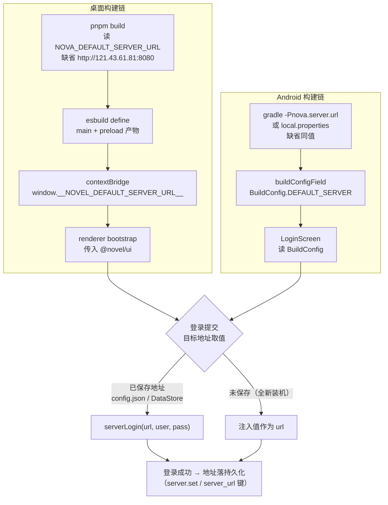
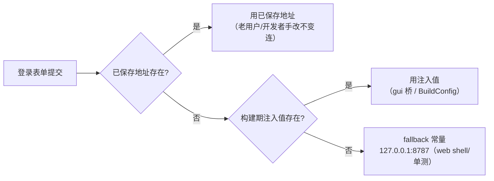

# 客户端固定server-构建期注入 PRD —— v0.1

> 状态：⏳ 待敲定（定稿后改 ✅ 已定稿）
> 关联：整体产品 PRD [`产品总览.md`](./产品总览.md)；[`端云架构-数据层server化.md`](./端云架构-数据层server化.md)；[`纯云端化-退役本地模式.md`](./纯云端化-退役本地模式.md)（登录强制）；技术设计 `docs/architecture.md`
> 使用说明：新 PRD 从本模板复制起步，固定章节不得删减；流程图必填。

---

## 1. 背景与目标

- 要解决的问题（痛点 / 现状）：
  1. server 已部署公网（`http://121.43.61.81:8080`，systemd + 自动更新定时器），但两端客户端仍要求用户手输地址：桌面 LoginPage 预填 `http://127.0.0.1:8787`（写死在 `DEFAULT_SERVER_URL` 常量），Android `:app` LoginScreen 地址输入框默认空串、hint 占位 `https://your-nova-server`。
  2. 默认地址散落各端无统一来源：桌面唯一默认在 ui 层常量，构建层（tsc / esbuild / vite）没有任何 define 注入机制；Android 仅有 debug 预填（`local.properties nova.dev.server → BuildConfig.DEV_SERVER`，release 不生效）。
  3. 地址对普通用户是不可理解的技术细节（IP + 端口），登录表单应只有账号密码。
- 目标（一句话，可验收）：server 地址在**构建期注入**（参数可换、缺省指向公网 server），两端登录页去掉地址输入，开箱只输账号密码即可登录成功。

## 2. 用户故事

- 作为作者，我希望首启登录页只有用户名和密码，以便不懂 server 地址也能直接上手。
- 作为构建者，我希望构建时指定默认 server 地址（桌面 `NOVA_DEFAULT_SERVER_URL` / Android `nova.server.url`），以便分发连接不同 server 的客户端，不用改代码。
- 作为已有配置的用户，我希望客户端仍连我配置文件里已保存的地址，以便升级后不断连。

## 3. 流程图（必填）

### 3.1 主流程（两端并行注入，汇合于登录提交）

### 3.2 状态流转（server 地址来源优先级）

## 4. 功能明细

- **FR1 桌面构建选项**：
  - 触发：`pnpm build` / `build:incremental`（内部 `build-minimal.mjs`）。
  - 输入：环境变量 `NOVA_DEFAULT_SERVER_URL`。
  - 处理：main 与 preload 两个 esbuild bundle 加 `define: { "process.env.NOVEL_DEFAULT_SERVER_URL": JSON.stringify(url) }`，`url = env ?? "http://121.43.61.81:8080"`。
  - 输出：产物内常量替换；构建日志回显实际注入值。
  - 异常：未设置环境变量 → 用缺省公网地址，不报错。
- **FR2 桌面桥暴露**：
  - 触发：Electron preload 初始化。
  - 处理：沿 `__NOVEL_LOG_LEVEL__` 同构模式 `contextBridge.exposeInMainWorld("__NOVEL_DEFAULT_SERVER_URL__", ...)`，空串表示未注入；renderer 读桥值非空经 bootstrap 传入 ui；类型声明同步。
- **FR3 桌面登录去地址化**：
  - 触发：LoginPage / ServerSettingsPanel 渲染与提交。
  - 处理：删 URL 输入框、`DEFAULT_SERVER_URL` 预填与已配置回填分支；登录/注册提交 `serverLogin(已存 url ?? 注入值, ...)`；成功态「用户名@server」展示实际连接 host；ServerSettingsPanel 删地址输入，未配置提示与在线态只读展示当前 server，agentMode 切换保留。
  - 输出：表单 = 用户名 + 密码（+注册切换）。
  - 异常：无桥注入（web shell / 单测）→ fallback `127.0.0.1:8787`；已保存地址优先于注入值（老用户不断连）。
- **FR4 Android 构建选项**：
  - 触发：`:app` 任意构建。
  - 输入：gradle 属性 `-Pnova.server.url` 或 `local.properties` 键 `nova.server.url`（沿用 `nova.dev.*` 的 local.properties 惯例；属性优先）。
  - 处理：`app/build.gradle.kts` 复用 devField 模式新增 `buildConfigField("String", "DEFAULT_SERVER", ...)`，缺省 `http://121.43.61.81:8080`。
  - 输出：`BuildConfig.DEFAULT_SERVER`；release/debug 均生效。
- **FR5 Android 登录去地址化**：
  - 处理：LoginScreen 删「服务器地址」输入框、`http(s)://` 前缀校验与 `DEV_SERVER` debug 预填链路（`DEV_USER`/`DEV_PASS` 保留）；提交 `serverLogin(user, pass, 已存 serverUrl ?: BuildConfig.DEFAULT_SERVER)`；成功态与 SettingsScreen 只读展示实际连接 host。
- **FR6 Android 明文放行（过渡）**：
  - 处理：main AndroidManifest 放开 cleartext（debug 原本就放开，补 release），否则 release 包连不上 `http://` 的固定 server。
  - 异常：属 TLS 上线前的过渡措施，上 TLS 后回收（开放问题②）。
- **FR7 测试**：
  - ui：注入 URL 作为登录目标、无桥 fallback、已保存地址优先于注入值、登录页无地址输入的用例；ServerSettingsPanel 只读展示用例。
  - Android：BuildConfig 注入值正确性由 `assembleDebug` 产物核验（UI 层无既有测试基建，不新增）。

## 5. 边界与非目标

- 明确不做：
  - core / core:net 库模块改动（地址本就运行时注入，宿主传入）
  - 运行时改地址（改目标 = 重新构建；已保存配置文件手改仍生效）
  - 服务器上 TLS / 域名（另议，见开放问题②）
  - 额外防篡改锁定（防逆向提取地址不在威胁模型内）
  - core 契约 `serverLogin(url, ...)` 签名与持久化语义变更（config.json `server.set` / DataStore `server_url` 落库时机不变）

## 6. 验收标准

- [ ] 桌面：全新 userData 首启登录页无地址输入框，仅账号密码；登录请求打到 `http://121.43.61.81:8080`
- [ ] 桌面：`NOVA_DEFAULT_SERVER_URL=http://x pnpm build` 后产物 grep 含 `x`，登录打到 x
- [ ] 桌面：config.json 已配置 url 的用户仍连已配置地址
- [ ] 桌面：ServerSettingsPanel 无地址输入，只读展示当前 server；agentMode 可切换
- [ ] Android：`:app:assembleDebug` 产物 BuildConfig 含注入值；缺省构建含 `http://121.43.61.81:8080`，`-Pnova.server.url=http://x` 含 x
- [ ] Android：LoginScreen 无地址输入框；release 构建允许明文 http
- [ ] 回归：`pnpm --filter @novel/ui check && pnpm --filter @novel/ui test` 全绿

## 7. 开放问题

- 开源仓库缺省值指向个人公网 server（注册开放，陌生构建用户会连上来）——是否改为仓库默认 `127.0.0.1:8787` + 个人构建用变量覆盖？（当前按「缺省即公网地址」实施）
- 明文 HTTP 过渡的安全面：公网裸 HTTP 传密码，建议尽快在 nginx 上 TLS 终止后收紧 cleartext
- 开发者切本地 server 仅剩手改配置文件（config.json / DataStore）或带参数构建——是否需要保留隐藏的地址调试入口？
