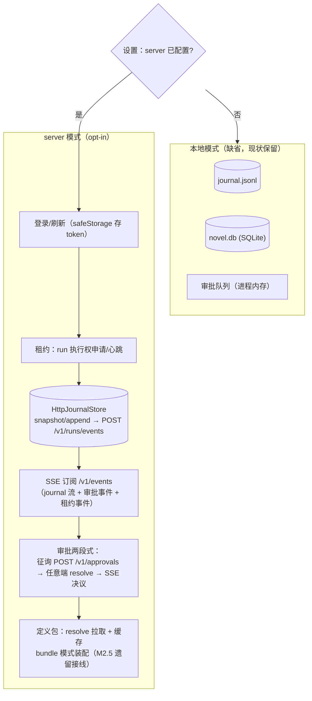
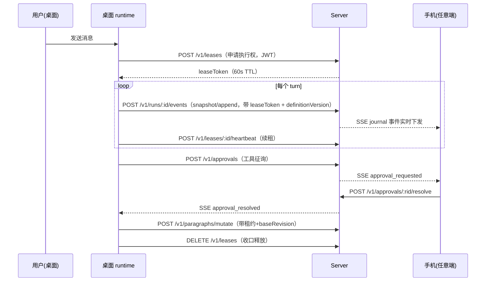
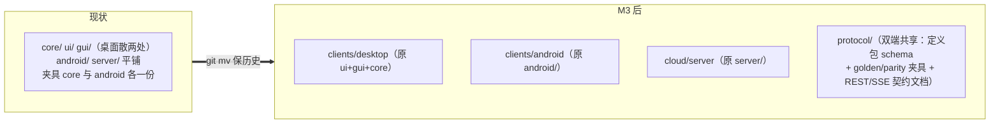
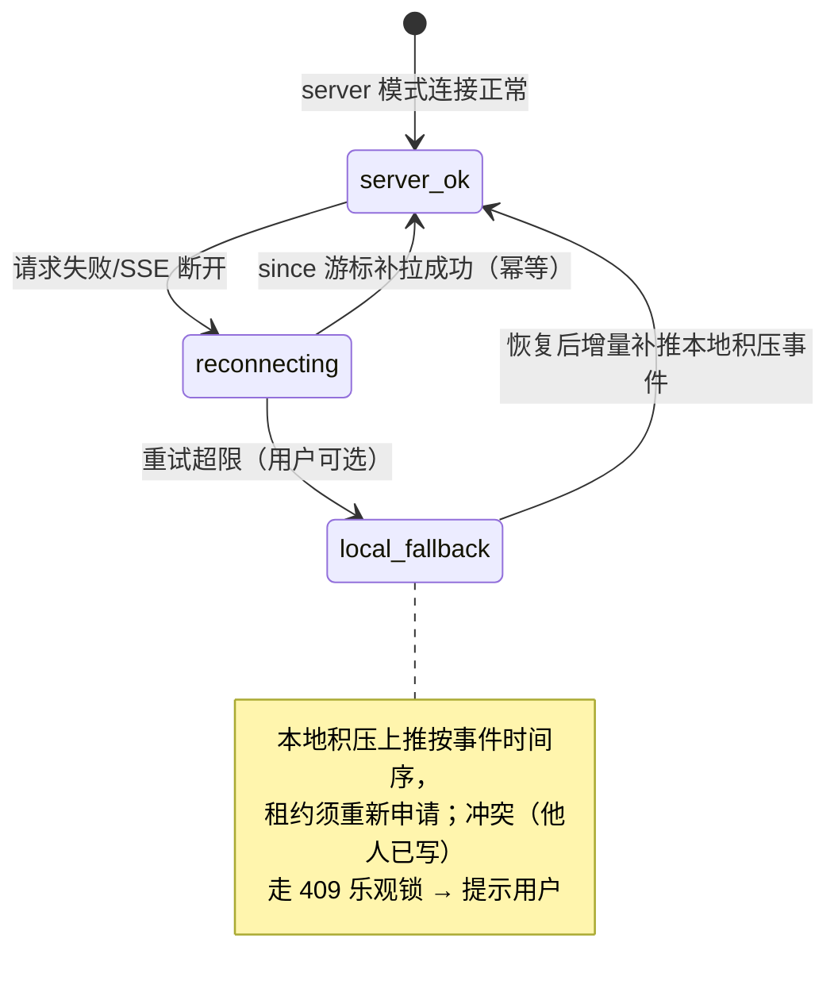

# 桌面接入-数据通道server化 PRD —— v0.1

> 状态：✅ 已实施（feat/m3-desktop-server-channel：目录重构/认证/HttpJournal/SSE/审批/租约/bundle 接线/契约+e2e 测试全落地；验收项见 §6 勾选）
> 关联：[`端云架构-数据层server化.md`](./端云架构-数据层server化.md)（server 已就绪）；[`认证-登录与多端会话.md`](./认证-登录与多端会话.md)；[`定义包-端侧迁移与对拍闭环.md`](./定义包-端侧迁移与对拍闭环.md)（bundle 接线遗留项并入本 PRD）
> 使用说明：新 PRD 从本模板复制起步，固定章节不得删减；流程图必填。

---

## 1. 背景与目标

- 要解决的问题（痛点 / 现状）：
  1. server 侧已就绪（账本/租约/审批两段式/认证/定义包分发，26+ 测试绿），但**桌面端仍全本地**：journal 写本地 JSONL、审批队列进程内存、无认证无租约——端云架构在桌面侧没有兑现。
  2. M2.5 遗留两件事：bundle 模式生产接线（装配能力已证明零漂移，但运行时未切换）；双端共享夹具手工复制（`protocol/` 单一来源未建）。
  3. 目录结构债：端云分层不可见、两个 "core" 歧义——已确认在本里程碑顺路重构（M3 本来就要大动 gui/core 数据通道，搬家成本摊薄）。
- 目标（一句话，可验收）：桌面端在「配置了 server」时数据通道全切 server（journal 上推/SSE 订阅/租约/审批两段式/认证登录/定义包拉取），未配置时保持现有本地模式完整可用；`protocol/` 成为双端共享契约单一来源；目录结构按端云分层重排。
- 关键决策（迁移策略）：**本地模式是缺省，server 模式是 opt-in 配置**——不做一刀切。理由：自托管 server 尚未普及、本地优先是产品立身之本；两条通道并存由 JournalStore 等既有抽象保证成本可控（Android 侧同一套接口双实现已验证此路可行）。

## 2. 用户故事

- 作为自托管用户，我在设置页填入 server 地址并登录后，桌面会话的数据实时进 server——手机打开同一会话能看到进度并接续。
- 作为自托管用户，我拔掉 server（关机/断网），桌面回到本地模式照常写作——已上推的数据都在 server，本地期间新写的数据留在本地。
- 作为用户，我在桌面收到手机挂起的审批征询（SSE 推送），直接在桌面批掉。
- 作为开发者，我希望 TS 侧 journal/novel/审批的 server 实现与本地实现跑同一套契约测试，接口行为不漂移。

## 3. 流程图（必填）

### 3.1 桌面端双模式数据通道

### 3.2 server 模式下一个 run 的完整时序

### 3.3 目录结构重构（本里程碑顺路做）

注：pnpm workspace 与 Gradle 工程内部结构不动，只动顶层归位；`protocol/` 内夹具由 TS/Kotlin 测试以相对路径直读（消灭手工 cp）。

## 3.4 断线降级状态机

## 4. 功能明细

- **FR1 桌面认证与配置**
  - 触发：设置页填写 server 地址 + 登录。
  - 输入：server URL、username/password。
  - 处理：调 `/v1/auth/login` 取双令牌；access/refresh 存 Electron safeStorage；定时刷新（过期前 1min 轮换）；复用检测触发全端重登的 UI 提示；设备管理页入口（列表/踢出）。
  - 输出：连接状态指示（在线/离线/未配置）。
  - 异常：server 不可达——保持本地模式 + 状态指示降级，不阻塞写作。
- **FR2 HttpJournalStore（TS）**
  - 处理：实现桌面端 `FileConversationJournalService` 同契约（open/appendSnapshot/appendMessages/readAll/rewriteAll → 对应 REST）；写路径带租约；`rewriteAll`（压缩重写）在 server 模式下的语义 = 全量重推（带租约 + 乐观校验最后 seq），实现方式与 server 协商（新增 `PUT /v1/journal/:id/rewrite` 端点，409 防并发覆盖）。
  - 异常：断线——写请求进本地待推队列（顺序保持），恢复后按序补推；补推遇 409 → 提示冲突。
- **FR3 SSE 订阅与事件桥**：`/v1/events?conversationId&since` 订阅 → 桥接到桌面既有事件 hub；重连游标 = 本地最大 seq；审批/租约事件进各自处理器（FR4/FR5）。
- **FR4 审批两段式接入**：`gateBatch` 的 `sendApprovalRequest` 在 server 模式下改 POST `/v1/approvals`；SSE `approval_resolved` 回填 pendingApprovals（替换进程内 resolver）；桌面 UI 同时可批手机挂起的征询（审批中心列表 GET `/v1/approvals?status=pending`）。
- **FR5 租约接入**：run 启动申请、turn 间心跳、收口释放（3.2 时序）；409（他端持有）→ 会话转只读模式（看 SSE 进度）+ 提示；410（被回收）→ 中止 run 走恢复流程。
- **FR6 bundle 模式生产接线（M2.5 遗留）**：`NOVA_AGENT_MODE=bundle|legacy`（缺省 legacy）+ 设置页开关；resolve 拉包（能力声明从注册表自动推导）→ 本地缓存 → `renderSystemFromBundle`/`autoCompactOptionsFromBundle`/`applyToolOverrides` 接入装配路径；能力校验失败回退 legacy + 告警。
- **FR7 目录重构**：`git mv` 归位（clients/desktop、clients/android、cloud/server、protocol/）；夹具/契约迁入 `protocol/` 并双侧改读相对路径；`docs/architecture.md` 补顶层结构图与术语表（消解双 "core" 歧义）；CI 路径与文档链接同步更新。
- **FR8 契约测试**：HttpJournalStore 与本地 JSONL 实现跑同一套契约测试（对齐 Android 双实现模式）；断线队列/补推/冲突路径有集成测试（mock server）。

## 5. 边界与非目标

- 明确不做：
  - Android 端 server 接入（M4：HttpJournalStore/RemoteNovelStore 的 Kotlin 版）
  - 本地↔server 双向数据迁移工具（旧本地会话导入 server，另立小需求）
  - 桌面审批 UI 大改（仅新增审批中心列表 + 既有卡片复用）
  - server 模式下的离线写自动合并（断线积压仅顺序补推，冲突人工裁决）
  - 多窗口多会话并发的租约细化（每会话一租约，已够）

## 6. 验收标准

- [x] 设置页登录 → 双令牌入 safeStorage；断网状态指示降级、写作不受阻（ServerAuthSession offline 状态机 + 未配置零侵入）
- [x] server 模式：完整 run 时序 e2e 通过（desktop-contract.test.ts：租约互斥/上推/SSE 实时/跨端 resolve/rewrite 409 自纠）
- [x] 同一契约测试套件：HttpConversationJournalService 与本地 JSONL 行为一致（describe.each 双实现，append 折叠/writeRuns/open 幂等）
- [x] 断线降级：本地积压 sidecar → 恢复按序补推；409 冲突抛 JournalRewriteConflictError（http-journal.test.ts）
- [x] 他端持租约 → LeaseHeldError 阻止 spawn（会话只读提示路径）；被回收 → 410 LeaseLostError
- [x] bundle 模式：NOVA_AGENT_MODE/bundle 注入 buildNovelAgent；能力缺口回退 legacy + 告警；零漂移测试仍绿（core 923）
- [x] 目录重构：git mv 保历史；protocol/ 夹具 TS 直读 + Gradle Sync 任务（删除手工副本）；全量测试绿（core 923 / server 40 / Kotlin 47）
- [x] 本地模式回归：未配置 server 时所有新路径不激活（session unconfigured 直通、env 不注入），既有测试零改动通过

## 7. 开放问题

（M3 实施时敲定，记录如下）

- ~~rewriteAll 上推协议~~ → **PUT /v1/journal/:id/rewrite 全量重写**（事务原子 + expectedLastSeq 乐观校验 409 附当前值）已落地
- ~~断线积压存储位置~~ → **journal 同目录 sidecar `pending-push.jsonl`**，10k 行上限（超限 PendingPushOverflowError 转只读提示）
- SSE 认证：维持查询参数 token（自托管档位可接受），一次性 ticket 升级留端云 PRD 档位 3
- bundle 模式默认值翻转为 bundle：待一个版本周期观察后另立小改动
- 桌面「只读模式」最小 UI（他端持有提示/进度条形态）：M3 已通 server-events 通道与数据，UI 呈现留 M4 一并做
