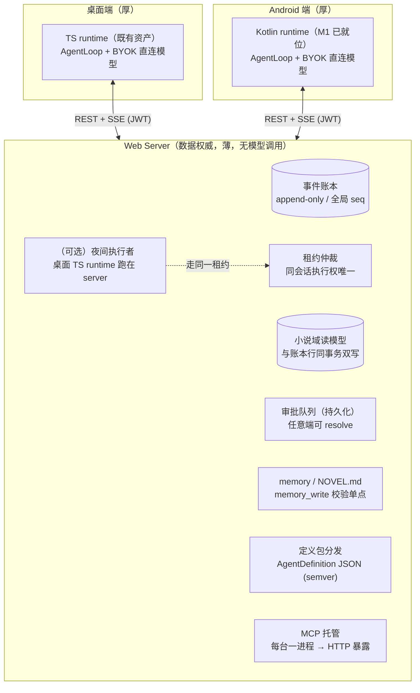
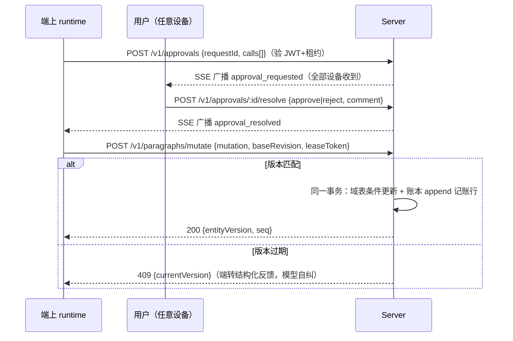
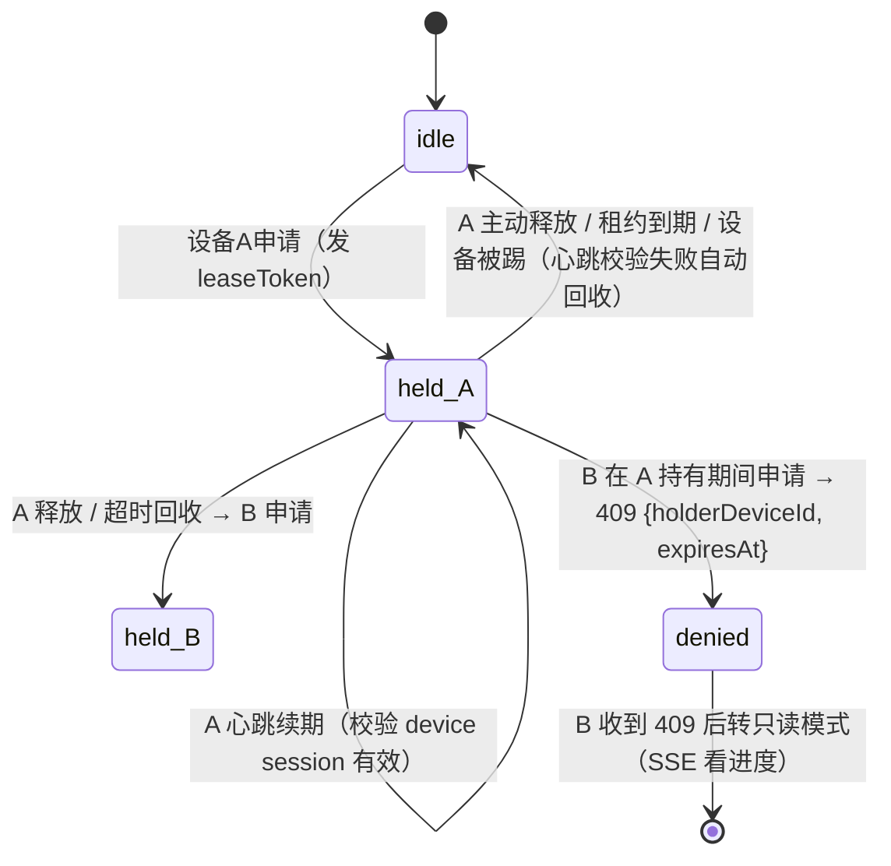
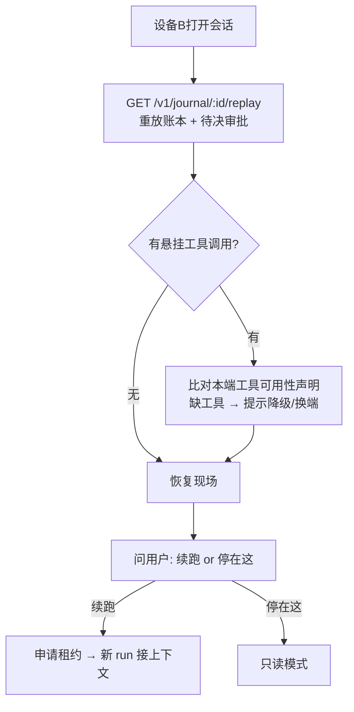
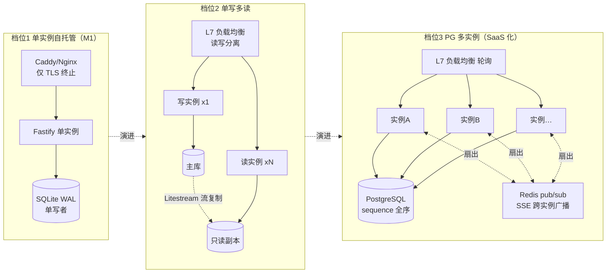

# 端云架构-数据层server化 PRD —— v0.1

> 状态：⏳ 待敲定（定稿后改 ✅ 已定稿）
> 关联：整体产品 PRD [`产品总览.md`](./产品总览.md)；认证 [`认证-登录与多端会话.md`](./认证-登录与多端会话.md)；移动端 [`android-移动端MVP.md`](./android-移动端MVP.md)；技术设计 `server/`
> 使用说明：新 PRD 从本模板复制起步，固定章节不得删减；流程图必填。

---

## 1. 背景与目标

- 要解决的问题（痛点 / 现状）：
  1. 现架构（桌面单机 + android 平移版）数据都在端上：多端共享靠「未来再说」，换设备/重装 = 数据搬家；审批队列是进程内存态，崩溃即丢。
  2. MCP stdio 子进程在 Android 沙箱跑不了，工具面在端间不一致。
  3. runtime 的 prompt/compact/nudge 策略散落在 TS/Kotlin 两份代码里，靠人肉对齐。
- 目标（一句话，可验收）：数据层（事件账本 + 域库 + 审批队列 + memory + 定义包 + MCP 托管）迁为 Web Server，端上保留完整 runtime（模型调用 BYOK 直连），跨端续跑可用，档位 1 部署形态的契约测试全绿。
- 定性（一句话）：**权威的是事件顺序和定义包版本，不是数据存放地、更不是代码副本。**

## 2. 用户故事

- 作为连载作者，我希望通勤时在手机上续写、回家在桌面端无缝接着改，以便碎片时间不浪费。
- 作为连载作者，我希望手机锁屏离开后审批挂起，回家用桌面端（或任意设备）继续批准，以便审批不被设备绑架。
- 作为用户，我希望在自己家里的一台常开主机上部署 server、所有设备连接它，以便数据自主可控（本地优先的延续）。
- 作为用户，我希望模型 API key 永远留在我的设备上，以便隐私自持（BYOK 原则不变）。

## 3. 流程图（必填）

### 3.1 端云总架构（runtime 端上为主 + server 可选执行者）

### 3.2 写路径：提案 → 审批 → 带租约提交 → 同事务落库记账

### 3.3 租约状态机（一个会话同一时刻只有一个执行端）

### 3.4 跨端续跑（硬需求）

### 3.5 部署三档演进（本 PRD 核心：按需演进，不提前实现）

**原理速查表**：

| 概念 | 原理（为什么） |
|---|---|
| L4 vs L7 负载均衡 | L4 按 IP/端口转发（不解析协议，快但看不见路径）；L7 解析 HTTP（能按路径/方法分流，如读写分离、`/v1/events` SSE 单独池）。档位 2 起需要 L7 |
| 粘性会话 vs 无状态 | 有状态 session 必须把用户钉在同一实例（粘性），实例挂了状态就丢；JWT 无状态验签让任何实例可服务任何请求——**水平扩展的前提是先把状态外置**（状态在 DB/Redis，不在实例内存，SSE 除外） |
| SSE 与 LB 的矛盾 | SSE 长连接钉死在某实例上：事件写进实例 A 的内存，实例 B 的订阅者收不到。解法：写路径事务提交后 publish 到 Redis pub/sub，**所有实例订阅并各自推给各自的连接**（扇出），连接仍粘实例、事件不粘实例 |
| SQLite 单写者 | 单文件单写者是吞吐上限，但写路径是低频的（审批落库 + 事件追加），个人规模绰绰有余；WAL 模式让读不阻塞写。**不做假扩展**——档位 1 的 LB 只做 TLS，承认单点 |
| 读写分离为何安全 | 事件账本 append-only + `since=seq` 游标：只读副本滞后时，客户端重放幂等补拉即可，「读旧一点」只是进度旧一点，不是数据错误 |
| 全局 seq（档位 3） | 多实例并发 append 必须有权威全序：seq 取自 PG sequence（数据库原子分配），实例数无关 |
| 乐观锁多实例安全 | 条件更新 `WHERE entity_version = :base` 由数据库原子仲裁，谁的 base 过期谁被拒——不需要分布式锁，实例数无关（这也是当初选乐观锁的远见） |

## 4. 功能明细

- **FR1 事件账本（Ledger）**
  - 触发：端上 runtime 的每次 journal 追加。
  - 输入：`POST /v1/runs/:conversationId/events` {runSeq, kind: snapshot|append, messages[], definitionVersion, leaseToken}（JWT）。
  - 处理：验 JWT → 验租约（token 属于该会话有效租约）→ INSERT（自增 seq = 权威全序）→ SSE 广播。
  - 输出：`{seq}`（全局序号，端记入本地缓存游标）。
  - 异常：无租约/租约过期 423；SSE 断线 → 客户端 `since=seq` 补拉（幂等）。
- **FR2 重放与事件流**：`GET /v1/journal/:id/replay`（全量行 + 待决审批，恢复用）；`GET /v1/events?conversationId=&since=` SSE（先推积压再推实时；15s 心跳注释行防中间件断连）。协议细节：SSE 载荷 = 账本行 JSON / 审批事件 JSON，按 `type` 判别。
- **FR3 域库写（乐观锁 + 同事务记账）**：见 3.2。域表条件更新与账本 append 行**在同一个 SQLite 事务**内——原理：消除「域数据变了但账本没记」的窗口，账本天然就是可重放的变更流（对照桌面端 store/journal 两层分离的最终一致隐患，server 端同事务是升级）。
- **FR4 租约**：申请/心跳/释放（3.3 状态机）；心跳校验 deviceId 的 session 有效性，被踢设备自动回收；TTL 缺省 60s，心跳 20s。
- **FR5 审批队列（两段式持久化）**：征询落库（pending）→ SSE 广播 → **任意同账号设备**可 resolve → 广播决议 → 持有租约的端恢复执行；120s 无决议标 expired（读时惰性判定）。修复桌面端 WaitRequestQueue 纯内存缺陷，且支持「手机挂起、桌面批」。
- **FR6 memory / NOVEL.md**：项目文件表存储。`memory/<name>.md` 写入走 **memory_write 校验单点**（source 必填且指回账本 seq、索引一致性由 server 维护）；**NOVEL.md 只能经审批提案变更**（resolve 通过后由 server 落盘，任何路径不得静默改写——对齐两层记忆 PRD 的所有权设计）。
- **FR7 定义包分发**：AgentDefinition 序列化为 JSON（semver，含 recipe 段序/文案/工具组/nudge 开关/compact 阈值），server 权威存储 + `GET /v1/definitions` 分发，端缓存；每个 run 的账本行携带 definitionVersion（重放时可解释版本切换）。M2 实施数据化，M1 表结构与 API 位预留。
- **FR8 MCP 托管**：MCP server 配置存 server，每台一进程拉起（进程隔离 + 8s 连接超时 + 非受信默认过审），端只看到 HTTP 工具面。M5 实施。

## 5. 边界与非目标

- 明确不做（本 PRD 范围）：
  - server 端模型调用（除「夜间执行者」可选项外，server 永不碰模型流量）
  - 端上离线写与冲突合并（版本向量 + 冲突走审批，列为远期；档位 1 自托管局域网场景价值有限）
  - 多用户协作/项目分享（project_members 表预留）
  - 端云间的 .db 文件同步（同步对象是事件流，永远不是库文件）
  - 档位 2/3 的具体实施（本 PRD 只定义演进路径与不变式；触发指标见 §7）

## 6. 验收标准（M1 / 档位 1）

- [ ] 认证全流（见认证 PRD）绿
- [ ] 账本：上推严格按 seq 全序；`since` 游标补拉幂等；SSE 先积压后实时
- [ ] 租约：互斥（第二设备 409 + holder 信息）、心跳续期、超时回收、设备被踢后心跳失败自动回收
- [ ] 审批两段式：设备 A 征询 → 设备 B resolve → A 收到 SSE 决议；120s 过期标 expired
- [ ] 域库写：baseRevision 匹配成功且账本行同事务产生（两者 seq 连续可见）；过期 409 附当前版本号
- [ ] memory：无 source 拒绝；NOVEL.md 直接写被拒、经审批提案通过后落盘
- [ ] e2e 冒烟：注册→登录→申请租约→上推事件→SSE 收流→换端 resolve→重放恢复
- [ ] 所有受保护接口无 JWT 返回 401；跨用户访问返回 403（owner-only）

## 7. 开放问题

- 档位 2/3 的触发指标：并发写 QPS、SSE 连接数、重放延迟的量化阈值（何时值得迁 PG）
- SSE 鉴权：EventSource 不支持自定义 header——用 `?token=` 查询参数（会进访问日志，需评估）或短时效一次性 ticket（倾向后者）
- 定义包签名：防止被篡改的 server 下发恶意定义（可选：与 JWT 同源的 HS256/EdDSA 签名）
- 账本压实：无限追加的账本文件增长与快照策略（run 粒度 snapshot 已缓解，长生命周期项目再评估）
- 档位 3 的 JWT 算法迁移（HS256 → EdDSA，公钥可下发多实例验证）
