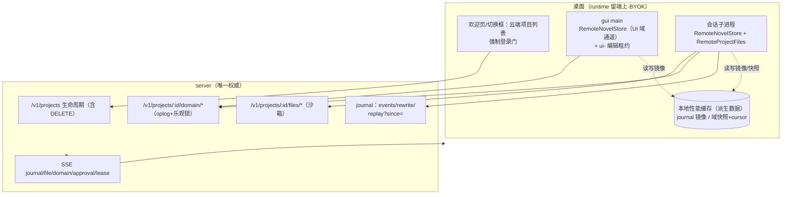
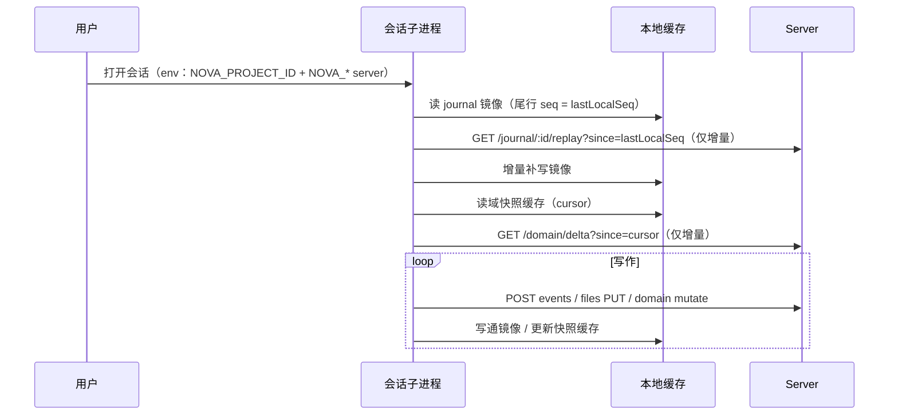
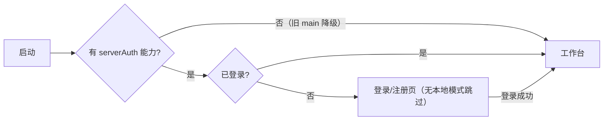

# 纯云端化-退役本地模式 PRD —— v0.1

> 状态：📝 待评审
> 关联：[`项目域上云-纯云端项目.md`](./项目域上云-纯云端项目.md)（v0.2 期 1 已实施——**本 PRD 推翻其「双模式并存/本地零回归」决策**）；[`桌面接入-数据通道server化.md`](./桌面接入-数据通道server化.md)（M3 已实施）；[`认证-登录与多端会话.md`](./认证-登录与多端会话.md)
> 里程碑：纯云端化收敛（B 线终态）。方向已定：**彻底退役本地项目模式**，server 为唯一数据权威，本地仅保留可随时丢弃的性能缓存。

---

## 1. 背景与目标

- 要解决的问题（痛点 / 现状，均已代码核实）：
  1. **双模式并存的方向性债务**：v0.2 保留本地模式导致欢迎页/切换对话框双分区、登录门可「本地模式使用」跳过、打开/新建/删除要维护两套编排——与「数据层 server 化」相悖。
  2. **性能缺口**：云会话冷启动把全量账本**拉两遍**（journal `reconcile()` + `readRunsFromServer()`，server `GET replay` 无 `since` 参数）；域快照每次子进程启动全量拉、cursor 只存内存；云会话 **UI 历史为空**（`projectedHistory` 读不存在的本地 journal.jsonl）。
  3. **期 1 遗留两处断链（bug 级）**：
     - env 前缀断链：子进程云分支读 `NOVA_SERVER_URL/NOVA_SERVER_ACCESS_FILE`，main 只注入 `NOVEL_*` → GUI 正常打开云项目时 Remote 分支实际不激活（此前冒烟靠 shell 环境碰巧透传）；
     - UI 手动域写分叉：CharacterStore / LocationStore / ManuscriptStructureStore / StoryOutlineTreeStore 直接 `api.novel.mutate` 落 main 本地 novel.db，云项目下与 server 分叉。
- 目标（一句话，可验收）：登录强制、打开项目 = 云端项目列表；journal/文件/域全部 server 唯一权威；本地只留性能缓存（journal 镜像 + 域快照缓存），重开会话**增量恢复**且 UI 历史非空。
- 决策记录：
  - 导入功能（.txt/.zip 拆书）**暂时隐藏入口**，core 代码与测试保留，「云端导入」后续单独立项；
  - 存量本地项目**不迁移、UI 不再展示**（registry/磁盘原样保留，为将来迁移工具留据）；
  - 未登录/离线：**强制登录 + server 可达**，缓存只提速，不做离线可用。

## 2. 用户故事

- 作为作者，我打开 App 必须登录；项目列表就是云端项目，点开即写，全程没有「文件夹」概念。
- 作为作者，我重开一个长会话，历史消息从本地镜像秒开、只增量拉新消息；大纲/人物面板立即有数据。
- 作为作者，我在 UI 里手动新建角色/卷章，编辑直接进云端项目——agent 与我看到同一份。
- 作为作者，我删除云端项目，server 软删 + 本地缓存清理干净，换设备不可见。

## 3. 流程图（必填）

### 3.1 目标态架构（本地 = 可丢弃缓存）

### 3.2 云会话冷启动时序（增量恢复）

### 3.3 登录门禁（强制）

## 4. 功能明细

- **FR1 server replay 增量参数**：`GET /v1/journal/:id/replay?since=`（缺省 = 全量，向后兼容；`(conversation_id, seq)` 索引现成，查询模式照抄 SSE 积压）。
- **FR2 journal 本地镜像（消息回放缓存）**：`HttpConversationJournalService` 增可选 `mirrorPath`（= `storedir/conversations/<cid>/journal.jsonl`，与 File 版同行协议）：POST events 201 成功追加镜像、PUT rewrite 成功整文件重写、失败不写（server 权威）；本地游标 = 镜像尾行 seq。恢复路径（`reconcile` + `readRunsFromServer`）改为「镜像折叠 + `replay?since=` 增量合并」，消除冷启动双全量；`projectedHistory` 因镜像存在而自愈（UI 历史非空，main 注入路径零改动）。
- **FR3 域快照缓存**：`RemoteNovelStore` 增可选 `cachePath`：`init()` 缓存命中 → 载入投影+cursor 后仅 `sync()` delta；未命中 → 全量 snapshot 后落缓存；命中判定以 cursor 为准（sessionTag 含 pid 重启即变，重放自身操作对幂等投影无害）。缓存文件 = `cloud-projects/<id>/.novel/cache/domain-snapshot.json`。
- **FR4 云项目 UI 域通道**：云项目打开时 main 不再开本地 novel.db，改在 main 内构造 `RemoteNovelStore`（sessionTag = `ui-<projectId>`，`getLeaseToken` 懒获取 UI 编辑专用租约 conversationId = `ui-<projectId>`，心跳维持、项目关闭释放）；UI 手动 mutate 经 server oplog，agent 子进程写的域数据 UI 下次 query（init+sync）即可见。租约与子进程会话租约 conversation id 不同、不互斥；域级并发由 entity_version 乐观锁 + 409 自纠兜底。
- **FR5 env 断链修复**：`applyServerEnv` 同步注入 `NOVA_SERVER_URL/NOVA_SERVER_ACCESS_FILE` 别名（子进程云分支实际读取名），并加「云分支激活」回归测试。
- **FR6 UI 云-only**：
  - 登录门强制：删「暂不登录，本地模式使用」与 `loginGateStorage`；LoginPage/ServerSettingsPanel 本地模式叙事清除；
  - ProjectSelectionPage / WorkspaceSelectionDialog 只留云端分区（列表 + 新建只命名 + 打开 + 删除确认）；数据源 `cloudProjects.list`；
  - 云项目删除：`cloudProjects.remove(projectId)` = server `DELETE /v1/projects/:id`（软删）+ registry 条目移除 + 缓存目录清理（开着先 close）；
  - workspaceApi 瘦身：删 `pickWorkspace/createWorkspace/本地 delete/listRecent/adoptLegacyData`；多实例（新窗口/启动工作区）改按 projectId 派发。
- **FR7 导入下线**：projectImportFace 不再 expose、UI 入口删除（core 的 ProjectImportService/novel.import 组与测试保留）。
- **FR8 测试**：server `since` 用例表；core 镜像写通/rewrite 重写/失败不写/缓存命中只发 delta/增量合并；ui 云-only 重建 + **补齐云分区零覆盖**；desktop-contract e2e 增量恢复与 UI 历史断言。

## 5. 边界与非目标

- 明确不做（本期）：
  - 离线只读模式（离线 = 明确错误提示，缓存只提速）；
  - 本地项目 → 云项目迁移工具；云端导入（拆书→域实体上传）——均后续立项；
  - 缓存合并/冲突解决（写永远在线走 server，本地无写主权）；
  - **双模式并存（本 PRD 明确推翻 v0.2 §5「本地项目零回归」承诺）**。
- 本地缓存 = 派生数据：可随时删除，删除后自动全量重建；registry 删除云项目时随缓存目录一并清理。

## 6. 验收标准

- [ ] 强制登录：未登录无法进入工作台，全 UI 无「本地模式」入口与文案
- [ ] 打开项目 = 云端列表；新建只命名；删除 = server 软删 + registry/缓存清理
- [ ] UI 手动域写（建角色/卷章）在 server `domain_entities` 可见；agent 写后 UI 下次 query 可见（无本地 novel.db 分叉）
- [ ] 云会话重开：测试/日志断言增量恢复（非全量 replay ×2）；UI 历史非空
- [ ] 域快照缓存命中后 `init` 只发 delta 请求
- [ ] env 断链修复有回归测试（云分支激活）
- [ ] 回归：core / server / ui vitest 全绿 + gui tsc 0 + android gradle
- [ ] 文档：`protocol/cloud-project-api.md` 补 `replay?since=`、env 表、UI 域通道；本 PRD 状态更新

## 7. 开放问题

- `ui-<projectId>` 租约与多端同时 UI 编辑的互斥语义（当前乐观锁兜底；是否升级项目粒度写锁——延续 v0.2 开放问题）
- 域快照缓存刷新策略：维持纯 pull（query 前 sync）还是让 main 经 SSE `domain_changed` 主动刷新（子进程仍不连 SSE）
- journal 镜像会话级清理策略（项目删除随缓存目录清理已定；单个会话删除待定）
- 云端导入与本地项目迁移工具的立项时机
- 正文双轨统一（文件 ↔ paragraphs 域表，延续 v0.2 开放问题）
