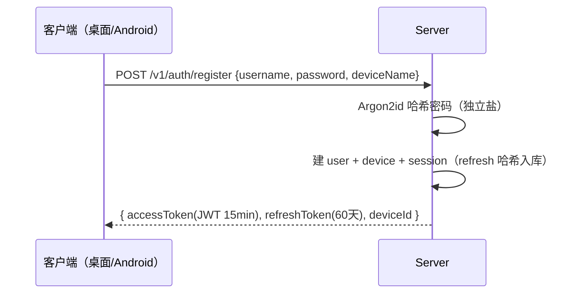
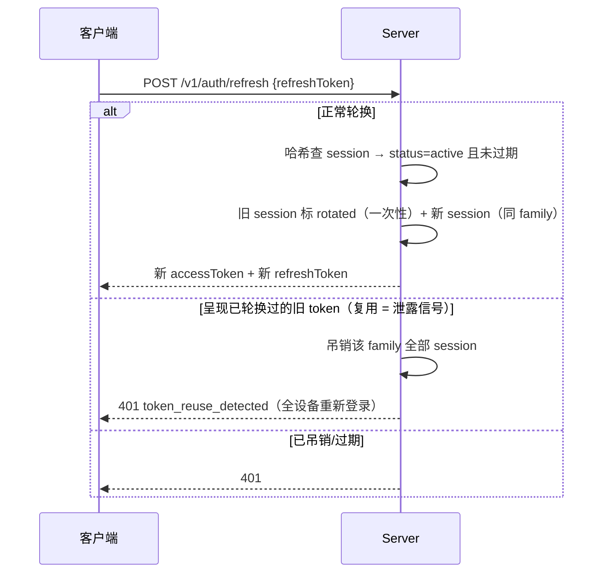
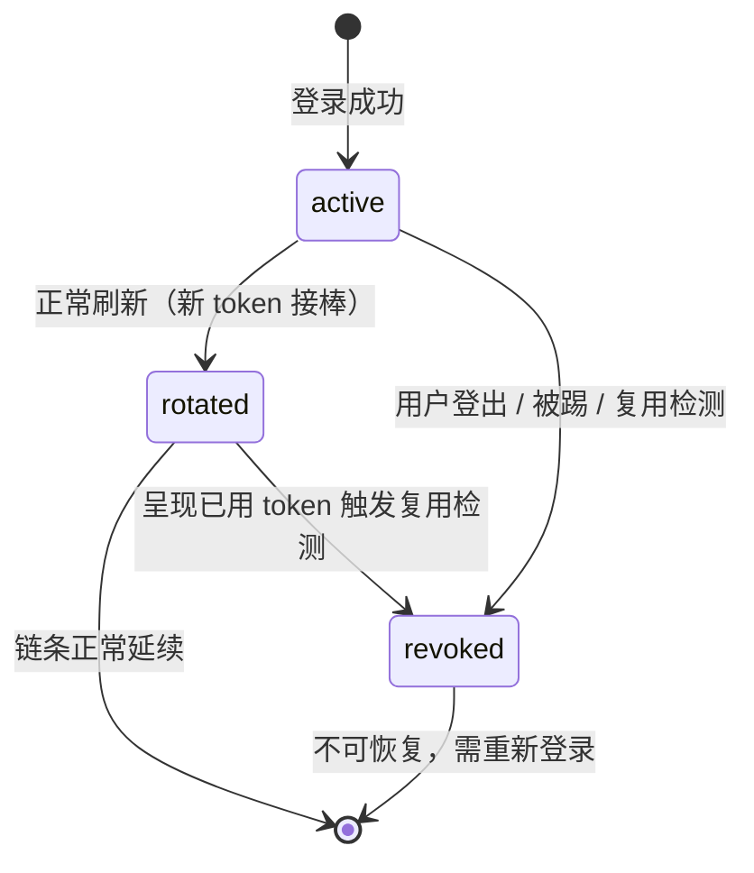

# 认证-登录与多端会话 PRD —— v0.1

> 状态：⏳ 待敲定（定稿后改 ✅ 已定稿）
> 关联：整体产品 PRD [`产品总览.md`](./产品总览.md)；端云架构 [`端云架构-数据层server化.md`](./端云架构-数据层server化.md)；技术设计 `server/src/auth/`
> 使用说明：新 PRD 从本模板复制起步，固定章节不得删减；流程图必填。

---

## 1. 背景与目标

- 要解决的问题（痛点 / 现状）：
  1. 数据层 server 化之后，「谁能读写哪个项目的数据」第一次需要一个真实的答案——之前端上单机数据靠操作系统用户隔离，server 上必须显式认证。
  2. 多端（桌面 GUI / Android App / 未来的 server 夜间执行者）共享同一账号下的数据，需要区分**设备**而不只是区分**用户**：踢掉丢失的手机、查看哪些设备活跃、租约与设备绑定。
  3. 认证方案必须是**水平扩展友好**的（端云架构档位 3：多实例无状态），不能选有粘性的服务端 session。
- 目标（一句话，可验收）：交付「账号密码 + 双令牌 + 设备会话管理」的认证机制，登录、刷新轮换（含复用检测吊销）、登出、踢设备全流程有契约测试覆盖。
- 方式选型（为什么是账号密码 + JWT）：自托管内网和未来公网都适用；不依赖外部 IdP（OIDC 依赖第三方，内网场景不可用）；预留 OIDC 作为二期登录方式，账号表从一开始就支持多登录方式（`credentials` 概念上分离）。

## 2. 用户故事

- 作为用户，我希望能注册账号并登录我的所有设备，以便数据归我所有。
- 作为用户，我希望 access token 泄露的影响被限制在几分钟内，以便安全损失可控。
- 作为用户，我希望能看到哪些设备登录着我的账号并踢掉任何一个，以便手机丢了之后止损。
- 作为用户，我希望检测到 refresh token 被盗用时系统自动吊销整个会话族，以便攻击者拿不到新令牌。
- 作为用户，我希望我的模型 API key（BYOK）永远不经过 server，以便隐私自持。

## 3. 流程图（必填）

### 3.1 注册 / 登录主流程

### 3.2 刷新轮换与复用检测（安全核心）

原理：refresh token **一次一换（rotation）**。合法客户端收到新 token 后旧 token 立即作废；攻击者若窃取了旧 token 并抢先使用，合法客户端下次刷新会触发复用检测——「同一个 token 被呈现第二次」在正常流程中不可能发生，出现即说明 token 泄露，吊销整个会话族（family）是止损动作。

### 3.3 设备会话状态机

## 4. 功能明细

- **FR1 注册 / 登录**
  - 触发：用户首次注册或新设备登录。
  - 输入：username（3-32 字符，唯一）、password（≥8 字符）、deviceName（如 "Pixel 9"、"MacBook 桌面端"）。
  - 处理：密码用 **Argon2id** 哈希——原理：内存困难函数（memory-hard），把单次哈希成本钉在几十 MB 内存 + 固定时间上，GPU/ASIC 并行暴破相对 bcrypt/scrypt 成本高一个量级；每用户独立盐防彩虹表；参数（m=19MiB, t=2, p=1，OWASP 推荐）可随硬件升级。
  - 输出：`accessToken`（JWT，15min）+ `refreshToken`（随机 256bit，60 天）+ `deviceId`。
  - 异常：用户名重复 409；密码弱 400。用户名枚举防护：登录失败统一「用户名或密码错误」。
- **FR2 双令牌模型**
  - Access = JWT（HS256，claim：`sub=userId`、`did=deviceId`、`exp`）。**原理：服务端用密钥签名自证，验签只算不查库——无状态。这是档位 3 多实例水平扩展的前提**（任何实例都能验任何实例签的 token）；代价是签发后到过期前无法吊销，所以有效期压到 15 分钟。
  - Refresh = 服务端生成的随机数，**DB 只存 SHA-256 哈希**（原理：DB 泄露时攻击者拿到的哈希不能当 token 用）；带 `family_id`（一次登录链 = 一个族）、`status ∈ {active, rotated, revoked}`。
  - 分工：短 access 限制泄露窗口（无需查库），refresh 承担可吊销性（查库、可撤销）——两者互补，缺一不可。
- **FR3 刷新轮换 + 复用检测**：见 3.2。参数：refresh TTL 60 天；无宽限窗（复用即吊销，宁可误杀）。
- **FR4 登出 / 设备管理**
  - 触发：`POST /v1/auth/logout`（吊销当前 session）；`GET /v1/auth/devices`（列表：设备名、最后活跃、会话状态）；`DELETE /v1/auth/devices/:id`（踢设备 = 吊销该设备全部 session）。
  - 与租约的关系：**认证回答「你是谁」，租约回答「哪个设备在执行」**——两层独立。踢设备不直接回收租约；租约心跳校验 deviceId 时发现 session 已吊销 → 自动回收（优雅降级，不产生孤儿租约）。
- **FR5 BYOK 密钥边界**
  - 模型 API key 留端上：Android 用 Keystore 加密键值存储、桌面用 Electron safeStorage；**任何认证/数据接口不接受 key 字段**。
  - 例外路径：用户显式启用「server 夜间执行者」时，key 以**信封加密**存 server——原理：数据密钥加密 key 密文入库，数据密钥本身用主密钥（环境变量/KMS）加密，DB 全量泄露也解不出 key；用户关闭该功能即删密文。
- **FR6 授权模型（M1 = owner-only）**：所有数据 API 校验「JWT 的 userId == 项目 owner_id」。`project_members` 表结构预留（role: viewer/editor），分享流程二期。

## 5. 边界与非目标

- 明确不做（M1）：
  - OIDC / 第三方登录（表结构预留 `auth_identities` 概念位，二期接 GitHub/Google）
  - 邮箱验证 / 找回密码（自托管场景由管理员重置；公网化再做）
  - 多因子认证（MFA/TOTP）、验证码、防爆破限流（留二期，接口层留中间件位）
  - 组织/团队/角色权限（只有 owner）
  - 账号数据导出/注销（GDPR 类需求，公网化再做）

## 6. 验收标准

- [ ] 注册→登录→带 JWT 访问受保护接口→刷新轮换全流程测试绿
- [ ] 复用检测：呈现已轮换的旧 refresh → 该 family 全部 session 被吊销，后续刷新 401
- [ ] 登出后 refresh 失效；access 在剩余有效期内仍可用（符合 JWT 无状态语义，文档明示）
- [ ] 踢设备：该设备全部 session 吊销；租约心跳随后自动回收
- [ ] DB 中不存在任何明文密码 / 明文 refresh token（只存 Argon2id 哈希与 SHA-256 哈希）
- [ ] 密码错误与用户名不存在返回同一错误文案（防枚举）

## 7. 开放问题

- refresh TTL 60 天与「活跃设备滚动续期」的取舍（长期不活跃设备是否自动登出）
- 复用检测的误杀体验：攻击者抢先刷新会让合法设备强制重新登录，是否提供「可疑活动」通知
- 主密钥轮换：信封加密的主密钥换代流程（re-wrap 批处理）何时需要
- JWT 算法：HS256（对称，实例间共享密钥）vs EdDSA（非对称，公钥可下发验证）——多实例时 EdDSA 更干净，M1 用 HS256，档位 3 前重评
