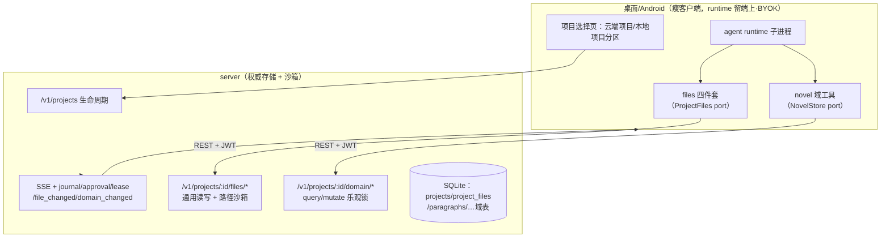
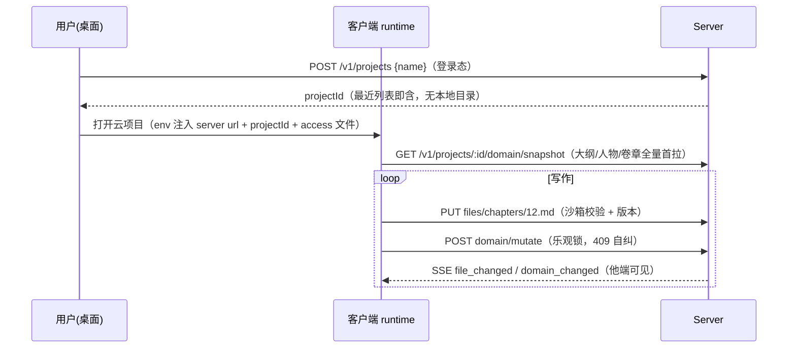
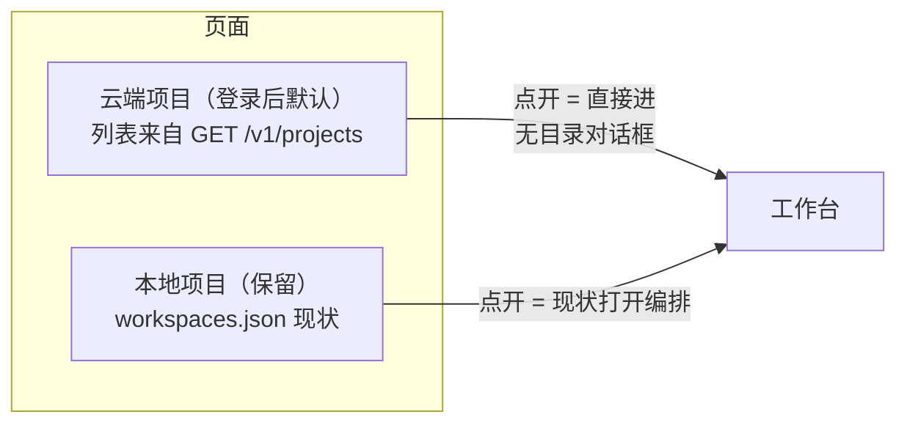

# 项目域上云-纯云端项目 PRD —— v0.1

> 状态：⏳ 待敲定（定稿后改 ✅ 已定稿）
> 关联：[`端云架构-数据层server化.md`](./端云架构-数据层server化.md)；[`桌面接入-数据通道server化.md`](./桌面接入-数据通道server化.md)（M3 已实施：会话通道/journal/审批/租约/定义包）；[`认证-登录与多端会话.md`](./认证-登录与多端会话.md)；[`Android接入-数据通道server化.md`](./Android接入-数据通道server化.md)（M4，Remote 实现复用本契约）
> 里程碑：项目域上云（B 线，桌面先行）。产品方向已拍板：**纯云端项目**（方案 B），本地项目模式保留为双模式并存。

---

## 1. 背景与目标

- 要解决的问题（痛点 / 现状）：
  1. M3 后「server 抽象」只覆盖**会话通道**（journal / 审批 / 租约 / 定义包 / 认证），**项目域全在本地**——最近项目来自本地 `workspaces.json`、新建项目要选本地文件夹、正文 / NOVEL.md / memory 是本地文件、novel.db 域数据本地。server 的 `projects` / `paragraphs` / `project_files` 表自 M1 起空转（只有 e2e 测试用过）。登录后仍见本地旧内容，与「数据层 server 化」的用户预期不符。
  2. 曾评估两条路线：A. 本地项目 + server 镜像（保留本地文件夹主权）；**B. 纯云端项目**（server 为唯一权威，新建只起名不选目录）。用户拍板走 B。
- 目标（一句话，可验收）：登录后新建「云端项目」只需输入名字；agent 的文件工具（Read/Glob/Write/Edit）与 novel 域工具直接读写 server；任意设备打开同一云项目看到同一份内容；server 端强制路径沙箱。
- 关键现状（已核实）：
  - 桌面 `core/src/runtime/tool/definitions/files.ts` 四件套已有 workspace 路径沙盒（resolve 逃逸拒绝 + symlink realpath 防护 + 512KiB 上限，对齐 CCB）——沙盒语义平移 server，不重造。
  - server 已有：`POST /v1/projects`（建，owner-only）；`GET/PUT /v1/projects/:id/files/*`（**写面锁死 `memory/*.md`**，NOVEL.md 审批唯一写径）；`GET /v1/paragraphs` + `POST /v1/paragraphs/mutate`（entity_version 乐观锁）；SSE 只发 journal/approval/lease。
  - 缺：项目 list/rename/delete；通用文件写面 / listing / delete / 版本；域表（outline/characters/locations）query/mutate；文件与域变更的 SSE 事件。

### Sandbox 探索结论（「是否走 sandbox」的分层回答）

- **层 1 路径沙箱（本 PRD 落地，必须做）**：云项目的所有文件操作收口到 server 文件 API，server 端强制：
  - workspace 相对路径 canonical resolve 不逃逸项目虚拟根（拒绝 `..`、绝对路径、Windows 盘符）；
  - 顶层 allowlist：`chapters/ notes/ memory/ design/ .novel/cases/` + `NOVEL.md`（审批写径保留）、`memory/`（source 校验 + MEMORY.md 索引维护保留）两个特例规则不变；
  - 单文件 512KiB 上限；路径黑名单（`.git/`、`.env*`）；
  - **API 无任何 exec 原语**——没有「执行」就没有进程逃逸面。
  - 实现为独立纯函数，与桌面 `files.ts` 沙盒跑同一套用例对拍；**客户端传来的路径一律不可信，校验只在 server 做权威判定**。
- **层 2 进程沙箱（暂缓，记录决策）**：runtime 仍跑在端上（M0 既定决策，BYOK 模型 key 不出端），server 不执行任何工具代码 → 无需容器/VM。将来两处触发再评估 per-project 子进程（node worker，cwd 锁项目目录）或容器隔离：① MCP 迁 server 托管（原 M5）；② server 夜间执行者落地。届时进程沙箱是前置条件；本 PRD 只预留 ProjectFiles port 抽象使工具实现可换后端。
- **为什么现在不用容器**：自托管档位 1 是单用户 SQLite 单进程，容器把部署门槛从「node 一个进程」抬到「Docker + 镜像分发」；当前威胁模型（单用户自己的 server、自己的项目、无 exec 原语）下路径沙箱已封住全部实际攻击面。多用户共享时的隔离升级路径见开放问题。

## 2. 用户故事

- 作为作者，我新建项目只填一个名字，不选任何文件夹——在任何设备登录都能打开它接着写。
- 作为作者，我在桌面写第 12 章，手机打开同一项目立刻看到最新段落（SSE 文件/域事件）。
- 作为作者，agent 说「已把伏笔记进 memory」——我确信它写进了云端项目，换设备仍在。
- 作为开发者，文件工具的沙盒语义在桌面本地项目与云端项目完全一致（同一套测试对拍）。
- 作为本地存量用户，我的本地项目照常打开——B 线不强制迁移，双模式并存。

## 3. 流程图（必填）

### 3.1 云项目全链路（B 线目标态）

### 3.2 云项目创建与首跑时序

### 3.3 双模式项目选择页

## 4. 功能明细

- **FR1 server 项目生命周期补全**
  - `GET /v1/projects`（owner 列表，按最近活动排序）；`PATCH /v1/projects/:id`（改名 / 归档）；`DELETE /v1/projects/:id`（软删 + 确认语义，域表/文件/账本级联标记）。owner-only 沿用 M1。
- **FR2 通用文件 API + 路径沙箱（核心）**
  - 扩容现有 files 路由：写面从 `memory/*.md` 放开到 allowlist 顶层（特例规则保留：NOVEL.md 审批唯一写径；memory source 校验 + 索引维护）；
  - 新增 `GET /v1/projects/:id/files?prefix=`（树/列表）、`DELETE`（标记删除回收语义）；
  - 版本乐观校验（updatedAt，409 附当前值——精确模型见开放问题）；
  - **路径沙箱按 §1 层 1 规则 server 端强制**，纯函数实现 + 与桌面 `files.ts` 同用例对拍；
  - SSE 广播 `file_changed`（path/操作，不含内容——客户端按需拉取）。
- **FR3 域 API 补全（RemoteNovelStore 服务端半边）**
  - `GET /v1/projects/:id/domain/snapshot`（outline/卷章/characters/locations 全量投影，首拉）；
  - `GET /v1/projects/:id/domain/delta?since=`（增量，SSE 触发）；
  - 域写统一 `POST /v1/projects/:id/domain/mutate`（entity_version 乐观锁，409 + currentVersion 自纠，对齐桌面 NovelStore 契约）；
  - SSE 广播 `domain_changed`。
- **FR4 桌面云项目流**
  - WorkspaceController 增云项目通道：新建只弹命名输入（无目录对话框）；最近列表 = 云项目（server）+ 本地项目（workspaces.json）分区；云项目打开不走本地 storedir/workspace root，而是注入 `NOVA_SERVER_URL + NOVA_PROJECT_ID + access 文件` 给会话子进程；ProjectSelectionPage 双分区 + 云项目徽章。
- **FR5 ProjectFiles port + 远程四件套**
  - `files.ts` 重构为 port 注入：`LocalProjectFiles`（现状逻辑原样）/ `RemoteProjectFiles`（REST + 409 重读重试 + 离线明确报错——**期 1 云项目不做离线写**）；
  - Read/Glob/Write/Edit 工具 schema 与 prompt 面不变（模型无感知）；Glob 远程实现 = `files?prefix=` + 客户端 pattern 过滤。
- **FR6 RemoteNovelStore（桌面先行，Android M4 复用）**
  - 实现 NovelStore 契约的 server 后端（query→snapshot/delta 缓存 + mutate→乐观锁 409 自纠一次）；本地 SqliteNovelStore 不动；云项目**无本地 novel.db**。
- **FR7 租约/审批沿用**：云项目会话天然全走 server 通道（M3 已就绪），无新工作。租约粒度维持会话级（多会话并发写同一云项目的升级见开放问题）。
- **FR8 测试**
  - server 侧：沙箱规则用例表（逃逸/绝对路径/盘符/超限/allowlist/黑名单）；生命周期；文件版本冲突；域 snapshot/delta。
  - 契约对拍：桌面 `files.ts` 沙盒与 server 沙盒同用例集。
  - e2e：建项目→首拉→写文件→域写 409 自纠→SSE 他端可见→重开恢复。

## 5. 边界与非目标

- 明确不做（期 1）：
  - 本地项目 → 云项目迁移工具（P2）
  - 云项目离线写 / 缓存合并（期 1 云项目离线 = 明确不可用提示）
  - 文件二进制 / zip 附件（导入工具迁云后再议）
  - 多用户共享 / RBAC
  - 进程级沙箱（容器）——见 §1 层 2，与 MCP 迁 server 合并评估
  - MCP 迁 server 托管（原 M5）
- 本地项目零回归：未登录 / 本地项目路径行为与现状完全一致。

## 6. 验收标准

- [ ] 登录后新建云项目只输入名字；最近列表云端分区来自 server；本地分区与现状一致
- [ ] 云项目会话：Read/Glob/Write/Edit 读写 server 文件；NOVEL.md 仍只能经审批落盘；memory 保留 source 校验
- [ ] 沙箱：逃逸/绝对路径/盘符/超限/黑名单路径在 server 端被拒（用例表全绿），与桌面沙盒对拍一致
- [ ] 域链路：snapshot 首拉、mutate 乐观锁 409 自纠、SSE domain_changed 他端可见
- [ ] 双端一致性：桌面写 →（模拟第二端）SSE + snapshot/delta 读到同一状态
- [ ] 回归：core/server/ui/Kotlin 全绿；本地项目与未登录路径零改动通过
- [ ] Android M4 复用：RemoteProjectFiles/RemoteNovelStore 契约形状在 `protocol/` 冻结为共享文档

## 7. 开放问题

- 正文双轨统一：正文以文件形态（`chapters/*.md`，Write/Edit 工具）入库，paragraphs 域表（乐观锁、结构化）承担导入/发布视图——两者同步策略（文件→域表解析时机）P2 定
- 会话粒度租约在多会话并发写同一云项目时是否升级为项目粒度写锁
- 文件版本模型：updatedAt 数值 vs 单调 version 列 vs ETag（三选一，实现前定）
- 多用户共享时层 2 沙箱升级路径（per-project 子进程 → 容器）的触发条件
- 与 M4（Android 接入）的先后编排：本 PRD 桌面先行，Android 的 Remote 实现直接复用本契约——若先做 M4 则本 PRD 的 FR5/FR6 契约部分前置
