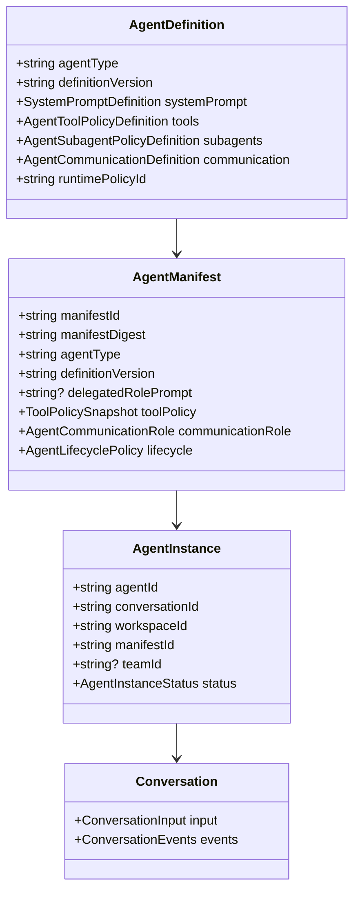
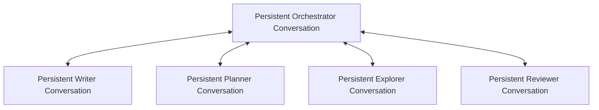
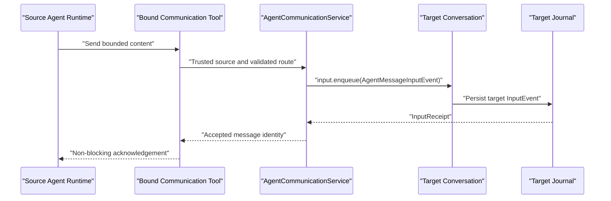

# Conversation-Based Agent Orchestration

## 1. Status and Boundary

This document records the accepted design direction for Agent orchestration.
The ephemeral Subagent slice completed Step S0 through Step S2 on August 3,
2026. Its remaining Step S3 through Step S6 are the active implementation
track. Novel Task N9-E through Task N11, persistent Agent, Agent Team, Team
communication, `TaskOutput`, and `Sleep` remain paused or documented future
work. Completed Runtime Task 6B and Task 7 checkpoints remain closed.

The central decisions are:

1. every Main Agent, Orchestrator, persistent Team member, and ephemeral
   Subagent uses the same Conversation foundation;
2. Subagents and Team members differ in ownership, lifetime, communication, and
   completion semantics rather than in Runtime or process type;
3. every cross-Agent write enters the target through
   `Conversation.input.enqueue(InputEvent)`;
4. `Conversation.events` remains read, replay, and subscription only;
5. all Agent creation, task assignment, cancellation, status query, and message
   delivery operations are non-blocking with respect to Agent execution;
6. Subagents never implicitly inherit or fork parent Conversation context;
7. required Subagent context is passed explicitly through the Task Prompt and
   bounded Artifact references;
8. a Subagent's final canonical Assistant Message is its result;
9. a persistent Team member communicates results and messages through explicit
   Tools rather than exposing its last Assistant Message;
10. persistent logical identity never requires a permanently running process.

All Agent execution continues to use the accepted async-first architecture:

```text
Agent Instance
    -> Conversation
    -> InputEvent queue
    -> serialized Conversation Runtime
    -> OutputEvents and Runtime Message projections
```

## 2. Shared Conversation Foundation

Every Agent owns or resolves:

- an Agent identity;
- one Conversation identity;
- an exact Agent type and definition version;
- one immutable Agent Manifest;
- one compiled Base System Prompt;
- one immutable Tool Registry View;
- independent Journal, Message, Context, Nudge, Run, and Turn state;
- an independently managed Runtime Presence.

Process placement remains hidden below `ConversationHost`. A persistent Agent
owns a persistent identity and Conversation, while its Runtime may be active,
dormant, evicted, recreated, placed in a child process, or placed remotely.

The write and read boundaries remain:

```ts
await targetConversation.input.enqueue(inputEvent);
await targetConversation.events.list(options);
targetConversation.events.subscribe(options);
```

No Agent Tool mutates another Agent's Message projection directly. No Tool
writes through `conversation.events`.

## 3. Core Agent Model



### 3.1 Agent Definition

An Agent Definition is a reusable, exact-version template:

```ts
interface AgentDefinition {
  readonly agentType: string;
  readonly definitionVersion: string;
  readonly label: string;
  readonly description: string;
  readonly systemPrompt: SystemPromptDefinition;
  readonly tools: AgentToolPolicyDefinition;
  readonly subagents: AgentSubagentPolicyDefinition;
  readonly communication: AgentCommunicationDefinition;
  readonly runtimePolicyId: string;
}
```

Examples include `novel_orchestrator@1.0.0`, `novel_writer@1.0.0`,
`novel_planner@1.0.0`, `novel_explorer@1.0.0`, and
`novel_reviewer@1.0.0`.

Changing Prompt, Tool policy, allowed Subagent types, communication role, or
Runtime policy requires a new definition version.

### 3.2 Agent Manifest

An Agent Manifest is the immutable, resolved configuration for one actual Agent
Instance:

```ts
interface AgentManifest {
  readonly manifestId: string;
  readonly manifestDigest: string;
  readonly agentType: string;
  readonly definitionVersion: string;
  readonly delegatedRolePrompt?: string;
  readonly toolPolicy: {
    readonly toolPolicyId: string;
    readonly toolNames: readonly string[];
  };
  readonly communicationRole:
    | "standalone"
    | "orchestrator"
    | "team_member"
    | "ephemeral_subagent";
  readonly lifecycle: {
    readonly retention: "ephemeral" | "persistent";
    readonly ownership: "parent_task" | "agent_team" | "workspace";
  };
}
```

The Manifest is persisted before Agent activation and is never regenerated on
resume. A Team-created delegated Role Prompt is lower authority than Core and
base-definition Prompt sections. Selected Tools must be a reduce-only subset of
the creating Agent and resolved Agent Definition capabilities.

### 3.3 Agent Instance

```ts
interface AgentInstance {
  readonly agentId: string;
  readonly conversationId: string;
  readonly workspaceId: string;
  readonly manifestId: string;
  readonly teamId?: string;
  readonly createdByAgentId?: string;
  readonly status:
    | "available"
    | "busy"
    | "waiting"
    | "disabled"
    | "terminal";
  readonly createdAt: string;
  readonly updatedAt: string;
}
```

The first implementation uses a one-to-one Agent Instance to Conversation
mapping. `agentId` is the routing and Team identity; `conversationId` remains the
Journal, Message, and Runtime identity.

## 4. System Prompt Builder

`SystemPromptBuilder` deterministically builds the stable Base System Prompt for
one resolved Agent Manifest:

```ts
interface SystemPromptBuilder {
  build(request: SystemPromptBuildRequest): CompiledSystemPrompt;
}

interface SystemPromptBuildRequest {
  readonly definition: AgentDefinition;
  readonly manifest: AgentManifest;
  readonly capabilities: AgentCapabilitySnapshot;
}
```

The Base Prompt order is:

```text
Core Runtime Protocol
    -> Base Agent Definition
    -> Delegated Role
    -> Communication Protocol
    -> Subagent Protocol
    -> Tool Guidance
    -> Completion Contract
```

Runtime then applies the existing dynamic layers:

```text
Base System Prompt
    -> Checkpoint Overlay
    -> one-shot Nudge Overlay
    -> Messages
```

`SystemPromptBuilder` does not own Checkpoint, Nudge, Conversation Messages,
current Task content, Tool results, or Provider-call transient state.

Role-specific requirements:

- an ephemeral Subagent is told that its final Assistant response is its one
  Task result and that it must not wait for another assignment;
- a persistent Team member is told that ordinary Assistant content remains in
  its Conversation and that it must use bound Team Tools to report progress,
  result, blocked state, or questions;
- an Orchestrator is told to use Team Tools, durable status, and Inbox queries
  rather than reading member internals.

Prompt text never grants a Tool, expands permission, bypasses Approval, changes
Sandbox policy, changes depth, or authorizes a new communication route.

## 5. Ephemeral Subagent Architecture

An ephemeral Subagent is:

```text
Ephemeral Agent Manifest
    + Child Conversation
    + one Parent-owned Task
```

It:

- receives one bounded Task Prompt;
- may receive bounded Artifact references owned or delegated by the parent;
- receives no implicit Parent Messages, System Prompt, Checkpoint, Nudge, Tool
  trace, or Conversation state;
- runs asynchronously in its own Conversation;
- exposes status and result through an explicit query Tool;
- treats its final canonical Assistant Message as its result;
- becomes terminal after the Task completes;
- may retain its Journal for replay even when logically disposable.

The current Task 6B `SubagentRequest.objective` remains a useful internal field.
The model-facing `Task.prompt` is captured into that field and must also be
persisted as a child Task InputEvent before activation is accepted.

## 6. Non-Blocking Subagent Tools

### 6.1 `Task`

`Task` creates one ephemeral child Agent. It waits only for durable creation,
Task Input acceptance, and activation acceptance. It does not wait for Agent
execution.

```ts
interface SubagentTaskArguments {
  readonly agentType: string;
  readonly prompt: string;
  readonly artifactIds?: readonly string[];
}
```

The Prompt must be self-contained. Large or reusable source material is passed
through validated Artifact identities rather than implicit context inheritance.

```ts
interface SubagentTaskAcceptance {
  readonly taskId: string;
  readonly childConversationId: string;
  readonly status: "queued" | "running";
  readonly acceptedAt: string;
}
```

For the first ephemeral implementation, `taskId` and the existing `subagentId`
are the same stable identity. The target definition version, Tool policy,
parent identities, timestamp, process placement, and child identity are trusted
Runtime values rather than model arguments.

### 6.2 `TaskGet`

`TaskGet` is a process-free, read-only status and result query:

```ts
interface SubagentTaskSnapshot {
  readonly taskId: string;
  readonly status:
    | "queued"
    | "running"
    | "completed"
    | "failed"
    | "cancelled"
    | "orphaned";
  readonly runtimePresence: "active" | "dormant" | "absent";
  readonly result?: {
    readonly content: string;
    readonly artifactReferences: readonly ArtifactReference[];
  };
  readonly errorCode?: string;
}
```

The query reads durable binding and Run state plus the child Message projection.
It never calls `ConversationHost.ensureActive()` and never sends an InputEvent.

### 6.3 `TaskCancel`

`TaskCancel` validates ownership, persists cancellation intent, and routes Stop
to the child Conversation. It returns `cancellation_requested`,
`already_terminal`, or `not_found` without waiting for Runtime termination.

## 7. Subagent Bootstrap and Completion

The current `createChild + activateChild` path evolves into an explicit
Bootstrap boundary:

```ts
interface ChildConversationBootstrapPort {
  bootstrapChild(request: ChildConversationBootstrapRequest): Promise<void>;
}
```

Required order:

```text
Create Child Conversation metadata and Agent binding
    -> record creating Subagent binding
    -> append TaskAssignedInputEvent to Child Journal
    -> obtain Child InputReceipt
    -> activate Child Runtime
    -> record running binding
    -> persist running binding
    -> append parent SubagentStartedOutputEvent
    -> return task acceptance
```

`TaskAssignedInputEvent` is distinct from a human User Message at the Event
layer while its Message projector may produce a Provider `user` role message:

```ts
interface TaskAssignedPayload {
  readonly taskId: string;
  readonly requesterConversationId: string;
  readonly prompt: string;
  readonly artifactReferences: readonly ArtifactReference[];
}
```

A future `SubagentCompletionBridge` observes terminal child Run state only after
the final Assistant Message persistence barrier. It reads the final canonical
Assistant Message and calls the existing lifecycle `deliverResult()` path.

Completion rules:

- completed Run plus final Assistant Message: `completed`;
- completed Run without a final Assistant Message: safe
  `SUBAGENT_EMPTY_RESULT` failure;
- failed Run: safe failed result;
- Stop: cancelled result;
- inactive-parent recovery: existing orphaned result.

Parent lifecycle Events retain bounded summary and Artifact metadata. Full
result content remains child-owned and is read through `TaskGet`.

## 8. Agent Team Architecture

An Agent Team contains one persistent Orchestrator and persistent Team members:



The first topology is a star. Direct peer-to-peer member routes remain deferred
so routing, ownership, loop prevention, and permission are centrally enforced.

Team membership is not represented by `parentConversationId` and does not
consume Subagent depth. It is stored through separate Team and membership
records. Persistent members are depth-zero Agents and may create permitted
depth-one ephemeral Subagents. Ephemeral Subagents cannot create another
Subagent.

```ts
interface AgentTeam {
  readonly teamId: string;
  readonly workspaceId: string;
  readonly orchestratorAgentId: string;
  readonly status: "active" | "disabled";
  readonly policyId: string;
  readonly createdAt: string;
}

interface AgentTeamMember {
  readonly teamId: string;
  readonly agentId: string;
  readonly role: "orchestrator" | "member";
  readonly status: "active" | "disabled";
  readonly joinedAt: string;
}
```

## 9. Persistent Team Agent Creation

The Orchestrator may receive an `AgentCreate` Tool:

```ts
interface AgentCreateArguments {
  readonly agentType: string;
  readonly rolePrompt?: string;
  readonly tools?: readonly string[];
}
```

Creation resolves an exact Agent Definition, validates the delegated role,
reduces the Tool set, persists an immutable Agent Manifest, creates an Agent
Instance and Conversation, and records Team membership. It does not require
immediate Runtime activation.

Capability rules:

```text
Selected Team Member Tools
    subset of Agent Definition Tools
    subset of Orchestrator delegable Tools
    subject to Team policy, Approval, and Sandbox policy
```

The Orchestrator may not dynamically register a new Tool implementation. It may
only select already registered Tools within the permitted capability set.

## 10. Agent Team Tasks

A persistent Team Agent may receive multiple Tasks over time, but the first
implementation permits only one active Task per Agent Conversation. Additional
Tasks remain queued. Parallelism is achieved by creating multiple Agent
Instances rather than running multiple active Tasks inside one Conversation.

```ts
interface AgentTask {
  readonly taskId: string;
  readonly teamId: string;
  readonly requesterAgentId: string;
  readonly assigneeAgentId: string;
  readonly status:
    | "queued"
    | "running"
    | "blocked"
    | "completed"
    | "failed"
    | "cancelled";
  readonly assignedInputEventId: string;
  readonly createdAt: string;
  readonly startedAt?: string;
  readonly completedAt?: string;
}
```

The Task Store does not duplicate Prompt content. The canonical Prompt is the
assignee Conversation's `AgentTaskAssignedInputEvent`. The Task Store retains
identity, status, assignment Event identity, result message identity, Artifact
identities, and timestamps.

## 11. Orchestrator Tool View

The first Orchestrator Tool set is conceptually:

- `AgentCreate`: create and join one persistent Team Agent;
- `AgentList`: list durable member identity, type, status, Runtime Presence,
  and active Task identity;
- `AgentTask`: assign a non-blocking Task to one member;
- `AgentMessage`: send bounded follow-up or control content;
- `AgentStatus`: read durable member and active Task state without activation;
- `AgentMessages`: read a cursor-based Team Inbox projection;
- `AgentDisable`: reject new Tasks without deleting history;
- the ephemeral `Task`, `TaskGet`, and `TaskCancel` Tools when the
  Orchestrator definition permits Subagents.

`AgentTask` waits only for Task metadata and target InputEvent persistence:

```ts
interface AgentTaskArguments {
  readonly agentId: string;
  readonly prompt: string;
  readonly artifactIds?: readonly string[];
}
```

It returns `taskId`, `agentId`, and `queued` or `running` acceptance without
waiting for the member result.

Runtime Agent IDs are not embedded into immutable Tool Schemas. The Orchestrator
discovers current members through `AgentList` and durable Team state.

## 12. Team Member Tool View

Every persistent Team member receives bound communication Tools equivalent to:

- `TaskOutput`: report progress, blocked state, completion, or failure for the
  currently active Team Task;
- `OrchestratorMessage`: send a question or normal message;
- `OrchestratorMessages`: query messages addressed to the member;
- the ephemeral `Task`, `TaskGet`, and `TaskCancel` Tools when the member
  definition permits Subagents.

The first implementation binds `TaskOutput` to the single active Task. The
model does not provide or override `taskId`, source Agent, Team, Orchestrator,
or target Conversation identities.

```ts
interface TaskOutputArguments {
  readonly status: "progress" | "blocked" | "completed" | "failed";
  readonly summary: string;
  readonly artifactIds?: readonly string[];
  readonly progress?: {
    readonly completed: number;
    readonly total: number;
  };
}
```

A persistent member's ordinary Assistant content remains private to its own
Conversation. Only a successful explicit communication Tool creates a Team
message or result visible to the Orchestrator.

## 13. Cross-Conversation Communication

All Team communication uses a provider-neutral `AgentCommunicationService`:



Required ordering:

1. validate Team membership, source role, target route, Task ownership, payload
   limits, and Artifact ownership;
2. derive a retry-stable message identity from trusted invocation identity;
3. append the target InputEvent durably;
4. obtain the target Input receipt;
5. update Task or delivery projection idempotently;
6. append a redacted sender acknowledgement OutputEvent if required;
7. return Tool acceptance.

Sender acknowledgements contain identities, kind, Task correlation, and
delivery state only. They do not duplicate message content.

Conceptual target Input payload:

```ts
interface AgentMessagePayload {
  readonly messageId: string;
  readonly teamId: string;
  readonly fromAgentId: string;
  readonly toAgentId: string;
  readonly kind:
    | "task"
    | "message"
    | "progress"
    | "result"
    | "question"
    | "blocked"
    | "cancel";
  readonly taskId?: string;
  readonly replyToMessageId?: string;
  readonly content: string;
  readonly artifactReferences: readonly ArtifactReference[];
}
```

## 14. Tool Registry Composition

Tool assembly is deterministic per Agent Manifest:

```text
Global immutable Tool Registry
    + exact Agent Definition Tool policy
    + reduce-only Manifest selection
    + role-bound Runtime Tools
    -> immutable Agent Tool Registry View
```

Role-bound Tool sets:

- Orchestrator: domain Tools, Team management Tools, Team Task Tools, and
  permitted Subagent Tools;
- persistent Team member: domain Tools, bound Orchestrator communication Tools,
  and permitted Subagent Tools;
- ephemeral Subagent: reduced domain Tools only, with no Team management and no
  nested Subagent Tools.

The Subagent `Task` descriptor is generated from the creator definition's
allowed Subagent types. Persistent `agentId` values are runtime data and are
queried rather than embedded into Tool descriptors.

## 15. Optional Sleep and Wake

Active query Tools remain authoritative: `TaskGet`, `AgentStatus`,
`AgentMessages`, and `OrchestratorMessages` can always read current state.

A later `Sleep` Tool may avoid busy polling. It must not hold a Tool Promise,
Provider call, process, or timer open. It persists a bounded wait condition,
ends the current Run as yielded or sleeping, and permits Runtime eviction. A
matching durable InputEvent later causes `WakeCoordinator` to enqueue a wake
signal and reactivate the Conversation through the Host.

After wake, the Agent still explicitly queries state. Sleep does not carry or
return another Agent's result.

## 16. Persistence and Recovery

The future model adds logical storage equivalent to:

```text
agent_manifests
agent_instances
agent_teams
agent_team_members
agent_tasks
agent_wait_conditions
subagent_bindings                 existing
conversation_agent_bindings      existing
```

Message and Prompt content remain in Conversation Journal, Message projection,
or Artifact storage rather than being duplicated into Team metadata tables.

Recovery rules:

- a persistent Agent Instance and Conversation survive Runtime eviction and
  Workspace restart;
- a new target Input reactivates a dormant or absent Runtime through the Host;
- queued Team Tasks remain queued and one active Task is reconciled against
  durable Conversation Run state;
- no in-flight Provider or Tool execution is automatically resumed;
- running Subagents continue to use the accepted orphan-reclamation rules;
- retry-stable Agent, Task, message, and Input identities prevent duplicate
  creation or delivery after crash and replay.

## 17. Current Runtime Integration

The completed Task 6B infrastructure remains the base:

- `DefaultChildConversationManager` retains parent scope, depth, capacity,
  reduce-only Tool policy, reservation, creation, rollback, and binding state;
- `DurableChildConversationManager` retains durable running and terminal
  binding projection;
- `DefaultSubagentLifecycleCoordinator` retains parent started, progress, and
  terminal projection plus structured terminal delivery;
- `SubagentCancellationCoordinator` and `ConversationTreeObserver` remain;
- `ConversationHost`, `ConversationCommandService`, and
  `ConversationQueryService` remain placement-neutral execution and query
  boundaries.

Required evolution:

- Step S1 protocol values are implemented in the provider-neutral Runtime
  boundary: immutable Subagent Definitions, allowed-type policy, Task/Query/
  Cancellation values, defensive capture, and dynamic TypeBox parameter
  Schemas. They do not create a Child Conversation or execute a Tool.
- Step S2 event values are implemented in the Core event boundary:
  `TaskAssignedInputEvent` persists explicit Prompt and Artifact references;
  its Message projector produces a provider-neutral `user` Message, and the
  existing Agent-turn path accepts it without classifying it as a human
  `user.message`.
- replace the create-then-activate-only path with a child Bootstrap port that
  persists `TaskAssignedInputEvent` before activation acceptance;
- add `SubagentTaskService`, `SubagentQueryService`, and
  `SubagentCompletionBridge`;
- keep `SubagentLifecycleHandle.result` for internal compatibility while
  model-facing Tools use non-blocking acceptance and explicit query;
- add Agent Definition, Manifest, Instance, Team, Task, communication, Inbox,
  and optional wake services without exposing Pi, process placement, Node, or
  SQLite details at public Core boundaries.

## 18. Implementation Phases

### Phase 1: Agent Definition and Prompt

- Agent Definition protocol and registry;
- Agent Manifest capture and persistence;
- deterministic `SystemPromptBuilder`;
- Agent Tool set composition.

### Phase 2: Complete Non-Blocking Subagent Task

- `TaskAssignedInputEvent` and Runtime Message projection;
- child Bootstrap ordering;
- non-blocking `Task` Tool;
- final Assistant completion bridge;
- process-free `TaskGet`;
- non-blocking `TaskCancel`.

### Phase 3: Persistent Agent Instance

- Agent Instance persistence;
- persistent Agent Conversation creation and restore;
- Runtime Presence integration;
- one-active-Task state ownership.

### Phase 4: Agent Team and Task

- Agent Team and membership persistence;
- Agent Task metadata and queue;
- Orchestrator/member ownership rules;
- persistent Agent creation, listing, disablement, and status.

### Phase 5: Team Communication and Tools

- Agent message and Team Task InputEvents;
- `AgentCommunicationService`;
- Inbox projection and cursor query;
- Orchestrator Tools;
- member `TaskOutput` and Orchestrator communication Tools;
- Artifact and oversized-content behavior.

### Phase 6: Optional Sleep and Wake

- wait-condition protocol and persistence;
- Sleep Tool;
- wake matching and Host reactivation;
- recovery and cancellation behavior.

## 19. Accepted Direction and Unresolved Decisions

Accepted direction:

1. all Agent forms use Conversation;
2. Subagents start without implicit Parent context inheritance;
3. explicit Prompt and Artifact references are the only Subagent context input;
4. Subagent start, query, and cancellation are non-blocking;
5. a Subagent result is its final canonical Assistant content;
6. a Team member result or message requires an explicit communication Tool;
7. Orchestrator and Team members may create permitted ephemeral Subagents;
8. Team communication begins with an Orchestrator-centered star topology;
9. one persistent Agent Conversation owns at most one active Team Task initially;
10. Team membership is not a Subagent depth or parent-Conversation edge;
11. System Prompt role sections describe the correct completion protocol;
12. Tool Registry Views and Runtime policy remain capability and permission
    authority;
13. persistent Agent identity does not imply a permanently running process.

Unresolved outside the active Subagent Tool slice or deferred to its owning
Step:

1. public Tool and Event names beyond `Task`, `TaskGet`, `TaskCancel`, and
   `TaskAssignedInputEvent`;
2. exact Agent identity versus Conversation identity mapping and ID factories;
3. Agent Manifest digest and immutable snapshot persistence protocol;
4. Team Inbox canonical storage and projection ownership;
5. exact Team Task transition and crash-reconciliation rules;
6. wake-on-message and optional Sleep semantics;
7. message, result, Prompt, and Artifact limits;
8. exact final Assistant selection and empty-result failure behavior;
9. retention and cleanup policy for logically disposable child Conversations;
10. whether controlled peer-to-peer Team routes are added later;
11. migration from the completed `SubagentLifecycleHandle.result` contract to a
    non-blocking Tool/query surface without breaking existing consumers.
