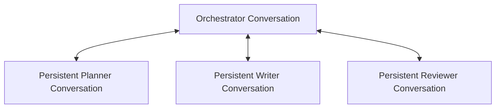
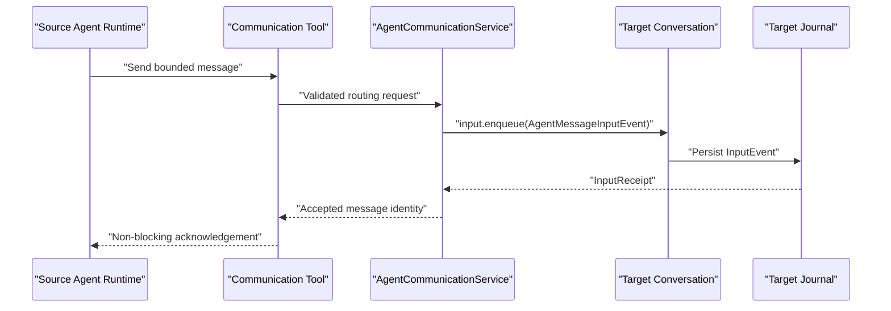

# Conversation-Based Agent Orchestration

## 1. Status and Boundary

This document records the accepted design direction for future Agent
orchestration. It is not implemented by completed Runtime Task 6B or Task 7 and
does not change their public contracts or checkpoint status.

The central decision is:

> Every Main Agent, Orchestrator, persistent Team Agent, and ephemeral Subagent
> uses the same Conversation foundation. Subagents and Agent Team members differ
> in ownership, lifetime, communication, and result semantics rather than in
> their Runtime or process model.

All Agent execution continues to use the accepted async-first architecture:

```text
Agent Instance
    -> Conversation
    -> InputEvent queue
    -> serialized Conversation Runtime
    -> OutputEvents and Runtime Message projections
```

Process placement remains an implementation detail. A persistent Agent owns a
persistent identity and Conversation, but its Runtime process may be active,
dormant, evicted, recreated, or remotely placed.

## 2. Shared Conversation Foundation

Every Agent owns or resolves:

- an Agent identity;
- one Conversation identity;
- an exact Agent type and definition version;
- one compiled Base System Prompt;
- one immutable Tool Registry View;
- independent Journal, Message, Context, Nudge, Run, and Turn state;
- an independently managed Runtime Presence.

Agent-to-Agent communication never mutates another Agent's Message projection
directly and never enqueues through `conversation.events`.

The write and read boundaries remain:

```ts
targetConversation.input.enqueue(inputEvent);
targetConversation.events.list(options);
targetConversation.events.subscribe(options);
```

`Conversation.input` is the durable command and message write boundary.
`Conversation.events` is the append-only history, replay, and subscription
boundary.

## 3. Two Completion Protocols

The shared Conversation foundation supports two distinct completion protocols.

### 3.1 Ephemeral Subagent

An ephemeral Subagent:

- is owned by one parent Agent Task or Run;
- receives one bounded objective;
- uses either isolated context or a bounded projected parent context;
- runs asynchronously in its own Conversation;
- exposes status and result through an explicit query Tool;
- treats its final canonical Assistant Message as its result;
- is cancelled when its owning lifecycle terminates according to policy;
- becomes terminal after the objective completes;
- may retain its Journal for replay even when it is logically disposable.

The Subagent does not require a `TaskOutput` Tool. Its final Assistant content is
the implicit result contract.

### 3.2 Persistent Agent Team Member

A persistent Agent Team member:

- is owned by an Agent Team or Workspace rather than one parent Run;
- retains a stable Agent identity and Conversation across multiple assignments;
- may become dormant between inputs without losing logical identity;
- does not expose its last Assistant Message as an implicit Team result;
- communicates with the Orchestrator through explicit Tools;
- may receive multiple assignments over time, serialized through its
  Conversation state owner;
- may create permitted ephemeral Subagents through the same Subagent Tool set.

Ordinary Assistant content remains private to the member Conversation until an
explicit communication Tool sends a message or result to the Orchestrator.

## 4. Non-Blocking Subagent Tools

The accepted direction uses non-blocking Subagent execution.

### 4.1 `task`

`task` creates an ephemeral child Agent and enqueues its objective. The Tool
waits only for durable creation and Input acceptance, not for execution.

Conceptual arguments:

```ts
interface SubagentTaskArguments {
  readonly agentType: string;
  readonly prompt: string;
  readonly context: "isolated" | "projected_parent";
}
```

Conceptual acceptance result:

```ts
interface SubagentTaskAcceptance {
  readonly taskId: string;
  readonly agentId: string;
  readonly childConversationId: string;
  readonly status: "queued" | "running";
}
```

The target Agent definition version, Tool policy, parent identities, timestamps,
process placement, and deterministic child identity are trusted Runtime values,
not model-controlled arguments.

The objective must be persisted as a child Conversation InputEvent before the
child is considered successfully started. The current Task 6B protocol carries
an objective in `SubagentRequest`, but the future non-blocking Tool integration
must explicitly close the objective-to-child-Input delivery path.

### 4.2 `task_get`

`task_get` is the active, read-only status and result query Tool required by the
non-blocking Subagent model.

Conceptual result:

```ts
interface SubagentTaskSnapshot {
  readonly taskId: string;
  readonly agentId: string;
  readonly status:
    | "queued"
    | "running"
    | "completed"
    | "failed"
    | "cancelled"
    | "orphaned";
  readonly runtimePresence: "active" | "dormant" | "absent";
  readonly result?: {
    readonly content: string;
    readonly artifactReferences: readonly ArtifactReference[];
  };
  readonly errorCode?: string;
}
```

The query must not activate the child Runtime. Status comes from the durable
Subagent lifecycle projection. A completed result comes from the child
Conversation's final canonical Assistant Message and child-owned Artifacts.

### 4.3 `task_cancel`

`task_cancel` persists cancellation intent and routes Stop to the child. It
returns an acceptance or already-terminal result without waiting for process
termination.

## 5. Agent Team Communication

The first Agent Team topology is a star:



Team members communicate with the Orchestrator. Direct peer-to-peer Team
communication remains deferred so the first implementation can enforce routing,
ownership, loop prevention, and permission rules centrally.

### 5.1 Orchestrator Tool View

The Orchestrator may receive Tools equivalent to:

- `agent_send`: enqueue a task, message, cancellation request, or reply to one
  Team member;
- `agent_status`: read durable member state and Runtime Presence without
  activation;
- `agent_messages`: read a cursor-based Team Inbox projection;
- Agent lifecycle Tools for creating, disabling, or listing persistent members,
  if and when that control plane is approved.

`agent_send` is non-blocking. It waits for the target Conversation Input receipt
and returns an accepted message identity, not an Agent response.

### 5.2 Team Member Tool View

Every Team member receives Tools equivalent to:

- `orchestrator_send`: send progress, result, question, blocked state, or a
  normal message to the bound Orchestrator;
- `orchestrator_messages`: query messages addressed to the member when an
  explicit Inbox query is useful;
- the permitted ephemeral Subagent Tool set (`task`, `task_get`, and
  `task_cancel`) when its Agent definition allows delegation.

The member-facing send Tool is bound to the Team, source Agent, and Orchestrator.
The model does not supply or override those trusted identities.

## 6. Conversation Event Routing

Cross-Agent Tools route through a provider-neutral communication service:



Required ordering:

1. validate Team membership, routing permission, payload bounds, and Artifact
   ownership;
2. derive a retry-stable message identity from trusted invocation identity;
3. append the target `AgentMessageInputEvent` durably;
4. obtain the target Input receipt;
5. append a redacted sender acknowledgement OutputEvent if required;
6. return Tool acceptance.

The sender acknowledgement contains identities, message kind, delivery state,
and optional Task correlation only. It does not duplicate message content.

## 7. Agent Message Protocol

A future provider-neutral message InputEvent may carry:

```ts
interface AgentMessagePayload {
  readonly messageId: string;
  readonly teamId: string;
  readonly fromAgentId: string;
  readonly toAgentId: string;
  readonly kind:
    | "task"
    | "message"
    | "progress"
    | "result"
    | "question"
    | "blocked"
    | "cancel";
  readonly taskId?: string;
  readonly replyToMessageId?: string;
  readonly content: string;
  readonly artifactReferences: readonly ArtifactReference[];
}
```

The exact public Event names, schemas, byte limits, Artifact ownership rules,
Inbox projection, and persistence model remain unresolved and must be approved
before implementation.

## 8. Optional Sleep and Wake

Active query Tools are always available for Subagent status and Team Inbox
state. A future `sleep` Tool may reduce busy polling.

`sleep` must not keep a Tool Promise, Provider call, process, or timer blocked.
It persists a bounded wait condition, ends the current Run as yielded or
sleeping, and permits Runtime eviction. A matching target InputEvent later
enqueues a wake signal and reactivates the Conversation through the Host.

Initial Sleep scope, wake conditions, deadlines, and Run outcomes remain
unresolved. Sleep is optional and is not required to query current state.

## 9. System Prompt Builder Roles

`SystemPromptBuilder` compiles the stable Base System Prompt for the resolved
Agent role. It does not own Checkpoint, Nudge, or Message overlays.

The Builder may add role-specific protocol sections:

### Ephemeral Subagent

```text
Your final Assistant response is the result of this one objective.
Do not wait for another assignment after completion.
```

### Persistent Team Member

```text
Ordinary Assistant content remains in your Conversation.
Use the bound Orchestrator communication Tool to report progress, results,
questions, or blocked state.
You may use only the Subagent types and Tools exposed to you.
```

### Orchestrator

```text
Use Team Tools to send work and messages.
Use durable status and Inbox queries rather than reading member internals.
Members communicate through explicit Tools; their private Assistant history is
not an implicit Orchestrator result.
```

Tool capabilities remain authoritative in the immutable Tool Registry View.
Prompt text cannot grant a Tool, bypass Approval, change Sandbox policy, expand
Subagent depth, or route to an unauthorized Conversation.

## 10. Composition Rules

A persistent Team member is treated as a depth-zero Agent for ephemeral
Subagent delegation. It may create depth-one Subagents if its Tool View permits
them. An ephemeral depth-one Subagent cannot create another Subagent.

```text
Orchestrator (persistent Conversation)
    -> Team member (persistent Conversation)
        -> Subagent (ephemeral Conversation, depth one)
```

The Orchestrator-to-member relationship is not a Subagent depth edge. Team
ownership and ephemeral parent-child ownership remain separate relations over
the same Conversation foundation.

## 11. Required Future Services

The direction implies provider-neutral services equivalent to:

- `AgentDefinitionRegistry` and a deterministic `SystemPromptBuilder`;
- `AgentTeamStore` and persistent Agent membership projection;
- `AgentCommunicationService` for cross-Conversation Input routing;
- `AgentInboxQueryService` for cursor-based Team messages;
- `SubagentTaskService` for non-blocking creation and cancellation;
- `SubagentQueryService` for process-free status and final-result reads;
- retry-stable Agent, Task, and message identity factories;
- wake coordination if Sleep is later accepted.

These services must preserve provider neutrality and keep Pi, Node process,
SQLite, paths, prompts, Tool payloads, raw failures, and credentials behind the
existing accepted boundaries.

## 12. Accepted Direction and Unresolved Decisions

Accepted direction:

1. all Agent forms use Conversation;
2. Tool-based writes route through target `Conversation.input.enqueue()`;
3. `Conversation.events` remains read, replay, and subscription only;
4. Subagent start, query, cancellation, and Team communication are
   non-blocking;
5. a Subagent result is its final canonical Assistant content;
6. a Team member result or message requires an explicit communication Tool;
7. Orchestrator and Team members may create permitted ephemeral Subagents;
8. Team communication begins with an Orchestrator-centered star topology;
9. System Prompt role sections describe the correct completion protocol;
10. Tool Registry Views and Runtime policy remain the authority for capability
    and permission.

Unresolved before implementation:

1. final Tool and Event names;
2. persistent Agent creation, disablement, and membership APIs;
3. exact Agent identity versus Conversation identity mapping;
4. Team Inbox canonical storage and projection ownership;
5. wake-on-message and optional Sleep semantics;
6. Agent message and result content limits and oversized Artifact handling;
7. exact Subagent final Assistant selection and empty-result failure behavior;
8. retention and cleanup policy for logically disposable child Conversations;
9. whether Team communication later permits controlled peer-to-peer routes;
10. migration from the completed blocking `SubagentLifecycleHandle.result`
    contract to a non-blocking Task/query surface without breaking existing
    public Runtime consumers.
