# Novel Agent Runtime Architecture

## 1. Document Status

This document records the currently accepted architecture for the shared Novel Agent Runtime.

- It is an architecture target, not a statement that every component has already been implemented.
- The dedicated Novel domain model remains deferred and is not included in this runtime boundary.
- Diagrams use Mermaid so they remain version-controlled, editable, and renderable in compatible Markdown viewers.
- The initial implementation stays TypeScript-first. Performance-critical implementations may later move to Rust behind stable TypeScript interfaces.
- Plan-first autonomous implementation tasks and unresolved questions are tracked in `docs/implementation-plan.md`.
- Repository execution authority, compression recovery requirements, mandatory planning, validation, and per-step commit rules are defined in `AGENTS.md`.

## 2. Product Belief

This project helps people turn imagination into serialized web novels.

The product should lower the barrier between imagination and a structured, sustainable story rather than requiring every user to first master professional writing techniques.

## 3. Accepted Architecture Principles

1. `Conversation` is a durable session handle, not an operating-system process.
2. `ConversationRuntime` is an ephemeral executor and is activated only when execution is required.
3. Historical queries and Agent execution use separate query and command paths.
4. `InputEvent` is the unified input protocol and `OutputEvent` is the unified output protocol.
5. Control inputs and normal Agent-turn inputs use separate logical lanes.
6. `ConversationJournal` is the durable source of truth; `ConversationEventHub` only handles live delivery after persistence.
7. Approval is an asynchronous `OutputEvent → InputEvent` interaction rather than a UI callback.
8. `RuntimePolicyEngine` evaluates Runtime facts and returns typed effects; it never performs those effects directly.
9. `NudgeManager` consumes one-shot Nudge effects, while `ContextCompactionManager` consumes Context Compaction effects.
10. Emitting an OutputEvent records an observable lifecycle transition; it does not prove that an effect has been applied to a model request.
11. Tool description, implementation, registration, execution policy, sandboxing, and Pi adaptation remain separate.
12. Main agents and subagents both use the Conversation abstraction.
13. Process placement is selected by `ConversationHost`; one Conversation does not imply one process.
14. Pi-specific types remain behind adapters and do not leak into core-owned public contracts.
15. A canonical workspace root maps one-to-one to a separate semantic Store directory; transient execution working directories never change that binding.
16. A Conversation does not interpret Agent types, but its versioned Agent binding is persisted so the Host can restore it through an upper-layer `AgentResolver`.
17. SQLite Journal records drive display and replay; per-Conversation `messages.jsonl` files are repairable Runtime message projections rather than a second event source of truth.
18. Runtime and Storage contracts are asynchronous, while the first Node SQLite adapter may execute bounded `DatabaseSync` operations directly behind those Promise-based contracts.
19. Worker Threads are an implementation option, not part of the initial Storage contract; they are introduced only after measured event-loop blocking justifies the additional transport and lifecycle complexity.
20. The concurrency model is async-first and hybrid: system boundaries are asynchronous, each Conversation mutates Runtime state through a serialized state machine, lightweight in-memory computation remains synchronous, and heavy CPU or blocking work is isolated behind replaceable Worker, process, or Rust-backed adapters when required.
21. Node Message projection integration is Projector- and Schema-specific; a Workspace shares its Journal but does not freeze one global Runtime Message Schema Registry for every Agent definition.

## 4. Pause and Resume Decision

Generic Pause and Resume are not part of the initial public event protocol.

The reason is that model streams and arbitrary tools generally cannot be safely frozen and resumed at an exact instruction boundary. A generic pause operation would usually mean aborting current execution, creating a checkpoint, and later reconstructing work, which is materially different from suspending a process.

Initial control semantics are:

- `StopInputEvent` cancels the active run, active model request, active tools, pending interactions, and configured child work.
- A future `InterruptInputEvent` may cancel only the current turn while keeping the Conversation available for a follow-up input.
- `ApprovalDecisionInputEvent` resolves a waiting approval directly; it does not require Resume.
- An offline runtime is activated automatically by `ConversationHost.ensureActive()` when an execution command arrives.
- Runtime crash recovery is handled by Host restoration policy rather than `ResumeInputEvent`.
- The existing `ResumeInputEvent` code is provisional and should not be treated as a frozen first-version contract.

Pause/Resume are deferred from the accepted architecture. They can be reconsidered only after a concrete resumable checkpoint and safe-point model is defined.

## 5. Repository Layering

```text
core/
├─ src/config/
├─ src/event/
├─ src/node/
├─ src/prompt/
├─ src/runtime/
├─ src/storage/
└─ src/tools/

cli/
gui/
web/
native/
docs/
```

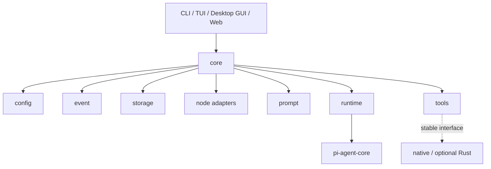

The package root remains platform-independent. Node filesystem and SQLite implementations are exposed through the `@novel/core/node` subpath and are not re-exported from the package root.

## 5.1 Workspace Storage Layout

```text
workspaceRoot
    ↓ WorkspaceStoreLocator
~/.novel-agent/workspaces/<semantic-slug>--<short-workspace-id>/
├─ workspace.json
├─ novel.db
└─ conversations/
   └─ conversation-<sha256(conversationId)>/
      ├─ messages.jsonl
      └─ messages.lock              # only exists while a writer owns the file
```

`workspace-index.json` stores the explicit `workspaceRoot → workspaceId → storeDir` binding. Moving a project requires an explicit rebind. Rebinding updates the canonical root but does not automatically rename an active Store directory.

The stable project root is distinct from `executionWorkdir`. Main agents, subagents, tools, and sandboxes may use different execution directories while retaining the same Workspace Store binding.

## 5.2 Conversation and Agent Binding

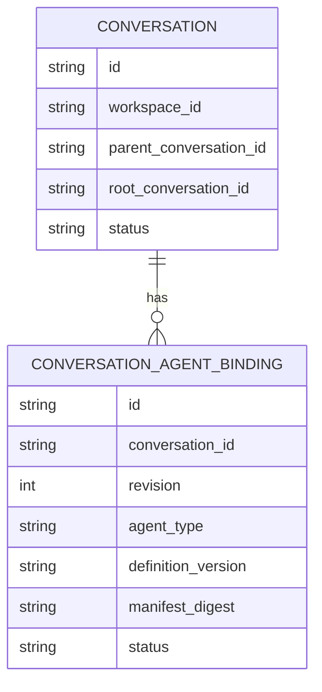

Creation requires an Agent type. The upper-layer resolver may select the exact definition version, but the persisted binding always records both `agentType` and `definitionVersion`. The public Conversation handle does not need to expose or interpret them.

One Conversation has at most one active binding in the initial architecture. Historical binding revisions are supported by the schema, while concurrent multi-Agent rooms are deferred. Main and subagents continue to use separate Conversations.

## 5.3 TypeScript Async and Execution Model

TypeScript uses the JavaScript runtime concurrency model. `async` and `await` coordinate Promise-based work on the runtime event loop; they do not create an operating-system thread.

```ts
async function run(): Promise<void> {
  prepareSynchronously();
  await waitForProviderStream();
  continueAfterSettlement();
}
```

Calling `run()` starts executing immediately and synchronously until it reaches an `await` that has not settled. At that point the function returns a Promise and its continuation is scheduled for later. Synchronous work performed before or after `await` still runs on the current JavaScript thread and can block its event loop.

```ts
async function misleadingAsync(): Promise<void> {
  databaseSync.exec("SELECT expensive_operation()");
}
```

The `async` keyword in this example changes the return type to Promise-based control flow, but it does not make `DatabaseSync.exec()` non-blocking and does not move it into a Worker Thread.

Python `asyncio` and TypeScript async code are both cooperative concurrency models: work switches at explicit asynchronous suspension points rather than being preemptively assigned a new thread. Their important surface differences are:

| TypeScript / Node | Python / asyncio |
|---|---|
| `async function` returns a `Promise` | `async def` returns a coroutine object |
| Calling an async function begins executing it immediately until suspension | Calling an async function creates a coroutine; it runs when awaited or scheduled |
| `Promise` is both a result container and composition primitive | Coroutine and `asyncio.Task` are distinct concepts |
| The Node runtime owns the normal application event loop | Applications commonly interact explicitly with the asyncio loop and Tasks |
| Blocking synchronous work blocks the JavaScript event-loop thread | Blocking synchronous work blocks the asyncio event-loop thread |
| Blocking work can move to Worker Threads or child processes | Blocking work can move to an executor, thread, or process |

Neither model makes synchronous code asynchronous merely by wrapping it in an async function.

### 5.3.1 Pi Agent Core Model

Pi Agent Core uses the TypeScript asynchronous model:

- Agent execution is an async loop.
- streamed Agent events are exposed through `EventStream` and `for await`.
- Provider calls and Tool execution return Promises.
- Tool batches use Promise concurrency for parallel mode and awaited ordering for sequential mode.
- the stateful `Agent` class awaits event subscribers in registration order, allowing a subscriber to act as a persistence barrier.
- steering and follow-up queues are drained at asynchronous turn boundaries.

Pi's SQLite package deliberately separates its contract from its Node implementation:

```text
Promise-based SqliteDatabase interface
    ↓
Node adapter
    ↓
DatabaseSync
```

The Node adapter exposes Promise-returning methods but directly calls `DatabaseSync`. This is an asynchronous interface over a synchronous implementation, not asynchronous SQLite I/O and not a Worker Thread implementation.

### 5.3.2 Accepted Novel Runtime Model

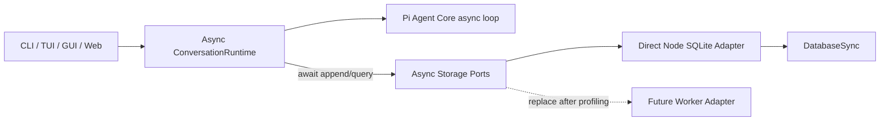

The accepted initial model is:

```text
ConversationRuntime, Provider streaming, Tool APIs, Event delivery
    asynchronous Promise / AsyncIterable contracts

Conversation Journal, Metadata, Messages, Snapshot ports
    asynchronous Promise contracts

Initial Node SQLite implementation
    direct bounded DatabaseSync operations behind the async ports

Worker Threads
    deferred adapter optimization, not an initial architectural dependency
```

The direct SQLite adapter remains acceptable only while transactions and queries are short and bounded. Journal pages have hard limits, large payload transformations occur outside transactions, and performance measurements must include event-loop delay. If storage work later causes material Provider-stream, IPC, UI, or approval latency, the same async Storage ports can be implemented by a Worker-backed adapter without changing Conversation or Runtime contracts.

### 5.3.3 Async-First Hybrid Concurrency Boundary

The accepted concurrency principle is:

> **Async-first hybrid architecture: asynchronous system boundaries, a serialized Conversation state machine, and localized synchronous computation.**

This is not a purely synchronous architecture, and it does not require every function to return a Promise. The boundary is determined by whether an operation crosses an I/O, time, process, runtime-placement, or cancellation boundary.

| Area | Accepted model | Reason |
| --- | --- | --- |
| Conversation commands and queries | `Promise` | May cross persistence, activation, IPC, or authorization boundaries |
| Provider and Agent execution | `Promise` / `AsyncIterable` | Supports streaming, cancellation, and long-running remote work |
| Tool execution and Approval | `Promise` / event interaction | May wait for I/O, processes, sandboxing, or user decisions |
| Event live delivery | `AsyncIterable` | Supports streaming, reconnect, and backpressure policy |
| Subagent and IPC communication | asynchronous request/event protocols | Runtime placement must remain transparent to callers |
| Storage ports | `Promise` | Keeps direct, Worker-backed, process-backed, and remote adapters interchangeable |
| Conversation Runtime state mutation | serialized state machine | Prevents overlapping Turn, Context, Stop, Config, and Tool state transitions |
| Event validation, registry lookup, and small state transitions | synchronous | Pure in-memory work has no asynchronous suspension boundary |
| Initial SQLite transaction body | bounded synchronous work | `DatabaseSync` is confined to the Node adapter and transactions contain no `await` |
| Heavy CPU or materially blocking work | Worker, child process, or Rust-backed adapter | Protects Provider streaming, UI responsiveness, IPC, and approval latency |

Each active Conversation has one logical Runtime state owner. Inputs may arrive concurrently, but state-changing work is admitted through prioritized queues and applied serially:

```text
concurrent InputEvent submissions
    ↓
control and turn queues
    ↓
single ConversationRuntime state owner
    ↓
serialized Run / Turn / Context transitions
```

Different Conversations may execute concurrently. A single Conversation may also run explicitly independent Provider, Tool, or Subagent work concurrently when policy allows it, but completion results must re-enter the serialized Runtime state transition path before mutating Conversation state or committing ordered events.

The Core public API never exposes `DatabaseSync`, `StatementSync`, or another synchronous storage contract. A direct Node SQLite implementation may perform short synchronous calls internally, but `async` wrappers must not be described as yielding execution while those calls run. SQLite transaction callbacks must not contain arbitrary asynchronous work.

## 6. Overall Architecture

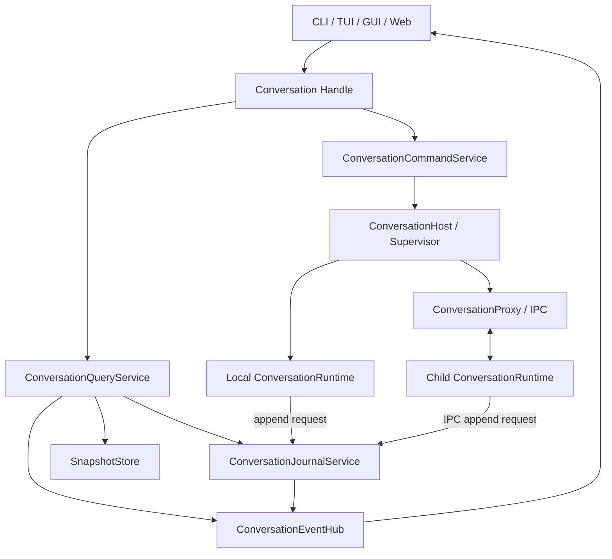

The architecture has three major layers:

```text
Public API
    Conversation

Host and Storage Services
    ConversationQueryService
    ConversationCommandService
    ConversationJournalService
    SnapshotStore
    ConversationEventHub
    ConversationHost

Runtime Execution
    ConversationRuntime
    PiAgentCoreAdapter
    ToolDispatcher
    RuntimePolicyEngine
    RuntimeEffectCoordinator
    NudgeManager
    ContextCompactionManager
    InteractionCoordinator
```

## 7. Conversation Public Boundary

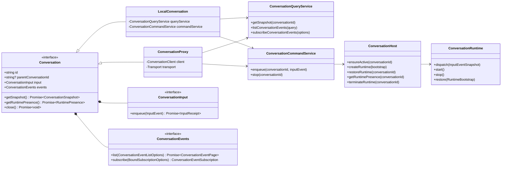

Example public usage:

```ts
await conversation.input.enqueue(inputEvent);

const page = await conversation.events.list({
  anchor: { afterSequence: 100 },
  limit: 200,
});

for await (const event of conversation.events.subscribe({
  start: { afterSequence: 100 },
})) {
  eventStore.apply(event);
}
```

The public Conversation handle may expose logical Runtime presence, but it never reveals PID, transport address, IPC details, or process placement.

### 7.1 Implemented Task 2-A Public Protocol

Task 2-A establishes only the platform-neutral protocol. It does not create a local Handle, activate Runtime, or choose process placement.

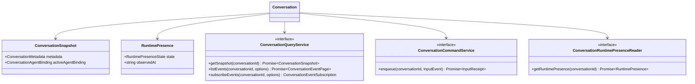

Accepted protocol rules:

- `Conversation` is an interface implemented later by local Handles and IPC-backed Proxies.
- `ConversationEvents` is already bound to one Conversation; callers cannot provide or override `conversationId`.
- internal query and command services keep an explicit `conversationId` so the same services can back many Handles.
- `ConversationSnapshot` contains durable metadata and the active versioned Agent Binding only.
- Runtime presence is a separate transient observation with `offline`, `starting`, `online`, `stopping`, or `crashed` state.
- Runtime presence never exposes placement or transport details.
- `ConversationInput.enqueue()` returns a Promise of durable `InputReceipt`; acceptance does not mean the Agent processed the Event.
- closing a Handle releases only Handle-local resources. It does not archive, dispose, or delete the durable Conversation and does not close shared Host services.

Task 2-A explicitly excludes `LocalConversation`, `ConversationProxy`, Runtime activation, Run state, Host lifecycle, IPC, access authorization, and Stop or Interrupt semantics.

### 7.2 Implemented Task 2-B Read-only LocalConversation

Task 2-B supplies an in-process Handle and durable query implementation without supplying a concrete command path or activating Runtime.

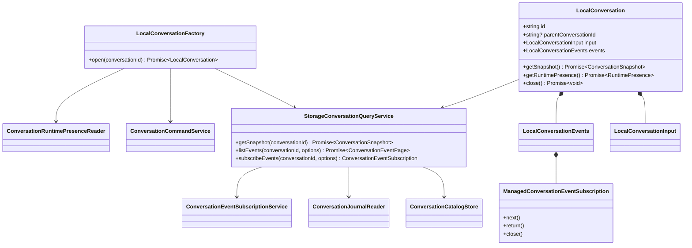

Opening a local Handle verifies durable existence before constructing the Handle:

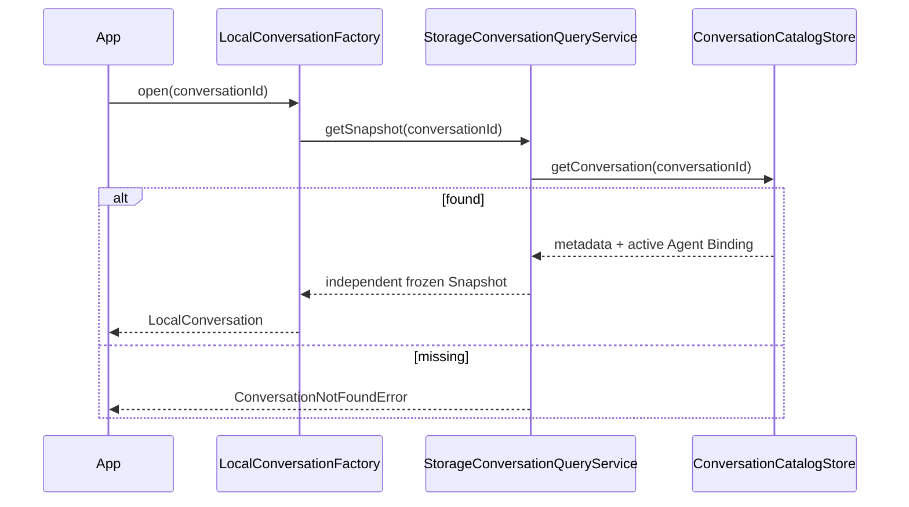

Read-only operations are bound to the Handle ID:

```text
conversation.events.list(options)
    → inject Handle conversationId after caller options
    → SQLite Journal list

conversation.events.subscribe(options)
    → inject Handle conversationId after caller options
    → Journal catch-up subscription service
```

Even an untyped or JavaScript caller cannot override the Handle's `conversationId` by adding an extra property. The bound ID is written last when constructing the internal query or subscription options.

`StorageConversationQueryService.getSnapshot()` returns independent frozen copies of Conversation Metadata and the active Agent Binding. Snapshot mutation cannot alter Catalog-owned objects or another Handle's Snapshot.

`LocalConversation` requires injected `ConversationCommandService` and `ConversationRuntimePresenceReader` ports. Task 2-B does not provide production defaults: a read-only query must not silently imply that Runtime is offline, and the Handle must not invent a command implementation. Later Host composition supplies these ports.

Handle-owned subscriptions are wrapped by `ManagedConversationEventSubscription`. Completion, failure, explicit return, or close unregisters the Subscription from the Handle. Handle close uses best-effort closure of every owned Subscription and reports multiple close failures through `AggregateError`.

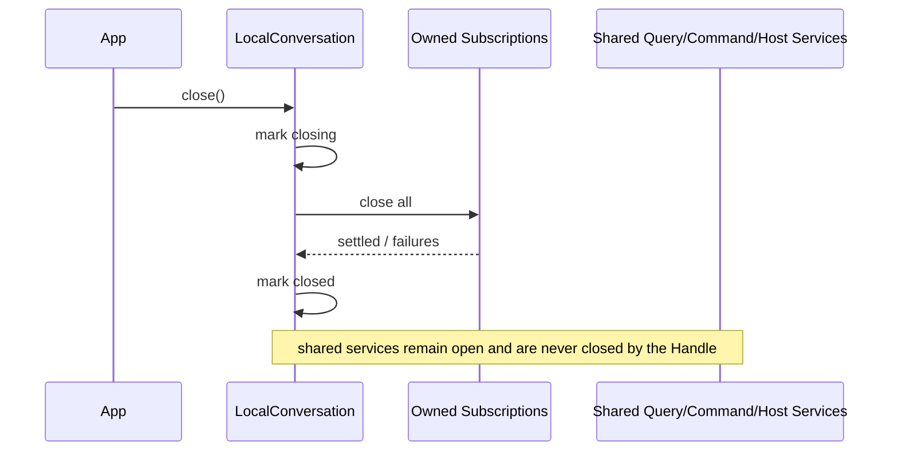

- new operations during close throw `ConversationHandleClosingError`.
- operations after close throw `ConversationHandleClosedError`.
- close is idempotent, including when Subscription closure fails.
- already-started one-shot query operations may finish normally.
- closing a Handle does not archive or dispose the Conversation.
- closing a Handle does not close Catalog, Journal, Hub, Workspace, Command Service, or Runtime Presence Reader.
- a direct synchronous `subscribeEvents()` call for an unknown ID returns a Subscription whose Journal initialization fails on first read. Normal `LocalConversationFactory.open()` validates the ID first.

The repeatable SQLite integration smoke verifies parent metadata, active Agent Binding, defensive Snapshot copies, bound Event isolation, history-to-live delivery, no Command Service invocation, logical Runtime presence delegation, Handle Subscription ownership, aggregated close failures, shared-service survival after Handle close, reopen through a second Handle, and log redaction.

Task 2-B explicitly excludes concrete command acceptance, Host activation, Runtime Bootstrap, Runtime placement, Run state, Stop or Interrupt, IPC Proxy behavior, and automatic Message projection.

### 7.3 Implemented Task 2-C Durable Command Acceptance

Task 2-C implements the production `ConversationCommandService` boundary without implementing `ConversationHost` or activating a Runtime directly.

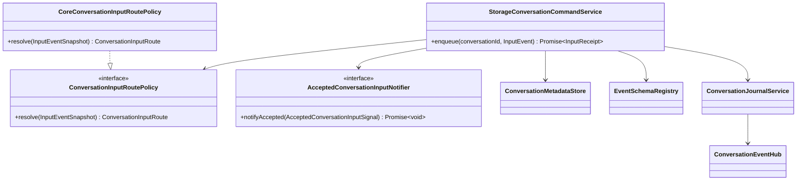

Accepted InputEvent routing is descriptive rather than executable:

| InputEvent | Route | Offline Runtime activation |
| --- | --- | --- |
| `user.message` | Runtime | required |
| `context.clear` | Runtime | required |
| `context.compact` | Runtime | required |
| registered Agent extension | Runtime | required by default |
| `system.stop` | Host stop handler | never; notify only if online |
| `command.config.reload` | Host config handler | never; notify only if online |

The accepted-input signal contains only identifiers, Event metadata, Journal Sequence, append status, and route. It never copies the InputEvent payload. Host and Runtime implementations load the canonical InputEvent from the Journal by Conversation ID and Sequence.

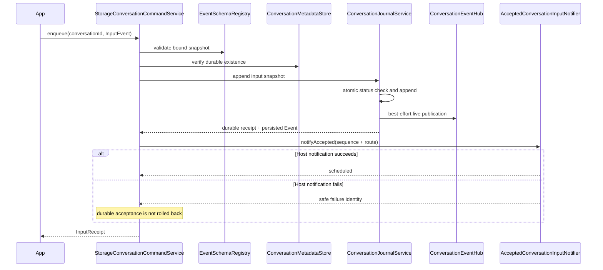

`InputReceipt.accepted` means the InputEvent was newly persisted. `InputReceipt.duplicate` means the same immutable Event was already durable. Neither status means Runtime activation, Run creation, Agent processing, or semantic completion. EventHub publication and Host notification are best-effort after durable persistence and cannot convert a successful append into a rejected enqueue.

SQLite enforces Conversation status inside the append transaction. Existing duplicate lookup happens before the status gate, so a retry of an Event accepted before archival still returns its original Sequence. A new InputEvent for an `archived` or `disposed` Conversation is rejected atomically. Same-ID different-content requests remain conflicts regardless of current Conversation status.

Duplicate receipts are also re-notified to the Host. The notifier must therefore be idempotent by Conversation ID and Journal Sequence; this lets a client retry recover from a previous post-persistence notification failure. Journal replay remains the durable recovery mechanism.

Task 2-C deliberately emits no additional acceptance OutputEvent. The persisted InputEvent and direct InputReceipt already represent acceptance. A later Host or Runtime handler may emit an `InputResponseOutputEvent` subtype only when semantic handling actually completes.

Task 2-C explicitly excludes concrete Host scheduling, Runtime activation, Runtime Presence transitions, configuration application, Stop cancellation, Run creation, Context operations, Input processing OutputEvents, and Message projection triggering. Those remain Task 2-D and later Runtime tasks.

### 7.4 Implemented Task 2-D-A Host and Placement Protocol

Task 2-D-A freezes the platform-neutral management contracts between command acceptance, Conversation Host, Runtime bootstrap creation, Runtime placement, and one ephemeral Runtime handle. It does not provide a production Host implementation or start a Runtime.

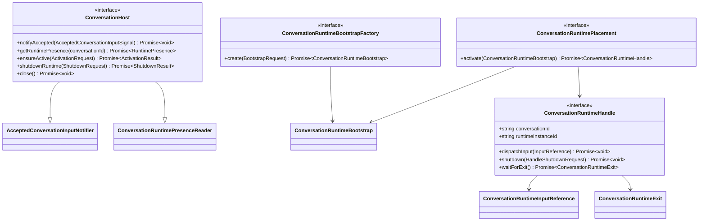

`ConversationHost.notifyAccepted()` acknowledges only process-local scheduling of a payload-free durable-input signal. It does not imply Runtime activation, Runtime dispatch, Run creation, Agent processing, or Input completion. The production per-Conversation scheduling queue remains Task 2-D-C.

Activation requests are discriminated by cause:

```text
accepted_input
    requires ConversationRuntimeInputReference

explicit_restore
    has no synthetic InputEvent

crash_recovery
    has no synthetic InputEvent
```

Activation results expose only `activated` or `reused` plus logical Runtime Presence. They do not expose Runtime instance identity, placement, transport, PID, or address to Conversation API consumers.

The bootstrap contains:

- bootstrap schema version
- opaque Runtime instance ID and activation time
- immutable Conversation Snapshot and active Agent Binding
- Workspace ID and `workdir`
- activation cause and optional durable Input reference
- Journal High Watermark

The bootstrap deliberately excludes Store directory names, database paths, JSONL paths, Provider credentials, API keys, prompt bodies, Tool handlers, Provider clients, callbacks, AbortSignals, PIDs, IPC addresses, and placement identity. `workdir` is the Workspace root, not the Store directory. Host and Storage remain the durable write authority.

`ConversationRuntimeHandle.dispatchInput()` accepts only Conversation ID, Input Event ID, Event Type, Journal Sequence, and optional correlation identifiers. Successful dispatch means only that the Runtime endpoint accepted the reference; it is not a durable processed-input checkpoint.

Runtime Handle ownership rules are explicit:

- the future Conversation Host owns and shuts down every Runtime Handle it activates.
- shutdown and exit observation must be idempotent.
- the Host does not own or close the shared Runtime Placement.
- the composition root closes a shared Placement or process supervisor after dependent Hosts.
- Placement results must match the Bootstrap Conversation ID and Runtime instance ID.

Runtime exits are normalized to safe stopped or crashed snapshots. Crash snapshots expose only safe error name and optional error code, never raw error messages, stacks, causes, stderr, Provider data, Tool data, or credentials.

Task 2-D-A also reserves stable shutdown reasons for explicit shutdown, Host close, future idle eviction, and replacement. Reserving a reason does not implement the corresponding policy; automatic idle eviction remains disabled until reliable Run, Interaction, Tool, and child-Conversation activity state exists.

Task 2-D-A explicitly excludes `ManagedConversationHost`, Bootstrap Factory implementation, Runtime Slot state, per-Conversation scheduling, Presence transitions, Runtime activation, Host control dispatch, lifecycle OutputEvents, crash restart policy, idle timers, historical pending-input recovery, Runtime checkpoints, and Agent execution.

### 7.5 Implemented Task 2-D-B Storage Runtime Bootstrap Factory

Task 2-D-B implements the immutable, storage-backed Bootstrap assembly boundary without activating a Runtime or choosing a placement.

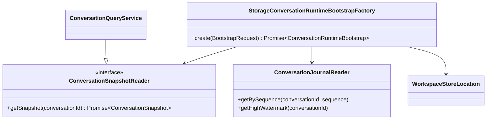

The narrow `ConversationSnapshotReader` prevents Bootstrap assembly from depending on Event listing or live subscription capabilities it does not use. The existing `ConversationQueryService` extends this reader without changing its behavior.

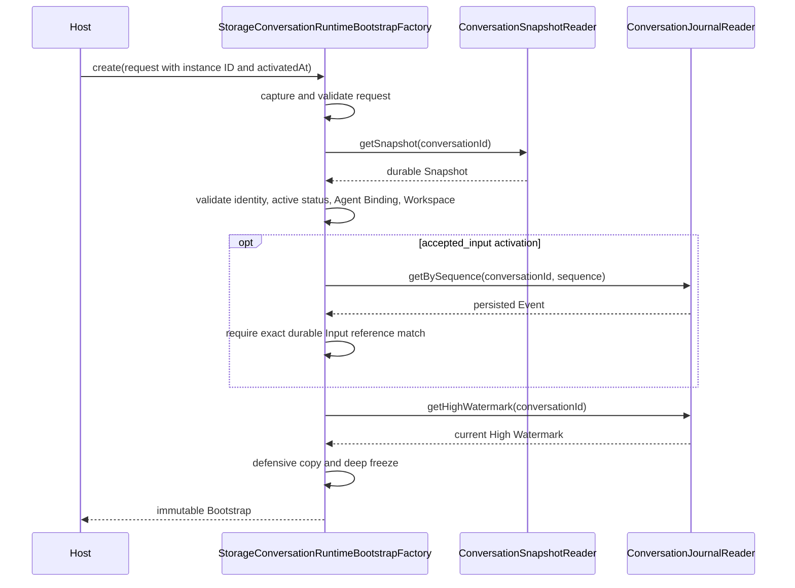

The future Host owns Runtime instance ID and activation-time generation. The Factory validates and preserves those values so the Host Slot, Presence transition, Bootstrap, Placement, and returned Runtime Handle can share one identity.

Accepted-input activation never trusts an in-memory reference alone. The Factory reloads the durable Journal record and requires:

- the Sequence exists
- the record direction is Input
- Conversation ID, Event ID, Event Type, and Sequence match
- optional correlation ID, Run ID, and Turn ID match exactly

This validation never reads, copies, or logs the Event payload. Explicit restore and crash recovery do not fabricate or require an Input reference.

The Factory rejects archived and disposed Conversations, mismatched Workspace identity, inactive or cross-Conversation Agent Bindings, missing durable inputs, OutputEvent references, mismatched input metadata, malformed requests, and invalid Journal High Watermarks.

Snapshot and Journal High Watermark reads are intentionally separate asynchronous reads rather than one storage-specific transaction. A concurrent append may therefore produce:

```text
Snapshot metadata lastJournalSequence = 40
Bootstrap Journal High Watermark = 41
```

This is valid. The High Watermark must never be lower than the Snapshot's observed Sequence or an accepted activation Input Sequence. Runtime replay uses `bootstrap.journal.highWatermark`; it does not substitute `metadata.lastJournalSequence`.

The Factory defensively copies and freezes the Bootstrap root, Conversation Snapshot, Metadata, active Agent Binding, Workspace identity, Activation cause, accepted Input reference, and Journal identity. Mutation of an injected reader's source objects cannot alter an already-created Bootstrap.

The Factory captures only Workspace ID and Workspace root at construction. Bootstrap maps the root to `workdir` and never retains or emits Store directory name, Store path, database path, JSONL path, Provider credentials, prompt content, Tool data, or Event payloads.

Structured lifecycle logs include stable identifiers, activation reason, optional activation Sequence, High Watermark, Agent Type, Definition Version, and safe error identity. Invalid caller-controlled identifiers are logged as `unknown`; paths, payloads, messages, stacks, and causes are never logged.

Task 2-D-B explicitly excludes Runtime ID generation, Clock ownership, Host Slot state, per-Conversation scheduling, Runtime activation, Placement invocation, Presence transitions, Host control routes, lifecycle OutputEvents, processed-input checkpoints, historical pending-input recovery, idle eviction, and crash restart loops.

### 7.6 Implemented Task 2-D-C Managed Conversation Host

Task 2-D-C implements the process-local lifecycle authority that connects durable accepted-input notifications to Runtime placement without introducing Runtime execution, IPC, or Agent behavior.

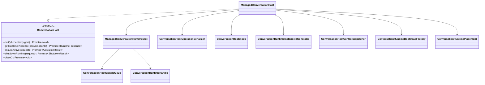

Each Conversation has one Host-owned Runtime Slot. Operations for the same Conversation pass through `ConversationHostOperationSerializer`, while unrelated Conversations can activate, dispatch, and shut down concurrently. This creates a serial state machine per Conversation without turning the entire Host into one global lock.

The Slot exposes only logical Presence through the public API:

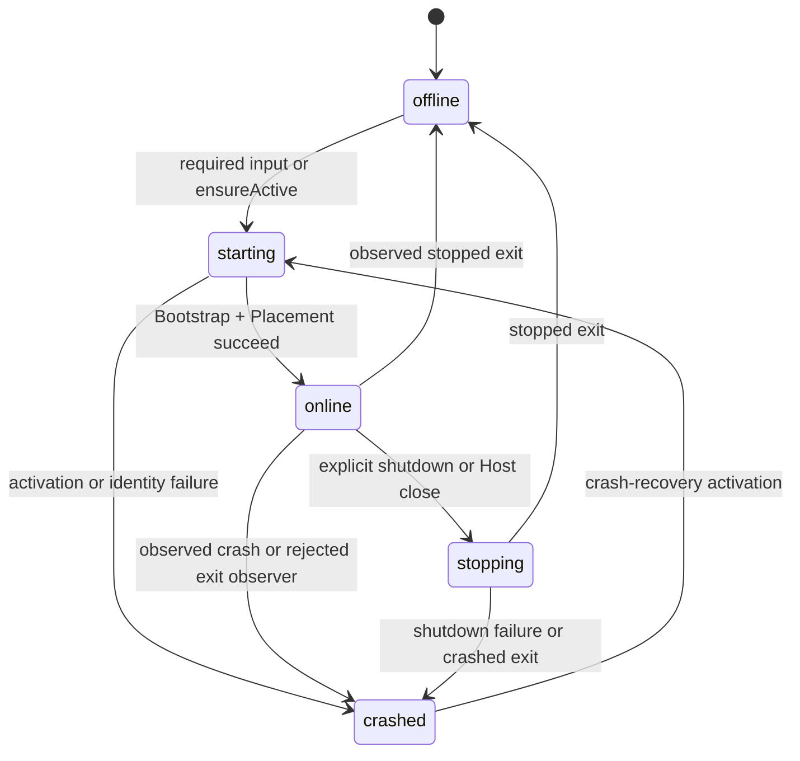

Runtime instance ID, generation, Handle, PID, worker identity, and transport address remain internal. `getRuntimePresence()` returns a frozen `{ state, observedAt }` copy. A previously unseen Conversation ID is verified through `ConversationSnapshotReader` before an offline Slot becomes a valid public Presence result.

Accepted signals enter two independent bounded queues per Conversation:

| Queue | Default capacity | Contents |
| --- | ---: | --- |
| Control | 64 | Host-routed Stop, ReloadConfig, and future Host commands |
| Runtime | 1024 | Runtime-required and Runtime-if-online input references |

The scheduler always selects Control before Runtime. Within each queue it selects higher Priority first, then lower Journal Sequence. Queue overflow is explicit and never silently drops a durable notification. The durable Journal remains the restart recovery source; these queues are process-local scheduling state.

Signal identity is keyed by Conversation ID and Journal Sequence with a payload-free fingerprint. An identical re-notification is idempotent and also acts as a wake-up after a previous dispatch failure. The same Sequence with a different Event or route identity is rejected as a conflict. `journalStatus: appended` and `journalStatus: duplicate` intentionally produce the same fingerprint.

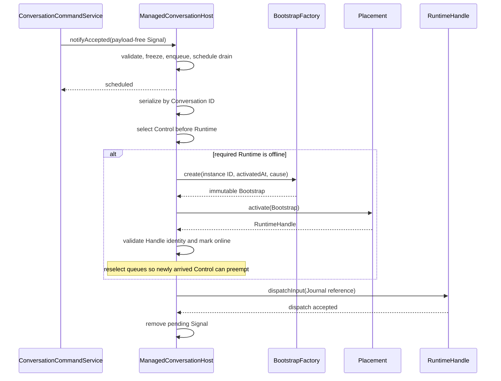

`notifyAccepted()` resolves after process-local scheduling, not after activation or Runtime dispatch. Background failures therefore cannot roll back the durable `InputReceipt`. A failed Runtime or control dispatch leaves the Signal pending, stops the current drain, and performs no automatic retry loop. A later new or duplicate notification increments the Slot revision and wakes the drain. A revision check also prevents a notification arriving during a failed attempt from being lost.

Runtime activation is single-flight through the per-Conversation serializer. The Host owns generation, Runtime instance ID, and activation timestamps; the Bootstrap Factory remains a pure assembly boundary. A Runtime-required Signal activates an offline Slot with `accepted_input` and a crashed Slot with `crash_recovery`. Runtime `if_online` Signals never activate an offline Slot.

The returned Handle must match both Bootstrap Conversation ID and Runtime instance ID. A mismatch is rejected, never stored, degraded to `crashed`, and receives a best-effort replacement shutdown without waiting for its exit. Exit observers capture generation and Runtime instance ID; stale exits from replaced instances cannot overwrite the current Slot.

Host-control behavior is injected through `ConversationHostControlDispatcher`. Its context contains frozen logical Presence and, only while online, a narrow Runtime command target with `dispatchInput()`. It never receives the placement-owned Handle. Core Stop semantics, ReloadConfig application, and lifecycle OutputEvents remain Task 2-D-D.

Explicit shutdown is serialized with activation and dispatch. Host close is idempotent, rejects new operations once closing begins, queues best-effort `host_close` shutdown for active Slots, aggregates failures, clears process-local queues, and does not close shared Placement, Bootstrap Factory, Snapshot Reader, Dispatcher, Journal, Workspace, or Event Hub resources.

Structured logs contain stable lifecycle identities and safe error name/code fields only. They never include Event payloads, novel text, prompts, configuration contents, Tool data, credentials, Store/work paths, JSONL lines, raw error messages, stacks, causes, or Runtime stderr.

Task 2-D-C explicitly excludes Stop cancellation semantics, queued-user-input removal, ReloadConfig application, Runtime lifecycle OutputEvents, durable Runtime checkpoints, Host-restart pending-input reconciliation, automatic crash retry or backoff, idle eviction, `ConversationRuntime`, `InputRouter`, Run state, Pi integration, Tools, Approval, IPC, and Subagents.

### 7.7 Implemented Task 2-D-D-A Conversation Output Publication

Task 2-D-D-A introduces the unified Conversation-layer write boundary for validated `OutputEvent` objects. Host, Runtime, Tool, and Novel components can publish through the same contract without calling the Journal directly.

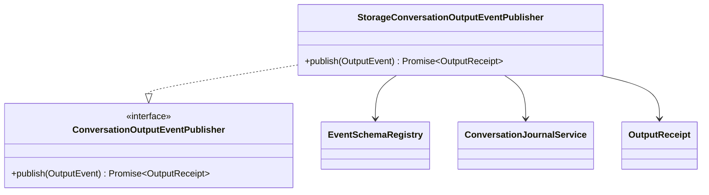

The publisher accepts Core-owned `OutputEvent` instances rather than arbitrary caller-built snapshots. It captures `getSnapshot()`, validates the registered Output schema, canonicalizes and deeply freezes the snapshot, then appends it to the unified Conversation Journal with `direction: output`.

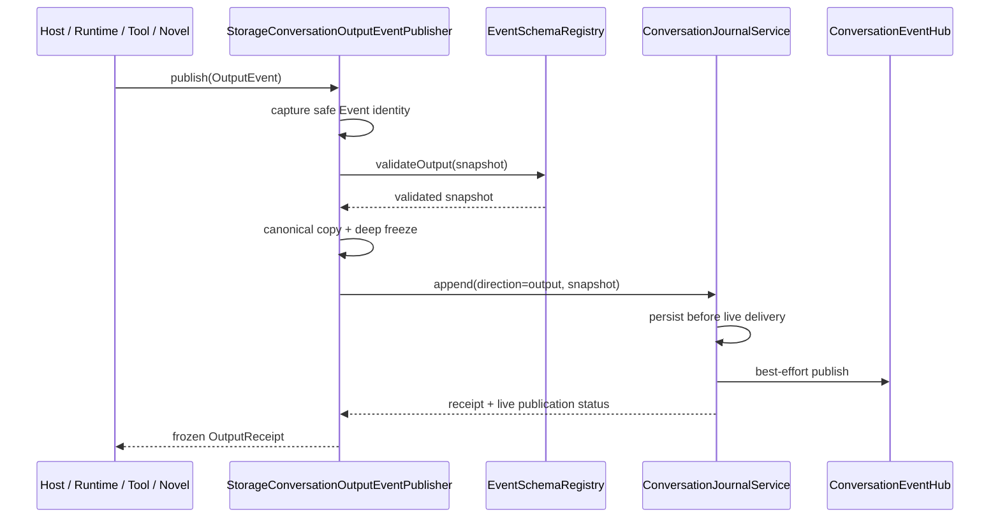

`OutputReceipt.status` is `recorded` for a newly durable OutputEvent and `duplicate` for an identical existing Event. A duplicate returns the original Journal Sequence. The receipt does not claim that every live subscriber received the Event; historical recovery always reads the Journal.

The publisher preserves the Journal's persistence-first degradation boundary. A failed EventHub publication is logged safely and still returns a successful durable receipt. Journal append failure rejects publication with a stable `ConversationOutputPersistenceError`. Same-ID different-content Journal conflicts become `ConversationOutputConflictError`. Invalid or unregistered Output schemas become `ConversationOutputRejectedError` with `invalid_event` or `unknown_event_type` reason codes.

Publisher logs contain only Conversation ID, Output Event ID, Event Type, Sequence, live publication status, rejection reason, and safe error name/code identity. Output payloads, novel content, prompts, configuration, Tool data, credentials, paths, raw messages, stacks, and causes are never logged.

The real SQLite smoke validates durable append, process-local live delivery, duplicate Sequence preservation, conflict rejection, unknown and invalid schema rejection, live-publication degradation, stable persistence errors, Store reopen replay, and log redaction.

Task 2-D-D-A does not modify `ManagedConversationHost`, define lifecycle OutputEvent types, emit Runtime Presence transitions, implement InputResponse events, or implement Stop and ReloadConfig semantics. Those remain the following Task 2-D-D checkpoints.

### 7.8 Implemented Task 2-D-D-B Lifecycle OutputEvent Contracts

Task 2-D-D-B defines the two Core Output protocols required by later Host integration without changing Host behavior.

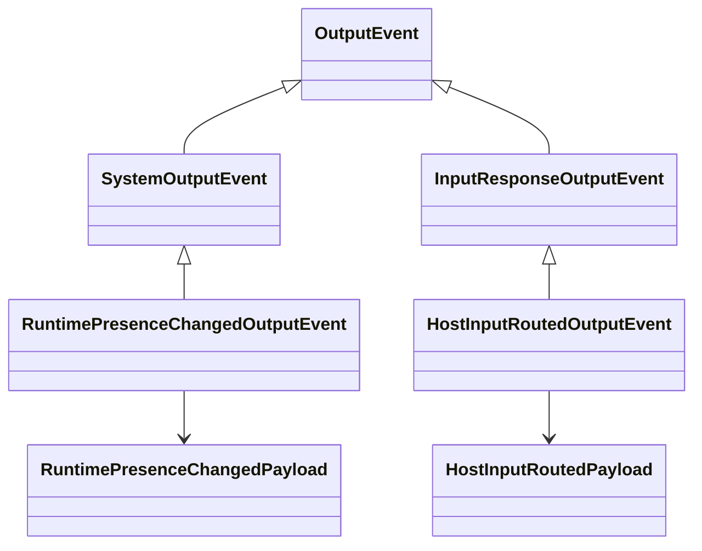

`RuntimePresenceChangedOutputEvent` uses Event Type `system.runtime.presence.changed`. Its payload contains frozen copies of the previous and current logical Presence plus a stable transition reason:

```ts
{
  previous: { state, observedAt },
  current: { state, observedAt },
  reason
}
```

The event timestamp defaults to the current Presence `observedAt`, preserving the Host transition time even when durable publication occurs later. Runtime instance ID, generation, PID, worker identity, placement, and transport address are deliberately absent.

Transition reasons cover accepted-input, explicit-restore, and crash-recovery activation requests; activation success or failure; explicit, Host-close, idle-eviction, and replacement shutdown; stopped or crashed Runtime exits; exit-observer failure; and shutdown failure. The event records an observable state fact and does not itself perform activation or shutdown.

`HostInputRoutedOutputEvent` uses Event Type `system.input.routed` and extends `InputResponseOutputEvent`. It carries a defensively copied durable Input reference containing Event ID, Event Type, and Journal Sequence. `causationId` defaults to the referenced Input Event ID unless the producer explicitly supplies another causal identity.

Its payload is intentionally limited to:

```ts
{
  handler: "stop" | "reload_config",
  outcome: "runtime_notified" | "no_runtime" | "deferred"
}
```

`runtime_notified` means only that the durable Input reference was dispatched to an online Runtime command target. `no_runtime` means routing found no online Runtime and performed no Runtime notification. `deferred` reserves an explicitly deferred Host outcome. None of these values means Stop cancellation completed or ReloadConfig became active; those semantic completion events belong to the future Runtime and InputRouter layers.

Both Event Types and Payload schemas are registered by `createCoreEventSchemaRegistry()`. Agent- or plugin-owned Output types remain unknown until their definitions are explicitly registered. The protocol smoke validates defensive copies, durable Input Sequence requirements, causation defaults, Core Registry acceptance, invalid reason and outcome rejection, and absence of Runtime placement identity.

Task 2-D-D-B does not publish these events, modify `ManagedConversationHost`, change the control-dispatcher return type, or implement Stop, ReloadConfig, Runtime, InputRouter, Run, Turn, IPC, or Subagent behavior.

### 7.9 Implemented Task 2-D-D-C Managed Host Lifecycle Publication

Task 2-D-D-C injects the shared `ConversationOutputEventPublisher` into `ManagedConversationHost` and records every real logical Runtime Presence transition through `RuntimePresenceChangedOutputEvent`.

```mermaid
sequenceDiagram
    participant Host as ManagedConversationHost
    participant Slot as Runtime Slot
    participant Output as ConversationOutputEventPublisher
    participant Factory as Bootstrap Factory
    participant Placement

    Host->>Slot: set offline → starting
    Host->>Output: publish PresenceChanged(accepted_input)
    alt publication succeeds
        Output-->>Host: durable OutputReceipt
    else publication fails
        Output--xHost: safe failure
        Host->>Host: log and continue without rollback
    end
    Host->>Factory: create Bootstrap
    Factory-->>Host: Bootstrap
    Host->>Placement: activate
    Placement-->>Host: Runtime Handle
    Host->>Slot: set starting → online
    Host->>Output: publish PresenceChanged(activation_succeeded)
```

Presence state is updated before publication. The Host awaits each publication attempt inside the per-Conversation serialized lifecycle path so successful lifecycle OutputEvents preserve transition order. A publication failure is caught, logged with safe identities, and never rolls the Slot back, fails activation, prevents Runtime input dispatch, converts a successful shutdown into failure, or aborts Host close.

The initial offline Slot created for lookup or accepted-input scheduling does not emit an Event because no observed transition occurred. Subsequent transitions cover activation start, activation success or failure, shutdown start, stopped or crashed exits, rejected exit observation, and shutdown failure.

Accepted-input activation Events inherit the Input Event ID as `causationId` and preserve correlation, Run, and Turn identity. A required durable Input that recovers a crashed Runtime supplies the same metadata to the `crash_recovery` transition even though the Bootstrap activation cause intentionally contains no synthetic Input reference. Explicit restore without an Input has no fabricated causation.

The `starting` lifecycle OutputEvent is appended before Bootstrap creation. Therefore a storage-backed Bootstrap Factory may observe that OutputEvent in its Journal High Watermark while still validating the original accepted Input by its own Sequence. The lifecycle Output append does not call the Input command notifier and cannot recursively trigger Runtime activation.

Unexpected Runtime exits remain protected by Slot generation and Runtime instance ID checks. Stale exits emit no Presence OutputEvent. Matching stopped exits transition to offline with `runtime_stopped`; matching crashes use `runtime_crashed`; rejected exit observers use `exit_observer_failed`.

Host close continues to own only Runtime Slots and Handles. It does not close the injected Output publisher, Journal service, or EventHub. Lifecycle publication failures do not generate another OutputEvent, preventing recursive failure loops.

The lifecycle smoke now verifies ordered accepted-input activation, Host-close shutdown transitions, crash and crash-recovery transitions, Input causation retention, and continued activation, dispatch, Presence reporting, and close when every lifecycle publication attempt fails.

Task 2-D-D-C does not publish `HostInputRoutedOutputEvent`, change control-dispatch results, or implement Stop cancellation, ReloadConfig application, Runtime execution, InputRouter, Run/Turn state, IPC, or Subagents.

### 7.10 Implemented Task 2-D-D-D Core Host Control Dispatcher

Task 2-D-D-D implements `CoreConversationHostControlDispatcher` for the two Core Host routes while preserving the distinction between routing and semantic execution.

```mermaid
flowchart TD
    Signal["Durable Host-routed Input Signal"] --> Validate["Validate handler, Event Type, and context"]
    Validate --> Online{"Online Runtime target?"}
    Online -- yes --> Dispatch["dispatchInput(durable Journal reference)"]
    Dispatch --> RuntimeOutcome["runtime_notified"]
    Online -- no, Stop --> NoRuntime["no_runtime"]
    Online -- no, ReloadConfig --> Deferred["deferred"]
    RuntimeOutcome --> RoutedEvent["HostInputRoutedOutputEvent"]
    NoRuntime --> RoutedEvent
    Deferred --> RoutedEvent
    RoutedEvent --> Publish["ConversationOutputEventPublisher.publish()"]
    Publish --> Result["Frozen ControlDispatchResult"]
```

The Dispatcher accepts only the Core route pairs:

| Input Event Type | Handler | Offline outcome |
| --- | --- | --- |
| `system.stop` | `stop` | `no_runtime` |
| `command.config.reload` | `reload_config` | `deferred` |

Both Core routes require `runtimeNotification: if_online`. A supplied Runtime target must report the same Conversation ID, a non-empty Runtime instance ID, and online logical Presence. Online Stop and ReloadConfig inputs are dispatched as payload-free `ConversationRuntimeInputReference` values. The Runtime resolves the canonical Event from Journal by Conversation ID and Sequence.

`runtime_notified` means the Runtime command endpoint accepted the reference. It does not mean an active Run was cancelled or a configuration became effective. Offline Stop performs no action because there is no active Runtime to notify. Offline ReloadConfig is classified as deferred so a later Runtime/configuration layer can resolve the durable command; this Dispatcher does not load or apply its payload.

After routing, the Dispatcher publishes `HostInputRoutedOutputEvent` and returns a frozen `ConversationHostControlDispatchResult` containing handler, routing outcome, and durable `OutputReceipt`. `ManagedConversationHost` removes the pending control Signal only after this complete result returns, and logs the routing outcome plus Output identity.

Runtime notification failure becomes a safe `ConversationRuntimeDispatchError`; no routed OutputEvent is emitted because routing did not complete. If Runtime notification succeeds but routed Output publication fails, the Dispatcher rethrows the publication failure. The Host leaves the Signal pending and stops the current drain. A later new or duplicate accepted-input notification can wake the queue and retry; Runtime dispatch remains idempotent by durable Sequence.

The Dispatcher uses an injected Clock for deterministic routed-event timestamps and an injected Output publisher that it does not own or close. Structured logs contain stable routing identities and safe error name/code only, never Input payloads, ReloadConfig contents, novel text, prompts, Tool data, credentials, paths, messages, stacks, or causes.

The focused smoke validates online Stop and ReloadConfig notification, offline Stop and ReloadConfig outcomes, durable reference metadata, routed Output shape and causation, Runtime notification failure, Output publication failure after notification, invalid route/context rejection, and log redaction.

Task 2-D-D-D does not implement Runtime cancellation, configuration resolution/application, queued user-input clearing, semantic completion OutputEvents, Runtime/InputRouter behavior, Pi, Tools, Approval, IPC, or Subagents.

### 7.11 Implemented Task 2-D-D-E SQLite Host Integration

Task 2-D-D-E validates the complete no-process Host composition against the real Workspace SQLite Store and unified Journal:

```text
StorageConversationCommandService
    → ManagedConversationHost
        → StorageConversationRuntimeBootstrapFactory
        → Integration Runtime Placement / Handle
        → CoreConversationHostControlDispatcher
        → StorageConversationOutputEventPublisher
            → PublishingConversationJournalService
                → SQLite Journal + InMemory EventHub
```

The integration uses one shared Core Event Schema Registry, Output publisher, Journal service, Clock, and Workspace identity. No fake Journal, Catalog, Bootstrap Factory, query service, or Output persistence path is used.

The validated durable sequence is:

| Sequence | Direction | Event Type | Lifecycle or routing result |
| ---: | --- | --- | --- |
| 1 | Input | `user.message` | Runtime-required input |
| 2 | Output | `system.runtime.presence.changed` | `accepted_input` |
| 3 | Output | `system.runtime.presence.changed` | `activation_succeeded` |
| 4 | Input | `system.stop` | online Host route |
| 5 | Output | `system.input.routed` | `runtime_notified` |
| 6 | Output | `system.runtime.presence.changed` | `explicit_shutdown` |
| 7 | Output | `system.runtime.presence.changed` | `runtime_stopped` |
| 8 | Input | `command.config.reload` | offline Host route |
| 9 | Output | `system.input.routed` | `deferred` |
| 10 | Input | `system.stop` | offline Host route |
| 11 | Output | `system.input.routed` | `no_runtime` |

The Runtime Bootstrap is created after Sequence 2, so its Journal High Watermark is 2 while its accepted activation Input reference remains Sequence 1. This proves lifecycle Output insertion does not break exact durable Input validation.

The online Stop reference reaches the Runtime Handle without payload copying. Re-notifying the identical durable Stop Input is idempotent in the Host and creates neither a second Runtime dispatch nor a second routed OutputEvent. Explicit shutdown records stopping and stopped Presence transitions before later offline control routing.

All eleven persisted Events are observed through the process-local EventHub in contiguous Sequence order and remain readable after closing and reopening the SQLite Store. The integration also verifies that novel text, ReloadConfig contents, Workspace paths, Store paths, database paths, Output payloads, and raw errors do not enter structured logs.

Task 2-D-D-E adds no production behavior. It does not implement semantic Stop cancellation, configuration application, Runtime execution, InputRouter, Run/Turn state, Pi, Tools, Approval, IPC, or Subagents.

## 8. Query and Command Paths

```mermaid
flowchart LR
    Conversation["Conversation Handle"]

    Conversation --> Query["Query Path"]
    Conversation --> Command["Command Path"]

    Query --> List["events.list()"]
    Query --> Subscribe["events.subscribe()"]
    Query --> GetSnapshot["getSnapshot()"]

    List --> Journal["JournalReader"]
    Subscribe --> Journal
    Subscribe --> EventHub["ConversationEventHub"]
    GetSnapshot --> SnapshotStore["SnapshotStore"]

    Command --> Enqueue["input.enqueue()"]
    Enqueue --> CommandService["ConversationCommandService"]
    CommandService --> JournalWrite["Persist InputEvent"]
    JournalWrite --> Notify["Accepted Input Notifier"]
    Notify --> Host["Future ConversationHost"]
    Host --> Runtime["ConversationRuntime when route requires"]
```

Operations that never activate a Runtime:

- `events.list()`
- `events.subscribe()`
- `getSnapshot()`
- metadata lookup
- Conversation export
- Tool trace lookup
- InputEvent and OutputEvent replay

A following subscription attaches to the Host-owned EventHub and waits for future events. Subscribing alone does not activate a Runtime.

Execution inputs pass through `ConversationCommandService`, enter the durable Journal first, and only then notify the Host. Task 2-D will implement the Host decision to activate, reuse, or leave a Runtime offline.

## 9. State Model

A single Conversation state would mix durable product state, active-run state, and process state. These are separate dimensions.

### 9.1 Conversation Status

```text
active
archived
disposed
```

- `active`: accepts queries and, subject to policy, execution commands.
- `archived`: remains readable but rejects normal execution until explicitly restored by a future archive API.
- `disposed`: no longer usable through normal Conversation APIs.

### 9.2 Run Status

```mermaid
stateDiagram-v2
    [*] --> queued
    queued --> running: runtime accepts run

    running --> waiting_interaction: approval requested
    waiting_interaction --> running: interaction resolved

    running --> stopping: stop
    waiting_interaction --> stopping: stop

    stopping --> cancelled: cancellation completed
    running --> completed: run completed
    running --> failed: unrecoverable failure

    completed --> [*]
    failed --> [*]
    cancelled --> [*]
```

An idle Conversation is represented by the absence of an active Run rather than by overloading Conversation lifecycle state.

### 9.3 Runtime Presence

```mermaid
stateDiagram-v2
    [*] --> offline
    offline --> starting: execution command
    starting --> online: bootstrap succeeded
    starting --> crashed: bootstrap failed

    online --> stopping: shutdown / idle eviction
    stopping --> offline: process exited

    online --> crashed: unexpected exit
    crashed --> starting: restore policy
    crashed --> offline: abandon runtime
```

Valid combinations include:

```text
ConversationStatus: active
RunStatus: none
RuntimePresence: offline

ConversationStatus: active
RunStatus: waiting_interaction
RuntimePresence: offline or online

ConversationStatus: archived
RunStatus: none
RuntimePresence: offline
```

Pending interactions must be durable so a waiting run can be reconstructed even if the original Runtime is offline.

## 10. Input Event Model

```mermaid
classDiagram
    class InputEvent {
        <<abstract>>
        +string id
        +string? conversationId
        +string timestamp
        +getEventType() string
        +getPriority() number
        +getPayload() EventPayload
        +getSnapshot() InputEventSnapshot
    }

    class SystemInputEvent
    class CommandInputEvent
    class UserInputEvent
    class ContextInputEvent

    class StopInputEvent
    class ReloadConfigInputEvent
    class ApprovalDecisionInputEvent
    class InterruptInputEvent

    class UserMessageInputEvent

    class ClearContextInputEvent
    class CompactContextInputEvent

    InputEvent <|-- SystemInputEvent
    InputEvent <|-- CommandInputEvent
    InputEvent <|-- UserInputEvent
    InputEvent <|-- ContextInputEvent

    CommandInputEvent <|-- StopInputEvent
    CommandInputEvent <|-- ReloadConfigInputEvent
    CommandInputEvent <|-- ApprovalDecisionInputEvent
    CommandInputEvent <|-- InterruptInputEvent

    UserInputEvent <|-- UserMessageInputEvent
    ContextInputEvent <|-- ClearContextInputEvent
    ContextInputEvent <|-- CompactContextInputEvent
```

Currently implemented input classes include:

- `UserMessageInputEvent`
- `ReloadConfigInputEvent`
- `StopInputEvent`
- `ClearContextInputEvent`
- `CompactContextInputEvent`
- `ResumeInputEvent`, currently provisional and not part of the accepted first-version protocol

Planned input classes include:

- `ApprovalDecisionInputEvent`
- `InterruptInputEvent`, after its exact cancellation semantics are frozen

## 11. Input Routing

A single priority queue is insufficient because an active turn may already be waiting for a tool or interaction. Priority cannot preempt code that has already started awaiting work.

```mermaid
flowchart TB
    Input["InputEvent"]
    Router["InputRouter"]
    Control["Control Lane"]
    Turn["Turn Lane"]

    Stop["Stop / Interrupt"]
    Approval["Approval Decision"]
    Config["Reload Config"]

    User["User Message"]
    Context["Context Change"]
    Task["Agent Task"]

    Input --> Router
    Router --> Control
    Router --> Turn

    Control --> Stop
    Control --> Approval
    Control --> Config

    Turn --> User
    Turn --> Context
    Turn --> Task
```

Control Lane requirements:

- remains responsive while Model Provider execution is active
- remains responsive while a Tool is active
- remains responsive while an approval is pending
- can cancel the current Run, Turn, Tool, Interaction, and configured child work

Turn Lane requirements:

- handles normal user messages and Agent tasks
- serializes Agent execution by default
- may still use priority inside the lane
- does not prevent Control Lane processing

## 12. Output Event Model

```mermaid
classDiagram
    class OutputEvent {
        <<abstract>>
        +string id
        +string conversationId
        +string eventType
        +string timestamp
        +number sequence
        +number schemaVersion
        +string? correlationId
        +string? causationId
        +string? runId
        +string? turnId
        +getPayload() OutputPayload
    }

    class InputResponseOutputEvent {
        +string inputEventId
        +InputEventSnapshot? inputEventSnapshot
    }

    class SystemOutputEvent
    class AgentOutputEvent
    class NovelOutputEvent
    class ErrorOutputEvent

    class ApprovalRequestedOutputEvent
    class ApprovalResolvedOutputEvent
    class NudgeScheduledOutputEvent
    class SystemReminderInjectedOutputEvent
    class NudgeExpiredOutputEvent
    class ContextCompactionRequestedOutputEvent
    class ContextCompactionStartedOutputEvent
    class ContextCompactionCompletedOutputEvent
    class ContextCompactionFailedOutputEvent
    class ContextCheckpointAppliedOutputEvent

    class AssistantOutputEvent
    class ToolCallOutputEvent
    class ToolResponseOutputEvent

    OutputEvent <|-- InputResponseOutputEvent
    OutputEvent <|-- SystemOutputEvent
    OutputEvent <|-- AgentOutputEvent
    OutputEvent <|-- NovelOutputEvent
    OutputEvent <|-- ErrorOutputEvent

    SystemOutputEvent <|-- ApprovalRequestedOutputEvent
    SystemOutputEvent <|-- NudgeScheduledOutputEvent
    SystemOutputEvent <|-- SystemReminderInjectedOutputEvent
    SystemOutputEvent <|-- NudgeExpiredOutputEvent
    SystemOutputEvent <|-- ContextCompactionRequestedOutputEvent
    SystemOutputEvent <|-- ContextCompactionStartedOutputEvent
    SystemOutputEvent <|-- ContextCompactionCompletedOutputEvent
    SystemOutputEvent <|-- ContextCompactionFailedOutputEvent
    SystemOutputEvent <|-- ContextCheckpointAppliedOutputEvent
    InputResponseOutputEvent <|-- ApprovalResolvedOutputEvent

    AgentOutputEvent <|-- AssistantOutputEvent
    AgentOutputEvent <|-- ToolCallOutputEvent
    AgentOutputEvent <|-- ToolResponseOutputEvent
```

`OutputEvent.conversationId` is always required.

Only outputs that explicitly respond to one InputEvent inherit from `InputResponseOutputEvent`. Independent system, Agent, error, and child events do not need an InputEvent reference.

IPC and persisted consumers discriminate events using `eventType` and validated payload schemas rather than JavaScript `instanceof` checks.

Lifecycle event semantics are explicit:

- `NudgeScheduledOutputEvent` means a Policy produced a Nudge and it entered the pending queue; it has not necessarily reached the model.
- `SystemReminderInjectedOutputEvent` means a one-shot Reminder was included in a concrete dispatched Provider request.
- `ContextCompactionCompletedOutputEvent` means a durable ContextCheckpoint was created.
- `ContextCheckpointAppliedOutputEvent` means that Checkpoint was actually used to compile a concrete Provider request.
- OutputEvents observe state transitions. The authoritative state remains in the corresponding Runtime component and durable store.

## 13. Event Envelope and Identity

The protocol-level event representation is pure data:

```ts
interface EventEnvelope<TPayload = unknown> {
  id: string;
  conversationId: string;
  eventType: string;
  timestamp: string;

  sequence: number;
  schemaVersion: number;

  correlationId?: string;
  causationId?: string;
  runId?: string;
  turnId?: string;

  payload: TPayload;
}
```

Identity hierarchy:

```text
conversationId
└─ runId
   └─ turnId
      ├─ toolCallId
      │  └─ approvalRequestId
      └─ outputEventId
```

- `conversationId`: durable Conversation identity
- `runId`: one accepted execution task
- `turnId`: one model request and response cycle
- `toolCallId`: one Tool invocation
- `approvalRequestId`: one approval interaction
- `sequence`: durable per-Conversation journal ordering
- `correlationId`: correlation across a broader execution chain
- `causationId`: direct event or command that caused the current record

Local InputEvent construction may omit `conversationId` for convenience. `ConversationInput.enqueue()` or CommandService must resolve it before persistence or IPC transmission.

Full InputEvent snapshots inside output events must be:

- bounded in size
- non-recursive
- redacted when sensitive
- omitted or replaced with a Journal reference for large inputs

## 14. Conversation Event History and Subscription

```ts
interface ConversationEvents {
  list(query?: ConversationEventQuery): Promise<ConversationEventPage>;

  subscribe(
    options: ConversationEventSubscriptionOptions,
  ): AsyncIterable<PersistedConversationEventSnapshot>;
}

interface ConversationEventQuery {
  afterSequence?: number;
  beforeSequence?: number;
  limit?: number;
  eventTypes?: string[];
  direction?: "input" | "output";
}

type ConversationEventSubscriptionStart =
  | { from: "beginning" }
  | { from: "latest" }
  | { from: "sequence"; afterSequence: number };

interface ConversationEventSubscriptionOptions {
  start: ConversationEventSubscriptionStart;
  eventTypes?: string[];
  direction?: "input" | "output";
  signal?: AbortSignal;
}
```

### 14.1 Read-only Replay

```mermaid
sequenceDiagram
    participant UI
    participant Conversation
    participant Query as ConversationQueryService
    participant Journal as ConversationJournal

    UI->>Conversation: events.list(afterSequence, limit)
    Conversation->>Query: listConversationEvents(query)
    Query->>Journal: read persisted Input/Output records
    Journal-->>Query: ConversationEvent page
    Query-->>Conversation: page
    Conversation-->>UI: page

    Note over UI,Journal: No Runtime or child process is created
```

### 14.2 Catch-up and Live Follow

```mermaid
sequenceDiagram
    participant UI
    participant Conversation
    participant Query as ConversationQueryService
    participant Journal as ConversationJournal
    participant Hub as ConversationEventHub

    UI->>Conversation: events.subscribe(afterSequence=100)
    Conversation->>Query: subscribe(conversationId, 100)
    Query->>Hub: establish subscription and watermark
    Query->>Journal: read events after 100 through watermark
    Journal-->>Query: historical ConversationEvents
    Query-->>UI: replay historical events
    Query->>Hub: drain buffered events and follow live
    Hub-->>UI: new persisted ConversationEvents

    Note over UI,Hub: Subscription does not activate ConversationRuntime
```

QueryService owns the catch-up-to-live transition so clients cannot lose events between separate list and subscribe operations.

## 15. Journal and Live Delivery

The durable journal and live event hub have different responsibilities and belong to the Host/Storage layer.

```mermaid
flowchart LR
    Runtime["ConversationRuntime"]
    Append["append event request"]
    Journal["ConversationJournalService"]
    Sequence["assign sequence"]
    Publisher["ConversationEventHub.publish()"]
    Client["CLI / TUI / GUI / Web"]

    Runtime --> Append
    Append --> Journal
    Journal --> Sequence
    Sequence --> Publisher
    Publisher --> Client
```

Rules:

- Journal append succeeds before live publication.
- Host-owned JournalService is the sequence authority.
- Local and child runtimes use the same logical append port.
- Child runtimes append through IPC rather than directly writing shared files.
- Snapshots accelerate restoration but never replace the append-only Journal.
- Journal and Snapshot formats carry explicit schema versions.
- Clients reconnect using `afterSequence`.

### 15.1 Implemented Task 1B Storage Boundary

Task 1B implements the durable Store primitive used by the future Host-owned JournalService. It does not implement live publication.

```mermaid
classDiagram
    class SqliteWorkspaceStore {
        +WorkspaceStoreLocation workspace
        +ConversationCatalogStore conversations
        +ConversationJournalStore journal
        +open(options) Promise~SqliteWorkspaceStore~
        +close() Promise~void~
    }

    class ConversationJournalStore {
        <<interface>>
        +append(request) Promise~JournalAppendReceipt~
        +getHighWatermark(conversationId) Promise~number~
        +getBySequence(conversationId, sequence) Promise~PersistedEvent~
        +getByEventId(conversationId, eventId) Promise~PersistedEvent~
        +list(query) Promise~ConversationEventPage~
    }

    class ConversationCatalogStore {
        <<interface>>
    }

    SqliteWorkspaceStore *-- ConversationCatalogStore
    SqliteWorkspaceStore *-- ConversationJournalStore
```

The Workspace Store owns one `novel.db` connection, SQLite configuration, migrations, Workspace identity verification, Catalog adapter, Journal adapter, and final close operation. Child Store ports do not independently own or close the database.

Journal records persist:

```text
Conversation ID + per-Conversation Sequence
Event ID + Input/Output Direction
Event Type + Schema Version + Event Timestamp
Run / Turn / Correlation / Causation identifiers
Canonical full Event JSON + SHA-256 hash
RecordedAt persistence timestamp
```

Append is one bounded synchronous SQLite transaction behind an asynchronous Journal port:

```text
validate Event and canonicalize JSON outside transaction
    ↓
calculate SHA-256 outside transaction
    ↓
BEGIN IMMEDIATE
    ↓
verify Conversation and Event ID idempotency
    ↓
allocate last_journal_sequence + 1
    ↓
insert Journal record and advance Conversation watermark
    ↓
COMMIT
```

The transaction contains no `await`. An identical `(conversationId, eventId)` returns the original Sequence and RecordedAt. Reusing the same ID for different content or Direction is rejected.

History pages default to 100 records and are capped at 1000. Start, End, AfterSequence, and BeforeSequence anchors always return ascending Sequence order. Direction, Event Type, Run, and Turn filters may create expected Sequence gaps. `throughSequence` freezes a query to a captured High Watermark so later appends do not alter an in-progress replay.

Known InputEvents are validated strictly on write. Unknown OutputEvent types may be stored after strict envelope and JSON-safety validation. Historical reads tolerate unknown Input and Output schemas so future event types remain replayable, while malformed JSON, non-canonical JSON, hash mismatches, invalid envelopes, or extracted-column mismatches are treated as corrupted Journal records.

### 15.2 Implemented Task 1C-A Runtime Message Boundary

Runtime Messages are a Core-owned model-context protocol rather than Pi `AgentMessage` values. Pi-specific conversion remains inside the future Agent adapter.

```mermaid
flowchart LR
    JournalEvent["Persisted InputEvent / OutputEvent"]
    Projector["RuntimeMessageProjector<br/>synchronous and deterministic"]
    Registry["RuntimeMessageSchemaRegistry"]
    Draft["RuntimeMessageDraft"]
    FutureFile["Future messages.jsonl"]
    PiAdapter["Future Pi Message Adapter"]

    JournalEvent --> Projector
    Projector --> Draft
    Draft --> Registry
    Registry -. "Task 1C-B onward" .-> FutureFile
    FutureFile -. "Runtime activation" .-> PiAdapter
```

The common Runtime Message envelope contains:

```text
Message ID + Conversation ID
Role + Message Type + Schema Version
Timestamp + optional Run and Turn identifiers
JSON-safe typed Payload
```

The common Roles are User, Assistant, Tool, System, and Custom. Message Type and Payload remain extensible through registered schemas. Known Message Types are strict; historical readers may explicitly allow unknown types for forward-compatible replay.

Projectors are synchronous local computations under the async-first hybrid architecture. They must be deterministic and must not perform I/O, use randomness, read the wall clock, or call a Provider or Tool. The same persisted Event and projector version must always produce the same ordered Message drafts.

The initial Core projector maps `user.message` InputEvents to provider-independent User RuntimeMessages. Stop, configuration, Context control, and unrelated Events project to no messages. Assistant and Tool projections remain deferred until their concrete OutputEvent contracts and Agent adapter boundary are reviewed.

Core observability uses a platform-neutral structured Logger with a default `NoopLogger`. Projector debug records contain logical IDs, Event Type, Direction, Sequence, and Message count, but never Event payloads, Message payloads, user novel text, prompts, Tool results, or credentials. Info logs are reserved for the future JSONL projection lifecycle such as creation, catch-up, repair, and rebuild.

### 15.3 Implemented Task 1C-B Message Projection File Protocol

The Message projection file is a committed JSONL protocol rather than an unstructured list of provider messages.

```text
Header
Checkpoint(projectedThroughSequence = 0, messageCount = 0)
Message
Message
Checkpoint(projectedThroughSequence = 10, messageCount = 2)
Message
```

Every line is strict Canonical JSON and belongs to one Hash Chain. The Codec returns a line without a newline; the Node file adapter introduced in Task 1C-C will append the newline.

```mermaid
classDiagram
    class MessageProjectionHeaderRecord {
        +recordType header
        +formatVersion 1
        +workspaceId
        +conversationId
        +projectorId
        +projectorVersion
        +hashAlgorithm sha256
        +createdAt
        +previousHash null
        +recordHash
    }

    class MessageProjectionMessageRecord {
        +recordType message
        +messageIndex
        +source sequence/eventId/eventType/direction/ordinal
        +RuntimeMessageSnapshot message
        +previousHash
        +recordHash
    }

    class MessageProjectionCheckpointRecord {
        +recordType checkpoint
        +projectedThroughSequence
        +messageCount
        +committedAt
        +previousHash
        +recordHash
    }
```

The Header is immutable and binds the file to one Workspace, Conversation, projector identity, projector version, format version, and hash algorithm. A valid empty projection is always Header plus Checkpoint zero.

Message Index is a cumulative contiguous index independent from Journal Sequence. Source Ordinal starts at zero for each source Event and increments when one Event produces multiple Messages. Messages sharing one source Sequence must reference the same Event ID, Event Type, and Direction. Runtime Message IDs must be unique in the file.

Checkpoint is the projection commit marker. It records the cumulative Message count and the Journal Sequence through which every Event has been considered, including Events that produce no Messages. Checkpoint Sequence strictly increases after the initial zero Checkpoint.

Hash input is the Canonical JSON form of the record with `recordHash` omitted. Because the remaining record includes `previousHash`, Header, Message, and Checkpoint records form one ordered chain. SHA-256 is fixed by the protocol, while the Core Codec receives a platform-neutral synchronous Hasher capability; Node `crypto` remains a Task 1C-C adapter concern.

The record sequence validator separates the latest committed Checkpoint from valid records appended after it. A file ending with valid Message records but no following Checkpoint contains an interrupted, uncommitted tail. Task 1C-C can truncate that tail back to the last committed record before catch-up continues. Invalid JSON or byte-level tail classification remains a file-scanner responsibility.

Codec and sequence validation are synchronous pure protocol operations and do not log. Task 1C-C owns file Scan and explicit tail truncation; Task 1C-D will own Journal catch-up, automatic repair, and rebuild.

### 15.4 Implemented Task 1C-C Node JSONL File Store

The Node adapter maps a Conversation ID to an opaque, traversal-safe SHA-256 directory key. The actual Conversation identity remains in the immutable Header and is verified on every Scan.

```mermaid
flowchart LR
    Caller["Conversation Message Store caller"]
    Mutex["KeyedAsyncMutex<br/>same process"]
    Lock["messages.lock<br/>cross process"]
    Scan["Chunked JSONL Scanner"]
    Writer["Atomic Message File Writer"]
    File["messages.jsonl"]

    Caller --> Mutex --> Lock
    Lock --> Scan --> File
    Lock --> Writer --> File
```

`JsonlMessageFileScanner` reads asynchronous Buffer chunks, locates LF byte boundaries, decodes UTF-8 strictly, verifies Canonical JSON and the Hash Chain, and tracks exact committed byte offsets. Blank lines, CRLF, unterminated lines, invalid UTF-8, invalid JSON, schema failures, and chain failures are rejected. A failure after a valid Checkpoint is classified as `repairable_tail`; a file without any valid Checkpoint is `corrupted`.

Writes use two lock layers. `KeyedAsyncMutex` serializes one Conversation inside a process while allowing different Conversations to proceed concurrently. `messages.lock` uses exclusive creation, bounded waiting, heartbeat updates, stale-lock cleanup, and ownership-token verification for cooperating processes. Lock files never contain Event, Message, prompt, Tool, or novel payloads.

Initialization and replacement write a same-directory temporary file, call file `fsync`, atomically rename it, and `fsync` the parent directory. Append validates the existing committed stream and proposed batch under the lock, requires a final Checkpoint, appends LF-terminated Canonical records, calls `fsync`, and rescans. Explicit truncation verifies that the supplied Scan still matches the current file boundary before truncating to the last committed byte.

Committed Message pagination uses cumulative Message Index and an optional High Watermark. Reading a missing, corrupted, or repairable file does not silently mutate it. Journal catch-up, automatic repair/rebuild, projector-version migration, and integration into `SqliteWorkspaceStore` remain Task 1C-D and Task 1C-E responsibilities.

### 15.5 Implemented Task 1C-D1 Projection Maintenance Protocol

Projection maintenance is a platform-neutral orchestration boundary. It does not activate an Agent, call a Provider, execute Tools, or expose Pi message types.

```mermaid
classDiagram
    class ConversationMessageProjectionService {
        +inspect(conversationId, options)
        +synchronize(conversationId, options)
        +rebuild(conversationId, options)
    }

    class MessageProjectionMaintenancePlanner {
        +assess(input) MessageProjectionInspection
    }

    class RuntimeMessageMaterializer {
        +materialize(event, projector, drafts)
    }

    class RuntimeMessageIdFactory {
        <<interface>>
        +create(input) string
    }

    class MessageProjectionClock {
        <<interface>>
        +now() string
    }

    ConversationMessageProjectionService ..> MessageProjectionMaintenancePlanner
    ConversationMessageProjectionService ..> RuntimeMessageMaterializer
    RuntimeMessageMaterializer --> RuntimeMessageIdFactory
    ConversationMessageProjectionService ..> MessageProjectionClock
```

`inspect` is non-mutating. `synchronize` is the future normal maintenance command, while `rebuild` explicitly requests replacement from the Journal source of truth. Long-running operations accept `AbortSignal`; Task 1C-D3 will check cancellation at safe page and commit boundaries.

The pure maintenance planner distinguishes `missing`, `ready`, `behind`, `repairable_tail`, `corrupted`, `projector_mismatch`, `schema_unavailable`, and `journal_regressed`. Its decision order prevents unsafe repair:

```mermaid
flowchart TD
    Scan["Structural Scan"] --> Missing{"Missing?"}
    Missing -- yes --> Initialize["Initialize"]
    Missing -- no --> Corrupt{"Corrupted or no committed Checkpoint?"}
    Corrupt -- yes --> Rebuild1["Rebuild: corrupted"]
    Corrupt -- no --> Projector{"Projector identity matches?"}
    Projector -- no --> Rebuild2["Rebuild: projector changed"]
    Projector -- yes --> Schema{"Committed Message schemas available?"}
    Schema -- no --> Restore["Stop and restore schema"]
    Schema -- yes --> Regression{"Journal behind committed Sequence?"}
    Regression -- yes --> Rebuild3["Rebuild: Journal regressed"]
    Regression -- no --> Tail{"Repairable tail?"}
    Tail -- yes --> Truncate["Truncate then catch up"]
    Tail -- no --> Behind{"Journal ahead?"}
    Behind -- yes --> CatchUp["Catch up"]
    Behind -- no --> Ready["Ready"]
```

Unknown committed Runtime Message Types are not treated as corruption. They produce `schema_unavailable` and `restore_schema`, preventing an application from silently deleting valid plugin or Agent-specific history while its definition is unavailable.

Runtime Message IDs are deterministic and content-free. `Sha256RuntimeMessageIdFactory` hashes Canonical JSON containing Conversation ID, Projector ID and Version, source Event ID and Sequence, and source Ordinal. Rebuilding the same Projector version from the same Journal therefore reproduces the same Runtime Message IDs without randomness or wall-clock access. `RuntimeMessageMaterializer` assigns those IDs and validates both drafts and final snapshots through `RuntimeMessageSchemaRegistry`.

Task 1C-D1 defines contracts and pure local logic only. Atomic staging-file replacement remains Task 1C-D2; concrete Journal pagination, catch-up, repair, rebuild, and lifecycle logging remain Task 1C-D3.

### 15.6 Implemented Task 1C-D2 Atomic Streaming Replacement

Long Conversation rebuilds use a staging transaction instead of constructing one complete in-memory Record array. The existing `messages.jsonl` remains readable until the replacement has been fully written, synchronized, and verified.

```text
conversation-<sha256(conversationId)>/
├─ messages.jsonl
├─ messages.lock
└─ .messages.jsonl-<uuid>.rebuild
```

```mermaid
sequenceDiagram
    participant Caller
    participant LockedFile as LockedConversationMessageFile
    participant Replacement as ReplacementWriter
    participant Staging as Staging File
    participant Scanner
    participant Target as messages.jsonl

    Caller->>LockedFile: replaceAtomically(Header + Checkpoint 0)
    LockedFile->>Staging: create mode 0600
    LockedFile->>Replacement: initialize protocol validator
    loop committed batches
        Caller->>Replacement: appendCommittedBatch(records)
        Replacement->>Replacement: encode and validate chain
        Replacement->>Staging: append LF JSONL
    end
    LockedFile->>Staging: file fsync and close
    LockedFile->>Scanner: strict staging Scan
    Scanner-->>LockedFile: valid state
    LockedFile->>LockedFile: compare memory and disk state
    LockedFile->>Target: atomic rename staging to target
    LockedFile->>Target: directory fsync
    LockedFile->>Scanner: final target Scan
    Scanner-->>Caller: committed Scan
```

`replaceAtomically()` receives Header and Checkpoint zero directly, so its callback cannot forget initialization or begin from a partially committed file. `MessageProjectionReplacementWriter.getState()` returns the current immutable sequence state used by Task 1C-D3 to derive the next Message Index, Previous Hash, cumulative Message Count, and projected Journal Sequence.

Each appended batch must be non-empty, contain no Header, and end with a Checkpoint. The stateful protocol validator rejects invalid identity, Hash Chain, Message Index, Message ID, Source Sequence, Source Ordinal, and Checkpoint transitions before commit. The Writer is a serialized state machine; concurrent append attempts invalidate the replacement rather than guessing an order.

The staging file is not synchronized after every page because the previous target remains authoritative throughout the build. After the callback completes, the adapter performs one staging-file `fsync`, closes it, scans it from disk without collecting full Record or Message arrays, compares disk state against the in-memory validator state, atomically renames it, synchronizes the Conversation directory, and scans the committed target.

```mermaid
stateDiagram-v2
    [*] --> Active
    Active --> Active: append committed batch
    Active --> Finalized: fsync + close + validate
    Finalized --> Committed: rename + directory fsync
    Active --> Aborted: callback / validation / write failure
    Finalized --> Aborted: validation or rename failure
    Aborted --> [*]: remove staging
    Committed --> [*]
```

If the callback throws, cancellation is raised by the future D3 service, validation fails, or the staging write fails, the staging file is removed and the old target remains unchanged. If rename succeeds but directory `fsync` fails, the new target is retained and a durability error is reported because the visible rename cannot safely be pretended to have rolled back.

Abandoned `.messages.jsonl-<uuid>.rebuild` files are removed only while holding the existing same-process mutex and cross-process `messages.lock`. They are never resumed: Journal is the source of truth, while a staging file may belong to an obsolete Projector or may not have reached durable completion.

Scanner collection is now demand-driven. Health checks and replacement verification retain protocol state but not complete Record or Message payload arrays; pagination collects committed Messages, and legacy append validation explicitly collects Records. The global Message ID Set remains proportional to Message count so duplicate IDs can still be detected without weakening the protocol.

Task 1C-D2 does not read Journal, invoke a Runtime Message Projector, choose a repair action, or implement `ConversationMessageProjectionService`. Those orchestration responsibilities remain Task 1C-D3.

### 15.7 Implemented Task 1C-D3 Journal Projection Synchronization

`JournalConversationMessageProjectionService` is the platform-neutral implementation of the D1 maintenance contract. It combines the Journal Reader, Message File Store, deterministic Runtime Message Projector and Materializer, projection Codec, Clock, maintenance planner, and structured Logger without importing Node, SQLite, Pi, Runtime Host, or application UI types.

```mermaid
classDiagram
    class JournalConversationMessageProjectionService {
        +inspect(conversationId, options)
        +synchronize(conversationId, options)
        +rebuild(conversationId, options)
    }

    class MessageProjectionSchemaInspector {
        +inspect(structuralScan, strictScan)
    }

    class MessageProjectionAssessmentReader {
        +read(conversationId, scan, signal)
    }

    class MessageProjectionJournalPager {
        +projectRange(input)
    }

    class MessageProjectionBatchProjector {
        +projectPage(input)
    }

    class ConversationJournalReader
    class ConversationMessageFileStore
    class RuntimeMessageProjector
    class RuntimeMessageMaterializer

    JournalConversationMessageProjectionService --> ConversationJournalReader
    JournalConversationMessageProjectionService --> ConversationMessageFileStore
    JournalConversationMessageProjectionService --> MessageProjectionAssessmentReader
    MessageProjectionAssessmentReader --> MessageProjectionSchemaInspector
    JournalConversationMessageProjectionService --> MessageProjectionJournalPager
    MessageProjectionJournalPager --> MessageProjectionBatchProjector
    MessageProjectionBatchProjector --> RuntimeMessageProjector
    MessageProjectionBatchProjector --> RuntimeMessageMaterializer
```

Inspection remains non-mutating and does not acquire the Message writer lock. It first performs a tolerant structural Scan. If the file is structurally usable and its Projector identity matches the active Projector, it performs a strict Scan of the same file generation. Matching committed Record Hashes mean the committed history is Schema-compatible. If the tolerant Scan reaches a later committed Checkpoint than the strict Scan, the result is `schema_unavailable`; the service does not truncate or rebuild valid history while an Agent-specific Schema is absent.

`synchronize` always reacquires the same-process mutex and cross-process `messages.lock`, then repeats inspection inside that exclusive boundary. A fixed Journal High Watermark is captured once. Events appended after capture are intentionally deferred to the next synchronization.

```mermaid
flowchart TD
    Start["synchronize"] --> Lock["Exclusive Message file lock"]
    Lock --> Assess["Structural + strict assessment"]
    Assess --> Decision{"Recommended action"}
    Decision -- none --> Ready["Return ready"]
    Decision -- initialize --> Initialize["Header + Checkpoint 0"]
    Initialize --> CatchUp["Catch up to fixed High Watermark"]
    Decision -- catch_up --> CatchUp
    Decision -- truncate_and_catch_up --> Truncate["Truncate uncommitted tail"]
    Truncate --> CatchUp
    Decision -- rebuild --> Rebuild["D2 atomic staging rebuild"]
    Decision -- restore_schema --> Block["SchemaUnavailableError"]
```

Journal pagination uses `afterSequence`, a fixed `throughSequence`, and a default page size of 200. Every page is checked for the expected High Watermark, maximum page size, current Conversation identity, contiguous Sequence numbers, correct `hasNext` behavior, and an appender state that preserves Workspace, Conversation, Projector, and committed Sequence identity. A missing Sequence is never skipped because a Checkpoint asserts that every Event through its Sequence has been considered.

`MessageProjectionBatchProjector` projects an entire page before any file append. Each Event is passed through the active deterministic `RuntimeMessageProjector`, then `RuntimeMessageMaterializer`, then the projection Codec. The resulting batch contains zero or more Message records followed by exactly one Checkpoint. Events such as Stop or Context control that produce no Runtime Messages still advance the projection through a Checkpoint-only batch.

```mermaid
sequenceDiagram
    participant Pager
    participant Journal
    participant Projector
    participant Appender

    Pager->>Journal: list(afterSequence, throughSequence, limit)
    Journal-->>Pager: contiguous Event page
    loop each Event
        Pager->>Projector: project(Event)
        Projector-->>Pager: RuntimeMessageDraft[]
    end
    Pager->>Pager: materialize Messages + final Checkpoint
    Pager->>Appender: appendCommittedBatch(records)
    Appender-->>Pager: committed Sequence state
```

Incremental catch-up commits one complete page at a time. Projection failure or cancellation before append leaves the current page absent, while earlier page Checkpoints remain valid and resumable. Rebuild uses the same Pager and Batch Projector through the D2 `MessageProjectionReplacementWriter`; cancellation or failure removes the staging file and leaves the previous target unchanged.

Missing files are initialized with Header and Checkpoint zero using one injected Clock timestamp, then optionally caught up. Repairable tails are truncated to the last committed byte before catch-up. Corruption, Projector ID or Version change, and Journal regression trigger atomic rebuild. Forced `rebuild()` bypasses existing-file health decisions but still uses a fixed High Watermark and the current Projector.

Maintenance logs include only logical IDs, Projector identity, health/action names, Sequence boundaries, page size, Event counts, Message counts, and rebuild reasons. Event payloads, Runtime Message payloads, prompts, novel text, Tool inputs/results, credentials, and JSONL lines remain excluded.

Task 1C-D3 does not subscribe to live Journal events, activate Runtime, select an Agent Binding, convert Core Runtime Messages into Pi or Provider messages, integrate into `SqliteWorkspaceStore`, or publish maintenance OutputEvents. Node integration is supplied by Task 1C-E; live delivery and Runtime concerns remain Task 1D and later Runtime tasks.

### 15.8 Implemented Task 1C-E Node Integration and Lifecycle

`SqliteWorkspaceStore` now creates Projector- and Schema-specific `NodeConversationMessageProjectionContext` objects. A Context exposes only the stable Message file query port, the Journal-backed maintenance service, and `close()`. Codec, Hasher, Runtime Message Materializer, ID Factory, JSONL locking, and other wiring details remain internal to the Node factory.

One fixed Workspace-global Message Store would be incorrect because different Agent definitions may register different Runtime Message Types and use different deterministic Projectors or Projector versions. The Workspace therefore shares its SQLite Journal while each active Agent definition supplies the Projector and optional Runtime Message Schema Registry used to construct a Context.

```mermaid
classDiagram
    class SqliteWorkspaceStore {
        +workspace WorkspaceStoreLocation
        +conversations ConversationCatalogStore
        +journal ConversationJournalStore
        +createMessageProjectionContext(options)
        +close() Promise
    }

    class NodeConversationMessageProjectionContext {
        <<interface>>
        +messages ConversationMessageFileStore
        +projections ConversationMessageProjectionService
        +close() Promise
    }

    class NodeConversationMessageProjectionContextFactory {
        +create(options) NodeConversationMessageProjectionContext
    }

    class JsonlConversationMessageStore
    class JournalConversationMessageProjectionService
    class RuntimeMessageProjector
    class RuntimeMessageSchemaRegistry
    class SqliteConversationJournalStore

    SqliteWorkspaceStore "1" o-- "*" NodeConversationMessageProjectionContext
    SqliteWorkspaceStore --> NodeConversationMessageProjectionContextFactory
    SqliteWorkspaceStore o-- SqliteConversationJournalStore
    NodeConversationMessageProjectionContext o-- JsonlConversationMessageStore
    NodeConversationMessageProjectionContext o-- JournalConversationMessageProjectionService
    NodeConversationMessageProjectionContextFactory --> RuntimeMessageProjector
    NodeConversationMessageProjectionContextFactory --> RuntimeMessageSchemaRegistry
    JournalConversationMessageProjectionService --> SqliteConversationJournalStore
    JournalConversationMessageProjectionService --> JsonlConversationMessageStore
```

The factory creates a fresh Core Runtime Message Schema Registry when the caller does not provide one. An Agent-specific caller may provide its own Registry, but that Registry must contain every Core and Agent Message Schema required to strictly decode the target projection. The factory does not silently merge registries because hidden duplicate definitions and version conflicts would make restoration behavior ambiguous.

```mermaid
flowchart TD
    Create["createMessageProjectionContext"] --> Projector["Active RuntimeMessageProjector"]
    Create --> Registry["Caller Registry or fresh Core Registry"]
    Registry --> Codec["MessageProjectionRecordCodec"]
    Hasher["Node SHA-256 Hasher"] --> Codec
    Codec --> Files["JsonlConversationMessageStore"]
    Hasher --> IDs["Sha256RuntimeMessageIdFactory"]
    Registry --> Materializer["RuntimeMessageMaterializer"]
    IDs --> Materializer
    Files --> Service["JournalConversationMessageProjectionService"]
    Materializer --> Service
    Projector --> Service
    Journal["Shared SQLite Journal"] --> Service
    Files --> Context["Node Projection Context"]
    Service --> Context
```

`SqliteWorkspaceStore` owns every Context it creates. Context close is idempotent and closes only its JSONL Message Store; it never closes the shared Journal. Workspace close first enters a closing state so new Context creation and Catalog or Journal operations fail with a typed lifecycle error. It then closes all registered Contexts, waits for their active Message file operations, closes SQLite, and reports one error directly or multiple failures through `AggregateError`.

```mermaid
sequenceDiagram
    participant App
    participant Workspace as SqliteWorkspaceStore
    participant Context as Projection Contexts
    participant SQLite

    App->>Workspace: close()
    Workspace->>Workspace: mark closing
    Workspace->>Context: close all contexts
    Context->>Context: wait for active JSONL operations
    Context-->>Workspace: closed / failure
    Workspace->>SQLite: close database
    Workspace->>Workspace: mark closed
    Workspace-->>App: complete / lifecycle error
```

The repeatable integration smoke uses a real Workspace Locator, SQLite Catalog, SQLite Journal, JSONL Message files, Core Runtime Message Projector, and Journal projection service. It verifies reopen and replay, deterministic Runtime Message IDs, Projector-version rebuild, an Agent-specific Schema Registry, multiple Context coexistence, idempotent and Workspace-owned closure, closing/closed rejection, and absence of Event or Message payload text in logs.

Task 1C-E does not resolve Agent Bindings, activate Runtime, convert Runtime Messages to Pi or Provider types, publish maintenance OutputEvents, or add application commands. Task 1D now supplies the separate persisted Event live-delivery boundary; Runtime activation and Message projection triggering remain later Host responsibilities.

### 15.9 Implemented Task 1D Conversation Event Live Delivery

Task 1D implements process-local live delivery for Events that have already been accepted by the durable Journal. It deliberately keeps persistence, replay, and live fan-out as separate responsibilities.

```mermaid
classDiagram
    class ConversationJournalService {
        <<interface>>
        +append(request) Promise~ConversationJournalAppendResult~
        +close() Promise~void~
    }

    class PublishingConversationJournalService {
        -ConversationOperationSerializer serializer
        +append(request) Promise~ConversationJournalAppendResult~
        +close() Promise~void~
    }

    class ConversationJournalWriter {
        <<interface>>
        +append(request) Promise~JournalAppendReceipt~
    }

    class ConversationEventHub {
        <<interface>>
        +publish(event) Promise~void~
        +subscribe(options) ConversationEventSubscription
        +close() Promise~void~
    }

    class InMemoryConversationEventHub

    class ConversationEventSubscriptionService {
        <<interface>>
        +subscribe(options) ConversationEventSubscription
        +close() Promise~void~
    }

    class JournalConversationEventSubscriptionService
    class ConversationJournalReader

    ConversationJournalService <|.. PublishingConversationJournalService
    PublishingConversationJournalService --> ConversationJournalWriter
    PublishingConversationJournalService --> ConversationEventHub
    PublishingConversationJournalService *-- ConversationOperationSerializer
    ConversationEventHub <|.. InMemoryConversationEventHub
    ConversationEventSubscriptionService <|.. JournalConversationEventSubscriptionService
    JournalConversationEventSubscriptionService --> ConversationJournalReader
    JournalConversationEventSubscriptionService --> ConversationEventHub
```

The append path is persistence-first and serialized per Conversation:

```mermaid
sequenceDiagram
    participant Caller
    participant Service as Publishing Journal Service
    participant Serial as Conversation Serializer
    participant SQLite as SQLite Journal
    participant Hub as Conversation Event Hub

    Caller->>Service: append(InputEvent or OutputEvent)
    Service->>Service: capture immutable JSON-safe request
    Service->>Serial: enqueue by conversationId
    Serial->>SQLite: append(request)
    SQLite-->>Serial: appended or duplicate receipt
    alt appended
        Serial->>Hub: publish(persisted event)
        Hub-->>Serial: published or live failure
    else duplicate
        Serial->>Serial: skip live publication
    end
    Serial-->>Caller: durable receipt + event + live status
```

- Journal failure rejects `append()` and never calls the Hub.
- Hub failure after durable append never rolls back Journal data. The result reports only a safe error name and optional code.
- an identical duplicate keeps its original Sequence and RecordedAt and is not republished.
- operations for one Conversation execute as `append1 → publish1 → append2 → publish2`.
- operations for different Conversations may execute concurrently.
- caller mutation after `append()` cannot alter the captured request or published Event.

Catch-up subscribes to the Hub before it captures the Journal High Watermark:

```mermaid
sequenceDiagram
    participant Client
    participant Follow as Journal Subscription Service
    participant Hub as Conversation Event Hub
    participant Journal as Conversation Journal
    participant Publisher

    Client->>Follow: subscribe(start cursor)
    Follow->>Hub: establish bounded live subscription
    Follow->>Journal: capture High Watermark
    Publisher->>Hub: publish Events newer than watermark
    Hub-->>Follow: buffer live Events
    Follow->>Journal: page history through fixed watermark
    Journal-->>Follow: persisted historical Events
    Follow-->>Client: historical Events in Sequence order
    Follow->>Follow: discard buffered Sequence <= watermark
    Follow-->>Client: buffered and future live Events
```

Each live Subscriber owns an independent bounded FIFO. A slow Subscriber overflow fails only that Subscriber and never silently drops Events. The resume cursor is the last Event actually delivered to that Subscriber. Reconnection always resumes from Journal using Sequence; the Hub is not a historical Store and never reads Journal itself.

Task 1D lifecycle ownership remains an upper-layer composition concern. The verified close order is:

```mermaid
flowchart LR
    Publisher["Publishing Journal Service close"] --> Follow["Follow Subscription Service close"]
    Follow --> Hub["Conversation Event Hub close"]
    Hub --> Workspace["SQLite Workspace Store close"]
```

The integration smoke composes these resources locally and uses a real Workspace Locator, SQLite Catalog, SQLite Journal, Event Hub, publishing service, and catch-up subscription service. It verifies historical replay, live Events buffered during catch-up, continuous Sequence delivery, duplicate suppression, Input/Output replay, Workspace reopen, `afterSequence` recovery, lifecycle ordering, and log redaction.

Task 1D explicitly excludes:

- `ConversationHost` or Runtime lifecycle ownership
- Runtime activation, Pi integration, model execution, or Tool execution
- automatic Message projection triggering
- IPC transport or child-process Event forwarding
- durable Hub state; Journal remains the only durable Event source of truth
- making `SqliteWorkspaceStore` own the Hub, publishing service, or subscription service

## 16. ConversationRuntime Composition

```mermaid
classDiagram
    class ConversationRuntime {
        -InputRouter inputRouter
        -RunStateMachine runStateMachine
        -TurnController turnController
        -InteractionCoordinator interactionCoordinator
        -ContextCompiler contextCompiler
        -RuntimePolicyEngine policyEngine
        -RuntimeEffectCoordinator effectCoordinator
        -AgentRuntimeAdapter agentAdapter
        -ToolDispatcher toolDispatcher
        -ChildConversationManager childManager
        -RuntimeEventSink eventSink
        +dispatch(InputEventSnapshot)
        +start()
        +stop()
        +restore(RuntimeBootstrap)
    }

    class InputRouter {
        -ControlInbox controlInbox
        -TurnInbox turnInbox
        +route(InputEventSnapshot)
    }

    class RunStateMachine {
        +getState()
        +canTransition(target)
        +transition(target, cause)
    }

    class TurnController {
        +startRun(input)
        +runTurn()
        +interrupt()
        +cancel()
    }

    class InteractionCoordinator {
        +request(interaction)
        +resolve(response)
        +cancel(interactionId)
        +restore(snapshot)
    }

    class ContextCompiler {
        +compile(ContextCompileRequest)
    }

    class RuntimePolicyEngine {
        +register(RuntimePolicy)
        +evaluate(RuntimePolicyContext) RuntimePolicyEffect[]
        +restore(snapshot)
    }

    class RuntimeEffectCoordinator {
        +execute(RuntimePolicyEffect[])
    }

    class NudgeManager {
        +schedule(NudgeEffect)
        +leaseForProviderCall(request) PendingNudge[]
        +confirmDelivered(providerCallId)
        +releaseLease(providerCallId)
        +restore(snapshot)
    }

    class ContextCompactionManager {
        +compact(ContextCompactionRequest) ContextCheckpoint
        +getActiveCheckpoint(conversationId)
        +invalidate(checkpointId)
        +restore(snapshot)
    }

    class AgentRuntimeAdapter {
        <<interface>>
        +stream(AgentRequest)
        +cancel(turnId)
    }

    class PiAgentCoreAdapter {
        +stream(AgentRequest)
        +cancel(turnId)
    }

    class ChildConversationManager {
        +spawn(request)
        +cancel(conversationId)
        +waitForResult(conversationId)
    }

    ConversationRuntime *-- InputRouter
    ConversationRuntime *-- RunStateMachine
    ConversationRuntime *-- TurnController
    ConversationRuntime *-- InteractionCoordinator
    ConversationRuntime *-- ContextCompiler
    ConversationRuntime *-- RuntimePolicyEngine
    ConversationRuntime *-- RuntimeEffectCoordinator
    ConversationRuntime *-- ToolDispatcher
    ConversationRuntime *-- ChildConversationManager
    RuntimeEffectCoordinator --> NudgeManager
    RuntimeEffectCoordinator --> ContextCompactionManager
    ContextCompiler --> ContextCompactionManager
    AgentRuntimeAdapter --> NudgeManager
    ConversationRuntime --> AgentRuntimeAdapter
    AgentRuntimeAdapter <|.. PiAgentCoreAdapter
```

This diagram is a responsibility map. It does not require every responsibility to immediately become a large framework class.

### 16.1 Accepted Task 3A Execution Semantics

Task 3 uses an asynchronous outer boundary with a serialized per-Conversation state machine. Provider streaming, Journal access, Tool execution, and Event delivery remain Promise-based, while mutation of Run, Turn, queue, and cancellation state occurs through one ordered Runtime transition path.

#### Run and Input invariants

- One Conversation has zero or one active Run.
- One Run has zero or one active Turn.
- Turn inputs are considered in ascending durable Journal Sequence.
- Input priority selects a lane; it does not rewrite Journal order.
- Control-lane work may preempt a Runtime waiting on Provider, Tool, or Interaction work.
- A normal `UserMessageInputEvent` starts a Run only after earlier eligible Turn inputs settle.
- A user message accepted during an active Run is a later Run, not implicit steering.
- Pi steering and follow-up APIs remain Adapter capabilities until a future explicit Core InputEvent gives the caller that intent.

```mermaid
flowchart LR
    Journal["Durable Input Journal"] --> Router["InputRouter"]
    Router -->|"Stop / control"| Control["Control Lane"]
    Router -->|"User / context turn"| TurnQueue["Turn Lane FIFO by Sequence"]
    Control --> Fence["Cancellation Fence"]
    TurnQueue --> Gate{"Active Run?"}
    Gate -->|"no"| Start["Start next Run"]
    Gate -->|"yes"| Wait["Remain queued"]
    Fence --> Active["Cancel active Run"]
    Fence --> Queued["Cancel queued inputs through fence Sequence"]
```

The Stop fence is the durable Journal Sequence of the accepted `StopInputEvent`. It cancels the active Run and accepted-but-not-started Turn inputs whose Sequence is less than or equal to the fence. Inputs accepted after the fence are not retroactively cancelled and may start later Runs.

#### Stop and reserved Interrupt semantics

| Concern | Stop | Future Interrupt |
|---|---|---|
| Active Provider or Tool operation | cancel | cancel |
| Active Turn | `cancelled`, reason `stop` | `cancelled`, reason `interrupt` |
| Active Run | `cancelled`, reason `stop` | `cancelled`, reason `interrupt` after the Turn settles |
| Queued Turn inputs | cancel through Stop fence | preserve |
| Active-Run child Conversations | cancel owned non-terminal descendants | preserve |
| Later inputs | preserve | preserve |
| First-version public InputEvent | yes | no |

Child cancellation is ownership-scoped. Stop affects only non-terminal descendants spawned for the active Run; detached, completed, unrelated, and later child Conversations are not part of the cancellation set. Task 3 models this through a narrow cancellation dependency, while Task 7 owns child lifecycle implementation.

Tool cancellation is cooperative first and bounded second. The Runtime supplies an internal `AbortSignal`; a Tool acknowledges cancellation by settling its invocation. A non-cooperative Tool cannot block the Control lane forever: after a bounded grace period the Runtime records a timeout outcome and ignores any late result whose invocation identity is no longer active. Exact Tool outcomes and timeout policy are defined in Task 5.

#### Assistant draft and canonical history

Streaming OutputEvents are durable UI and diagnostic history, but they are not automatically canonical model Messages. If cancellation occurs during an Assistant stream:

- already-acknowledged delta events remain replayable;
- the draft receives a terminal cancelled outcome;
- no completed Assistant Runtime Message is projected from the draft;
- later recovery never fabricates `message_end` or a completed Assistant response;
- subsequent Runs compile only committed canonical Messages.

Canonical Runtime Messages are derived from durable Core events rather than copied from Pi's in-memory `Agent.state.messages`:

| Source | Canonical Runtime Message |
|---|---|
| accepted user message | yes |
| completed Assistant message | yes |
| finalized Tool result | yes |
| Assistant delta or incomplete draft | no |
| System Prompt or one-shot overlay | no |
| transformed/compacted request context | no |
| Run, Turn, Presence, routing, or policy lifecycle event | no |
| Pi-internal retry, error, or abort scaffolding | no |

Custom Agent messages require an explicitly registered Core Runtime Message projector. Unknown Pi or application messages never enter canonical history implicitly.

#### Core Run and Turn identity over Pi

Core owns lifecycle identity; Pi remains an execution adapter detail.

```mermaid
sequenceDiagram
    participant Runtime as ConversationRuntime
    participant Sink as RuntimeEventSink
    participant Pi as PiAgentCoreAdapter
    participant Agent as Pi Agent

    Runtime->>Sink: append RunStarted(runId, inputRef)
    Sink-->>Runtime: durable acknowledgement
    Runtime->>Pi: prompt(runId, compiled context)
    Pi->>Agent: Agent.prompt()
    Agent-->>Pi: agent_start
    Agent-->>Pi: turn_start
    Pi->>Sink: append TurnStarted(runId, turnId)
    Sink-->>Pi: durable acknowledgement
    Agent-->>Pi: message/tool events
    Pi->>Sink: append mapped OutputEvents(runId, turnId)
    Sink-->>Pi: durable acknowledgements
    Agent-->>Pi: turn_end
    Pi->>Sink: append TurnCompleted(runId, turnId)
    Sink-->>Pi: durable acknowledgement
    Agent-->>Pi: agent_end
    Pi->>Sink: append RunCompleted(runId)
    Sink-->>Pi: durable acknowledgement
```

One Pi prompt or continuation lifecycle maps to one Core Run. Each Pi `turn_start` allocates a new Core `turnId`; all mapped message and Tool events until the matching `turn_end` use that Turn. Pi lifecycle events never supply Core IDs.

Pi subscribers are awaited, so the Adapter may use its subscription as a persistence barrier. A Turn-start acknowledgement must complete before Provider progress is treated as committed, and terminal lifecycle acknowledgement is part of Run settlement.

#### Durable state and failure boundary

Task 3 does not introduce a second authoritative Runtime-state database. Durable lifecycle OutputEvents record enough information to rebuild:

- Run ID, status, origin Input reference, and terminal reason;
- Turn ID, owning Run ID, status, and terminal reason;
- consumed, cancelled-before-run, or failed Input outcomes;
- correlation and causation identifiers;
- the last durably acknowledged execution boundary.

Canonical Message JSONL remains a repairable projection of Journal. Transient Pi state, active Promises, `AbortController` instances, Tool handlers, Provider clients, and partial in-memory queues are never persisted as Runtime snapshots.

Every Runtime-to-Journal append is an execution barrier:

```mermaid
flowchart TD
    Produce["Produce lifecycle or Agent output"] --> Append["Append deterministic OutputEvent ID"]
    Append --> Ack{"Journal acknowledged?"}
    Ack -->|"yes"| Advance["Advance serialized Runtime state"]
    Ack -->|"ambiguous"| Retry["Retry same Event ID"]
    Retry --> Ack
    Ack -->|"definite failure"| Abort["Abort Provider / Tool / Turn"]
    Abort --> Exit["Exit Runtime as failed"]
    Exit --> Recover["Host recovery replays durable Journal"]
```

If acknowledgement is lost after a successful append, retry uses the same deterministic Event ID and canonical snapshot so Journal idempotency can recover the receipt. If persistence definitely fails, Runtime stops Provider and Tool progress, does not announce the transition as committed, and exits through the safe Runtime failure boundary. The accepted Input remains durable and may be reconsidered during recovery according to its last persisted processing outcome.

## 17. Runtime Policy Engine

`RuntimePolicyEngine` is a pure decision layer:

```text
RuntimePolicyContext
        ↓
RuntimePolicyEngine
        ↓
RuntimePolicyEffect[]
```

It never performs Context Compaction, sends a Reminder, stops a Run, writes a file, or mutates Conversation state directly.

```ts
type RuntimePolicyPhase =
  | "before_run"
  | "before_turn"
  | "after_turn"
  | "before_tool"
  | "after_tool"
  | "interaction_resolved"
  | "idle_tick";

interface RuntimePolicy {
  readonly id: string;
  readonly phases: RuntimePolicyPhase[];
  readonly priority: number;

  evaluate(
    context: RuntimePolicyContext,
    state: RuntimePolicyState,
  ): RuntimePolicyEffect[];
}

type RuntimePolicyEffect =
  | NudgeEffect
  | ContextCompactionEffect
  | StopRunEffect;
```

`RuntimePolicyEngine` owns generic rule mechanics:

- Policy registration and enablement
- phase matching
- priority ordering
- cooldown and deduplication
- maximum trigger counts
- durable per-Policy state
- evaluation diagnostics

`RuntimeEffectCoordinator` routes each returned Effect to the component that owns the corresponding behavior.

```mermaid
flowchart LR
    Runtime["ConversationRuntime"]
    Context["RuntimePolicyContext"]
    Engine["RuntimePolicyEngine"]
    Effects["RuntimePolicyEffect[]"]
    Coordinator["RuntimeEffectCoordinator"]
    Nudge["NudgeManager"]
    Compaction["ContextCompactionManager"]
    Stop["TurnController"]

    Runtime --> Context
    Context --> Engine
    Engine --> Effects
    Effects --> Coordinator
    Coordinator --> Nudge
    Coordinator --> Compaction
    Coordinator --> Stop
```

Hard limits remain authoritative and separate from reminders. For example, a Policy may schedule a maximum-turn Nudge before `RunLimits.maxTurns` enforces the final hard stop.

## 18. Nudge and One-shot System Reminders

Nudge has one concrete responsibility:

> Convert a `NudgeEffect` into a pending, one-shot Reminder for a future Provider request.

Nudge does not directly stop, compact, approve, or mutate Conversation state.

### 18.1 Nudge Lifecycle

```mermaid
stateDiagram-v2
    [*] --> scheduled: Policy produced NudgeEffect
    scheduled --> leased: selected for Provider call
    leased --> consumed: Provider request dispatched
    leased --> scheduled: failed before dispatch
    scheduled --> expired: Run ended or deadline passed
    consumed --> [*]
    expired --> [*]
```

```ts
interface PendingNudge {
  id: string;
  policyId: string;
  message: string;
  placement: "system-prompt" | "context-tail";
  delivery: "once";
  state: "scheduled" | "leased" | "consumed" | "expired";
  targetRunId: string;
  targetTurnNumber?: number;
  scheduledAt: string;
  expiresAt?: string;
}
```

`NudgeScheduledOutputEvent` means the Nudge entered the pending queue. It does not mean the Reminder has reached the model.

`SystemReminderInjectedOutputEvent` is emitted only after a concrete Provider request containing the Reminder has been dispatched.

If request construction fails before dispatch, the lease returns to `scheduled`. If the Provider request was dispatched and later failed, the Nudge remains `consumed` because it was already sent.

### 18.2 Nudge Classes

```mermaid
classDiagram
    class NudgeManager {
        -PendingNudgeStore pendingStore
        -NudgeRenderer renderer
        +schedule(NudgeEffect)
        +leaseForProviderCall(request) PendingNudge[]
        +confirmDelivered(providerCallId)
        +releaseLease(providerCallId)
        +expireForRun(runId)
        +restore(snapshot)
    }

    class PendingNudgeStore {
        +enqueue(PendingNudge)
        +lease(request)
        +consume(providerCallId)
        +release(providerCallId)
        +expire(runId)
    }

    class NudgeRenderer {
        +render(NudgeEffect) PendingNudge
    }

    class RuntimePolicyEngine {
        +evaluate(context) RuntimePolicyEffect[]
    }

    RuntimePolicyEngine --> NudgeManager : NudgeEffect
    NudgeManager --> PendingNudgeStore
    NudgeManager --> NudgeRenderer
```

Initial Nudge Policies may include:

- maximum-turn reminder
- turns-since-last-tool reminder
- context pressure reminder
- no-progress reminder
- stage reminder
- completion reminder

Tool wall-clock timeout is not a Nudge. It belongs to Tool execution timeout and cancellation policy.

Nudge selection applies priority, deduplication, cooldown, expiry, and a small per-call delivery limit so multiple reminders cannot flood one prompt.

### 18.3 One-turn Disappearance

Nudge messages never enter canonical Conversation history or ContextCheckpoint summaries. They exist only in one `CompiledProviderContext`.

```text
Provider Call N
= Base System Prompt
+ Context Projection
+ one-shot System Reminder

Provider Call N+1
= Base System Prompt
+ Context Projection
```

The consumed Reminder is absent from the next Provider call. Its delivered OutputEvent remains in the Journal for UI replay and debugging, but OutputEvent history is not automatically converted back into model messages.

## 19. Context Compaction and Compilation

Canonical Conversation history, compacted Context projection, and provider-specific messages are separate concepts.

`RuntimePolicyEngine` decides when compaction is needed. `ContextCompactionManager` performs it and persists a `ContextCheckpoint`. `ContextCompiler` applies the latest usable Checkpoint to one Provider request.

```mermaid
sequenceDiagram
    participant Runtime as ConversationRuntime
    participant Engine as RuntimePolicyEngine
    participant Policy as ContextPressurePolicy
    participant Effects as RuntimeEffectCoordinator
    participant Compact as ContextCompactionManager
    participant Store as SnapshotStore
    participant Journal as JournalService
    participant Compiler as ContextCompiler

    Runtime->>Engine: evaluate(before_turn, policyContext)
    Engine->>Policy: evaluate(context, state)
    Policy-->>Engine: ContextCompactionEffect
    Engine-->>Runtime: effects
    Runtime->>Effects: execute(effects)
    Effects->>Compact: compact(request)

    Compact->>Journal: read canonical message range
    Journal-->>Compact: source messages
    Compact->>Compact: preserve pinned and recent messages
    Compact->>Compact: generate structured summary
    Compact->>Store: persist ContextCheckpoint
    Store-->>Compact: checkpoint persisted
    Compact-->>Effects: ContextCheckpoint

    Runtime->>Compiler: compile(checkpoint, recent messages)
    Compiler-->>Runtime: CompiledProviderContext
```

```ts
interface ContextCheckpoint {
  id: string;
  conversationId: string;
  sourceStartSequence: number;
  sourceEndSequence: number;
  coveredThroughSequence: number;
  summary: string;
  facts: string[];
  decisions: string[];
  constraints: string[];
  unresolvedTasks: string[];
  pinnedMessageIds: string[];
  recentWindowStartSequence: number;
  tokenEstimateBefore: number;
  tokenEstimateAfter: number;
  createdAt: string;
  schemaVersion: number;
}
```

Compaction never deletes or rewrites Journal history. It only changes the Context projection used for model calls.

Protected content includes the current user goal, recent messages, pinned messages, unresolved interactions, active Tool state, active child work, and current Run constraints.

Nudge messages are excluded from ContextCheckpoint summaries because they are ephemeral execution guidance.

Repeated compaction requires hysteresis and durable Policy state. A high usage ratio alone is insufficient; enough uncompacted content must have accumulated since the last Checkpoint.

Suggested thresholds are configuration rather than protocol constants:

```text
soft reminder threshold
compaction request threshold
target post-compaction ratio
hard context limit
minimum new uncompacted tokens
```

Compaction lifecycle events are distinct from actual application:

- `ContextCompactionRequestedOutputEvent`
- `ContextCompactionStartedOutputEvent`
- `ContextCompactionCompletedOutputEvent`
- `ContextCompactionFailedOutputEvent`
- `ContextCheckpointAppliedOutputEvent`

`ContextCompactionCompletedOutputEvent` means a Checkpoint exists. Only `ContextCheckpointAppliedOutputEvent` means that Checkpoint was used in a concrete Provider request.

### 19.1 Pi Agent Core Integration

Pi applies `transformContext()` before each LLM call. The transformed array is used for that call while Assistant output continues to update the original Agent context. This makes `transformContext()` suitable for applying ContextCheckpoint projections without deleting canonical Agent history.

The transform implementation must return a new safe array and must not mutate its input.

```ts
transformContext: async (messages) => {
  return contextProjection.apply({
    messages,
    checkpoint: activeCheckpoint,
  });
}
```

True one-shot System Reminders use a per-call `systemPromptOverlay` inside `PiAgentCoreAdapter`. The Adapter leases pending Nudges for one Provider call, appends them to that call's System Prompt, confirms delivery after dispatch, and releases the lease if dispatch never occurs.

```mermaid
flowchart TB
    History["Canonical Agent Messages"]
    Checkpoint["ContextCheckpoint"]
    Transform["Pi transformContext()"]
    Projected["Projected Agent Messages"]
    BasePrompt["Base System Prompt"]
    Pending["Leased one-shot Nudge"]
    Overlay["PiAgentCoreAdapter systemPromptOverlay"]
    Provider["Provider Request"]

    History --> Transform
    Checkpoint --> Transform
    Transform --> Projected
    BasePrompt --> Overlay
    Pending --> Overlay
    Projected --> Provider
    Overlay --> Provider
```

This separation gives Context Compaction and System Reminder different, explicit lifecycles:

```text
ContextCheckpoint → transformContext()
one-shot System Reminder → per-call systemPromptOverlay
```

## 20. Tool Definition and Registry

Tool declaration, implementation, and Pi adaptation are separate.

```mermaid
classDiagram
    class ToolDescriptor {
        +string name
        +string label
        +string description
        +Schema parameters
        +string groupId
        +ExecutionCharacteristics execution
    }

    class ToolHandler {
        <<interface>>
        +execute(ToolExecutionContext) ToolResult
    }

    class RegisteredTool {
        +ToolDescriptor descriptor
        +ToolHandler handler
    }

    class ToolRegistry {
        +register(RegisteredTool)
        +get(name)
        +list()
        +loadGroup(manifest)
        +createView(policy)
        +merge(registry)
    }

    class ToolRegistryView {
        +get(name)
        +listAllowed()
    }

    class PiToolAdapter {
        +toAgentTool(RegisteredTool)
    }

    ToolDescriptor --> RegisteredTool
    ToolHandler --> RegisteredTool
    RegisteredTool --> ToolRegistry
    ToolRegistry --> ToolRegistryView
    PiToolAdapter --> RegisteredTool
```

YAML manifests describe:

- group identity and display metadata
- tool name and description
- parameter schema
- execution characteristics
- presentation metadata

Executable handlers are bound explicitly in TypeScript code. YAML does not contain arbitrary executable module bindings.

`groupId` is the stable key. Human-readable `label` is not used as an identity key.

## 21. Tool Execution Pipeline

`ToolDispatcher` is the public execution facade. Internally it uses a composable pipeline rather than one giant manager method.

```mermaid
classDiagram
    class ToolDispatcher {
        +execute(ToolInvocation)
        +cancel(toolCallId)
    }

    class ToolExecutionPipeline {
        +execute(ToolInvocation)
    }

    class PermissionPolicy {
        +evaluate(invocation) PermissionDecision
    }

    class SandboxExecutor {
        +createContext(invocation)
        +execute(handler, context)
    }

    class InteractionCoordinator {
        +request(interaction)
    }

    ToolDispatcher --> ToolRegistryView
    ToolDispatcher --> ToolExecutionPipeline
    ToolExecutionPipeline --> PermissionPolicy
    ToolExecutionPipeline --> InteractionCoordinator
    ToolExecutionPipeline --> SandboxExecutor
```

```mermaid
flowchart LR
    Invoke["ToolInvocation"]
    Resolve["Resolve"]
    Validate["Validate Arguments"]
    Permission["Permission"]
    Interaction["Approval Interaction"]
    Sandbox["Sandbox"]
    Execute["Execute"]
    Normalize["Normalize"]
    Trace["Trace"]
    Result["Tool Result / Error"]

    Invoke --> Resolve
    Resolve --> Validate
    Validate --> Permission

    Permission -->|"allow"| Sandbox
    Permission -->|"ask"| Interaction
    Permission -->|"deny"| Result

    Interaction -->|"approved"| Sandbox
    Interaction -->|"rejected"| Result

    Sandbox --> Execute
    Execute --> Normalize
    Normalize --> Trace
    Trace --> Result
```

Permission and approval are separate:

- `allow`: execute without asking
- `ask`: create an approval interaction
- `deny`: reject without offering approval

Tool implementations return successful results or throw structured errors. Runtime decides whether a reported retryable failure should be retried.

```ts
class ToolError extends Error {
  code: string;
  category:
    | "validation"
    | "permission"
    | "approval_rejected"
    | "sandbox"
    | "timeout"
    | "cancelled"
    | "execution"
    | "internal";
  retryable: boolean;
  details?: unknown;
}
```

`ToolDetails`, if retained, represents structured success details only and does not carry the error protocol. Its final shape remains unresolved.

## 22. Runtime Interaction and Approval

Approval is the first concrete Runtime Interaction.

```mermaid
sequenceDiagram
    participant Runtime as ConversationRuntime
    participant Tool as ToolDispatcher
    participant Interaction as InteractionCoordinator
    participant Journal as JournalService
    participant UI
    participant Router as InputRouter

    Runtime->>Tool: execute(toolInvocation)
    Tool->>Tool: permission = ask
    Tool->>Interaction: request(toolApproval)
    Interaction->>Runtime: ApprovalRequestedOutputEvent
    Runtime->>Journal: append event
    Journal-->>Runtime: persisted sequence
    Journal-->>UI: publish approval request

    UI->>Router: ApprovalDecisionInputEvent
    Router->>Interaction: resolve(approvalRequestId)
    Interaction-->>Tool: approved or rejected

    alt approved
        Tool->>Tool: sandbox and execute
        Tool-->>Runtime: ToolResult
    else rejected
        Tool-->>Runtime: ToolError(approval_rejected)
    end

    Runtime->>Journal: append ApprovalResolvedOutputEvent
```

`InteractionCoordinator` manages:

- pending request creation
- asynchronous waiting
- idempotent resolution
- cancellation
- expiry
- restoration after restart
- first-valid-decision wins

Possible future Interaction types include user choice, clarification, and conflict resolution. Only Tool Approval is part of the initial implementation scope.

## 23. Normal Agent Execution Flow

```mermaid
sequenceDiagram
    participant Client
    participant Command as ConversationCommandService
    participant Journal as JournalService
    participant Host as ConversationHost
    participant Runtime as ConversationRuntime
    participant Router as InputRouter
    participant Policy as RuntimePolicyEngine
    participant Effects as RuntimeEffectCoordinator
    participant Nudge as NudgeManager
    participant Compact as ContextCompactionManager
    participant Context as ContextCompiler
    participant Agent as PiAgentCoreAdapter
    participant Tools as ToolDispatcher

    Client->>Command: enqueue(UserMessageInputEvent)
    Command->>Journal: append accepted input
    Journal-->>Command: InputReceipt
    Command->>Host: ensureActive(conversationId)
    Host-->>Command: runtime endpoint
    Command->>Runtime: dispatch(input)
    Runtime->>Router: route(input)
    Router->>Runtime: Turn Lane event

    Runtime->>Policy: evaluate before_turn
    Policy-->>Runtime: RuntimePolicyEffect[]
    Runtime->>Effects: execute effects
    Effects->>Nudge: schedule NudgeEffect
    Effects->>Compact: execute ContextCompactionEffect
    Compact-->>Effects: ContextCheckpoint
    Runtime->>Context: compile history and checkpoint
    Context-->>Runtime: projected messages

    Runtime->>Agent: stream(projected messages, tools)
    Agent->>Nudge: lease one-shot reminders
    Nudge-->>Agent: systemPromptOverlay
    Agent->>Nudge: confirm after Provider dispatch

    loop Agent stream
        Agent-->>Runtime: assistant delta
        Runtime->>Journal: append OutputEvent

        opt tool call
            Agent-->>Runtime: ToolInvocation
            Runtime->>Tools: execute(invocation)
            Tools-->>Runtime: ToolResult or ToolError
            Runtime->>Agent: tool result
        end
    end

    Agent-->>Runtime: turn completed
    Runtime->>Policy: evaluate after_turn
    Runtime->>Journal: append completion events
```

## 24. Subprocess and IPC Architecture

```mermaid
flowchart LR
    subgraph Parent["Parent / Host Process"]
        Apps["CLI / TUI / GUI / Web"]
        Query["ConversationQueryService"]
        Command["ConversationCommandService"]
        Journal["ConversationJournalService"]
        Snapshot["SnapshotStore"]
        Hub["ConversationEventHub"]
        Supervisor["ConversationProcessSupervisor"]
        Transport["IPC Transport"]
    end

    subgraph Child["Child Runtime Process"]
        Runtime["ConversationRuntime"]
        Router["InputRouter"]
        RunState["RunStateMachine"]
        Tool["ToolDispatcher"]
        Policy["RuntimePolicyEngine"]
        Effects["RuntimeEffectCoordinator"]
        Nudge["NudgeManager"]
        Compact["ContextCompactionManager"]
        Interaction["InteractionCoordinator"]
    end

    Apps --> Query
    Apps --> Command

    Query --> Journal
    Query --> Snapshot
    Query --> Hub

    Command --> Supervisor
    Supervisor --> Transport
    Transport <--> Runtime

    Runtime --> Router
    Runtime --> RunState
    Runtime --> Tool
    Runtime --> Policy
    Runtime --> Effects
    Effects --> Nudge
    Effects --> Compact
    Runtime --> Interaction

    Runtime -->|"append request"| Transport
    Transport --> Journal
    Journal --> Hub
    Hub --> Apps
```

IPC transfers pure serializable messages only.

Allowed messages include:

- request
- response
- event notification
- Runtime bootstrap
- InputEvent snapshot
- OutputEvent append request and acknowledgement
- state snapshot
- cancellation command
- heartbeat

IPC never transfers:

- class instances
- functions or callbacks
- promises
- Provider clients
- ToolHandler instances
- EventBus instances
- `AbortSignal`

Cancellation uses explicit protocol messages such as:

```text
runtime.stopRun
runtime.interruptTurn
runtime.cancelTool
interaction.resolve
runtime.shutdown
```

## 25. Subagent Architecture

Main Agent and Subagent both use Conversation.

```mermaid
sequenceDiagram
    participant Parent as Parent ConversationRuntime
    participant ChildManager as ChildConversationManager
    participant Host as ConversationHost
    participant Child as Child ConversationRuntime
    participant Journal as JournalService

    Parent->>ChildManager: spawn(SubagentRequest)
    ChildManager->>Host: create child Conversation
    Host-->>ChildManager: childConversationId
    Host->>Child: bootstrap(parentConversationId)
    Child-->>Journal: SubagentStarted event

    loop child execution
        Child-->>Journal: child OutputEvents
    end

    Child-->>Host: child result
    Host-->>ChildManager: SubagentResult
    ChildManager-->>Parent: result
    Parent-->>Journal: parent projection event
```

Subagent rules:

- owns its own `conversationId`
- records `parentConversationId`
- owns its own Run state, Input Router, Nudge state, and OutputEvent sequence
- does not automatically mix all child output into parent output
- can run locally, in a worker, in a child process, or remotely
- cancellation propagation follows an explicit parent-child lifecycle policy

Parent output normally contains projections such as:

- `SubagentStartedOutputEvent`
- `SubagentProgressOutputEvent`
- `SubagentCompletedOutputEvent`
- `SubagentFailedOutputEvent`

A debugging UI that needs the whole tree uses a Host-level tree subscription rather than changing one Conversation's output semantics.

## 26. Persistence Model

Logical local storage layout:

```text
<storageDir>/
└─ conversations/
   └─ <conversationId>/
      ├─ metadata.json
      ├─ snapshot.json
      ├─ journal.jsonl
      ├─ children.json
      ├─ checkpoints/
      └─ artifacts/
```

Suggested responsibilities:

```text
metadata.json
    conversationId
    parentConversationId
    createdAt
    updatedAt
    workdir
    schemaVersion

snapshot.json
    Conversation status
    lastSequence
    active Run snapshot
    pending Interactions
    child references
    context checkpoint

journal.jsonl
    accepted InputEvents
    OutputEvents
    Run transitions
    Tool traces
    Interaction transitions
```

The storage API does not expose JSONL assumptions. A future SQLite implementation can replace the physical storage without changing Conversation or Runtime contracts.

Host/Storage services are the durable write authority. Runtime processes do not concurrently write the same journal file directly.

## 27. Current Implementation Status

Currently implemented skeletons include:

- InputEvent base hierarchy
- OutputEvent base hierarchy
- strict JSON-safe EventPayload and OutputPayload contracts
- Input and Output snapshots with schema version and correlation metadata
- persisted-event snapshot type with sequence and recorded time
- InputEvent options, reference, priority, receipt, and rejection contracts
- stable core InputEvent type constants
- TypeBox EventSchemaRegistry and core InputEvent schemas
- Conversation binding and mismatch rejection for InputEvent snapshots
- `UserMessageInputEvent`
- `ReloadConfigInputEvent`
- `StopInputEvent`
- `ClearContextInputEvent`
- `CompactContextInputEvent`
- InputResponse output references an InputEvent without copying its full snapshot
- platform-neutral `Conversation`, `ConversationInput`, and bound `ConversationEvents` protocols
- durable `ConversationSnapshot` and placement-neutral `RuntimePresence` contracts
- Conversation query, command, and Runtime-presence service ports
- stable Conversation not-found and Handle lifecycle errors
- `StorageConversationQueryService` backed by Catalog, Journal, and catch-up subscriptions
- `LocalConversationFactory` and in-process `LocalConversation` Handle composition
- bound Local Input and Events adapters with runtime Conversation ID enforcement
- Handle-owned managed Event subscriptions and best-effort close aggregation
- real SQLite read-only LocalConversation integration without Runtime activation
- `StorageConversationCommandService` with schema validation, durable InputReceipt mapping, and post-persistence Host notification
- payload-free accepted-input signals and Core routing for Runtime-required, Host stop, and Host config inputs
- atomic SQLite rejection of new InputEvents for archived or disposed Conversations while preserving duplicate lookup
- real SQLite command integration covering persist-before-notify, route isolation, duplicate recovery, concurrent Sequence allocation, status rejection, failure degradation, and log redaction
- platform-neutral Conversation Host, activation, shutdown, Bootstrap Factory, Runtime Placement, Runtime Handle, input-reference, and safe exit protocols
- stable Host and Runtime boundary errors without raw placement or failure details
- executable Task 2-D-A protocol composition using fake Bootstrap Factory, Placement, Runtime Handle, and Host surfaces
- narrow `ConversationSnapshotReader` and storage-backed immutable Runtime Bootstrap assembly
- durable accepted-input Journal reference validation without copying Event payloads
- real SQLite Runtime Bootstrap integration covering workdir isolation, High Watermark races, status and identity rejection, deep freezing, and log redaction
- `ManagedConversationHost` with per-Conversation serialization, bounded Control and Runtime queues, single-flight activation, logical Presence transitions, Runtime dispatch, shutdown, close, and stale-exit protection
- Host-owned Clock and Runtime instance identity generation plus a narrow Host-control dispatcher boundary
- lifecycle smoke coverage for control preemption, duplicate wake-up, dispatch failure, crash recovery, if-online routing, Handle mismatch, queue overflow, conflict detection, shutdown, close, and log redaction
- unified `ConversationOutputEventPublisher` and storage-backed Output validation, canonical capture, Journal append, durable receipt, and failure normalization
- real SQLite Output publication validation covering live delivery, duplicate recovery, conflict and schema rejection, live failure degradation, reopen replay, and log redaction
- Core `system.runtime.presence.changed` and `system.input.routed` OutputEvent classes, payloads, Event Types, and registered schemas
- Output protocol smoke coverage for Presence privacy, durable Input references, causation defaults, defensive capture, and invalid lifecycle values
- `ManagedConversationHost` lifecycle publication through the shared Output publisher with ordered per-Conversation transitions and non-rollback failure degradation
- Host lifecycle smoke coverage for activation, shutdown, crash recovery, causation retention, and continuous operation during lifecycle publication failure
- `CoreConversationHostControlDispatcher` with durable online Runtime notification, offline Stop/ReloadConfig outcomes, routed InputResponse publication, and frozen dispatch results
- focused Host control smoke coverage for routing outcomes, durable references, causation, failure retention, context validation, and redacted observability
- real SQLite Host composition covering durable command acceptance, lifecycle publication, Bootstrap High Watermark, online and offline control routing, live delivery, idempotency, reopen replay, and redacted logs
- no-process public `LocalConversation` integration covering lazy Runtime activation, unified Input/Output observation, replay, Handle-owned subscription shutdown, Runtime reuse after Handle reopen, closed-Handle rejection, shared-service independence, final Host shutdown, and log redaction
- Workspace location, semantic Store mapping, SQLite initialization, Conversation metadata, and Agent bindings
- unified SQLite Input/Output Journal with Sequence allocation, idempotency, canonical JSON integrity, and replay queries
- per-Conversation JSONL Runtime Message projections with validation, repair, and atomic rebuild
- process-local `ConversationEventHub` with bounded per-Subscriber delivery and overflow isolation
- Journal catch-up-to-live subscriptions using fixed High Watermarks and Sequence resume cursors
- persistence-first `PublishingConversationJournalService` with per-Conversation operation serialization
- real SQLite end-to-end Event append, replay, reopen, duplicate suppression, and live-follow validation

The first-version protocol no longer contains `ResumeInputEvent`.

Not yet implemented:

- ConversationProxy implementation
- process supervisor
- ConversationRuntime
- InputRouter
- Run state machine
- InteractionCoordinator and Approval events
- RuntimePolicyEngine and RuntimeEffectCoordinator
- NudgeManager
- ContextCompactionManager and ContextCheckpoint
- PendingNudgeStore and one-shot System Prompt Overlay
- ContextCompiler
- Tool registry and execution pipeline
- IPC protocol
- Subagent manager

The provisional Pi-coupled `BaseTool` and `ToolDetails` drafts have been removed. Tool abstractions will be introduced only during the reviewed Tool task.

## 28. Deferred or Unresolved Decisions

The following items still require explicit review before implementation:

1. Event schema migration mechanism beyond schema version 1
2. Input snapshot redaction and size limits
3. Context pressure thresholds and compaction hysteresis defaults
4. ContextCheckpoint summary schema and validation
5. Nudge scheduling, delivery, expiry, and redaction payloads
6. Tool YAML manifest fields
7. Whether `ToolDetails` returns as a common success-detail abstraction
8. Tool result and incremental update contracts
9. Subagent result projection beyond the accepted active-Run cancellation ownership rule
10. Runtime idle eviction duration
11. System Prompt and ContextCompiler layer ordering
12. Dedicated Novel domain model, intentionally deferred

## 29. Recommended Implementation Order

```text
1. Freeze Stop / Interrupt semantics
2. Freeze Event Envelope and Journal contract
3. Define Conversation public interfaces
4. Define Query and Command services
5. Define Run state machine
6. Define InputRouter control and turn lanes
7. Define ConversationRuntime execution loop
8. Define InteractionCoordinator and Approval
9. Define ToolDescriptor, ToolHandler, and Tool pipeline
10. Define RuntimePolicyEngine and Effect Coordinator
11. Define ContextCompactionManager and ContextCheckpoint
12. Define NudgeManager and PendingNudge lifecycle
13. Define ContextCompiler and Pi per-call overlays
14. Define Host, IPC, and Subagent management
15. Integrate Pi through adapters
```

No implementation should proceed beyond a reviewed architecture boundary without confirming the corresponding unresolved decisions.
