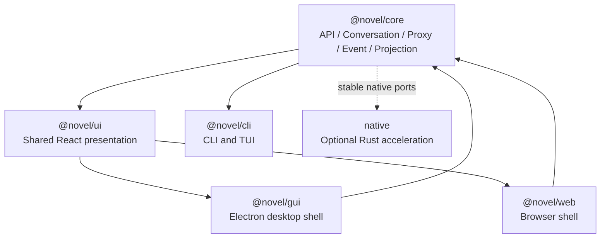
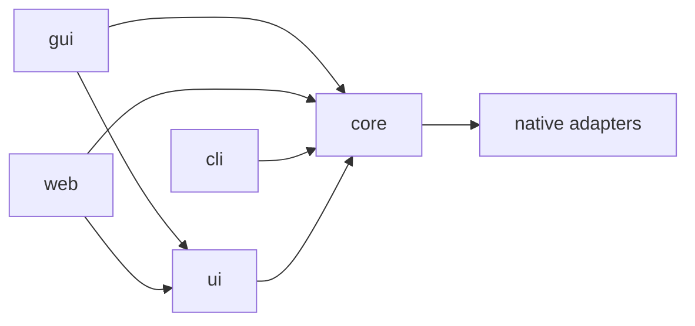
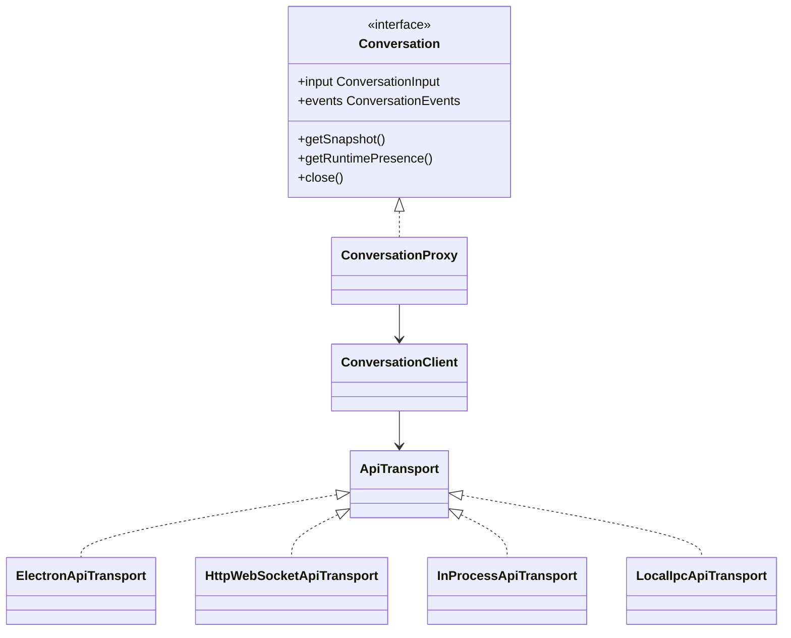
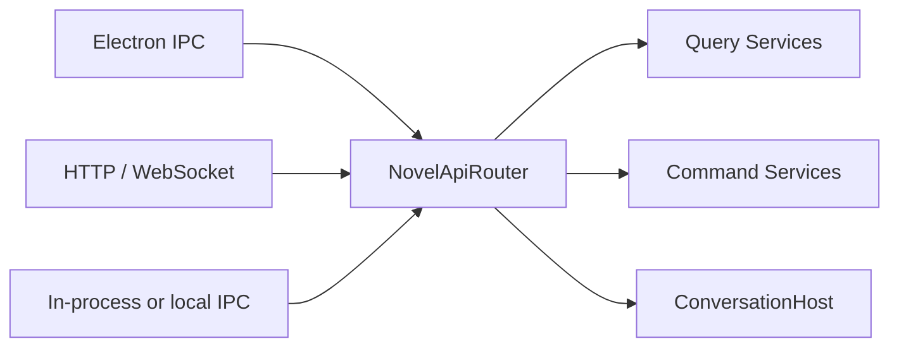
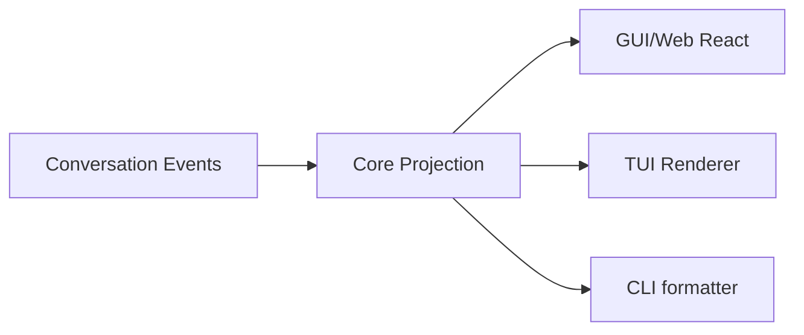

# Novel Client and UI Architecture

## 1. Document Status

This document records the accepted client, shared React UI, desktop GUI, Web, CLI, and TUI architecture.

- It records both the accepted target boundaries and the implemented shared UI, Electron client, and Web client checkpoints.
- It does not authorize out-of-order implementation of Task 6 IPC, Runtime process placement, Tool approval, or deferred Novel-domain behavior.
- `@novel/core` remains the shared headless package used by every client.
- `@novel/ui` is the shared React presentation package used by the desktop GUI and Web application only.
- CLI and TUI reuse Core API, Proxy, Transport, Event, and Projection contracts but do not depend on React DOM components.
- Platform-specific behavior is injected through Transport and platform ports rather than detected inside shared UI code.

## 2. Goals

The client architecture must support:

1. one stable API contract for desktop GUI, Web, CLI, and TUI;
2. one public `Conversation` abstraction regardless of process placement or network transport;
3. shared React pages and components between GUI and Web;
4. desktop-only and Web-only user interfaces without contaminating shared components;
5. platform-neutral Event projections reusable by graphical and terminal clients;
6. transport-specific adapters without duplicating business routing or validation;
7. future local, child-process, daemon, and remote deployments without rewriting presentation code.

## 3. Accepted Layering

```text
core/
ui/
cli/
gui/
web/
native/
docs/
```



Package responsibilities are:

| Package | Responsibility |
| --- | --- |
| `@novel/core` | Headless protocols, Events, API client, Conversation Proxy, Transport contracts, projections, Runtime, Storage, and Tools |
| `@novel/ui` | Shared React application, components, hooks, layouts, themes, and UI extension contracts |
| `@novel/gui` | Electron Main, Preload, desktop Transport, desktop platform ports, packaging, and desktop-only UI |
| `@novel/web` | Browser bootstrap, HTTP/WebSocket Transport, Web platform ports, authentication, and Web-only UI |
| `@novel/cli` | Command-line commands, output formatting, terminal UI, and local or remote Transport composition |

The top-level structure remains direct. The repository does not introduce `apps/` and `packages/` wrapper directories.

## 4. Dependency Rules



The following rules are mandatory:

- `core` never depends on `ui`, `gui`, `web`, or `cli`.
- `ui` depends only on the platform-neutral `@novel/core` root and React-facing dependencies.
- `ui` never imports Electron, Node filesystem APIs, `@novel/core/node`, browser transport URLs, or terminal rendering libraries.
- `gui/src/main` may import `@novel/core/node` and compose local Storage and Host services.
- `gui/src/renderer` may import `@novel/core` and `@novel/ui`, but never `@novel/core/node`.
- `web` never imports Electron or Node-only Core adapters into its browser bundle.
- `cli` and TUI depend on `@novel/core`, not `@novel/ui`.
- platform-specific code may implement Core ports but must not leak platform types through Core public contracts.

## 5. Unified Client API

All clients use one logical application API. A shared API does not require every client to use HTTP.

```ts
interface NovelApiClient {
  readonly conversations: ConversationApi;
  readonly workspaces: WorkspaceApi;
  readonly agents: AgentDefinitionApi;
  readonly providers: ProviderConfigApi;
}
```

The initial Conversation-facing API is built around the existing public abstraction:

```ts
interface ConversationApi {
  open(conversationId: string): Promise<Conversation>;
  create(request: CreateConversationRequest): Promise<Conversation>;
  list(request: ListConversationsRequest): Promise<ConversationSummaryPage>;
}
```

Application code continues to use `Conversation`:

```ts
const conversation = await api.conversations.open(conversationId);

await conversation.input.enqueue(inputEvent);

for await (const event of conversation.events.subscribe({
  start: { afterSequence },
})) {
  projection.apply(event);
}
```

The UI does not know whether the Conversation is local, hosted in another process, or remote.

## 6. Proxy, Client, and Transport



Responsibilities are separated as follows:

- `ConversationProxy` implements the public `Conversation` interface and binds calls to one `conversationId`.
- `ConversationClient` maps typed Conversation operations to serializable API requests and restores validated responses.
- `ApiTransport` carries request, response, subscription, and Event frames without owning business behavior.
- concrete Transports implement Electron IPC, HTTP/WebSocket, in-process, or local IPC delivery.
- the same API router and application services handle requests regardless of Transport.

The target Core layout is:

```text
core/src/
├─ client/
│  ├─ NovelApiClient.ts
│  ├─ DefaultNovelApiClient.ts
│  └─ index.ts
├─ conversation/
│  ├─ proxy/
│  │  ├─ ConversationProxy.ts
│  │  ├─ ProxyConversationInput.ts
│  │  └─ ProxyConversationEvents.ts
│  └─ client/
│     ├─ ConversationClient.ts
│     └─ ApiConversationEventSubscription.ts
├─ transport/
│  ├─ ApiTransport.ts
│  ├─ ApiRequest.ts
│  ├─ ApiResponse.ts
│  ├─ ApiEventFrame.ts
│  ├─ ApiErrorSnapshot.ts
│  └─ ApiSubscription.ts
├─ testing/
│  └─ client/
│     └─ ScriptedApiTransport.ts
└─ projection/
   ├─ conversation/
   ├─ tools/
   ├─ approval/
   └─ subagent/
```

Exact file names and protocol envelopes remain subject to the Task 6 review gate. This document fixes the responsibility boundaries, not unresolved IPC details.

### 6.1 Implemented Client Protocol Checkpoint

The initial client-to-Host protocol checkpoint implements:

- protocol version `1` request, response, Event-frame, error, and subscription contracts;
- `DefaultNovelApiClient`, `ConversationClient`, and a Conversation-bound `ConversationProxy`;
- Snapshot-only wire transfer for Input Events, persisted Conversation Events, Conversation state, Runtime Presence, receipts, and errors;
- stable business-error responses separated from rejected Transport operations;
- Handle-owned subscriptions whose closure never archives, deletes, or stops a durable Conversation;
- a deterministic `ScriptedApiTransport` that forces JSON serialization round trips in contract tests.

The first implemented Conversation operations are:

```text
conversation.input.enqueue
conversation.events.list
conversation.events.subscribe
conversation.snapshot.get
conversation.runtimePresence.get
```

`ConversationApi.open()` is client composition: it reads a Snapshot and creates a Proxy. It is not a remote Runtime activation command.

Event delivery across a remote-capable Transport is at-least-once. Transport adapters preserve durable Event identity and Sequence; projections deduplicate replayed Events and resume with `afterSequence`. Automatic reconnect policy remains adapter-specific and is not implemented by the protocol checkpoint.

`AbortSignal` is Handle-local Transport control and is never serialized into a request payload. Raw class instances, functions, `Error` objects, Node handles, Electron objects, and Runtime process details are forbidden across this boundary.

### 6.2 Implemented Deterministic Mock Checkpoint

The client protocol test layer provides one deterministic `DeterministicMockNovelHost` shared by two protocol adapters:

```text
ConversationProxy
    -> MockElectronApiTransport ---------+
                                        +-> DeterministicMockNovelHost
    -> MockHttpWebSocketApiTransport ----+
```

The Mock Host does not duplicate catch-up and live Event behavior. It composes the established `PublishingConversationJournalService`, `InMemoryConversationEventHub`, and `JournalConversationEventSubscriptionService` over a testing-only deterministic in-memory Journal. Input receipts, duplicate Event identity, Journal Sequence, historical queries, and catch-up-to-live subscriptions therefore retain the existing Core semantics.

Both Mock Transports force request, response, and Event frames through JSON serialization. A shared fault controller can disconnect a Transport or duplicate the next Event delivery. Reconnection creates a new Proxy or subscription with the last applied `afterSequence`; an old disconnected subscription is never revived.

The parameterized contract suite verifies:

- the same client operations over Electron-shaped and HTTP/WebSocket-shaped adapters;
- accepted versus duplicate Input receipts;
- historical replay followed by live Events without a protocol-specific code path;
- at-least-once duplicate delivery with stable Event identity and Sequence;
- disconnect, missed durable Event, reconnect, and cursor-based catch-up;
- GUI-shaped and Web-shaped clients observing the same Conversation through one Host;
- Runtime Presence queries, stable not-found errors, Proxy-owned subscription closure, and log redaction.

These adapters are testing utilities rather than production Electron IPC or network implementations. They simulate protocol placement and failure semantics without pretending to provide authentication, sockets, process isolation, SQLite durability, or Runtime execution.

### 6.3 Implemented Novel Query Protocol Checkpoint

The platform-neutral client protocol now defines nine version-1 read operations
for Novel overview, Outline tree and StoryUnit detail, Character list and
detail, Location list and detail, Manuscript structure, and Manuscript Block
detail. Every request carries an explicit canonical or Conversation-Draft query
scope; no transport payload implicitly selects or merges Draft state.

Responses use immutable JSON-safe snapshots rather than Node adapters, SQLite
handles, domain service instances, or UI components. Outline responses preserve
the validated ordered StoryUnit tree plus derived progress, entity responses
preserve stable profiles and versions, and Manuscript structure responses carry
Publication hierarchy plus text-free Block summaries. Full Block text is
returned only by the Block-detail response.

Strict capture functions reject unknown fields, invalid identities, malformed
tree relations, duplicate entities or blocks, inconsistent progress, invalid
Publication/Manuscript ownership, and non-SHA-256 digests after a JSON round
trip.

The implemented `NovelQueryApiRouter` resolves canonical state directly and
Conversation-Draft state only through the active Draft owned by the requested
Conversation. It delegates to the existing provider-neutral query services and
returns only the strict snapshots above. `WorkspaceApiRouter` mounts those
operations beside Conversation operations behind the same `ApiTransport`, and
the Desktop Workspace composition now uses that unified Router without adding
an Electron-specific Novel channel.

`DefaultNovelApiClient` now exposes the same read contract through grouped
methods under `api.novel`: overview, Outline and StoryUnit, Character list and
detail, Location list and detail, and Manuscript structure and Block detail.
The shared Client validates each request before transport, correlates and
validates every response envelope, converts safe remote failures into
`ApiRemoteError`, and strictly captures every returned Novel snapshot. React
query binding remains the next separate checkpoint.

The shared React shell now performs that binding. Opening a Workspace loads the
canonical Novel Overview, binds the Novel identity into Shell context, and
shows SQLite-derived counts beside the left Outline, Character, Location, and
Manuscript entries. The default Inspector registry queries and renders an
ordered Outline tree with status, StoryUnit detail, Character and Location
indexes and profiles, Publication/Chapter/Block structure, and full Manuscript
Block text only after explicit selection. Loading, empty, unavailable, and safe
error states remain transport-neutral, and retryable failures expose a retry
action; no Novel mutation command is exposed. A non-durable canonical-only
read cache now backs these queries: it is cleared on Workspace switch, pruned
when the canonical Overview revision changes, never reads Draft scope, and is
invalidated only through explicit cache boundaries until lifecycle-Event
wiring lands. A default canonical commit-card projector turns persisted
`novel.commit.completed` events into timeline cards that open the canonical
Outline view; proposal-level and entity-level card targets remain
host-supplied or await OutputEvents carrying canonical entity identity.

## 7. One API Router, Multiple Transports

Transport adapters must not implement separate business behavior.



The router owns common dispatch, protocol validation, stable error conversion, and authorization hand-off. Query, command, Storage, and Runtime behavior remains in Core services.

A shared logical API therefore means:

```text
same method names
same request and response schemas
same Event snapshots
same validation
same error protocol
same application services
```

It does not require:

```text
same physical transport
same process placement
same authentication source
same desktop platform capabilities
```

### 7.1 Implemented Conversation-First Router Checkpoint

The current client integration deliberately routes only the seven stable Conversation operations: Catalog create, Catalog list, input enqueue, Event history, Event subscription, Snapshot query, and Runtime Presence query. Novel query, Draft, ChangeSet, Approval, Commit, publication, and other domain operations are not registered in this Router.

`ConversationApiRouter` is the provider-neutral production routing boundary behind those operations. It validates protocol envelopes and exact payload fields, preserves validated InputEvent snapshots when delegating to `ConversationCommandService`, dispatches read operations to `ConversationQueryService` and `ConversationRuntimePresenceReader`, converts durable subscriptions into versioned `ApiEventFrame` streams, and normalizes failures into stable redacted API errors.

The Router implements the existing `ApiTransport` surface so it can be used directly for in-process composition while later Electron IPC and HTTP/WebSocket server adapters delegate to the same object. It owns only routed subscription lifetimes; it does not close Storage, Runtime, or Host services and does not select process placement, authentication, Workspace policy, or a Provider.

Focused validation composes `DefaultNovelApiClient` over this Router and verifies Conversation create, list, open, user input, history, live delivery, Snapshot and Presence queries, conflict, not-found and malformed-operation errors, shutdown behavior, and log payload redaction. Despite the historical `NovelApiClient` name, this checkpoint exercises no Novel-domain API.

### 7.2 Implemented Node Local Conversation API Application

`NodeConversationApiApplication.open()` is the first production local composition behind the Conversation Router. It opens one SQLite Workspace Store and constructs the Workspace-bound Conversation Catalog service, shared Event Hub, publishing Journal service, catch-up subscription service, storage-backed Query and Command services, Output publisher, Runtime Bootstrap factory, managed Conversation Host, and `ConversationApiRouter` with one shared Event schema registry and Logger.

Runtime placement remains injected through `ConversationRuntimePlacement`; the application therefore does not choose in-process, worker, child-process, daemon, remote, Pi, or future Rust placement. The application exposes only its Conversation `transport`, Workspace Conversation catalog, immutable Workspace location, and idempotent close lifecycle. It owns the Store and every service it creates, while individual Conversation handles and API subscriptions retain their existing local ownership rules.

Shutdown closes Router subscriptions before the Host, then subscription service, Journal service, Event Hub, and SQLite Store. Failures are collected as stable stage names without exposing raw errors, paths, Event payloads, prompts, or configuration. Focused integration verifies API-created Conversation metadata and Agent binding, Catalog listing, durable input, Runtime activation, lifecycle OutputEvents, application-owned shutdown, SQLite reopen, Catalog recovery, process-free history replay, offline Presence after restart, and log redaction.

### 7.3 Conversation Catalog API Boundary

`ConversationApi.create()` accepts an optional caller-supplied Conversation ID, an optional parent Conversation ID, and one required immutable Agent binding identity (`agentType`, `definitionVersion`, and optional `manifestDigest`). When no ID is supplied, the Workspace-bound Catalog service uses an injected `ConversationIdGenerator`; the Node application defaults to a random provider-neutral generator and permits deterministic injection for tests or future host policy.

`ConversationApi.list()` returns frozen `ConversationSnapshot` records rather than live Handles. Each record combines persisted Conversation metadata with its active Agent binding, so GUI, Web, CLI, and TUI can render a Conversation selector without activating a Runtime. Callers explicitly use `open(id)` when they need a bound Conversation Handle.

The public Catalog protocol never accepts `workspaceId`: the Router is already composed for one Workspace, preventing a client from escaping that boundary. Supported list filters mirror the existing Catalog facts (`rootConversationId`, `parentConversationId`, `status`, and bounded `limit`). Catalog creation and listing do not activate a Runtime, append Journal Events, or introduce archive, delete, Agent rebinding, Novel-domain, authentication, or remote Workspace behavior.

## 8. Shared React UI Package

The top-level `ui/` directory is published inside the workspace as `@novel/ui`.

`@novel/ui` means shared React presentation for GUI and Web. It does not mean every client shares React components.

```text
ui/src/
├─ app/
│  ├─ NovelApp.tsx
│  ├─ NovelAppProvider.tsx
│  ├─ NovelAppRouter.tsx
│  └─ NovelUiExtensions.ts
├─ layout/
│  ├─ ApplicationLayout.tsx
│  ├─ Sidebar.tsx
│  ├─ Inspector.tsx
│  └─ StatusBar.tsx
├─ features/
│  ├─ conversation/
│  ├─ novel/
│  ├─ tools/
│  ├─ approval/
│  ├─ workspace/
│  └─ subagent/
├─ hooks/
│  ├─ useConversation.ts
│  ├─ useConversationProjection.ts
│  └─ useRuntimePresence.ts
├─ platform/
│  ├─ FrontendPlatform.ts
│  ├─ PlatformCapabilities.ts
│  ├─ FileSelectionPort.ts
│  ├─ ClipboardPort.ts
│  └─ NotificationPort.ts
├─ theme/
└─ index.ts
```

The package should export both:

1. a complete shared `NovelApp` for standard composition;
2. reusable pages, layouts, features, hooks, and components for platform-specific shells.

This allows a platform to use the standard application or construct a specialized layout without copying feature implementations.

### 8.1 Implemented Shared Application Composition Checkpoint

`@novel/ui` now exports `NovelApp` and `NovelAppProvider` as the stable shared React composition boundary. Applications inject an already composed `NovelApiClient`, one capability-based `FrontendPlatform`, optional bounded `NovelUiExtensions`, and an optional structured Logger. The shared application does not inspect browser globals or select a Transport.

The first platform protocol contains narrow file-selection, clipboard, and notification ports plus explicit capability flags. File selection returns opaque frontend references rather than local filesystem paths. Desktop-only window, updater, tray, native-file, Electron, and Runtime controls remain outside this shared interface.

The extension protocol supports first-party title-bar, route, sidebar-panel, Inspector-panel, settings-section, and command contributions. Arrays are captured immutably and duplicate IDs are rejected. It is not a dynamic plugin loader and does not authorize remote code loading.

`@novel/gui` and `@novel/web` provide thin `DesktopNovelApp` and `WebNovelApp` React entrypoints that forward the same application contract. At this original composition checkpoint neither package implemented a production Transport, Electron Main/Preload, HTTP server, Vite bootstrap, routing, or visual Shell. Focused validation composed both entrypoints with their corresponding deterministic Mock Transport and proved that API, platform, and extension contexts reached the same shared component tree.

Subsequent GUI/Web checkpoints now implement the shared visual Shell, state, Conversation projection, Inspector, structured cards, domain review surfaces, structured composer references, production client-side Electron IPC and HTTP/WebSocket Transports, secure Electron Main/Preload/Renderer boundaries, and Vite browser and Renderer bootstraps. Production business routing and Host composition remain separate from these client-side implementations.

The shared visual Shell uses explicit named Grid rows for the optional title bar, optional inline menu, context bar, and main body. Web uses the inline application menu. Electron uses the native operating-system application menu and removes the duplicate menu row from Renderer content. Hiding either optional row cannot move the main body into the fixed-height context row.

### 8.2 Implemented Workspace and Settings Shell Checkpoint

`@novel/ui` now owns the shared interaction skeleton for selecting one active Workspace per application window. `NovelApp` accepts an optional `WorkspaceController`; the controller exposes immutable current, recent, phase, and redacted error snapshots while delegating platform work through `WorkspacePickerPort` and `WorkspaceSessionPort`. Its asynchronous selection, open, refresh, and close operations are serialized so two UI commands cannot mutate the active Workspace concurrently.

The Workspace value in the persistent context bar is clickable, the empty Conversation area offers a primary `选择 Workspace` action, and the `项目` menu exposes `打开 Workspace…` and `关闭 Workspace`. Web renders that menu inside the page; Electron Main renders it as a native top-level menu and emits only fixed commands through Preload. The chooser presents recent Workspace identities and never exposes a local filesystem path through shared React contracts.

The shared, GUI, and Web roots no longer impose a `760px` minimum page width. Narrow windows keep the full application inside the viewport, reduce the sidebar track without dropping its navigation list, allow the context bar to scroll independently, and proportionally share the remaining area with an open Inspector instead of creating document-level horizontal clipping.

The `编辑` menu owns `设置…`. The shared Settings dialog uses a left category sidebar with a built-in `模型` page plus extension-contributed `settingsSections`. When a platform does not inject durable Configuration, `ApplicationSettingsStore` remains the process-local fallback for non-secret Provider metadata and the currently selected Provider.

`NovelApp` may instead receive an `ApplicationConfigurationClient`. The shared model page then edits Core `ModelConnectionSnapshot` and `ModelProfileSnapshot` records, selects the default Model Profile, and sends credentials only through the client's separate Host credential methods. A Model Connection selects the service provider, endpoint, and credential reference; a Model Profile independently selects the model ID and wire API protocol used by the Provider adapter. This mirrors Pi's separation between a Provider and `Model.api`, including `openai-responses`, `openai-completions`, and `anthropic-messages`.

Provider and API protocol are therefore separate selectors. Selecting a Provider chooses a recommended protocol, while the user may explicitly override it for compatible or custom endpoints. Existing Application Configuration snapshots that predate the Profile API field remain loadable: Core derives the initial protocol from the referenced Connection and emits the explicit protocol on the next snapshot. API Keys remain ephemeral form values and are never written into `ApplicationConfigurationSnapshot`, application UI stores, Conversation Events, or logs.

Electron implements this port through its fixed Configuration Preload bridge. Non-secret Configuration is persisted by Main, while credential references are resolved through the Main-owned Credential Store. Desktop V1 deliberately stores the corresponding secret as a permission-restricted plaintext record beneath global `NOVEL_HOME/credentials`; it never returns the value to Renderer or places it in Configuration, Events, Runtime IPC, diagnostics, or logs. Web and Mock compositions may continue using the process-local fallback until they inject their own `ApplicationConfigurationClient`. Binding the selected default Model Profile into active or resumed Conversations remains separate Runtime Host integration work.

Sidebar presentation is no longer configured through an Appearance settings page. Web places the compact toggle at the right edge of its inline menu, while Electron places it at the right edge of the context bar because the application menu is native. Both use the same shared command and state contract.

W1 deliberately does not add Electron, Node filesystem, SQLite, Core Workspace API, or Novel API behavior. The default shared/Web composition uses unavailable Workspace ports and reports a safe user-facing error when local selection is requested. Production Workspace switching requires a stable application-level Host boundary above the Workspace-bound Conversation router:

```text
Renderer
    → ApplicationApiRouter
    → WorkspaceSessionManager
    → active NodeConversationApiApplication
    → active ConversationApiRouter
```

Focused validation uses injected deterministic Mock Workspace ports to prove the empty state, recent list, open and close transitions, clickable menus, Settings extension rendering, immediate sidebar updates, immutable snapshots, strictly serialized Workspace operations, and coexistence of host-provided overlays with built-in dialogs.

## 9. Platform Shells and UI Extensions

Shared UI must not branch on global platform detection such as `isElectron` or inspect `window.novelDesktop` directly.

Platform-specific behavior is supplied through explicit composition:

```ts
interface NovelAppProps {
  readonly api: NovelApiClient;
  readonly platform: FrontendPlatform;
  readonly extensions?: NovelUiExtensions;
}
```

Initial extension categories are:

```ts
interface NovelUiExtensions {
  readonly titleBar?: React.ComponentType;
  readonly routes?: readonly NovelUiRoute[];
  readonly sidebarPanels?: readonly NovelUiPanel[];
  readonly inspectorPanels?: readonly NovelUiPanel[];
  readonly settingsSections?: readonly NovelSettingsSection[];
  readonly commands?: readonly NovelUiCommand[];
}
```

This is a composition contract, not an unrestricted plugin system. Dynamic third-party UI loading, remote code, extension trust, and plugin lifecycle remain deferred.

## 10. Desktop GUI Composition

The GUI uses Electron as the desktop shell and React as the Renderer presentation layer.

```text
gui/src/
├─ main/
│  ├─ main.ts
│  ├─ DesktopApplication.ts
│  ├─ DesktopWindowManager.ts
│  ├─ core/
│  │  └─ createDesktopCore.ts
│  └─ ipc/
│     ├─ DesktopIpcRouter.ts
│     ├─ ConversationIpcHandler.ts
│     └─ WorkspaceIpcHandler.ts
├─ preload/
│  ├─ preload.ts
│  ├─ NovelDesktopApi.ts
│  └─ exposeDesktopApi.ts
├─ renderer/
│  ├─ DesktopNovelApp.tsx
│  ├─ ElectronFrontendPlatform.ts
│  ├─ transport/
│  │  └─ ElectronApiTransport.ts
│  ├─ extensions/
│  │  ├─ createDesktopUiExtensions.ts
│  │  ├─ DesktopRoutes.tsx
│  │  └─ DesktopCommands.ts
│  └─ features/
│     ├─ desktop-titlebar/
│     ├─ local-runtime/
│     ├─ native-file-browser/
│     ├─ system-tray/
│     ├─ application-update/
│     └─ desktop-settings/
└─ shared/
   └─ desktop IPC schemas
```

Desktop-only UI belongs in `gui/src/renderer/features/` and is contributed through the shared extension points. Examples include native window controls, local Runtime diagnostics, application updates, system tray settings, and native file navigation.

The GUI Renderer uses only the Preload-exposed desktop API. It does not receive unrestricted Electron IPC, Node, filesystem, Runtime, Tool, or credential access.

### 10.1 Implemented Executable Desktop Entry

`@novel/gui` now ships a real Electron Main entry at `dist/main/main.js`. `pnpm gui` performs the complete build and launches the packaged-style static Renderer through `BrowserWindow.loadFile()`, while the existing bundled CommonJS Preload remains the only bridge into the sandboxed Renderer.

The executable entry resolves Renderer and Preload artifacts relative to its compiled Main module rather than the caller's current directory. Until a Workspace Host is activated, `DesktopBootstrapApiTransport` returns a stable redacted `DESKTOP_WORKSPACE_NOT_OPEN` response instead of fabricating Conversation data or silently binding a test Host. Workspace selection and the application-level active-Workspace Router remain the next desktop boundary.

The Main entry performs idempotent application cleanup on quit and emits only a structured startup failure event without raw Electron errors or local paths. Focused validation proves packaged asset resolution, the unavailable bootstrap response, preserved BrowserWindow security options, package entry metadata, and the root launch command.

### 10.2 Implemented Native Workspace Selection

The real Electron composition now contributes an optional nested `workspaces` Preload capability with four fixed operations: select a directory, list process-local recent sessions, open one opaque reference, and close the current session. The Renderer adapts that capability into the existing shared `WorkspaceController`; Web and older test bridges may omit it and retain the safe unavailable behavior.

Electron Main owns the native directory dialog, absolute path, one-time selection token, sender ownership, and `NodeWorkspaceStoreLocator`. Renderer receives only `{ referenceId, label }` before open and `{ id, label }` after open. The selected directory path, Store root, database path, Workspace index contents, and raw Main errors never cross Preload or enter UI logs.

Opening a selected directory resolves or creates the persistent workdir-to-Workspace Store mapping, updates the current Workspace for that window sender, and allows the shared Shell to transition out of its Workspace empty state. Recent sessions are process-local in this checkpoint; durable recent ordering and active `NodeConversationApiApplication` routing remain separate application-Host work.

### 10.3 Implemented Desktop Novel Workspace Bootstrap

The Electron Main Workspace application now opens both the Conversation SQLite
application and the Workspace-owned Novel Host before returning a ready
Workspace session. Database open, schema migration, exact Workspace/Novel
identity validation, Draft Store open, and the accepted five startup recovery
phases occur after selection confirmation and before Renderer may use the active
Workspace transport.

Novel recovery publishes lifecycle Outbox records through the existing
Conversation OutputEvent journal boundary. Renderer still receives only the
opaque Workspace session and generic `ApiTransport`; SQLite handles, Store
paths, Novel Node adapters, and raw startup failures remain Main-only.

The logical Runtime and Novel SQLite boundaries remain separate. The currently
implemented Runtime path still resolves through `workspace.databasePath` to
`novel.db`, while the Novel domain uses `novel.sqlite`; renaming Runtime storage
is a separate migration rather than part of GUI integration.

## 11. Web Composition

```text
web/src/
├─ WebNovelApp.tsx
├─ WebFrontendPlatform.ts
├─ transport/
│  ├─ HttpApiTransport.ts
│  └─ WebSocketEventTransport.ts
├─ extensions/
│  ├─ createWebUiExtensions.ts
│  └─ WebRoutes.tsx
└─ features/
   ├─ authentication/
   ├─ account/
   ├─ sharing/
   ├─ browser-upload/
   └─ remote-server/
```

Web-only UI belongs in `web/src/features/`. Examples include authentication, account management, remote Workspace selection, browser uploads, sharing, and server connectivity.

GUI and Web both render `@novel/ui`. Their entrypoints differ only in platform composition, Transport selection, and extension contributions.

```ts
// GUI
<NovelApp
  api={desktopApiClient}
  platform={electronPlatform}
  extensions={desktopUiExtensions}
/>

// Web
<NovelApp
  api={webApiClient}
  platform={webPlatform}
  extensions={webUiExtensions}
/>
```

## 12. Platform Capability Ports

Capabilities that exist on more than one platform use narrow shared ports:

```ts
interface FrontendPlatform {
  readonly capabilities: PlatformCapabilities;
  readonly files: FileSelectionPort;
  readonly clipboard: ClipboardPort;
  readonly notifications: NotificationPort;
}
```

Electron and Web provide separate implementations. Shared React components depend on the port, not the implementation.

Desktop-only capabilities remain outside the shared `FrontendPlatform` when no meaningful Web equivalent exists:

```ts
interface DesktopPlatformApi {
  readonly window: DesktopWindowPort;
  readonly updater: DesktopUpdaterPort;
  readonly systemTray: DesktopSystemTrayPort;
  readonly nativeFiles: DesktopNativeFilePort;
}
```

Desktop-only components receive this API through desktop composition rather than expanding the common interface with unsupported operations.

## 13. Platform-neutral Event Projections

Journal Events remain the durable display source of truth. React State, terminal state, and UI stores are projections rather than independent histories.

Reusable projection code belongs in `@novel/core`, not `@novel/ui`:

```text
core/src/projection/
├─ conversation/
│  ├─ ConversationProjection.ts
│  ├─ ConversationEventReducer.ts
│  ├─ ConversationTimelineItem.ts
│  └─ AssistantDraftProjection.ts
├─ tools/
│  └─ ToolTraceProjection.ts
├─ approval/
│  └─ ApprovalProjection.ts
└─ subagent/
   └─ ConversationTreeProjection.ts
```

Projection code may contain immutable state, reducers, sequence handling, Event interpretation, and view-neutral status models. It must not contain React, JSX, DOM nodes, CSS, Electron types, terminal escape codes, or rendered prompt and Tool contents that violate redaction boundaries.

Different clients render the same projection:



### 13.1 Implemented Conversation Projection Checkpoint

`ConversationProjectionStore` now provides one immutable, view-neutral Conversation state for all clients. It applies persisted Events in strict Journal Sequence order, rejects gaps and identity conflicts, and treats a byte-equivalent replay of an already applied Sequence as a duplicate without incrementing revision or notifying subscribers.

The initial typed projections include:

- User Message timeline entries;
- Assistant streaming drafts, ordered deltas, terminal completion, failure, and cancellation;
- logical Runtime Presence;
- current Run and Turn lifecycle state;
- requested and resolved Tool Approval summaries;
- safe Event descriptors for every persisted Event, including currently unknown Event types.

Unknown Events do not expose arbitrary payloads through the generic descriptor. Typed projections expose only payload fields explicitly required by their view model. Logs contain Event identity, type, direction, Sequence, revision, and error names, but never projected message text or Approval descriptions.

A new projection rebuild starts from Sequence `1`. Reconnection reuses the existing Store and subscribes with its `lastAppliedSequence`; an independent tail-only Store is not treated as a complete Conversation projection. The Store owns no durable state, network lifecycle, automatic reconnect loop, React state, or rendering behavior.

### 13.2 Implemented Conversation Projection Controller Checkpoint

`ConversationProjectionController` now owns the client-side lifecycle that feeds one opened `Conversation` into one `ConversationProjectionStore`. Its immutable snapshot exposes the logical connection state, projected Sequence, current Runtime Presence, and a redacted stable failure descriptor without exposing Transport implementations or Event payloads.

The accepted startup and recovery sequence is:

1. query the Conversation snapshot and logical Runtime Presence;
2. replay paged Journal history through the observed high watermark;
3. subscribe after the Store's current `lastAppliedSequence`;
4. query the Conversation snapshot again after subscription creation;
5. drain the subscription through the second high watermark to close the replay/follow race window;
6. enter `live` and continue one background Event pump;
7. enter `disconnected` when the Transport reports a provider-neutral disconnect;
8. reconnect only through an explicit `resume()`, reusing the existing Store and its Sequence cursor.

The Controller does not run an infinite retry loop and does not own the opened `Conversation` handle. `stop()` is idempotent, aborts and closes only the Controller-owned subscription, waits for its active connection and pump work to settle, detaches the Store listener, and prevents later restart. A non-disconnect failure enters `failed`; the public error snapshot contains only a stable code, retryability, and category.

Focused contract validation runs against both deterministic Electron-style and HTTP/WebSocket-style Mock Transports. It covers durable history replay, live following, duplicate delivery suppression, logical Runtime Presence updates, offline Event persistence, explicit catch-up after reconnect, immutable listener snapshots, idempotent stopping, and log payload redaction.

### 13.3 Implemented Shared React Projection Binding Checkpoint

The initial `@novel/ui` package now provides React and TypeScript bindings without introducing a desktop shell, browser server, page router, editor, or platform-specific Transport. `NovelApiProvider` receives an already composed `NovelApiClient`; shared code never imports Electron, chooses an HTTP endpoint, or detects its platform through globals.

`ConversationProjectionBinding` owns the UI consumer's opened Conversation handle, Core Projection Store, and Core Projection Controller. It opens and starts them asynchronously, forwards immutable Controller and Projection snapshots, delegates explicit `resume()`, and closes only its owned handle when stopped. Event interpretation, replay ordering, duplicate suppression, and Transport failures remain in Core rather than being reimplemented in React.

`useConversationProjection(conversationId)` creates one Binding for the current Provider and Conversation identity, subscribes through React `useSyncExternalStore`, starts it after mount, and stops it on unmount or identity replacement. Its result exposes the immutable Binding snapshot plus explicit `resume()`; it does not create an automatic reconnect loop.

Focused React validation mounts the same Provider and Hook against deterministic Electron-style and HTTP/WebSocket-style Mock Transports. It verifies durable replay, live updates, logical disconnect state, explicit resume with offline catch-up, immutable snapshots, unmount cleanup, continued usability of separately owned Conversation handles, and log payload redaction.

## 14. CLI and TUI Integration

CLI and TUI are first-class clients in the same API system.

They reuse:

- `NovelApiClient`;
- `ConversationProxy`;
- InputEvent and OutputEvent snapshots;
- Event subscription and replay;
- platform-neutral projections;
- stable error and protocol schemas;
- local IPC or HTTP Transport implementations.

They do not reuse:

- React DOM components;
- CSS and browser layouts;
- Electron-specific platform ports;
- Web authentication components.

The initial TUI remains inside the CLI package:

```text
cli/src/
├─ main.ts
├─ client/
│  └─ createCliApiClient.ts
├─ commands/
│  ├─ conversation-send.ts
│  ├─ conversation-events.ts
│  ├─ conversation-follow.ts
│  ├─ conversation-stop.ts
│  └─ workspace-list.ts
├─ output/
│  ├─ PrettyCliOutput.ts
│  ├─ JsonCliOutput.ts
│  └─ JsonlCliOutput.ts
├─ transport/
└─ tui/
   ├─ startTui.ts
   ├─ TuiApplication.ts
   ├─ TuiConversationController.ts
   ├─ TuiRenderer.ts
   └─ screens/
```

The same executable may expose both command and interactive modes:

```text
novel conversation send ...
novel conversation events ...
novel conversation follow ...
novel tui
```

A separate top-level `tui/` package is introduced only if the terminal application later requires an independent release lifecycle or materially different dependency graph.

## 15. Client Transport Matrix

| Client | Initial Transport | Optional Transport |
| --- | --- | --- |
| Desktop GUI | `ElectronApiTransport` | `HttpWebSocketApiTransport` |
| Web | `HttpApiTransport` plus `WebSocketEventTransport` | future streaming alternatives |
| CLI | `InProcessApiTransport` or `LocalIpcApiTransport` | `HttpApiTransport` |
| TUI | `LocalIpcApiTransport` | `HttpWebSocketApiTransport` |

All Transports implement the same logical API protocol. A future standalone Runtime or application server may allow GUI, Web, CLI, and TUI to connect to the same Host, but mandatory HTTP transport is not part of the initial decision.

## 16. Frontend and Runtime IPC Separation

Two communication boundaries must remain distinct.

### 16.1 Client-to-Host API Transport

```text
GUI Renderer -> Electron Main
Web Browser  -> Web Server
CLI/TUI      -> local Host or server
```

This boundary implements `NovelApiClient` and `ConversationProxy` operations.

### 16.2 Host-to-Runtime Transport

```text
ConversationHost -> ConversationRuntime process
```

This boundary carries Runtime bootstrap, InputEvent dispatch, cancellation, heartbeat, append acknowledgement, and recovery messages.

The two protocols may share envelope primitives, but they must not share one semantic Transport interface. Client access and Runtime supervision have different authority, lifecycle, trust, and recovery requirements.

## 17. Desktop Packaging

`gui/` is the desktop packaging entrypoint. `ui/` is not shipped as a separate application.

```text
@novel/ui source
        -> GUI Renderer bundle

@novel/core and @novel/core/node
        -> Electron Main or packaged Runtime resources

@novel/gui
        -> desktop application package
```

The resulting desktop application contains the Electron shell, React Renderer bundle, Preload bridge, Core code, required Runtime entrypoints, prompt and Tool resources, and platform-specific native artifacts when present.

User Workspace data, Journal databases, Runtime Message projections, credentials, and configuration are created in external application data locations and are never bundled into the application artifact.

The Web build uses the same `@novel/ui` source with a different bootstrap and Transport, producing browser assets rather than an Electron application.

## 18. Accepted Naming

The accepted names are:

```text
directory: ui/
package:   @novel/ui
```

The name is appropriate because the package is narrowly defined as the shared React UI for GUI and Web. It is not the location for all shared client code.

Shared headless code remains in:

```text
@novel/core
```

Platform packages remain:

```text
@novel/gui
@novel/web
@novel/cli
```

## 19. Accepted Decisions

1. GUI and Web share a top-level `ui/` package named `@novel/ui`.
2. `@novel/ui` contains React presentation only and is not used by CLI or TUI.
3. GUI, Web, CLI, and TUI share `@novel/core` API, Conversation Proxy, Transport contracts, Event protocol, and platform-neutral projections.
4. GUI and Web may add platform-specific UI through Shell composition, routes, panels, commands, settings sections, and narrow platform ports.
5. Shared UI never detects Electron or Web through global checks.
6. Desktop-only UI stays under `gui/src/renderer/features/`.
7. Web-only UI stays under `web/src/features/`.
8. CLI and TUI initially remain in one `cli/` package, with TUI under `cli/src/tui/`.
9. All client Transports enter one logical API router and shared Core application services.
10. A unified logical API does not require mandatory HTTP transport.
11. Client-to-Host Transport remains separate from Host-to-Runtime IPC.
12. GUI packaging includes the shared UI and required Core resources in one desktop application artifact.
13. A Workspace represents one selected novel project root, while shared UI receives only opaque references and presentation-safe identities.
14. Each application window has at most one active Workspace; future multi-Workspace desktop behavior uses multiple windows rather than multiple active roots inside one Shell Store.
15. Workspace selection and session activation are separate injected ports in shared UI; native directory selection remains a desktop-host responsibility.
16. Settings is an Edit-menu dialog, not a fifth top-level menu, and its left category sidebar combines the built-in Model Provider page with bounded extension `settingsSections`.
17. Shared Provider settings contain only non-secret connection metadata and one current selection; credentials and Runtime activation remain Host-owned.
18. Project-sidebar expansion uses one compact upper-right top-menu control rather than an Appearance settings field.

## 20. Deferred Decisions

The following choices remain deferred to their applicable implementation review gates:

1. Conversation create/list and non-Conversation `NovelApiClient` modules;
2. future protocol negotiation beyond the implemented client-to-Host version `1`, plus Host-to-Runtime Task 6 framing;
3. whether the first GUI Runtime is in-process, an Electron Utility Process, or a standard child process;
4. whether a standalone local or remote Novel server is shipped in the first product release;
5. authentication and trusted actor derivation for HTTP, WebSocket, and local IPC clients;
6. browser event transport details, reconnect policy, and subscription backpressure;
7. desktop packaging, signing, update, and native artifact strategy;
8. concrete React component, styling, editor, and terminal rendering libraries;
9. dynamic third-party UI extension and plugin support;
10. Novel-domain editor, document projection, revision, and change-approval contracts.
11. production Workspace API envelopes, application-level routing, recent-Workspace persistence, and Workspace rebinding behavior;
12. durable application settings storage and the final settings schema.
