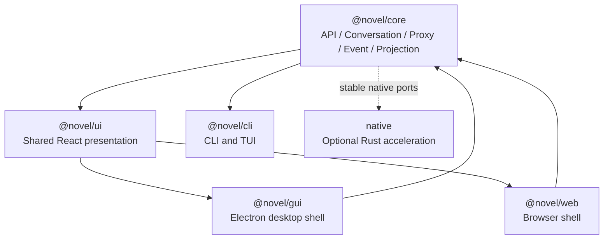
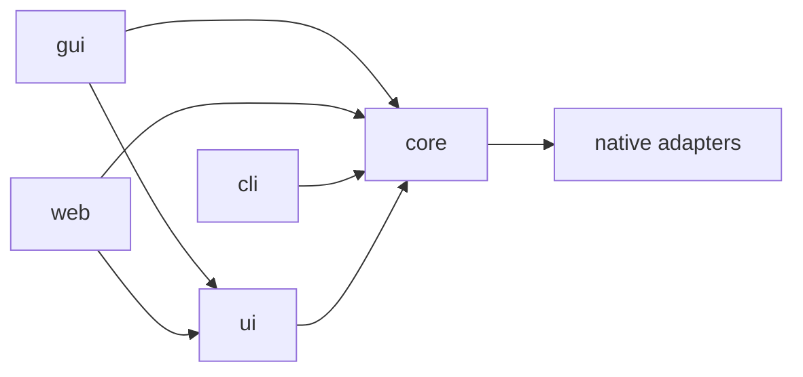
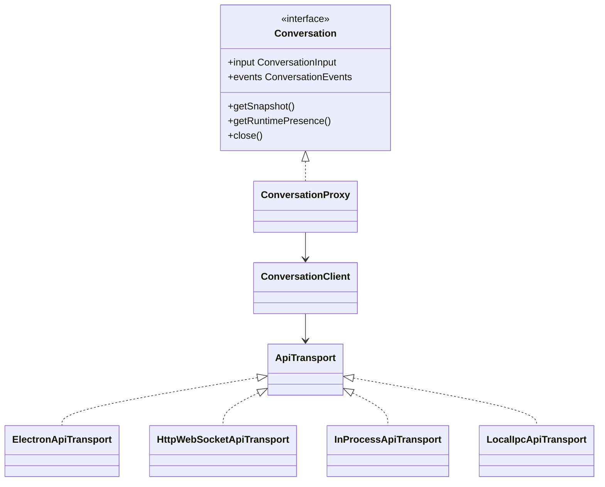
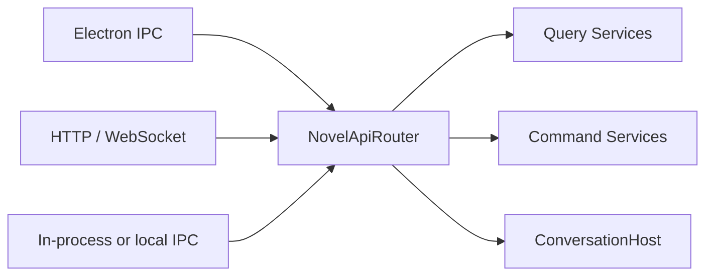
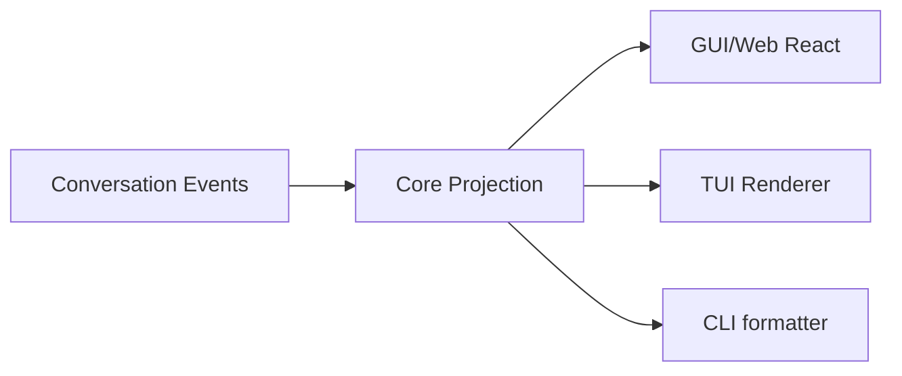

# Novel Client and UI Architecture

## 1. Document Status

This document records the accepted client, shared React UI, desktop GUI, Web, CLI, and TUI architecture.

- It defines target boundaries and naming rather than claiming that the packages and adapters already exist.
- It does not authorize out-of-order implementation of Task 6 IPC, Runtime process placement, Tool approval, or deferred Novel-domain behavior.
- `@novel/core` remains the shared headless package used by every client.
- `@novel/ui` is the shared React presentation package used by the desktop GUI and Web application only.
- CLI and TUI reuse Core API, Proxy, Transport, Event, and Projection contracts but do not depend on React DOM components.
- Platform-specific behavior is injected through Transport and platform ports rather than detected inside shared UI code.

## 2. Goals

The client architecture must support:

1. one stable API contract for desktop GUI, Web, CLI, and TUI;
2. one public `Conversation` abstraction regardless of process placement or network transport;
3. shared React pages and components between GUI and Web;
4. desktop-only and Web-only user interfaces without contaminating shared components;
5. platform-neutral Event projections reusable by graphical and terminal clients;
6. transport-specific adapters without duplicating business routing or validation;
7. future local, child-process, daemon, and remote deployments without rewriting presentation code.

## 3. Accepted Layering

```text
core/
ui/
cli/
gui/
web/
native/
docs/
```



Package responsibilities are:

| Package | Responsibility |
| --- | --- |
| `@novel/core` | Headless protocols, Events, API client, Conversation Proxy, Transport contracts, projections, Runtime, Storage, and Tools |
| `@novel/ui` | Shared React application, components, hooks, layouts, themes, and UI extension contracts |
| `@novel/gui` | Electron Main, Preload, desktop Transport, desktop platform ports, packaging, and desktop-only UI |
| `@novel/web` | Browser bootstrap, HTTP/WebSocket Transport, Web platform ports, authentication, and Web-only UI |
| `@novel/cli` | Command-line commands, output formatting, terminal UI, and local or remote Transport composition |

The top-level structure remains direct. The repository does not introduce `apps/` and `packages/` wrapper directories.

## 4. Dependency Rules



The following rules are mandatory:

- `core` never depends on `ui`, `gui`, `web`, or `cli`.
- `ui` depends only on the platform-neutral `@novel/core` root and React-facing dependencies.
- `ui` never imports Electron, Node filesystem APIs, `@novel/core/node`, browser transport URLs, or terminal rendering libraries.
- `gui/src/main` may import `@novel/core/node` and compose local Storage and Host services.
- `gui/src/renderer` may import `@novel/core` and `@novel/ui`, but never `@novel/core/node`.
- `web` never imports Electron or Node-only Core adapters into its browser bundle.
- `cli` and TUI depend on `@novel/core`, not `@novel/ui`.
- platform-specific code may implement Core ports but must not leak platform types through Core public contracts.

## 5. Unified Client API

All clients use one logical application API. A shared API does not require every client to use HTTP.

```ts
interface NovelApiClient {
  readonly conversations: ConversationApi;
  readonly workspaces: WorkspaceApi;
  readonly agents: AgentDefinitionApi;
  readonly providers: ProviderConfigApi;
}
```

The initial Conversation-facing API is built around the existing public abstraction:

```ts
interface ConversationApi {
  open(conversationId: string): Promise<Conversation>;
  create(request: CreateConversationRequest): Promise<Conversation>;
  list(request: ListConversationsRequest): Promise<ConversationSummaryPage>;
}
```

Application code continues to use `Conversation`:

```ts
const conversation = await api.conversations.open(conversationId);

await conversation.input.enqueue(inputEvent);

for await (const event of conversation.events.subscribe({
  start: { afterSequence },
})) {
  projection.apply(event);
}
```

The UI does not know whether the Conversation is local, hosted in another process, or remote.

## 6. Proxy, Client, and Transport



Responsibilities are separated as follows:

- `ConversationProxy` implements the public `Conversation` interface and binds calls to one `conversationId`.
- `ConversationClient` maps typed Conversation operations to serializable API requests and restores validated responses.
- `ApiTransport` carries request, response, subscription, and Event frames without owning business behavior.
- concrete Transports implement Electron IPC, HTTP/WebSocket, in-process, or local IPC delivery.
- the same API router and application services handle requests regardless of Transport.

The target Core layout is:

```text
core/src/
├─ client/
│  ├─ NovelApiClient.ts
│  ├─ DefaultNovelApiClient.ts
│  └─ index.ts
├─ conversation/
│  ├─ proxy/
│  │  ├─ ConversationProxy.ts
│  │  ├─ ProxyConversationInput.ts
│  │  └─ ProxyConversationEvents.ts
│  └─ client/
│     ├─ ConversationClient.ts
│     └─ ApiConversationEventSubscription.ts
├─ transport/
│  ├─ ApiTransport.ts
│  ├─ ApiRequest.ts
│  ├─ ApiResponse.ts
│  ├─ ApiEventFrame.ts
│  ├─ ApiErrorSnapshot.ts
│  └─ ApiSubscription.ts
├─ testing/
│  └─ client/
│     └─ ScriptedApiTransport.ts
└─ projection/
   ├─ conversation/
   ├─ tools/
   ├─ approval/
   └─ subagent/
```

Exact file names and protocol envelopes remain subject to the Task 6 review gate. This document fixes the responsibility boundaries, not unresolved IPC details.

### 6.1 Implemented Client Protocol Checkpoint

The initial client-to-Host protocol checkpoint implements:

- protocol version `1` request, response, Event-frame, error, and subscription contracts;
- `DefaultNovelApiClient`, `ConversationClient`, and a Conversation-bound `ConversationProxy`;
- Snapshot-only wire transfer for Input Events, persisted Conversation Events, Conversation state, Runtime Presence, receipts, and errors;
- stable business-error responses separated from rejected Transport operations;
- Handle-owned subscriptions whose closure never archives, deletes, or stops a durable Conversation;
- a deterministic `ScriptedApiTransport` that forces JSON serialization round trips in contract tests.

The first implemented Conversation operations are:

```text
conversation.input.enqueue
conversation.events.list
conversation.events.subscribe
conversation.snapshot.get
conversation.runtimePresence.get
```

`ConversationApi.open()` is client composition: it reads a Snapshot and creates a Proxy. It is not a remote Runtime activation command.

Event delivery across a remote-capable Transport is at-least-once. Transport adapters preserve durable Event identity and Sequence; projections deduplicate replayed Events and resume with `afterSequence`. Automatic reconnect policy remains adapter-specific and is not implemented by the protocol checkpoint.

`AbortSignal` is Handle-local Transport control and is never serialized into a request payload. Raw class instances, functions, `Error` objects, Node handles, Electron objects, and Runtime process details are forbidden across this boundary.

## 7. One API Router, Multiple Transports

Transport adapters must not implement separate business behavior.



The router owns common dispatch, protocol validation, stable error conversion, and authorization hand-off. Query, command, Storage, and Runtime behavior remains in Core services.

A shared logical API therefore means:

```text
same method names
same request and response schemas
same Event snapshots
same validation
same error protocol
same application services
```

It does not require:

```text
same physical transport
same process placement
same authentication source
same desktop platform capabilities
```

## 8. Shared React UI Package

The top-level `ui/` directory is published inside the workspace as `@novel/ui`.

`@novel/ui` means shared React presentation for GUI and Web. It does not mean every client shares React components.

```text
ui/src/
├─ app/
│  ├─ NovelApp.tsx
│  ├─ NovelAppProvider.tsx
│  ├─ NovelAppRouter.tsx
│  └─ NovelUiExtensions.ts
├─ layout/
│  ├─ ApplicationLayout.tsx
│  ├─ Sidebar.tsx
│  ├─ Inspector.tsx
│  └─ StatusBar.tsx
├─ features/
│  ├─ conversation/
│  ├─ novel/
│  ├─ tools/
│  ├─ approval/
│  ├─ workspace/
│  └─ subagent/
├─ hooks/
│  ├─ useConversation.ts
│  ├─ useConversationProjection.ts
│  └─ useRuntimePresence.ts
├─ platform/
│  ├─ FrontendPlatform.ts
│  ├─ PlatformCapabilities.ts
│  ├─ FileSelectionPort.ts
│  ├─ ClipboardPort.ts
│  └─ NotificationPort.ts
├─ theme/
└─ index.ts
```

The package should export both:

1. a complete shared `NovelApp` for standard composition;
2. reusable pages, layouts, features, hooks, and components for platform-specific shells.

This allows a platform to use the standard application or construct a specialized layout without copying feature implementations.

## 9. Platform Shells and UI Extensions

Shared UI must not branch on global platform detection such as `isElectron` or inspect `window.novelDesktop` directly.

Platform-specific behavior is supplied through explicit composition:

```ts
interface NovelAppProps {
  readonly api: NovelApiClient;
  readonly platform: FrontendPlatform;
  readonly extensions?: NovelUiExtensions;
}
```

Initial extension categories are:

```ts
interface NovelUiExtensions {
  readonly titleBar?: React.ComponentType;
  readonly routes?: readonly NovelUiRoute[];
  readonly sidebarPanels?: readonly NovelUiPanel[];
  readonly inspectorPanels?: readonly NovelUiPanel[];
  readonly settingsSections?: readonly NovelSettingsSection[];
  readonly commands?: readonly NovelUiCommand[];
}
```

This is a composition contract, not an unrestricted plugin system. Dynamic third-party UI loading, remote code, extension trust, and plugin lifecycle remain deferred.

## 10. Desktop GUI Composition

The GUI uses Electron as the desktop shell and React as the Renderer presentation layer.

```text
gui/src/
├─ main/
│  ├─ main.ts
│  ├─ DesktopApplication.ts
│  ├─ DesktopWindowManager.ts
│  ├─ core/
│  │  └─ createDesktopCore.ts
│  └─ ipc/
│     ├─ DesktopIpcRouter.ts
│     ├─ ConversationIpcHandler.ts
│     └─ WorkspaceIpcHandler.ts
├─ preload/
│  ├─ preload.ts
│  ├─ NovelDesktopApi.ts
│  └─ exposeDesktopApi.ts
├─ renderer/
│  ├─ DesktopNovelApp.tsx
│  ├─ ElectronFrontendPlatform.ts
│  ├─ transport/
│  │  └─ ElectronApiTransport.ts
│  ├─ extensions/
│  │  ├─ createDesktopUiExtensions.ts
│  │  ├─ DesktopRoutes.tsx
│  │  └─ DesktopCommands.ts
│  └─ features/
│     ├─ desktop-titlebar/
│     ├─ local-runtime/
│     ├─ native-file-browser/
│     ├─ system-tray/
│     ├─ application-update/
│     └─ desktop-settings/
└─ shared/
   └─ desktop IPC schemas
```

Desktop-only UI belongs in `gui/src/renderer/features/` and is contributed through the shared extension points. Examples include native window controls, local Runtime diagnostics, application updates, system tray settings, and native file navigation.

The GUI Renderer uses only the Preload-exposed desktop API. It does not receive unrestricted Electron IPC, Node, filesystem, Runtime, Tool, or credential access.

## 11. Web Composition

```text
web/src/
├─ WebNovelApp.tsx
├─ WebFrontendPlatform.ts
├─ transport/
│  ├─ HttpApiTransport.ts
│  └─ WebSocketEventTransport.ts
├─ extensions/
│  ├─ createWebUiExtensions.ts
│  └─ WebRoutes.tsx
└─ features/
   ├─ authentication/
   ├─ account/
   ├─ sharing/
   ├─ browser-upload/
   └─ remote-server/
```

Web-only UI belongs in `web/src/features/`. Examples include authentication, account management, remote Workspace selection, browser uploads, sharing, and server connectivity.

GUI and Web both render `@novel/ui`. Their entrypoints differ only in platform composition, Transport selection, and extension contributions.

```ts
// GUI
<NovelApp
  api={desktopApiClient}
  platform={electronPlatform}
  extensions={desktopUiExtensions}
/>

// Web
<NovelApp
  api={webApiClient}
  platform={webPlatform}
  extensions={webUiExtensions}
/>
```

## 12. Platform Capability Ports

Capabilities that exist on more than one platform use narrow shared ports:

```ts
interface FrontendPlatform {
  readonly capabilities: PlatformCapabilities;
  readonly files: FileSelectionPort;
  readonly clipboard: ClipboardPort;
  readonly notifications: NotificationPort;
}
```

Electron and Web provide separate implementations. Shared React components depend on the port, not the implementation.

Desktop-only capabilities remain outside the shared `FrontendPlatform` when no meaningful Web equivalent exists:

```ts
interface DesktopPlatformApi {
  readonly window: DesktopWindowPort;
  readonly updater: DesktopUpdaterPort;
  readonly systemTray: DesktopSystemTrayPort;
  readonly nativeFiles: DesktopNativeFilePort;
}
```

Desktop-only components receive this API through desktop composition rather than expanding the common interface with unsupported operations.

## 13. Platform-neutral Event Projections

Journal Events remain the durable display source of truth. React State, terminal state, and UI stores are projections rather than independent histories.

Reusable projection code belongs in `@novel/core`, not `@novel/ui`:

```text
core/src/projection/
├─ conversation/
│  ├─ ConversationProjection.ts
│  ├─ ConversationEventReducer.ts
│  ├─ ConversationTimelineItem.ts
│  └─ AssistantDraftProjection.ts
├─ tools/
│  └─ ToolTraceProjection.ts
├─ approval/
│  └─ ApprovalProjection.ts
└─ subagent/
   └─ ConversationTreeProjection.ts
```

Projection code may contain immutable state, reducers, sequence handling, Event interpretation, and view-neutral status models. It must not contain React, JSX, DOM nodes, CSS, Electron types, terminal escape codes, or rendered prompt and Tool contents that violate redaction boundaries.

Different clients render the same projection:



## 14. CLI and TUI Integration

CLI and TUI are first-class clients in the same API system.

They reuse:

- `NovelApiClient`;
- `ConversationProxy`;
- InputEvent and OutputEvent snapshots;
- Event subscription and replay;
- platform-neutral projections;
- stable error and protocol schemas;
- local IPC or HTTP Transport implementations.

They do not reuse:

- React DOM components;
- CSS and browser layouts;
- Electron-specific platform ports;
- Web authentication components.

The initial TUI remains inside the CLI package:

```text
cli/src/
├─ main.ts
├─ client/
│  └─ createCliApiClient.ts
├─ commands/
│  ├─ conversation-send.ts
│  ├─ conversation-events.ts
│  ├─ conversation-follow.ts
│  ├─ conversation-stop.ts
│  └─ workspace-list.ts
├─ output/
│  ├─ PrettyCliOutput.ts
│  ├─ JsonCliOutput.ts
│  └─ JsonlCliOutput.ts
├─ transport/
└─ tui/
   ├─ startTui.ts
   ├─ TuiApplication.ts
   ├─ TuiConversationController.ts
   ├─ TuiRenderer.ts
   └─ screens/
```

The same executable may expose both command and interactive modes:

```text
novel conversation send ...
novel conversation events ...
novel conversation follow ...
novel tui
```

A separate top-level `tui/` package is introduced only if the terminal application later requires an independent release lifecycle or materially different dependency graph.

## 15. Client Transport Matrix

| Client | Initial Transport | Optional Transport |
| --- | --- | --- |
| Desktop GUI | `ElectronApiTransport` | `HttpWebSocketApiTransport` |
| Web | `HttpApiTransport` plus `WebSocketEventTransport` | future streaming alternatives |
| CLI | `InProcessApiTransport` or `LocalIpcApiTransport` | `HttpApiTransport` |
| TUI | `LocalIpcApiTransport` | `HttpWebSocketApiTransport` |

All Transports implement the same logical API protocol. A future standalone Runtime or application server may allow GUI, Web, CLI, and TUI to connect to the same Host, but mandatory HTTP transport is not part of the initial decision.

## 16. Frontend and Runtime IPC Separation

Two communication boundaries must remain distinct.

### 16.1 Client-to-Host API Transport

```text
GUI Renderer -> Electron Main
Web Browser  -> Web Server
CLI/TUI      -> local Host or server
```

This boundary implements `NovelApiClient` and `ConversationProxy` operations.

### 16.2 Host-to-Runtime Transport

```text
ConversationHost -> ConversationRuntime process
```

This boundary carries Runtime bootstrap, InputEvent dispatch, cancellation, heartbeat, append acknowledgement, and recovery messages.

The two protocols may share envelope primitives, but they must not share one semantic Transport interface. Client access and Runtime supervision have different authority, lifecycle, trust, and recovery requirements.

## 17. Desktop Packaging

`gui/` is the desktop packaging entrypoint. `ui/` is not shipped as a separate application.

```text
@novel/ui source
        -> GUI Renderer bundle

@novel/core and @novel/core/node
        -> Electron Main or packaged Runtime resources

@novel/gui
        -> desktop application package
```

The resulting desktop application contains the Electron shell, React Renderer bundle, Preload bridge, Core code, required Runtime entrypoints, prompt and Tool resources, and platform-specific native artifacts when present.

User Workspace data, Journal databases, Runtime Message projections, credentials, and configuration are created in external application data locations and are never bundled into the application artifact.

The Web build uses the same `@novel/ui` source with a different bootstrap and Transport, producing browser assets rather than an Electron application.

## 18. Accepted Naming

The accepted names are:

```text
directory: ui/
package:   @novel/ui
```

The name is appropriate because the package is narrowly defined as the shared React UI for GUI and Web. It is not the location for all shared client code.

Shared headless code remains in:

```text
@novel/core
```

Platform packages remain:

```text
@novel/gui
@novel/web
@novel/cli
```

## 19. Accepted Decisions

1. GUI and Web share a top-level `ui/` package named `@novel/ui`.
2. `@novel/ui` contains React presentation only and is not used by CLI or TUI.
3. GUI, Web, CLI, and TUI share `@novel/core` API, Conversation Proxy, Transport contracts, Event protocol, and platform-neutral projections.
4. GUI and Web may add platform-specific UI through Shell composition, routes, panels, commands, settings sections, and narrow platform ports.
5. Shared UI never detects Electron or Web through global checks.
6. Desktop-only UI stays under `gui/src/renderer/features/`.
7. Web-only UI stays under `web/src/features/`.
8. CLI and TUI initially remain in one `cli/` package, with TUI under `cli/src/tui/`.
9. All client Transports enter one logical API router and shared Core application services.
10. A unified logical API does not require mandatory HTTP transport.
11. Client-to-Host Transport remains separate from Host-to-Runtime IPC.
12. GUI packaging includes the shared UI and required Core resources in one desktop application artifact.

## 20. Deferred Decisions

The following choices remain deferred to their applicable implementation review gates:

1. Conversation create/list and non-Conversation `NovelApiClient` modules;
2. future protocol negotiation beyond the implemented client-to-Host version `1`, plus Host-to-Runtime Task 6 framing;
3. whether the first GUI Runtime is in-process, an Electron Utility Process, or a standard child process;
4. whether a standalone local or remote Novel server is shipped in the first product release;
5. authentication and trusted actor derivation for HTTP, WebSocket, and local IPC clients;
6. browser event transport details, reconnect policy, and subscription backpressure;
7. desktop packaging, signing, update, and native artifact strategy;
8. concrete React component, styling, editor, and terminal rendering libraries;
9. dynamic third-party UI extension and plugin support;
10. Novel-domain editor, document projection, revision, and change-approval contracts.
