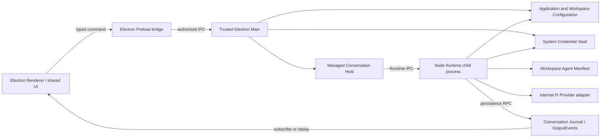
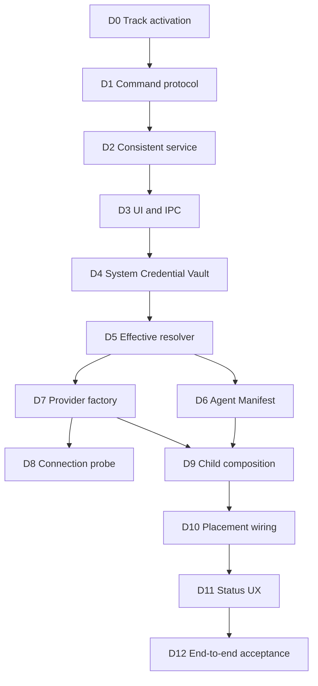

# Desktop Runtime Integration Implementation Plan

## 1. Status and Objective

This plan is the active repository implementation track as of August 3, 2026.
It connects the existing Electron GUI Configuration and Conversation surfaces
to the completed provider-neutral Core Runtime and child-process infrastructure.

The objective is one real, replayable desktop Conversation flow:

```text
GUI UserMessageInputEvent
  -> ManagedConversationHost
  -> Node child-process Runtime Placement
  -> Manifest-bound Agent Runtime
  -> effective Model Configuration
  -> child-accessible Credential Vault
  -> Pi-backed Provider execution
  -> durable Assistant OutputEvent
  -> GUI live display and replay
```

Task D0 through Task D12 are in scope. Novel Task N0 through Task N11, Runtime
Task 1 through Task 7, and Subagent Tool Step S0 through Step S6 remain complete
and must not be reimplemented. Persistent Agent Team work remains paused.

## 2. Confirmed Baseline

The following production paths already work:

- the shared UI edits Model Connections, Model Profiles, Model API protocols,
  default Model selection, and API Key input;
- Electron Preload and Main expose authorized Configuration IPC;
- Application Configuration is revisioned and atomically persisted under the
  resolved Configuration Home;
- Provider secrets are excluded from Configuration snapshots and encrypted by
  the Electron Main credential service;
- Workspace selection opens the Node Conversation application;
- Conversation InputEvents and Runtime presence OutputEvents are durable;
- Core provides Runtime lifecycle, persistence RPC, process supervision,
  Manifest restoration, Agent execution assembly, Pi adaptation, context,
  Nudge, cancellation, heartbeat, and replay foundations.

The current desktop failure is deliberate composition behavior rather than a
Provider or API Key failure. Production Electron Main constructs
`DesktopConversationApiApplicationFactory` without a Runtime Placement, so the
factory falls back to `DesktopUnavailableConversationRuntimePlacement` and every
activation ends as `activation_failed` before a Provider call occurs.

The current Application Configuration contains one enabled Model Connection,
one Model Profile, one default Model Profile, a selected API protocol, a Base URL
configuration, and a Credential Reference. This metadata is sufficient to prove
that GUI persistence completed, but it is not yet consumed by Runtime.

An unrelated untracked `core/core/` path existed when this track was activated.
It is outside this plan and must not be edited, staged, deleted, or committed by
Desktop Runtime Integration steps.

## 3. Accepted Architecture



The following boundaries are accepted:

1. Runtime remains a child-process abstraction; Electron Main does not become
   the default in-process Agent Runtime.
2. Renderer and browser surfaces never receive stored Provider credentials.
3. Provider credentials do not enter Conversation Runtime Bootstrap, Journal,
   OutputEvents, Runtime IPC payloads, Agent Manifest, logs, or diagnostics.
4. A child-accessible system Credential Vault is the accepted production
   direction. The first production adapter targets macOS; unavailable platforms
   fail explicitly rather than falling back to plaintext storage.
5. Existing Electron `safeStorage` credentials are migrated once through a
   trusted Main-owned migration path and are not silently discarded.
6. Public Core Configuration, Conversation, Runtime, IPC, Tool, and Approval
   boundaries remain Provider-neutral. Pi remains an internal Runtime adapter.
7. Model Connection describes vendor/endpoint/credential identity. Model Profile
   describes API protocol, Model ID, parameters, capabilities, and fallbacks.
8. Effective Configuration precedence remains session over Conversation over
   Workspace over Application.
9. Connection testing and Conversation execution reuse the same effective
   configuration resolver and Provider factory; the GUI does not implement a
   separate direct `fetch` path.
10. Agent Prompt, Tool selection, and Runtime policies are restored from the
    immutable Conversation-bound Agent Manifest rather than hard-coded during
    desktop startup.

## 4. Configuration Consistency Strategy

The current UI first saves the complete Application Configuration and then saves
the API Key. A credential failure can therefore leave the new Model Profile as
the default while its Credential is missing. The desktop integration replaces
that UI orchestration with one trusted Host command.

Credential replacement uses versioned references rather than overwriting the
active record:

```text
validate candidate Configuration
  -> save secret under a new Credential Reference
  -> atomically save Configuration referencing the new record
  -> delete the superseded record after success
```

If Configuration persistence fails, the staged record is deleted and the old
Configuration continues to reference the old Credential. If no new secret was
provided, the existing Credential Reference remains unchanged.

`credentialConfigured` is a Host projection derived from Credential status. It
must not be treated as an authoritative persisted Configuration fact.

## 5. Task Sequence

### Task D0: Track Activation and Baseline

- record the confirmed desktop failure and completed foundations;
- record the accepted Credential and child-process boundaries;
- change the repository execution protocol to this plan;
- preserve unrelated worktree content;
- validate documentation consistency and commit the track activation.

D0 is completed by the focused commit introducing this plan. D1 is next.

### Task D1: Model Configuration Command Protocol

- add provider-neutral upsert, default-selection, removal, and safe result
  contracts under Core Configuration;
- keep secrets out of Configuration snapshots and results;
- retain whole-snapshot `load` and compatibility `save`, but stop requiring the
  Model settings UI to orchestrate multiple persistence operations;
- add focused type and behavior validation.

D1 is complete with serializable upsert, default-selection, and removal
requests; explicit keep, replace, and delete Credential mutations; safe mutation
results; trusted-boundary capture functions; Core exports; and the
`model-configuration-command-protocol-smoke.mjs` validation. D2 is next.

### Task D2: Consistent Model Configuration Service

- implement the trusted Host command over Application Configuration and
  Credential Store;
- stage new versioned Credential References before switching Configuration;
- clean staged or superseded records according to the accepted failure rules;
- preserve revision checks and serialized mutation;
- cover create, edit with secret, edit without secret, conflict, cleanup, and
  failure-compensation scenarios.

D2 is complete with the provider-neutral storage command service, deterministic
and random identity Ports, revision conflict handling, serialized mutation,
versioned Credential staging, candidate-build and save rollback, committed
cleanup with shared-reference protection, deferred cleanup reporting, safe
structured logs, and the `model-configuration-command-service-smoke.mjs`
validation. D3 is next.

### Task D3: Shared UI and Electron Configuration Commands

- extend the shared `ApplicationConfigurationClient`;
- add typed Preload and IPC commands;
- update the Model settings panel to perform one upsert command;
- retain safe status-only credential projection;
- validate Renderer, Preload, IPC authorization, and Main composition.

### Task D4: Child-Accessible System Credential Vault

- add Node system Credential backend contracts and stable errors;
- implement the macOS production adapter;
- add trusted Electron `safeStorage` migration and migration state;
- make unsupported platforms return `credential_unavailable` without plaintext
  fallback;
- validate configured, missing, unavailable, corrupted, migration, cleanup, and
  child-use behavior with redacted logs.

### Task D5: Effective Model Execution Resolver

- load Application, Workspace, Conversation, and Session configuration inputs;
- apply the accepted precedence with `EffectiveConfigurationResolver`;
- resolve the selected Model Profile and Model Connection;
- return a Provider-neutral execution descriptor containing only a Credential
  Reference;
- provide stable readiness failures for missing, disabled, unsupported, and
  unavailable configuration states.

### Task D6: Default Novel Conversation Agent Manifest

- define and assemble the initial `novel.conversation` Agent definition;
- persist the Manifest in the Workspace Agent Manifest Store;
- bind new Conversations to immutable Manifest ID and digest values;
- inject the Manifest Store into production bootstrap composition;
- prove restart restoration and strict missing/digest-mismatch behavior.

### Task D7: Pi Provider Execution Factory

- implement an internal factory over the provider-neutral execution descriptor;
- initially support OpenAI Responses, OpenAI Completions, Anthropic Messages,
  and Google Generative AI;
- reject other declared APIs with a stable unsupported code rather than an
  implicit protocol fallback;
- normalize authentication, rate-limit, timeout, network, response, and
  cancellation failures without exposing raw Provider data.

### Task D8: Real Model Connection Probe

- add typed test request and safe result contracts;
- resolve the saved effective connection through the same resolver and Provider
  factory used by Runtime;
- expose the command through Main, Preload, Renderer, and shared UI;
- show success latency or stable safe failure codes;
- do not create Conversation history or persist Provider response content.

### Task D9: Desktop Runtime Child Composition Root

- add the desktop child entrypoint and production composition factory;
- restore the Manifest-bound Agent assembly;
- resolve Model execution and use the system Credential Vault;
- create the Pi Provider, Pi Agent adapter, context compiler, Runtime policy,
  Nudge services, input pump, and Conversation Runtime;
- retain persistence ownership behind existing Runtime persistence RPC.

### Task D10: Desktop Runtime Placement Wiring

- compose the child launcher, parent endpoint factory, and process supervisor in
  Electron Main;
- inject the real Placement into `DesktopConversationApiApplicationFactory`;
- preserve the unavailable Placement only for explicit tests and diagnostics;
- close Runtime children during Workspace replacement and application shutdown;
- validate activation, heartbeat, cancellation, stop, and abnormal exit.

### Task D11: Runtime Status and Recovery UX

- distinguish not configured, invalid configuration, missing Credential,
  missing Manifest, starting, online, generating, stopped, and crashed states;
- classify Provider-call failures as Turn failures rather than process crashes;
- expose safe retry, stop, open-settings, and diagnostic-code actions;
- preserve durable status OutputEvents and replay.

### Task D12: End-to-End Desktop Conversation Acceptance

- validate the complete GUI-to-child-to-Assistant OutputEvent flow with a
  deterministic streaming fake Provider;
- validate refresh replay, stop, retry, Workspace replacement, and clean child
  shutdown;
- add an opt-in real Provider smoke that never logs credentials, prompts,
  messages, URLs, response content, or raw failures;
- run focused validation first, then the complete established Core, UI, GUI,
  Web, and CLI validation suite;
- publish completion evidence and mark this track complete.

## 6. Dependency Order



Each task is implemented as one or more explicitly planned, independently
validated, focused commits. A task may be split further when platform migration,
packaging, or failure recovery requires a separately reviewable checkpoint.

## 7. Validation and Logging Boundaries

Every step must run its focused tests before the established broader validation
suite applicable to the changed packages. Final D12 validation includes the
root build/check flow and complete Core smoke suite.

Structured `info` and `debug` logs are required on important execution paths,
but logs must never expose Event payloads, novel text, prompts, Configuration
contents, Model IDs, Base URLs, Provider data, credentials, Credential
References, Store/work paths, JSONL lines, raw errors, stacks, causes, or Runtime
stderr. Tests must assert redaction on every new failure boundary.

## 8. Current Position

- D0 is complete by the track-activation commit.
- D1 is complete by the Model Configuration Command Protocol commit.
- D2 is complete by the Consistent Model Configuration Service commit.
- D3 Shared UI and Electron Configuration Commands is the next implementation
  step.
- D4 through D12 remain pending.
- Agent-facing Novel Tools and Persistent Agent Team work remain outside this
  active track.
