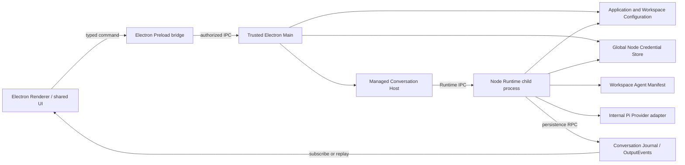
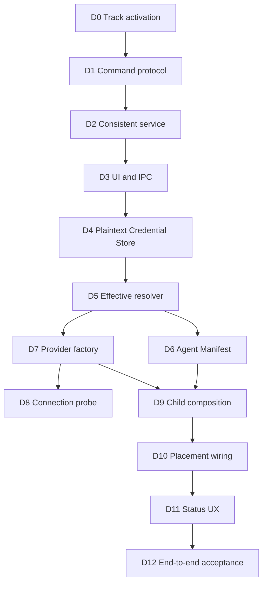

# Desktop Runtime Integration Implementation Plan

## 1. Status and Objective

This plan is the active repository implementation track as of August 4, 2026.
It connects the existing Electron GUI Configuration and Conversation surfaces
to the completed provider-neutral Core Runtime and child-process infrastructure.

The objective is one real, replayable desktop Conversation flow:

```text
GUI UserMessageInputEvent
  -> ManagedConversationHost
  -> Node child-process Runtime Placement
  -> Manifest-bound Agent Runtime
  -> effective Model Configuration
  -> child-accessible Credential Store
  -> Pi-backed Provider execution
  -> durable Assistant OutputEvent
  -> GUI live display and replay
```

Task D0 through Task D12 are in scope. Novel Task N0 through Task N11, Runtime
Task 1 through Task 7, and Subagent Tool Step S0 through Step S6 remain complete
and must not be reimplemented. Persistent Agent Team work remains paused.

## 2. Confirmed Baseline

The following production paths already work:

- the shared UI edits Model Connections, Model Profiles, Model API protocols,
  default Model selection, and API Key input;
- Electron Preload and Main expose authorized Configuration IPC;
- Application Configuration is revisioned and atomically persisted under the
  resolved Configuration Home;
- Provider secrets are excluded from Configuration snapshots and use the global
  permission-restricted plaintext Credential Store; the legacy Electron Main
  `safeStorage` cipher remains only for startup migration;
- Workspace selection opens the Node Conversation application;
- Conversation InputEvents and Runtime presence OutputEvents are durable;
- Core provides Runtime lifecycle, persistence RPC, process supervision,
  Manifest restoration, Agent execution assembly, Pi adaptation, context,
  Nudge, cancellation, heartbeat, and replay foundations.

The current desktop failure is deliberate composition behavior rather than a
Provider or API Key failure. Production Electron Main constructs
`DesktopConversationApiApplicationFactory` without a Runtime Placement, so the
factory falls back to `DesktopUnavailableConversationRuntimePlacement` and every
activation ends as `activation_failed` before a Provider call occurs.

The current Application Configuration contains one enabled Model Connection,
one Model Profile, one default Model Profile, a selected API protocol, a Base URL
configuration, and a Credential Reference. This metadata is sufficient to prove
that GUI persistence completed, but it is not yet consumed by Runtime.

An unrelated untracked `core/core/` path existed when this track was activated.
It is outside this plan and must not be edited, staged, deleted, or committed by
Desktop Runtime Integration steps.

## 3. Accepted Architecture



The following boundaries are accepted:

1. Runtime remains a child-process abstraction; Electron Main does not become
   the default in-process Agent Runtime.
2. Renderer and browser surfaces never receive stored Provider credentials.
3. Provider credentials do not enter Conversation Runtime Bootstrap, Journal,
   OutputEvents, Runtime IPC payloads, Agent Manifest, logs, or diagnostics.
4. Desktop V1 deliberately uses a child-accessible plaintext Credential Store
   under the resolved global `NOVEL_HOME/credentials` directory. Credentials
   never live under Workdir or a Workspace Store, and Configuration persists
   only the opaque Credential Reference.
5. The public boundary remains `CredentialStore` and `CredentialVault.use()`.
   No plaintext getter is added, and Renderer, Runtime Bootstrap, Runtime IPC,
   Events, Journal, diagnostics, paths, and logs never receive secret values.
6. `NodePlaintextCredentialStore` hashes Credential References for filenames,
   creates its directory with mode `0700`, creates credential files with mode
   `0600`, serializes access per Credential, and replaces records through an
   atomic temporary-write, file `fsync`, rename, and directory `fsync` flow.
7. Existing Electron `safeStorage` credentials are migrated once through a
   trusted, restart-safe Main-owned migration path and are not silently
   discarded. The legacy cipher remains only for migration compatibility.
8. macOS Keychain, Windows Credential Manager, and Linux Secret Service adapters
   are deferred beyond V1 and may replace the plaintext backend behind the same
   provider-neutral interfaces.
9. Public Core Configuration, Conversation, Runtime, IPC, Tool, and Approval
   boundaries remain Provider-neutral. Pi remains an internal Runtime adapter.
10. Model Connection describes vendor/endpoint/credential identity. Model Profile
   describes API protocol, Model ID, parameters, capabilities, and fallbacks.
11. Effective Configuration precedence remains session over Conversation over
   Workspace over Application.
12. Connection testing and Conversation execution reuse the same effective
   configuration resolver and Provider factory; the GUI does not implement a
   separate direct `fetch` path.
13. Agent Prompt, Tool selection, and Runtime policies are restored from the
    immutable Conversation-bound Agent Manifest rather than hard-coded during
    desktop startup.

## 4. Configuration Consistency Strategy

The current UI first saves the complete Application Configuration and then saves
the API Key. A credential failure can therefore leave the new Model Profile as
the default while its Credential is missing. The desktop integration replaces
that UI orchestration with one trusted Host command.

Credential replacement uses versioned references rather than overwriting the
active record:

```text
validate candidate Configuration
  -> save secret under a new Credential Reference
  -> atomically save Configuration referencing the new record
  -> delete the superseded record after success
```

If Configuration persistence fails, the staged record is deleted and the old
Configuration continues to reference the old Credential. If no new secret was
provided, the existing Credential Reference remains unchanged.

`credentialConfigured` is a Host projection derived from Credential status. It
must not be treated as an authoritative persisted Configuration fact.

### 4.1 Desktop V1 Plaintext Threat Model

Desktop V1 accepts that a process running as the same operating-system user, an
administrator, malware with equivalent filesystem access, or a compromised host
can read stored API Keys. The plaintext backend therefore does not claim
encryption at rest or protection from a local account compromise.

The V1 controls are intended to prevent accidental disclosure and unnecessarily
broad filesystem access: credentials are isolated under the global
Configuration Home, references are not exposed as filenames, files use
restrictive permissions, writes are atomic and serialized, and secrets remain
outside Configuration snapshots and all observable Runtime or UI channels.
Backups and filesystem snapshots may still contain plaintext records and are
part of the accepted V1 risk.

## 5. Task Sequence

### Task D0: Track Activation and Baseline

- record the confirmed desktop failure and completed foundations;
- record the accepted Credential and child-process boundaries;
- change the repository execution protocol to this plan;
- preserve unrelated worktree content;
- validate documentation consistency and commit the track activation.

D0 is completed by the focused commit introducing this plan. D1 is next.

### Task D1: Model Configuration Command Protocol

- add provider-neutral upsert, default-selection, removal, and safe result
  contracts under Core Configuration;
- keep secrets out of Configuration snapshots and results;
- retain whole-snapshot `load` and compatibility `save`, but stop requiring the
  Model settings UI to orchestrate multiple persistence operations;
- add focused type and behavior validation.

D1 is complete with serializable upsert, default-selection, and removal
requests; explicit keep, replace, and delete Credential mutations; safe mutation
results; trusted-boundary capture functions; Core exports; and the
`model-configuration-command-protocol-smoke.mjs` validation. D2 is next.

### Task D2: Consistent Model Configuration Service

- implement the trusted Host command over Application Configuration and
  Credential Store;
- stage new versioned Credential References before switching Configuration;
- clean staged or superseded records according to the accepted failure rules;
- preserve revision checks and serialized mutation;
- cover create, edit with secret, edit without secret, conflict, cleanup, and
  failure-compensation scenarios.

D2 is complete with the provider-neutral storage command service, deterministic
and random identity Ports, revision conflict handling, serialized mutation,
versioned Credential staging, candidate-build and save rollback, committed
cleanup with shared-reference protection, deferred cleanup reporting, safe
structured logs, and the `model-configuration-command-service-smoke.mjs`
validation. D3 is next.

### Task D3: Shared UI and Electron Configuration Commands

- extend the shared `ApplicationConfigurationClient`;
- add typed Preload and IPC commands;
- update the Model settings panel to perform one upsert command;
- retain safe status-only credential projection;
- validate Renderer, Preload, IPC authorization, and Main composition.

D3 is complete with shared Client commands, versioned Electron channels, typed
Preload capabilities, strict Renderer bridge narrowing, Main delegation to the
D2 service, safe failure-code propagation, and a single-upsert Model settings
flow. The shared React, Electron Client, and Electron Bridge smokes cover the
new path while compatibility Configuration and Credential methods remain
available. D4 is next.

### Task D4: Child-Accessible Plaintext Credential Store

#### D4-A: Plaintext Store

- implement `NodePlaintextCredentialStore` behind the existing
  `CredentialStore` and `CredentialVault` contracts;
- resolve records only beneath global `NOVEL_HOME/credentials`, hash Credential
  References for filenames, and never place secret or reference text in paths;
- enforce restrictive directory and file permissions, per-Credential locking,
  atomic replacement, file and directory durability, and stable redacted
  errors;
- validate save, use, status, delete, missing, corrupted, permission, concurrent,
  lock recovery, atomic replacement, and redacted-log behavior.

D4-A is complete with the exported `NodePlaintextCredentialStore`, hashed
`.plaintext-credential` records, restrictive directory/file modes, atomic and
durable replacement, per-Credential cross-instance locks with stale recovery,
stable Core failures, secret-scoped callback use, and the
`node-plaintext-credential-store-smoke.mjs` validation. D4-B is next.

#### D4-B: Legacy `safeStorage` Migration

- detect legacy Electron `safeStorage` records without overwriting them in
  place;
- migrate through `NodeEncryptedCredentialStore.use()` into a distinct
  plaintext record layout;
- verify the new record before deleting the old record;
- persist restart-safe, idempotent migration state without recording secret
  values;
- validate interrupted, repeated, failed, and successful migration behavior.

D4-B is complete with `NodeLegacyCredentialMigrator` and
`NodeCredentialMigrationStateStore`. Known Configuration references migrate
under per-Credential file locks using durable `started` and `plaintext_saved`
markers; interrupted copies and deletes resume idempotently, ambiguous unmarked
dual records fail with a stable conflict, and secrets remain scoped to the
source `use()` callback. The `node-legacy-credential-migration-smoke.mjs`
validation covers missing, successful, repeated, interrupted, corrupted,
unavailable, conflicting, concurrent, and redacted-log paths. D4-C is next.

#### D4-C: Desktop and Child Composition

- make Electron Main use `NodePlaintextCredentialStore` for production writes
  and reads after migration;
- let the Runtime Child open the same global store directly through the public
  `CredentialVault.use()` boundary;
- retain Electron `safeStorage` and the legacy cipher only for migration;
- validate GUI Credential persistence across restart and child-process use
  without returning plaintext to Renderer or Runtime IPC.

D4-C is complete with `DesktopCredentialMigrationCoordinator`, production Main
composition over `NodePlaintextCredentialStore`, pre-window migration of every
deduplicated Application proxy, Connection, and secret Header reference, and
legacy `safeStorage` retention only inside the migration source. The
`desktop-credential-composition-smoke.mjs` validation proves GUI Configuration
restart recovery and an independent Node child opening the same global Store
without receiving plaintext through Renderer or Runtime IPC. Task D4 is
complete and D5 is next.

### Task D5: Effective Model Execution Resolver

- load Application, Workspace, Conversation, and Session configuration inputs;
- apply the accepted precedence with `EffectiveConfigurationResolver`;
- resolve the selected Model Profile and Model Connection;
- return a Provider-neutral execution descriptor containing only a Credential
  Reference;
- provide stable readiness failures for missing, disabled, unsupported, and
  unavailable configuration states.

D5 is complete with the async `EffectiveModelExecutionResolver`. It loads the
Application Store plus optional Workspace, Conversation, and Session layers,
reuses `EffectiveConfigurationResolver` precedence, validates the selected
Profile and Connection, checks an injected Provider-neutral API support set and
live primary/secret-Header Credential status, and returns an immutable execution
descriptor containing Configuration metadata and Credential References but no
secret values. Stable redacted readiness failures cover unavailable loading,
unselected or missing Profiles, missing or disabled Connections, unsupported
APIs, and missing or unavailable Credentials. The
`effective-model-execution-resolver-smoke.mjs` validation covers all four
precedence layers and failure boundaries. D6 is next.

### Task D6: Default Novel Conversation Agent Manifest

- define and assemble the initial `novel.conversation` Agent definition;
- persist the Manifest in the Workspace Agent Manifest Store;
- bind new Conversations to immutable Manifest ID and digest values;
- inject the Manifest Store into production bootstrap composition;
- prove restart restoration and strict missing/digest-mismatch behavior.

### Task D7: Pi Provider Execution Factory

- implement an internal factory over the provider-neutral execution descriptor;
- initially support OpenAI Responses, OpenAI Completions, Anthropic Messages,
  and Google Generative AI;
- reject other declared APIs with a stable unsupported code rather than an
  implicit protocol fallback;
- normalize authentication, rate-limit, timeout, network, response, and
  cancellation failures without exposing raw Provider data.

### Task D8: Real Model Connection Probe

- add typed test request and safe result contracts;
- resolve the saved effective connection through the same resolver and Provider
  factory used by Runtime;
- expose the command through Main, Preload, Renderer, and shared UI;
- show success latency or stable safe failure codes;
- do not create Conversation history or persist Provider response content.

### Task D9: Desktop Runtime Child Composition Root

- add the desktop child entrypoint and production composition factory;
- restore the Manifest-bound Agent assembly;
- resolve Model execution and use the child-accessible Credential Store;
- create the Pi Provider, Pi Agent adapter, context compiler, Runtime policy,
  Nudge services, input pump, and Conversation Runtime;
- retain persistence ownership behind existing Runtime persistence RPC.

### Task D10: Desktop Runtime Placement Wiring

- compose the child launcher, parent endpoint factory, and process supervisor in
  Electron Main;
- inject the real Placement into `DesktopConversationApiApplicationFactory`;
- preserve the unavailable Placement only for explicit tests and diagnostics;
- close Runtime children during Workspace replacement and application shutdown;
- validate activation, heartbeat, cancellation, stop, and abnormal exit.

### Task D11: Runtime Status and Recovery UX

- distinguish not configured, invalid configuration, missing Credential,
  missing Manifest, starting, online, generating, stopped, and crashed states;
- classify Provider-call failures as Turn failures rather than process crashes;
- expose safe retry, stop, open-settings, and diagnostic-code actions;
- preserve durable status OutputEvents and replay.

### Task D12: End-to-End Desktop Conversation Acceptance

- validate the complete GUI-to-child-to-Assistant OutputEvent flow with a
  deterministic streaming fake Provider;
- validate refresh replay, stop, retry, Workspace replacement, and clean child
  shutdown;
- add an opt-in real Provider smoke that never logs credentials, prompts,
  messages, URLs, response content, or raw failures;
- run focused validation first, then the complete established Core, UI, GUI,
  Web, and CLI validation suite;
- publish completion evidence and mark this track complete.

## 6. Dependency Order



Each task is implemented as one or more explicitly planned, independently
validated, focused commits. A task may be split further when platform migration,
packaging, or failure recovery requires a separately reviewable checkpoint.

## 7. Validation and Logging Boundaries

Every step must run its focused tests before the established broader validation
suite applicable to the changed packages. Final D12 validation includes the
root build/check flow and complete Core smoke suite.

Structured `info` and `debug` logs are required on important execution paths,
but logs must never expose Event payloads, novel text, prompts, Configuration
contents, Model IDs, Base URLs, Provider data, credentials, Credential
References, Store/work paths, JSONL lines, raw errors, stacks, causes, or Runtime
stderr. Tests must assert redaction on every new failure boundary.

## 8. Current Position

- D0 is complete by the track-activation commit.
- D1 is complete by the Model Configuration Command Protocol commit.
- D2 is complete by the Consistent Model Configuration Service commit.
- D3 is complete by the Shared UI and Electron Configuration Commands commit.
- D4-A Plaintext Store, D4-B Legacy `safeStorage` Migration, and D4-C Desktop
  and Child Composition are complete.
- D5 Effective Model Execution Resolver is complete.
- D6 Default Novel Conversation Agent Manifest is the next implementation step.
  D7 through D12 remain pending.
- Agent-facing Novel Tools and Persistent Agent Team work remain outside this
  active track.
