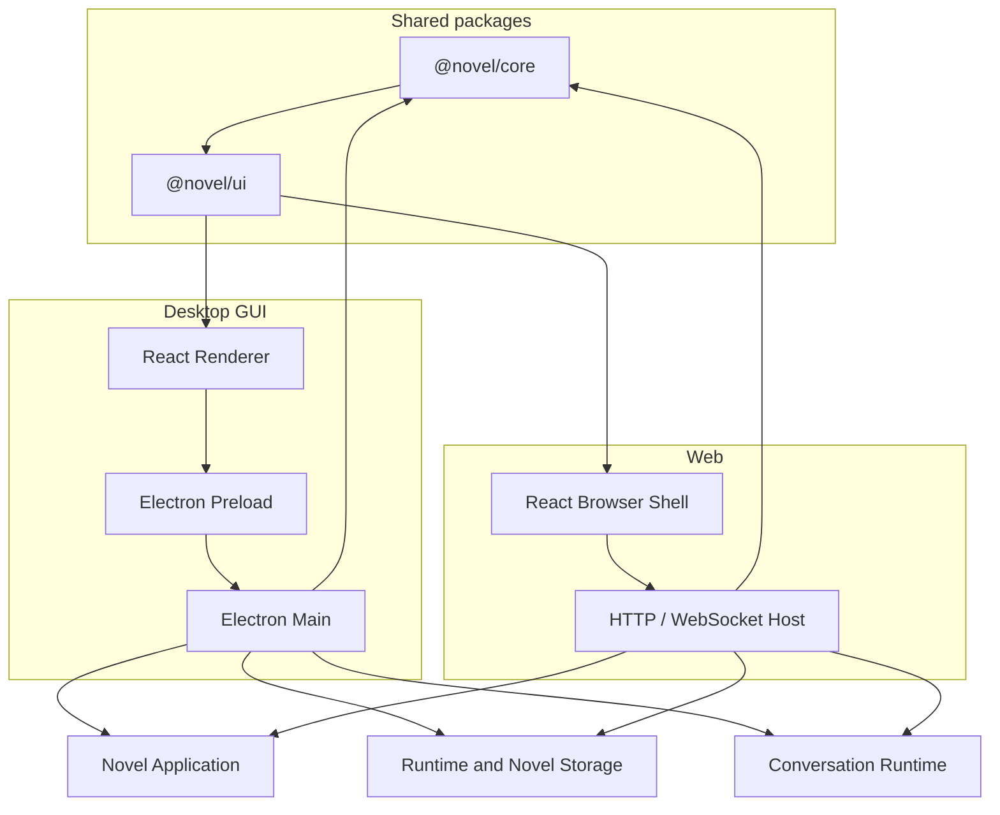
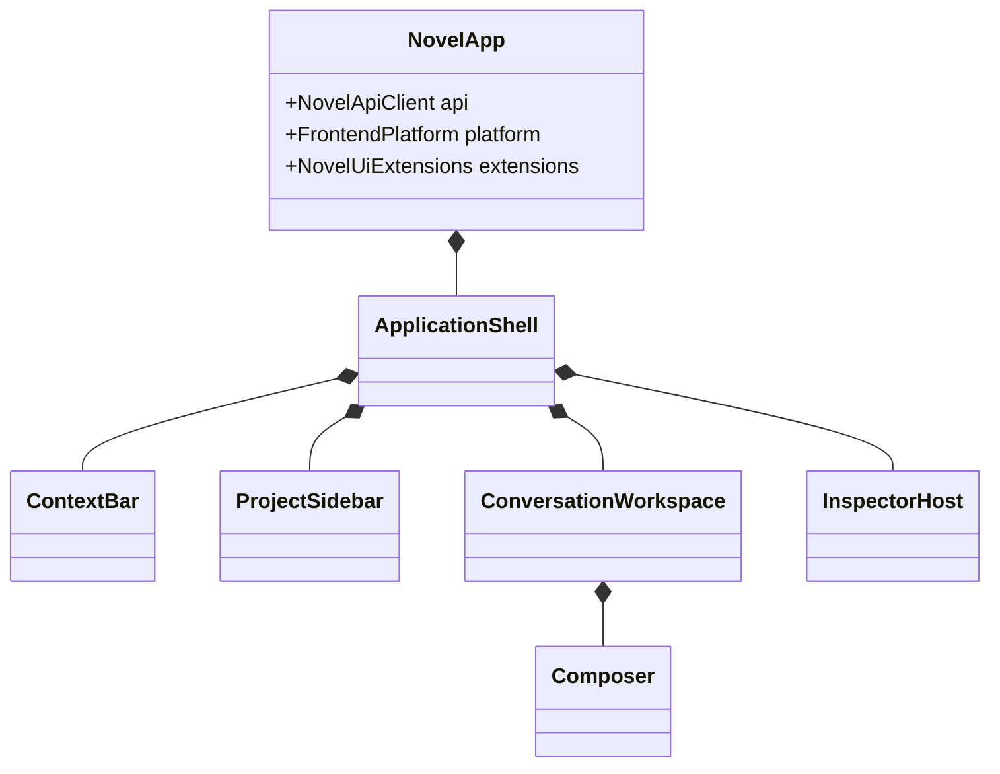
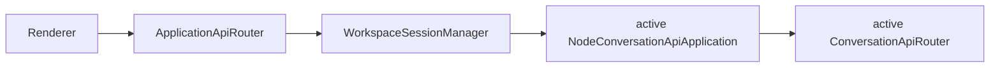
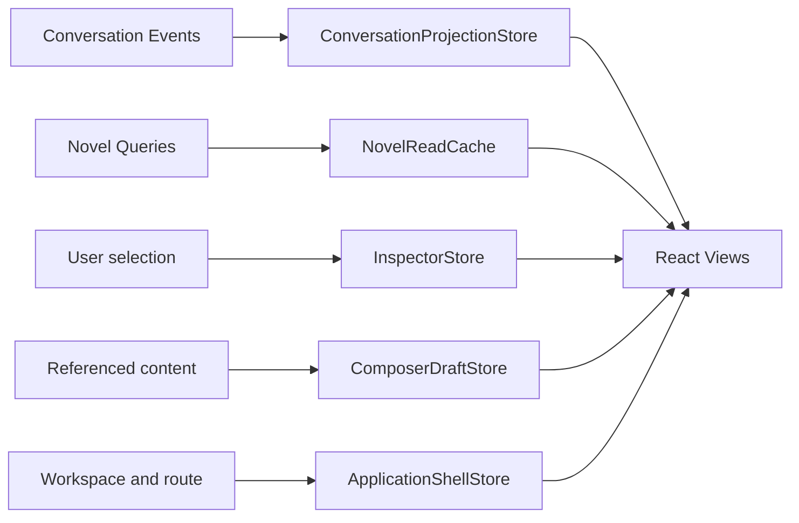
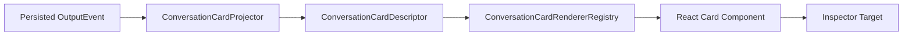
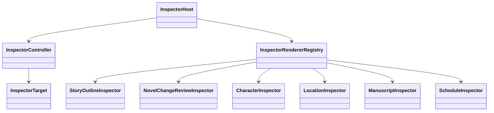
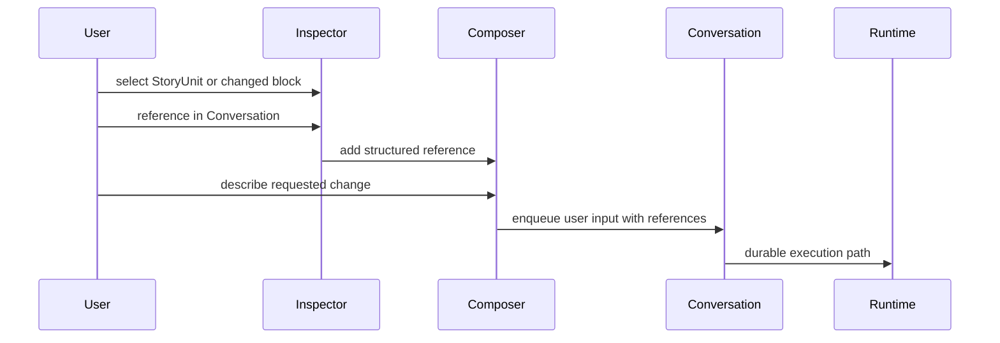
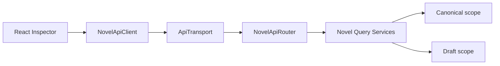
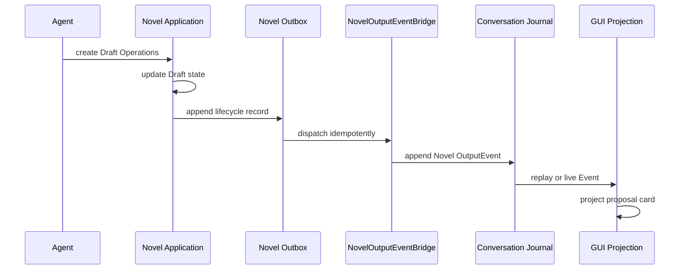
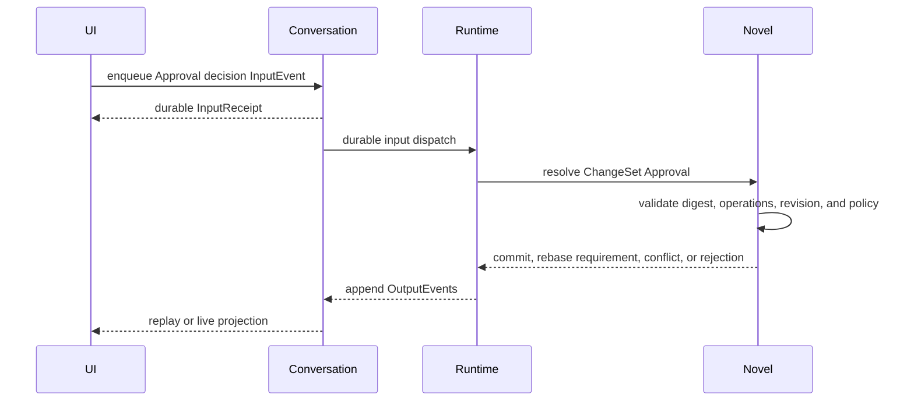

# Novel GUI Implementation Architecture

## 1. Document Status

This document records the accepted implementation architecture for the shared React UI, Electron desktop GUI, Web shell, chat-first Novel workflow, contextual Inspector, and domain-specific change review.

- It refines `docs/client-ui-architecture.md` rather than replacing its package and Transport boundaries.
- It consumes the accepted Story Outline, Manuscript, Draft, ChangeSet, Approval, query, and projection semantics in `docs/novel-domain.md` rather than redefining the Novel domain.
- It describes target modules, component responsibilities, read models, state flow, and implementation stages.
- It records the implemented shared UI, client protocol, Electron Renderer, and Web browser checkpoints while keeping production Host composition separate.
- It does not authorize implementation outside the explicitly selected GUI/Web track or across unresolved Runtime placement, authentication, deployment, and packaging boundaries.
- Editor libraries, production Host wiring, authentication, deployment, and packaging choices remain subject to their applicable review gates.

## 2. Accepted Product Interaction

The GUI is chat-first.

The central Conversation remains visible while the user inspects, references, reviews, and approves Novel content in a contextual right-side Inspector.

```text
Top Menu
    Project / Edit / Publish / Help

Context Bar
    Workspace / Current Meta / Conversation / Agent

Left Sidebar
    New Conversation
    Schedule
    Outline
    Characters
    Locations
    Manuscript
    Conversation list

Center
    Conversation timeline
    structured cards
    message composer

Right Inspector
    read-only content
    structured Diff review
    status and evidence
    approval actions
```

Accepted interaction rules:

1. Conversation is the primary application surface.
2. Selecting Outline, Character, Location, Manuscript, Schedule, or a Conversation card opens the right Inspector without replacing the Conversation.
3. The Inspector is closed by default and may expand when domain review needs more horizontal space.
4. Viewing and selecting content are queries and local UI state transitions, not Conversation InputEvents.
5. Referencing an Inspector object adds a structured reference to the message composer rather than copying an untracked text fragment.
6. Sending a message with references enters the Conversation through the normal InputEvent path.
7. Agent-proposed Novel changes appear as typed cards in the Conversation timeline.
8. Opening a proposal card queries the full domain review model and displays a domain-specific reviewer.
9. A proposal OutputEvent does not prove that Novel state has changed.
10. Accepted Novel state changes only through the Draft and Commit protocols defined by the Novel domain.

## 3. Visual Direction

The shared graphical UI uses a quiet white presentation:

```text
primary surface       #FFFFFF
secondary surface     #F7F8FA
quiet surface         #FAFAFA
border                #E5E7EB
strong border         #D1D5DB
primary text          #20242A
secondary text        #6B7280
low-saturation accent blue or blue-gray
```

Color semantics are reserved for state and review meaning:

| Meaning | Presentation |
| --- | --- |
| added operation | green block plus `+` marker |
| deleted operation | red block plus `-` marker and deleted text treatment |
| moved operation | blue block plus move marker |
| unchanged context | white or neutral gray |
| warning or awaiting decision | amber status token |
| error or blocked | red status token with text or icon |
| success or completed | green status token with text or icon |

Color is never the only signal. Every state also has a label, marker, icon, or accessible description.

## 4. Package and Process Architecture



The desktop Renderer and Web Browser use the same React feature implementation from `@novel/ui`.

Platform entrypoints inject:

- `NovelApiClient`;
- `ConversationClient` and `ConversationProxy` composition;
- `FrontendPlatform` ports;
- platform capabilities;
- UI extensions;
- desktop or Web Transport.

The Renderer never imports Node-only adapters, SQLite, Electron Main APIs, Provider credentials, Runtime implementations, or Tool handlers.

## 5. Target Repository Layout

```text
core/src/
├─ client/
│  ├─ NovelApiClient.ts
│  ├─ DefaultNovelApiClient.ts
│  └─ transport/
├─ conversation/
│  ├─ proxy/
│  └─ client/
├─ projection/
│  ├─ conversation/
│  ├─ card/
│  └─ client-state/
└─ novel/
   ├─ model/
   ├─ operation/
   ├─ service/
   ├─ query/
   ├─ projection/
   ├─ integration/
   └─ port/

ui/src/
├─ app/
├─ shell/
├─ context/
├─ workspace/
├─ conversation/
├─ composer/
├─ card/
├─ inspector/
├─ review/
├─ outline/
├─ manuscript/
├─ character/
├─ location/
├─ schedule/
├─ state/
├─ platform/
├─ theme/
└─ index.ts

gui/src/
├─ main/
├─ preload/
├─ renderer/
│  ├─ DesktopNovelApp.tsx
│  ├─ ElectronFrontendPlatform.ts
│  ├─ transport/
│  ├─ extensions/
│  └─ features/
└─ shared/

web/src/
├─ WebNovelApp.tsx
├─ WebFrontendPlatform.ts
├─ transport/
├─ extensions/
└─ features/
```

The exact package-level files remain implementation targets. Existing accepted Core and Novel files are extended rather than moved solely to match this illustrative tree.

## 6. Shared React Application Composition



Recommended component composition:

```tsx
<NovelAppProvider api={api} platform={platform} extensions={extensions}>
  <ApplicationShell>
    <TopMenu />
    <CurrentContextBar />
    <ProjectSidebar />
    <ConversationWorkspace />
    <InspectorHost />
  </ApplicationShell>
</NovelAppProvider>
```

The shared application does not detect Electron or Web through globals. Desktop and Web shells provide capabilities explicitly.

### 6.1 Implemented Shared Shell Checkpoint

`NovelApp` now renders the initial shared chat-first `ApplicationShell` inside the accepted API, platform, and extension providers. The Shell contains the fixed Project/Edit/Publish/Help menu, persistent Workspace/Meta/Conversation/Agent context bar, project and Conversation sidebar, central Conversation host with reserved Composer surface, and contextual Inspector host.

The initial theme is implemented with shared CSS variables and a quiet white presentation. The Inspector defaults to `closed` and supports presentation-only `normal` and `expanded` widths; state ownership and transitions remain the next Shell Store checkpoint. Expanded review preserves the left sidebar and takes width from the central Conversation area.

The fixed left navigation contains New Conversation, Schedule, Outline, Characters, Locations, and Manuscript followed by Conversation history. Components expose semantic navigation, workspace, Conversation, Composer, and Inspector landmarks, keyboard-visible focus treatment, and non-color text labels. No query, InputEvent, routing, Electron, HTTP, or Novel mutation behavior is introduced by this checkpoint.

The shared Shell assigns the optional title bar, top menu, context bar, and main body to explicit named Grid rows. An absent desktop title-bar extension therefore collapses only its own row and cannot move the main body into the fixed-height context row. The Shell occupies the current viewport height (`100dvh`, with `100vh` fallback), while Sidebar, Conversation, Composer, and Inspector keep their own bounded scrolling surfaces.

### 6.2 Implemented Workspace and Settings Interaction Skeleton

The shared Shell now treats Workspace as an actionable application context rather than static text. The Workspace segment, central empty state, and `项目 → 打开 Workspace…` command open one shared chooser; `项目 → 关闭 Workspace` clears the active Workspace and stale Shell context. One window owns at most one active Workspace.

The shared Shell and both platform roots are also responsive below the original desktop-width assumption. They remove the `760px` document minimum, preserve the project navigation list in a narrower sidebar, keep context overflow local to the context bar, and prevent the page itself from being horizontally clipped in narrow desktop or embedded-browser viewports.

`WorkspaceController` is a presentation-facing async state machine with immutable snapshots and strictly serialized operations. It composes a picker port with a Workspace-session port, allowing GUI and Web shells to share the same React behavior while injecting different platform implementations. The current W1 Web/default composition intentionally uses unavailable ports and displays a safe error instead of pretending that a browser can select a local project root.

Settings remains under `编辑 → 设置…`. The dialog consumes the existing `settingsSections` extension contract and currently owns only process-local sidebar presentation state. Host overlays and built-in Workspace/Settings dialogs compose together; a specialized shell cannot accidentally replace the built-in application dialogs by supplying its own overlay content.

This checkpoint is a Mock-backed interaction skeleton, not the final Workspace Host. The next client boundary must sit above the current Workspace-bound `ConversationApiRouter`:



Electron native directory picking, opaque Preload selection tokens, `NodeWorkspaceStoreLocator`, recent-Workspace persistence, and one active Node application per window remain later desktop steps. Focused Mock validation covers selection, recent reopen data, open and close transitions, menu access, Settings extension rendering, immediate sidebar state, immutable snapshots, operation serialization, and overlay composition.

## 7. Application State Boundaries

The GUI uses multiple focused stores rather than one application-wide mutable object.



### 7.1 `ConversationProjectionStore`

Responsibilities:

- apply persisted Conversation Events in Sequence order;
- deduplicate replayed Events;
- maintain user messages, assistant drafts, completed assistant messages, cards, Runtime Presence, Run state, Turn state, Tool trace summaries, and Approval summaries;
- expose immutable snapshots to React;
- rebuild from Journal replay;
- never become an independent durable history.

### 7.2 `NovelReadCache`

Responsibilities:

- cache query results by `NovelReadScope`, entity identity, revision, and query parameters;
- distinguish canonical and Draft reads;
- invalidate or replace results when NovelRevision, Draft revision, or explicit outbox-delivered Novel lifecycle Events change;
- never mutate Novel domain state;
- never infer canonical acceptance from an OutputEvent alone.

### 7.3 `InspectorStore`

Responsibilities:

- identify the currently opened Inspector target;
- record whether the Inspector is closed, normal width, or expanded review width;
- store the active reviewer tab and selected UI node;
- coordinate loading, loaded, stale, error, and unavailable states;
- keep Inspector selection local unless the user explicitly sends a Conversation reference or domain command.

### 7.4 `ComposerDraftStore`

Responsibilities:

- maintain unsent user text;
- maintain structured context references;
- add or remove references from the Inspector;
- preserve drafts while the Inspector opens or closes;
- serialize the final input through the accepted Conversation input protocol;
- never write Novel state directly.

### 7.5 `ApplicationShellStore`

Responsibilities:

- current Workspace identity;
- current Novel identity;
- current Conversation identity;
- current Agent presentation identity;
- current Meta selection;
- sidebar expansion and application-level UI preferences.

#### Implemented Shell Store Checkpoint

`ApplicationShellStore` now exposes immutable external-store snapshots for current Workspace, Novel, Meta, Conversation, Agent, and sidebar presentation mode. It captures identity records defensively, suppresses equivalent updates, increments one local revision per effective command, and remains non-durable UI state.

`NovelApp` accepts either an injected Store or initial Shell state and binds the context bar and sidebar mode through React `useSyncExternalStore`. Updating Shell context or collapsing the sidebar does not recreate the central Conversation subtree. Inspector target identity, open/close mode, reviewer state, loading, staleness, and query failures remain owned by the later `InspectorStore` checkpoint.

## 8. Current Workspace and Meta

The context bar remains visible below the top menu:

```text
Workspace / Meta / Conversation / Agent
```

Recommended view model:

```ts
interface CurrentApplicationContextView {
  readonly workspace: WorkspaceContextView;
  readonly meta?: CurrentMetaView;
  readonly conversation?: ConversationContextView;
  readonly agent?: AgentContextView;
}

interface WorkspaceContextView {
  readonly workspaceId: string;
  readonly displayName: string;
}

type CurrentMetaKind =
  | "novel"
  | "story-outline"
  | "story-unit"
  | "manuscript"
  | "manuscript-block"
  | "character"
  | "location"
  | "publication"
  | "schedule";

interface CurrentMetaView {
  readonly kind: CurrentMetaKind;
  readonly targetId: string;
  readonly displayPath: readonly string[];
  readonly readScope: NovelReadScope;
  readonly sourceRevision?: NovelRevision;
}
```

UI examples:

```text
Workspace  雾港回声
Meta       StoryOutline / 灯塔调查线 / 追踪错误目标
Conversation 继续第三卷
Agent      Novel Writer
```

The default product UI shows display names, not Store paths, database paths, raw IDs, Runtime instance IDs, or credentials. A dedicated diagnostics view may expose safe identifiers when explicitly enabled.

`Meta` means the current Novel object or scope the user is viewing. It is not Runtime metadata.

## 9. Left Sidebar Architecture

The sidebar order is fixed initially:

```text
New Conversation
Schedule

Novel Content
    Outline
    Characters
    Locations
    Manuscript

Conversations
    current and recent Conversations
```

Recommended component tree:

```text
ProjectSidebar
├─ NewConversationButton
├─ ScheduleNavigationItem
├─ NovelContentNavigation
│  ├─ OutlineNavigationItem
│  ├─ CharacterNavigationItem
│  ├─ LocationNavigationItem
│  └─ ManuscriptNavigationItem
└─ ConversationNavigation
   └─ ConversationNavigationItem[]
```

Click behavior:

- `Schedule` opens `ScheduleInspector`.
- `Outline` opens `StoryOutlineInspector` and sets Meta to the Story Outline root.
- `Characters` opens `CharacterIndexInspector`.
- `Locations` opens `LocationIndexInspector`.
- `Manuscript` opens `ManuscriptIndexInspector`.
- a Conversation item changes the bound Conversation and reconstructs its projection from Event history and live follow.
- content navigation does not replace the central Conversation.

The left sidebar remains visible while normal or expanded Inspectors are open. Expanded review reallocates width only between the central Conversation and the Inspector; it does not replace, hide, or repurpose the project and Conversation lists. A future user-controlled sidebar collapse may reduce it to a narrow rail, but review mode never collapses it automatically.

## 10. Conversation Workspace

The Conversation workspace is a projection over unified InputEvent and OutputEvent history.

```text
ConversationWorkspace
├─ ConversationHeader
├─ ConversationTimeline
│  ├─ UserMessageItem
│  ├─ AssistantMessageItem
│  ├─ ConversationCardItem
│  ├─ RuntimeLifecycleItem
│  └─ ErrorItem
└─ ConversationComposer
```

The initial user-visible timeline hides low-level Event noise by default while retaining a diagnostics mode for advanced users.

Examples of normally visible content:

- user messages;
- assistant text;
- Novel proposal cards;
- Tool summaries that materially affect the user;
- Approval requests;
- task and schedule cards;
- recoverable errors requiring user action.

Examples of normally collapsed diagnostics:

- Run and Turn lifecycle Events;
- input routing acknowledgements;
- Runtime Presence transitions that do not require attention;
- replay and restoration metadata;
- internal Nudge lifecycle Events.

### 10.1 Implemented Read-only Conversation Checkpoint

The shared UI now renders the existing Core `ConversationProjectionSnapshot` through typed User Message, Assistant Message, and Tool Approval components. Assistant streaming, completed, failed, and cancelled states have explicit text labels; thinking content is collapsed behind a disclosure element; message text preserves whitespace without interpreting Markdown as commands.

Unknown and low-level Events remain hidden from the normal timeline. An explicit diagnostics mode renders only safe Event descriptors containing Sequence, type, and direction, never arbitrary payloads. Approval summaries omit Tool arguments and digests from normal display.

`ConversationView` binds the timeline to `useConversationProjection`, and `NovelApp` automatically opens the Conversation selected in `ApplicationShellStore` when no custom central child is supplied. Journal replay and live Events update the same view without making React state an independent history. Connection recovery controls remain the next checkpoint.

### 10.2 Implemented Connection and Follow Checkpoint

Conversation connection progress now presents opening, replaying, following, disconnected, failed, stopping, and stopped states without replacing the existing timeline. Disconnect failures expose only the Controller's stable redacted code. The UI performs no automatic reconnect; only the visible reconnect action calls `resume()`, after which the existing Projection Store catches up from its last applied Sequence.

Timeline scrolling tracks whether the reader remains near the latest Event. New Events auto-follow only while the reader is already at the bottom; otherwise the current reading position is preserved and a keyboard-accessible “new messages, return to latest” control appears.

### 10.3 Implemented Basic Composer Checkpoint

The Conversation Projection Binding and React Hook now expose the bound Conversation's generic `enqueue(InputEvent)` operation. `NovelApp` uses one Hook result for Timeline, connection controls, and Composer, so the central workspace does not create duplicate Conversation handles or Event subscriptions.

The initial Composer sends plain `UserMessageInputEvent` instances and explicit `StopInputEvent` instances. Enter sends, Shift+Enter preserves a newline, empty text is rejected locally, and controls remain disabled until the bound Controller is live. Accepted and duplicate receipts are presented only as durable Journal outcomes; the UI continues to say that Agent or Runtime processing is pending. Input failures use a fixed safe message and never expose raw Transport or Provider errors. Structured Novel references and persistent Composer draft state remain GUI-7 responsibilities.

## 11. Structured Card Architecture

Conversation cards are produced from structured Event snapshots, never by scraping assistant Markdown for application commands.



Recommended view-neutral descriptor:

```ts
type ConversationCardKind =
  | "novel-reference"
  | "outline-proposal"
  | "manuscript-proposal"
  | "character-proposal"
  | "location-proposal"
  | "task"
  | "approval"
  | "publication";

interface ConversationCardDescriptor {
  readonly cardId: string;
  readonly conversationId: string;
  readonly sourceEventId: string;
  readonly kind: ConversationCardKind;
  readonly title: string;
  readonly summary?: string;
  readonly status: ConversationCardStatus;
  readonly inspectorTarget?: InspectorTarget;
}
```

The descriptor contains safe display summaries and stable references. Large Manuscript content, Tool payloads, prompts, credentials, and unrestricted domain objects are queried only after the user opens the relevant Inspector.

Recommended React boundaries:

```text
ui/src/card/
├─ ConversationCard.tsx
├─ ConversationCardRendererRegistry.ts
├─ NovelReferenceCard.tsx
├─ OutlineProposalCard.tsx
├─ ManuscriptProposalCard.tsx
├─ CharacterProposalCard.tsx
├─ LocationProposalCard.tsx
├─ TaskCard.tsx
├─ ApprovalCard.tsx
└─ PublicationCard.tsx
```

Different Novel domains produce separate proposal cards. One card must not silently combine Outline, Manuscript, Character, and Location mutations into an indistinguishable review surface.

### 11.1 Implemented Structured Card Foundation

The shared UI now defines a bounded `ConversationCardDescriptor` containing only safe display text, source Event identity and Sequence, status, and an optional Inspector target. A `ConversationCardProjectorRegistry` maps exact persisted OutputEvent types to descriptors, while a separate immutable Renderer Registry selects domain-specific React presentation. Projectors never parse assistant Markdown, and descriptor validation prevents arbitrary Event payload objects from entering the card surface.

`ConversationTimeline` can merge supplied Card descriptors with existing message and Approval projections in source Sequence order. The default Card renderer exposes only descriptor fields and opens its stable target through the existing Inspector boundary. Production Event-to-Card mappings remain deferred until the public Novel proposal OutputEvent taxonomy is finalized; the UI does not create a second Event subscription or expose raw OutputEvent payloads to React.

### 11.2 Implemented Single-stream Card Binding

`ConversationCardProjectionStore` now subclasses the Core Conversation Projection Store and applies registered Card projectors inside the same replay and live Event path used by messages and Approval projections. Card state is staged before the Core Store publishes its one update and rolled back if the Core Event application fails, so React observes one coherent combined snapshot without opening another Conversation handle or Event subscription.

The shared Binding snapshot carries both the Core projection and immutable Card projection. `NovelApp` accepts injected Card Projector and Renderer Registries, renders replayed and live Cards automatically, and routes Card Inspector actions through the existing `InspectorStore`. Duplicate Events require deterministic Card projection, Card IDs cannot be reused across source Events, and structured logs include only stable identities, kinds, and Sequences. Default production projectors remain empty until Novel proposal OutputEvent types are accepted.

## 12. Inspector Architecture



Recommended target union:

```ts
type InspectorTarget =
  | StoryOutlineInspectorTarget
  | StoryUnitInspectorTarget
  | ManuscriptInspectorTarget
  | ManuscriptBlockInspectorTarget
  | CharacterInspectorTarget
  | LocationInspectorTarget
  | ScheduleInspectorTarget
  | NovelChangeReviewInspectorTarget
  | ApprovalInspectorTarget;
```

Every target includes only the identity and read scope required to query its content.

Inspector size modes:

```ts
type InspectorSize = "closed" | "normal" | "expanded";
```

- `normal` is appropriate for a Character card, Location card, Schedule, and compact metadata.
- `expanded` is appropriate for Outline tree review, Manuscript Diff, conflict resolution, and publication review.
- the user may close or resize the Inspector without changing domain state.
- changing Inspector size never removes the left project and Conversation sidebar; only the remaining content width is redistributed.

### 12.1 Implemented Inspector Store Foundation

The shared UI now owns Inspector navigation in a dedicated immutable `InspectorStore`. Its external snapshot records the current target, local back stack, `closed` / `normal` / `expanded` size, active reviewer tab, selected UI node, and query lifecycle state without moving those concerns into `ApplicationShellStore`.

Inspector targets use a small platform-neutral identity envelope until concrete domain query contracts are finalized. Async query results must identify the target key they belong to; results for a target that is no longer active are ignored, preventing stale loads from replacing newly selected Inspector content. Error and unavailable states contain stable codes only.

`NovelApp` accepts an injected Inspector Store or creates a local one, and derives the Shell Inspector width from that Store unless an explicit Shell override is supplied. Opening, resizing, navigating, or closing the Inspector preserves the mounted central Conversation subtree. Renderer registration and domain query adapters remain the next Inspector checkpoint.

### 12.2 Implemented Inspector Renderer Checkpoint

An immutable `InspectorRendererRegistry` now maps platform-neutral target kinds to shared React renderers. The Store-connected `InspectorPanel` owns only common chrome and lifecycle presentation: target heading, local back navigation, normal or expanded width, close, loading, stale, stable-code error, unavailable, and missing-renderer states. It never prints target parameters or raw query failures.

`NovelApp` renders this panel by default and accepts an injected Registry while retaining an explicit Shell Inspector override for bounded host customization. Renderer changes and Inspector navigation leave the central Conversation subtree mounted. Concrete Character, Location, Outline, Manuscript, and Schedule query adapters remain separate checkpoints because their read contracts do not all exist yet.

### 12.3 Implemented Project Navigation Checkpoint

The shared project sidebar now drives a platform-neutral `ProjectNavigationController`. Schedule, Outline, Characters, Locations, and Manuscript open root Inspector targets, replace prior local Inspector navigation, update the Shell Meta identity, and select normal or expanded width according to the accepted presentation. The central Conversation subtree remains mounted throughout these local navigation changes.

When no Novel is selected, Novel-bound sections enter a stable `NOVEL_NOT_SELECTED` unavailable state. Schedule opens with `SCHEDULE_PROTOCOL_UNRESOLVED` because its owning domain and query contract remain explicitly deferred. New Conversation remains a visible but unsupported default action until a Conversation creation protocol is accepted; hosts may override the Shell navigation callback without changing the shared layout.

## 13. Referencing Inspector Content in Conversation

The Inspector provides `Reference in Conversation` on eligible StoryUnits, Manuscript blocks, Character fields, Location fields, proposal operations, and task records.

Recommended platform-neutral reference:

```ts
type ConversationContentReference =
  | StoryUnitConversationReference
  | ManuscriptBlockConversationReference
  | CharacterConversationReference
  | LocationConversationReference
  | NovelOperationConversationReference
  | ScheduleConversationReference;

interface StoryUnitConversationReference {
  readonly kind: "story-unit";
  readonly novelId: NovelId;
  readonly storyUnitId: StoryUnitId;
  readonly readScope: NovelReadScope;
  readonly sourceRevision: NovelRevision;
}

interface NovelOperationConversationReference {
  readonly kind: "novel-operation";
  readonly draftSessionId: NovelDraftSessionId;
  readonly operationId: NovelOperationId;
  readonly changeSetDigest: string;
}
```

The UI flow is:



Adding a reference is local UI state. Sending the composed input is the durable Conversation action.

The exact InputEvent payload extension for references remains a protocol review decision. UI code must not embed a platform-specific object or live domain instance into the Event.

### 13.1 Implemented Local Composer Reference Foundation

The shared UI now provides a `ComposerDraftStore` keyed by Conversation ID. It preserves unsent text and ordered immutable reference descriptors while the Inspector opens, closes, or navigates, and it prevents one Conversation's draft from leaking into another Conversation. Reference descriptors contain only a stable local key, domain presentation kind, authorized label, and immutable Inspector target; they are explicitly not an InputEvent wire payload.

The Composer renders accessible reference chips, supports explicit removal, and can reopen the referenced Inspector target. Until the accepted structured-reference InputEvent protocol exists, a draft containing references cannot be sent: the UI retains both text and references and displays the protocol boundary rather than silently dropping references or serializing an invented payload. Plain text messages continue to use the existing `UserMessageInputEvent` path.

### 13.2 Implemented Inspector-to-Composer Reference Action

Shared Inspector renderers can now use `ReferenceInConversationButton` to add an immutable local reference to the active Conversation's `ComposerDraftStore`. The action resolves the current Conversation through `ApplicationShellStore`, deduplicates exact reference identities, exposes explicit already-referenced and conflicting-key states, and becomes unavailable when no Conversation is selected.

The action remains domain- and Transport-neutral. An Outline, Manuscript, Character, Location, Novel Operation, or future Schedule renderer constructs the authorized local reference descriptor and invokes the same shared action. Closing or navigating the Inspector does not remove the resulting Composer chip, and activating that chip reopens its captured Inspector target. This checkpoint still does not serialize references into `UserMessageInputEvent` or define the deferred wire protocol.

### 13.3 Implemented StoryUnit Reference Integration

`StoryOutlineTree` now accepts an optional `referenceForStoryUnit(node, view)` resolver. When a StoryUnit is selected and the resolver returns an authorized local descriptor, the tree header exposes the shared `ReferenceInConversationButton`; changing selection changes the candidate reference, while returning to an already-referenced StoryUnit exposes the shared deduplicated state.

The tree does not manufacture Novel identity, read scope, source revision, or Inspector parameters. Its query adapter or owning Inspector renderer receives the complete normalized tree view and selected StoryUnit, then supplies the immutable local reference. Trees without a resolver retain the existing read-only behavior and do not require Composer or Shell providers.

### 13.4 Implemented Manuscript Block Reference Integration

`ManuscriptChangeReviewer` now accepts an optional `referenceForBlock(row, view)` resolver. Selecting or focusing a Diff row exposes the shared reference action for the exact row selected, while the resolver receives both independent Diff-row identity and stable Manuscript Block identity. This allows the owning query adapter to distinguish modified-before, modified-after, moved, deleted tombstone, added, and unchanged-context references without the Reviewer inventing version semantics.

The Reviewer continues to treat source and target movement labels as presentation-only. It does not derive a Manuscript Anchor, Range, source revision, or structured InputEvent payload from displayed text or row order. Without a resolver it remains the same read-only Block Diff surface.

### 13.5 Implemented Character and Location Field References

The shared entity field Diff list now owns local field selection and accepts an optional `referenceForField(field, view)` resolver. `CharacterChangeReviewer` and `LocationChangeReviewer` remain separate domain components and independently forward their owning resolver, so a field with the same display label never loses its Character or Location identity.

Selecting or focusing a field exposes the shared reference action. The resolver receives stable entity and field identities together with the complete captured review view, while the presentation layer does not derive a reference from visible field text, list position, projection evidence, or before/after content. Reviewers without a resolver remain read-only and preserve their existing red/green field Diff behavior.

### 13.6 Implemented Novel Operation References

`NovelChangeReviewShell` now accepts an optional `referenceForOperation(operationId, view)` resolver and renders one shared reference action for every authorized operation returned by that resolver. Operation identity comes exclusively from the immutable `NovelChangeReviewTarget.operationIds` bound to the Approval Request, Draft Session, base Revision, ChangeSet digest, and review domain.

The Shell never treats a Diff row ID or UI `changeId` as a Novel Operation ID. The owning query adapter can include the exact Draft Session, Operation ID, and ChangeSet digest in the local reference key and Inspector target, while the default Shell remains read-only when no resolver is supplied. Referencing an operation does not approve, reject, partially commit, or otherwise mutate the ChangeSet.

## 14. Domain-specific Reviewers

The review surface is selected by domain type:

```text
outline    -> OutlineChangeReviewer
manuscript -> ManuscriptChangeReviewer
character  -> CharacterChangeReviewer
location   -> LocationChangeReviewer
publication-> PublicationChangeReviewer
```

Shared review infrastructure:

```text
ui/src/review/
├─ NovelChangeReviewInspector.tsx
├─ NovelChangeReviewHeader.tsx
├─ NovelChangeReviewSummary.tsx
├─ NovelChangeReviewFooter.tsx
├─ ReviewOperationSelection.ts
├─ ReviewReferenceAction.tsx
├─ common/
│  ├─ AddedBlock.tsx
│  ├─ DeletedBlock.tsx
│  ├─ MovedBlock.tsx
│  └─ UnchangedContextBlock.tsx
├─ outline/
├─ manuscript/
├─ character/
├─ location/
└─ publication/
```

All reviewers share:

- proposal identity;
- Draft Session identity;
- base NovelRevision;
- immutable ChangeSet digest;
- operation identities;
- review lifecycle state;
- reference-to-Conversation action;
- request-revision, reject, and approve controls that emit typed InputEvents through the bound Conversation.

They do not share one generic content layout.

### 14.1 Implemented Shared Review Shell

The shared UI now validates and renders an immutable `NovelChangeReviewView` containing the complete Approval Request, Novel, Draft Session, base Revision, ChangeSet digest, Operation identities, and domain binding. The Shell abbreviates the digest for display, shows operation count rather than dumping identities, and exposes only stable lifecycle codes for stale, conflict, unavailable, and error states.

`NovelChangeReviewShell` provides common identity, lifecycle, loading, pending-resolution, resolved, stale, conflict, and unavailable chrome around domain-specific children. It remains deliberately read-only: no direct Novel mutation client and no locally invented Approval decision protocol are exposed. Decision controls begin only after the accepted Novel Approval InputEvent and resolution OutputEvent bridge exist.

## 15. Change Review Identity and Approval

The reviewer binds to the immutable Novel ChangeSet identity accepted by the Novel domain:

```ts
interface NovelChangeReviewTarget {
  readonly approvalRequestId: string;
  readonly novelId: NovelId;
  readonly draftSessionId: NovelDraftSessionId;
  readonly baseRevision: NovelRevision;
  readonly changeSetDigest: string;
  readonly operationIds: readonly NovelOperationId[];
  readonly domain: NovelReviewDomain;
}
```

Before enabling an Approval decision, the UI refreshes enough read state to detect an obviously stale review:

- the Draft Session still exists;
- the Draft is still awaiting the relevant approval;
- the base revision matches the review model;
- the ChangeSet digest remains unchanged;
- the reviewed operation identities match the Approval request;
- no stale or conflicting canonical revision invalidated the review.

This client-side refresh improves feedback but is not authoritative. Runtime and Novel services repeat every identity, revision, digest, lifecycle, permission, and policy validation after the decision InputEvent is durably accepted.

Approval never binds only to a displayed card ID or Draft Session ID.

### 15.1 Event-only Approval Boundary

Approval is not a direct `NovelApiClient` mutation and the GUI does not receive a `NovelApprovalClient.resolve()` method.

The complete interaction is:

```text
Novel or Tool requires Approval
    -> ApprovalRequestedOutputEvent
    -> Conversation Journal persistence
    -> ConversationProjectionStore
    -> ApprovalCard and review Inspector

User chooses approve, reject, or another supported decision
    -> ApprovalDecisionInputEvent
    -> conversation.input.enqueue()
    -> durable InputReceipt
    -> Runtime InputRouter
    -> InteractionCoordinator
    -> NovelApprovalBridge or Tool continuation
    -> ApprovalResolvedOutputEvent, ErrorOutputEvent, or domain lifecycle OutputEvent
    -> Conversation projection updates the UI
```

The GUI may use Novel query APIs to load semantic summaries, tree Diffs, Manuscript Diffs, evidence, and the current ChangeSet identity. Those queries never resolve, approve, reject, commit, or resume the waiting interaction.

Review controls therefore map to InputEvents:

```ts
interface ApprovalDecisionDraft {
  readonly approvalRequestId: string;
  readonly decision: "approve" | "reject";
  readonly expectedBinding: {
    readonly draftSessionId: NovelDraftSessionId;
    readonly baseRevision: NovelRevision;
    readonly changeSetDigest: string;
    readonly operationIds: readonly NovelOperationId[];
  };
}
```

The concrete persisted payload belongs to `ApprovalDecisionInputEvent`; the UI draft is not an alternate command protocol.

`Request Revision` is also expressed through Conversation input rather than a direct Novel mutation. Its exact first-version form may be a dedicated Interaction decision InputEvent or a referenced UserMessage InputEvent, but it must re-enter the serialized Conversation and Runtime path.

The UI marks an Approval as resolved only after observing the corresponding persisted OutputEvent. An `InputReceipt` proves durable decision acceptance, not that the Interaction or Novel Commit completed.

### 15.2 Partial Selection

The Novel domain currently treats one proposal ChangeSet as an atomic reviewable unit.

Checkboxes may help users inspect or reference individual operations, but direct partial commit is not assumed.

If the user wants to accept only a subset:

```text
select desired operations
    -> request ChangeSet revision or operation disablement
    -> produce a new immutable ChangeSet
    -> compute a new digest
    -> emit and persist a new ApprovalRequestedOutputEvent
    -> submit a new ApprovalDecisionInputEvent
    -> approve the frozen replacement ChangeSet atomically
```

The initial UI should therefore prefer:

```text
Reject
Request Revision
Approve ChangeSet
Reference Operation in Conversation
```

An `Approve Selected` button is introduced only after the backend owns explicit immutable subset ChangeSet semantics.

## 16. Story Outline Tree Read Model

The Outline UI is a tree over stable `StoryUnit` identities.

It must not require `Volume -> Chapter -> Scene` hierarchy. Friendly scope labels may be shown without turning them into persistence invariants.

Recommended query result:

```ts
interface StoryOutlineTreeView {
  readonly outlineId: StoryOutlineId;
  readonly readScope: NovelReadScope;
  readonly sourceRevision: NovelRevision;
  readonly rootIds: readonly StoryUnitId[];
  readonly nodes: Readonly<Record<StoryUnitId, StoryUnitTreeNodeView>>;
}

interface StoryUnitTreeNodeView {
  readonly id: StoryUnitId;
  readonly parentId?: StoryUnitId;
  readonly orderKey: OrderKey;
  readonly childIds: readonly StoryUnitId[];

  readonly title: string;
  readonly intent?: string;
  readonly synopsis?: string;
  readonly scope?: StoryUnitScope;

  readonly planningStatus: StoryUnitPlanningStatus;
  readonly realizationStatus: StoryUnitRealizationStatus;
  readonly blockState?: StoryUnitBlockStateView;
  readonly abandonment?: StoryUnitAbandonmentView;
  readonly progress: StoryUnitProgressProjection;
}
```

A normalized node map is preferred over returning deeply mutable UI objects. The React tree derives visible flattened rows from stable IDs, child IDs, expansion state, and ordering keys.

## 17. StoryUnit Status Presentation

Every tree row presents separate dimensions.

### 17.1 Planning status

| Protocol | User label | Meaning |
| --- | --- | --- |
| `idea` | `构想` | narrative direction exists but is not sufficiently outlined |
| `outlined` | `已大纲` | intention and summary are accepted but the leaf may not satisfy ready policy |
| `ready` | `可写` | the currently executable leaf satisfies the configured ready policy |

### 17.2 Realization status

| Protocol | User label | Meaning |
| --- | --- | --- |
| `pending` | `未开始` | manuscript realization has not started |
| `in-progress` | `进行中` | drafting or revision exists but is not accepted as complete |
| `completed` | `已完成` | accepted and conforming manuscript realizes the StoryUnit |
| `abandoned` | `已放弃` | the author no longer intends to realize the StoryUnit |

### 17.3 Blocking

Blocking is shown as an additional status token:

```text
[可写] [未开始] [阻塞]
```

The Inspector may display a safe human-readable block explanation. Structured logs must not emit natural-language block notes.

### 17.4 Composite progress

Composite StoryUnits display derived leaf progress:

```text
灯塔调查线 [已大纲] [进行中] 2/5
```

The UI does not maintain a second editable completion percentage. It renders `completedLeafCount / totalLeafCount` and effective state from the projection.

## 18. Story Outline Tree Components

```text
ui/src/outline/
├─ StoryOutlineTree.tsx
├─ StoryOutlineTreeController.ts
├─ StoryOutlineTreeView.ts
├─ StoryOutlineTreeRow.tsx
├─ StoryOutlineTreeBranch.tsx
├─ StoryOutlineTreeStatus.tsx
├─ StoryUnitScopeBadge.tsx
├─ StoryUnitPlanningStatusBadge.tsx
├─ StoryUnitRealizationStatusBadge.tsx
├─ StoryUnitBlockBadge.tsx
├─ StoryUnitProgress.tsx
├─ StoryUnitDetailPanel.tsx
└─ useVisibleStoryUnitRows.ts
```

`StoryOutlineTree` owns only presentation and selection coordination.

`StoryOutlineTreeController` coordinates query refresh, expansion persistence, Meta updates, and Inspector selection but never performs Novel mutation directly.

`useVisibleStoryUnitRows` flattens expanded rows for rendering and future virtualization while preserving stable node identity.

### 18.1 Implemented Outline View-model Foundation

The shared UI now defines a normalized `StoryOutlineTreeView` and an immutable `StoryOutlineTreeController` without choosing the backend `OrderKey` algorithm. The capture boundary validates stable node identity, ordered unique roots and children, parent/child agreement, reachability, cycle freedom, status values, and derived leaf-count bounds before any React rendering.

The Controller owns only local expansion and selection, derives flat visible rows with depth and ARIA set-position metadata, and supports next, previous, parent, first-child, and expansion commands. Replacing a query result preserves only still-valid expansion and selection. A 10,000-node deep-tree test verifies iterative validation and flattening without recursive stack growth. Query transport, Ready policy, composite blocking overrides, paging, and virtualization thresholds remain deferred.

### 18.2 Implemented Accessible Outline Tree

`StoryOutlineTree` binds the local Controller through React `useSyncExternalStore` and renders flattened rows with `tree` / `treeitem` roles, level, set position, selected state, and expansion state. Mouse selection and the standard Up, Down, Left, Right, Enter, and Space interactions update only local UI state.

Each row presents Scope, planning status, realization status, blocking, and derived completed-leaf progress as separate tokens. Blocking details remain a UI tooltip and are not logged. The component intentionally performs no Novel mutation, no Ready-policy inference, and no recursive nested rendering; query-backed Inspector composition and virtualization remain later checkpoints.

## 19. Outline Diff Projection

The Outline reviewer preserves tree structure while overlaying ChangeSet operations.

Recommended review model:

```ts
type OutlineTreeDiffKind =
  | "unchanged"
  | "added"
  | "deleted"
  | "modified-before"
  | "modified-after"
  | "moved";

interface OutlineTreeDiffRow {
  readonly rowId: string;
  readonly storyUnitId: StoryUnitId;
  readonly operationId?: NovelOperationId;
  readonly parentId?: StoryUnitId;
  readonly depth: number;
  readonly kind: OutlineTreeDiffKind;
  readonly before?: StoryUnitTreeNodeView;
  readonly after?: StoryUnitTreeNodeView;
  readonly sourcePath?: readonly StoryUnitId[];
  readonly targetPath?: readonly StoryUnitId[];
}
```

Projection rules:

### 19.1 Added StoryUnit

- render the node at its Draft parent and Draft order;
- use a green full-row background and `+` marker;
- render the proposed planning, realization, and block statuses;
- allow reference to the creating Operation.

### 19.2 Deleted StoryUnit

- retain a red tombstone row at the accepted tree position;
- use a `-` marker and deleted text treatment;
- preserve the stable ID and previous status for review;
- do not remove the node from the review tree before the user sees it.

### 19.3 Modified StoryUnit

- render a red `modified-before` row followed by a green `modified-after` row at the same logical depth;
- show changed status badges in the paired rows;
- keep one operation grouping for reference and review.

### 19.4 Moved StoryUnit

- preserve the stable StoryUnit ID;
- render one blue row at the target position;
- display source and target parent paths in the detail panel;
- do not misrepresent a move as deletion plus creation.

### 19.5 Unchanged context

- render unchanged ancestors and nearby siblings in white or quiet gray;
- keep enough context to understand the structural effect;
- allow unchanged subtrees to collapse.

### 19.6 Implemented Outline Tree Diff Reviewer

The shared UI now validates a normalized `OutlineTreeDiffView` with independent Diff row identity and stable StoryUnit identity. Modified StoryUnits must appear as one `modified-before` / `modified-after` pair bound to the same Change identity; deleted StoryUnits remain visible tombstones; moved StoryUnits require explicit source and target paths and cannot be represented as duplicate delete-and-add rows.

`OutlineChangeReviewer` renders added and after rows in green, deleted and before rows in red, moves in blue, and unchanged context in quiet white. The tree remains collapsible and preserves status, blocking, and derived progress tokens. It performs no ChangeSet query, mutation, selection-to-approval conversion, or partial-commit inference.

## 20. Outline Review Layout

Outline review requires more width than a normal Inspector.

Recommended expanded layout:

```text
Left Sidebar
    fixed 220px to 260px
    New Conversation / Schedule / Novel Content / Conversations

Remaining Content Width
    Conversation 35% to 45%
    Outline Review 55% to 65%

Outline Review
├─ Review header
├─ change summary and legend
├─ tree pane
├─ selected StoryUnit detail pane
└─ review actions
```

The tree row layout is:

```text
[expand] [icon] [title + scope] [planning] [realization] [blocked] [leaf progress]
```

Clicking a row updates the detail pane with:

- StoryUnit identity and scope;
- intent and synopsis;
- planning status;
- realization status;
- block state and dependencies;
- abandonment data when relevant;
- derived leaf progress;
- current Diff operation;
- source and target paths for movement;
- reference-to-Conversation action.

## 21. Manuscript Reviewer

The Manuscript reviewer is separate from the Outline tree.

It operates on Manuscript blocks and anchors rather than StoryUnit hierarchy.

```text
ManuscriptChangeReviewer
├─ Chapter or Manuscript target header
├─ unchanged paragraph context
├─ deleted paragraph blocks
├─ added paragraph blocks
├─ optional inline word Diff
├─ StoryUnit realization and conformance references
└─ review actions
```

Rules:

- deletion uses a red paragraph block;
- addition uses a green paragraph block;
- replacement uses red old block plus green new block;
- movement uses a blue block with source and target anchors;
- unchanged neighboring paragraphs use quiet context presentation;
- inline word Diff is secondary to block identity and never replaces stable Manuscript block references.

### 21.1 Implemented Manuscript Block Diff Reviewer

The shared UI now exposes an ordered, immutable Manuscript Block Diff view and a read-only React reviewer. Every rendered row has an independent row identity and a stable Manuscript Block identity. Added and modified-after blocks use green presentation; deleted and modified-before blocks use red presentation; moved blocks use blue presentation with explicit source and target display labels; unchanged neighboring blocks remain quiet context.

Modified blocks must form exactly one before/after pair sharing both a change identity and the same stable Block identity. Deleted blocks remain explicit tombstones, while movement remains a single Block row rather than a synthetic delete/add pair. Source and target labels are presentation-only and do not define the deferred Manuscript Anchor or Range protocol. Inline word Diff remains disabled and is identified as a future enhancement rather than inferred from block text.

## 22. Character and Location Reviewers

Character and Location reviews use field-oriented Diff rather than Outline tree or Manuscript paragraph presentation.

```text
CharacterChangeReviewer
├─ stable profile field changes
├─ role or involvement changes
├─ current-state projection evidence
└─ source StoryUnit references

LocationChangeReviewer
├─ stable profile field changes
├─ rule and property changes
├─ current-state projection evidence
└─ source StoryUnit references
```

Replacement fields display red old values and green new values. Added fields display green blocks. Removed fields display red blocks.

Current-state projections remain repairable views and are not treated as alternate Novel truth.

### 22.1 Implemented Character and Location Field Reviewers

Character and Location now have separate reviewer components over a validated field-Diff model. Added values render in green blocks, removed values in red blocks, modified fields present red old and green new values side by side, and unchanged values use quiet context styling. Text and list values are captured immutably and unknown fields are not forwarded into React.

Optional current-state evidence is clearly labelled as a rebuildable projection, carries only safe summaries and a count of source StoryUnits in the default view, and is never presented as alternate Novel truth. Character and Location retain separate domain wrappers even though they share low-level field primitives. Query adapters, operation references, and decision controls remain later integration work.

## 23. Query Architecture

The GUI reads Novel state through explicit query services and scopes.



Target query operations include:

```ts
interface StoryOutlineQueryClient {
  getTree(request: GetStoryOutlineTreeRequest): Promise<StoryOutlineTreeView>;
  getStoryUnit(request: GetStoryUnitRequest): Promise<StoryUnitDetailView>;
}

interface NovelDiffQueryClient {
  getChangeReview(
    request: GetNovelChangeReviewRequest,
  ): Promise<NovelChangeReviewView>;
}
```

Every query states:

- Novel identity;
- canonical or Draft scope;
- target identity;
- expected or observed revision where required;
- pagination or subtree boundary for large structures.

The GUI never queries SQLite rows or local filesystem paths.

Novel query APIs are read-only from the reviewer's perspective. They may load Draft state, canonical state, Diffs, projection evidence, revisions, and Approval binding metadata, but they do not expose `approve`, `reject`, `resolveApproval`, or `commitApprovedChangeSet` UI methods. Approval decisions always enter through `Conversation.input.enqueue()`.

## 24. Conversation and Novel Event Integration



The public OutputEvent should carry stable references and lifecycle metadata sufficient to open the review surface, but it should not duplicate entire Manuscript or Tool payloads into the Runtime Journal.

Opening the card performs a Novel query against the referenced Draft scope and immutable ChangeSet identity.

Approval flow:



## 25. Loading, Staleness, and Conflict States

Every domain Inspector and reviewer supports:

```ts
type InspectorLoadState =
  | "idle"
  | "loading"
  | "ready"
  | "stale"
  | "conflicted"
  | "unavailable"
  | "error";
```

Rules:

- opening a card never assumes its referenced Draft or ChangeSet still exists;
- stale revision prevents approval until the review model is refreshed;
- a changed digest invalidates the prior approval surface;
- conflict state opens a dedicated resolution view rather than showing the old Diff as approvable;
- committed or rolled-back Drafts remain viewable only according to retention and query policy;
- query errors are mapped to safe stable UI errors without displaying raw paths, SQL, credentials, stack traces, or Runtime stderr.
- successful InputReceipt does not mark Approval resolved; only subsequent persisted OutputEvents advance the projected interaction state.

## 26. Performance and Rendering

The initial UI remains simple, but the architecture supports large Novels.

### 26.1 Conversation timeline

- page older Event history;
- subscribe from a reconnectable Sequence cursor;
- keep assistant draft updates separate from completed message records;
- virtualize only after measured timeline size requires it;
- retain stable card identity across replay.

### 26.2 Story Outline tree

- store a normalized node map;
- derive visible rows from expansion state;
- request subtrees or paginate siblings if measured scale requires it;
- preserve expansion by stable StoryUnit ID;
- virtualize flattened visible rows after scale testing;
- never use array index as React key or domain identity.

### 26.3 Review models

- load full review content on card open rather than Event delivery;
- stream or page large Manuscript Diffs if required;
- retain operation and block identity across rendering;
- memoize pure Diff row projection by ChangeSet digest and source revision;
- invalidate cached review models on digest, Draft revision, or NovelRevision change.

## 27. Accessibility and Keyboard Interaction

The GUI must support:

- tree semantics and keyboard expand/collapse;
- focus preservation when the Inspector opens;
- keyboard movement across visible StoryUnit rows;
- textual status labels in addition to color;
- accessible added, deleted, and moved descriptions;
- keyboard activation of reference, approve, reject, and request-revision actions;
- confirmation for destructive Novel, publication, and permission decisions;
- reduced-motion behavior for Inspector expansion and streaming updates.

Recommended Outline keys:

```text
Arrow Up / Down    previous or next visible StoryUnit
Arrow Right        expand or enter first child
Arrow Left         collapse or select parent
Enter              open StoryUnit detail
R                  reference selected node in Conversation
```

Shortcuts are enabled only when focus is inside the relevant tree and do not override text editing.

## 28. Security and Redaction

The GUI follows existing Core redaction rules.

Renderer-visible diagnostics and structured logs must never expose:

- Provider credentials;
- Store or execution paths;
- raw SQLite rows;
- JSONL lines;
- prompts or system reminders;
- unrestricted Tool input or output;
- natural-language block, abandonment, or conflict notes in logs;
- raw error messages, causes, stacks, stderr, or shell output.

The UI may display authorized Novel content because it is the product surface, but logs and telemetry record only safe identities, domain types, lifecycle states, revision metadata, and redacted error codes.

Electron Preload exposes narrow request methods and subscription channels. It never exposes unrestricted `ipcRenderer`, filesystem APIs, process execution, or credential access to React.

### 28.1 Implemented Renderer Transport Boundary

The desktop Renderer now provides an `ElectronApiTransport` implementation of the existing Core `ApiTransport`. It communicates only through an injected `ElectronPreloadBridge` with five JSON-safe capabilities: request, request cancellation, subscription open, pull-based subscription read, and subscription close. The Renderer chooses the stable subscription identity before opening it, allowing existing Conversation frame validation to require exact subscription-ID equality.

Pull-based reads preserve one-frame-at-a-time backpressure without exposing EventEmitter, `ipcRenderer`, Electron, Node streams, or Main-process objects to shared UI. Abort signals remain Renderer-local and trigger a bounded bridge cancellation request. Bridge infrastructure failures become stable redacted `ApiTransportError` values; logs contain only request, operation, subscription, Event sequence, direction, type, and stable failure metadata, never payloads or raw bridge errors.

This Renderer checkpoint does not implement Electron Main handlers, `contextBridge.exposeInMainWorld`, IPC channel names, Host composition, Runtime process placement, Vite, packaging, signing, or updates.

### 28.2 Implemented Main and Preload IPC Boundary

The desktop protocol now fixes five versioned IPC channels corresponding exactly to the Renderer bridge capabilities. Preload creates one frozen bridge and exposes it under the fixed `novelDesktop` key. It catches IPC invocation failures as a stable disconnected result and never exposes `ipcRenderer`, arbitrary channel invocation, Node modules, filesystem access, process control, credentials, or Main objects to React.

`DesktopApiIpcController` registers the five Main handlers over injected Electron-shaped ports and an injected Core `ApiTransport`. Every invocation requires an explicit authorized sender ID. Active requests and subscriptions are isolated per sender; cancellation cannot target another sender, subscription reads cannot cross sender ownership, concurrent reads on one subscription are rejected, and Renderer subscription IDs are checked against their opening request before Main rewrites Host frames to that exact public ID.

The controller owns only IPC request and subscription handles, not the injected Host Transport. Releasing a sender aborts its pending requests and closes its subscriptions. Disposing the controller removes all five handlers and cleans up every remaining handle. Main responses and logs expose stable codes, identities, operations, counts, Event sequence, direction, and type only; raw payloads and error details remain redacted.

This checkpoint uses injectable Electron-shaped ports so its full protocol can be validated without an Electron runtime. Actual `electron` imports, BrowserWindow creation, WebContents lifecycle wiring, Core Host composition, Runtime placement, Vite bootstrap, packaging, signing, and updates remain later desktop steps.

### 28.3 Implemented Secure Desktop Shell Boundary

The GUI now pins Electron `43.2.0` and provides real Main and Preload bindings around the previously tested ports. `createElectronDesktopApplication()` accepts an already composed Host `ApiTransport`, Preload path, Renderer loading target, optional navigation policy, and Logger; it does not select Runtime placement or create a second business router. The Preload entrypoint imports only Electron `contextBridge` and `ipcRenderer` before exposing the fixed bridge.

Because sandboxed Electron Preload scripts cannot consume this package's multi-file ESM output directly, the GUI build bundles the Preload dependency graph into the single CommonJS artifact `dist/preload/preload.cjs` with Electron left external. Secure window options reject non-`.cjs` Preload targets so an accidental ESM path cannot silently bypass the accepted sandbox boundary.

`DesktopApplication` owns app readiness, activation, non-macOS quit behavior, IPC registration, primary-window lifecycle, and idempotent stop. `DesktopWindowManager` creates a hidden white primary window with context isolation and Chromium sandbox enabled; Node integration, worker Node integration, WebView, insecure content, and unsafe web security are disabled. New windows, WebViews, unapproved top-level navigation, and permission requests are denied by default.

Each managed WebContents sender becomes authorized only while its window is alive. WebContents destruction immediately removes authorization and releases all sender-owned IPC requests and subscriptions. Load failures and cleanup failures surface stable redacted codes and never log the Preload path, Renderer target, or raw Electron errors.

This checkpoint still does not provide the executable Host factory, Renderer DOM bootstrap, Vite configuration, application menu, native platform ports, packaging, signing, updater, or Runtime placement decision.

### 28.3A Implemented Executable Desktop Entry

The desktop package now exposes `dist/main/main.js` as its executable Electron Main entry. The repository command `pnpm gui` builds Core, shared UI, Main, the bundled sandbox-compatible Preload, and the static Vite Renderer before launching Electron. The production-style entry loads `dist/renderer-app/index.html` with `BrowserWindow.loadFile()` rather than depending on the Web development server.

Renderer and Preload paths are resolved from the compiled Main module URL, so launching from the repository root, the GUI package, or another current directory cannot redirect asset lookup. Quit performs the existing idempotent `DesktopApplication.stop()` path before allowing Electron to exit.

The executable initially composes `DesktopBootstrapApiTransport`. It returns only the stable redacted `DESKTOP_WORKSPACE_NOT_OPEN` error until the later application-level Workspace session manager activates a real `NodeConversationApiApplication`; it never imports Mock Host code into the product entry or claims that Agent Runtime is connected.

This checkpoint makes the current shared application directly inspectable in a real Electron window while preserving all previously accepted Main, Preload, Renderer, IPC, navigation, permission, and redaction boundaries. Native directory selection, recent Workspace persistence, active Host switching, Conversation catalog loading, Runtime placement, packaging, signing, and updates remain separate steps.

### 28.3B Implemented Native Workspace Selection

The Electron bridge now contains one optional nested Workspace capability rather than exposing general filesystem or arbitrary IPC access. Its four versioned channels select a directory, list process-local recent Workspace sessions, open one opaque Workspace reference, and close the sender's current Workspace. Existing API request and subscription channels remain unchanged and separately owned.

`DesktopWorkspaceService` keeps absolute directory paths and one-time selection tokens exclusively in Main. Tokens are bound to the owning WebContents sender, cannot be opened by another window, and are consumed when opened. `NodeWorkspaceStoreLocator` resolves or creates the durable Workspace ID and Store mapping, while Preload returns only presentation-safe IDs and labels.

`DesktopWorkspaceIpcController` authorizes every sender, validates the exact Workspace reference envelope, removes its four handlers on disposal, and releases pending selections when a window is destroyed. Failures cross the bridge only as stable code and retryability metadata; logs contain sender IDs and codes but no paths, labels, Novel text, or raw errors.

The Renderer detects the optional Workspace capability and injects an Electron-backed shared `WorkspaceController` into `NovelApp`. Therefore the central `选择 Workspace`, context-bar Workspace button, and Project menu now invoke the native desktop directory dialog, while Web continues to report that local selection is unavailable. This checkpoint does not yet activate the Conversation API router, persist recent ordering across restarts, or launch Agent Runtime.

### 28.3C Implemented Native Application Menu

Electron Main owns the operating-system application menu. Its top-level structure is `项目`, `编辑`, `发布`, and `帮助`, preceded by the conventional application menu on macOS. Workspace open/close and Settings actions dispatch only the fixed commands `workspace.open`, `workspace.close`, and `settings.open` to the currently managed WebContents.

Preload exposes one optional command-subscription capability and filters unknown command values. Renderer adapts it into the provider-neutral shared `ApplicationCommandSource`; `NovelApp` invokes the same Workspace and Settings handlers used by Web. No arbitrary menu payload, callback name, script, filesystem path, or general IPC channel enters Renderer.

`DesktopNovelApp` selects native-menu presentation, so Electron removes the duplicate page-level Project/Edit/Publish/Help row. Web keeps the inline menu. The sidebar toggle remains inside application content: Web shows it at the right edge of the inline menu, while Electron shows it at the right edge of the context bar.

### 28.4 Implemented Renderer Bootstrap Boundary

The desktop Renderer now has a Vite production build rooted at `gui/index.html` and emitted to `dist/renderer-app` with relative asset URLs suitable for `BrowserWindow.loadFile()`. The HTML defines the root element, a light color scheme, and a restrictive Content Security Policy. Shared white-shell styles remain owned by `@novel/ui`; GUI adds only document-level sizing and reset rules.

`resolveElectronPreloadBridge()` requires exactly the five accepted bridge methods and returns a new frozen wrapper, so additional globals or capabilities cannot enter application composition accidentally. `createDesktopRendererComposition()` constructs `ElectronApiTransport`, `DefaultNovelApiClient`, and an initial immutable `FrontendPlatform` whose not-yet-bridged native capabilities are explicitly false. `mountDesktopRenderer()` injects those dependencies into `DesktopNovelApp`, owns React root teardown, and closes the Transport on unload.

Renderer source imports no Electron, Node, filesystem, process, or unrestricted IPC APIs. The Vite entrypoint reads only `window.novelDesktop`, and focused DOM validation mounts the existing shared Shell rather than duplicating presentation inside `@novel/gui`.

This checkpoint still does not implement the production Host factory, native file/clipboard/notification bridge, automatic Workspace selection, executable Main bootstrap, application menu, packaging, signing, updater, or Runtime placement decision.

### 28.4A Implemented Desktop Configuration Settings Integration

The Renderer now adapts the optional fixed Electron Configuration bridge into the platform-neutral shared `ApplicationConfigurationClient` and injects it through `DesktopNovelApp`. The shared `模型` settings page therefore uses the same React surface while Desktop gains durable Core Configuration without importing Electron, Node, filesystem, or `@novel/core/node` modules into `@novel/ui`.

The page persists one Core Model Connection and Model Profile together, increments the Application Configuration revision, and sets the saved Model Profile as the default. The Connection's `providerKind` selects the service provider, endpoint, and credential behavior. The Profile's independent `api` selects the Pi-compatible wire protocol, including OpenAI Responses, OpenAI Chat Completions, Anthropic Messages, Google APIs, Azure OpenAI, Bedrock, Mistral, and Pi Messages. Selecting a service provider applies a recommended protocol that remains explicitly editable. OpenAI-compatible and custom connections additionally require a Base URL.

The API protocol belongs to the Model Profile rather than the Connection because one Provider may expose models backed by different wire protocols. Existing persisted Profiles without `api` remain valid: Core derives a default from their referenced Connection (`openai` to `openai-responses`, `anthropic` to `anthropic-messages`, `google` to `google-generative-ai`, and compatible/custom providers to `openai-completions`) and includes the explicit value in future snapshots. Editing an existing connection preserves its credential reference and permits leaving the API Key blank to retain the current Host credential.

Configuration and credentials use separate calls and separate storage boundaries:

```text
Shared React settings
    ├─ ApplicationConfigurationClient.save(snapshot)
    │      → Electron Preload fixed IPC
    │      → DesktopConfigurationService
    │      → Application Configuration Store
    │
    └─ ApplicationConfigurationClient.saveCredential(ref, secret)
           → Electron Preload fixed IPC
           → DesktopConfigurationService
           → Electron safeStorage cipher
           → encrypted Credential Store
```

The submitted Configuration always carries only the credential reference and a non-authoritative `credentialConfigured: false`. Main validates that the reference is registered, stores the secret separately, and projects the actual credential status on the next load. The API Key is cleared from component state immediately after successful credential persistence and is never returned to Renderer, included in Configuration, retained by `ApplicationSettingsStore`, emitted as an Event, or logged.

The process-local Provider settings implementation remains the Web/Mock fallback when no durable Configuration client is injected. Provider connection testing and applying the default Model Profile to Conversation Runtime activation remain separate steps.

### 28.5 Implemented Web HTTP Request Boundary

The Web package now implements the request half of its future HTTP/WebSocket Transport. `HttpApiRequestClient` sends the existing Core `ApiRequest` envelope to the fixed `POST /api/v1/requests` endpoint and returns an `ApiResponse` snapshot without introducing Web-specific business operations.

The client accepts only an HTTP or HTTPS origin without embedded credentials, query, fragment, or deployment path. Requests use JSON, `credentials: include`, no-store caching, redirect rejection, and a no-referrer policy. This supports same-origin cookie sessions while an optional asynchronous header provider can supply a future bearer or anti-CSRF credential without receiving Event payloads or being logged.

Responses require a successful HTTP status, JSON content type, valid JSON, and a bounded body size. Network failures, authorization-header failures, HTTP statuses, malformed responses, and oversized bodies become stable redacted `ApiTransportError` values. Logs contain only request identity, operation, status, retryability, and response byte count.

This checkpoint intentionally does not implement `ApiTransport.subscribe()`, WebSocket framing, reconnect policy, authentication screens, actor derivation, remote Workspace selection, browser bootstrap, or the HTTP/WebSocket Host server. Those remain separate Web steps so the request path does not invent subscription or trust semantics prematurely.

### 28.6 Implemented WebSocket Event Boundary

The Web package now implements the Event half of its future composed Transport. `WebSocketEventClient` converts an HTTP or HTTPS origin into the fixed `/api/v1/subscriptions` WebSocket endpoint and negotiates the `novel.api.v1` subprotocol. Subscription requests and credentials never enter the URL or logs; browser-managed cookies remain the initial authentication carrier.

Each Core subscription owns one WebSocket and one stable `websocket:<requestId>` identity. The client sends an explicit `open` message, requires an `opened` acknowledgement before Events, validates every protocol version and subscription ID, and accepts only JSON text messages of kind `event`, `done`, or stable-code `error`. Explicit close sends a close message before the normal WebSocket close handshake.

The adapter exposes an asynchronous `ApiSubscription`, forwards AbortSignal cancellation, and bounds queued Event frames to 256 by default. A slow consumer that exceeds the configured queue is disconnected with a retryable backpressure error instead of allowing unbounded browser memory growth. Non-text messages, out-of-order frames, malformed server errors, subprotocol mismatches, socket failures, and unexpected closes become stable redacted errors.

Automatic reconnect remains intentionally absent. A later composed `HttpWebSocketApiTransport` will own request/subscription delegation, while higher client layers retain the accepted cursor-based catch-up semantics after reconnect. The WebSocket Host, actor derivation, origin checks, authentication UI, and remote Workspace policy remain separate server and product steps.

### 28.7 Implemented Composed Web ApiTransport

`HttpWebSocketApiTransport` now implements the complete Core `ApiTransport` by delegating requests to `HttpApiRequestClient` and subscriptions to `WebSocketEventClient`. It accepts one validated origin and one shared Logger while preserving the independently tested request and Event protocol boundaries.

Every HTTP operation receives a Transport-owned AbortController combined with the caller's optional AbortSignal. Closing the Transport rejects new work, aborts and waits for all active HTTP operations, then closes every WebSocket subscription. Caller cancellation preserves the caller's Abort reason; Transport shutdown uses a stable local AbortError. Close is idempotent and reports only stable failure metadata.

Focused integration now opens a Conversation through `DefaultNovelApiClient`, receives a persisted Event through the WebSocket subscription, and verifies exact request and subscription identities without Web-specific code in the Core client. Automatic reconnect remains outside the Transport: after a connection failure, the accepted higher-level flow creates a new subscription with the last applied durable Sequence for catch-up.

The browser DOM bootstrap, authentication UI, remote Workspace selection, Web Host server, origin enforcement, deployment, and reconnect policy remain later Web steps.

### 28.8 Implemented Web Browser Bootstrap Boundary

The Web package now builds a real Vite/ReactDOM browser shell rooted at `web/index.html` and emitted to `dist/browser-app`. The output uses relative static asset URLs, a light color scheme, and a restrictive Content Security Policy that permits only same-origin HTTP requests plus WebSocket connections required by the accepted Event Transport.

`createWebBrowserComposition()` derives and validates one HTTP or HTTPS API origin from `window.location.origin`, then constructs `HttpWebSocketApiTransport`, `DefaultNovelApiClient`, and an immutable browser-safe `FrontendPlatform`. Native file selection, clipboard, and notification capabilities remain explicitly disabled until separate user-gesture, permission, and product policies are accepted.

`mountWebBrowser()` injects the composition into `WebNovelApp`, which renders the same `@novel/ui` tree as Desktop. The mount owns React teardown and Transport closure; the Vite entrypoint triggers that closure on page unload. Browser source imports no Electron, Node, filesystem, process, or unrestricted IPC APIs.

Focused DOM validation mounts the shared white Shell, verifies the current navigation surface, proves same-origin HTTP delegation through the composed Transport, and inspects the production HTML and assets. Authentication UI, actor derivation, remote Workspace selection, automatic reconnect, deployment policy, origin enforcement on the server, and the production HTTP/WebSocket Host remain separate steps.

### 28.9 Implemented Desktop/Web Shell Parity Validation

A repository-level parity Smoke now mounts the production Desktop Renderer composition and Web browser composition side by side against the same `NovelApp` properties. It compares menu labels, Workspace and Novel context, project navigation, Conversation history, sidebar state, Inspector state, and the Outline navigation transition without introducing a platform-specific presentation path.

The validation also proves that both initial platform ports advertise the same disabled native capabilities, a read-only mount performs no Electron IPC operation, and closing either shell unmounts React and closes its owned Transport. The test is exposed as `pnpm smoke:client-shells` and complements the existing protocol-level Mock Electron/HTTP-WebSocket parity suite.

This closes the client-shell parity checkpoint only. It does not fabricate the missing production API Host, select local Runtime placement, derive authenticated actors, implement remote Workspace policy, reconnect automatically, package Electron, or define deployment infrastructure.

### 28.10 Implemented GUI/Web Final Validation Entry

The repository now exposes `pnpm validate:gui-web` as the complete client acceptance entry. It performs one full workspace build, compiles every UI, GUI, and Web contract typecheck together, and then executes every matching Smoke in deterministic package and filename order.

The matrix covers shared application composition, the white Shell and Shell Store, Conversation replay and live projection, connection state, composer input, Inspector state and navigation, structured cards, Outline tree behavior, all implemented domain reviewers, every structured reference family, Electron IPC and security boundaries, Web HTTP/WebSocket behavior, both browser bootstraps, and Desktop/Web Shell parity. The runner discovers the package-local `*-typecheck.ts` or `*.tsx` and `*-smoke.mjs` files so a future client checkpoint cannot silently omit its focused validation from the final suite.

Passing this command proves the implemented client scope; it does not claim production Host, authentication, deployment, Runtime placement, Electron packaging, automatic reconnect, or deferred Novel protocols are complete.

## 29. Testing Strategy

### 29.1 Core projection tests

- Event replay produces stable Conversation card descriptors;
- duplicate Sequence does not duplicate cards;
- assistant draft completion is deterministic;
- StoryUnit tree normalization preserves stable ordering;
- composite progress renders from projection rather than UI mutation;
- Outline Diff preserves added, deleted, modified, moved, and unchanged context;
- moves preserve StoryUnit identity;
- deleted nodes remain visible as review tombstones;
- status dimensions remain separate;
- blocked state does not overwrite planning or realization status.

### 29.2 Shared React tests

- left content selection opens the expected Inspector;
- opening content does not replace the Conversation;
- closing the Inspector preserves composer text;
- adding and removing structured references updates the composer;
- proposal cards choose the correct reviewer;
- Outline tree supports keyboard expansion and selection;
- review colors include textual and icon semantics;
- stale review disables approval;
- digest changes force refresh;
- Approval controls enqueue the expected InputEvent and never call a direct Novel Approval mutation;
- InputReceipt leaves the card pending until a persisted resolution OutputEvent arrives;
- request-revision references the correct operation.

### 29.3 Transport contract tests

- Electron and HTTP Transports return the same typed API results;
- subscriptions preserve Event identity and Sequence;
- disconnect and reconnect resume from the correct cursor;
- incompatible protocol versions fail before domain operations;
- serialized errors remain stable and redacted.

### 29.4 Desktop integration tests

- Preload exposes only approved methods;
- Renderer cannot import or call Node-only services;
- desktop startup opens the correct Workspace context;
- historical Conversation replay does not activate Runtime;
- proposal card opening performs a read-only Novel query;
- approval reaches the durable InputEvent path;
- application reload reconstructs Conversation and Inspector-safe state from durable sources.

## 30. Recommended Implementation Stages

The stages below describe dependency order only. Each stage requires its own plan, validation, documentation, and focused commit when activated.

### GUI-0: Shared client and query contracts

- finalize `NovelApiClient` client-facing query modules;
- finalize Conversation Proxy and client Transport boundary through the applicable Task 6 review;
- define Inspector targets and structured Conversation references;
- define safe card descriptors and review target identity.

### GUI-1: Shared UI shell

- scaffold `ui/` as `@novel/ui`;
- implement white application shell;
- implement top menu, context bar, left sidebar, central Conversation layout, and closed Inspector host;
- inject platform and API dependencies.

### GUI-2: Read-only Conversation

- replay Conversation Events;
- follow live Events;
- render user and assistant messages;
- render safe Runtime state;
- preserve cursor and reconnect behavior.

### GUI-3: Inspector and Meta

- implement `InspectorStore` and target registry;
- open Outline, Character, Location, Manuscript, and Schedule read-only views;
- update Workspace and Meta context bar;
- preserve central Conversation state.

### GUI-4: Structured cards

- project Novel and Approval OutputEvents into card descriptors;
- register card renderers;
- open full query-backed Inspector views from cards;
- avoid Markdown command scraping.

### GUI-5: Story Outline tree

- implement normalized tree query result;
- implement expansion, selection, keyboard navigation, Scope labels, planning status, realization status, block state, and derived progress;
- add large-tree performance coverage.

### GUI-6: Domain reviewers

- implement shared change review shell;
- implement Outline tree Diff reviewer;
- implement Manuscript block Diff reviewer;
- implement Character and Location field reviewers;
- implement stale, conflict, and unavailable states;
- bind the projected Approval request to immutable ChangeSet identity;
- emit every review decision through `Conversation.input.enqueue()` and wait for resolution OutputEvents.

### GUI-7: Composer references

- implement structured reference chips;
- define and validate the InputEvent reference protocol;
- reference StoryUnits, Manuscript blocks, domain fields, and Novel Operations;
- preserve references across Inspector navigation.

### GUI-8: Desktop shell

- scaffold Electron Main, Preload, and Renderer entrypoints;
- implement `ElectronApiTransport`;
- configure security boundaries;
- compose local Core, Node adapters, Runtime placement, and packaging according to accepted process decisions.

#### Implemented Workspace-bound Conversation Host checkpoint

Electron Main now resolves API Transport per authorized Renderer sender. Opening a
Workspace creates one `NodeConversationApiApplication` over that Workspace's
SQLite Store; replacing, closing, or releasing the window closes the associated
application. Before a Workspace is open, the stable bootstrap Transport continues
to return `DESKTOP_WORKSPACE_NOT_OPEN`.

The Renderer and Preload contracts remain unchanged: they receive only opaque
Workspace identity and the existing JSON-safe Conversation API protocol. Replay,
catalog, create, and subscription operations route through the active Workspace
application without exposing Store paths or Node objects. Provider execution is
still a separate Host composition concern; the current desktop placement reports
Runtime unavailable rather than inventing an assistant response.

The shared React application now binds the Workspace lifecycle to a
`ConversationCatalogController`. Opening a Workspace lists active Conversations,
creates the first `novel_agent` Conversation when the catalog is empty, selects an
active Conversation, and projects the catalog into the persistent left sidebar.
`新对话` creates another durable Conversation, sidebar selection swaps the bound
Projection and Composer, and user text follows the existing InputEvent → Journal →
Event subscription path back into the visible timeline.

### GUI-9: Web shell

- implement Web bootstrap with the same `@novel/ui`;
- implement HTTP and Event stream Transport;
- add authentication and remote Workspace behavior;
- retain identical Conversation, card, Inspector, and review semantics.

## 31. Accepted Decisions

1. Conversation is the primary GUI workspace.
2. The overall visual style is white, quiet, and low-saturation.
3. Project, Edit, Publish, and Help are native top-level menus in Electron and an inline application menu in Web; Electron does not duplicate them inside Renderer content.
4. A persistent context bar displays Workspace, current Meta, Conversation, and Agent.
5. The left sidebar contains New Conversation, Schedule, Outline, Characters, Locations, Manuscript, and Conversation history.
6. Left-side Novel content opens in the right Inspector and does not replace the central Conversation.
7. Conversation cards open query-backed Inspector views.
8. Inspector content can be referenced into the Conversation composer through structured references.
9. Proposal OutputEvents do not prove Novel mutation or acceptance.
10. Different Novel domains use different reviewers.
11. Added blocks are green, deleted blocks are red, moves are blue, and unchanged context is neutral.
12. Story Outline review uses a tree, not a flat list.
13. The Outline tree is an ordered arbitrary-depth StoryUnit tree rather than a required Volume, Chapter, and Scene hierarchy.
14. StoryUnit Scope is a presentation label independent of tree depth.
15. Every StoryUnit row displays planning status and realization status separately.
16. Blocking is displayed independently from planning and realization status.
17. Composite StoryUnits display derived completed-leaf progress.
18. Outline review preserves tree structure and stable StoryUnit identity.
19. Deleted StoryUnits remain visible as red tombstone rows during review.
20. Moved StoryUnits display as moves rather than false delete-and-create pairs.
21. Expanded review mode uses substantially more width than a normal metadata Inspector.
22. Approval binds to immutable ChangeSet digest, base revision, Draft Session, and operation identities.
23. Direct partial commit is not assumed; subset approval requires a replacement immutable ChangeSet unless later domain contracts explicitly support it.
24. GUI and Web share `@novel/ui`, while desktop and Web shells inject different Transports and platform capabilities.
25. The left project and Conversation sidebar remains visible in normal and expanded review modes; review width is taken from the central Conversation area rather than replacing the sidebar.
26. Approval is an event-only interaction: the request and resolution are OutputEvents, while the user's decision is an InputEvent durably enqueued through the bound Conversation.
27. Novel query APIs load review content and binding metadata but never expose direct Approval resolution or commit methods to the GUI.
28. An InputReceipt does not resolve the Approval in UI state; only a later persisted resolution or failure OutputEvent does.
29. Workspace is the selected novel project root; shared React receives only opaque selection references and presentation-safe Workspace identities.
30. One application window owns at most one active Workspace, while future multi-Workspace desktop use is represented by multiple windows.
31. Settings is opened from `编辑 → 设置…` in either the Electron native menu or Web inline menu, and platform or extension settings extend the same shared dialog rather than adding another top-level menu.
32. Settings uses a left category sidebar. Its built-in `模型` page manages Model Connections and Model Profiles, supports add/edit flows, and selects one default Model Profile; credentials remain Host-owned and are never retained by shared Renderer state.
33. Project-sidebar expansion is controlled by one compact upper-right content button rather than an Appearance settings field: inline-menu right edge on Web and context-bar right edge on Electron.

## 32. Deferred Decisions

1. exact React, routing, state-store, styling, component, and testing libraries;
2. exact Electron packaging and Runtime process placement;
3. exact `NovelApiClient` wire envelopes and Task 6 Transport framing;
4. the final InputEvent protocol for structured content references;
5. the final public OutputEvent taxonomy for Novel proposal cards;
6. whether Outline review selection supports backend-owned immutable subset ChangeSets in the first version;
7. the first-version Outline ready policy and its detailed UI explanation;
8. whether composite StoryUnits may own explicit block overrides;
9. large-tree subtree paging and virtualization thresholds;
10. Manuscript editor selection, rich text behavior, and inline word-Diff implementation;
11. conflict resolution UI for stale Drafts and concurrent Conversation changes;
12. publication platform integrations and Publish review details;
13. Schedule domain contracts and whether schedules belong to Novel, Runtime, or a separate application service;
14. desktop-only diagnostics, update, tray, and local Runtime management pages;
15. user-facing replacement for the technical label `Meta`, such as `Current Content` or `Current Scope`.
16. production application-level Workspace Router envelopes, native selection tokens, recent-Workspace persistence, and Workspace session rebinding;
17. cross-device Configuration synchronization policy.
18. the Runtime Host binding that resolves the default Model Profile and its Host credential for active and resumed Conversations.
19. Provider connection testing, capability discovery, and model catalog synchronization.
