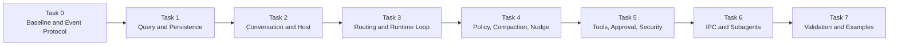

# Runtime Architecture Implementation Plan

## 1. Working Agreement

Every task follows the same review-gated process:

```text
Design discussion
    ↓
Resolve open questions
    ↓
Freeze interfaces and diagrams
    ↓
Explicit implementation approval
    ↓
Implement only the approved task
    ↓
Run focused validation
    ↓
Stop for review
```

Rules:

- Do not automatically continue into the next task.
- Do not implement a task while its listed questions remain unresolved.
- Do not silently invent behavior when a protocol or lifecycle semantic is unclear.
- Keep each implementation focused on the reviewed task boundary.
- Report changed files, public interfaces, validation results, and remaining risks after each implementation.
- Update architecture documentation when an approved decision changes an existing diagram or contract.
- The dedicated Novel domain model remains outside this implementation plan until separately reviewed.

## 2. Task Overview



## 3. Task 0: Code and Protocol Baseline

### 3.1 Task 0A: Existing Draft Cleanup

Purpose:

- Establish a clean starting point before adding new Runtime abstractions.
- Remove or isolate provisional code that conflicts with the accepted architecture.

Review before implementation:

- Whether `ResumeInputEvent` is removed from source and exports or retained only as non-public provisional code.
- Whether the existing Pi-coupled `BaseTool` draft is removed immediately or left untouched until the Tool task.
- Whether the existing `ToolDetails` draft is removed with `BaseTool` or retained as an undecided placeholder.
- Whether `@earendil-works/pi-agent-core` remains installed before the Pi Adapter task.
- Whether `typebox` remains installed before the Tool Schema task.

Current recommendation:

- Remove `ResumeInputEvent` from the first-version public protocol.
- Remove the current Pi-coupled Tool abstraction before implementing the new Tool boundary.
- Keep `@earendil-works/pi-agent-core` because Pi is the selected Agent foundation.
- Keep `typebox` provisionally because Tool parameter schemas are expected to use it.

Expected implementation boundary after approval:

- Cleanup only the explicitly approved provisional files and exports.
- Do not introduce Conversation, Runtime, Tool Registry, or IPC implementations.

### 3.2 Task 0B: Event Protocol

Purpose:

- Freeze the process-independent protocol shared by CLI, TUI, GUI, Web, local Runtime, child Runtime, persistence, and replay.

Design scope:

- `EventEnvelope`
- `InputEventSnapshot`
- `OutputEventSnapshot`
- `conversationId`
- `runId`
- `turnId`
- `toolCallId`
- `approvalRequestId`
- `sequence`
- `correlationId`
- `causationId`
- `schemaVersion`
- `InputReceipt`
- EventType naming conventions
- event serialization and validation
- payload redaction and size limits
- class-to-wire conversion boundaries

Questions to resolve before implementation:

1. Does one Conversation use one unified Journal sequence for inputs, outputs, and state transitions?
2. If output consumers observe gaps caused by non-output records, is that acceptable or should OutputEvent have a separate output sequence?
3. Does `InputReceipt` mean received, durably accepted, routed, or fully processed?
4. Which output event confirms durable acceptance of an InputEvent?
5. Is `inputEventSnapshot` optional, reduced, or replaced by a Journal reference?
6. What are the EventType prefix and versioning conventions?
7. Which runtime validates payload schemas at local, IPC, and persistence boundaries?
8. How are unknown future event types handled by older clients?

Expected deliverables after approval:

- protocol types
- event codecs or validators
- ID helpers
- snapshot rules
- event serialization tests
- protocol documentation

Explicitly excluded:

- ConversationRuntime
- Journal implementation
- Pi Adapter
- Tool execution
- IPC transport

## 4. Task 1: Query and Persistence

Purpose:

- Make durable Conversation history readable without creating a Runtime or child process.

Design scope:

- `WorkspaceStoreLocator`
- semantic Store directory naming
- `workspace-index.json` and explicit rebind
- `ConversationMetadataStore`
- `ConversationAgentBindingStore`
- `conversation_agent_bindings`
- `ConversationJournalService`
- `JournalReader`
- `JournalWriter`
- per-Conversation `messages.jsonl`
- `SnapshotStore`
- `ConversationEventHub`
- `ConversationQueryService`
- `events.list()`
- `events.subscribe()`
- catch-up-to-live subscription
- `storageDir` and `workdir`
- storage schema versions
- storage locking and ownership

Accepted decisions:

1. One canonical Workspace root maps to one semantic Store directory and one `novel.db`.
2. `workspace-index.json` owns the `workspaceRoot → workspaceId → storeDir` mapping; project moves use explicit rebind.
3. Conversation metadata and the unified Input/Output Journal use SQLite.
4. Every Conversation uses its own repairable `messages.jsonl` Runtime message projection.
5. The public observable history is `conversation.events`, containing persisted InputEvent and OutputEvent records.
6. Agent bindings are normalized into `conversation_agent_bindings`; one active binding is allowed per Conversation.
7. Persisted Agent bindings always contain an exact Agent type and definition version, while the upper layer resolves Prompt, Tools, Policy, and Provider.
8. Journal append succeeds before live publication or Message projection.
9. Snapshots accelerate restoration but never replace Journal history.
10. Runtime, Journal, Message, Snapshot, and Catalog ports use Promise-based asynchronous contracts.
11. The initial Node SQLite adapter follows Pi's boundary principle: Promise-based domain Storage ports encapsulate direct `DatabaseSync` calls without exposing synchronous database APIs to Core callers.
12. Task 1B does not introduce Storage Worker RPC or a generic thread pool. A Worker-backed adapter remains a compatible future optimization triggered by measured event-loop delay.
13. The project uses an async-first hybrid concurrency model: asynchronous system boundaries, one serialized Runtime state owner per active Conversation, synchronous lightweight domain computation, and Worker, process, or Rust-backed isolation only for measured heavy or blocking work.

Task breakdown:

- Task 1A: Workspace location, SQLite initialization, Conversation metadata, and Agent binding.
- Task 1B: Unified SQLite Journal, sequence allocation, idempotency, and history queries.
- Task 1C: Per-Conversation Messages JSONL, projection, validation, and Journal repair.
- Task 1D: ConversationEventHub, catch-up-to-live delivery, and backpressure.

Implementation status:

- Task 1A implemented: Workspace location, semantic Store naming, SQLite initialization, Conversation metadata, and single-active Agent binding persistence.
- Task 1B implemented and awaiting review: unified SQLite Input/Output Journal, per-Conversation Sequence allocation, Event ID idempotency, canonical JSON integrity, stable history pagination, unknown historical event replay, and shared Workspace Store ownership.
- Task 1C-A implemented and awaiting review: platform-neutral structured Logger, Core-owned RuntimeMessage envelope, strict Message Schema Registry, deterministic projector contracts, composite validation, and Core `user.message` projection.
- Task 1C-B implemented and awaiting review: JSONL Header, Message, and Checkpoint records, canonical encoding, injected SHA-256 hashing, Hash Chain validation, committed Checkpoint state, and valid trailing-record detection.
- Task 1C-C implemented and awaiting review: Node JSONL Store, safe Conversation paths, asynchronous chunk scanning, atomic append/replacement, same-process serialization, cross-process locking, and stable Message pagination.
- Task 1C-D implemented and awaiting review: projection maintenance contracts, deterministic IDs, Journal synchronization, repair, atomic rebuild, Projector migration, Schema protection, cancellation, and structured logs.
- Task 1C-E implemented and awaiting review: Projector/Schema-specific Node projection contexts, `SqliteWorkspaceStore` lifecycle ownership, public exports, documentation, and repeatable end-to-end smoke validation.
- Task 1D-A implemented and awaiting review: public Event filter, subscription, Hub, Journal publishing, and catch-up service contracts with strict option normalization and typed lifecycle errors.
- Task 1D-B implemented and awaiting review: fixed-capacity asynchronous FIFO subscriptions, direct pending-read delivery, overflow isolation, cancellation, single-consumer enforcement, and safe lifecycle logs.
- Task 1D-C implemented and awaiting review: process-local multi-Subscriber Event Hub, Conversation isolation, filter matching, Sequence continuity enforcement, defensive Event validation, and independent Subscriber failure.
- Task 1D-D implemented and awaiting review: Hub-first catch-up subscription, fixed Journal High Watermark replay, bounded paging, history-to-live transition, duplicate watermark suppression, and composite resume cursors.
- Task 1D-E implemented and awaiting review: persistence-first Journal publishing, per-Conversation append/publish serialization, immutable request capture, Receipt validation, duplicate suppression, live failure degradation, and close draining.
- Task 1D-F implemented and awaiting review: real SQLite append-to-live integration, Workspace reopen replay, catch-up continuity, Input/Output validation, lifecycle composition, public export review, documentation, and repeatable smoke coverage.

Task 1B concurrency boundary:

```text
Async ConversationJournalStore
    ↓
Direct Node SQLite adapter
    ↓
DatabaseSync
```

- `async` methods do not imply a Worker Thread and must not be described as non-blocking SQLite I/O.
- the Node adapter keeps SQL transactions small, result pages bounded, and JSON processing outside critical transactions where possible.
- Conversation, Runtime, Tool, Provider, Event, IPC, and Storage boundaries remain asynchronous even though the initial SQLite leaf implementation is synchronous.
- each active Conversation serializes Run, Turn, Context, control, and lifecycle state mutation; concurrent completion results re-enter that serialized transition path.
- pure in-memory validation, registry lookup, value conversion, and small state transitions remain synchronous rather than receiving artificial Promise wrappers.
- no Storage Worker, Worker RPC protocol, or connection pool is implemented in Task 1B.
- the database capability remains replaceable so a future Worker adapter can preserve the same Journal and Catalog interfaces.

Task 1B delivered:

- platform-neutral asynchronous Journal reader and writer ports
- persisted InputEvent and OutputEvent snapshots with Direction, Sequence, and RecordedAt
- strict canonical JSON serialization and SHA-256 integrity hashes
- SQLite schema migration V2 with Journal indexes and foreign keys
- atomic per-Conversation Sequence allocation and Event ID idempotency
- duplicate receipts and conflicting Event ID rejection
- strict known InputEvent writes and extensible unknown OutputEvent writes
- tolerant unknown historical InputEvent and OutputEvent replay
- corruption detection for JSON, hashes, envelopes, and extracted columns
- stable paginated queries with Start, End, After, Before, ThroughSequence, and filters
- `SqliteWorkspaceStore.open()` and `close()` ownership of one database connection, Catalog, and Journal
- focused temporary smoke validation without adding a new test framework

Explicitly excluded:

- per-Conversation `messages.jsonl` projection and Journal repair, deferred to Task 1C
- `ConversationEventHub`, follow subscription, catch-up-to-live, and backpressure, deferred to Task 1D
- Snapshot persistence contracts and implementations
- Agent execution
- Runtime activation
- Tool execution
- child processes

Task 1C checkpoints:

- Task 1C-A: RuntimeMessage domain protocol, schemas, deterministic projector contracts, and logging boundary.
- Task 1C-B: JSONL Header, Message, and Checkpoint records, canonical encoding, and hash chain.
- Task 1C-C: Node JSONL Store, path safety, async file access, atomic replacement, and locking.
- Task 1C-D: Journal catch-up, validation, repair, rebuild, and projector version handling.
- Task 1C-E: Node integration, exports, documentation, and focused end-to-end validation.

Task 1C-D implementation checkpoints:

- Task 1C-D1: maintenance contracts, health decisions, deterministic Runtime Message IDs, materialization, Clock, and typed errors.
- Task 1C-D2: bounded staging-file replacement writer and atomic streaming rebuild.
- Task 1C-D3: Journal pagination, initialization, catch-up, repair, rebuild, schema protection, logging, and validation.

Task 1C-A delivered:

- Core-owned `RuntimeMessageSnapshot` and `RuntimeMessageDraft` without Pi type leakage
- common User, Assistant, Tool, System, and Custom roles with extensible Message Type payloads
- strict RuntimeMessage envelope, role, timestamp, JSON-safety, registered payload, and version validation
- optional tolerant validation for unknown historical Message Types
- synchronous and deterministic `RuntimeMessageProjector` contract
- ordered `CompositeRuntimeMessageProjector` with strict draft validation and duplicate projector detection
- Core `user.message` Event to provider-independent User RuntimeMessage projection
- control and unrelated Events produce no Runtime Messages
- platform-neutral structured Logger and default `NoopLogger`
- privacy-safe per-Event debug logging that excludes Event and Message payloads

Task 1C-A explicitly excludes:

- `messages.jsonl` creation or reading
- Header, Message, and Checkpoint record formats
- file hashes, hash chains, truncation, locking, catch-up, repair, or rebuild
- Assistant and Tool Event definitions or Pi conversion
- live projection from `ConversationEventHub`

Task 1C-B delivered:

- platform-neutral Header, Message, and Checkpoint JSONL record contracts
- Workspace, Conversation, Projector ID, Projector Version, and format identity in the immutable Header
- explicit empty projection state represented by Header followed by Checkpoint zero
- Message records with cumulative Message Index and source Event Sequence, ID, Type, Direction, and Ordinal
- cumulative Checkpoint Sequence and Message Count as the projection batch commit marker
- platform-neutral synchronous `MessageProjectionHasher` port fixed to SHA-256 protocol semantics
- Canonical JSON encoding without newline or file-system assumptions
- record hashes calculated from Canonical JSON with `recordHash` omitted
- Header, Message, and Checkpoint participation in one PreviousHash chain
- strict RuntimeMessage validation on creation and configurable unknown historical Message reading
- cross-record identity, chain, Message Index, Message ID, Source Sequence, Source Event, Ordinal, and Checkpoint validation
- separate committed state and valid trailing-record state for future interrupted-write truncation
- privacy-safe typed protocol errors without Message or Event payloads

Task 1C-B explicitly excludes:

- Node `crypto` implementation of SHA-256
- JSONL file creation, reading, appending, scanning, truncation, or replacement
- Conversation path validation and directory ownership
- in-process or cross-process projection locks
- Journal catch-up and Runtime Message materialization
- automatic repair or rebuild
- info or debug logging from pure Codec and sequence validation functions

Task 1C-C delivered:

- Node `crypto` SHA-256 implementation for the platform-neutral Message projection Hasher
- traversal-safe `conversation-<sha256(conversationId)>` directory resolution
- asynchronous Buffer-chunk JSONL scanning with exact LF byte offsets and strict UTF-8 decoding
- `missing`, `valid`, `repairable_tail`, and `corrupted` file classification
- committed byte, record, Message, Checkpoint, and trailing-state reporting
- stable committed Message pagination with cumulative Message Index and optional High Watermark
- same-process per-Conversation keyed async mutex with concurrency across different Conversations
- cross-process `messages.lock` ownership, timeout, heartbeat, and stale-lock cleanup
- durable append and truncate with file `fsync`
- same-directory temporary writes, atomic replacement, and directory `fsync`
- stale Scan detection before explicit tail truncation
- structured lifecycle `info` and `debug` logs without Event, Message, prompt, Tool, credential, or novel payloads

Task 1C-C explicitly excludes:

- Journal reads or Journal-to-Message projection
- automatic catch-up, repair, rebuild, or projector-version migration
- automatic mutation during ordinary Scan or pagination
- `ConversationEventHub` subscription or catch-up-to-live delivery
- Runtime activation and provider message conversion
- aggregation into `SqliteWorkspaceStore`, deferred to Task 1C-E

Task 1C-D1 delivered:

- platform-neutral `ConversationMessageProjectionService` contract with `inspect`, `synchronize`, and forced `rebuild`
- `AbortSignal` support at the long-running projection-maintenance boundary
- explicit projection health states for missing, ready, behind, repairable tail, corruption, Projector mismatch, unavailable schemas, and Journal regression
- explicit recommended actions and composable maintenance-operation results
- pure synchronous `MessageProjectionMaintenancePlanner` with no I/O or file mutation
- Projector mismatch before incremental catch-up and Journal regression before tail truncation
- unknown committed Runtime Message Schema protection through `restore_schema` rather than silent deletion
- injectable `MessageProjectionClock` and default ISO wall-clock implementation
- deterministic SHA-256 Runtime Message IDs derived from Conversation, Projector, Event, Sequence, and Ordinal identity
- Runtime Message draft materialization with strict draft and snapshot schema validation
- typed maintenance, unavailable-schema, Journal-gap, cancellation, and invariant errors

Task 1C-D1 explicitly excludes:

- a concrete `ConversationMessageProjectionService` implementation
- Journal reads, pagination, continuity validation, and High Watermark capture
- Message File initialization, append, truncation, or replacement
- staging-file replacement and atomic streaming rebuild, deferred to Task 1C-D2
- automatic catch-up, repair, rebuild, and lifecycle logs, deferred to Task 1C-D3

Task 1C-D2 delivered:

- platform-neutral `MessageProjectionReplacementWriter` for sequential committed-batch streaming
- `LockedConversationMessageFile.replaceAtomically()` with mandatory Header and Checkpoint zero initialization
- same-directory `.messages.jsonl-<uuid>.rebuild` staging files with mode `0600`
- protocol-aware staging writes with Canonical JSON encoding and incremental sequence validation
- explicit rejection of empty batches, Header reuse, missing final Checkpoint, invalid chains, and concurrent writes
- immutable sequence-state snapshots for constructing the next Message and Checkpoint batch
- final staging file `fsync`, close, strict disk rescan, and in-memory versus disk-state comparison
- atomic rename to `messages.jsonl`, directory `fsync`, and final target rescan
- failed callback, validation, write, or cancellation cleanup while preserving the previous target file
- orphan staging-file cleanup under the existing per-Conversation exclusive lock
- compatibility `replace(records)` implemented through the new replacement transaction
- scanner collection controls so health and replacement scans do not retain complete Record or Message payload arrays
- privacy-safe replacement lifecycle debug logs and orphan-removal info logs

Task 1C-D2 memory boundary:

- encoded Record batches and Message payloads are retained only for the active append call
- ordinary health and replacement verification scans do not collect all Record or Message objects
- the protocol validator still retains a global Runtime Message ID Set for duplicate detection, so validation memory remains proportional to Message count rather than strictly constant

Task 1C-D2 explicitly excludes:

- Journal reads, High Watermark capture, or pagination
- Runtime Message projection or ID generation
- decisions about initialization, catch-up, truncation, Projector migration, or rebuild
- a concrete `ConversationMessageProjectionService`
- automatic maintenance lifecycle logs such as rebuild reason and processed Event counts
- staging-file resume; abandoned staging files are discarded because Journal remains the source of truth

Task 1C-D3 delivered:

- platform-neutral `JournalConversationMessageProjectionService` implementing `inspect`, `synchronize`, and forced `rebuild`
- non-mutating advisory inspection followed by mandatory lock-scoped reassessment before synchronization
- tolerant structural Scan plus strict committed-Schema Scan with repeated-generation detection
- dedicated `MessageProjectionAssessmentReader` separating advisory/lock-scoped assessment from mutation orchestration
- explicit protection for unknown committed Runtime Message Types without truncation or silent rebuild
- fixed Journal High Watermark capture for every synchronization or rebuild operation
- stable forward Journal pagination with configurable default page size 200
- strict page High Watermark, Conversation identity, Sequence continuity, page-size, `hasNext`, and appender-state validation
- shared page projection path for incremental catch-up and atomic staging-file rebuild
- dedicated locked-file appender adapter sharing the replacement-writer protocol with D2 rebuilds
- deterministic Event-to-RuntimeMessage materialization followed by Message and Checkpoint record creation
- Checkpoint-only batches for Journal Events that intentionally produce no Runtime Messages
- missing-file Header and Checkpoint-zero initialization followed by optional paged catch-up
- repairable-tail truncation followed by catch-up from the last committed Sequence
- automatic rebuild for corruption, Projector identity/version changes, and Journal regression
- forced rebuild that preserves the previous target until D2 atomically commits the staging file
- page-boundary cancellation for catch-up and replacement cleanup for canceled rebuilds
- typed Journal Watermark, unstable inspection, and per-Event projection errors without payload leakage
- structured inspection, page, initialization, catch-up, repair, Projector migration, corruption, regression, and rebuild logs
- maintenance results with operations, previous/final Sequence, fixed High Watermark, processed Event count, appended Message count, and rebuild reason

Task 1C-D3 commit boundary:

- an incremental page is projected completely before its Message and Checkpoint records are appended
- cancellation or projection failure before append leaves the current page uncommitted
- previously completed pages remain valid and resumable from their final Checkpoint
- rebuild failure or cancellation deletes the staging file and preserves the previous target

Task 1C-D3 explicitly excludes:

- `ConversationEventHub`, live follow, or Journal-append-triggered projection
- Runtime activation, Pi adapters, Provider Message conversion, or Tool execution
- Agent Binding selection; callers construct the Projector for the active binding
- automatic application-start maintenance policy
- aggregation into `SqliteWorkspaceStore`, deferred to Task 1C-E
- OutputEvent publication for maintenance progress

Task 1C-E delivered:

- public `NodeConversationMessageProjectionContext` exposing only `messages`, `projections`, and idempotent `close()`
- `CreateMessageProjectionContextOptions` accepting the active deterministic Projector and optional Agent-specific Runtime Message Schema Registry
- Core Runtime Message Schema Registry creation by default without silently merging caller-owned Agent Schema registries
- `NodeConversationMessageProjectionContextFactory` wiring SHA-256 hashing, projection Codec, JSONL Message Store, deterministic Runtime Message IDs, materialization, and Journal maintenance
- `SqliteWorkspaceStore.createMessageProjectionContext()` as the Node integration entry point
- Projector/Schema-specific contexts instead of one Workspace-global Message Store, allowing upper-layer Agent definitions to provide distinct Message types
- Workspace-owned tracking of every created projection Context
- idempotent Context and Workspace close behavior
- Workspace close ordering that rejects new Context creation, closes all Contexts, waits for active Message operations, and only then closes SQLite
- typed closing and closed Workspace lifecycle errors
- best-effort closure of all Contexts with aggregated lifecycle failures
- structured Context and Workspace lifecycle logs without Event, Message, prompt, novel, Tool, credential, or JSONL payloads
- repeatable real integration smoke using `NodeWorkspaceStoreLocator`, SQLite Catalog and Journal, Node JSONL Message Store, Core Projector, and Journal synchronization
- smoke validation for Workspace reopen, deterministic Message IDs, Projector-version rebuild, custom Agent Schema Registry, multiple Context coexistence, idempotent closure, automatic Context closure, lifecycle rejection, and log redaction

Task 1C-E ownership boundary:

```text
SqliteWorkspaceStore
    ├─ SQLite Conversation Catalog
    ├─ SQLite Conversation Journal
    └─ NodeConversationMessageProjectionContext*
           ├─ ConversationMessageFileStore
           └─ ConversationMessageProjectionService
```

- SQLite Journal and Workspace metadata are shared Workspace resources.
- JSONL Message Stores and projection services are owned by Projector/Schema-specific Contexts.
- Agent Binding lookup and Agent-definition resolution remain upper-layer responsibilities.
- a custom Runtime Message Schema Registry must include every Core and Agent Message Schema required to read the target projection history.
- closing a Context never closes the shared SQLite Journal.

Task 1C-E explicitly excludes:

- automatic Agent Binding lookup or Agent-definition resolution
- Runtime activation or Conversation command dispatch
- Pi or Provider Message conversion
- `ConversationEventHub`, live Journal follow, or append-triggered synchronization
- automatic application-start projection maintenance
- OutputEvent publication for projection maintenance
- CLI, TUI, GUI, or Web commands and views

Task 1D delivered:

- platform-neutral `ConversationEventHub`, `ConversationEventSubscription`, `ConversationEventSubscriptionService`, and `ConversationJournalService` contracts
- strict subscription cursors for `{ from: "start" }`, `{ from: "latest" }`, and `{ afterSequence }`
- normalized Event filters covering direction, Event Types, Run ID, and Turn ID
- independent bounded per-Subscriber queues with no silent Event dropping
- process-local `InMemoryConversationEventHub` with Conversation Channel isolation and monotonic Sequence validation
- Hub-first `JournalConversationEventSubscriptionService` that captures a fixed Journal High Watermark after establishing its live subscription
- pull-based historical paging followed by buffered live delivery without an observable gap
- `PublishingConversationJournalService` that captures an immutable request, serializes append and publish per Conversation, and persists before live publication
- explicit durable versus live result semantics: `published`, `skipped duplicate`, or `failed` with safe error identity
- duplicate Journal appends that preserve the durable Event but never republish it
- idempotent close behavior and closing/closed rejection for publishing and subscription services
- structured logs containing identifiers, Sequence, status, and counts without Event payloads, prompts, novel content, Tool data, credentials, or error details
- real SQLite integration smoke covering history, live buffering during catch-up, continuous Sequence delivery, duplicate suppression, Workspace reopen, `afterSequence` recovery, and Input/Output Events

Task 1D append and follow boundaries:

```text
append request
    → per-Conversation serializer
    → SQLite Journal append
    → persisted Event snapshot
    → process-local Event Hub publish

subscribe cursor
    → establish bounded Hub subscription
    → capture Journal High Watermark
    → page history through fixed watermark
    → drain buffered newer Events
    → continue live delivery
```

Task 1D close order used by the integration composition:

```text
PublishingConversationJournalService.close()
    → JournalConversationEventSubscriptionService.close()
    → InMemoryConversationEventHub.close()
    → SqliteWorkspaceStore.close()
```

Task 1D explicitly excludes:

- `ConversationHost`, Runtime activation, idle eviction, or process placement
- automatic Message projection after Journal append
- Pi adapters, Provider calls, Tool execution, Approval, or Nudge behavior
- IPC and child-process forwarding
- durable Event storage in the Hub
- ownership of live services by `SqliteWorkspaceStore`

## 5. Task 2: Conversation and Host

Purpose:

- Establish the public Conversation Handle and the services that separate querying from execution commands.

Design scope:

- `Conversation`
- `LocalConversation`
- `ConversationProxy` interface boundary
- `ConversationInput`
- `ConversationEvents`
- `ConversationQueryService`
- `ConversationCommandService`
- `ConversationHost`
- `RuntimePresence`
- `ConversationStatus`
- `RunStatus`
- `RuntimeBootstrap`
- runtime placement abstraction
- lazy Runtime activation

Task breakdown:

- Task 2A: platform-neutral Conversation protocol, bound Input/Events APIs, durable Snapshot, Runtime Presence, and service ports.
- Task 2B: read-only LocalConversation query path backed by Catalog, Journal, and catch-up subscriptions without Runtime activation.
- Task 2C: command acceptance, Input Journal persistence, and lazy Host activation boundary.
- Task 2D: Host lifecycle skeleton, Runtime Presence tracking, Runtime Bootstrap contract, and placement abstraction.
- Task 2E: no-process replay and local Handle lifecycle integration validation.

Implementation status:

- Task 2A implemented and awaiting review: `Conversation` interface, bound `ConversationInput` and `ConversationEvents`, durable `ConversationSnapshot`, placement-neutral `RuntimePresence`, query/command/presence service ports, lifecycle errors, public exports, and protocol smoke validation.
- Task 2B implemented and awaiting review: Storage-backed Query Service, verified LocalConversation Factory, bound local Input and Events adapters, defensive durable Snapshots, managed Subscription ownership, idempotent Handle lifecycle, SQLite no-Runtime replay validation, and log redaction.
- Task 2C implemented and awaiting review: durable Command Service, Input schema validation, post-persistence payload-free Host notification, Core route policy, atomic archived/disposed rejection, duplicate recovery signaling, structured logs, and real SQLite integration validation.
- Task 2D-A implemented and awaiting review: platform-neutral Host, activation, shutdown, Bootstrap Factory, Placement, Runtime Handle, input-reference, safe exit, and stable error protocols with executable fake composition validation.
- Task 2D-B implemented and awaiting review: narrow Snapshot Reader, storage-backed immutable Bootstrap Factory, durable accepted-input verification, workdir-only Workspace projection, High Watermark validation, safe errors and logs, and real SQLite integration validation.
- Task 2D-C implemented and awaiting review: managed per-Conversation Runtime Slots, bounded Control and Runtime queues, single-flight activation, logical Presence tracking, payload-free dispatch, shutdown, close, stale-exit protection, safe logs, and lifecycle smoke validation.

Resolved through Task 2C:

- user messages, Context commands, and registered extension inputs request Runtime activation.
- Stop and config reload are Host routes and do not activate an offline Runtime.
- durable Journal acceptance happens before Host notification.

Questions remaining for Task 2D and Task 3 review:

1. Can one Conversation have more than one concurrent active Run?
2. Does each accepted user message always create a new Run?
3. How is an active Runtime located and addressed?
4. When may the Host evict an idle Runtime?
5. What automatic recovery behavior follows a Runtime crash?
6. Which parts of RuntimeBootstrap are loaded from Snapshot versus configuration?
7. How is Conversation access authorization represented without coupling Core to one UI?

Expected deliverables after approval:

- public Conversation interfaces
- local Conversation implementation
- query and command service interfaces
- Host lifecycle skeleton
- Runtime presence tracking
- Runtime bootstrap contract
- no-process replay integration tests

Explicitly excluded:

- complete Agent execution loop
- full IPC process implementation

Task 2A accepted decisions:

- `Conversation` is an interface rather than an abstract base class.
- a Conversation Handle binds its ID into Input and Event operations.
- callers of `conversation.events` cannot override `conversationId`.
- `ConversationSnapshot` contains durable Conversation metadata and the active Agent Binding only.
- Runtime presence is queried separately and exposes no process or transport identity.
- `ConversationInput.enqueue()` resolves only after durable input acceptance and returns `Promise<InputReceipt>`.
- closing a Handle does not archive, dispose, delete, or close shared Host resources.

Task 2A explicitly excludes:

- `LocalConversation` and `ConversationProxy` implementations
- Runtime activation, Runtime Bootstrap, and Runtime placement
- Run state and concurrent Run policy
- Stop and Interrupt semantics
- access authorization
- IPC transport

Task 2B delivered:

- `StorageConversationQueryService` combining Conversation Catalog, Journal Reader, and catch-up Subscription Service ports
- durable Snapshot lookup with `ConversationNotFoundError` normalization
- independent frozen Metadata and active Agent Binding copies
- bound list and subscription option construction that writes the Handle Conversation ID last
- `LocalConversationFactory.open()` existence verification without Runtime activation
- `LocalConversation` implementing the public Handle through injected query, command, and presence ports
- `LocalConversationInput` delegation without a fake production Command Service
- `LocalConversationEvents` list and subscribe delegation with Handle-owned Subscription tracking
- `ManagedConversationEventSubscription` cleanup on completion, failure, return, or close
- Handle close that rejects new operations, closes all owned Subscriptions, aggregates multiple failures, and never closes shared services
- structured Handle and query logs without Event payload, novel text, prompt, Tool, credential, or error details
- real SQLite integration smoke covering parent metadata, Agent Binding, history, live follow, cross-Conversation isolation, shared-service survival, and zero command invocation

Task 2B ownership boundary:

```text
LocalConversation
    ├─ owns LocalConversationInput adapter
    ├─ owns LocalConversationEvents adapter
    └─ owns only Subscriptions created through that Handle

LocalConversation does not own
    ├─ ConversationQueryService
    ├─ ConversationCommandService
    ├─ ConversationRuntimePresenceReader
    ├─ Journal or Event Hub
    └─ Workspace Store
```

Task 2B explicitly excludes:

- concrete `ConversationCommandService` implementation
- `ConversationHost`, lazy Runtime activation, and Runtime Bootstrap
- production Runtime Presence tracking
- Run state and concurrent Run policy
- Stop and Interrupt semantics
- IPC-backed `ConversationProxy`
- access authorization
- automatic Message projection
- Tool pipeline
- Subagent execution

Task 2C delivered:

- `StorageConversationCommandService` implementing the existing platform-neutral command port
- bound InputEvent snapshot capture and strict configured-schema validation before persistence
- durable `InputReceipt` mapping where accepted and duplicate never imply Runtime or Agent completion
- `ConversationInputRoutePolicy` and Core routing for Runtime-required, Host stop, and Host config inputs
- payload-free `AcceptedConversationInputSignal` carrying durable Journal identity and route metadata
- best-effort idempotent Host notification after persistence for both appended and duplicate inputs
- notification and live-publication failure degradation without rolling back durable acceptance
- SQLite transaction status enforcement for new InputEvents targeting archived or disposed Conversations
- duplicate-before-status ordering so retries preserve the original durable Receipt after archival
- structured command logs without Event payload, user text, config, prompt, Tool, credential, or error details
- real SQLite smoke coverage for persist-before-notify, routing, duplicate recovery, conflicts, concurrent Sequence allocation, status rejection, failure degradation, and redaction

Task 2C accepted decisions:

- `user.message`, `context.clear`, `context.compact`, and registered extension inputs require Runtime activation.
- `system.stop` and `command.config.reload` are Host routes and never activate an offline Runtime.
- persistence always precedes Host notification and future Runtime activation.
- `InputReceipt` reports durable Journal acceptance only.
- a failed Host notification or Runtime activation cannot roll back an accepted InputEvent.
- Task 2C creates no Run or Turn and does not decide whether each user message creates a new Run.
- no generic acceptance OutputEvent is emitted; semantic completion belongs to later Input-response events.

Task 2C explicitly excludes:

- concrete `ConversationHost` scheduling and activation
- production Runtime Presence tracking
- Runtime Bootstrap and placement
- Stop cancellation and config application
- Run and Turn state
- Context clear or compaction execution
- automatic Runtime Message projection
- IPC-backed `ConversationProxy`

Task 2D implementation breakdown:

- Task 2D-A: Host, activation, Bootstrap, Placement, Runtime Handle, exit, shutdown, and error protocols.
- Task 2D-B: Storage-backed immutable Bootstrap Factory with workdir and Journal High Watermark boundaries.
- Task 2D-C: Managed Host Runtime Slot state machine, single-flight activation, Presence tracking, queued accepted-input scheduling, shutdown, and close.
- Task 2D-D: Host-route dispatch, lifecycle OutputEvents, failure degradation, and safe observability.
- Task 2D-E: focused Host lifecycle integration followed by the separate Task 2E LocalConversation no-process integration checkpoint.

Task 2D-A delivered:

- `ConversationHost` extending accepted-input notification and logical Runtime Presence reading
- discriminated accepted-input, explicit-restore, and crash-recovery activation requests
- stable activated or reused activation results without exposing Runtime instance or placement identity
- payload-free `ConversationRuntimeInputReference` using durable Journal Sequence identity
- serializable Core `ConversationRuntimeBootstrap` with Snapshot, workdir, activation cause, and Journal High Watermark
- `ConversationRuntimeBootstrapFactory` and placement-neutral `ConversationRuntimePlacement` ports
- `ConversationRuntimeHandle` with dispatch, idempotent shutdown expectations, and exit observation
- safe stopped or crashed Runtime exit snapshots without raw error details
- stable shutdown reasons and stopped or already-offline results
- Host lifecycle, activation, dispatch, and Handle mismatch errors with stable codes
- root Core exports, executable fake protocol composition, documentation, and repeatable smoke validation

Task 2D-A accepted decisions:

- Conversation Host directly implements the accepted-input Notifier and Runtime Presence Reader ports.
- Host notification acknowledges process-local scheduling only.
- Runtime Handle receives durable Input references and never InputEvent payload copies.
- Bootstrap exposes `workdir` but never Store or database paths.
- Agent Binding identity remains inside the Conversation Snapshot; prompts, Tools, Providers, and credentials remain outside the Bootstrap protocol.
- Host owns Runtime Handles but does not own a shared Runtime Placement.
- Task 2D-A defines no production Host, Presence transition, lifecycle OutputEvent, recovery loop, idle timer, or processed-input cursor.

Task 2D-A explicitly excludes:

- `ManagedConversationHost`
- `StorageConversationRuntimeBootstrapFactory`
- Runtime Slot and per-Conversation scheduling queues
- concrete Runtime Presence tracking
- Runtime activation or local Runtime implementation
- Stop and reload-config Host handlers
- Runtime lifecycle OutputEvents
- historical pending-input reconciliation and Runtime checkpoints
- idle eviction and automatic crash restart

Task 2D-B delivered:

- narrow `ConversationSnapshotReader` implemented by the existing `ConversationQueryService`
- `StorageConversationRuntimeBootstrapFactory` backed by Snapshot, Journal Reader, and Workspace Location ports
- Host-owned Runtime instance ID and activation-time preservation without Factory-side identity generation
- active Conversation, active Agent Binding, Conversation identity, and Workspace identity validation
- exact accepted-input Journal validation for direction, Sequence, Event ID, Event Type, and optional correlation metadata
- explicit restore and crash recovery Bootstrap creation without synthetic Input references
- Journal High Watermark validation allowing concurrent append advancement beyond Snapshot Metadata Sequence
- workdir projection from Workspace root without retaining Store directory or database paths
- defensive copies and freezing for every Bootstrap object boundary
- stable Bootstrap validation, status, Workspace, Input, and High Watermark errors
- structured Bootstrap logs with invalid identifiers normalized to `unknown` and no paths or payloads
- real SQLite integration smoke covering normal activation, restore, recovery, stale Snapshot observation, all rejection paths, defensive freezing, and redaction

Task 2D-B accepted decisions:

- Runtime instance ID and `activatedAt` are generated by the future Host, not the Bootstrap Factory.
- Bootstrap Factory depends on the narrow Snapshot Reader rather than the complete Query Service.
- accepted-input activation must re-read and exactly match the durable Journal InputEvent reference.
- Snapshot and Journal High Watermark reads are separate and need not report equal Sequence values.
- Bootstrap Journal High Watermark is authoritative for the captured replay boundary.
- Bootstrap output is fully defensively copied and frozen.

Task 2D-B explicitly excludes:

- Runtime identity generation and Clock implementation
- `ManagedConversationHost`
- Runtime Slot and scheduling queues
- Placement activation and Runtime Handle creation
- Runtime Presence transitions
- Stop and reload-config handling
- lifecycle OutputEvents
- historical pending-input reconciliation and Runtime checkpoints
- idle eviction and automatic crash restart

Task 2D-C delivered:

- `ManagedConversationHost` implementing accepted-input notification, Runtime Presence reading, activation, shutdown, and close
- Host-local per-Conversation operation serialization with cross-Conversation concurrency
- bounded Control and Runtime signal queues with Control-first, Priority-descending, Sequence-ascending scheduling
- defensive accepted-signal capture, payload-free fingerprints, duplicate wake-up behavior, conflict rejection, and explicit queue overflow
- single-flight Runtime activation using Host-owned Clock, Runtime instance ID generation, Bootstrap Factory, and Placement
- Handle identity validation, best-effort replacement shutdown, and stable activation degradation
- logical offline, starting, online, stopping, and crashed Presence transitions without exposing placement identity
- payload-free Runtime input dispatch with pending retention after failure and revision-gated wake-up retry
- injected narrow `ConversationHostControlDispatcher` context without exposing the Runtime Handle
- generation- and Runtime-ID-protected exit observation with stale exit suppression
- explicit serialized shutdown and idempotent best-effort Host close with failure aggregation
- structured lifecycle logs without payloads, prompts, configs, Tool data, credentials, paths, messages, stacks, causes, or stderr
- lifecycle smoke coverage for activation, reuse, Control preemption, duplicate idempotency, dispatch recovery, crash recovery, if-online behavior, mismatch rejection, bounded queues, shutdown, close, and redaction

Task 2D-C accepted decisions:

- `notifyAccepted()` acknowledges scheduling only and never waits for activation or Runtime dispatch.
- Control and Runtime signals use independent bounded queues; Control is always selected first.
- identical Sequence fingerprints are idempotent, while conflicting identities are rejected.
- a duplicate pending notification is also a retry wake-up after a prior drain failure.
- Runtime dispatch failure keeps Presence online, leaves the Signal pending, and does not create an automatic retry loop.
- a crashed Slot activates only when a new required Signal or explicit activation requests recovery.
- Runtime `if_online` inputs never activate an offline Runtime.
- Host control dispatch receives a narrow optional Runtime command target rather than the full Handle.
- Host close owns Slots and Handles only; shared placement, storage, query, and event services remain externally owned.

Task 2D-C explicitly excludes:

- concrete Stop cancellation and queued-input clearing
- ReloadConfig application
- Runtime lifecycle and InputResponse OutputEvents
- durable processed-input checkpoints and Host-restart pending-input reconciliation
- automatic crash retry, backoff, or idle eviction
- Runtime execution, Run/Turn state, Context operations, Pi, Tools, Approval, IPC, and Subagents

## 6. Task 3: Input Routing and Runtime Loop

Purpose:

- Execute accepted inputs without deadlocking control events while a Turn, Tool, or Interaction is waiting.

Design scope:

- `ConversationRuntime`
- `InputRouter`
- Control Lane
- Turn Lane
- `RunStateMachine`
- `TurnController`
- `StopInputEvent` semantics
- future `InterruptInputEvent` semantics
- cancellation propagation
- Pi Agent Core Adapter foundation
- base `ContextCompiler`
- Runtime-to-Journal event sink

Questions to resolve before implementation:

1. Does Stop cancel only the active Run or also queued Turn inputs?
2. Does Stop always cancel all child Conversations?
3. How is an unfinished Assistant draft handled after cancellation?
4. What exactly does Interrupt cancel compared with Stop?
5. Does an appended user message steer the current Run or create a later Run?
6. How does a Tool receive and acknowledge cancellation?
7. How do Pi's internal model calls map to core-owned `turnId` values?
8. Which Pi messages enter canonical history?
9. Which Runtime state is persisted after each Turn boundary?
10. What happens when the Journal append acknowledgement fails during execution?

Expected deliverables after approval:

- Runtime execution skeleton
- control and turn routing
- Run state transitions
- stop and cancellation path
- Pi Adapter foundation
- base Context compilation
- focused routing and cancellation tests

Explicitly excluded:

- Runtime policies
- Context Compaction
- Nudge delivery
- Tool implementation beyond temporary test doubles
- child-process transport

## 7. Task 4: Policy, Compaction, and Nudge

Purpose:

- Evaluate Runtime conditions, compact model context without deleting history, and inject one-shot System Reminders.

Design scope:

- `RuntimePolicyEngine`
- `RuntimePolicy`
- `RuntimePolicyContext`
- `RuntimePolicyState`
- `RuntimePolicyEffect`
- `RuntimeEffectCoordinator`
- `ContextPressurePolicy`
- `ContextCompactionManager`
- `ContextCompactor`
- `ContextCheckpoint`
- `NudgeManager`
- `PendingNudgeStore`
- `NudgeEffect`
- per-call System Prompt Overlay
- compaction and Nudge lifecycle events

Questions to resolve before implementation:

1. What are the soft context reminder, compaction, and hard context thresholds?
2. What post-compaction target ratio is desired?
3. How many new uncompacted tokens are required before another compaction?
4. Which messages and Runtime facts are always pinned?
5. What structured fields belong in `ContextCheckpoint`?
6. Does compaction use the active Provider, a dedicated model, or a pluggable Compactor?
7. How is a Compaction result validated before becoming active?
8. How many Nudges may be injected into one Provider call?
9. How are Nudge priority, deduplication, cooldown, and expiry configured?
10. When is a Nudge considered delivered: context compilation, stream creation, or Provider dispatch?
11. How is a leased Nudge recovered if dispatch fails?
12. Which Policy evaluation events are public OutputEvents versus internal traces?

Expected deliverables after approval:

- pure Policy evaluation engine
- typed Effect routing
- durable ContextCheckpoint creation
- Pi `transformContext()` projection
- Pending Nudge lifecycle
- one-shot System Prompt Overlay
- lifecycle OutputEvents
- compaction and one-shot delivery tests

Explicitly excluded:

- generic Pause or Resume
- Novel-specific context schema
- Tool Permission policies
- Subagent scheduling policies unless separately reviewed

## 8. Task 5: Tools, Approval, and Security

This task has two separate review gates.

### 8.1 Task 5A: Tool Definition and Registry

Purpose:

- Define core-owned Tool contracts without leaking Pi types.

Design scope:

- `ToolDescriptor`
- `ToolHandler`
- `RegisteredTool`
- `ToolRegistry`
- `ToolRegistryView`
- Tool Group Manifest
- YAML loading and validation
- `PiToolAdapter`
- Tool Result
- Tool incremental update
- Tool Error
- optional Tool Details

Questions to resolve before implementation:

1. What are the final YAML Manifest fields?
2. Which fields belong in YAML versus TypeScript registration code?
3. Is TypeBox the required parameter-schema representation?
4. Does `ToolDetails` remain an abstract base, a generic type, or no common abstraction?
5. What is the successful Tool Result contract?
6. How are streaming updates represented?
7. How do Registry merge conflicts resolve?
8. How are Tool Group views and Conversation allowlists constructed?
9. How does Tool versioning work if a descriptor changes?

Expected deliverables after approval:

- core-owned Tool types
- Tool Registry and scoped views
- Manifest loader and validation
- Pi Tool Adapter
- registry and conversion tests

### 8.2 Task 5B: Execution, Approval, and Sandbox

Purpose:

- Execute Tools through one security and observability pipeline.

Design scope:

- `ToolDispatcher`
- Tool Execution Pipeline
- argument validation
- `PermissionPolicy`
- `InteractionCoordinator`
- Approval Input and Output Events
- `SandboxExecutor`
- timeout and cancellation
- Tool Trace
- result normalization
- structured error normalization

Questions to resolve before implementation:

1. Where do `allow`, `ask`, and `deny` rules come from?
2. What does approve once authorize exactly?
3. Does a changed Tool argument require a new approval request?
4. What is the initial Sandbox implementation?
5. Which Tools are non-interruptible, cancel-only, restartable, or checkpointable?
6. How are partially completed side effects reported?
7. How does the Runtime decide whether to retry a retryable ToolError?
8. How are multiple simultaneous approvals displayed and resolved?
9. How is the approving actor derived from trusted transport metadata?
10. What trace data is persisted and what data must be redacted?

Expected deliverables after approval:

- Tool execution facade and middleware pipeline
- permission evaluation
- event-based approval
- sandbox port and initial implementation
- cancellation and timeout behavior
- Tool trace persistence
- security and approval tests

## 9. Task 6: IPC and Subagents

This task has two separate review gates.

### 9.1 Task 6A: IPC and Process Management

Purpose:

- Run ConversationRuntime outside the Host process without changing the public Conversation API.

Design scope:

- transport-independent request, response, and event messages
- protocol version negotiation
- JSONL stdio transport candidate
- `ConversationProxy`
- child Runtime bootstrap
- process supervisor
- heartbeat and health state
- Runtime command routing
- cancellation protocol
- Journal append request and acknowledgement
- graceful shutdown and crash recovery

Questions to resolve before implementation:

1. Is JSONL over stdio the initial transport?
2. Does one child process host one Runtime or multiple Runtimes?
3. Which component owns Provider credentials and how are they transferred?
4. How often are heartbeats sent and when is a process considered dead?
5. How many automatic restart attempts are allowed?
6. How are duplicate requests detected after reconnect?
7. How are in-flight Tool and Interaction states restored after a crash?
8. How is IPC backpressure handled?
9. Which messages require durable acknowledgement?
10. How are incompatible protocol versions rejected?

Expected deliverables after approval:

- transport interfaces
- initial IPC protocol
- child Runtime entrypoint
- process supervisor
- ConversationProxy transport implementation
- heartbeat, cancellation, and recovery tests

### 9.2 Task 6B: Subagent Management

Purpose:

- Create, observe, cancel, and recover child Conversations through the same Host and Runtime abstractions.

Design scope:

- `ChildConversationManager`
- `SubagentRequest`
- `SubagentResult`
- parent and child Conversation metadata
- parent projection OutputEvents
- Conversation tree query and subscription
- child placement policy
- resource and concurrency limits
- cancellation propagation
- child restoration

Questions to resolve before implementation:

1. How does a child return its final result to the parent?
2. Which child events are projected into parent output?
3. Can a Subagent create another Subagent?
4. What is the maximum tree depth?
5. What is the maximum child concurrency per Run and globally?
6. What happens to children when the parent completes, fails, stops, or crashes?
7. Are child Tool permissions inherited, reduced, or independently configured?
8. Does each child use a separate Context and Nudge policy state?
9. How is orphaned child work detected and reclaimed?
10. How does a debugging client subscribe to the whole Conversation tree?

Expected deliverables after approval:

- child Conversation creation and metadata
- parent-child lifecycle manager
- result delivery
- parent projection events
- tree observation
- resource-limit and cancellation tests

## 10. Task 7: Validation, Examples, and Documentation

Purpose:

- Verify that the shared Core architecture works consistently for CLI, TUI, GUI, and Web clients.

Validation scope:

- type checking
- Event serialization and schema validation
- Journal append and recovery
- replay without Runtime activation
- catch-up-to-live subscription continuity
- Runtime activation and idle eviction
- Control Lane responsiveness
- Stop and Interrupt cancellation
- Approval persistence and restoration
- Context Compaction and Checkpoint application
- one-shot System Reminder delivery and disappearance
- Tool Permission and Sandbox behavior
- IPC reconnect and crash recovery
- Subagent lifecycle and parent projection

Example scope:

- in-memory Conversation example
- local persisted Conversation example
- child-process Conversation example
- read-only replay example
- event-based Approval example
- one-shot Nudge example
- Context Compaction example
- Subagent example
- CLI, GUI, and Web integration notes

Questions to resolve before implementation:

1. Which test framework and test directory conventions are used?
2. Which scenarios are required as acceptance tests for the first Runtime release?
3. Are examples executable packages, test fixtures, or documentation snippets?
4. Which performance and memory baselines are measured?
5. Which failure-injection scenarios are required?

Expected deliverables after approval:

- focused unit and integration tests
- executable reference examples
- updated architecture diagrams
- protocol documentation
- client integration guidance
- first-release acceptance checklist

This task does not implement full CLI, GUI, or Web products. It verifies that each can use the same Core contracts.

## 11. Review Checkpoints

Implementation pauses for review after each checkpoint:

```text
Checkpoint 0A: provisional-code cleanup
Checkpoint 0B: event protocol
Checkpoint 1: query and persistence
Checkpoint 2: Conversation and Host
Checkpoint 3: routing and Runtime loop
Checkpoint 4: Policy, Compaction, and Nudge
Checkpoint 5A: Tool definition and registry
Checkpoint 5B: Tool execution and Approval
Checkpoint 6A: IPC and process management
Checkpoint 6B: Subagent management
Checkpoint 7: validation and examples
```

At every checkpoint, the review report includes:

- accepted decisions
- unresolved decisions
- changed public interfaces
- changed files
- validation performed
- known limitations
- proposed next task

No next checkpoint begins without explicit approval.

## 12. Current Position

Task 0, Task 1A through Task 1D-F, Task 2A through Task 2C, and Task 2D-A through Task 2D-C have been implemented and are awaiting checkpoint review.

Completed Task 1 results include:

- Workspace-to-Store location, semantic naming, explicit rebind, and SQLite lifecycle
- Conversation metadata and normalized versioned Agent bindings
- unified Input/Output Journal with durable Sequence and idempotent Event identity
- public read-only Journal history that does not activate Runtime
- repairable per-Conversation Runtime Message JSONL projections
- projection validation, synchronization, repair, migration, and atomic rebuild
- process-local live Event fan-out with bounded Subscriber backpressure
- Journal catch-up-to-live delivery with reconnectable Sequence cursors
- persistence-first Event publication with per-Conversation serialization
- real SQLite end-to-end replay, reopen, duplicate, and live-follow smoke validation

The next reviewed step is Task 2D-C: `ManagedConversationHost`, per-Conversation Runtime Slots, single-flight activation, queued accepted-input scheduling, Runtime Presence transitions, explicit shutdown, stale-exit generation protection, and Host close lifecycle. Queue ownership, activation failure behavior, duplicate Sequence handling, stopping-state inputs, and Placement Handle validation must be confirmed before implementation.
