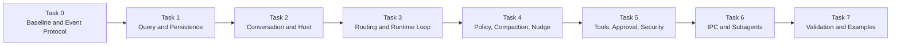

# Runtime Architecture Implementation Plan

## 1. Autonomous Working Agreement

The repository-level execution rules are authoritative in `AGENTS.md`. The implementation plan uses the following autonomous, plan-first cycle:

### 1.1 Non-negotiable Continuation Requirements

1. The agent has sufficient authority to autonomously advance the documented work required to complete Task 1 through Task 7, but that authority never extends beyond the currently selected documented step.
2. After every context compression or reset, the agent must re-read `AGENTS.md`, this implementation plan, `docs/architecture.md`, applicable nested instructions, `git status`, and recent history before deciding what to implement.
3. Before every implementation, the agent must publish the concrete plan for exactly one next step; implementation begins only after that plan is recorded, while user approval is required only for a genuinely unresolved architectural decision.
4. Every completed step must be validated and committed immediately as one focused commit before another implementation step begins. Completed Task 1 through Task 7 checkpoints must not be left as uncommitted work or silently combined across step boundaries.

```text
Recover repository context when required
    ↓
Read the active task and architecture boundary
    ↓
Publish one concrete next-step plan
    ↓
Implement only that documented step
    ↓
Run focused and complete validation
    ↓
Update documentation and review the diff
    ↓
Commit the completed step immediately
    ↓
Report the commit and next-step plan
```

Rules:

- The agent may autonomously continue through the incomplete documented steps required to finish Task 1 through Task 7.
- Autonomy is limited to the currently planned task step; do not implement adjacent future steps or unrelated work in the same change.
- Every implementation step requires a specific published plan before editing begins.
- Every completed implementation step must be validated, documented where required, and committed immediately as one focused commit.
- After context compression, reset, goal resumption, or scope uncertainty, re-read `AGENTS.md`, this implementation plan, `docs/architecture.md`, applicable nested instructions, `git status`, and recent history before continuing.
- Do not implement a task while its listed questions remain unresolved.
- Do not silently invent behavior when a protocol or lifecycle semantic is unclear.
- If an unresolved decision blocks safe implementation, stop autonomous progress and ask the user.
- Keep each implementation focused on the documented task boundary and do not reopen completed checkpoints without a concrete compatibility need.
- Report the commit, changed public interfaces, validation results, remaining risks, and the next step plan after each implementation.
- Update architecture documentation whenever an implementation changes an accepted diagram, contract, lifecycle, or task status.
- The dedicated Novel domain model remains outside this implementation plan until separately reviewed.

Execution continues from the repository's recorded current position. Completed Task 1 and Task 2 checkpoints are not repeated; remaining checkpoints proceed in documented dependency order through Task 7.

## 2. Task Overview



## 3. Task 0: Code and Protocol Baseline

### 3.1 Task 0A: Existing Draft Cleanup

Purpose:

- Establish a clean starting point before adding new Runtime abstractions.
- Remove or isolate provisional code that conflicts with the accepted architecture.

Review before implementation:

- Whether `ResumeInputEvent` is removed from source and exports or retained only as non-public provisional code.
- Whether the existing Pi-coupled `BaseTool` draft is removed immediately or left untouched until the Tool task.
- Whether the existing `ToolDetails` draft is removed with `BaseTool` or retained as an undecided placeholder.
- Whether `@earendil-works/pi-agent-core` remains installed before the Pi Adapter task.
- Whether `typebox` remains installed before the Tool Schema task.

Current recommendation:

- Remove `ResumeInputEvent` from the first-version public protocol.
- Remove the current Pi-coupled Tool abstraction before implementing the new Tool boundary.
- Keep `@earendil-works/pi-agent-core` because Pi is the selected Agent foundation.
- Keep `typebox` provisionally because Tool parameter schemas are expected to use it.

Expected implementation boundary after approval:

- Cleanup only the explicitly approved provisional files and exports.
- Do not introduce Conversation, Runtime, Tool Registry, or IPC implementations.

### 3.2 Task 0B: Event Protocol

Purpose:

- Freeze the process-independent protocol shared by CLI, TUI, GUI, Web, local Runtime, child Runtime, persistence, and replay.

Design scope:

- `EventEnvelope`
- `InputEventSnapshot`
- `OutputEventSnapshot`
- `conversationId`
- `runId`
- `turnId`
- `toolCallId`
- `approvalRequestId`
- `sequence`
- `correlationId`
- `causationId`
- `schemaVersion`
- `InputReceipt`
- EventType naming conventions
- event serialization and validation
- payload redaction and size limits
- class-to-wire conversion boundaries

Questions to resolve before implementation:

1. Does one Conversation use one unified Journal sequence for inputs, outputs, and state transitions?
2. If output consumers observe gaps caused by non-output records, is that acceptable or should OutputEvent have a separate output sequence?
3. Does `InputReceipt` mean received, durably accepted, routed, or fully processed?
4. Which output event confirms durable acceptance of an InputEvent?
5. Is `inputEventSnapshot` optional, reduced, or replaced by a Journal reference?
6. What are the EventType prefix and versioning conventions?
7. Which runtime validates payload schemas at local, IPC, and persistence boundaries?
8. How are unknown future event types handled by older clients?

Expected deliverables after approval:

- protocol types
- event codecs or validators
- ID helpers
- snapshot rules
- event serialization tests
- protocol documentation

Explicitly excluded:

- ConversationRuntime
- Journal implementation
- Pi Adapter
- Tool execution
- IPC transport

## 4. Task 1: Query and Persistence

Purpose:

- Make durable Conversation history readable without creating a Runtime or child process.

Design scope:

- `WorkspaceStoreLocator`
- semantic Store directory naming
- `workspace-index.json` and explicit rebind
- `ConversationMetadataStore`
- `ConversationAgentBindingStore`
- `conversation_agent_bindings`
- `ConversationJournalService`
- `JournalReader`
- `JournalWriter`
- per-Conversation `messages.jsonl`
- `SnapshotStore`
- `ConversationEventHub`
- `ConversationQueryService`
- `events.list()`
- `events.subscribe()`
- catch-up-to-live subscription
- `storageDir` and `workdir`
- storage schema versions
- storage locking and ownership

Accepted decisions:

1. One canonical Workspace root maps to one semantic Store directory and one `novel.db`.
2. `workspace-index.json` owns the `workspaceRoot → workspaceId → storeDir` mapping; project moves use explicit rebind.
3. Conversation metadata and the unified Input/Output Journal use SQLite.
4. Every Conversation uses its own repairable `messages.jsonl` Runtime message projection.
5. The public observable history is `conversation.events`, containing persisted InputEvent and OutputEvent records.
6. Agent bindings are normalized into `conversation_agent_bindings`; one active binding is allowed per Conversation.
7. Persisted Agent bindings always contain an exact Agent type and definition version, while the upper layer resolves Prompt, Tools, Policy, and Provider.
8. Journal append succeeds before live publication or Message projection.
9. Snapshots accelerate restoration but never replace Journal history.
10. Runtime, Journal, Message, Snapshot, and Catalog ports use Promise-based asynchronous contracts.
11. The initial Node SQLite adapter follows Pi's boundary principle: Promise-based domain Storage ports encapsulate direct `DatabaseSync` calls without exposing synchronous database APIs to Core callers.
12. Task 1B does not introduce Storage Worker RPC or a generic thread pool. A Worker-backed adapter remains a compatible future optimization triggered by measured event-loop delay.
13. The project uses an async-first hybrid concurrency model: asynchronous system boundaries, one serialized Runtime state owner per active Conversation, synchronous lightweight domain computation, and Worker, process, or Rust-backed isolation only for measured heavy or blocking work.

Task breakdown:

- Task 1A: Workspace location, SQLite initialization, Conversation metadata, and Agent binding.
- Task 1B: Unified SQLite Journal, sequence allocation, idempotency, and history queries.
- Task 1C: Per-Conversation Messages JSONL, projection, validation, and Journal repair.
- Task 1D: ConversationEventHub, catch-up-to-live delivery, and backpressure.

Implementation status:

- Task 1A implemented: Workspace location, semantic Store naming, SQLite initialization, Conversation metadata, and single-active Agent binding persistence.
- Task 1B implemented and awaiting review: unified SQLite Input/Output Journal, per-Conversation Sequence allocation, Event ID idempotency, canonical JSON integrity, stable history pagination, unknown historical event replay, and shared Workspace Store ownership.
- Task 1C-A implemented and awaiting review: platform-neutral structured Logger, Core-owned RuntimeMessage envelope, strict Message Schema Registry, deterministic projector contracts, composite validation, and Core `user.message` projection.
- Task 1C-B implemented and awaiting review: JSONL Header, Message, and Checkpoint records, canonical encoding, injected SHA-256 hashing, Hash Chain validation, committed Checkpoint state, and valid trailing-record detection.
- Task 1C-C implemented and awaiting review: Node JSONL Store, safe Conversation paths, asynchronous chunk scanning, atomic append/replacement, same-process serialization, cross-process locking, and stable Message pagination.
- Task 1C-D implemented and awaiting review: projection maintenance contracts, deterministic IDs, Journal synchronization, repair, atomic rebuild, Projector migration, Schema protection, cancellation, and structured logs.
- Task 1C-E implemented and awaiting review: Projector/Schema-specific Node projection contexts, `SqliteWorkspaceStore` lifecycle ownership, public exports, documentation, and repeatable end-to-end smoke validation.
- Task 1D-A implemented and awaiting review: public Event filter, subscription, Hub, Journal publishing, and catch-up service contracts with strict option normalization and typed lifecycle errors.
- Task 1D-B implemented and awaiting review: fixed-capacity asynchronous FIFO subscriptions, direct pending-read delivery, overflow isolation, cancellation, single-consumer enforcement, and safe lifecycle logs.
- Task 1D-C implemented and awaiting review: process-local multi-Subscriber Event Hub, Conversation isolation, filter matching, Sequence continuity enforcement, defensive Event validation, and independent Subscriber failure.
- Task 1D-D implemented and awaiting review: Hub-first catch-up subscription, fixed Journal High Watermark replay, bounded paging, history-to-live transition, duplicate watermark suppression, and composite resume cursors.
- Task 1D-E implemented and awaiting review: persistence-first Journal publishing, per-Conversation append/publish serialization, immutable request capture, Receipt validation, duplicate suppression, live failure degradation, and close draining.
- Task 1D-F implemented and awaiting review: real SQLite append-to-live integration, Workspace reopen replay, catch-up continuity, Input/Output validation, lifecycle composition, public export review, documentation, and repeatable smoke coverage.

Task 1B concurrency boundary:

```text
Async ConversationJournalStore
    ↓
Direct Node SQLite adapter
    ↓
DatabaseSync
```

- `async` methods do not imply a Worker Thread and must not be described as non-blocking SQLite I/O.
- the Node adapter keeps SQL transactions small, result pages bounded, and JSON processing outside critical transactions where possible.
- Conversation, Runtime, Tool, Provider, Event, IPC, and Storage boundaries remain asynchronous even though the initial SQLite leaf implementation is synchronous.
- each active Conversation serializes Run, Turn, Context, control, and lifecycle state mutation; concurrent completion results re-enter that serialized transition path.
- pure in-memory validation, registry lookup, value conversion, and small state transitions remain synchronous rather than receiving artificial Promise wrappers.
- no Storage Worker, Worker RPC protocol, or connection pool is implemented in Task 1B.
- the database capability remains replaceable so a future Worker adapter can preserve the same Journal and Catalog interfaces.

Task 1B delivered:

- platform-neutral asynchronous Journal reader and writer ports
- persisted InputEvent and OutputEvent snapshots with Direction, Sequence, and RecordedAt
- strict canonical JSON serialization and SHA-256 integrity hashes
- SQLite schema migration V2 with Journal indexes and foreign keys
- atomic per-Conversation Sequence allocation and Event ID idempotency
- duplicate receipts and conflicting Event ID rejection
- strict known InputEvent writes and extensible unknown OutputEvent writes
- tolerant unknown historical InputEvent and OutputEvent replay
- corruption detection for JSON, hashes, envelopes, and extracted columns
- stable paginated queries with Start, End, After, Before, ThroughSequence, and filters
- `SqliteWorkspaceStore.open()` and `close()` ownership of one database connection, Catalog, and Journal
- focused temporary smoke validation without adding a new test framework

Explicitly excluded:

- per-Conversation `messages.jsonl` projection and Journal repair, deferred to Task 1C
- `ConversationEventHub`, follow subscription, catch-up-to-live, and backpressure, deferred to Task 1D
- Snapshot persistence contracts and implementations
- Agent execution
- Runtime activation
- Tool execution
- child processes

Task 1C checkpoints:

- Task 1C-A: RuntimeMessage domain protocol, schemas, deterministic projector contracts, and logging boundary.
- Task 1C-B: JSONL Header, Message, and Checkpoint records, canonical encoding, and hash chain.
- Task 1C-C: Node JSONL Store, path safety, async file access, atomic replacement, and locking.
- Task 1C-D: Journal catch-up, validation, repair, rebuild, and projector version handling.
- Task 1C-E: Node integration, exports, documentation, and focused end-to-end validation.

Task 1C-D implementation checkpoints:

- Task 1C-D1: maintenance contracts, health decisions, deterministic Runtime Message IDs, materialization, Clock, and typed errors.
- Task 1C-D2: bounded staging-file replacement writer and atomic streaming rebuild.
- Task 1C-D3: Journal pagination, initialization, catch-up, repair, rebuild, schema protection, logging, and validation.

Task 1C-A delivered:

- Core-owned `RuntimeMessageSnapshot` and `RuntimeMessageDraft` without Pi type leakage
- common User, Assistant, Tool, System, and Custom roles with extensible Message Type payloads
- strict RuntimeMessage envelope, role, timestamp, JSON-safety, registered payload, and version validation
- optional tolerant validation for unknown historical Message Types
- synchronous and deterministic `RuntimeMessageProjector` contract
- ordered `CompositeRuntimeMessageProjector` with strict draft validation and duplicate projector detection
- Core `user.message` Event to provider-independent User RuntimeMessage projection
- control and unrelated Events produce no Runtime Messages
- platform-neutral structured Logger and default `NoopLogger`
- privacy-safe per-Event debug logging that excludes Event and Message payloads

Task 1C-A explicitly excludes:

- `messages.jsonl` creation or reading
- Header, Message, and Checkpoint record formats
- file hashes, hash chains, truncation, locking, catch-up, repair, or rebuild
- Assistant and Tool Event definitions or Pi conversion
- live projection from `ConversationEventHub`

Task 1C-B delivered:

- platform-neutral Header, Message, and Checkpoint JSONL record contracts
- Workspace, Conversation, Projector ID, Projector Version, and format identity in the immutable Header
- explicit empty projection state represented by Header followed by Checkpoint zero
- Message records with cumulative Message Index and source Event Sequence, ID, Type, Direction, and Ordinal
- cumulative Checkpoint Sequence and Message Count as the projection batch commit marker
- platform-neutral synchronous `MessageProjectionHasher` port fixed to SHA-256 protocol semantics
- Canonical JSON encoding without newline or file-system assumptions
- record hashes calculated from Canonical JSON with `recordHash` omitted
- Header, Message, and Checkpoint participation in one PreviousHash chain
- strict RuntimeMessage validation on creation and configurable unknown historical Message reading
- cross-record identity, chain, Message Index, Message ID, Source Sequence, Source Event, Ordinal, and Checkpoint validation
- separate committed state and valid trailing-record state for future interrupted-write truncation
- privacy-safe typed protocol errors without Message or Event payloads

Task 1C-B explicitly excludes:

- Node `crypto` implementation of SHA-256
- JSONL file creation, reading, appending, scanning, truncation, or replacement
- Conversation path validation and directory ownership
- in-process or cross-process projection locks
- Journal catch-up and Runtime Message materialization
- automatic repair or rebuild
- info or debug logging from pure Codec and sequence validation functions

Task 1C-C delivered:

- Node `crypto` SHA-256 implementation for the platform-neutral Message projection Hasher
- traversal-safe `conversation-<sha256(conversationId)>` directory resolution
- asynchronous Buffer-chunk JSONL scanning with exact LF byte offsets and strict UTF-8 decoding
- `missing`, `valid`, `repairable_tail`, and `corrupted` file classification
- committed byte, record, Message, Checkpoint, and trailing-state reporting
- stable committed Message pagination with cumulative Message Index and optional High Watermark
- same-process per-Conversation keyed async mutex with concurrency across different Conversations
- cross-process `messages.lock` ownership, timeout, heartbeat, and stale-lock cleanup
- durable append and truncate with file `fsync`
- same-directory temporary writes, atomic replacement, and directory `fsync`
- stale Scan detection before explicit tail truncation
- structured lifecycle `info` and `debug` logs without Event, Message, prompt, Tool, credential, or novel payloads

Task 1C-C explicitly excludes:

- Journal reads or Journal-to-Message projection
- automatic catch-up, repair, rebuild, or projector-version migration
- automatic mutation during ordinary Scan or pagination
- `ConversationEventHub` subscription or catch-up-to-live delivery
- Runtime activation and provider message conversion
- aggregation into `SqliteWorkspaceStore`, deferred to Task 1C-E

Task 1C-D1 delivered:

- platform-neutral `ConversationMessageProjectionService` contract with `inspect`, `synchronize`, and forced `rebuild`
- `AbortSignal` support at the long-running projection-maintenance boundary
- explicit projection health states for missing, ready, behind, repairable tail, corruption, Projector mismatch, unavailable schemas, and Journal regression
- explicit recommended actions and composable maintenance-operation results
- pure synchronous `MessageProjectionMaintenancePlanner` with no I/O or file mutation
- Projector mismatch before incremental catch-up and Journal regression before tail truncation
- unknown committed Runtime Message Schema protection through `restore_schema` rather than silent deletion
- injectable `MessageProjectionClock` and default ISO wall-clock implementation
- deterministic SHA-256 Runtime Message IDs derived from Conversation, Projector, Event, Sequence, and Ordinal identity
- Runtime Message draft materialization with strict draft and snapshot schema validation
- typed maintenance, unavailable-schema, Journal-gap, cancellation, and invariant errors

Task 1C-D1 explicitly excludes:

- a concrete `ConversationMessageProjectionService` implementation
- Journal reads, pagination, continuity validation, and High Watermark capture
- Message File initialization, append, truncation, or replacement
- staging-file replacement and atomic streaming rebuild, deferred to Task 1C-D2
- automatic catch-up, repair, rebuild, and lifecycle logs, deferred to Task 1C-D3

Task 1C-D2 delivered:

- platform-neutral `MessageProjectionReplacementWriter` for sequential committed-batch streaming
- `LockedConversationMessageFile.replaceAtomically()` with mandatory Header and Checkpoint zero initialization
- same-directory `.messages.jsonl-<uuid>.rebuild` staging files with mode `0600`
- protocol-aware staging writes with Canonical JSON encoding and incremental sequence validation
- explicit rejection of empty batches, Header reuse, missing final Checkpoint, invalid chains, and concurrent writes
- immutable sequence-state snapshots for constructing the next Message and Checkpoint batch
- final staging file `fsync`, close, strict disk rescan, and in-memory versus disk-state comparison
- atomic rename to `messages.jsonl`, directory `fsync`, and final target rescan
- failed callback, validation, write, or cancellation cleanup while preserving the previous target file
- orphan staging-file cleanup under the existing per-Conversation exclusive lock
- compatibility `replace(records)` implemented through the new replacement transaction
- scanner collection controls so health and replacement scans do not retain complete Record or Message payload arrays
- privacy-safe replacement lifecycle debug logs and orphan-removal info logs

Task 1C-D2 memory boundary:

- encoded Record batches and Message payloads are retained only for the active append call
- ordinary health and replacement verification scans do not collect all Record or Message objects
- the protocol validator still retains a global Runtime Message ID Set for duplicate detection, so validation memory remains proportional to Message count rather than strictly constant

Task 1C-D2 explicitly excludes:

- Journal reads, High Watermark capture, or pagination
- Runtime Message projection or ID generation
- decisions about initialization, catch-up, truncation, Projector migration, or rebuild
- a concrete `ConversationMessageProjectionService`
- automatic maintenance lifecycle logs such as rebuild reason and processed Event counts
- staging-file resume; abandoned staging files are discarded because Journal remains the source of truth

Task 1C-D3 delivered:

- platform-neutral `JournalConversationMessageProjectionService` implementing `inspect`, `synchronize`, and forced `rebuild`
- non-mutating advisory inspection followed by mandatory lock-scoped reassessment before synchronization
- tolerant structural Scan plus strict committed-Schema Scan with repeated-generation detection
- dedicated `MessageProjectionAssessmentReader` separating advisory/lock-scoped assessment from mutation orchestration
- explicit protection for unknown committed Runtime Message Types without truncation or silent rebuild
- fixed Journal High Watermark capture for every synchronization or rebuild operation
- stable forward Journal pagination with configurable default page size 200
- strict page High Watermark, Conversation identity, Sequence continuity, page-size, `hasNext`, and appender-state validation
- shared page projection path for incremental catch-up and atomic staging-file rebuild
- dedicated locked-file appender adapter sharing the replacement-writer protocol with D2 rebuilds
- deterministic Event-to-RuntimeMessage materialization followed by Message and Checkpoint record creation
- Checkpoint-only batches for Journal Events that intentionally produce no Runtime Messages
- missing-file Header and Checkpoint-zero initialization followed by optional paged catch-up
- repairable-tail truncation followed by catch-up from the last committed Sequence
- automatic rebuild for corruption, Projector identity/version changes, and Journal regression
- forced rebuild that preserves the previous target until D2 atomically commits the staging file
- page-boundary cancellation for catch-up and replacement cleanup for canceled rebuilds
- typed Journal Watermark, unstable inspection, and per-Event projection errors without payload leakage
- structured inspection, page, initialization, catch-up, repair, Projector migration, corruption, regression, and rebuild logs
- maintenance results with operations, previous/final Sequence, fixed High Watermark, processed Event count, appended Message count, and rebuild reason

Task 1C-D3 commit boundary:

- an incremental page is projected completely before its Message and Checkpoint records are appended
- cancellation or projection failure before append leaves the current page uncommitted
- previously completed pages remain valid and resumable from their final Checkpoint
- rebuild failure or cancellation deletes the staging file and preserves the previous target

Task 1C-D3 explicitly excludes:

- `ConversationEventHub`, live follow, or Journal-append-triggered projection
- Runtime activation, Pi adapters, Provider Message conversion, or Tool execution
- Agent Binding selection; callers construct the Projector for the active binding
- automatic application-start maintenance policy
- aggregation into `SqliteWorkspaceStore`, deferred to Task 1C-E
- OutputEvent publication for maintenance progress

Task 1C-E delivered:

- public `NodeConversationMessageProjectionContext` exposing only `messages`, `projections`, and idempotent `close()`
- `CreateMessageProjectionContextOptions` accepting the active deterministic Projector and optional Agent-specific Runtime Message Schema Registry
- Core Runtime Message Schema Registry creation by default without silently merging caller-owned Agent Schema registries
- `NodeConversationMessageProjectionContextFactory` wiring SHA-256 hashing, projection Codec, JSONL Message Store, deterministic Runtime Message IDs, materialization, and Journal maintenance
- `SqliteWorkspaceStore.createMessageProjectionContext()` as the Node integration entry point
- Projector/Schema-specific contexts instead of one Workspace-global Message Store, allowing upper-layer Agent definitions to provide distinct Message types
- Workspace-owned tracking of every created projection Context
- idempotent Context and Workspace close behavior
- Workspace close ordering that rejects new Context creation, closes all Contexts, waits for active Message operations, and only then closes SQLite
- typed closing and closed Workspace lifecycle errors
- best-effort closure of all Contexts with aggregated lifecycle failures
- structured Context and Workspace lifecycle logs without Event, Message, prompt, novel, Tool, credential, or JSONL payloads
- repeatable real integration smoke using `NodeWorkspaceStoreLocator`, SQLite Catalog and Journal, Node JSONL Message Store, Core Projector, and Journal synchronization
- smoke validation for Workspace reopen, deterministic Message IDs, Projector-version rebuild, custom Agent Schema Registry, multiple Context coexistence, idempotent closure, automatic Context closure, lifecycle rejection, and log redaction

Task 1C-E ownership boundary:

```text
SqliteWorkspaceStore
    ├─ SQLite Conversation Catalog
    ├─ SQLite Conversation Journal
    └─ NodeConversationMessageProjectionContext*
           ├─ ConversationMessageFileStore
           └─ ConversationMessageProjectionService
```

- SQLite Journal and Workspace metadata are shared Workspace resources.
- JSONL Message Stores and projection services are owned by Projector/Schema-specific Contexts.
- Agent Binding lookup and Agent-definition resolution remain upper-layer responsibilities.
- a custom Runtime Message Schema Registry must include every Core and Agent Message Schema required to read the target projection history.
- closing a Context never closes the shared SQLite Journal.

Task 1C-E explicitly excludes:

- automatic Agent Binding lookup or Agent-definition resolution
- Runtime activation or Conversation command dispatch
- Pi or Provider Message conversion
- `ConversationEventHub`, live Journal follow, or append-triggered synchronization
- automatic application-start projection maintenance
- OutputEvent publication for projection maintenance
- CLI, TUI, GUI, or Web commands and views

Task 1D delivered:

- platform-neutral `ConversationEventHub`, `ConversationEventSubscription`, `ConversationEventSubscriptionService`, and `ConversationJournalService` contracts
- strict subscription cursors for `{ from: "start" }`, `{ from: "latest" }`, and `{ afterSequence }`
- normalized Event filters covering direction, Event Types, Run ID, and Turn ID
- independent bounded per-Subscriber queues with no silent Event dropping
- process-local `InMemoryConversationEventHub` with Conversation Channel isolation and monotonic Sequence validation
- Hub-first `JournalConversationEventSubscriptionService` that captures a fixed Journal High Watermark after establishing its live subscription
- pull-based historical paging followed by buffered live delivery without an observable gap
- `PublishingConversationJournalService` that captures an immutable request, serializes append and publish per Conversation, and persists before live publication
- explicit durable versus live result semantics: `published`, `skipped duplicate`, or `failed` with safe error identity
- duplicate Journal appends that preserve the durable Event but never republish it
- idempotent close behavior and closing/closed rejection for publishing and subscription services
- structured logs containing identifiers, Sequence, status, and counts without Event payloads, prompts, novel content, Tool data, credentials, or error details
- real SQLite integration smoke covering history, live buffering during catch-up, continuous Sequence delivery, duplicate suppression, Workspace reopen, `afterSequence` recovery, and Input/Output Events

Task 1D append and follow boundaries:

```text
append request
    → per-Conversation serializer
    → SQLite Journal append
    → persisted Event snapshot
    → process-local Event Hub publish

subscribe cursor
    → establish bounded Hub subscription
    → capture Journal High Watermark
    → page history through fixed watermark
    → drain buffered newer Events
    → continue live delivery
```

Task 1D close order used by the integration composition:

```text
PublishingConversationJournalService.close()
    → JournalConversationEventSubscriptionService.close()
    → InMemoryConversationEventHub.close()
    → SqliteWorkspaceStore.close()
```

Task 1D explicitly excludes:

- `ConversationHost`, Runtime activation, idle eviction, or process placement
- automatic Message projection after Journal append
- Pi adapters, Provider calls, Tool execution, Approval, or Nudge behavior
- IPC and child-process forwarding
- durable Event storage in the Hub
- ownership of live services by `SqliteWorkspaceStore`

## 5. Task 2: Conversation and Host

Purpose:

- Establish the public Conversation Handle and the services that separate querying from execution commands.

Design scope:

- `Conversation`
- `LocalConversation`
- `ConversationProxy` interface boundary
- `ConversationInput`
- `ConversationEvents`
- `ConversationQueryService`
- `ConversationCommandService`
- `ConversationHost`
- `RuntimePresence`
- `ConversationStatus`
- `RunStatus`
- `RuntimeBootstrap`
- runtime placement abstraction
- lazy Runtime activation

Task breakdown:

- Task 2A: platform-neutral Conversation protocol, bound Input/Events APIs, durable Snapshot, Runtime Presence, and service ports.
- Task 2B: read-only LocalConversation query path backed by Catalog, Journal, and catch-up subscriptions without Runtime activation.
- Task 2C: command acceptance, Input Journal persistence, and lazy Host activation boundary.
- Task 2D: Host lifecycle skeleton, Runtime Presence tracking, Runtime Bootstrap contract, and placement abstraction.
- Task 2E: no-process replay and local Handle lifecycle integration validation.

Implementation status:

- Task 2A implemented and awaiting review: `Conversation` interface, bound `ConversationInput` and `ConversationEvents`, durable `ConversationSnapshot`, placement-neutral `RuntimePresence`, query/command/presence service ports, lifecycle errors, public exports, and protocol smoke validation.
- Task 2B implemented and awaiting review: Storage-backed Query Service, verified LocalConversation Factory, bound local Input and Events adapters, defensive durable Snapshots, managed Subscription ownership, idempotent Handle lifecycle, SQLite no-Runtime replay validation, and log redaction.
- Task 2C implemented and awaiting review: durable Command Service, Input schema validation, post-persistence payload-free Host notification, Core route policy, atomic archived/disposed rejection, duplicate recovery signaling, structured logs, and real SQLite integration validation.
- Task 2D-A implemented and awaiting review: platform-neutral Host, activation, shutdown, Bootstrap Factory, Placement, Runtime Handle, input-reference, safe exit, and stable error protocols with executable fake composition validation.
- Task 2D-B implemented and awaiting review: narrow Snapshot Reader, storage-backed immutable Bootstrap Factory, durable accepted-input verification, workdir-only Workspace projection, High Watermark validation, safe errors and logs, and real SQLite integration validation.
- Task 2D-C implemented and awaiting review: managed per-Conversation Runtime Slots, bounded Control and Runtime queues, single-flight activation, logical Presence tracking, payload-free dispatch, shutdown, close, stale-exit protection, safe logs, and lifecycle smoke validation.
- Task 2D-D-A implemented and awaiting review: unified OutputEvent publication contract, schema validation, canonical frozen capture, durable Journal receipts, conflict and persistence normalization, live-publication degradation, and real SQLite integration validation.
- Task 2D-D-B implemented and awaiting review: Runtime Presence transition and Host-input routing OutputEvent classes, payloads, Event Types, registered Core schemas, durable Input references, causation defaults, privacy boundaries, and protocol smoke validation.
- Task 2D-D-C implemented and awaiting review: Managed Host lifecycle publication, ordered per-Conversation Presence events, Input causation propagation, publication failure degradation, ownership boundaries, and expanded lifecycle smoke validation.
- Task 2D-D-D implemented and awaiting review: Core Stop and ReloadConfig routing, online Runtime durable-reference notification, offline outcomes, routed InputResponse publication, result contracts, retry-preserving failure behavior, and focused smoke validation.
- Task 2D-D-E implemented and awaiting review: real SQLite Host composition, unified Input/Output Sequence validation, Bootstrap High Watermark interaction, online/offline control routing, duplicate idempotency, live delivery, reopen replay, and redacted logs.
- Task 2E implemented and awaiting review: public `LocalConversation` Handle integration with the real local Command, Host, Runtime placement, Output publication, and unified Event replay path; Handle close remains isolated from shared Runtime and service lifecycles.

Task 2 implementation is complete. Task 3 must begin with an explicit review and freeze of its unresolved Run, Stop, Interrupt, cancellation, Pi mapping, canonical history, and Runtime persistence semantics.

Resolved through Task 2C:

- user messages, Context commands, and registered extension inputs request Runtime activation.
- Stop and config reload are Host routes and do not activate an offline Runtime.
- durable Journal acceptance happens before Host notification.

Questions remaining for Task 2D and Task 3 review:

1. Can one Conversation have more than one concurrent active Run?
2. Does each accepted user message always create a new Run?
3. How is an active Runtime located and addressed?
4. When may the Host evict an idle Runtime?
5. What automatic recovery behavior follows a Runtime crash?
6. Which parts of RuntimeBootstrap are loaded from Snapshot versus configuration?
7. How is Conversation access authorization represented without coupling Core to one UI?

Expected deliverables after approval:

- public Conversation interfaces
- local Conversation implementation
- query and command service interfaces
- Host lifecycle skeleton
- Runtime presence tracking
- Runtime bootstrap contract
- no-process replay integration tests

Explicitly excluded:

- complete Agent execution loop
- full IPC process implementation

Task 2A accepted decisions:

- `Conversation` is an interface rather than an abstract base class.
- a Conversation Handle binds its ID into Input and Event operations.
- callers of `conversation.events` cannot override `conversationId`.
- `ConversationSnapshot` contains durable Conversation metadata and the active Agent Binding only.
- Runtime presence is queried separately and exposes no process or transport identity.
- `ConversationInput.enqueue()` resolves only after durable input acceptance and returns `Promise<InputReceipt>`.
- closing a Handle does not archive, dispose, delete, or close shared Host resources.

Task 2A explicitly excludes:

- `LocalConversation` and `ConversationProxy` implementations
- Runtime activation, Runtime Bootstrap, and Runtime placement
- Run state and concurrent Run policy
- Stop and Interrupt semantics
- access authorization
- IPC transport

Task 2B delivered:

- `StorageConversationQueryService` combining Conversation Catalog, Journal Reader, and catch-up Subscription Service ports
- durable Snapshot lookup with `ConversationNotFoundError` normalization
- independent frozen Metadata and active Agent Binding copies
- bound list and subscription option construction that writes the Handle Conversation ID last
- `LocalConversationFactory.open()` existence verification without Runtime activation
- `LocalConversation` implementing the public Handle through injected query, command, and presence ports
- `LocalConversationInput` delegation without a fake production Command Service
- `LocalConversationEvents` list and subscribe delegation with Handle-owned Subscription tracking
- `ManagedConversationEventSubscription` cleanup on completion, failure, return, or close
- Handle close that rejects new operations, closes all owned Subscriptions, aggregates multiple failures, and never closes shared services
- structured Handle and query logs without Event payload, novel text, prompt, Tool, credential, or error details
- real SQLite integration smoke covering parent metadata, Agent Binding, history, live follow, cross-Conversation isolation, shared-service survival, and zero command invocation

Task 2B ownership boundary:

```text
LocalConversation
    ├─ owns LocalConversationInput adapter
    ├─ owns LocalConversationEvents adapter
    └─ owns only Subscriptions created through that Handle

LocalConversation does not own
    ├─ ConversationQueryService
    ├─ ConversationCommandService
    ├─ ConversationRuntimePresenceReader
    ├─ Journal or Event Hub
    └─ Workspace Store
```

Task 2B explicitly excludes:

- concrete `ConversationCommandService` implementation
- `ConversationHost`, lazy Runtime activation, and Runtime Bootstrap
- production Runtime Presence tracking
- Run state and concurrent Run policy
- Stop and Interrupt semantics
- IPC-backed `ConversationProxy`
- access authorization
- automatic Message projection
- Tool pipeline
- Subagent execution

Task 2C delivered:

- `StorageConversationCommandService` implementing the existing platform-neutral command port
- bound InputEvent snapshot capture and strict configured-schema validation before persistence
- durable `InputReceipt` mapping where accepted and duplicate never imply Runtime or Agent completion
- `ConversationInputRoutePolicy` and Core routing for Runtime-required, Host stop, and Host config inputs
- payload-free `AcceptedConversationInputSignal` carrying durable Journal identity and route metadata
- best-effort idempotent Host notification after persistence for both appended and duplicate inputs
- notification and live-publication failure degradation without rolling back durable acceptance
- SQLite transaction status enforcement for new InputEvents targeting archived or disposed Conversations
- duplicate-before-status ordering so retries preserve the original durable Receipt after archival
- structured command logs without Event payload, user text, config, prompt, Tool, credential, or error details
- real SQLite smoke coverage for persist-before-notify, routing, duplicate recovery, conflicts, concurrent Sequence allocation, status rejection, failure degradation, and redaction

Task 2C accepted decisions:

- `user.message`, `context.clear`, `context.compact`, and registered extension inputs require Runtime activation.
- `system.stop` and `command.config.reload` are Host routes and never activate an offline Runtime.
- persistence always precedes Host notification and future Runtime activation.
- `InputReceipt` reports durable Journal acceptance only.
- a failed Host notification or Runtime activation cannot roll back an accepted InputEvent.
- Task 2C creates no Run or Turn and does not decide whether each user message creates a new Run.
- no generic acceptance OutputEvent is emitted; semantic completion belongs to later Input-response events.

Task 2C explicitly excludes:

- concrete `ConversationHost` scheduling and activation
- production Runtime Presence tracking
- Runtime Bootstrap and placement
- Stop cancellation and config application
- Run and Turn state
- Context clear or compaction execution
- automatic Runtime Message projection
- IPC-backed `ConversationProxy`

Task 2D implementation breakdown:

- Task 2D-A: Host, activation, Bootstrap, Placement, Runtime Handle, exit, shutdown, and error protocols.
- Task 2D-B: Storage-backed immutable Bootstrap Factory with workdir and Journal High Watermark boundaries.
- Task 2D-C: Managed Host Runtime Slot state machine, single-flight activation, Presence tracking, queued accepted-input scheduling, shutdown, and close.
- Task 2D-D-A: unified OutputEvent publication contract and durable Storage implementation.
- Task 2D-D-B: Runtime Presence and Host-input routing OutputEvent contracts and schemas.
- Task 2D-D-C: Managed Host lifecycle-event integration and transition degradation.
- Task 2D-D-D: Core Stop and ReloadConfig control dispatcher behavior.
- Task 2D-D-E: focused Host control and lifecycle SQLite integration validation.
- Task 2D-E: focused Host lifecycle integration followed by the separate Task 2E LocalConversation no-process integration checkpoint.

Task 2D-A delivered:

- `ConversationHost` extending accepted-input notification and logical Runtime Presence reading
- discriminated accepted-input, explicit-restore, and crash-recovery activation requests
- stable activated or reused activation results without exposing Runtime instance or placement identity
- payload-free `ConversationRuntimeInputReference` using durable Journal Sequence identity
- serializable Core `ConversationRuntimeBootstrap` with Snapshot, workdir, activation cause, and Journal High Watermark
- `ConversationRuntimeBootstrapFactory` and placement-neutral `ConversationRuntimePlacement` ports
- `ConversationRuntimeHandle` with dispatch, idempotent shutdown expectations, and exit observation
- safe stopped or crashed Runtime exit snapshots without raw error details
- stable shutdown reasons and stopped or already-offline results
- Host lifecycle, activation, dispatch, and Handle mismatch errors with stable codes
- root Core exports, executable fake protocol composition, documentation, and repeatable smoke validation

Task 2D-A accepted decisions:

- Conversation Host directly implements the accepted-input Notifier and Runtime Presence Reader ports.
- Host notification acknowledges process-local scheduling only.
- Runtime Handle receives durable Input references and never InputEvent payload copies.
- Bootstrap exposes `workdir` but never Store or database paths.
- Agent Binding identity remains inside the Conversation Snapshot; prompts, Tools, Providers, and credentials remain outside the Bootstrap protocol.
- Host owns Runtime Handles but does not own a shared Runtime Placement.
- Task 2D-A defines no production Host, Presence transition, lifecycle OutputEvent, recovery loop, idle timer, or processed-input cursor.

Task 2D-A explicitly excludes:

- `ManagedConversationHost`
- `StorageConversationRuntimeBootstrapFactory`
- Runtime Slot and per-Conversation scheduling queues
- concrete Runtime Presence tracking
- Runtime activation or local Runtime implementation
- Stop and reload-config Host handlers
- Runtime lifecycle OutputEvents
- historical pending-input reconciliation and Runtime checkpoints
- idle eviction and automatic crash restart

Task 2D-B delivered:

- narrow `ConversationSnapshotReader` implemented by the existing `ConversationQueryService`
- `StorageConversationRuntimeBootstrapFactory` backed by Snapshot, Journal Reader, and Workspace Location ports
- Host-owned Runtime instance ID and activation-time preservation without Factory-side identity generation
- active Conversation, active Agent Binding, Conversation identity, and Workspace identity validation
- exact accepted-input Journal validation for direction, Sequence, Event ID, Event Type, and optional correlation metadata
- explicit restore and crash recovery Bootstrap creation without synthetic Input references
- Journal High Watermark validation allowing concurrent append advancement beyond Snapshot Metadata Sequence
- workdir projection from Workspace root without retaining Store directory or database paths
- defensive copies and freezing for every Bootstrap object boundary
- stable Bootstrap validation, status, Workspace, Input, and High Watermark errors
- structured Bootstrap logs with invalid identifiers normalized to `unknown` and no paths or payloads
- real SQLite integration smoke covering normal activation, restore, recovery, stale Snapshot observation, all rejection paths, defensive freezing, and redaction

Task 2D-B accepted decisions:

- Runtime instance ID and `activatedAt` are generated by the future Host, not the Bootstrap Factory.
- Bootstrap Factory depends on the narrow Snapshot Reader rather than the complete Query Service.
- accepted-input activation must re-read and exactly match the durable Journal InputEvent reference.
- Snapshot and Journal High Watermark reads are separate and need not report equal Sequence values.
- Bootstrap Journal High Watermark is authoritative for the captured replay boundary.
- Bootstrap output is fully defensively copied and frozen.

Task 2D-B explicitly excludes:

- Runtime identity generation and Clock implementation
- `ManagedConversationHost`
- Runtime Slot and scheduling queues
- Placement activation and Runtime Handle creation
- Runtime Presence transitions
- Stop and reload-config handling
- lifecycle OutputEvents
- historical pending-input reconciliation and Runtime checkpoints
- idle eviction and automatic crash restart

Task 2D-C delivered:

- `ManagedConversationHost` implementing accepted-input notification, Runtime Presence reading, activation, shutdown, and close
- Host-local per-Conversation operation serialization with cross-Conversation concurrency
- bounded Control and Runtime signal queues with Control-first, Priority-descending, Sequence-ascending scheduling
- defensive accepted-signal capture, payload-free fingerprints, duplicate wake-up behavior, conflict rejection, and explicit queue overflow
- single-flight Runtime activation using Host-owned Clock, Runtime instance ID generation, Bootstrap Factory, and Placement
- Handle identity validation, best-effort replacement shutdown, and stable activation degradation
- logical offline, starting, online, stopping, and crashed Presence transitions without exposing placement identity
- payload-free Runtime input dispatch with pending retention after failure and revision-gated wake-up retry
- injected narrow `ConversationHostControlDispatcher` context without exposing the Runtime Handle
- generation- and Runtime-ID-protected exit observation with stale exit suppression
- explicit serialized shutdown and idempotent best-effort Host close with failure aggregation
- structured lifecycle logs without payloads, prompts, configs, Tool data, credentials, paths, messages, stacks, causes, or stderr
- lifecycle smoke coverage for activation, reuse, Control preemption, duplicate idempotency, dispatch recovery, crash recovery, if-online behavior, mismatch rejection, bounded queues, shutdown, close, and redaction

Task 2D-C accepted decisions:

- `notifyAccepted()` acknowledges scheduling only and never waits for activation or Runtime dispatch.
- Control and Runtime signals use independent bounded queues; Control is always selected first.
- identical Sequence fingerprints are idempotent, while conflicting identities are rejected.
- a duplicate pending notification is also a retry wake-up after a prior drain failure.
- Runtime dispatch failure keeps Presence online, leaves the Signal pending, and does not create an automatic retry loop.
- a crashed Slot activates only when a new required Signal or explicit activation requests recovery.
- Runtime `if_online` inputs never activate an offline Runtime.
- Host control dispatch receives a narrow optional Runtime command target rather than the full Handle.
- Host close owns Slots and Handles only; shared placement, storage, query, and event services remain externally owned.

Task 2D-C explicitly excludes:

- concrete Stop cancellation and queued-input clearing
- ReloadConfig application
- Runtime lifecycle and InputResponse OutputEvents
- durable processed-input checkpoints and Host-restart pending-input reconciliation
- automatic crash retry, backoff, or idle eviction
- Runtime execution, Run/Turn state, Context operations, Pi, Tools, Approval, IPC, and Subagents

Task 2D-D-A delivered:

- `ConversationOutputEventPublisher` as the shared Conversation-layer Output write boundary
- frozen `OutputReceipt` with recorded or duplicate durability status and Journal Sequence
- `StorageConversationOutputEventPublisher` using Output schema validation and the existing persistence-first Journal service
- canonical defensive snapshot capture before asynchronous Journal append
- stable rejected, conflict, and persistence errors without payloads or raw causes
- duplicate preservation of the original durable Sequence
- successful durable receipts when live EventHub publication fails
- structured Output publication logs without payload, config, prompt, Tool, credential, path, message, stack, or cause fields
- real SQLite smoke covering live delivery, duplicate recovery, conflicts, schema rejection, degraded publication, reopen replay, and redaction

Task 2D-D-A accepted decisions:

- producers publish Core-owned `OutputEvent` instances rather than arbitrary raw snapshots.
- Output schema validation occurs before Journal append.
- Journal durability is the success boundary; live delivery is best effort.
- `recorded` means newly durable and `duplicate` means the identical Event was already durable.
- the publisher owns neither the Journal service nor EventHub lifecycle.
- publication failure never produces another OutputEvent, avoiding recursive failure loops.

Task 2D-D-A explicitly excludes:

- `ManagedConversationHost` integration
- concrete Runtime Presence or Host-input OutputEvent types
- InputResponse semantic completion
- Stop cancellation and ReloadConfig application
- Runtime, InputRouter, Run/Turn state, Pi, Tools, Approval, IPC, and Subagents

Task 2D-D-B delivered:

- stable `OUTPUT_EVENT_TYPE` values for Runtime Presence transitions and Host-input routing
- `RuntimePresenceChangedOutputEvent` with previous/current logical Presence and stable transition reasons
- transition timestamps defaulting to current Presence observation time
- explicit exclusion of Runtime instance, generation, PID, placement, worker, and transport identity
- `HostInputRoutedOutputEvent` extending `InputResponseOutputEvent`
- required durable Input Event ID, Event Type, and Journal Sequence references
- default `causationId` binding to the routed Input Event ID
- routing outcomes that distinguish Runtime notification, no online Runtime, and explicit deferral without claiming semantic completion
- Core Output payload schemas registered by `createCoreEventSchemaRegistry()`
- protocol smoke covering defensive capture, schema acceptance and rejection, privacy, and causal identity

Task 2D-D-B accepted decisions:

- Runtime Presence OutputEvents describe logical state facts only and expose no Runtime placement identity.
- Presence Event timestamp defaults to the current state's `observedAt` value.
- Host-input routing is an InputResponse event because it references one durable accepted InputEvent.
- routed Input references require a positive Journal Sequence.
- `runtime_notified` does not mean a Stop or ReloadConfig operation completed.
- Agent- and plugin-owned Output schemas remain explicitly registered extensions.

Task 2D-D-B explicitly excludes:

- event publication from `ManagedConversationHost`
- Host transition failure degradation
- control-dispatcher result changes or concrete Stop and ReloadConfig routing
- semantic Input completion events
- Runtime, InputRouter, Run/Turn state, Pi, Tools, Approval, IPC, and Subagents

Task 2D-D-C delivered:

- required `ConversationOutputEventPublisher` dependency on `ManagedConversationHost`
- lifecycle publication for starting, online, stopping, offline, and crashed transitions
- per-Conversation publication ordering inside the existing Host serializer
- state-first publication attempts that never roll back logical Presence
- accepted-input and crash-recovery causation, correlation, Run, and Turn propagation
- no fabricated causation for explicit restore
- safe publication failure logs without Output payloads or raw errors
- continued activation, dispatch, shutdown, and Host close after publication failure
- no Event for initial offline Slot creation or stale Runtime exits
- external ownership of the Output publisher, Journal service, and EventHub
- expanded lifecycle smoke covering transition order, crash recovery, causation, and continuous failure degradation

Task 2D-D-C accepted decisions:

- successful lifecycle publications are awaited to preserve per-Conversation transition order.
- logical Presence changes before the durable publication attempt.
- publication failure is observable through safe logs but does not alter lifecycle results.
- lifecycle publication failure never emits another OutputEvent.
- a required Input that triggers crash recovery remains the causation source for the recovery transition.
- Host close does not close the shared Output publication path.

Task 2D-D-C explicitly excludes:

- `HostInputRoutedOutputEvent` publication
- control-dispatcher result contracts
- Stop cancellation and ReloadConfig application
- semantic Input completion events
- Runtime, InputRouter, Run/Turn state, Pi, Tools, Approval, IPC, and Subagents

Task 2D-D-D delivered:

- `ConversationHostControlDispatchResult` with handler, routing outcome, and durable Output receipt
- `CoreConversationHostControlDispatcher` with injected Output publisher, Clock, and Logger
- strict Core Event Type and Host handler pairing validation
- online Runtime context identity and Presence validation
- payload-free Stop and ReloadConfig Runtime notification by durable Journal reference
- offline Stop `no_runtime` and offline ReloadConfig `deferred` routing outcomes
- durable `HostInputRoutedOutputEvent` publication after successful routing
- Host completion only after Runtime notification and routed Output publication succeed
- pending Signal retention after Runtime notification or Output publication failure
- stable Runtime dispatch failure normalization and safe structured observability
- focused smoke covering all routing outcomes, metadata, failure paths, invalid contexts, and redaction

Task 2D-D-D accepted decisions:

- Host routing completion is distinct from Runtime semantic completion.
- online Runtime notification precedes routed Output publication.
- no routed OutputEvent is emitted when Runtime notification fails.
- publication failure after Runtime notification leaves the Host Signal pending for explicit wake-up retry.
- offline ReloadConfig is deferred but not loaded or applied by the Host Dispatcher.
- the Dispatcher owns neither the Output publisher nor the Runtime target lifecycle.

Task 2D-D-D explicitly excludes:

- Stop cancellation and queued-user-input clearing
- ReloadConfig payload resolution or application
- semantic completion and failure OutputEvents from Runtime
- Runtime, InputRouter, Run/Turn state, Pi, Tools, Approval, IPC, and Subagents

Task 2D-D-E delivered:

- real Workspace Store, Catalog, SQLite Journal, query service, and catch-up subscription composition
- shared persistence-first Journal and Core Output publisher for Input and lifecycle/control OutputEvents
- real storage-backed Runtime Bootstrap Factory inside `ManagedConversationHost`
- online user activation with lifecycle OutputEvents before and after placement
- online Stop Runtime notification and routed InputResponse persistence
- duplicate Stop Host idempotency without repeated dispatch or Output
- explicit shutdown with stopping and stopped Presence persistence
- offline ReloadConfig deferred routing and offline Stop no-Runtime routing
- contiguous live EventHub observation of the complete unified Journal sequence
- Store close/reopen replay preserving all Input and Output records
- log redaction for novel content, configuration contents, Workspace and Store paths, payloads, and raw failures

Task 2D-D-E accepted decisions:

- lifecycle OutputEvents share the same Journal Sequence as accepted Inputs and routed InputResponse events.
- the Bootstrap High Watermark may include a starting Presence OutputEvent newer than its accepted activation Input.
- Host duplicate idempotency suppresses repeated control dispatch and routed Output publication within the current Host lifetime.
- live EventHub delivery and reopened SQLite replay must expose the same durable Sequence order.

Task 2D-D-E explicitly excludes:

- new production interfaces or lifecycle behavior
- semantic Stop cancellation and ReloadConfig application
- Runtime, InputRouter, Run/Turn state, Pi, Tools, Approval, IPC, and Subagents

Task 2E delivered:

- no-process integration of the public `LocalConversation` Handle with real SQLite-backed query and command services
- lazy Runtime activation through `conversation.input.enqueue(...)` rather than Handle creation
- unified Handle observation of durable InputEvents and Host lifecycle OutputEvents
- replay through `conversation.events.list(...)` using the same durable Journal history
- Handle-owned subscription shutdown without stopping the online Runtime or closing shared services
- Handle reopen against the same online Runtime without duplicate placement
- Stop routing through the reopened Handle with durable routed Output observation
- closed-Handle rejection while the shared query path remains usable
- final Host ownership of Runtime shutdown
- log redaction across the complete local composition

Task 2E accepted decisions:

- a local Conversation Handle is a client-facing lifetime boundary, not the owner of its Runtime or shared storage and event services.
- opening or replaying a Conversation never activates a Runtime.
- closing one Handle closes only resources owned by that Handle.
- reopening a Handle may reuse an already-online Runtime managed by the shared Host.
- no-process composition must preserve the same public Conversation contracts intended for a future proxy implementation.

Task 2E explicitly excludes:

- ConversationProxy transport
- process supervision and IPC
- Runtime execution semantics beyond the existing fake Runtime Handle boundary
- Run/Turn state, Pi, Tools, Approval, Policy, Compaction, Nudge, and Subagents

## 6. Task 3: Input Routing and Runtime Loop

Purpose:

- Execute accepted inputs without deadlocking control events while a Turn, Tool, or Interaction is waiting.

Design scope:

- `ConversationRuntime`
- `InputRouter`
- Control Lane
- Turn Lane
- `RunStateMachine`
- `TurnController`
- `StopInputEvent` semantics
- future `InterruptInputEvent` semantics
- cancellation propagation
- Pi Agent Core Adapter foundation
- base `ContextCompiler`
- Runtime-to-Journal event sink

Task breakdown:

- Task 3A: freeze Run, Turn, input queue, cancellation, Pi mapping, canonical history, and persistence-barrier semantics.
- Task 3B: define Runtime protocol types, Run/Turn lifecycle OutputEvents, input-processing outcomes, cancellation reasons, and schemas.
- Task 3C: implement the two-lane `InputRouter`, serialized Turn queue, Stop fence, `RunStateMachine`, and `TurnController` foundations.
- Task 3D: implement the `ConversationRuntime` loop, Runtime event sink, durable replay cursor, cancellation coordination, and failure degradation.
- Task 3E: implement the Pi Agent Core Adapter foundation and base `ContextCompiler` without Tool, Policy, Compaction, or Nudge behavior.
- Task 3F: validate no-process Runtime integration, control-lane preemption, ordered Runs and Turns, cancellation, recovery, and log redaction.

Implementation status:

- Task 3A implemented and awaiting review: execution semantics are frozen in `docs/architecture.md` and summarized below; no Runtime production code is introduced by this step.
- Task 3B-A implemented and awaiting review: provider-independent Run/Turn lifecycle constants, durable state-change OutputEvents, shared durable Input references, event-specific snapshot schema constraints, public exports, and focused protocol validation.
- Task 3B-B implemented and awaiting review: stable execution cancellation reasons, cancellation-consistent Run/Turn payloads, terminal Runtime Input processing outcomes, strict schema variants, public exports, and expanded protocol validation.
- Task 3B-C implemented and awaiting review: deterministic payload-free Runtime Event IDs, versioned SHA-256 identity, Runtime persistence-barrier contracts, shared Output publisher adaptation, stable error normalization, structured logs, and focused protocol validation.
- Task 3C-A implemented and awaiting review: pure Run and Turn state machines, explicit legal transition tables, frozen snapshots/transitions, cancellation consistency, restore validation, scope-local ordinals, stable errors, public exports, and focused validation.
- Task 3C-B implemented and awaiting review: bounded Control/Turn inboxes, Core lane policy, durable snapshot capture, Sequence conflict detection, Control preemption, Turn FIFO, Stop fence pruning, structured logs, public exports, and focused validation.
- Task 3C-C implemented and awaiting review: Core Run/Turn identity generators, persistence-first `TurnController`, serialized lifecycle mutation, deterministic Event construction, pending-commit retry, cross-state coordination, restore validation, structured logs, public exports, and focused validation.
- Task 3D-A implemented and awaiting review: platform-neutral Runtime Input resolution, Journal-backed canonical lookup by Conversation ID and Sequence, durable identity and schema validation, frozen snapshot capture, stable failures, redacted logs, public exports, and focused validation.
- Task 3D-B implemented and awaiting review: fixed-High-Watermark Journal replay planning, contiguous pagination, terminal Input outcome correlation, pending Input reconstruction, deterministic Run/Turn lifecycle replay, stable failures, redacted logs, public exports, and focused validation.
- Task 3D-C implemented and awaiting review: persistence-first Runtime Input outcome control, deterministic terminal Event identity, serialized idempotency, retained same-Event retry, stable conflicts, redacted logs, public exports, and focused validation.
- Task 3D-D implemented and awaiting review: replayed Run-input claims, pure startup reconciliation, consumed-outcome repair planning, safe routable Input partitioning, active lifecycle recovery blocking, stable failures, redacted logs, public exports, and focused validation.
- Task 3D-E implemented and awaiting review: ready-only startup execution, repair/restore/route ordering, resumable outcome and queue backpressure barriers, defensive plan capture, stable failures, redacted logs, public exports, and focused validation.
- Task 3D-F implemented and awaiting review: one-shot Bootstrap startup composition, bound Runtime identity validation, replay/reconcile/execute stage ordering, recovery blocking, stable stage failures, payload-free summaries, redacted logs, public exports, and focused validation.
- Task 3D-G implemented and awaiting review: in-process `ConversationRuntime` shell, serialized lifecycle and live dispatch ownership, one-shot startup delegation, Journal-reference resolution, Router admission, idempotent shutdown, safe exit observation, recoverable Input rejection, terminal unknown-failure degradation, redacted logs, public exports, and focused validation.
- Task 3D-H implemented and awaiting review: event-driven `RuntimeInputPump`, single Control and Turn work slots, Control preemption while Turn work is pending, Turn FIFO, no-poll wake coalescing, stop-with-queue-retention, fixed safe failure exits, redacted logs, public exports, and focused validation.
- Task 3D-I implemented and awaiting review: `ConversationRuntime` ownership of `RuntimeInputPump`, post-Bootstrap Pump startup, live route wake-up, shutdown drain/exit gating, asynchronous Pump failure observation, unexpected-stop degradation, fixed safe Runtime exits, real Pump integration, redacted logs, public exports, and focused validation.
- Task 3D-J implemented and awaiting review: durable `RuntimeUserMessageInputHandler`, defensive canonical Input capture, Run claim/outcome/start barriers, injected `RuntimeRunExecutor`, terminal Run verification, serialized direct use, fixed safe phase failures, real controller/sink integration, redacted logs, public exports, and focused validation.
- Task 3D-K implemented and awaiting review: persistence-first `RuntimeStopInputHandler`, Stop fence pruning, Turn-before-Run stopping and cancellation transitions, idempotent external cancellation port, emergency cancellation on barrier failure, ordered cancelled-before-run and Stop outcomes, real Router/controller/sink integration, redacted logs, public exports, and focused validation.
- Task 3E-A implemented and awaiting review: provider-neutral `AgentRuntimeAdapter` stream/cancel contracts, explicit prompt/continue invocation and terminal outcome protocols, Core-owned compiled-context types, asynchronous `ContextCompiler`, immutable strict `BaseContextCompiler`, redacted logs, public exports, and focused validation.
- Task 3E-B implemented and awaiting review: package-private `PiAgentCoreAdapter`, installed Pi `Agent` compatibility boundary, canonical context replacement, prompt/continue execution, awaited event-bridge barriers, single-active-Run reservation, terminal outcome normalization, preparation-aware idempotent cancellation, redacted logs, and real Pi Agent smoke validation.
- Task 3E-C implemented and awaiting review: strict package-private `CorePiRuntimeMessageConverter` for registered UserMessages, serialized `PiTurnLifecycleBridge`, persistence-first Pi Turn start/end mapping through real `TurnController`, cancellation ownership deferral, fixed failures, redacted logs, and real Pi/Provider/Journal barrier validation.
- Task 3E-D implemented and awaiting review: public Core Assistant draft OutputEvent protocol and schemas, package-private composite Pi event bridge, persistence-first Assistant start/text-thinking delta/completed/failed/cancelled mapping, Tool-argument exclusion, cancellation draft settlement, redacted logs, and real streaming Pi validation.
- Task 3E-E implemented and awaiting review: canonical `assistant.message@1` text history, independent Assistant Event projector, standard versioned Core projector composition, active-model Pi Assistant envelope reconstruction, Tool-call deferral, strict failures, redacted logs, and Journal-to-Message integration validation.
- Task 3E-F implemented and awaiting review: provider-neutral Run preparation contract, concrete Agent Run execution coordinator, strict context/invocation capture, normal Run terminalization, Stop-race deferral, stable failures, redacted logs, and real lifecycle validation.
- Task 3E-G implemented and awaiting review: projected UserMessage Run preparation, injected final System Prompt source, fixed-high-watermark Message pagination, current-Sequence context/prompt split, later-input isolation, stable failures, redacted logs, and real SQLite integration.
- Task 3E-H implemented and awaiting review: provider-neutral Stop-to-Agent cancellation port, strict durable Stop identity validation, immutable Adapter cancellation mapping, fixed failure normalization, redacted logs, public exports, and focused validation.

Task 3C implementation is complete. Task 3D may now resolve Host references from Journal, drive Router and TurnController, persist Input outcomes, coordinate cancellation effects, and implement Runtime failure/recovery behavior.

Task 3B implementation is complete. Task 3C may now implement transition legality, the two-lane Router, Stop fences, and serialized Run/Turn mutation against these frozen protocols.

Task 3A accepted decisions:

1. One Conversation has at most one active Run. Turn inputs are consumed in ascending durable Journal Sequence and each Run executes its Turns serially.
2. A `UserMessageInputEvent` starts a Run when idle. If a Run is active, the message remains queued for a later Run; ordinary user messages never implicitly enter Pi's steering queue. A future explicit steering InputEvent is required to alter an active Run.
3. Input priority selects the Control or Turn lane and allows Control handling to preempt Turn waiting. It never rewrites durable Journal order or reorders messages within the Turn lane.
4. Stop forms a cancellation fence at the Stop Input's Journal Sequence. It cancels the active Run and terminally cancels accepted-but-not-started Turn inputs at or before that fence. Inputs accepted after the fence remain eligible to start later Runs.
5. Stop cancellation propagates only to non-terminal child Conversations owned by the active Run. It does not cancel detached, completed, unrelated, or later child Conversations. Task 3 uses a cancellation port or test double; child management remains Task 7.
6. An unfinished Assistant draft remains observable through already-durable streaming OutputEvents but never becomes a canonical Assistant Runtime Message. Cancellation emits a terminal draft/Turn outcome rather than fabricating a completed Assistant message.
7. `InterruptInputEvent` remains outside the first-version public protocol. Its reserved future meaning is narrower than Stop: cancel the current Turn operation and end its Run without clearing queued Turn inputs or cascading to child Conversations.
8. Tool cancellation uses an internal `AbortSignal`. The Runtime does not wait forever for a non-cooperative Tool: after a bounded grace period it records a cancellation-timeout outcome and ignores late completion by invocation identity. Tool contracts and exact timeout configuration remain Task 5.
9. Core owns `runId` and `turnId`. One Pi `Agent.prompt()` or continuation lifecycle maps to one Core Run, while each Pi `turn_start` allocates one Core Turn and its matching `turn_end` closes it. All Pi message and Tool events between those boundaries carry that `turnId`.
10. Canonical Runtime Messages are projected only from durable Core events: accepted user messages, completed Assistant messages, and finalized Tool results. Streaming deltas, incomplete drafts, System Prompt text, per-call overlays, Context transforms, lifecycle events, and Pi-internal error scaffolding are not canonical history.
11. Journal lifecycle events, not a second mutable Runtime-state database, are the Task 3 source of truth. After each accepted Run/Turn transition, durable events record status, IDs, causation, consumed Input references, and terminal reason; Runtime recovery reconstructs state and canonical Messages from Journal plus projections.
12. Runtime-to-Journal append acknowledgement is a persistence barrier. The Runtime must not expose a transition as committed or advance past a boundary before acknowledgement. Append failure aborts active execution, prevents further Provider/Tool progress, preserves the accepted Input for recovery, and causes a safe failed Runtime exit. Retrying an acknowledgement-ambiguous append reuses the same deterministic Event identity.

Task 3A explicitly excludes:

- production Runtime, Router, State Machine, Turn Controller, Pi Adapter, or Context Compiler code
- exact OutputEvent class and schema definitions, deferred to Task 3B
- timeout configuration, Tool implementation, Approval, Policy, Compaction, Nudge, IPC, and Subagent implementation
- adding `InterruptInputEvent` to the first-version public Input protocol

Task 3B-A delivered:

- stable `RUN_STATUS`, `RUN_STATE_CHANGE_REASON`, `TURN_STATUS`, and `TURN_STATE_CHANGE_REASON` protocols
- `AgentRunStateChangedOutputEvent` using `agent.run.state.changed`
- `AgentTurnStateChangedOutputEvent` using `agent.turn.state.changed`
- Run lifecycle payloads carrying a defensive, payload-free durable origin Input reference
- required Core-owned `runId` metadata for Run events and `runId` plus `turnId` metadata for Turn events
- shared `DurableInputEventReference` capture and validation reused by Host routing and Runtime lifecycle events
- optional event-specific snapshot schemas in `EventSchemaRegistry`
- strengthened Host routed-event validation requiring a durable top-level Input reference
- Core Output schema registration and public exports
- focused protocol smoke coverage for immutable capture, defensive snapshots, invalid identities, invalid states/reasons, event-specific metadata, Host reference requirements, and Provider/Pi privacy

Task 3B-A accepted decisions:

- lifecycle history uses state-change events rather than one class per terminal state.
- Run lifecycle events always carry their durable origin Input reference; Turn lifecycle events inherit origin through `runId` and carry only Turn transition data.
- `previous: null` represents creation of a new Run or Turn lifecycle.
- Output metadata remains the authoritative location for `runId` and `turnId`; payload schemas do not duplicate those IDs.
- event-specific snapshot schemas may strengthen the common Event envelope without changing the platform-neutral snapshot shape.
- transition legality is not enforced by Event constructors or schemas; `RunStateMachine` and `TurnController` own that behavior in Task 3C.

Task 3B-A explicitly excludes:

- input processing outcome OutputEvents, deferred to Task 3B-B
- transition legality and state-machine mutation
- Router, Runtime loop, Pi Adapter, Context Compiler, Provider, Tool, Approval, Policy, IPC, and Subagent behavior

Task 3B-B delivered:

- shared `EXECUTION_CANCELLATION_REASON` values for Stop, future Interrupt, parent Stop, Runtime shutdown, and Runtime replacement
- required cancellation reason on cancelled Run and Turn lifecycle payloads
- rejection of cancellation reasons on non-cancelled Run and Turn states
- `RuntimeInputProcessedOutputEvent` using `system.input.processed`
- terminal Input outcomes `consumed`, `cancelled_before_run`, and `failed`
- safe Input failure codes `unsupported_input`, `invalid_runtime_state`, and `processing_failed`
- strict discriminated payload schemas that reject missing, conflicting, or raw failure details
- durable InputResponse snapshot requirements and default Input causation
- expanded protocol smoke coverage for cancellation reason capture, Input outcome variants, invalid combinations, schema rejection, defensive durable references, and privacy

Task 3B-B accepted decisions:

- `system.input.processed` is the semantic Runtime terminal outcome and remains distinct from Host-level `system.input.routed`.
- `consumed` means the Runtime durably claimed the Input and will not start duplicate work for it; it does not mean the resulting Run succeeded.
- `cancelled_before_run` applies only when a durable Turn input never received a Run because a cancellation fence covered it.
- `failed` records a stable failure code only; raw errors, stacks, Provider responses, and payload data never enter this event.
- cancellation cause is orthogonal to lifecycle status and uses one shared protocol across Run, Turn, Input, future Tool, and child cancellation.
- exact outcome production and transition ordering belong to Task 3C and Task 3D, not Event constructors.

Task 3B-B explicitly excludes:

- deterministic Runtime Event identity and append request contracts, deferred to the next Task 3B checkpoint
- Router handling, Stop fence execution, state transition legality, replay cursor mutation, and recovery behavior
- Assistant, Tool, Provider, Approval, Policy, IPC, and Subagent OutputEvents

Task 3B-C delivered:

- platform-neutral `RuntimeEventIdHasher` and `RuntimeEventIdFactory` contracts
- `Sha256RuntimeEventIdFactory` using versioned canonical identity and `evt_rt_<sha256>` IDs
- semantic Input, Run, and Turn identity scopes with non-negative ordinals
- identity generation excluding Event payload, timestamp, prompt, Tool data, Provider state, and novel content
- Node `NodeSha256RuntimeEventIdHasher` adapter
- platform-neutral `RuntimeEventSink` and immutable append receipt
- `PublishingRuntimeEventSink` adaptation over the shared `ConversationOutputEventPublisher`
- duplicate Journal receipts treated as successful persistence acknowledgements
- stable Runtime append failures for rejected, conflict, persistence, invalid-receipt, and unknown publisher failure cases
- structured `debug`, `info`, and `error` logs containing identifiers, status, Sequence, and stable failure only
- focused smoke coverage for canonical identity, payload exclusion, scope/ordinal separation, SHA validation, recorded/duplicate receipts, error mapping, invalid receipts, and log redaction

Task 3B-C accepted decisions:

- Runtime Event identity namespace is `novel.runtime-event.v1`; changing its canonical fields requires a new namespace version.
- deterministic identity uses Conversation ID, Output Event Type, semantic scope identity, and scope-local ordinal.
- Event payload, timestamp, correlation data, schema version, and process identity never affect the Event ID.
- ambiguous acknowledgement retry must reuse both the same deterministic Event ID and the same already-created Event snapshot; regenerating a timestamp under the same ID would correctly produce a Journal conflict.
- a duplicate receipt is a successful persistence barrier because the Journal already contains the canonical Event.
- `PublishingRuntimeEventSink` does not own or close the shared Output publisher, Journal service, or EventHub.
- Runtime code depends on `RuntimeEventSink`, not the concrete storage publisher.

Task 3B-C explicitly excludes:

- automatic ordinal allocation and replay restoration, owned by Task 3C and Task 3D
- retry policy, backoff, Runtime failure exit, and Host recovery execution
- Router, state machines, Pi Adapter, Context Compiler, Tool, Approval, Policy, IPC, and Subagent behavior

Task 3C-A delivered:

- pure synchronous `RunStateMachine` and `TurnStateMachine`
- `begin`, `transition`, `restore`, `getSnapshot`, and active-state queries
- explicit Run and Turn transition tables matching the accepted lifecycle diagrams
- immutable state snapshots and transition results
- transition ordinal zero on lifecycle creation and monotonic increment per legal transition
- defensive durable origin Input capture for Run state
- required cancellation reasons on cancelled states and rejection elsewhere
- stable transition and restore errors without payloads or adapter details
- focused smoke coverage for normal completion, Stop, future Interrupt, Tool wait, replacement after terminal state, invalid transitions, restore, immutability, and ordinal continuity

Task 3C-A accepted decisions:

- state machines are pure synchronous decision/mutation components and perform no logging, I/O, Event publication, Provider calls, or cancellation effects.
- a new Run or Turn may replace the machine's retained state only after the previous lifecycle is terminal.
- Run creation is `null → queued` with ordinal zero; Turn creation is `null → running` with ordinal zero.
- state-machine ordinals are the scope-local ordinals consumed by `RuntimeEventIdFactory`.
- restore validates one durable snapshot but does not fabricate a recovery transition or prove historical transition continuity.
- Task 3C-B owns queue routing and Stop fences; Task 3C-C will coordinate these state machines through `TurnController` foundations.

Task 3C-A explicitly excludes:

- InputRouter, Control/Turn inboxes, Stop fence calculation, queue capacity, and wake-up behavior
- Runtime Event publication and automatic Event construction
- Provider, Pi, Tool, Approval, Policy, IPC, and Subagent behavior

Task 3C-B delivered:

- `InputRouter`, `RuntimeInputInbox`, and Core lane policy
- Control ordering by priority then Journal Sequence and Turn ordering strictly by Sequence
- bounded independent lane capacities with stable queue errors
- defensive canonical capture of persisted Input snapshots
- duplicate suppression and same-Sequence conflict rejection
- Control-first `peekNext` and `dequeueNext`
- Stop fence removal of queued Turn inputs through the Stop Sequence
- structured routing, duplicate, and fence logs without payloads
- focused smoke coverage for ordering, preemption, FIFO, duplicate/conflict, capacity, Conversation mismatch, immutable capture, fence behavior, and log redaction

Task 3C-B accepted decisions:

- Router accepts already-resolved `PersistedInputEventSnapshot`; Task 3D resolves Host references through Journal.
- Stop and ReloadConfig use Control; all other registered Inputs default to Turn.
- priority never reorders the Turn lane.
- Stop fence removes only queued Turn inputs at or before its Sequence; active Run cancellation is not a Router mutation.
- Router performs no Journal I/O, Output publication, state transition, or cancellation effect.

Task 3C-B explicitly excludes:

- durable replay cursor and Host-reference resolution
- Input outcome publication and state-machine coordination
- TurnController, ConversationRuntime, Pi, Tool, Approval, Policy, IPC, and Subagent behavior

Task 3C-C delivered:

- provider-independent Run and Turn ID generator contracts with random default implementations
- persistence-first `TurnController` over Run/Turn state machines, deterministic Event IDs, and `RuntimeEventSink`
- serialized asynchronous lifecycle operations
- Run/Turn Event construction with injected Clock and stable metadata
- state commit only after recorded or duplicate durable acknowledgement
- retained pending Event and `retryPending()` using the same Event instance after append failure
- rejection of new mutations while a durable commit is pending
- active-Turn coordination that requires Turn stopping before Run stopping and terminal Turn before terminal Run completion
- fresh-controller restore with Run/Turn identity and terminal-state consistency checks
- structured commit-started and commit-completed logs without payloads
- focused smoke coverage for normal lifecycle, active-Turn blocking, completion, Stop cancellation, persistence failure, same-Event retry, pending mutation rejection, restore mismatch, identity ordinals, and log redaction

Task 3C-C accepted decisions:

- state machines are mutated speculatively in temporary copies; authoritative in-memory state changes only after Sink acknowledgement.
- append failure retains the exact Event object and blocks every later mutation until `retryPending()` succeeds or the Runtime exits.
- duplicate append receipts commit state exactly like newly recorded receipts.
- Controller restore is startup-only and requires a fresh instance.
- `TurnController` coordinates lifecycle persistence but does not call Provider, Pi, Tool, Journal reader, InputRouter, or cancellation effects.

Task 3C-C explicitly excludes:

- Host-reference resolution, Journal replay cursor, Input outcome publication, and Runtime loop scheduling
- AbortController ownership and child/Tool cancellation execution
- Pi Adapter, Context Compiler, Approval, Policy, IPC, and Subagent behavior

Task 3D-A delivered:

- platform-neutral `RuntimeInputResolver` port from a payload-free Host reference to one canonical durable Input snapshot
- `JournalRuntimeInputResolver` lookup by exact Conversation ID and Journal Sequence
- rejection of missing Events, Output direction, durable identity mismatch, invalid Event schema, invalid references, and Journal read failure
- exact verification of Input Event ID, Event Type, optional Correlation ID, optional Run ID, and optional Turn ID
- schema validation through the shared `EventSchemaRegistry` before Runtime consumption
- canonical JSON capture and recursive freezing so later Journal or caller mutation cannot alter the resolved snapshot
- stable `RuntimeInputResolutionError` failures without exposing raw Journal errors or Event payloads
- structured resolution logs containing only durable identity, Sequence, Event Type, priority, and stable failure values
- focused smoke coverage for successful resolution, defensive capture, identity mismatch, direction mismatch, schema rejection, read failure, invalid references, and log redaction

Task 3D-A accepted decisions:

- Runtime never trusts an Event payload copied through Host dispatch; the Journal remains the canonical source.
- a single-reference resolution reads exactly the referenced Sequence and does not infer replay progress from the current Journal tail.
- optional identity fields constrain the lookup only when they are present on the Host reference.
- the resolved value is a canonical immutable `PersistedInputEventSnapshot`, ready for `InputRouter` without platform-specific storage details.
- resolution failures are terminal for that dispatch attempt; retry and Runtime degradation policy belong to later Task 3D checkpoints.

Task 3D-A explicitly excludes:

- Bootstrap High Watermark scanning, durable replay cursors, and pending-Input reconstruction
- `ConversationRuntime` scheduling, Input outcome publication, and Run/Turn mutation
- Stop cancellation effects, child cancellation, Tool cancellation, Pi, Provider, Policy, Approval, IPC, and Subagent behavior

Task 3D-B delivered:

- platform-neutral `RuntimeReplayPlanner`, `RuntimeReplayRequest`, and immutable `RuntimeReplayPlan` contracts
- `JournalRuntimeReplayPlanner` scanning from Sequence zero through one caller-supplied Bootstrap High Watermark
- bounded ascending pagination with exact Conversation identity, contiguous Sequence, page size, `hasNext`, and High Watermark validation
- schema validation and canonical frozen capture for every InputEvent in the replay range
- correlation of `system.input.processed` with exact durable Input ID, Event Type, and Sequence
- pending Input reconstruction in original Journal Sequence order
- explicit unconfirmed Run-input claims when lifecycle evidence exists without a terminal Input outcome
- Run and Turn history replay through the accepted state machines, including cross-state coordination and latest-scope restoration
- deterministic Runtime Event ID verification using Input ordinal zero and reconstructed Run/Turn transition ordinals
- stable `RuntimeReplayPlanningError` failures for invalid requests, reads, watermarks, gaps, invalid Events, and conflicting history
- structured page, completion, and failure logs without Event payloads, prompts, paths, raw errors, stacks, or causes
- focused smoke coverage for multi-page replay, terminal and pending Inputs, completed and active lifecycle scopes, immutable plans, empty history, malformed requests, read failure, watermark regression, Journal gaps, schema rejection, deterministic ID mismatch, and log redaction

Task 3D-B accepted decisions:

- the replay range is exactly `1..throughSequence`; Events appended after the Bootstrap High Watermark are intentionally excluded from this plan.
- `system.input.processed` is the only Runtime terminal Input fact. `system.input.routed` remains a Host routing fact, so every Input lacking a terminal Runtime outcome remains pending in the replay plan.
- one Input has at most one terminal Runtime outcome, whose deterministic Input-scope ordinal is zero.
- lifecycle replay uses the accepted state machines rather than trusting the final payload alone; every transition, durable origin reference, Run/Turn coordination rule, and deterministic Event ID must match.
- beginning a new Run requires the previous Run and Turn scopes to be terminal; the plan retains only the latest Run and its latest Turn snapshot.
- a crash boundary may leave an Input pending while durable lifecycle state already references it. The planner reports both facts without silently inventing an outcome; startup reconciliation belongs to the next Runtime checkpoint.
- replay exposes those overlaps as immutable `unconfirmedRunInputs` so startup coordination can repair `consumed` before any duplicate routing.
- unrelated OutputEvents are ignored by lifecycle reconstruction but still count toward the contiguous replay cursor.

Task 3D-B explicitly excludes:

- restoring `TurnController`, enqueueing `InputRouter`, activating Provider/Pi work, or publishing any OutputEvent
- choosing recovery outcomes for pending Inputs that overlap active Run/Turn state
- cancellation execution, Stop fence application, retry scheduling, Runtime exit policy, Tool, Approval, Policy, IPC, and Subagent behavior

Task 3D-C delivered:

- `RuntimeInputOutcomeController` as the serialized persistence-first writer for `system.input.processed`
- deterministic Input-scope Event identity using ordinal zero for the single terminal outcome
- strict capture of durable Input reference, outcome payload, and optional Correlation/Causation/Run/Turn metadata
- stable rejection of Turn metadata without Run metadata and `cancelled_before_run` outcomes that already have a Run
- process-local idempotent reuse of an already committed identical request without a second append
- stable conflict rejection when the same Input is assigned a different terminal outcome or metadata identity
- retained pending Event after append failure, global mutation blocking, and `retryPending()` using the exact same Event instance and timestamp
- recorded and duplicate append receipts both completing the terminal outcome barrier
- immutable pending and committed snapshots plus completion lookup by Input Event ID
- structured started, completed, and reused logs without Input payloads, novel text, raw errors, stacks, causes, or paths
- focused smoke coverage for all three terminal outcomes, deterministic IDs, default causation, duplicate receipts, same-request reuse, conflicting outcomes, concurrent idempotency, pending barriers, exact Event retry, invalid metadata, strict payload combinations, and log redaction

Task 3D-C accepted decisions:

- one Input has exactly one semantic Runtime terminal outcome; its deterministic Event ordinal is always zero.
- the outcome is authoritative only after the Runtime Event Sink acknowledges recorded or duplicate persistence.
- an append failure leaves the original Event pending and blocks every later outcome mutation until exact-Event retry succeeds or Runtime exits.
- repeating the identical request after success returns the original process-local commit; changing outcome or metadata for that Input is a conflict.
- `cancelled_before_run` cannot carry Run or Turn identity because the Input never received a Run.
- the controller persists a caller-selected outcome but does not decide whether an Input should be consumed, cancelled, or failed.

Task 3D-C explicitly excludes:

- replay restoration of completed-controller memory; durable replay prevents already processed Inputs from being rescheduled
- Input routing, Run/Turn startup ordering, Stop fence decisions, cancellation effects, and Runtime failure policy
- Provider, Pi, Tool, Approval, Policy, IPC, Subagent, Context compilation, and message projection behavior

Task 3D-D delivered:

- immutable `RuntimeReplayRunInputClaim` and `RuntimeReplayPlan.unconfirmedRunInputs` contracts
- replay tracking of every unique Input that begins a Run, filtered to claims still lacking `system.input.processed`
- `RuntimeStartupReconciler` and immutable `RuntimeStartupPlan` contracts
- ordered `consumed` outcome repair plans carrying exact durable Input reference, claimed Run ID, and optional Correlation ID
- safe routable Input partitioning that excludes every lifecycle-claimed Input from duplicate Router delivery
- lifecycle disposition values `ready` and `recovery_required`
- `ready` classification for no lifecycle or terminal latest Run/Turn state
- explicit `recovery_required` classification for any non-terminal latest Run without choosing fail or cancel semantics
- stable rejection of malformed pending order, duplicate/missing claims, claim-reference mismatches, Turn-without-Run, Run/Turn identity mismatch, and active Turn with terminal Run
- structured reconciliation completion and failure logs without Event payloads, prompts, paths, raw errors, stacks, or causes
- focused replay and startup smoke coverage for unconfirmed claims, consumed repairs, Host-routed pending controls, routable partitioning, ready/blocked lifecycle states, malformed plans, claim mismatches, lifecycle conflicts, immutable results, and log redaction

Task 3D-D accepted decisions:

- lifecycle evidence means Runtime already claimed the Input even if a crash occurred before `system.input.processed` acknowledgement; startup must repair `consumed` before considering other routing.
- an Input with an unconfirmed Run claim is never included in `routableInputs`, preventing duplicate Run creation.
- terminal latest Run/Turn snapshots are restorable and do not block later queued Inputs after required outcome repairs.
- any non-terminal latest Run produces `recovery_required`; the reconciler does not silently choose cancellation or failure transitions.
- outcome repairs preserve original pending Input order relative to other repairs, while routable Inputs preserve their Journal Sequence order after claimed Inputs are removed.
- the reconciler is side-effect-free except structured observability; it does not write outcomes, restore controllers, enqueue Inputs, or execute recovery.

Task 3D-D explicitly excludes:

- the exact fail-versus-cancel policy and transition reasons for non-terminal lifecycle recovery
- executing outcome repairs, `TurnController.restore`, `InputRouter.route`, Stop fences, Provider cancellation, or Runtime shutdown
- Provider, Pi, Tool, Approval, Policy, IPC, Subagent, Context compilation, and message projection behavior

Task 3D-E delivered:

- stateful `RuntimeStartupExecutor` for one `ready` startup plan per Runtime activation
- explicit execution states `idle`, `repairing`, `repair_blocked`, `restoring`, `routing`, `route_blocked`, `completed`, and `failed`
- strict `repair -> restore -> route` ordering
- sequential `consumed` repair publication through `RuntimeInputOutcomeController`
- exact pending-outcome resume through the Controller's same-Event `retryPending()` barrier
- one-time `TurnController.restore` only after every outcome repair is durable
- ascending safe Input delivery through `InputRouter.route` only after restore succeeds
- queue-full backpressure as resumable `route_blocked`, preserving the current Input Sequence and all prior route results
- terminal normalization of non-pending outcome failures, restore failures, and non-capacity Router failures
- zero-side-effect rejection of `recovery_required` plans
- full defensive capture and validation of repairs, lifecycle snapshots, and routable Input snapshots before the first durable write
- immutable execution snapshots and completion results with no Event payload exposure
- structured start, block, completion, and failure logs without novel text, prompts, raw errors, stacks, causes, paths, or JSONL content
- focused smoke coverage for happy repair/restore/route order, deterministic outcome metadata, completed lifecycle restoration, active-lifecycle rejection, same-Event repair retry, external plan mutation isolation, queue-full resume, one-time startup, invalid plans, immutable results, and log redaction

Task 3D-E accepted decisions:

- startup executes only a reconciled `ready` plan; `recovery_required` is rejected before repairs, restore, or routing.
- every consumed repair must reach a durable recorded or duplicate acknowledgement before lifecycle restoration.
- lifecycle restoration occurs once and before the first routable Input enters either Router lane.
- outcome append failure is resumable only when the outcome controller retains the matching pending Event.
- queue capacity is a resumable startup backpressure condition; already routed Inputs are not removed or routed again.
- all plan content is defensively captured before execution so caller mutation during asynchronous repair cannot change later restore or routing behavior.
- one executor owns one startup attempt; a completed or failed executor is not reused for a different plan.

Task 3D-E explicitly excludes:

- execution of `recovery_required` lifecycle degradation and its unresolved fail-versus-cancel transition semantics
- dequeue processing, Run creation, Stop fence application, Provider/Pi execution, Tool cancellation, and Runtime exit handling
- Approval, Policy, IPC, Subagent, Context compilation, Nudge, Compaction, and message projection behavior

Task 3D-F delivered:

- `RuntimeBootstrapStartupCoordinator` as the single asynchronous startup entry over Bootstrap, replay, reconciliation, and ready execution
- constructor binding to one Conversation ID and Runtime instance ID
- validation of Bootstrap schema version, Runtime identity, active Conversation and Agent binding, Workspace identity, non-secret workdir presence, timestamps, Journal High Watermark, metadata Sequence floor, and activation cause
- accepted-input activation validation for Conversation identity, Event Type, Sequence bounds, optional IDs, and Turn-with-Run consistency
- exact stage order `replayPlanner.plan -> startupReconciler.reconcile -> startupExecutor.execute`
- replay and execution identity checks against the Bootstrap Conversation and fixed High Watermark
- zero-execution rejection of `recovery_required` startup plans
- one-shot valid startup attempt semantics; later calls are rejected even when a valid attempt failed and Host must create a replacement Runtime instance
- immutable payload-free startup summary with activation reason, replay counts, repair/routing counts, and restored lifecycle identity/status
- stable `RuntimeBootstrapStartupError` failures for invalid Bootstrap, repeated start, replay, reconciliation, active recovery, and execution
- structured start, completion, and failure logs without workdir, Store paths, Agent definition content, Event payloads, novel text, raw errors, stacks, or causes
- focused smoke coverage using real empty replay and real reconciliation/execution, terminal-lifecycle repair and routing, active-lifecycle blocking, replay failure normalization, Runtime identity rejection, one-shot start, immutable results, and log redaction

Task 3D-F accepted decisions:

- Bootstrap High Watermark is captured by Host and remains the exact replay boundary for the complete startup attempt.
- the coordinator is bound to one Runtime instance and accepts one valid Bootstrap attempt; transient startup failure is recovered by Host replacement rather than hidden in-process replay loops.
- invalid Bootstrap input does not consume the coordinator, but once a valid Bootstrap begins, every outcome is terminal for that coordinator instance.
- `recovery_required` is surfaced before `RuntimeStartupExecutor`, guaranteeing no repairs, restore, or routing occur under unresolved active-lifecycle semantics.
- stage-specific internal errors are normalized at the coordinator boundary and raw causes are not returned or logged.
- the startup result is an operational summary, not a replay/history API and not a carrier for Input payloads or Workspace paths.

Task 3D-F explicitly excludes:

- live Host `dispatchInput` handling after startup and the long-running ConversationRuntime loop
- non-terminal lifecycle degradation, automatic restart/backoff, Runtime Presence publication, and process exit mapping
- dequeue processing, Stop cancellation effects, Provider/Pi, Tool, Approval, Policy, IPC, Subagent, Context compilation, Nudge, and Compaction

Task 3D-G delivered:

- `ConversationRuntime` as the in-process executor shell implementing the placement-neutral `ConversationRuntimeHandle`
- explicit process-local lifecycle states `created`, `starting`, `online`, `stopping`, `stopped`, and `crashed`
- public one-shot `start(bootstrap)` composition through `RuntimeBootstrapStartupCoordinator`
- one serialized mutation channel shared by startup, live Input resolution/routing, failure degradation, and shutdown
- online-only `dispatchInput(reference)` flow through `RuntimeInputResolver.resolve` followed by `InputRouter.route`
- an immediate dispatch admission gate once shutdown is requested, while already-admitted serialized dispatches drain before shutdown
- recoverable dispatch rejection for stable resolution, queue-capacity, conflict, and Router validation errors without taking the Runtime offline
- terminal degradation for unknown internal dispatch failures, with queued and later operations rejected from the `crashed` state
- idempotent first-reason-wins shutdown and immutable `stopped` or `crashed` exit observation through `waitForExit()`
- safe lifecycle and dispatch errors that preserve only fixed known Core error names/codes and never raw messages, stacks, causes, payloads, prompts, paths, or Tool data
- structured lifecycle, dispatch, rejection, shutdown, and failure logs plus focused smoke validation

Task 3D-G accepted decisions:

- `ConversationRuntime` is a process-local object. It can later be owned by an in-process, Worker, child-process, or remote placement adapter without changing the Host Handle contract.
- `start()` belongs to the concrete Runtime activation boundary; the returned Host Handle continues to expose only `dispatchInput`, `shutdown`, and `waitForExit`.
- all state mutation is serialized per Runtime instance. Different Conversation Runtime instances may still execute concurrently.
- successful `dispatchInput` means the durable reference was resolved and admitted to the Router. It does not mean the Input was dequeued, executed, or terminally processed.
- stable reference, capacity, conflict, and validation failures reject only that dispatch attempt. Unknown internal failures conservatively crash the Runtime because partial component mutation cannot be proven safe.
- the first valid shutdown request closes dispatch admission immediately, drains already-admitted operations in order, owns the terminal shutdown reason, and resolves one immutable stopped exit.
- startup failure is terminal for the Runtime instance and resolves a safe crashed exit. Replacement remains a Host responsibility.
- unresolved non-terminal Run/Turn crash recovery still stops in Bootstrap reconciliation and is not converted into invented failed or cancelled lifecycle transitions.

Task 3D-G explicitly excludes:

- dequeue processing, Run creation, Turn execution, Stop fence effects, cancellation propagation, and terminal Input outcome selection
- Provider/Pi execution, Context compilation, Tool execution, Approval, Policy, IPC transport, Subagent management, Nudge, and Compaction
- automatic restart, retry/backoff, Runtime Presence publication, idle eviction scheduling, and child-process exit-code mapping
- resolution of the active Run/Turn fail-versus-cancel crash-recovery decision

Task 3D-H delivered:

- `RuntimeInputPump` as an event-driven scheduler over the existing `InputRouter` Control and Turn inboxes
- explicit Pump lifecycle states `created`, `running`, `stopping`, `stopped`, and `failed`
- injected asynchronous Control and Turn handler ports without copying or transforming durable Input snapshots
- at most one active Control handler and one active Turn handler per Pump
- Control dequeue before new Turn dequeue, plus Control execution while an already-active Turn handler remains pending
- strict Turn FIFO through the Router inbox and no second Turn start until the active Turn handler settles
- coalesced microtask wake-ups instead of timers, polling, sleeps, or dedicated threads
- idempotent stop that closes new dequeue, waits for already-started handlers, preserves queued durable Inputs, and resolves one immutable stopped exit
- terminal fixed-identity Pump failure for handler or scheduler rejection without exposing raw names, codes, messages, stacks, causes, payloads, prompts, paths, or Tool data
- immutable payload-free operational snapshots and exits with queue sizes and optional in-flight Input identity
- focused smoke validation for lifecycle legality, initial Control priority, Control/Turn overlap, Control serialization, Turn FIFO, wake coalescing, stop draining, queue retention, scheduler failure, handler failure, and log redaction

Task 3D-H accepted decisions:

- Control preemption means an asynchronous Control handler may start while one Turn handler Promise is pending. JavaScript cannot preempt synchronous CPU work; blocking computation must remain behind the accepted Worker/process/Rust adapter boundary.
- a new Turn starts only when no Turn is active and no Control handler or queued Control Input remains. An already-active Turn is not implicitly cancelled merely because Control work arrives.
- the Pump owns process-local scheduling only. Handler implementations remain responsible for durable outcomes and accepted controller barriers.
- stop does not delete or terminally process queued Inputs. It stops dequeue and leaves queued snapshots available to the owning Runtime or later recovery path.
- any unknown handler or scheduler failure is terminal for the Pump. It resolves a fixed safe failure exit and never starts additional queued work.
- an operation already running in the other lane may settle after Pump failure; that completion cannot restart scheduling. Abort propagation and late-result suppression belong to the following cancellation integration checkpoints.

Task 3D-H explicitly excludes:

- integration of the Pump into `ConversationRuntime` startup, dispatch, shutdown, or crash observation
- Stop fence application, active Run/Turn cancellation, child cancellation, AbortSignal ownership, and late Provider/Tool result suppression
- Run creation, Turn lifecycle transitions, terminal Input outcome selection, Provider/Pi execution, Context compilation, Tool execution, Approval, Policy, IPC, Subagent, Nudge, and Compaction
- automatic restart/backoff and resolution of non-terminal Run/Turn crash recovery

Task 3D-I delivered:

- required `ConversationRuntimeInputPump` ownership in `ConversationRuntime` with the narrow `start`, `wake`, `stop`, and `waitForExit` lifecycle contract
- Pump startup only after durable Bootstrap replay/reconciliation/execution succeeds and no shutdown is already pending
- live `dispatchInput` ordering `resolve canonical Input -> route snapshot -> wake Pump`
- startup-routed Input scheduling through Pump start without a second recovery scan or copied queue
- shutdown ordering that closes Runtime dispatch admission, drains already-admitted serialized dispatches, enters `stopping`, stops the Pump, verifies a stopped Pump exit, and only then commits the Runtime stopped exit
- asynchronous Pump exit observation independent of later Host commands
- terminal Runtime degradation for Pump `failed`, rejected exit observation, or unexpected `stopped` exit while no Runtime shutdown is pending
- fixed `ConversationRuntimeInputPumpError` crash identity and scope classification without forwarding Pump or handler messages, stacks, causes, payloads, prompts, paths, or Tool data
- best-effort idempotent Pump stop requests after startup, dispatch, observer, or Pump failures so process-local scheduling does not continue behind a crashed Runtime
- focused smoke coverage with fake Pump lifecycle races plus real `InputRouter` and `RuntimeInputPump` dispatch integration

Task 3D-I accepted decisions:

- `ConversationRuntime` exclusively owns the Pump lifecycle. Placement and Host code continue to interact only through `ConversationRuntimeHandle`.
- the Pump starts after Bootstrap completion because startup may enqueue recovered Inputs; Pump start is the one wake-up that makes those queues executable.
- a live dispatch resolves only after the durable Input has entered the Router and Pump wake-up was accepted. It still does not await handler execution or terminal Input outcome persistence.
- shutdown requested during Bootstrap prevents Pump start. The later serialized shutdown stops the still-created Pump and produces a normal stopped Runtime exit.
- a Runtime may report `stopped` only after the Pump reports `stopped`. Pump failure during shutdown converts the Runtime to `crashed` and rejects shutdown with a stable safe error.
- Pump `stopped` without a pending Runtime shutdown is a broken executor invariant and therefore becomes a Runtime crash rather than an offline success.
- Pump failure observation re-enters the Runtime serializer before mutating lifecycle state, preserving the single Conversation state-owner boundary.

Task 3D-I explicitly excludes:

- concrete Control and Turn handlers, Stop fence application, cancellation propagation, child cancellation, AbortSignal ownership, and late Provider/Tool result suppression
- Run creation, Turn transitions, terminal Input outcome selection, Provider/Pi execution, Context compilation, Tool execution, Approval, Policy, IPC, Subagent, Nudge, and Compaction
- automatic restart/backoff, Runtime Presence publication, idle eviction, process placement, and active Run/Turn crash-recovery resolution

Task 3D-J delivered:

- `RuntimeUserMessageInputHandler` as the durable UserMessage-to-Run claim boundary and a valid future Turn-lane Pump handler
- defensive canonical capture and deep freezing of the validated persisted UserMessage snapshot before asynchronous work begins
- required persistence order `Run queued -> Input consumed -> Run running -> delegated execution`
- reuse of `TurnController` and `RuntimeInputOutcomeController` barriers without creating a second claim store
- propagation of correlation metadata and Input causation across queued Run, consumed Input outcome, and running Run transitions
- `RuntimeRunExecutor` as the provider-independent injected execution port receiving one frozen request with Conversation ID, Core Run ID, and canonical Input snapshot
- executor-return invariant requiring the same claimed Run to have reached `completed`, `failed`, or `cancelled`
- acceptance of all three durable terminal Run outcomes without interpreting Provider or cancellation semantics in the handler
- serialized direct `process()` calls in addition to Pump-compatible `handle()` usage
- immutable payload-free result containing only durable Input identity, Run ID, terminal status, and outcome receipt Sequence
- fixed phase failures for invalid Input, pre-existing active Run, queued-Run append, consumed-outcome append, running transition, executor rejection, and non-terminal executor return
- focused smoke validation with real `TurnController`, `RuntimeInputOutcomeController`, shared Event Sink ordering, completed and cancelled Runs, mutation isolation, active Run rejection, downstream failure normalization, and log redaction

Task 3D-J accepted decisions:

- `UserMessage` receives a durable Core Run claim before its terminal Input outcome is written. This is the exact crash window repaired by `unconfirmedRunInputs` during startup.
- `system.input.processed: consumed` is written immediately after the queued Run claim and before execution starts. It prevents duplicate work but does not claim Run success.
- Provider or Pi work may begin only after the running Run transition is durably acknowledged.
- the injected executor owns all Turn creation, Provider/Pi events, Tool behavior, and terminal Run transition. Returning while the Run is still active is a contract failure.
- executor rejection does not invent a failed Run transition because an active Turn or partially persisted adapter boundary may exist. The handler fails safely, causing Pump/Runtime degradation; later recovery sees the last durable lifecycle state.
- canonical UserMessage payload is available only to the internal executor request. It never enters handler results, lifecycle logs, errors, or claim Events.
- Context clear/compact and extension Turn inputs require a later Turn dispatcher and are not misclassified as unsupported by this UserMessage-specific handler.

Task 3D-J explicitly excludes:

- direct installation of the handler into the Runtime Pump and dispatch of non-UserMessage Turn inputs
- Pi Agent Core adaptation, Provider streaming, Turn event mapping, Tool execution, Assistant output, and Context compilation
- Stop fence application, cancellation propagation, AbortSignal ownership, child cancellation, and late-result suppression
- automatic failed Run synthesis after executor rejection and resolution of active Run/Turn crash recovery

Task 3D-K delivered:

- `RuntimeStopInputHandler` as a Pump-compatible, serialized Stop coordination boundary
- defensive canonical Stop snapshot capture and durable payload-free Stop Input identity
- synchronous `InputRouter.applyStopFence(stopSequence)` before new Turn work can begin
- defensive validation and ascending-Sequence capture of all Turn Inputs removed by the fence
- active Run/Turn coordination validation before lifecycle mutation
- exact persistence order `Turn stopping -> Run stopping -> external cancellation -> Turn cancelled -> Run cancelled`
- `RuntimeStopCancellationPort` as one idempotent external cancellation boundary for active Provider, Tool, interaction, and configured child work
- best-effort repeated emergency cancellation when Turn/Run stopping persistence or the primary cancellation call fails
- ascending `cancelled_before_run` terminal outcomes for every fenced Turn Input, each caused by the Stop Input
- terminal `consumed` outcome for the Stop Input after lifecycle cancellation and queued-Input outcomes are durably acknowledged
- immutable payload-free result containing Stop identity, optional Run/Turn identity and cancelled status, cancelled Input references, and Stop outcome receipt Sequence
- fixed phase failures for invalid Stop Input, fence output, lifecycle consistency, stopping/cancelled transitions, cancellation port, queued outcomes, and Stop outcome
- focused smoke validation with real `InputRouter`, `TurnController`, `RuntimeInputOutcomeController`, active and idle cancellation paths, exact Event ordering, emergency cancellation after append failure, cancellation retry, outcome failure, mutation boundaries, and log redaction

Task 3D-K accepted decisions:

- the process-local Stop fence is applied before any asynchronous persistence so no additional covered Turn Input can start in the current Runtime. If later work fails, Journal remains authoritative and recovery may reconstruct those Inputs.
- an active Turn enters `stopping` before its Run because `TurnController` forbids stopping a Run while a non-stopping Turn remains active.
- external cancellation begins only after all applicable stopping transitions are durably acknowledged. The cancellation port may abort Provider, Tool, interaction, and owned child work but must not write Core Run/Turn transitions.
- the cancellation port is idempotent by Conversation, Stop Input, and Run identity because the coordinator may invoke it again after an acknowledgement or cancellation failure.
- after external cancellation settles, Turn reaches `cancelled` before Run reaches `cancelled`, both with the shared `stop` cancellation reason.
- fenced Inputs receive `cancelled_before_run` outcomes in ascending durable Sequence. Inputs after the Stop fence remain queued and eligible for later Runs.
- the Stop Input receives `consumed` only after all earlier cancellation barriers and fenced-Input outcomes succeed.
- stopping-transition append failure triggers a best-effort emergency cancellation before the handler fails. The Pump and Runtime then degrade, while Journal records the last acknowledged lifecycle boundary.
- cancellation or terminal transition failure does not invent alternate failed lifecycle Events. Non-terminal recovery remains governed by the explicitly unresolved crash-recovery decision.

Task 3D-K explicitly excludes:

- installation into a general Control dispatcher or the live Runtime Pump composition
- concrete AbortController, Provider, Tool, interaction, or child-Conversation cancellation implementations and timeout policy
- late Provider/Tool completion suppression, invocation identity tracking, and cancellation grace periods
- ReloadConfig handling, Pi execution, Context compilation, Tool execution, Approval, Policy, IPC, Subagent, Nudge, and Compaction
- automatic recovery of stopping Run/Turn state after Runtime replacement

Task 3E-A delivered:

- provider-neutral `AgentRuntimeAdapter` with Promise-based `stream()` and idempotent `cancel()` boundaries
- Core-owned prompt and continue invocation variants without Pi `AgentMessage` in public Conversation or Runtime contracts
- Core-owned completed, failed, and cancelled Adapter settlement outcomes
- cancellation requests correlated by Conversation ID, Run ID, optional Turn ID, and stable Core cancellation reason
- asynchronous `ContextCompiler` contract and immutable `CompiledProviderContext`
- `BaseContextCompiler` validation against the injected Runtime Message schema registry
- exact canonical Message ordering, defensive JSON capture, duplicate Message rejection, Conversation identity checks, and deep freezing
- structured compilation logs containing identity, counts, and fixed failures only
- public exports and focused smoke validation for isolation, strict schemas, failure normalization, and log redaction

Task 3E-A accepted decisions:

- Conversation, CLI, GUI, Web, and future IPC callers depend on `AgentRuntimeAdapter`; concrete Pi types remain an Adapter implementation detail.
- `stream()` represents exactly one Core Run and settles only after the concrete Adapter's awaited event barriers settle.
- a prompt invocation appends its explicit Runtime Messages after the compiled base transcript; a continue invocation resumes from the compiled transcript without appending another prompt.
- the base compiled context contains a caller-selected final base System Prompt and ordered canonical Runtime Messages only. It does not choose Prompt layer order.
- `BaseContextCompiler` is asynchronous even though its first implementation performs local validation and copying, preserving compatibility with later storage-backed checkpoint and overlay work.
- unknown Runtime Message types are rejected by the base compiler unless a caller injects a registry that explicitly registers them; Provider conversion never occurs implicitly.
- Context compilation snapshots input data and never mutates caller-owned Message arrays or payloads.

Task 3E-A explicitly excludes:

- concrete `PiAgentCoreAdapter` construction, Pi event subscription, Turn allocation, Assistant streaming, and Provider failure mapping
- Provider model selection, credentials, transport, retry configuration, and API-key resolution
- Tool registration, Tool execution, Approval, and Tool event conversion
- System Prompt layer ordering, per-call overlays, Nudge leasing, ContextCheckpoint application, and Context Compaction
- installation into `RuntimeUserMessageInputHandler`, `ConversationRuntime`, or Stop cancellation composition
- non-terminal Run/Turn crash recovery semantics

Task 3E-B delivered:

- package-private `PiAgentCoreAdapter` implementing the provider-neutral `AgentRuntimeAdapter`
- structural `PiAgentCoreClient` limited to installed Pi `Agent` state replacement, subscription, prompt, continue, abort, and idle-wait APIs
- compile-time `asPiAgentCoreClient()` compatibility check against `@earendil-works/pi-agent-core` 0.82.1
- private `PiRuntimeMessageConverter` boundary for canonical Runtime Message conversion by context or prompt purpose
- private awaited `PiAgentEventBridge` carrying bound Core Conversation and Run identity plus the active Pi AbortSignal
- defensive request capture, strict Message schema validation, Conversation identity checks, duplicate prevention across base context and prompt, and immutable copies
- one active Run reservation beginning before asynchronous conversion so concurrent stream calls cannot pass the admission check
- per-Run preparation, execution, and settling phases with a settlement barrier shared by stream and cancellation paths
- exact replacement of Pi `state.systemPrompt` and `state.messages` before each execution so Pi transcript state is never authoritative across Runs
- prompt and continue dispatch through the installed Pi API
- completed, failed, and cancelled outcome normalization without exposing Pi stop reasons or raw error messages
- preparation-aware idempotent cancellation using `abort()` and `waitForIdle()` only after Pi execution begins, while pre-execution cancellation suppresses Provider dispatch
- fixed failure categories for invalid request, active Run, conversion, event barrier, execution, invalid result, cancellation conflict, and cancellation failure
- focused smoke validation using a real Pi `Agent`, fake Provider streams, awaited turn-start barriers, prompt/continue behavior, Provider errors, conversion-phase cancellation, concurrent Run rejection, duplicate cancellation, event-bridge failure, and log redaction

Task 3E-B accepted decisions:

- Pi-specific types and the concrete Adapter remain package-private and are not re-exported from the Core root or Conversation API.
- one Pi `Agent` instance is owned by one concrete Adapter; every Core Run replaces its System Prompt and transcript from compiled canonical Core state before execution.
- Adapter admission is reserved synchronously before asynchronous conversion. A second Run is rejected rather than queued because Turn FIFO remains a Runtime/InputRouter responsibility.
- Pi subscriber callbacks are awaited event barriers. Adapter settlement requires Pi `agent_end` and the final observed Assistant Turn stop reason after all bridge callbacks settle.
- an explicit Core cancellation request is the only path normalized as `cancelled`. A Pi `aborted` result without matching Core cancellation intent is normalized as `failed`.
- cancellation during Message conversion marks the Run cancelled, waits for Adapter settlement, and prevents Pi/Provider dispatch. Cancellation during Pi execution calls `abort()`, waits for Pi idle including subscriber barriers, then waits for Adapter settlement.
- cancellation after `agent_end` has entered its awaited barrier is ignored as a new cancellation intent but waits for existing settlement.
- event-bridge failure is terminal and remains distinct from Provider execution failure; subsequent Pi fallback events cannot bypass the retained barrier error.
- Pi state error text, Provider errors, Agent messages, System Prompts, Event payloads, and conversion data never enter Adapter errors or logs.

Task 3E-B explicitly excludes:

- concrete Runtime Message-to-Pi role/content conversion rules
- Pi event-to-Core Turn, Assistant, Tool, usage, and error OutputEvent mapping
- Turn ID allocation and `TurnController` integration
- Provider/model/stream function construction, credentials, retries, transport, and configuration reload
- Tool registration or execution, Approval, Policy, Compaction, Nudge, IPC, and Subagents
- installation into `RuntimeUserMessageInputHandler`, `ConversationRuntime`, or `RuntimeStopCancellationPort`
- cancellation grace periods and non-cooperative downstream timeout policy

Task 3E-C delivered:

- package-private `CorePiRuntimeMessageConverter` implementing the private `PiRuntimeMessageConverter` port
- strict conversion of the currently registered Core `user.message@1` schema to Pi user messages with text content and millisecond timestamps
- duplicate Message detection, Conversation identity validation, exact order preservation, defensive content creation, and immutable results
- fixed conversion failures for invalid request, invalid Message, unsupported Message type, and duplicate Message
- serialized `PiTurnLifecycleBridge` implementing the private awaited `PiAgentEventBridge`
- Pi `turn_start` mapping to `TurnController.beginTurn()` and durable `provider_started` acknowledgement
- Pi `turn_end` mapping to durable `turn_completed` for stop/length/toolUse or `turn_failed` for error/non-Core aborted outcomes
- Pi `agent_end` validation that no running/waiting Turn remains
- stopping/cancelled Turn deferral so the Runtime cancellation coordinator retains terminal cancellation ownership
- strict Run/Turn identity and state validation with fixed lifecycle failure categories
- focused smoke validation with real Pi `Agent`, real `PiAgentCoreAdapter`, real `TurnController`, a blocking Runtime Event Sink, fake Provider streams, normal completion, Provider error, Stop cancellation, conversion isolation, and log redaction

Task 3E-C accepted decisions:

- only registered canonical Core Runtime Messages may be converted; the initial converter supports `user.message@1` only and rejects future Assistant, Tool, System, or custom Message types until their schemas and conversion rules are reviewed.
- Runtime Message conversion preserves canonical order and creates new Pi message/content objects. Pi never receives references to caller-owned Core payload objects.
- `turn_start` is a persistence barrier before Provider execution. Pi subscriber ordering guarantees the Provider stream function is not called until the Core Turn-start Journal append is acknowledged.
- one Pi `turn_start` allocates one Core Turn through the injected `TurnController`; Pi never supplies the Turn ID.
- Pi stop, length, and terminal Tool-use stop reasons complete the current Core Turn. Pi error and aborted without matching Core cancellation intent fail it.
- a Turn already in `stopping` or `cancelled` is not terminalized by Pi `turn_end`; Stop/Interrupt/shutdown coordination owns its cancellation reason and final lifecycle transition.
- an aborted Pi signal while the Core Turn is still running is an invalid cancellation-order state, not an implicit cancelled transition.
- `agent_end` may observe a terminal Turn or a stopping Turn awaiting the cancellation coordinator, but never an ordinary running/waiting Turn.
- Message, Assistant stream, Tool, and usage events pass through this lifecycle bridge untouched for later dedicated mappers.

Task 3E-C explicitly excludes:

- Assistant and Tool Runtime Message schemas and Pi conversion
- Assistant message start/update/end OutputEvents, streaming draft persistence, usage events, and error OutputEvents
- Pi Tool execution lifecycle mapping to `waiting_tool` and Tool OutputEvents
- Run terminal transitions and a concrete `RuntimeRunExecutor`
- installation into `RuntimeUserMessageInputHandler`, Stop cancellation composition, or `ConversationRuntime`
- Provider/model construction, Tool registry, Approval, Policy, Compaction, Nudge, IPC, and Subagents
- cancellation races while a Turn-start persistence commit itself is pending; recovery remains Journal-authoritative

Task 3E-D delivered:

- public Pi-independent `AgentAssistantMessageStartedOutputEvent`
- public `AgentAssistantMessageDeltaOutputEvent` with ordered text/thinking channels and content indices
- public `AgentAssistantMessageCompletedOutputEvent` with final display content, completion reason, and Tool-call presence flag
- public `AgentAssistantMessageFailedOutputEvent` with fixed Provider failure code
- public `AgentAssistantMessageCancelledOutputEvent` as the terminal incomplete-draft outcome
- five stable `agent.assistant.message.*` Event types, payload classes, strict TypeBox schemas, required Run/Turn metadata, Core registry registration, and root exports
- package-private sequential `CompositePiAgentEventBridge`
- package-private serialized `PiAssistantOutputBridge` with Core-owned Assistant Message IDs
- deterministic Runtime Event IDs scoped by Conversation, Run, Turn, Event type, and per-type ordinal
- persistence-first draft start, text/thinking delta, and terminal Event appends
- final text/thinking content capture without Provider metadata, raw errors, Tool-call arguments, or Tool results
- completed mapping for Pi stop/length/toolUse, fixed failed mapping for error/non-Core aborted, and cancelled mapping for matching Core cancellation state
- retention of already-durable deltas when cancellation terminates an incomplete draft
- focused validation with real Pi `Agent`, real Adapter, real Turn bridge/controller, strict Core Event schema validation, blocking delta append, completed/failed/cancelled flows, and log redaction

Task 3E-D accepted decisions:

- Assistant streaming history is represented by distinct started, delta, completed, failed, and cancelled OutputEvent types rather than treating every partial message as a canonical Runtime Message.
- every Assistant OutputEvent requires Core `runId` and `turnId`; Pi does not supply either identity.
- Assistant Message identity is Core-owned and stable for one Pi message start/update/end lifecycle.
- delta ordinals advance only after the previous delta Event is durably acknowledged. Pi cannot request the next stream chunk while the current subscriber barrier remains pending.
- only text and thinking deltas are persisted in Task 3E-D. Tool-call deltas and arguments remain reserved for the reviewed Tool task.
- completed Output contains final text/thinking display content and `hasToolCalls`, but never Tool arguments, Provider identifiers, API names, raw usage, signatures, or response IDs.
- a Provider error emits a failed draft with fixed `provider_error`; an aborted Pi result without Core cancellation emits `provider_aborted`; a matching stopped/stopping Core Turn emits cancelled.
- cancelled and failed terminal Events do not repeat partial content because acknowledged delta Events remain replayable.
- draft cancellation reason is not duplicated in the Assistant payload; authoritative Stop/Interrupt/shutdown reason belongs to Run and Turn lifecycle Events.
- Assistant completed persistence finishes before Pi `turn_end` can terminalize the Core Turn.
- the Composite bridge invokes child bridges sequentially in registration order; Turn allocation runs before Assistant start handling.

Task 3E-D explicitly excludes:

- projection of completed Assistant Output into canonical Assistant Runtime Messages
- Core Assistant Runtime Message schema and Core-to-Pi Assistant conversion
- Tool-call argument/output events, Tool waiting transitions, Tool results, and Tool canonical projection
- usage accounting and Provider/model metadata persistence
- Run terminalization and concrete `RuntimeRunExecutor`
- Runtime/Stop composition, Policy, Compaction, Nudge, Approval, IPC, and Subagents
- replay-time synthesis of a missing terminal draft Event after an Event Sink failure

Task 3E-E delivered:

- public Core `assistant.message@1` Runtime Message schema containing only ordered text blocks
- independent `CoreAssistantRuntimeMessageProjector` for completed Tool-free Assistant OutputEvents
- `CoreConversationRuntimeMessageProjector` as the standard versioned User-plus-Assistant projector composition
- deterministic omission of thinking blocks, empty text blocks, failed drafts, cancelled drafts, streaming deltas, and Tool-bearing completions
- package-private `PiAssistantMessageEnvelopeFactory` boundary
- package-private `PiAgentCoreAssistantMessageEnvelopeFactory` reading the active Pi model identity at conversion time
- Core-to-Pi Assistant reconstruction with current API/provider/model identity, zero synthetic usage, canonical timestamp, and neutral `stop` history reason
- stable missing/invalid Assistant envelope conversion failures without raw payload or Provider data
- focused protocol, conversion, active-model replacement, privacy, and log-redaction smoke validation
- SQLite Journal-to-Message integration proving deterministic Assistant persistence, reopen, rebuild, and thinking omission

Task 3E-E accepted decisions:

- canonical Assistant history is projected only from `agent.assistant.message.completed` with `hasToolCalls: false`.
- a completion carrying Tool calls is skipped as a whole until Task 5 can project the Assistant Tool-call blocks and matching Tool results atomically without inventing incomplete model history.
- canonical Assistant payloads preserve text blocks only. Thinking text and signatures remain display/replay data in the Journal and are not sent back to a Provider as canonical reasoning history.
- empty final text and thinking-only completions produce an Assistant Runtime Message with an empty content array instead of failing Message repair. Empty text blocks themselves are omitted.
- failed, cancelled, started, and delta Assistant Events never become canonical Runtime Messages.
- Provider API, Provider ID, model ID, usage, response metadata, and stop reason are not persisted in the canonical Core Message.
- Pi conversion reads the currently active Pi model identity through a package-private envelope factory. It supplies zero usage and neutral `stop` because those fields are required Pi transport scaffolding rather than persisted historical facts.
- `CoreConversationRuntimeMessageProjector` owns the standard composition identity. Future Tool-aware projection changes must advance its version so existing Message JSONL projections rebuild from Journal.
- missing or invalid Assistant envelope configuration is a stable conversion failure; Runtime composition must inject the active Pi envelope factory before canonical Assistant history can be used.

Task 3E-E explicitly excludes:

- canonical Tool-call blocks and ToolResult Runtime Messages
- Tool-bearing Assistant projection before matching Tool result semantics are reviewed
- thinking signature persistence or Provider reasoning-block reconstruction
- Provider usage accounting and original completion-reason persistence
- Run terminalization, concrete `RuntimeRunExecutor`, and live Runtime installation
- Provider/model selection, credentials, retries, transport, or configuration persistence
- Policy, Compaction, Nudge, Approval, IPC, and Subagents

Task 3E-F delivered:

- public `RuntimeRunPreparationSource` returning the final System Prompt, ordered base transcript, and explicit prompt/continue invocation for one claimed Run
- public `AgentRuntimeRunExecutor` implementing the existing `RuntimeRunExecutor` port
- bound Conversation, Run, origin Input, canonical Message, duplicate Message, and invocation validation
- defensive immutable capture before asynchronous Context compilation and Agent execution
- strict `ContextCompiler` and `AgentRuntimeAdapter` identity/result validation
- persistence-first Run `completed` and `failed` terminalization through the existing lifecycle controller
- cancellation ownership deferral whenever Stop has already moved the Run to `stopping` or `cancelled`
- `TurnController.waitForRunTerminal()` settlement so the executor does not return to `RuntimeUserMessageInputHandler` before the Stop-owned Run becomes terminal
- explicit terminal-wait rejection when Stop cancellation or cancellation terminalization fails
- a post-compilation Run-state barrier preventing Provider dispatch when Stop wins during preparation
- post-transition-failure state reread so a Stop that wins the narrow normal-terminal commit race is not misclassified as a Runtime failure
- synchronous active-Run reservation preventing overlapping executor calls during asynchronous preparation
- stable preparation, compilation, Adapter, state, cancellation, and terminal-commit failures without raw causes
- focused real-`TurnController` validation for completed, failed, cancelled, Stop-race, invalid preparation, compiler/Adapter failure, active execution, immutable capture, lifecycle metadata, and log redaction

Task 3E-F accepted decisions:

- the preparation source owns selection semantics: System Prompt layer order, Message projection synchronization, base-transcript cutoff, and whether a Run uses prompt or continue. The executor does not infer those choices.
- this separation prevents the executor from accidentally including the current accepted UserMessage in both the base transcript and explicit prompt invocation.
- the executor validates and snapshots the selected preparation but does not read Journal, Messages JSONL, configuration, Prompt files, or Provider settings directly.
- normal Adapter `completed` and `failed` outcomes become durable Run terminal transitions only while the matching Run remains `running`.
- any matching `stopping` or `cancelled` state wins over a concurrent normal Adapter result. Stop remains the sole owner of cancellation terminalization.
- ownership deferral does not mean early executor return. The executor waits for the Stop-owned durable `cancelled` or `failed` terminal state so the existing `RuntimeRunExecutor` contract remains true.
- `TurnController` resolves terminal waiters only after the Run terminal Event is acknowledged. A terminal append failure or a Stop failure after `stopping` rejects waiters with a stable state error.
- the executor rechecks Run state after Context compilation and before Adapter dispatch. A Stop accepted during preparation prevents Provider work from starting.
- an Adapter `cancelled` result while the Core Run is still ordinarily `running` is a protocol failure because no durable Core cancellation intent exists.
- preparation, compilation, Adapter, or persistence-barrier exceptions propagate to Runtime without fabricating a terminal Run. Recovery of that non-terminal Run remains governed by the unresolved crash-recovery decision.
- one executor instance admits at most one active execution; reservation occurs before awaiting preparation.

Task 3E-F explicitly excludes:

- concrete Journal/Message-backed `RuntimeRunPreparationSource`
- Message projection synchronization and current-Input Sequence slicing
- System Prompt hierarchy and configuration resolution
- installation into `RuntimeUserMessageInputHandler`, `ConversationRuntime`, or Stop composition
- concrete Pi Agent/provider/model construction
- Tool execution, Tool-bearing history, Approval, Policy, Compaction, Nudge, IPC, and Subagents

Task 3E-G delivered:

- public `RuntimeSystemPromptSource` resolving the already-selected final base System Prompt for one claimed Run
- public platform-neutral `ProjectedUserMessageRunPreparationSource`
- Message projection synchronization requiring coverage through the claimed Input Journal Sequence
- fixed-high-watermark paginated Message reads with stable projected-through Sequence across pages
- strict Message index continuity, source Sequence monotonicity, source identity, canonical schema, Conversation identity, and duplicate Message validation
- deterministic split of all earlier canonical Messages into base context
- deterministic inclusion of all canonical Messages produced by the current Input Event in the explicit prompt invocation
- exact requirement that the current Input Event produces one and only one Core `user.message@1`
- deterministic exclusion of canonical Messages from later Journal Sequences even when projection synchronization advances beyond the current Input
- immutable preparation snapshots and structured count/Sequence logs without Prompt or Message content
- fake pagination validation for multi-Message current Events, fixed watermark reuse, later-input cutoff, ambiguity, projection lag, and Prompt resolution failure
- real SQLite Journal-to-Messages-to-Preparation validation with page size one, prior User/Assistant context, current prompt, later accepted UserMessage isolation, thinking omission, and log redaction

Task 3E-G accepted decisions:

- `RuntimeSystemPromptSource` returns the final base Prompt string. It deliberately does not expose or standardize Prompt layer ordering, so the existing unresolved hierarchy decision remains outside this step.
- every UserMessage Run uses an explicit prompt invocation. The base context contains only canonical Messages whose source Journal Sequence is lower than the claimed Input Sequence.
- all canonical Messages emitted from the exact current Input Event are preserved in prompt order. This supports explicitly registered supplemental projectors while requiring exactly one Core UserMessage as the semantic anchor.
- a Message at the current Sequence with a different Event ID, Event Type, or direction is projection inconsistency and fails preparation.
- later accepted Inputs may already be present in a synchronized Message file, but Messages with greater source Sequence are never included in the current Run.
- the first Message page fixes both `highWatermarkMessageIndex` and `projectedThroughSequence`; every continuation page must match them.
- source Sequence is monotonic in Message projection order. Once a later Sequence is observed, the source may stop reading because no current or earlier Message can legally follow.
- Message projection and Prompt resolution errors are normalized independently and never expose Message payloads, Prompt text, file paths, JSONL, or raw errors.

Task 3E-G explicitly excludes:

- concrete System Prompt hierarchy, config/prompt-file loading, and Agent-definition resolution
- ContextCheckpoint selection, Compaction, Nudge overlays, or one-shot reminders
- continue-based recovery preparation
- installation into the live `RuntimeUserMessageInputHandler` or `ConversationRuntime`
- concrete Pi Agent/provider/model construction and credentials
- Tool execution, Tool-bearing history, Approval, IPC, and Subagents

Task 3E-H delivered:

- public `AgentRuntimeStopCancellationPort` implementing the existing `RuntimeStopCancellationPort`
- strict bound Conversation ID, fixed `stop` reason, non-blank Run/optional Turn identity, and durable Stop Input reference validation
- fresh immutable `AgentRuntimeCancelRequest` mapping containing only Conversation, Run, optional Turn, and stable cancellation reason
- deliberate exclusion of the Stop Input reference and all unknown request fields from the Adapter request
- defensive request capture so caller mutation cannot alter the Adapter-facing cancellation identity
- stable `invalid_request` and `adapter_failed` failures without raw Adapter error propagation
- structured started/completed/failed logging using only IDs, Journal Sequence, Turn presence, and fixed failure categories
- focused smoke validation for Turn and no-Turn mapping, immutable capture, identity mismatches, non-Stop references, blank IDs, Adapter failure normalization, and log redaction

Task 3E-H accepted decisions:

- `RuntimeStopInputHandler` remains the owner of persistence-first Stop fencing and Run/Turn cancellation lifecycle; this port only translates the already-authorized external cancellation effect to `AgentRuntimeAdapter.cancel(...)`.
- a valid durable `system.stop` Input reference is required for authorization and observability but is not forwarded to the Agent Adapter.
- Adapter cancellation receives the Core-defined fixed `stop` reason and does not reinterpret Stop as `interrupt`, shutdown, replacement, or parent cancellation.
- Adapter exceptions collapse to `adapter_failed`; raw messages, stacks, causes, Provider details, and process details never cross the port.
- the bridge remains provider-neutral and depends only on the public Core Agent Adapter contract, not on Pi types.

Task 3E-H explicitly excludes:

- installation into `RuntimeStopInputHandler`, `ConversationRuntime`, Bootstrap, Host, or process composition
- AbortController ownership, cancellation timeout policy, late Provider/Tool result suppression, or retry policy
- Stop lifecycle terminalization, queued Input outcome recording, ReloadConfig, Pause, or Resume behavior
- Tool cancellation, Approval/Interaction cancellation, child traversal, IPC, and Subagent management
- direct Pi Agent construction or Pi-specific cancellation behavior

Expected deliverables after approval:

- Runtime execution skeleton
- control and turn routing
- Run state transitions
- stop and cancellation path
- Pi Adapter foundation
- base Context compilation
- focused routing and cancellation tests

Explicitly excluded:

- Runtime policies
- Context Compaction
- Nudge delivery
- Tool implementation beyond temporary test doubles
- child-process transport

## 7. Task 4: Policy, Compaction, and Nudge

Purpose:

- Evaluate Runtime conditions, compact model context without deleting history, and inject one-shot System Reminders.

Design scope:

- `RuntimePolicyEngine`
- `RuntimePolicy`
- `RuntimePolicyContext`
- `RuntimePolicyState`
- `RuntimePolicyEffect`
- `RuntimeEffectCoordinator`
- `ContextPressurePolicy`
- `ContextCompactionManager`
- `ContextCompactor`
- `ContextCheckpoint`
- `NudgeManager`
- `PendingNudgeStore`
- `NudgeEffect`
- per-call System Prompt Overlay
- compaction and Nudge lifecycle events

Questions to resolve before implementation:

1. What are the soft context reminder, compaction, and hard context thresholds?
2. What post-compaction target ratio is desired?
3. How many new uncompacted tokens are required before another compaction?
4. Which messages and Runtime facts are always pinned?
5. What structured fields belong in `ContextCheckpoint`?
6. Does compaction use the active Provider, a dedicated model, or a pluggable Compactor?
7. How is a Compaction result validated before becoming active?
8. How many Nudges may be injected into one Provider call?
9. How are Nudge priority, deduplication, cooldown, and expiry configured?
10. When is a Nudge considered delivered: context compilation, stream creation, or Provider dispatch?
11. How is a leased Nudge recovered if dispatch fails?
12. Which Policy evaluation events are public OutputEvents versus internal traces?

Expected deliverables after approval:

- pure Policy evaluation engine
- typed Effect routing
- durable ContextCheckpoint creation
- Pi `transformContext()` projection
- Pending Nudge lifecycle
- one-shot System Prompt Overlay
- lifecycle OutputEvents
- compaction and one-shot delivery tests

Explicitly excluded:

- generic Pause or Resume
- Novel-specific context schema
- Tool Permission policies
- Subagent scheduling policies unless separately reviewed

## 8. Task 5: Tools, Approval, and Security

This task has two separate review gates.

### 8.1 Task 5A: Tool Definition and Registry

Purpose:

- Define core-owned Tool contracts without leaking Pi types.

Design scope:

- `ToolDescriptor`
- `ToolHandler`
- `RegisteredTool`
- `ToolRegistry`
- `ToolRegistryView`
- Tool Group Manifest
- YAML loading and validation
- `PiToolAdapter`
- Tool Result
- Tool incremental update
- Tool Error
- optional Tool Details

Questions to resolve before implementation:

1. What are the final YAML Manifest fields?
2. Which fields belong in YAML versus TypeScript registration code?
3. Is TypeBox the required parameter-schema representation?
4. Does `ToolDetails` remain an abstract base, a generic type, or no common abstraction?
5. What is the successful Tool Result contract?
6. How are streaming updates represented?
7. How do Registry merge conflicts resolve?
8. How are Tool Group views and Conversation allowlists constructed?
9. How does Tool versioning work if a descriptor changes?

Expected deliverables after approval:

- core-owned Tool types
- Tool Registry and scoped views
- Manifest loader and validation
- Pi Tool Adapter
- registry and conversion tests

### 8.2 Task 5B: Execution, Approval, and Sandbox

Purpose:

- Execute Tools through one security and observability pipeline.

Design scope:

- `ToolDispatcher`
- Tool Execution Pipeline
- argument validation
- `PermissionPolicy`
- `InteractionCoordinator`
- Approval Input and Output Events
- `SandboxExecutor`
- timeout and cancellation
- Tool Trace
- result normalization
- structured error normalization

Questions to resolve before implementation:

1. Where do `allow`, `ask`, and `deny` rules come from?
2. What does approve once authorize exactly?
3. Does a changed Tool argument require a new approval request?
4. What is the initial Sandbox implementation?
5. Which Tools are non-interruptible, cancel-only, restartable, or checkpointable?
6. How are partially completed side effects reported?
7. How does the Runtime decide whether to retry a retryable ToolError?
8. How are multiple simultaneous approvals displayed and resolved?
9. How is the approving actor derived from trusted transport metadata?
10. What trace data is persisted and what data must be redacted?

Expected deliverables after approval:

- Tool execution facade and middleware pipeline
- permission evaluation
- event-based approval
- sandbox port and initial implementation
- cancellation and timeout behavior
- Tool trace persistence
- security and approval tests

## 9. Task 6: IPC and Subagents

This task has two separate review gates.

### 9.1 Task 6A: IPC and Process Management

Purpose:

- Run ConversationRuntime outside the Host process without changing the public Conversation API.

Design scope:

- transport-independent request, response, and event messages
- protocol version negotiation
- JSONL stdio transport candidate
- `ConversationProxy`
- child Runtime bootstrap
- process supervisor
- heartbeat and health state
- Runtime command routing
- cancellation protocol
- Journal append request and acknowledgement
- graceful shutdown and crash recovery

Questions to resolve before implementation:

1. Is JSONL over stdio the initial transport?
2. Does one child process host one Runtime or multiple Runtimes?
3. Which component owns Provider credentials and how are they transferred?
4. How often are heartbeats sent and when is a process considered dead?
5. How many automatic restart attempts are allowed?
6. How are duplicate requests detected after reconnect?
7. How are in-flight Tool and Interaction states restored after a crash?
8. How is IPC backpressure handled?
9. Which messages require durable acknowledgement?
10. How are incompatible protocol versions rejected?

Expected deliverables after approval:

- transport interfaces
- initial IPC protocol
- child Runtime entrypoint
- process supervisor
- ConversationProxy transport implementation
- heartbeat, cancellation, and recovery tests

### 9.2 Task 6B: Subagent Management

Purpose:

- Create, observe, cancel, and recover child Conversations through the same Host and Runtime abstractions.

Design scope:

- `ChildConversationManager`
- `SubagentRequest`
- `SubagentResult`
- parent and child Conversation metadata
- parent projection OutputEvents
- Conversation tree query and subscription
- child placement policy
- resource and concurrency limits
- cancellation propagation
- child restoration

Questions to resolve before implementation:

1. How does a child return its final result to the parent?
2. Which child events are projected into parent output?
3. Can a Subagent create another Subagent?
4. What is the maximum tree depth?
5. What is the maximum child concurrency per Run and globally?
6. What happens to children when the parent completes, fails, stops, or crashes?
7. Are child Tool permissions inherited, reduced, or independently configured?
8. Does each child use a separate Context and Nudge policy state?
9. How is orphaned child work detected and reclaimed?
10. How does a debugging client subscribe to the whole Conversation tree?

Expected deliverables after approval:

- child Conversation creation and metadata
- parent-child lifecycle manager
- result delivery
- parent projection events
- tree observation
- resource-limit and cancellation tests

## 10. Task 7: Validation, Examples, and Documentation

Purpose:

- Verify that the shared Core architecture works consistently for CLI, TUI, GUI, and Web clients.

Validation scope:

- type checking
- Event serialization and schema validation
- Journal append and recovery
- replay without Runtime activation
- catch-up-to-live subscription continuity
- Runtime activation and idle eviction
- Control Lane responsiveness
- Stop and Interrupt cancellation
- Approval persistence and restoration
- Context Compaction and Checkpoint application
- one-shot System Reminder delivery and disappearance
- Tool Permission and Sandbox behavior
- IPC reconnect and crash recovery
- Subagent lifecycle and parent projection

Example scope:

- in-memory Conversation example
- local persisted Conversation example
- child-process Conversation example
- read-only replay example
- event-based Approval example
- one-shot Nudge example
- Context Compaction example
- Subagent example
- CLI, GUI, and Web integration notes

Questions to resolve before implementation:

1. Which test framework and test directory conventions are used?
2. Which scenarios are required as acceptance tests for the first Runtime release?
3. Are examples executable packages, test fixtures, or documentation snippets?
4. Which performance and memory baselines are measured?
5. Which failure-injection scenarios are required?

Expected deliverables after approval:

- focused unit and integration tests
- executable reference examples
- updated architecture diagrams
- protocol documentation
- client integration guidance
- first-release acceptance checklist

This task does not implement full CLI, GUI, or Web products. It verifies that each can use the same Core contracts.

## 11. Review Checkpoints

Implementation pauses for review after each checkpoint:

```text
Checkpoint 0A: provisional-code cleanup
Checkpoint 0B: event protocol
Checkpoint 1: query and persistence
Checkpoint 2: Conversation and Host
Checkpoint 3: routing and Runtime loop
Checkpoint 4: Policy, Compaction, and Nudge
Checkpoint 5A: Tool definition and registry
Checkpoint 5B: Tool execution and Approval
Checkpoint 6A: IPC and process management
Checkpoint 6B: Subagent management
Checkpoint 7: validation and examples
```

At every checkpoint, the review report includes:

- accepted decisions
- unresolved decisions
- changed public interfaces
- changed files
- validation performed
- known limitations
- proposed next task

No next checkpoint begins without explicit approval.

## 12. Current Position

Task 0, Task 1A through Task 1D-F, Task 2A through Task 2C, Task 2D-A through Task 2D-C, and Task 2D-D-A through Task 2D-D-E have been implemented and are awaiting checkpoint review.

Completed Task 1 results include:

- Workspace-to-Store location, semantic naming, explicit rebind, and SQLite lifecycle
- Conversation metadata and normalized versioned Agent bindings
- unified Input/Output Journal with durable Sequence and idempotent Event identity
- public read-only Journal history that does not activate Runtime
- repairable per-Conversation Runtime Message JSONL projections
- projection validation, synchronization, repair, migration, and atomic rebuild
- process-local live Event fan-out with bounded Subscriber backpressure
- Journal catch-up-to-live delivery with reconnectable Sequence cursors
- persistence-first Event publication with per-Conversation serialization
- real SQLite end-to-end replay, reopen, duplicate, and live-follow smoke validation

The next reviewed step is Task 2D-C: `ManagedConversationHost`, per-Conversation Runtime Slots, single-flight activation, queued accepted-input scheduling, Runtime Presence transitions, explicit shutdown, stale-exit generation protection, and Host close lifecycle. Queue ownership, activation failure behavior, duplicate Sequence handling, stopping-state inputs, and Placement Handle validation must be confirmed before implementation.
