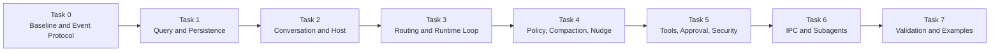

# Runtime Architecture Implementation Plan

## 1. Working Agreement

Every task follows the same review-gated process:

```text
Design discussion
    ↓
Resolve open questions
    ↓
Freeze interfaces and diagrams
    ↓
Explicit implementation approval
    ↓
Implement only the approved task
    ↓
Run focused validation
    ↓
Stop for review
```

Rules:

- Do not automatically continue into the next task.
- Do not implement a task while its listed questions remain unresolved.
- Do not silently invent behavior when a protocol or lifecycle semantic is unclear.
- Keep each implementation focused on the reviewed task boundary.
- Report changed files, public interfaces, validation results, and remaining risks after each implementation.
- Update architecture documentation when an approved decision changes an existing diagram or contract.
- The dedicated Novel domain model remains outside this implementation plan until separately reviewed.

## 2. Task Overview



## 3. Task 0: Code and Protocol Baseline

### 3.1 Task 0A: Existing Draft Cleanup

Purpose:

- Establish a clean starting point before adding new Runtime abstractions.
- Remove or isolate provisional code that conflicts with the accepted architecture.

Review before implementation:

- Whether `ResumeInputEvent` is removed from source and exports or retained only as non-public provisional code.
- Whether the existing Pi-coupled `BaseTool` draft is removed immediately or left untouched until the Tool task.
- Whether the existing `ToolDetails` draft is removed with `BaseTool` or retained as an undecided placeholder.
- Whether `@earendil-works/pi-agent-core` remains installed before the Pi Adapter task.
- Whether `typebox` remains installed before the Tool Schema task.

Current recommendation:

- Remove `ResumeInputEvent` from the first-version public protocol.
- Remove the current Pi-coupled Tool abstraction before implementing the new Tool boundary.
- Keep `@earendil-works/pi-agent-core` because Pi is the selected Agent foundation.
- Keep `typebox` provisionally because Tool parameter schemas are expected to use it.

Expected implementation boundary after approval:

- Cleanup only the explicitly approved provisional files and exports.
- Do not introduce Conversation, Runtime, Tool Registry, or IPC implementations.

### 3.2 Task 0B: Event Protocol

Purpose:

- Freeze the process-independent protocol shared by CLI, TUI, GUI, Web, local Runtime, child Runtime, persistence, and replay.

Design scope:

- `EventEnvelope`
- `InputEventSnapshot`
- `OutputEventSnapshot`
- `conversationId`
- `runId`
- `turnId`
- `toolCallId`
- `approvalRequestId`
- `sequence`
- `correlationId`
- `causationId`
- `schemaVersion`
- `InputReceipt`
- EventType naming conventions
- event serialization and validation
- payload redaction and size limits
- class-to-wire conversion boundaries

Questions to resolve before implementation:

1. Does one Conversation use one unified Journal sequence for inputs, outputs, and state transitions?
2. If output consumers observe gaps caused by non-output records, is that acceptable or should OutputEvent have a separate output sequence?
3. Does `InputReceipt` mean received, durably accepted, routed, or fully processed?
4. Which output event confirms durable acceptance of an InputEvent?
5. Is `inputEventSnapshot` optional, reduced, or replaced by a Journal reference?
6. What are the EventType prefix and versioning conventions?
7. Which runtime validates payload schemas at local, IPC, and persistence boundaries?
8. How are unknown future event types handled by older clients?

Expected deliverables after approval:

- protocol types
- event codecs or validators
- ID helpers
- snapshot rules
- event serialization tests
- protocol documentation

Explicitly excluded:

- ConversationRuntime
- Journal implementation
- Pi Adapter
- Tool execution
- IPC transport

## 4. Task 1: Query and Persistence

Purpose:

- Make durable Conversation history readable without creating a Runtime or child process.

Design scope:

- `WorkspaceStoreLocator`
- semantic Store directory naming
- `workspace-index.json` and explicit rebind
- `ConversationMetadataStore`
- `ConversationAgentBindingStore`
- `conversation_agent_bindings`
- `ConversationJournalService`
- `JournalReader`
- `JournalWriter`
- per-Conversation `messages.jsonl`
- `SnapshotStore`
- `ConversationEventHub`
- `ConversationQueryService`
- `events.list()`
- `events.subscribe()`
- catch-up-to-live subscription
- `storageDir` and `workdir`
- storage schema versions
- storage locking and ownership

Accepted decisions:

1. One canonical Workspace root maps to one semantic Store directory and one `novel.db`.
2. `workspace-index.json` owns the `workspaceRoot → workspaceId → storeDir` mapping; project moves use explicit rebind.
3. Conversation metadata and the unified Input/Output Journal use SQLite.
4. Every Conversation uses its own repairable `messages.jsonl` Runtime message projection.
5. The public observable history is `conversation.events`, containing persisted InputEvent and OutputEvent records.
6. Agent bindings are normalized into `conversation_agent_bindings`; one active binding is allowed per Conversation.
7. Persisted Agent bindings always contain an exact Agent type and definition version, while the upper layer resolves Prompt, Tools, Policy, and Provider.
8. Journal append succeeds before live publication or Message projection.
9. Snapshots accelerate restoration but never replace Journal history.
10. Runtime, Journal, Message, Snapshot, and Catalog ports use Promise-based asynchronous contracts.
11. The initial Node SQLite adapter follows Pi's boundary principle: Promise-based domain Storage ports encapsulate direct `DatabaseSync` calls without exposing synchronous database APIs to Core callers.
12. Task 1B does not introduce Storage Worker RPC or a generic thread pool. A Worker-backed adapter remains a compatible future optimization triggered by measured event-loop delay.
13. The project uses an async-first hybrid concurrency model: asynchronous system boundaries, one serialized Runtime state owner per active Conversation, synchronous lightweight domain computation, and Worker, process, or Rust-backed isolation only for measured heavy or blocking work.

Task breakdown:

- Task 1A: Workspace location, SQLite initialization, Conversation metadata, and Agent binding.
- Task 1B: Unified SQLite Journal, sequence allocation, idempotency, and history queries.
- Task 1C: Per-Conversation Messages JSONL, projection, validation, and Journal repair.
- Task 1D: ConversationEventHub, catch-up-to-live delivery, and backpressure.

Implementation status:

- Task 1A implemented: Workspace location, semantic Store naming, SQLite initialization, Conversation metadata, and single-active Agent binding persistence.
- Task 1B implemented and awaiting review: unified SQLite Input/Output Journal, per-Conversation Sequence allocation, Event ID idempotency, canonical JSON integrity, stable history pagination, unknown historical event replay, and shared Workspace Store ownership.
- Tasks 1C and 1D remain unimplemented and require their own review before coding.

Task 1B concurrency boundary:

```text
Async ConversationJournalStore
    ↓
Direct Node SQLite adapter
    ↓
DatabaseSync
```

- `async` methods do not imply a Worker Thread and must not be described as non-blocking SQLite I/O.
- the Node adapter keeps SQL transactions small, result pages bounded, and JSON processing outside critical transactions where possible.
- Conversation, Runtime, Tool, Provider, Event, IPC, and Storage boundaries remain asynchronous even though the initial SQLite leaf implementation is synchronous.
- each active Conversation serializes Run, Turn, Context, control, and lifecycle state mutation; concurrent completion results re-enter that serialized transition path.
- pure in-memory validation, registry lookup, value conversion, and small state transitions remain synchronous rather than receiving artificial Promise wrappers.
- no Storage Worker, Worker RPC protocol, or connection pool is implemented in Task 1B.
- the database capability remains replaceable so a future Worker adapter can preserve the same Journal and Catalog interfaces.

Task 1B delivered:

- platform-neutral asynchronous Journal reader and writer ports
- persisted InputEvent and OutputEvent snapshots with Direction, Sequence, and RecordedAt
- strict canonical JSON serialization and SHA-256 integrity hashes
- SQLite schema migration V2 with Journal indexes and foreign keys
- atomic per-Conversation Sequence allocation and Event ID idempotency
- duplicate receipts and conflicting Event ID rejection
- strict known InputEvent writes and extensible unknown OutputEvent writes
- tolerant unknown historical InputEvent and OutputEvent replay
- corruption detection for JSON, hashes, envelopes, and extracted columns
- stable paginated queries with Start, End, After, Before, ThroughSequence, and filters
- `SqliteWorkspaceStore.open()` and `close()` ownership of one database connection, Catalog, and Journal
- focused temporary smoke validation without adding a new test framework

Explicitly excluded:

- per-Conversation `messages.jsonl` projection and Journal repair, deferred to Task 1C
- `ConversationEventHub`, follow subscription, catch-up-to-live, and backpressure, deferred to Task 1D
- Snapshot persistence contracts and implementations
- Agent execution
- Runtime activation
- Tool execution
- child processes

## 5. Task 2: Conversation and Host

Purpose:

- Establish the public Conversation Handle and the services that separate querying from execution commands.

Design scope:

- `Conversation`
- `LocalConversation`
- `ConversationProxy` interface boundary
- `ConversationInput`
- `ConversationEvents`
- `ConversationQueryService`
- `ConversationCommandService`
- `ConversationHost`
- `RuntimePresence`
- `ConversationStatus`
- `RunStatus`
- `RuntimeBootstrap`
- runtime placement abstraction
- lazy Runtime activation

Questions to resolve before implementation:

1. Which InputEvents activate an offline Runtime?
2. Which commands can be handled entirely by Host services?
3. Can one Conversation have more than one concurrent active Run?
4. Does each accepted user message always create a new Run?
5. How is an active Runtime located and addressed?
6. When may the Host evict an idle Runtime?
7. What automatic recovery behavior follows a Runtime crash?
8. Which parts of RuntimeBootstrap are loaded from Snapshot versus configuration?
9. How is Conversation access authorization represented without coupling Core to one UI?

Expected deliverables after approval:

- public Conversation interfaces
- local Conversation implementation
- query and command service interfaces
- Host lifecycle skeleton
- Runtime presence tracking
- Runtime bootstrap contract
- no-process replay integration tests

Explicitly excluded:

- complete Agent execution loop
- full IPC process implementation
- Tool pipeline
- Subagent execution

## 6. Task 3: Input Routing and Runtime Loop

Purpose:

- Execute accepted inputs without deadlocking control events while a Turn, Tool, or Interaction is waiting.

Design scope:

- `ConversationRuntime`
- `InputRouter`
- Control Lane
- Turn Lane
- `RunStateMachine`
- `TurnController`
- `StopInputEvent` semantics
- future `InterruptInputEvent` semantics
- cancellation propagation
- Pi Agent Core Adapter foundation
- base `ContextCompiler`
- Runtime-to-Journal event sink

Questions to resolve before implementation:

1. Does Stop cancel only the active Run or also queued Turn inputs?
2. Does Stop always cancel all child Conversations?
3. How is an unfinished Assistant draft handled after cancellation?
4. What exactly does Interrupt cancel compared with Stop?
5. Does an appended user message steer the current Run or create a later Run?
6. How does a Tool receive and acknowledge cancellation?
7. How do Pi's internal model calls map to core-owned `turnId` values?
8. Which Pi messages enter canonical history?
9. Which Runtime state is persisted after each Turn boundary?
10. What happens when the Journal append acknowledgement fails during execution?

Expected deliverables after approval:

- Runtime execution skeleton
- control and turn routing
- Run state transitions
- stop and cancellation path
- Pi Adapter foundation
- base Context compilation
- focused routing and cancellation tests

Explicitly excluded:

- Runtime policies
- Context Compaction
- Nudge delivery
- Tool implementation beyond temporary test doubles
- child-process transport

## 7. Task 4: Policy, Compaction, and Nudge

Purpose:

- Evaluate Runtime conditions, compact model context without deleting history, and inject one-shot System Reminders.

Design scope:

- `RuntimePolicyEngine`
- `RuntimePolicy`
- `RuntimePolicyContext`
- `RuntimePolicyState`
- `RuntimePolicyEffect`
- `RuntimeEffectCoordinator`
- `ContextPressurePolicy`
- `ContextCompactionManager`
- `ContextCompactor`
- `ContextCheckpoint`
- `NudgeManager`
- `PendingNudgeStore`
- `NudgeEffect`
- per-call System Prompt Overlay
- compaction and Nudge lifecycle events

Questions to resolve before implementation:

1. What are the soft context reminder, compaction, and hard context thresholds?
2. What post-compaction target ratio is desired?
3. How many new uncompacted tokens are required before another compaction?
4. Which messages and Runtime facts are always pinned?
5. What structured fields belong in `ContextCheckpoint`?
6. Does compaction use the active Provider, a dedicated model, or a pluggable Compactor?
7. How is a Compaction result validated before becoming active?
8. How many Nudges may be injected into one Provider call?
9. How are Nudge priority, deduplication, cooldown, and expiry configured?
10. When is a Nudge considered delivered: context compilation, stream creation, or Provider dispatch?
11. How is a leased Nudge recovered if dispatch fails?
12. Which Policy evaluation events are public OutputEvents versus internal traces?

Expected deliverables after approval:

- pure Policy evaluation engine
- typed Effect routing
- durable ContextCheckpoint creation
- Pi `transformContext()` projection
- Pending Nudge lifecycle
- one-shot System Prompt Overlay
- lifecycle OutputEvents
- compaction and one-shot delivery tests

Explicitly excluded:

- generic Pause or Resume
- Novel-specific context schema
- Tool Permission policies
- Subagent scheduling policies unless separately reviewed

## 8. Task 5: Tools, Approval, and Security

This task has two separate review gates.

### 8.1 Task 5A: Tool Definition and Registry

Purpose:

- Define core-owned Tool contracts without leaking Pi types.

Design scope:

- `ToolDescriptor`
- `ToolHandler`
- `RegisteredTool`
- `ToolRegistry`
- `ToolRegistryView`
- Tool Group Manifest
- YAML loading and validation
- `PiToolAdapter`
- Tool Result
- Tool incremental update
- Tool Error
- optional Tool Details

Questions to resolve before implementation:

1. What are the final YAML Manifest fields?
2. Which fields belong in YAML versus TypeScript registration code?
3. Is TypeBox the required parameter-schema representation?
4. Does `ToolDetails` remain an abstract base, a generic type, or no common abstraction?
5. What is the successful Tool Result contract?
6. How are streaming updates represented?
7. How do Registry merge conflicts resolve?
8. How are Tool Group views and Conversation allowlists constructed?
9. How does Tool versioning work if a descriptor changes?

Expected deliverables after approval:

- core-owned Tool types
- Tool Registry and scoped views
- Manifest loader and validation
- Pi Tool Adapter
- registry and conversion tests

### 8.2 Task 5B: Execution, Approval, and Sandbox

Purpose:

- Execute Tools through one security and observability pipeline.

Design scope:

- `ToolDispatcher`
- Tool Execution Pipeline
- argument validation
- `PermissionPolicy`
- `InteractionCoordinator`
- Approval Input and Output Events
- `SandboxExecutor`
- timeout and cancellation
- Tool Trace
- result normalization
- structured error normalization

Questions to resolve before implementation:

1. Where do `allow`, `ask`, and `deny` rules come from?
2. What does approve once authorize exactly?
3. Does a changed Tool argument require a new approval request?
4. What is the initial Sandbox implementation?
5. Which Tools are non-interruptible, cancel-only, restartable, or checkpointable?
6. How are partially completed side effects reported?
7. How does the Runtime decide whether to retry a retryable ToolError?
8. How are multiple simultaneous approvals displayed and resolved?
9. How is the approving actor derived from trusted transport metadata?
10. What trace data is persisted and what data must be redacted?

Expected deliverables after approval:

- Tool execution facade and middleware pipeline
- permission evaluation
- event-based approval
- sandbox port and initial implementation
- cancellation and timeout behavior
- Tool trace persistence
- security and approval tests

## 9. Task 6: IPC and Subagents

This task has two separate review gates.

### 9.1 Task 6A: IPC and Process Management

Purpose:

- Run ConversationRuntime outside the Host process without changing the public Conversation API.

Design scope:

- transport-independent request, response, and event messages
- protocol version negotiation
- JSONL stdio transport candidate
- `ConversationProxy`
- child Runtime bootstrap
- process supervisor
- heartbeat and health state
- Runtime command routing
- cancellation protocol
- Journal append request and acknowledgement
- graceful shutdown and crash recovery

Questions to resolve before implementation:

1. Is JSONL over stdio the initial transport?
2. Does one child process host one Runtime or multiple Runtimes?
3. Which component owns Provider credentials and how are they transferred?
4. How often are heartbeats sent and when is a process considered dead?
5. How many automatic restart attempts are allowed?
6. How are duplicate requests detected after reconnect?
7. How are in-flight Tool and Interaction states restored after a crash?
8. How is IPC backpressure handled?
9. Which messages require durable acknowledgement?
10. How are incompatible protocol versions rejected?

Expected deliverables after approval:

- transport interfaces
- initial IPC protocol
- child Runtime entrypoint
- process supervisor
- ConversationProxy transport implementation
- heartbeat, cancellation, and recovery tests

### 9.2 Task 6B: Subagent Management

Purpose:

- Create, observe, cancel, and recover child Conversations through the same Host and Runtime abstractions.

Design scope:

- `ChildConversationManager`
- `SubagentRequest`
- `SubagentResult`
- parent and child Conversation metadata
- parent projection OutputEvents
- Conversation tree query and subscription
- child placement policy
- resource and concurrency limits
- cancellation propagation
- child restoration

Questions to resolve before implementation:

1. How does a child return its final result to the parent?
2. Which child events are projected into parent output?
3. Can a Subagent create another Subagent?
4. What is the maximum tree depth?
5. What is the maximum child concurrency per Run and globally?
6. What happens to children when the parent completes, fails, stops, or crashes?
7. Are child Tool permissions inherited, reduced, or independently configured?
8. Does each child use a separate Context and Nudge policy state?
9. How is orphaned child work detected and reclaimed?
10. How does a debugging client subscribe to the whole Conversation tree?

Expected deliverables after approval:

- child Conversation creation and metadata
- parent-child lifecycle manager
- result delivery
- parent projection events
- tree observation
- resource-limit and cancellation tests

## 10. Task 7: Validation, Examples, and Documentation

Purpose:

- Verify that the shared Core architecture works consistently for CLI, TUI, GUI, and Web clients.

Validation scope:

- type checking
- Event serialization and schema validation
- Journal append and recovery
- replay without Runtime activation
- catch-up-to-live subscription continuity
- Runtime activation and idle eviction
- Control Lane responsiveness
- Stop and Interrupt cancellation
- Approval persistence and restoration
- Context Compaction and Checkpoint application
- one-shot System Reminder delivery and disappearance
- Tool Permission and Sandbox behavior
- IPC reconnect and crash recovery
- Subagent lifecycle and parent projection

Example scope:

- in-memory Conversation example
- local persisted Conversation example
- child-process Conversation example
- read-only replay example
- event-based Approval example
- one-shot Nudge example
- Context Compaction example
- Subagent example
- CLI, GUI, and Web integration notes

Questions to resolve before implementation:

1. Which test framework and test directory conventions are used?
2. Which scenarios are required as acceptance tests for the first Runtime release?
3. Are examples executable packages, test fixtures, or documentation snippets?
4. Which performance and memory baselines are measured?
5. Which failure-injection scenarios are required?

Expected deliverables after approval:

- focused unit and integration tests
- executable reference examples
- updated architecture diagrams
- protocol documentation
- client integration guidance
- first-release acceptance checklist

This task does not implement full CLI, GUI, or Web products. It verifies that each can use the same Core contracts.

## 11. Review Checkpoints

Implementation pauses for review after each checkpoint:

```text
Checkpoint 0A: provisional-code cleanup
Checkpoint 0B: event protocol
Checkpoint 1: query and persistence
Checkpoint 2: Conversation and Host
Checkpoint 3: routing and Runtime loop
Checkpoint 4: Policy, Compaction, and Nudge
Checkpoint 5A: Tool definition and registry
Checkpoint 5B: Tool execution and Approval
Checkpoint 6A: IPC and process management
Checkpoint 6B: Subagent management
Checkpoint 7: validation and examples
```

At every checkpoint, the review report includes:

- accepted decisions
- unresolved decisions
- changed public interfaces
- changed files
- validation performed
- known limitations
- proposed next task

No next checkpoint begins without explicit approval.

## 12. Current Position

Task 0A and Task 0B have been implemented and are awaiting review.

Completed Task 0 results include:

- removal of the provisional Resume and Pi-coupled Tool drafts
- strict JSON Event payload contracts
- stable Event metadata and type constants
- Input and Output snapshot migration
- unified persisted-event sequence contract
- durable-acceptance `InputReceipt` semantics
- InputEvent reference in response outputs instead of full snapshot copying
- TypeBox Event Schema Registry and core InputEvent schemas
- Core type checking, build, and protocol smoke validation

Task 1 Query and Persistence has not been authorized. The next action is Task 0 review, followed by Task 1 design confirmation if approved.
