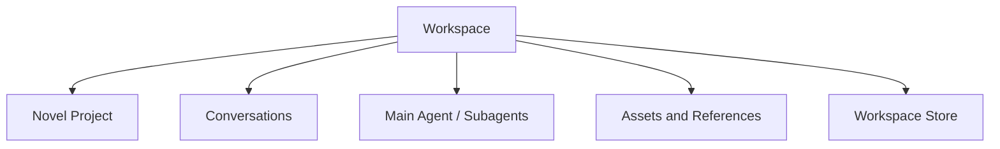
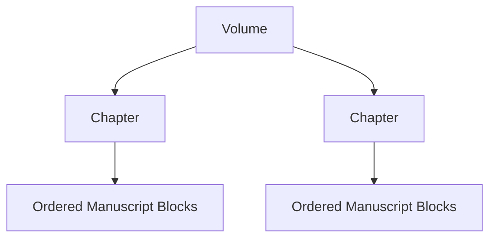

# Novel Domain Working Design

## 1. Document Status

This document records the current Novel-domain design discussion as of August 2, 2026.

- It is a working domain design, not an implementation claim.
- It does not add Novel-domain work to Runtime Task 1 through Task 7.
- Decisions marked **accepted direction** may be used in later Novel-domain planning.
- Decisions marked **current recommendation** still require review before implementation.

## 2. Workspace Boundary

**Accepted direction:** one Workspace corresponds to one Novel project.



- A Workspace owns one Novel project and may contain many Conversations.
- Main agents and subagents operate within the same Workspace access boundary unless explicitly granted read-only external references.
- The canonical Workspace identity remains independent from the physical work directory so an explicit rebind can preserve identity after a project move.
- A future series-level abstraction belongs above Workspace rather than allowing one Workspace to own multiple novels.

## 3. Separate Narrative, Manuscript, and Publication Structures

**Accepted direction:** story decomposition, written content, and publication organization are separate structures.


The Story Outline must not encode `Volume -> Chapter -> Scene` as its required hierarchy. Volume and Chapter are publication concepts, while the Story Outline is a narrative work-breakdown structure similar to a Todo tree.

## 4. Story Outline

### 4.1 Ordered StoryUnit Tree

**Accepted direction:** the outline is an ordered tree of stable `StoryUnit` nodes.

```ts
interface StoryUnit {
  readonly id: StoryUnitId;
  readonly outlineId: StoryOutlineId;
  readonly parentId?: StoryUnitId;
  readonly orderKey: OrderKey;

  readonly title: string;
  readonly intent?: string;
  readonly synopsis?: string;
}
```

- Core does not hard-code first-level, second-level, or third-level nodes.
- A node may be decomposed into smaller ordered child nodes at any time.
- A parent node expresses an aggregate narrative intention and summary rather than a traditional continuous scene.
- A leaf node is the smallest currently planned work unit, but it may later be decomposed without changing its stable identity.
- `StoryUnit` is preferred over calling every level `Scene`; higher-level nodes may represent an arc, sequence, investigation, relationship development, or another aggregate story unit.

An optional semantic scope may help presentation without determining hierarchy:

```ts
type StoryUnitScope =
  | "saga"
  | "arc"
  | "sequence"
  | "scene"
  | "custom";
```

The tree depth and `scope` are independent. User interfaces may show friendly level names without making those names persistence invariants.

### 4.2 Stable Ordering

**Accepted direction:** ordered siblings use stable IDs and opaque fractional ordering keys rather than array indexes or dense integers.

```ts
interface OrderKeyFactory {
  initial(): OrderKey;
  before(next: OrderKey): OrderKey;
  after(previous: OrderKey): OrderKey;
  between(previous: OrderKey, next: OrderKey): OrderKey;
}
```

- Moving a StoryUnit changes only its `parentId` and `orderKey`.
- Inserting a sibling does not renumber all later siblings.
- References always use stable IDs and never use outline paths or array indexes.
- Fractional indexing, LexoRank, or another variable-length lexical rank may implement `OrderKey` behind the stable contract.

## 5. StoryUnit Status

**Current recommendation:** a Todo-like outline needs progress state, but one overloaded `status` is insufficient.

Planning maturity and writing progress answer different questions:

```ts
type StoryUnitPlanningStatus =
  | "idea"
  | "outlined"
  | "ready";

type StoryUnitProgressStatus =
  | "pending"
  | "in-progress"
  | "blocked"
  | "completed"
  | "abandoned";
```

```ts
interface StoryUnit {
  readonly planningStatus: StoryUnitPlanningStatus;
  readonly progressStatus: StoryUnitProgressStatus;
}
```

Semantics:

- `planningStatus` describes whether the story idea is sufficiently defined to write.
- `progressStatus` describes whether its intended manuscript realization has been produced and accepted.
- Writing text does not automatically mean `completed`; completion is an author or workflow decision.
- Leaf progress may be stored directly.
- Composite progress should normally be exposed as a derived roll-up of descendant progress rather than maintained as a conflicting second source of truth.
- Whether a composite node can apply an explicit blocked or abandoned override remains a decision for the command model.

A derived projection may expose aggregate progress:

```ts
interface StoryUnitProgressProjection {
  readonly storyUnitId: StoryUnitId;
  readonly effectiveStatus: StoryUnitProgressStatus;
  readonly completedLeafCount: number;
  readonly totalLeafCount: number;
}
```

## 6. Beat Boundary

**Current recommendation:** Beat is optional and is not a required child type in the base StoryUnit tree.

A Beat is a lightweight ordered intention inside a sufficiently small StoryUnit, usually a scene-sized unit:

```ts
interface StoryBeat {
  readonly id: StoryBeatId;
  readonly storyUnitId: StoryUnitId;
  readonly orderKey: OrderKey;
  readonly intent: string;
  readonly expectedOutcome?: string;
}
```

Recommended rules:

- A StoryUnit does not require Beats.
- Beats help guide scene generation, revision, pacing, and coverage checks.
- Beats do not initially carry the full Todo lifecycle or independent manuscript ownership.
- A Beat that becomes large enough to require independent status, dependencies, assignment, or manuscript realization should be promoted into a child `StoryUnit`.
- Beat realization may later be represented as derived analysis rather than a manually maintained authoritative status.

This keeps the base outline simple for users while allowing more detailed planning when it is useful.

## 7. Manuscript Organization

**Accepted direction:** written content uses stable content Blocks organized by publication containers.

```ts
interface ParagraphBlock {
  readonly id: ManuscriptBlockId;
  readonly chapterId: ChapterId;
  readonly orderKey: OrderKey;
  readonly text: string;
}
```

- Paragraph is the initial persistent editing unit.
- Sentence is not a persistent domain entity; precise operations use offsets within a Block.
- Chapter is an ordered container of Manuscript Blocks rather than a fragile global array-index range.
- Volume is an ordered container of Chapters.
- StoryUnit does not become owned by Chapter merely because its realization appears in that Chapter.



## 8. Manuscript Anchors and Realization

StoryUnits associate with written content through stable Block anchors:

```ts
interface ManuscriptAnchor {
  readonly blockId: ManuscriptBlockId;
  readonly offset?: number;
  readonly bias: "left" | "right";
}

interface ManuscriptRange {
  readonly start: ManuscriptAnchor;
  readonly end: ManuscriptAnchor;
}

interface StoryUnitRealization {
  readonly storyUnitId: StoryUnitId;
  readonly ranges: readonly ManuscriptRange[];
}
```

- Ranges never use array indexes.
- Blocks inserted between existing anchors are naturally included according to current order.
- Anchor bias determines whether insertion at an exact boundary belongs inside or outside a range.
- One StoryUnit may realize across multiple ranges and Chapters.
- Node movement in the outline does not invalidate manuscript realization because the StoryUnit ID remains stable.

Deletion and structural edits require reference preservation:

- Deleted Blocks first become tombstones rather than disappearing while references still exist.
- Splitting a Block preserves one stable ID and records how anchors transform into the new Block.
- Merging Blocks retains a stable target and records a redirect from removed IDs.
- Moving a Block preserves its ID and changes only its container and ordering key.
- Invalid, inverted, disconnected, or orphaned ranges must be surfaced for repair rather than silently reinterpreted.

## 9. Publication Relationship

Chapter and Volume are publication structures whose actual authority is written content.

- A Chapter owns an ordered collection of Manuscript Blocks.
- A Chapter may also have optional planned StoryUnit coverage before content exists.
- Planned StoryUnit coverage answers what the chapter intends to contain; Manuscript Blocks answer what it actually contains.
- A Volume owns ordered Chapters, and its actual manuscript coverage is derived from them rather than duplicated as another authoritative range.
- A Volume may reference a primary higher-level StoryUnit for narrative intent, but that association is not its content boundary.

## 10. Initial Mutation Strategy

**Accepted direction:** initial Novel mutation uses serialized commands and revision checks rather than making the whole domain a CRDT.

```text
Novel Command Queue
    -> validate base revision
    -> apply one mutation
    -> maintain anchors and references
    -> persist
    -> publish Novel Event
```

- Fractional ordering keys handle frequent sibling and paragraph insertion.
- Stable IDs preserve references across movement.
- Tombstones and redirects preserve references across deletion, splitting, and merging.
- Optimistic revisions detect stale concurrent commands.
- A future collaborative editor may introduce CRDT behavior at the Paragraph text adapter boundary without changing the whole Novel domain contract.

## 11. Current Open Questions

The following decisions remain outside the accepted Runtime implementation plan:

1. The exact `OrderKey` algorithm and rebalance policy.
2. Whether composite StoryUnits may explicitly override derived blocked or abandoned progress.
3. Whether planned Chapter coverage uses a contiguous leaf range, an explicit ordered selection, or both.
4. The exact command and event contracts for Block split, merge, move, and anchor repair.
5. The storage layout for Manuscript Blocks and Novel-domain Journal records.
6. The promotion workflow from `StoryBeat` to child `StoryUnit`.
7. Whether Beat realization is stored, derived, or omitted in the first implementation.
